## PAR {.tabset .tabset-fade .tabset-pills}
***

### 


### Methods
PAR values are from flourecien placed every 5 meters along streams. Three 1mL stint vials were placed every 5 meters in each reach and the average value of the three was used. To account for natural fluctuations in FL flourecence, controls wrapped in tin foil were placed at random 5 meter intervals with the 3 replicate vials.  The measured means were then adjusted by the mean natural change in control values.

### Figures


```r
FL$Stream <- recode(FL$Stream, Loon = "LOON", MCTE = "MCTE", `W-100` = "W-100", `W-113` = "W-113", Chucksney = "CHUCK")
FL$Stream <- factor(FL$Stream, levels = c("LOON", "MCTE", "W-113", "W-100", "CHUCK"))
FL$Reach<-as.factor(FL$Reach)
FL$Meter<-as.factor(FL$Meter)
FL$PAR<- as.numeric(FL$PAR)
```

```
## Warning: NAs introduced by coercion
```

```r
PAR.mean <- aggregate(PAR ~ Stream + Reach + Meter, mean, data = FL)

PAR.mean %>% filter(Stream != "W-122") %>%
  
  ggplot(aes(x = Meter, y = PAR, color = Reach, group = Reach)) +
    geom_line(size = 3) +
    ylab("PAR (mol/m^2 day)")+ scale_x_discrete(breaks = seq(0, 90, by = 15)) +
    labs(title = "Post Treatment",
         y = "PAR (mol/m^2 day)",
         x = "Meter",
         color = "Reach") + 
    ylim(0,18) +
    facet_wrap("Stream") +
    scale_color_viridis_d(option = "E") +
    theme(legend.position = c(.84, .27), legend.key.width = unit(3, "cm"),
          aspect.ratio = 1)
```

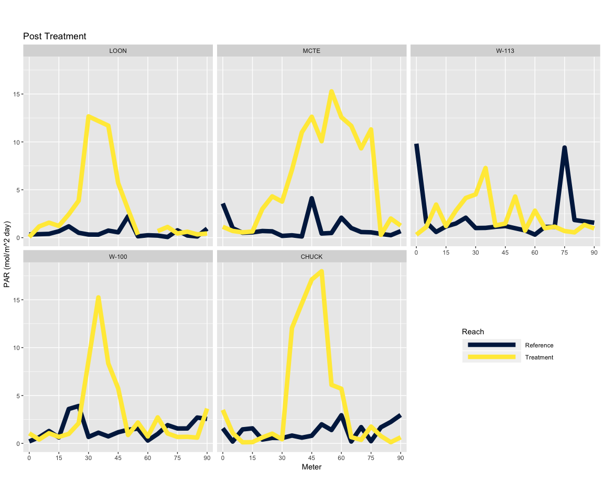<!-- -->

## Chlorophyll $\alpha$ {.tabset .tabset-fade .tabset-pills}
***

###

### Methods
Chlorophyll \alpha\ values were measured using a BenthoTorch. Three tiles every 10 meters

### Figures


```r
# Change variables to factors.  Re-order with CHUCK at the end
Both_years$Stream <- factor(Both_years$Stream, levels = c("LOON", "MCTE", "W-113", "W-100", "CHUCK", "W-122"))
Both_years$Year <- factor(Both_years$Year, levels = c("2018", "2017"))
Both_years$Year.Treatment <- as.factor(Both_years$Year.Treatment)
Both_years$Treatment <- as.factor(Both_years$Treatment)
Both_years$Meter <- as.factor(Both_years$Meter)
Both_years$BenthoTotal <- as.numeric(Both_years$BenthoTotal)

# Drop W-122.
Both_years <- Both_years %>% filter(Stream != "W-122")

# Calculate mean of the three tiles for each meter
bentho_both.mean <- aggregate(BenthoTotal ~ Stream + Treatment + Year.Treatment + Meter + Year, mean, data = Both_years)
bentho.reach <- aggregate(BenthoTotal ~ Stream + Treatment + Year.Treatment + Year, mean, data = Both_years)
write_csv(bentho.reach, "./Data/bentho.reach.csv")

ggplot(data = bentho_both.mean) +
  geom_line(mapping = aes(x = Meter, y = BenthoTotal, color = Treatment, 
  linetype = Year, group = Year.Treatment), size = 3) +
  labs(title = "Chlorophyll a by Meter Pre and Post Treatment", 
       y = "Chlorophyll a (ug/cm^2)",
       x = "Meter",
       color = "Reach") + 
  scale_x_discrete(breaks = seq(0, 90, by = 15)) +
  scale_color_viridis_d(option = "E") +
  facet_wrap("Stream") +
  theme(legend.position = c(.86, .2), legend.key.width = unit(3, "cm"),
        aspect.ratio = 1)
```

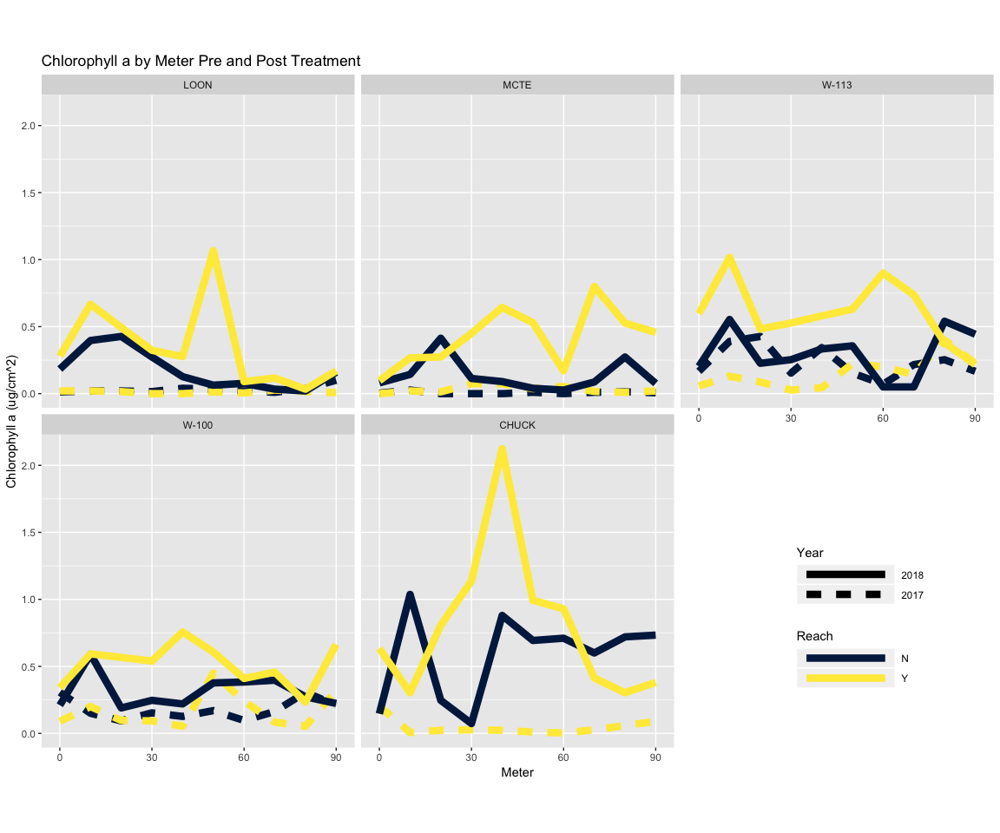<!-- -->

## Benthic Invertebrates {.tabset .tabset-fade .tabset-pills}
***

### Benthic Setup
***

In order to calculate density we must take into account that our count values are from a subsample of three pooled samples.


```r
#Calculations...
bugs$Density <- bugs$Count / bugs$PercentSub / .09  #Calculate total in pooled sample

bugs$CollDate <- as.Date(bugs$CollDate, format = "%m/%d/%y") %>% year() %>% as.factor()

bugs.agg <- bugs %>%
  group_by(CollDate, Stream, Treatment, Taxon) %>%
  summarise_at(vars(Density), funs(sum)) %>% ungroup
```

```
## Warning: funs() is soft deprecated as of dplyr 0.8.0
## please use list() instead
## 
## # Before:
## funs(name = f(.)
## 
## # After: 
## list(name = ~f(.))
## This warning is displayed once per session.
```

```r
bugs.agg$Density <- bugs.agg$Density / 3    #Divide by number of samples pooled
```

***

We divide Count by percent subsampled (actually a fraction) to get a count for the total sample taken.  We then divide by .09 which is the area of the surber sampler (in m$^2$). We then aggregate and divide by three (There were three samples taken per reach).


```r
# Spread and then gather to fill missing Taxons with 0's
bugs.agg <- spread(bugs.agg, key = "Taxon", value = "Density") %>% #bugs.agg is benthic samples
  mutate_if(is.numeric , replace_na, replace = 0) %>% 
  gather(key = "Taxon", value = "Density", 4:ncol(.))
```


```r
# Add FFG and size classes
bugs.agg <- merge(bugs.agg, sizes) %>% merge(., ffg)

bugs.agg <- bugs.agg %>% mutate(StreamTreat = interaction(Stream, Treatment, sep = " "))
bugs.agg <- bugs.agg %>% mutate(YearTreat = interaction(CollDate, Treatment, sep = " "))

# Create list of CollDate, Stream and Taxon
bugs.reach.diff <- bugs.agg %>% select(-c("Density", "CollDate")) %>% unique()

# Calculate Differences
bugs.reach.diff$Diff <- bugs.agg$Density[bugs.agg$CollDate == "2018"] -     
  bugs.agg$Density[bugs.agg$CollDate == "2017"]

# Filter for only 2018 bugs
bugs18 <- filter(bugs.agg, CollDate == "2018")

bugs.treat <- bugs.agg %>% 
  group_by(Stream, Treatment, StreamTreat, YearTreat, FFG) %>%
  summarise_at(vars(Density), funs(sum)) %>% ungroup

bugs.treat <- bugs.agg %>% select(-c("Density", "CollDate")) %>% unique()
```


### Statistics


```r
# Find total density for all bugs per stream-reach and total density by FFG
bug_totals <- bugs.agg %>% group_by(Stream, Treatment, CollDate, YearTreat, StreamTreat) %>% 
  summarise_at(vars(Density), sum)
ffg_totals <- bugs.agg %>% group_by(Stream, Treatment, CollDate, YearTreat, StreamTreat, FFG) %>% 
  summarise_at(vars(Density), sum)

# Log transform density
bug_totals <- bug_totals %>% mutate(logDensity = log(Density))
ffg_totals <- ffg_totals %>% mutate(logDensity = log(Density))
```

We will start with plotting total invertebrate density for a single stream with both reaches for both years in order to get a feel for the raw data.  Ultimately we will be taking the ratio between years for each reach and then comparing the change between years in the treatment reach to the change between years of the control reach to assess the effects of the canopy-opening treatment.


```r
bug_totals %>% filter(Stream == "W-113") %>%
  ggplot(aes(x = YearTreat, y = Density, group = CollDate, fill = Treatment)) +
  geom_col() +
  labs(title = "W-113 Invertebrate Density by Year and Reach",
       x = "Year and Treatment \n (Y = Treatment reach, N = Control reach)",
       y = "Invertebrate Density") +
  scale_fill_grey() +
    scale_color_grey()
```

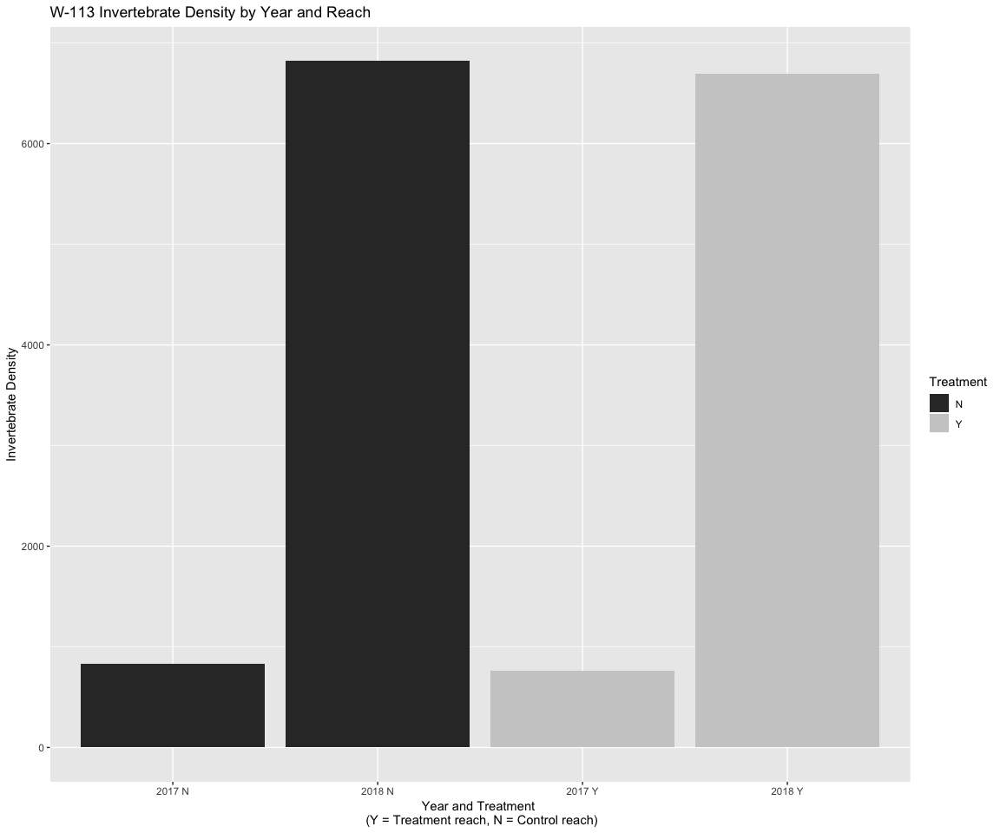<!-- -->

Next we plot log ratios between years (2018Y / 2017Y and 2018N / 2017N) for a single stream

A log ratio of 0 indicates no change in abundance between 2017 and 2018. Positive values mean an increase in abundance in the post-treatment year, and a negative value would suggest a decline in abundance in the post-treatment year.  We then compare the yearly ratio's of each reach (control or treatment) to assess the effect of the treatment.


```r
ffg.ratios %>%  group_by(Stream, Treatment) %>% summarise_at(vars(Difference, Ratio, `Log(Ratio) Year`), mean) %>% 
  filter(Stream == "W-113") %>% 
  ggplot(aes(x = Treatment, y = `Log(Ratio) Year`, fill = Treatment)) +
  geom_col() +
  labs(title = "W-113 Log of Invertebrate Density Ratio's \n (2018 / 2017)",
       x = "Treatment \n (Y = Treatment reach, N = Control reach)",
       y = "Log(Ratio) of Invertebrate Density") +
  scale_fill_grey() +
    scale_color_grey()
```

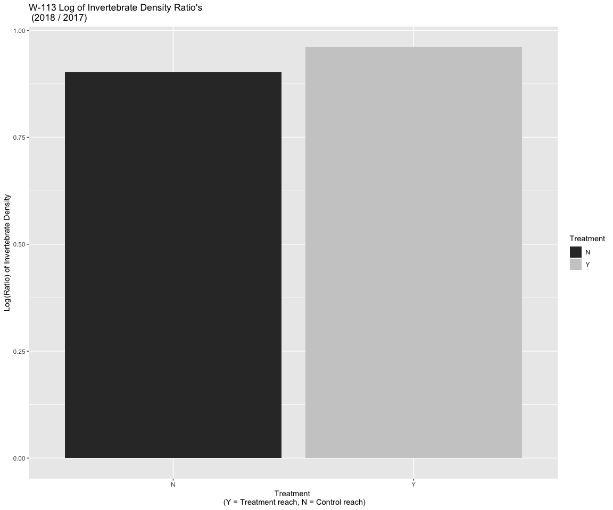<!-- -->


Now we plot all the log ratios


```r
ffg.ratios %>%  group_by(Stream, Treatment) %>% summarise_at(vars(Difference, Ratio, `Log(Ratio) Year`), mean) %>% 
  ggplot(aes(x = Stream, y = `Log(Ratio) Year`, fill = Treatment)) +
  geom_col(position = "dodge") +
  labs(title = "Log of Invertebrate Density Ratio's \n (2018 / 2017)",
       x = "Treatment \n (Y = Treatment reach, N = Control reach)",
       y = "Log(Ratio) of Invertebrate Density") +
  scale_fill_grey() +
    scale_color_grey()
```

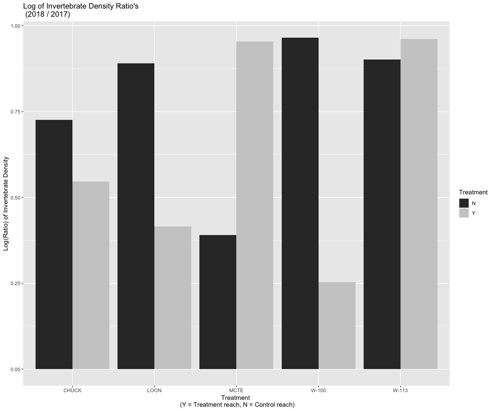<!-- -->


And now the average log ratio across streams for each reach with 95% confidence interval calculated using the t score from Welch's t-test.


```r
bug.ratios <- ffg.ratios %>% group_by(Stream, Treatment) %>% summarise_at(vars(Difference, Ratio, `Log(Ratio) Year`), mean)

#t.test(`Log(Ratio) Year` ~ Treatment, data = bug.ratios)

avg.ratio <- ddply(bug.ratios, .(Treatment), summarize,
                   Mean = mean(`Log(Ratio) Year`),
                   SD = sd(`Log(Ratio) Year`))

avg.ratio %>% 
  ggplot(aes(x = Treatment, y = Mean, fill = Treatment)) +
  geom_col(position = "dodge") +
  geom_errorbar(aes(x = Treatment, ymin = Mean - ((SD*2.345)/sqrt(5)), ymax = Mean + ((SD*2.345)/sqrt(5)), #2.345 is the critical value 7.2983 degrees of freedom 
                    color = Treatment, size = .5), position = "dodge") +
  labs(title = "Average of the log ratio of 2018/2017",
       x = "Treatment",
       y = "Log ratio") +
  theme_bw(base_family = "LM Roman 10") +
  theme(panel.grid.minor = element_blank(),
        panel.grid.major = element_blank(),
        plot.title = element_text(hjust = 0.5),
        plot.caption = element_text(hjust = 0.5, face = "italic", color = "grey"),
        legend.title = element_text(face = "bold")) +
  scale_fill_grey() +
    scale_color_grey()
```

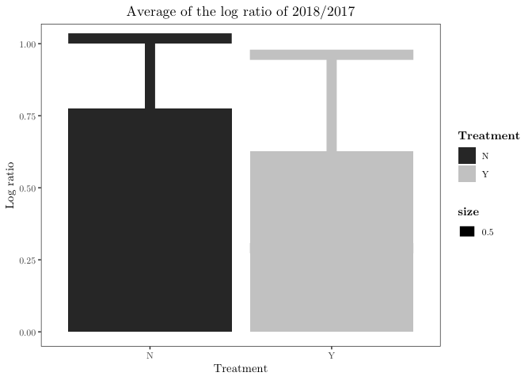<!-- -->

And now do it *all* again for FFG's.  We start with looking at one stream, then the log ratio for that stream, then the log ratio for all streams and finally the average log ratio for each FFG with error bars of one SD.


```r
ffg.ratios %>%  group_by(Stream, Treatment) %>% 
  filter(Stream == "W-113") %>% 
  ggplot(aes(x = Treatment, y = `Log(Ratio) Year`, fill = Treatment)) +
  geom_col() +
  labs(title = "W-113 Log of Invertebrate FFG Density Ratio's \n (2018 / 2017)",
       x = "Treatment \n (Y = Treatment reach, N = Control reach)",
       y = "Log(Ratio) of Invertebrate Density") +
  facet_wrap("FFG") +
  scale_fill_grey() +
    scale_color_grey()
```

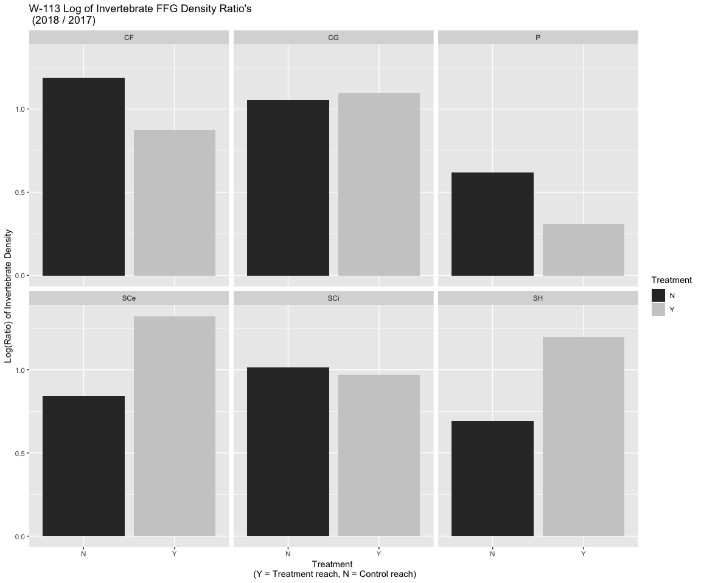<!-- -->


```r
ffg.ratios %>%  
  ggplot(aes(x = Stream, y = `Log(Ratio) Year`, fill = Treatment)) +
  geom_col(position = "dodge") +
  labs(title = "Log of Invertebrate Density Ratio's \n (2018 / 2017)",
       x = "Treatment \n (Y = Treatment reach, N = Control reach)",
       y = "Log(Ratio) of Invertebrate Density") +
  theme_bw(base_family = "LM Roman 10") +
  theme(legend.position = c(.1, .4), 
          legend.key.width = unit(5, "cm"),
          axis.text.x = element_text(angle = 45, vjust = 1, hjust=1),
        panel.grid.minor = element_blank(),
        panel.grid.major = element_blank(),
        plot.title = element_text(hjust = 0.5),
        plot.caption = element_text(hjust = 0.5, face = "italic", color = "grey"),
        legend.title = element_text(face = "bold")) +
  facet_wrap("FFG") +
  scale_fill_grey()+
    scale_color_grey()
```

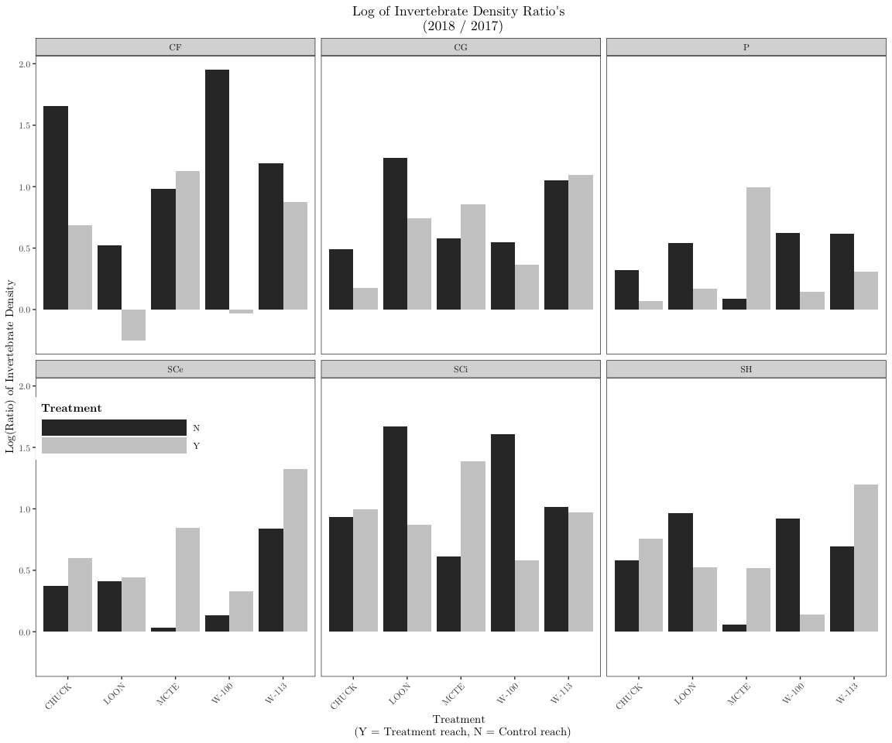<!-- -->


```r
ffg.avg.ratio <- ddply(ffg.ratios, .(FFG, Treatment), summarize,
      Mean = mean(`Log(Ratio) Year`),
      SD = sd(`Log(Ratio) Year`))

ffg_names <- c("SH", "P", "SCe", "CG", "SCi", "CF")

ffg_results <- data.frame("FFG" = numeric(6), "tval" = numeric(6), "pval" = numeric(6))  #initialize data frame
for (i in ffg_names){
  k = match(i, ffg_names)  #find the index of i in ffg_names
  x <- filter(ffg.ratios, FFG == i) %>%
  t.test(`Log(Ratio) Year` ~ Treatment, data = .)
  ffg_results[k, "FFG"] <- i
  ffg_results[k, "tval"] <- x$statistic
  ffg_results[k, "pval"] <- x$p.value
}


ffg.avg.ratio %>% 
  ggplot(aes(x = FFG, y = Mean, fill = Treatment)) +
  geom_col(position = "dodge") +
  geom_errorbar(aes(x = FFG, ymin = Mean - .1, ymax = Mean + ((SD*2.345)/sqrt(5)), 
                    color = Treatment), width = .7, 
                    position = position_dodge(.9)) +
  labs(title = "Average of the log ratio of 2018/2017",
       x = "Treatment",
       y = "Log ratio") +
 theme_bw(base_family = "LM Roman 10") +
  theme(panel.grid.minor = element_blank(),
        panel.grid.major = element_blank(),
        plot.title = element_text(hjust = 0.5),
        plot.caption = element_text(hjust = 0.5, face = "italic", color = "grey"),
        legend.title = element_text(face = "bold")) + 
  scale_fill_viridis_d(option = "E", end = .8) +
    scale_color_viridis_d(option = "E", end = .8) 
```

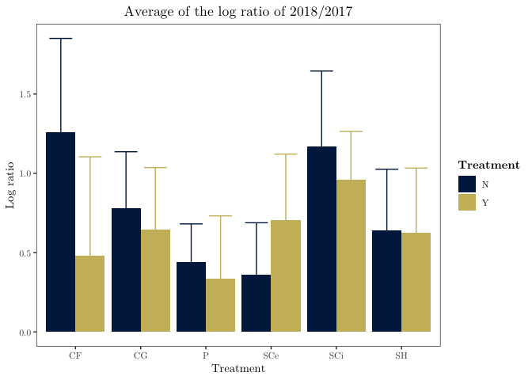<!-- -->

Use differences instead of ratio's to see if there's a difference.


```r
bugs.reach.diff %>% filter(FFG == "SCe" | FFG == "SCi") %>% group_by(Treatment, Taxon) %>% 
  ddply(.(Treatment, Taxon), summarize,
        Mean = mean(Diff),
        SD = sd(Diff)) %>%
  ggplot(aes(x = Taxon, y = Mean, fill = Treatment)) +
    geom_col(position = "dodge") +
  geom_errorbar(aes(x = Taxon, ymin = Mean - ((SD*2.345)/sqrt(5)), ymax = Mean + ((SD*2.345)/sqrt(5)), color = Treatment), position = "dodge") +
    labs(title = "Mean Difference of Scraper Taxa (2018-2017)",
         x = "Taxon",
         y = "Mean Difference in Density") +
  theme(axis.text.x = element_text(angle = 45, vjust = 1, hjust = 1)) +
    scale_fill_grey() +
    scale_color_grey()
```

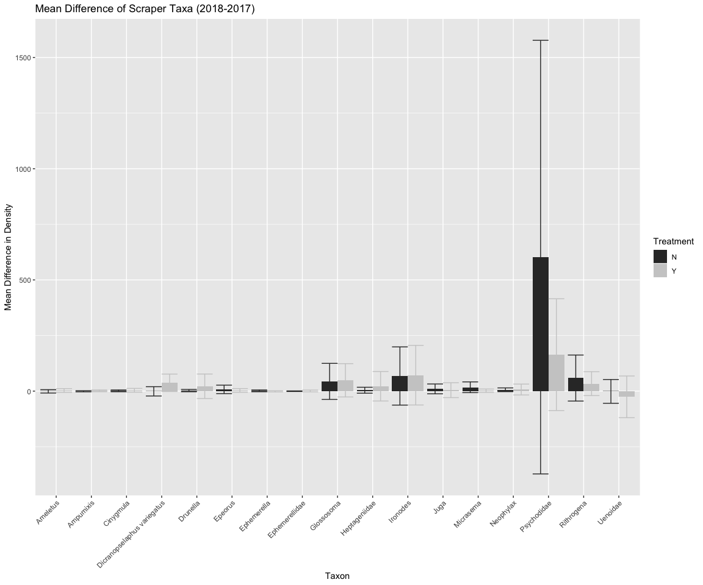<!-- -->

### NMS
***
Who knows what I'm actually doing, all of this ordination stuff is currently pre BOT 570.  I will definitely update all this once I know how to handle singleton taxa, loads of zero's, etc.


```r
# Spread data to get a taxon matrix, create factor of CollDate and Treatment
bugs.mds <- bugs.agg %>% 
  select(-c("FFG", "Size")) %>%
  group_by(Stream, Treatment, CollDate, Taxon) %>%  
  spread(key = "Taxon", value = "Density") %>%
  mutate_if(is.numeric , replace_na, replace = 0) %>% ungroup() %>%
  mutate(YearTreat = interaction(CollDate, Treatment) %>% factor(levels = c("2017.N", "2017.Y", "2018.N", "2018.Y"))) 
```

```
## `mutate_if()` ignored the following grouping variables:
## Columns `Stream`, `Treatment`, `CollDate`
```


```r
# Get grouping variables and taxon matrix
Density <- bugs.mds %>% 
  select("Ameletus":"Zapada")

grouping <- select(Enviro, Stream, Treatment, CollDate, YearTreat, YearTreatQ, BenthoTotal)
```


```
## Run 0 stress 0.09528951 
## Run 1 stress 0.09448769 
## ... New best solution
## ... Procrustes: rmse 0.03052468  max resid 0.1045746 
## Run 2 stress 0.0989568 
## Run 3 stress 0.09448786 
## ... Procrustes: rmse 0.001052967  max resid 0.003726743 
## ... Similar to previous best
## Run 4 stress 0.1006332 
## Run 5 stress 0.09894003 
## Run 6 stress 0.09448738 
## ... New best solution
## ... Procrustes: rmse 0.0008647617  max resid 0.002953491 
## ... Similar to previous best
## Run 7 stress 0.09751274 
## Run 8 stress 0.09529051 
## Run 9 stress 0.1036753 
## Run 10 stress 0.09448784 
## ... Procrustes: rmse 0.0009082259  max resid 0.003106884 
## ... Similar to previous best
## Run 11 stress 0.09448735 
## ... New best solution
## ... Procrustes: rmse 0.0002412752  max resid 0.0007239649 
## ... Similar to previous best
## Run 12 stress 0.09750992 
## Run 13 stress 0.09894059 
## Run 14 stress 0.09893972 
## Run 15 stress 0.09800188 
## Run 16 stress 0.1006329 
## Run 17 stress 0.09448826 
## ... Procrustes: rmse 0.001166937  max resid 0.004181149 
## ... Similar to previous best
## Run 18 stress 0.09746411 
## Run 19 stress 0.09448711 
## ... New best solution
## ... Procrustes: rmse 0.0007825855  max resid 0.002797097 
## ... Similar to previous best
## Run 20 stress 0.09528874 
## *** Solution reached
```


```r
#set up NMDS with dimensions of sol and env factors from "Enviro". 
NMDS <- data.frame(x = sol$points[, 1], y = sol$points[ ,2], 
                   Stream = select(grouping, Stream), 
                   Treatment = select(grouping, Treatment), 
                   CollDate = select(grouping, CollDate),
                   YearTreat = select(grouping, YearTreat),
                   Chla = select(grouping, BenthoTotal),
                   YearTreatQ = select(grouping, YearTreatQ))
```


```r
Reach17N <- NMDS[NMDS$YearTreat == "2017.N", ][chull(NMDS[NMDS$YearTreat == 
    "2017.N", c("x", "y")]), ] 

Reach17Y <- NMDS[NMDS$YearTreat == "2017.Y", ][chull(NMDS[NMDS$YearTreat == 
    "2017.Y", c("x", "y")]), ] 

Reach18N <- NMDS[NMDS$YearTreat == "2018.N", ][chull(NMDS[NMDS$YearTreat == 
    "2018.N", c("x", "y")]), ] 

Reach18Y <- NMDS[NMDS$YearTreat == "2018.Y", ][chull(NMDS[NMDS$YearTreat == 
    "2018.Y", c("x", "y")]), ] 

hull.data <- rbind(Reach17N, Reach17Y, Reach18Y, Reach18N) 
```


```r
vec.env <- envfit(sol, grouping, perm = 1000, na.rm = TRUE)
vec.env.df <- scores(vec.env, display = "vectors") %>% as_tibble() %>% slice(2:n())
vec.env.df$names <- c("Chla", "YearTreatQ") 
```


```r
ggplot(data = NMDS, aes(x, y)) +
  annotate("text", x = (NMDS$x), y = (NMDS$y) + .02, label = NMDS$Stream, size = 8) +
  geom_polygon(hull.data, mapping = aes(x = x, y = y, fill = YearTreat, group = YearTreat), alpha = .2) +
  geom_point(aes(x = x, y = y, shape = Stream), size = 5) +
  geom_segment(data = vec.env.df, aes(x = 0, xend = NMDS1, y = 0, yend = NMDS2),
      arrow = arrow(length = unit(0.1, "cm")), colour = "red", inherit_aes = FALSE, size = 4) +
  geom_text(data = vec.env.df, aes(x = NMDS1, y = NMDS2, label = names), size = 18, color = "red") +
  labs(title = "NMS of Benthic Invertebrate Community",
       x = "Axis 1",
       y = "Axis 2") +
  scale_fill_viridis_d() +
  theme(axis.text.x = element_blank(),  # remove x-axis text
        axis.text.y = element_blank(), # remove y-axis text
        axis.ticks = element_blank(),  # remove axis ticks
        panel.background = element_blank(), 
        panel.grid.major = element_blank(),  #remove major-grid labels
        panel.grid.minor = element_blank(),  #remove minor-grid labels
        plot.background = element_blank(),
        legend.position = c(.08, .76)) 
```

```
## Warning: Ignoring unknown parameters: inherit_aes
```

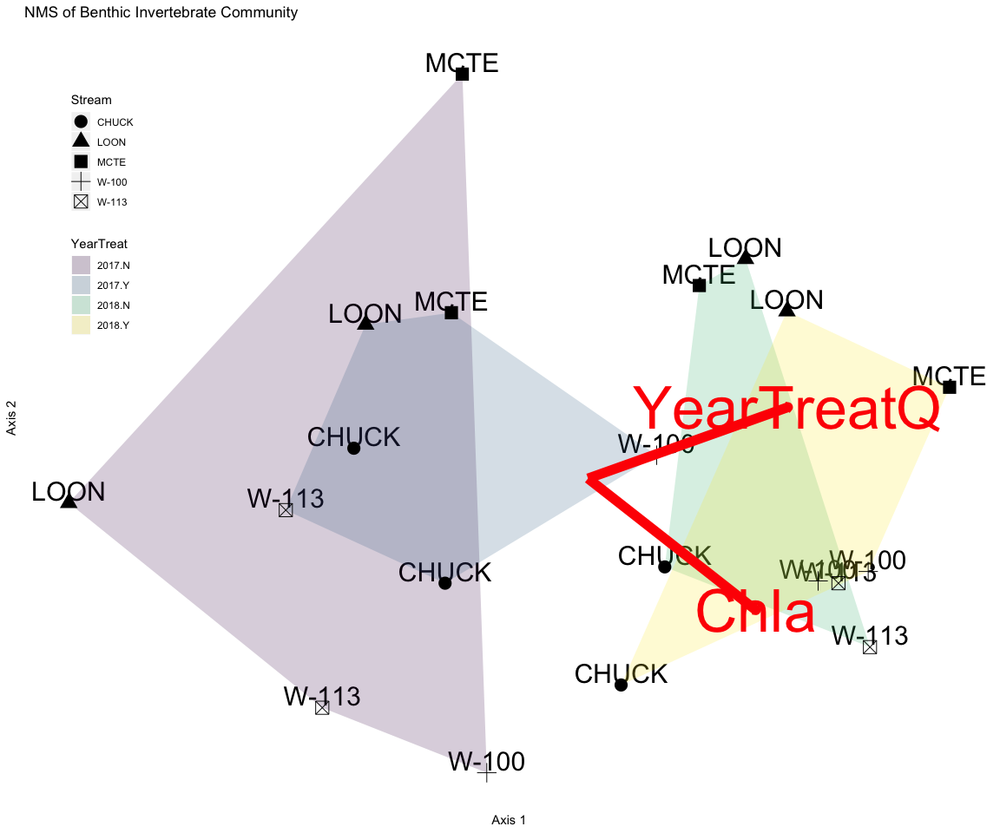<!-- -->

Actually maybe cool result, all of the treatment reaches now plot closer post-gap year. The controls show a similar pattern though maybe a little less pronounced. Everything also shifted left between the two years, although this isn't because of the treatment, just annual changes. Maybe the gap amplified whatever effect the year had, extra, extra light or temperature maybe.


### Summary Info 
***


```r
bugs.agg %>% mutate(CollDate.Treatment = interaction(Treatment, CollDate)) %>%
group_by(Stream, CollDate.Treatment) %>%
  summarise_at(vars(Density), funs(sum)) %>%
  
  ggplot(aes(x = Stream, y = Density, fill = CollDate.Treatment)) + 
  geom_col(position = "dodge") +
  ggtitle("Total Inverebrate Density (m^2)") +
  scale_fill_viridis_d(option = "E") 
```

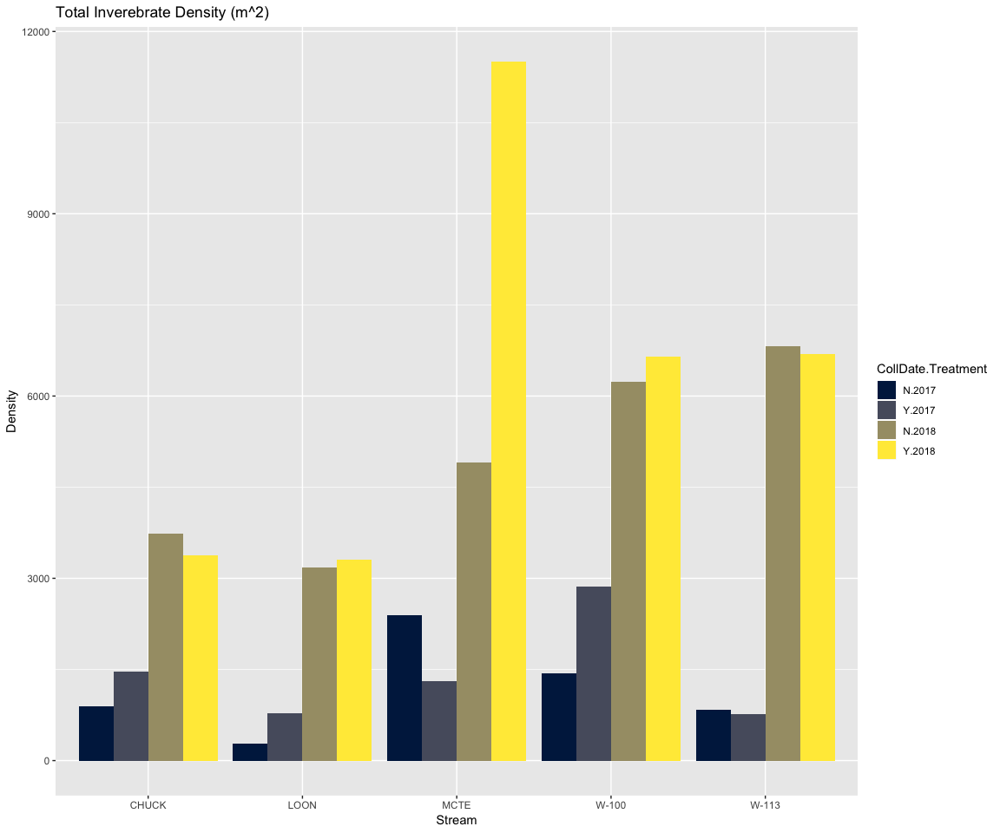<!-- -->

The gap has no real effect, except maybe MCTE. We saw this in the t tests and bar plots, and in the ordination.  

## Diets {.tabset .tabset-fade .tabset-pills}
***

### Diet Setup
***


```r
# Fill missing family's with order
Diets$Family[is.na(Diets$Family)] <- Diets$Order[is.na(Diets$Family)]

# Merge diets, sizes and FFG's
Diets <- merge(Diets, sizes, by.x = "Family", by.y = "Taxon") %>% 
  merge(., ffg, by.x = "Family", by.y = "Taxon")

# Aggregate by rep
Diets.by.fish <- Diets %>% 
  group_by(Family, Stream, Treatment, Origin, FFG, Size, Rep) %>%
  summarise_at("Count", funs(sum)) %>% ungroup

# Aggregate by reach
Diets.reach <- Diets %>% 
  group_by(Family, Stream, Treatment, Origin, FFG, Size) %>%
  summarise_at("Count", funs(sum)) %>% ungroup

# I, Ivlev's Selectivity Index
bugndiet.ffg <- bugndiet.ffg %>% mutate(I = (frac.diet - frac.benthic) / (frac.diet + frac.benthic))

# L, Linear selectivity index
bugndiet.ffg <- bugndiet.ffg %>% mutate(L = (frac.diet - frac.benthic))

# D, Difference selectivity index
bugndiet.ffg <- bugndiet.ffg %>% mutate(D = 
                          (frac.diet - frac.benthic) / (frac.diet + frac.benthic - 2*frac.diet*frac.benthic))

# Q, Quotient selectivity index
bugndiet.ffg <- bugndiet.ffg %>% mutate(Q = (frac.diet*(1-frac.benthic)) / (frac.benthic*(1-frac.diet)))
      

# Calculate average proportion of FFG's in benthos and diet of all streams and avg idex values
avg.ffg.diet <- ddply(bugndiet.ffg, .(Treatment, FFG), summarize,
                   Mean.benthic = mean(frac.benthic),
                   SD.benthic = sd(frac.benthic),
                   Mean.diet = mean(frac.diet),
                   SD.diet = sd(frac.diet),
                   Mean.I = mean(I),
                   SD.I = sd(I),
                   Mean.L = mean(L),
                   SD.L = sd(L),
                    Mean.D = mean(D),
                   SD.D = sd(D),
                   Mean.Q = mean(log(Q)),
                   SD.Q = sd(log(Q)))


# Select only "important" families
bugndiet.select.fam <- bugndiet.fam %>% mutate(Family = recode(Family, "Brachycentridae" = "Brachy", "Chironomidae" = "Chiro", "Juga" = "Juga", "Baetidae" = "Baetid", "Perlidae" = "Perlid", "Ostrocod" = "Ostro", "Elmidae" = "Elmid", "Rhyacophilidae" = "Rhyaco", "Dixidae" = "Dixid", .default = "")) %>% filter(Family != "")

# I, Ivlev's Selectivity index
bugndiet.select.fam <- bugndiet.select.fam %>% mutate(I = (frac.diet - frac.benthic) / (frac.diet + frac.benthic))

# L, Linear selection Index
bugndiet.select.fam <- bugndiet.select.fam %>% mutate(L = (frac.diet - frac.benthic))

# D, Difference selectivity index
bugndiet.select.fam <- bugndiet.select.fam %>% mutate(D = 
                          (frac.diet - frac.benthic) / (frac.diet + frac.benthic - 2*frac.diet*frac.benthic))

# Q, Quotient selectivity index
bugndiet.select.fam <- bugndiet.select.fam %>% mutate(Q = (frac.diet*(1-frac.benthic)) / (frac.benthic*(1-frac.diet)))
                      

# Calculate average proportion of Families in benthos and diet of all streams
avg.fam.diet <- ddply(bugndiet.select.fam, .(Treatment, Family), summarize,
                   Mean.benthic = mean(frac.benthic),
                   SD.benthic = sd(frac.benthic),
                   Mean.diet = mean(frac.diet),
                   SD.diet = sd(frac.diet),
                   Mean.I = mean(I),
                   SD.I = sd(I),
                   Mean.L = mean(L),
                   SD.L = sd(L),
                   Mean.D = mean(D),
                   SD.D = sd(D),
                   Mean.Q = mean(log(Q)),
                   SD.Q = sd(log(Q)))
```


```r
Diets.reach$Stream.Treat <- interaction(Diets.reach$Treatment, Diets.reach$Stream)

Diets.reach %>%
  group_by(Stream.Treat, Origin) %>%
  summarise_at(vars(Count), funs(sum)) %>% ungroup() %>%

ggplot(aes(x = Stream.Treat, y = Count, fill = Origin)) +
  geom_col(position = "stack") +
  labs(title = "Mean Aquatics and Terrestrials \n in Diets by Reach",
       y = "Mean # in Diet",
       x = "Stream and Reach") +
    theme(axis.text.x = element_text(angle = 45, vjust = 1, hjust=1)) +
    scale_fill_viridis_d(option = "E", end = .8)
```

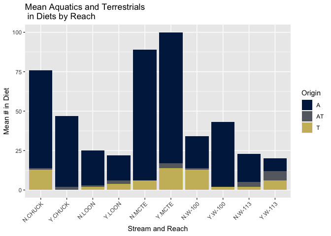<!-- -->


### By Family
***


```r
ggplot(aes(x = Family, y = Count, fill = Treatment), data = Diets.reach) +
  geom_col() +
  coord_flip() 
```

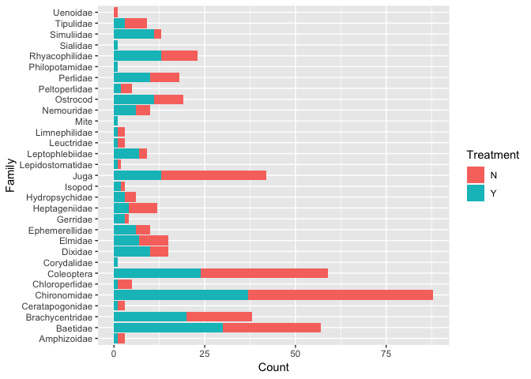<!-- -->

```r
fam.agg <- Diets.reach %>% group_by(Family) %>% summarise_at(vars(Count), sum)
fam.agg$Count[fam.agg$Family == "Chironomidae"] / sum(fam.agg$Count)
```

```
## [1] 0.1837161
```


```r
# Plot proportion of a taxon in the benthic community versus proporion of a taxon in the diet community
ggplot(aes(x = frac.benthic, y = frac.diet, color = Treatment), data = bugndiet.select.fam) +
    geom_point(size = 8) +
    geom_abline(slope = 1, intercept = 0) +
    coord_cartesian(ylim = c(0, .8), xlim = c(0, .8)) +
    geom_text_repel(aes(x = frac.benthic, y = frac.diet, label = Family), size = 8, point.padding = 1, box.padding = .5) +
    labs(title = "Prop. of Taxa in Benthic Comm. \n Vs. Prop. in Diets",
         x = "Proportion of Benthic",
         y = "Proportion of Diet") +
    facet_wrap("Stream", ncol = 3) +
    scale_color_viridis_d(option = "E") +
    theme(panel.grid.minor = element_blank(),
        panel.grid.major = element_blank(),
        panel.background = element_rect(fill = "white", color = "grey"),
        plot.title = element_text(hjust = 0.5),
        plot.caption = element_text(hjust = 0.5, face = "italic", color = "grey"),
        legend.title = element_text(face = "bold"),
          legend.position = c(.84, .27), legend.key.width = unit(3, "cm"),
          aspect.ratio = 1)
```

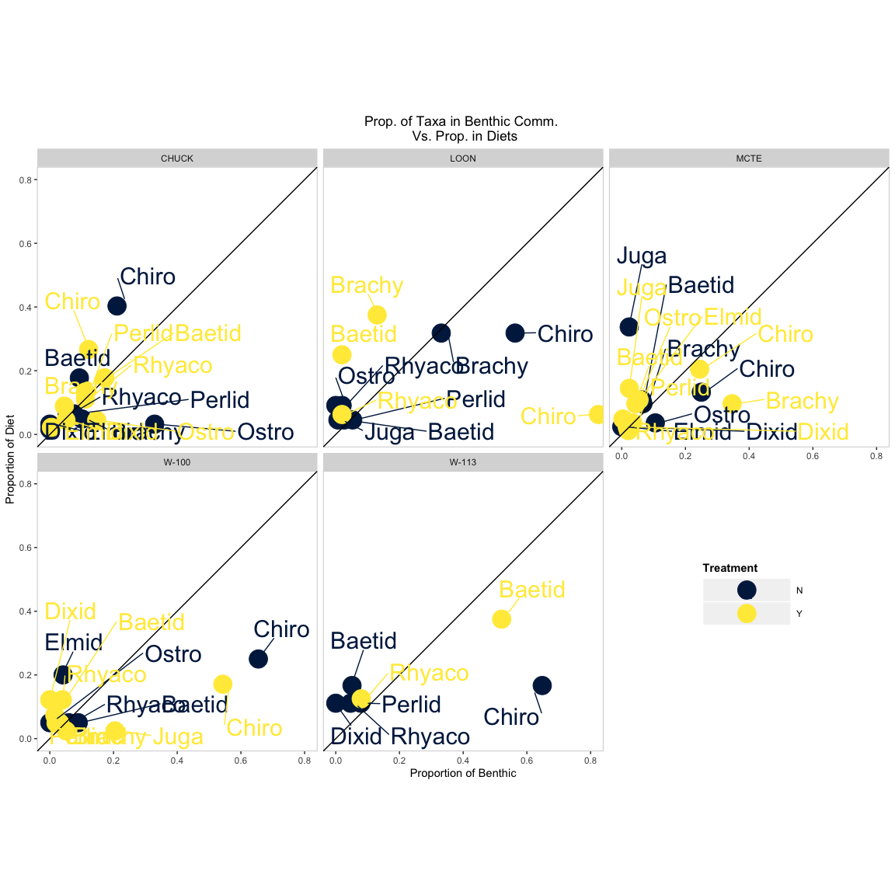<!-- -->


```r
ggplot(aes(x = Mean.benthic, y = Mean.diet), data = avg.fam.diet) +
    geom_jitter(aes(color = Treatment)) +
    geom_abline(slope = 1, intercept = 0, color = "grey") +
    coord_cartesian(ylim = c(0, .47), xlim = c(0, .47)) +
    geom_text_repel(aes(x = Mean.benthic, y = Mean.diet, label = Family), 
                    force = 1.5, segment.alpha = .5, segment.color = "grey") +
    labs(title = "Prop. of Families in Benthic Comm. Vs. Prop. in Diets", 
         x = "Proportion of Benthic",
         y = "Proportion of Diet") +
    scale_color_viridis_d(option = "E", end = .8) +
    theme(panel.grid.minor = element_blank(),
        panel.grid.major = element_blank(),
        panel.background = element_rect(fill = "white", color = "grey"),
        plot.title = element_text(hjust = 0.5),
        plot.caption = element_text(hjust = 0.5, face = "italic", color = "grey"),
        legend.title = element_text(face = "bold"),
          aspect.ratio = 1,
          axis.text.x = element_text(angle = 45, vjust = 1, hjust = 1))
```

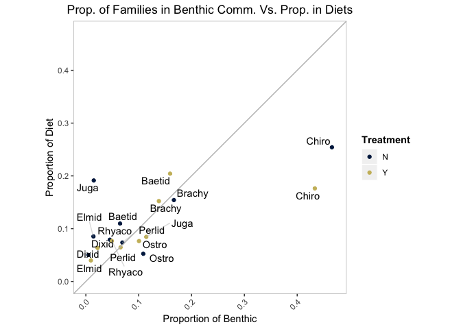<!-- -->


```r
ggplot(aes(x = Family, y = Mean.D, color = Treatment, group = Treatment), data = avg.fam.diet) +
  geom_point(position = position_dodge(width = .6)) +
  geom_errorbar(aes(ymin = Mean.D - SD.D, ymax = Mean.D + SD.D, color = Treatment), position = position_dodge(width = .6)) +
    labs(title = "Difference Selection Index of Trout Feeding on Invert Taxa", 
         x = "Family",
         y = "Difference Selection Index") +
    scale_color_viridis_d(option = "E", end = .8) +
    theme(panel.grid.minor = element_blank(),
        panel.grid.major = element_blank(),
        panel.background = element_rect(fill = "white", color = "grey"),
        plot.title = element_text(hjust = 0.5),
        plot.caption = element_text(hjust = 0.5, face = "italic", color = "grey"),
        legend.title = element_text(face = "bold"),
          aspect.ratio = 1,
          axis.text.x = element_text(angle = 45, vjust = 1, hjust = 1))
```

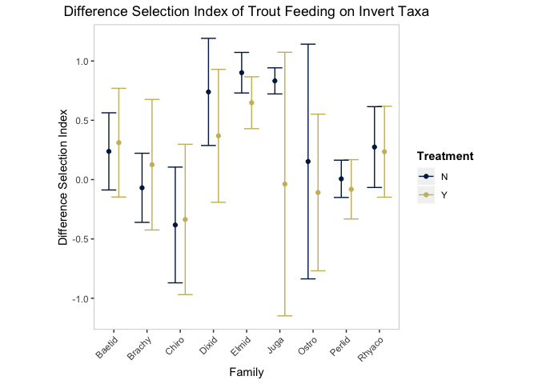<!-- -->


Plot of proportional abundance of an individual taxon in the benthic community versus the proportional abundance of the aggregate diets for that reach. 

Here we see that Chironomidae typically make up the greatest abundance of both the fish diets and the benthic community, with LOON being the exception (Brachycentridae are equally represented in the diets of control reach and over represented in the treatment). In MCTE, Juga compose a large part of the diets relative to their abundance due to one outlier fish. 

There are no overarching differences in how a taxa maps out given the treatment, but the difference in Brachycentridae in LOON between treatment and control is interesting.

### By FFG
***


```r
# Plot proportion of a FFG in the benthic community versus proporion of a FFG in the diet community
bugndiet.ffg %>% 

  ggplot(aes(x = frac.benthic, y = frac.diet, color = Treatment)) +
    geom_point() +
    geom_abline(slope = 1, intercept = 0) +
    coord_cartesian(ylim = c(0, 1), xlim = c(0, 1)) +
    geom_text_repel(aes(x = frac.benthic, y = frac.diet, label = FFG), point.padding = .5, box.padding = .5) +
    facet_wrap("Stream", ncol = 4) +
    labs(title = "Prop. of FFG's in Benthic Comm. Vs. Prop. in Diets", 
         x = "Proportion of Benthic",
         y = "Proportion of Diet") +
    scale_color_viridis_d(option = "E") +
    theme(panel.grid.minor = element_blank(),
        panel.grid.major = element_blank(),
        panel.background = element_rect(fill = "white", color = "grey"),
        plot.title = element_text(hjust = 0.5),
        plot.caption = element_text(hjust = 0.5, face = "italic", color = "grey"),
        legend.title = element_text(face = "bold"),
        legend.position = c(.8, .15),
          axis.title.x = element_text(hjust = -.1),
          aspect.ratio = 1,
          axis.text.x = element_text(angle = 45, vjust = 1, hjust = 1))
```

<!-- -->

Plot of proportional abundance of an individual FFG in the benthic community versus the proportional abundance of the aggregate diets for that reach.

We see that Collector Gatherers and Shredders are the most abundant both in diets and in the benthic community.  There aren't any over arching trends in how FFG's fall out by treatment.


```r
ggplot(aes(x = Mean.benthic, y = Mean.diet, color = Treatment), data = avg.ffg.diet) +
    geom_point() +
    geom_abline(slope = 1, intercept = 0, color = "grey") +
    coord_cartesian(ylim = c(0, .6), xlim = c(0, .6)) +
    geom_text_repel(aes(x = Mean.benthic, y = Mean.diet, label = FFG), 
                    force = 1.5, segment.alpha = .5, segment.color = "grey") +
    labs(title = "Prop. of FFG's in Benthic Comm. Vs. Prop. in Diets", 
         x = "Proportion of Benthic",
         y = "Proportion of Diet") +
    scale_color_viridis_d(option = "E", end = .8) +
    theme(panel.grid.minor = element_blank(),
        panel.grid.major = element_blank(),
        panel.background = element_rect(fill = "white", color = "grey"),
        plot.title = element_text(hjust = 0.5),
        plot.caption = element_text(hjust = 0.5, face = "italic", color = "grey"),
        legend.title = element_text(face = "bold"),
          aspect.ratio = 1,
          axis.text.x = element_text(angle = 45, vjust = 1, hjust = 1))
```

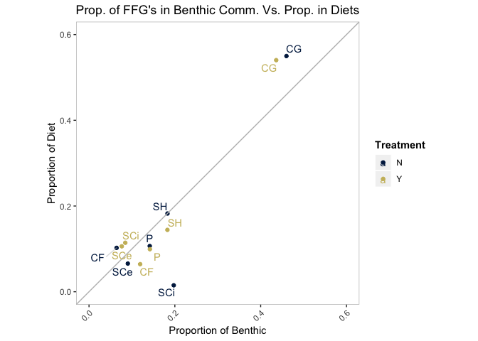<!-- -->


```r
ggplot(aes(x = FFG, y = Mean.L, color = Treatment), data = avg.ffg.diet) +
  geom_point(position = position_dodge(width = .6)) +
  geom_errorbar(aes(ymin = Mean.L - SD.L, ymax = Mean.L + SD.L, color = Treatment), position = position_dodge(width = .6)) +
    labs(title = "Linear Selection Index of Trout Feeding on FFG's", 
         x = "Functional Feeding Group",
         y = "Linear Selection Index") +
    scale_color_viridis_d(option = "E", end = .8) +
    theme(panel.grid.minor = element_blank(),
        panel.grid.major = element_blank(),
        panel.background = element_rect(fill = "white", color = "grey"),
        plot.title = element_text(hjust = 0.5),
        plot.caption = element_text(hjust = 0.5, face = "italic", color = "grey"),
        legend.title = element_text(face = "bold"),
          aspect.ratio = 1,
          axis.text.x = element_text(angle = 45, vjust = 1, hjust = 1))
```

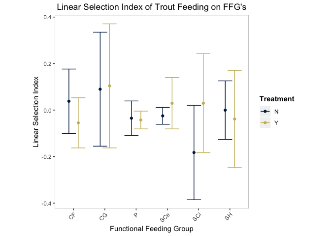<!-- -->

```r
ggplot(aes(x = FFG, y = Mean.D, color = Treatment), data = avg.ffg.diet) +
  geom_point(position = position_dodge(width = .6)) +
  geom_errorbar(aes(ymin = Mean.D - SD.D, ymax = Mean.D + SD.D, color = Treatment), position = position_dodge(width = .6)) +
    labs(title = "Linear Selection Index of Trout Feeding on FFG's", 
         x = "Functional Feeding Group",
         y = "Linear Selection Index") +
    scale_color_viridis_d(option = "E", end = .8) +
    theme(panel.grid.minor = element_blank(),
        panel.grid.major = element_blank(),
        panel.background = element_rect(fill = "white", color = "grey"),
        plot.title = element_text(hjust = 0.5),
        plot.caption = element_text(hjust = 0.5, face = "italic", color = "grey"),
        legend.title = element_text(face = "bold"),
          aspect.ratio = 1,
          axis.text.x = element_text(angle = 45, vjust = 1, hjust = 1))
```

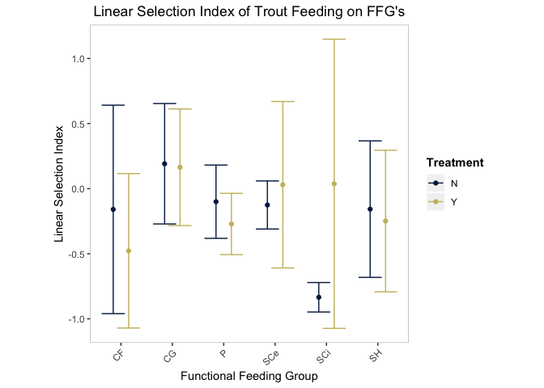<!-- -->


### Costello method plot
***


```r
# Find fraction of each family in each individual stomach 
#diets.fish <- ddply(Diets.by.fish, .(Treatment, Stream, Rep), summarize,
                  # frac.diet = Count / sum(Count),
                 # Family = Family)

#family_names <- diets.fish$Family

# Still working this out

#diets.fish <- ddply(Diets.by.fish, .(Treatment, Stream, Rep), summarize,
                  
                  #Family = Family)

#frac.diet[k] <- for(i in family_names){
                    #length(diets.fish$Rep[diets.fish$Family == i]) / max(diets.fish$Rep) 
                  # }

# Calculate the number of reps divided by the total number of reps a family appears in for each reach
#Diets.fish <- Diets.fish %>% 
  #group_by(Stream, Treatment, Family) %>%
  #mutate(frac.fish = length(Family[Count > 0])) %>%
  #group_by(Stream, Treatment) %>%
 # mutate(frac.fish = frac.fish / max(Rep)) %>%
 # group_by(Stream, Treatment, Family)

#Diets.fish <- Diets.fish %>%
  #summarise_at(vars(frac.fish, frac.diet), funs(mean))
```


```r
#ggplot(data = Diets.fish) +
 # geom_point(mapping = aes(x = frac.fish, y = frac.diet, color = Treatment)) +
 # geom_text(aes(x = frac.fish, y = frac.diet, label = Family), size = 3, nudge_y = .02) +
 # geom_abline(slope = 1, intercept = 0) +
 # coord_cartesian(ylim = c(0, 1), xlim = c(0, 1)) +
 # facet_wrap("Stream") +
  #ggtitle("Costello Plot of Prop. Fish Occurance Vs. Prop. Diet Community") +
 # scale_color_viridis_d(option = "E") +
 # theme(legend.position = c(.84, .27), legend.key.width = unit(5, "cm"))
```

The Costello method plots % occurance of a taxon in fish versus % of aggregate diet. With the adjusted method the aggregate diet is only of fish that had the taxon present (ignoring zero values).  We see that in MCTE and in W-100 there seem to be just a couple fish that specifically target Juga and ELmidae respectively. In MCTE, the taxa from treatment diets seem to consistently constitute a smaller portion of the diet than would be expected given how many fish they occur in. 


### Diet MDS
***

Who knows what I'm actually doing, all of this ordination stuff is currently pre BOT 570.  I will definitely update all this once I know how to handle singleton taxa, loads of zero's, etc.


```r
# Spread data to get a taxon matrix, create factor of CollDate and Treatment
bugs.mds <- Diets.reach %>% 
  filter(Origin %in% c("A", "T")) %>%
  select(-c("FFG", "Size", "Origin")) %>%
  slice(-65) %>%
  spread(key = "Family", value = "Count") %>%
  mutate_if(is.numeric , replace_na, replace = 0) 
```


```r
# Get grouping variables and taxon matrix
Enviro <- bugs.mds %>%
  select(Stream, Treatment) 

Density <- bugs.mds %>% 
  select("Amphizoidae":"Uenoidae")

grouping <- select(Enviro, Stream, Treatment)
```


```
## Wisconsin double standardization
## Run 0 stress 0.128467 
## Run 1 stress 0.2881706 
## Run 2 stress 0.2129743 
## Run 3 stress 0.1204532 
## ... New best solution
## ... Procrustes: rmse 0.2198231  max resid 0.4823474 
## Run 4 stress 0.1284673 
## Run 5 stress 0.3195694 
## Run 6 stress 0.1284667 
## Run 7 stress 0.1204532 
## ... Procrustes: rmse 0.0001747874  max resid 0.0003798683 
## ... Similar to previous best
## Run 8 stress 0.1204533 
## ... Procrustes: rmse 0.0002607852  max resid 0.0005478912 
## ... Similar to previous best
## Run 9 stress 0.1284668 
## Run 10 stress 0.1204532 
## ... Procrustes: rmse 0.0001161111  max resid 0.000251926 
## ... Similar to previous best
## Run 11 stress 0.1204532 
## ... New best solution
## ... Procrustes: rmse 5.36097e-05  max resid 7.893914e-05 
## ... Similar to previous best
## Run 12 stress 0.1204532 
## ... Procrustes: rmse 0.00016925  max resid 0.0003642166 
## ... Similar to previous best
## Run 13 stress 0.1204532 
## ... Procrustes: rmse 0.0001416866  max resid 0.0002132807 
## ... Similar to previous best
## Run 14 stress 0.1204532 
## ... Procrustes: rmse 0.0001301058  max resid 0.0002753104 
## ... Similar to previous best
## Run 15 stress 0.2397105 
## Run 16 stress 0.1204533 
## ... Procrustes: rmse 0.0002409924  max resid 0.0005602659 
## ... Similar to previous best
## Run 17 stress 0.1204532 
## ... Procrustes: rmse 6.079301e-05  max resid 0.000140298 
## ... Similar to previous best
## Run 18 stress 0.1204531 
## ... New best solution
## ... Procrustes: rmse 3.189238e-05  max resid 4.36599e-05 
## ... Similar to previous best
## Run 19 stress 0.1204531 
## ... New best solution
## ... Procrustes: rmse 2.177588e-05  max resid 4.57827e-05 
## ... Similar to previous best
## Run 20 stress 0.171064 
## *** Solution reached
```


```r
#set up NMDS with dimensions of sol and env factors from "Enviro". 
NMDS <- data.frame(x = sol$points[, 1], y = sol$points[ ,2], 
                   Stream = select(grouping, Stream), 
                   Treatment = select(grouping, Treatment))
```


```r
Reach18N <- NMDS[NMDS$Treatment == "2018.N", ][chull(NMDS[NMDS$Treatment == 
    "2018.N", c("x", "y")]), ] 

Reach18Y <- NMDS[NMDS$Treatment == "2018.Y", ][chull(NMDS[NMDS$Treatment == 
    "2018.Y", c("x", "y")]), ] 

hull.data <- rbind(Reach18Y, Reach18N) 
```


```r
ggplot(data = NMDS, aes(x, y, color = Treatment)) +
  geom_polygon(hull.data, mapping = aes(x = x, y = y, fill = Treatment, group = Treatment), alpha = 0) +
  annotate("text", x = (NMDS$x), y = (NMDS$y) + .04, label = NMDS$Stream, size = 3) +
  geom_point(aes(shape = Stream)) +
  ggtitle("MDS of Community in Fish Diets") +
  scale_color_viridis_d() +
  theme(axis.text.x = element_blank(),  # remove x-axis text
        axis.text.y = element_blank(), # remove y-axis text
        axis.ticks = element_blank(),  # remove axis ticks
        panel.background = element_blank(), 
        panel.grid.major = element_blank(),  #remove major-grid labels
        panel.grid.minor = element_blank(),  #remove minor-grid labels
        plot.background = element_blank())
```

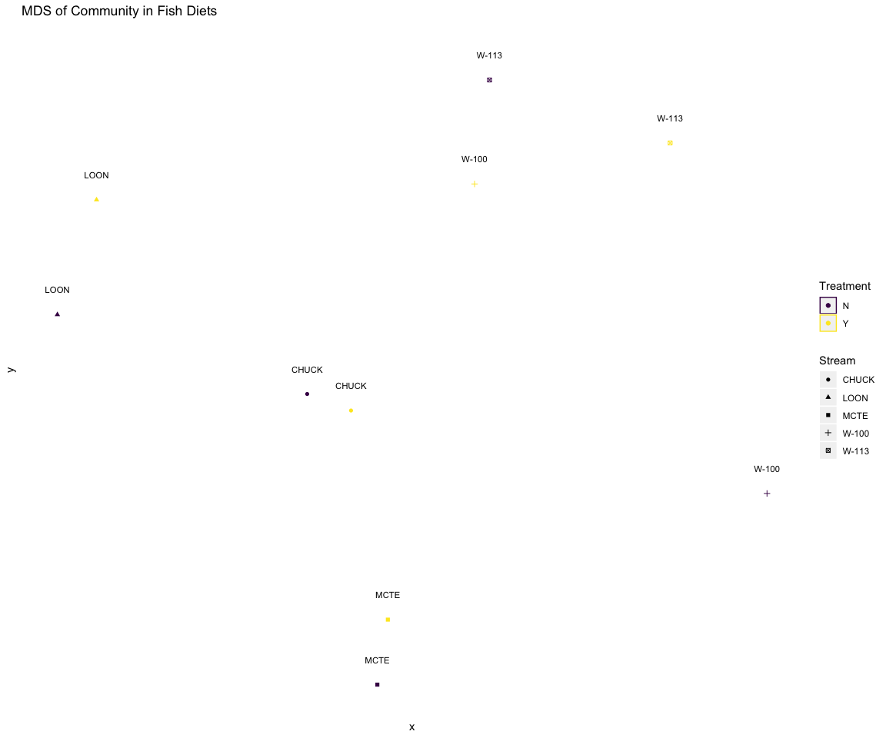<!-- -->

```r
  #theme(legend.position = c(.84, .27), legend.key.width = unit(5, "cm"))
```

There seems to be total overlap of the diet communities in the control versus treatment reaches.  This seems to be consistent with what we saw in other plots.


## Citations
***

Session Info:


```r
sessionInfo()
```

```
## R version 3.5.1 (2018-07-02)
## Platform: x86_64-apple-darwin15.6.0 (64-bit)
## Running under: macOS  10.14.4
## 
## Matrix products: default
## BLAS: /Library/Frameworks/R.framework/Versions/3.5/Resources/lib/libRblas.0.dylib
## LAPACK: /Library/Frameworks/R.framework/Versions/3.5/Resources/lib/libRlapack.dylib
## 
## locale:
## [1] en_US.UTF-8/en_US.UTF-8/en_US.UTF-8/C/en_US.UTF-8/en_US.UTF-8
## 
## attached base packages:
## [1] stats     graphics  grDevices utils     datasets  methods   base     
## 
## other attached packages:
##  [1] nlme_3.1-139    extrafont_0.17  ggrepel_0.8.0   ggthemes_4.0.1 
##  [5] readxl_1.1.0    lubridate_1.7.4 vegan_2.5-2     lattice_0.20-35
##  [9] permute_0.9-4   plyr_1.8.4      forcats_0.3.0   stringr_1.4.0  
## [13] dplyr_0.8.0.1   purrr_0.3.2     readr_1.1.1     tidyr_0.8.1    
## [17] tibble_2.1.1    ggplot2_3.1.0   tidyverse_1.2.1
## 
## loaded via a namespace (and not attached):
##  [1] Rcpp_1.0.1        assertthat_0.2.1  rprojroot_1.3-2  
##  [4] digest_0.6.18     psych_1.8.4       R6_2.4.0         
##  [7] cellranger_1.1.0  backports_1.1.2   evaluate_0.13    
## [10] httr_1.3.1        pillar_1.3.1      rlang_0.3.4      
## [13] rematch_1.0.1     lazyeval_0.2.1    rstudioapi_0.10  
## [16] extrafontdb_1.0   Matrix_1.2-14     rmarkdown_1.10   
## [19] labeling_0.3      foreign_0.8-70    munsell_0.5.0    
## [22] broom_0.4.4       compiler_3.5.1    modelr_0.1.2     
## [25] xfun_0.6          pkgconfig_2.0.2   mnormt_1.5-5     
## [28] mgcv_1.8-24       htmltools_0.3.6   tidyselect_0.2.5 
## [31] viridisLite_0.3.0 crayon_1.3.4      withr_2.1.2      
## [34] MASS_7.3-50       grid_3.5.1        jsonlite_1.6     
## [37] Rttf2pt1_1.3.7    gtable_0.2.0      magrittr_1.5     
## [40] scales_1.0.0      cli_1.1.0         stringi_1.4.3    
## [43] reshape2_1.4.3    xml2_1.2.0        tools_3.5.1      
## [46] glue_1.3.1        hms_0.4.2         parallel_3.5.1   
## [49] yaml_2.2.0        colorspace_1.3-2  cluster_2.0.7-1  
## [52] rvest_0.3.2       knitr_1.22        haven_1.1.1
```


