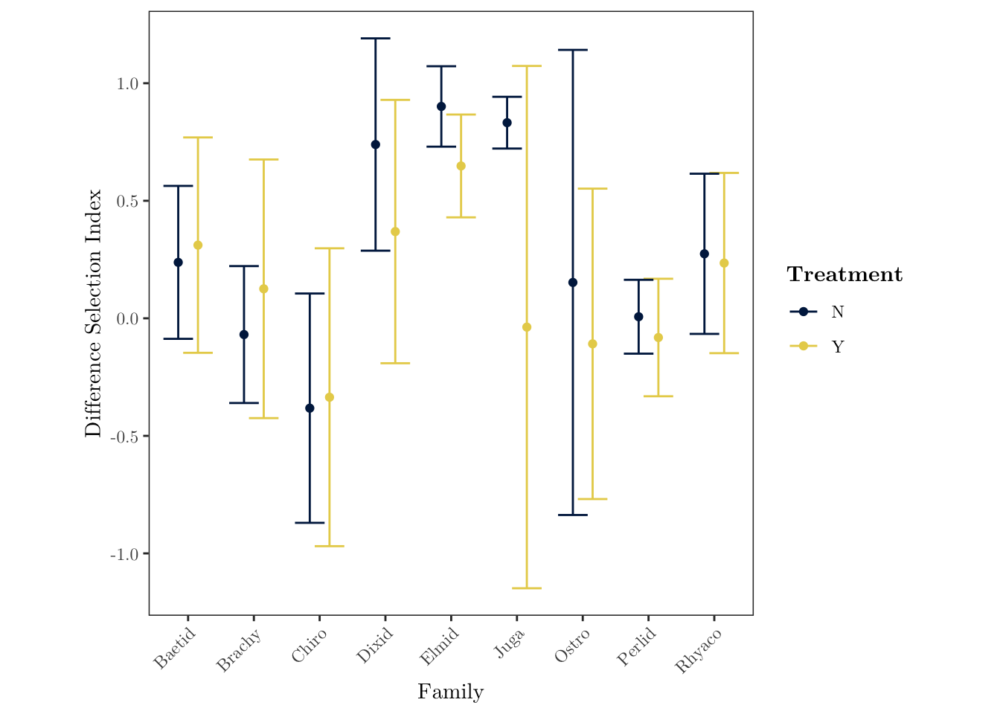

```{r include_packages, include = FALSE}
# This chunk ensures that the beaverdown package is
# installed and loaded. This beaverdown package includes
# the template files for the thesis.
if(!require(devtools))
  install.packages("devtools", repos = "http://cran.rstudio.com")
if(!require(beaverdown))
  devtools::install_github("zkamvar/beaverdown")
library(beaverdown)

x <- c("tidyverse", "plyr", "vegan", "lubridate", "readxl", "ggthemes", "ggrepel", "extrafont", "nlme", "knitr", "kableExtra")
lapply(x, library, character.only = TRUE)
attributes <- read_xlsx("../Data/Data for Tables/Site Attribute Table.xlsx")
ffg_results <- read_xlsx("../Data/Data for Tables/FFG results.xlsx")
```

# Introduction {-}

In forested systems, streams and their biota are intrinsically linked to riparian vegetation (@Vannote1980). Stream food webs depend on direct carbon subsidies from the terrestiral environment in the form of both leaf litter and terrestrial invertebrates, but riparian controls on stream systems aren't limited to biological inputs. Riparian canopy cover also has an indirect effect on stream food webs through the control of light available for benthic primary production. In the Pacific Northwest (PNW) region of North America, riparian forests have changed substantially in the past half century. After a legacy of heavy harvesting, riparian forest protections have created dense second-growth vegetation along streams in contrast with old-growth forests containing multiple canopy gaps. The dense vegetation in these regenerating forests decreases light availability and limits benthic primary production. As forest stand development continues natural disturbances and individual tree mortality will increase canopy heterogeneity through the introduction of gaps.To understand how aquatic food webs respond to an increase in light associated with canopy gaps, we investigate the response of macroinvertebrates and fish feeding to canopy-opening manipulations.

Light, and its impact on primary productivity in streams is of particular interest because autochthonous carbon can be disproportionately represented in consumer biomass relative to its availability in many aquatic environments (@Lau2009, @McCutchan2002). In forested headwater systems specifically, basal carbon availability is dominated by leaf litter (@McCutchan2002); however, energetically, algae is a higher quality food source and is preferentially assimilated into higher trophic levels (@Macarelli2011). Stream secondary production is dominated by aquatic macroinvertebrates which play an important role in assimilating and transducing energy to higher trophic levels such as insectivorous fish and other vertebrate predators.  Because macroinvertebrates play a crucial role in mediating food web interactions, understanding their community dynamics can provide key insights into broader ecosystem functioning. Invertebrates in the scraper functional feeding group in particular have evolved specialized mouthparts for consuming benthic algal biofilms (periphyton), and increases in algal production often elicits a positive response among these scraping taxa (@ sources). 

Macroinvertebrate community data has historically been used to evaluate stream health. Indicies such as the B-IBI or, benthic index of biological integrity, rely on total taxa richness and taxa richness of key families, such as Plecoptera, Ephemeroptera and Trichoptera, to evaluate the biological condition of streams.  More broadly, an assesement of the whole community can be used to evaluate overall food web and ecosystem responses to a multitude of variables. For example, studies using nonmetric multidimensional scaling (NMS) have been used to assess community responses along a variety of environmental gradients (@ citations). 

The benthic invertebrate community represents the primary food source for fish in headwater streams (@ citation). Trout are the dominant fish species in many headwater systems across North America, and can influence both invertebrate behavior and community structure (@ McIntosh and Peckarsky papers – and maybe something from PNW). In headwater streams trout are oportunistic foragers, eating whatever is available in their habitat. Cutthroat trout feed from the water column using visual cues to capture prey. Because salmonids are visual predators, their feeding efficiency can be influenced by light conditions and visibility (@Wilzbach1986), therefore gaps have the potential to affect fish feeding not only though potential increases in scraper invertebrate food resources, but also by increasing foraging efficiency. 

Clear cutting and the resultant reach-level increase in stream light can increase stream primary and secondary productivity, but increases in light also lead to increases in temperature, and cutting to the stream edge can increase sediment loads. Given these negative impacts, clear cutting along streams is no longer a common practice in the Pacific Northwest--even in managed landscapes riparian buffers are left. In unmanaged forests, and in these riparian forest buffers, stands are in the early to mid-seral stages with dense homogenous canopy cover and low stream light (@Kaylor2017FS). Canopy gaps will begin developing naturally along streams as stands mature, and restoration efforts focused on emulating natural disturbance may expedite forest shifts toward late-succession and old-growth structural conditions (@Kreutzweiser2012). While studies on reach-scale forest clearing demonstrate a clear response in benthic primary producers, invertebrates, and trout to release from light limitation, this does not reflect future stream conditions in most forested landscapes. As stands progress toward late succesional forest structure, localized light patches (rather than large openings) will become increasingly prevelant, and have not been widely evaluated. 

We hypothesize that canopy gaps will produce a dampened response in comparison to clear cutting but, should increase primary production, causing the macroinvertebrate community to shift in response to resource availability, and resultant changes in the invertebrate community will be reflected in the opportunistic foraging of trout.

# Methods {-}

##Study location {-}

The study consists of five reach pairs on five replicate streams in the western Cascade Mountains of Oregon. Each reach pair consisted of one treatment reach and one reference reach. Two of the reach pairs (W-100, W-113) are located on private Weyerhaeuser Co. land, and three (LOON, CHUCK, MCTE) are located on U.S. Forest Service land, one of which (MCTE) is situated in the HJ Andrews Experimental Forest. Stream reaches were 90 meters in length and treatment gaps were 20 to 40 meters in diameter and situated approximately in the middle of treatment reaches. Sites had a buffer between stream reach pairs to limit any effects of the upstream reach on downstream conditions.

All of the streams are wadeable, fish-bearing streams with bankfull widths of 1-8 meters. Fish-bearing streams were purposefully selected to provide management-relevant results for key species such as salmonids. The streams run through 40-60-year-old riparian forests regenerating from previous harvest. These forests have a homogenous canopy structure with heavy understory shading, as defined by their early seral stage. Small streams were chosen for ease of sampling and to maximize the effect of a canopy opening manipulation since small streams may be completely shaded by overhead vegetation due to their high edge to area ratio. 

```{r table1, echo=FALSE}
kable(attributes, format = 'latex', booktabs = TRUE, caption = "Study site attributes") %>% 
  kable_styling(latex_options = c("scale_down")) 
```


## Study Design {-}

The before-after, control-impact (BACI) study design lends itself to experimental field studies by accounting for natural variations between sites. By taking the ratio of a given variable between the paired reaches and comparing the change in the ratio from pre to post-treatment years, we account for both spacial and temporal variation. So, going forward, a sample unit will refer to a whole stream including both treatment and reference reaches because the metric of interest for many of our analyses will be the ratio between the two reaches. Therefore we have five sample units with two repeated measures, pre and post-treatment. To test for effects of the gap treatment, we quantify and assess changes in the reach ratio's between the two years. Samples were collected during summer 2017 and summer 2018 with pre-treatment data gathered during summer 2017 and post-treatment data gathered during summer 2018. Canopy gaps were cut in the treatment reach during the winter of 2017-18 to permit adequate time for response to the canopy manipulation. 


## Data Collection {-}

### Light {-}

Photosynthetically active radiation (PAR) was estimated from flourescein decay rate over a twenty-four hour period following methods in Warren et al.  Briefly, flourescein dyes were prepared by diluting to 400 g L^-1^ with DI water and buffering with 40 g L^-1^ of aquarium salt. Once the dye was prepared, we filled 3.7mL glass vials and stored them in the dark until deployment. At each study reach hree replicate vials were deployed every five meters, and retrieved twenty-four hours later. Because flourescence of fluorescein changes with temperature (@Betchold2012), vials were left in the dark until they reached room temperature. Flouresence was then measured using a flourometer (Turner Designs, San Jose, California), and the twenty-four hour decay rate was converted to photosynthetically active radiation (PAR) using the known relationship in (@Warren2017).

### Chlorophyll *a* {-}

In each study reach every ten meters, three ceramic tiles (15 cm x 15cm) were placed every 10 meters within a stream reach and left for 6 weeks before they were collected to allow periphyton communities to establish. Tiles were placed in riffle sections at a depth of 10-25 cm to keep them from silting over. All tiles were deployed in mid-July, and the tiles were deployed at the control and treatment reaches of each stream at the same time to keep within unit measures consistent. After collection, tiles were kept in the dark, submerged in water for two hours to avoid potential photosasturation issues with the *in situ* chlorophyll *a* measurements. Chlorophyll *a* (abbreviated as Chla for the remainder of this text) concentrations were then quanitified using a BenthoTorch (BBE Moldaenke GmbH), a portable field instrument used for the quantification of chlorophyll *a* fluorescence on different substrates.

### Benthic Invertebrate Sampling {-}

Three benthic invertebrate samples were taken at each stream reach at meters 15, 45, 75, or the closest area with non-boulder substrate. Samples were collected once per year over the course of one week using a Surber sampler with a .09 m^2^ sampling area. Substrate was disturbed to a depth of approximately four inches for one minute. The sample was then preserved in 95% ethanol for identification and enumeration in the lab.  

In the lab, the three benthic samples per reach were combined into a single pooled sample for each reach. The pooled sample was then subsampled using a Caton tray. Squares $\frac{1} {30}$ of the area of the Caton tray were randomly sampled until the cutoff of 300 individuals or greater was reached. Benthic invertebrates were then identified down to genus or the lowest taxonomic unit (LTU) for cryptic taxa. Counts from subsamples were then converted to densities using the following formula: 
\begin{equation}
\frac{1}{3*s*0.09}
\end{equation}
Where $s$ is the fraction subsampled, 0.09 is the area of the Surber sampler in square meters, and the result is divided by three because three samples from meters fifteen, forty-five and seventy-five were pooled. Singleton taxa (taxa occurring in only one reach) were removed from the original matrix and density values were log transformed to reduce the effect of abundant taxa (Chironomidae, *Baetis*, *Micrasema*) on community relationships by applying the formula $ln(n + 1)$ where $n$ is the density of a given taxon. The resulting matrix of benthic invertebrates at the LTU level of identification (20 reaches by 64 taxa) was then used for analysis. 

Functional feeding groups were assigned using @ Merritt and Cummins using only the primary feeding habit of each taxon. For 

During Chla tile collection at the two streams with snails as the dominant scraper, the number of snails (Juga) and cased caddisfly (observed taxa being Uenoidae and Glossosomatidae primarily) on each tile were recorded and then removed.  before taking readings with a BenthoTorch^TM^. 

### Trout Diets {-}

Trout diets were collected during the post-treatment year, Trout diets were collected during three-pass depletion of fish standing stock and were only taken from a subset of fish greater than 100 mm in length. Fish were anesthetized using AQUI-S and gastric lavaged. Stomach contents were evacuated by inecting water into the fish stomach using a piece of small plastic tubing attached to a syringe. Diet samples were collected in filter paper and preserved in 95% ethanol for lab processing.

All trout diets were processed (9 to 13 diets per reach) with aquatic invertebrates identified down to the family level and terrestrial invertebrates identified to order. Because the number of fish dieted in each reach varied, the average of all fish diets was used. The resulting matrix was then filtered for aquatic species and appended to a matrix of 2018 benthic invertebrate families (10 reaches by 38 families), producing a matrix of 20 sample units (SU’s) by 40 families consisting of both fish diets and benthic samples. Singleton taxa were then removed to create a matrix of combined diet and benthic families of 20 SU’s by 36 families. At this point, the combined matrix was relativized by row maxima to compensate for the difference between benthic sampling—measured in density per m2—and fish diets.

## Data Analysis {-}

### BACI Analysis {-}

The BACI analysis was performed in R (@R-base), and consisted of calculating reach-pair differences by subtracting the control reach value from the treatment reach value. Reach ratios were calculated for light, chla, total invertebrate density and invertebrate densities by functional feeding group. A paired t-test using Welches method was then performed for each metric by subtracting the reach ratio from the pre-treatment year from the ratio value in the post-treatment year for each stream assuming the difference between the two reach ratios should be zero, and the degrees of freedom equal four. 

### Nonparametric Community Analysis {-}

Nonparametric analyses were performed in PC-ORD (@PC-ORD) and R (@R-base) using the Vegan package (@vegan). Blocked multi-response permutation procedure (MRBP) was used to assess differences between treatment and control reaches in the pre and post treatment years. MRBP was followed up with blocked indicator species analysis (ISA) to determine underlying taxa driving any grouping detected by MRBP.  The combined benthic and diet community matrix was subsequently tested for any differences between treatment and control reaches and benthic versus diet taxa representation using the same MRBP and ISA methods. 

To test for any pre-treatment reach differences in 2017, MRBP was run on 2017 data only with Treatment as the two a priori groups and blocked by Stream. The 2018 post-treatment data was then assessed using the same MRBP grouping and blocking. MRBP is a nonparametric method used to test for differences between groups. This method accommodates paired or blocked study designs by accounting for variation related to study design variables that have little bearing on the question being addressed. In this case, MRBP accounts for any between-stream variation. MRBP outputs a p-value for the observed within-group distance (smaller distances constituting stronger grouping) by shuffling SU’s between groups to generate a distribution of possible within-group distances (@McCune2002).

The follow-up ISA calculates an indicator value (IV) for each species. The IV is a composite of a taxon’s fidelity and exclusivity to a group. If a taxon is consistently abundant in one group and never present in any other, then it would receive a high IV. Conversely, a taxon rarely abundant in SU’s of one group and present in other groups would receive a low IV (@McCune2002). A Monte Carlo test of 1,000 permutations of the taxa matrix was used to generate a p-value for each taxon’s IV.

Nonmetric multidimensional scaling (@Kruskal1964) was used to visually assess differences between the treatment and control reach communities, and quantify the relationship between the synthetic community variable and Chla . Sorensen distance was used for both ordinations to reduce the impact of outliers. The ordination was rotated to maximize the environmental variable BenthoTotal along axis 1. A random start was used and the real data were run 250 times to ensure an absolute stress minima was reached. A Monte Carlo test with 100 permutations was used to generate a p-value for the probability of the final ordination have a lower than expected p-value by chance. 

### Analysis of Trout Diets {-}

Trout diets were collected in the post-treatment year, which limits analysis to a comparison of reference and treatment reaches without the BACI control on inherent reach differences. We performed paired t-tests for the abundance of each functional feeding group represented in the diets of trout in the reference and the treatment reach, and on the modified Ivlev's selectivity index (as defined in @Jacobs1974) for each FFG.

# Results {-}

## Light and Chlorophyll {-}

In 2017, before treatment, the average daily PAR reaching the stream benthos among the five streams was consistently low in both reference and treatment reaches and there was an average difference between the treatment and reference reach of -0.163 mol m^-2^ day^-1^.  In 2018, after gaps were cut, light went up by 2.604 mol m^-2^ day^-1^ on average in the treatment reach compared to the reference reach (Figure 1) resulting in a final yearly difference between reach differences of 2.767 mol m^-2^ day^-1^ (p-value = 0.01862, t-value = -3.8296).

Again, for chlorophyll *a*, values across all sites in the pre-treatment year were low (mean = 0.095 ug cm^-2^), and there was little difference between reaches. After gaps were cut in the post-treatment year, Chla values went up by 0.44 ug cm^-2^ in the gap reach, and only 0.175 ug cm^-2^ in the reference reach (final BACI difference = 0.265 ug cm^-2^, p-value = 0.0017). {width=400px}

## *Juga* on Tiles {-}

In the pre-treatment year, the average density of  *Juga* on tiles among the two streams with *Juga* present was 24.44 snails per m^2^  with little difference between the control and treatment reaches.  In the post treatment year the average snail density in the treatment reach increased by 204.44 snails per m^2^, whereas snail density in the control reach only increased by 88.89 snails per m^2^. Snail abundance at these two streams was moderately associated with Chla (r^2^ = 0.3204, p = 0.00547), but saw the largest BACI response in meters ten and twenty, slightly upstream of the gap treatment.

## Benthic Invertebrate Community {-}

There was little difference between benthic invertebrate communities in the treatment and reference reaches in the pre-treatment year (MRBP: A = 0.041, p = 0.071), or the post-treatment year (A = -0.022, p = 0.838).  The results from the NMS ordinations support the results of the MRBP (Figure 2). {width=400px} The NMS ordination of benthic invertebrates  converged on a 2D solution with a final stress of 12.031. BenthoTotal (total chlorophyll values from the BenthoTorch) and YearTreatQ (a binary variable coded with 1’s for 2018 treated reaches and 0’s for all other reaches) both had positive r^2^ values with axis 1 (YearTreatQ r^2^ = 0.272, BenthoTotal r^2^ = 0.304).

## Invertebrate Functional Feeding Groups {-}


{width=400px}
```{r ffgtable, echo = FALSE}
kable(ffg_results, format = 'latex', booktabs = TRUE, caption = "BACI t-test results for various metrics") 
```
## Trout Diet {-}

{width=400px}

{width=400px}

# Discussion {-}

Gaps are, by definition, patches in a larger, forested system. Therefore, significant localized responses to increases in light within a gap may not translate to significant system-wide responses at the stream or even the reach level. Our study design emphasizes the effects of gaps that comprise only a fraction of a stream reach, focusing on the integrated effect of small gaps embedded in a larger forested matrix. While light and Chla responded as expected to an opening of the riparian canopy, our reach-scale metrics for the invertebrate community do not show a response to increases in primary production. This does not match our original hypothesis that increases in high quality algae would lead to increased abundance of scraping invertebrate taxa. Instead, we find that the scale of the effect--increases in light are limited to within the gap--may outweigh the local magnitude. Even though algae is an energetically preferential food source, and primary production increased within treatment reaches, we see a limited invertebrate response at the reach level.

The results for higher trophic levels seem to be in contradiction with previous studies on stream light (@ Heaston, Kaylor, Wooton), but these studies focused on 

Is a lack of system response to a local perturbation considered resilience?

The overall response of the benthic invertebrate community to the canopy gaps was slight and indicates that no one species or functional group confers a competitive advantage from either increases in light or increased autochthonous production. 

When we replace taxonomy with functional groups, we still see no real changes in the relative abundance of functional feeding groups, which fits with our results from NMS.

Trout diets also showed no response.

The *Juga* snail response fits our hypothesis, but hadn't been anticipated prior to field observations.  

Gap versus reach size.  How large of a gap results in more than a local-within-gap response? When looking at a local response of grazers on tiles


Power and Dietrich advocate for species exculsion studies to determine the top-down pressure of upper level consumers on lower members of the stream community (2002), but experimentally enhancing a particular basal resource can also reveal energy pathways and which community members are poised to take advantage of specific energy subsidies. 

In resiliency theory, the ability of a community to resist change is dependent on both the magnitude of disturbance and the degree of interspecific competition.

\pagebreak

# References {-}


