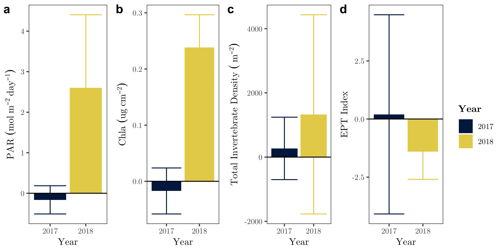

```{r include_packages, include = FALSE}
# This chunk ensures that the beaverdown package is
# installed and loaded. This beaverdown package includes
# the template files for the thesis.
if(!require(devtools))
  install.packages("devtools", repos = "http://cran.rstudio.com")
if(!require(beaverdown))
  devtools::install_github("zkamvar/beaverdown")
library(beaverdown)

x <- c("tidyverse", "plyr", "vegan", "lubridate", "readxl", "ggthemes", "ggrepel", "extrafont", "nlme", "knitr", "kableExtra")
lapply(x, library, character.only = TRUE)
attributes <- read_xlsx("../Data/Data for Tables/Site Attribute Table.xlsx")
ffg_results <- read_xlsx("../Data/Data for Tables/FFG results.xlsx", sheet = "Benthic")
ffg_diet_results <- read_xlsx("../Data/Data for Tables/FFG results.xlsx", sheet = "Diet")
top_diet <- read_xlsx("../Data/Data for Tables/FFG results.xlsx", sheet = "TopDiet")
nms_taxa <- read_xlsx("../Data/Data for Tables/nms taxa.xlsx")
site_ffg <- read_xlsx("../Data/Data for Tables/FFG results.xlsx", sheet = "Site diets")
```

# Introduction {-}

In forested systems, streams and their biota are intrinsically linked to riparian vegetation [@Vannote1980]. Stream food webs depend on direct carbon subsidies from the terrestrial environment in the form of both leaf litter and terrestrial invertebrates [@Wipfli1997], but riparian controls on stream systems aren't limited to organic inputs. Riparian canopy cover also has an indirect effect on stream food webs by limiting light available for benthic primary production. In the Pacific Northwest (PNW) region of North America, riparian forests have changed substantially in the past half century. In response to a legacy of heavy harvesting [@Pan2011], riparian forest protections have created dense regenerating vegetation along streams in contrast with structurally complex old-growth forests containing multiple canopy gaps that historically dominated the PNW landscape [@Warren2016Eco]. The dense vegetation in these regenerating forests decreases light availability and limits benthic primary production [@Kaylor2017FS). As forest stand development continues natural disturbances and individual tree mortalities will increase canopy heterogeneity through the introduction of gaps. To understand how aquatic food webs respond to an increase in light associated with canopy gaps, we investigate the response of macroinvertebrates and fish feeding to canopy-opening manipulations.

Light, and its impact on primary productivity in streams is of particular interest because autochthonous carbon can be disproportionately represented in consumer biomass relative to its availability in aquatic systems [@Lau2009; @McCutchan2002]. In forested headwaters specifically, basal carbon availability is dominated by leaf litter [@McCutchan2002]; however, energetically, algae is a higher quality food source and is preferentially assimilated into higher trophic levels [@Macarelli2011]. Primary consumers mediate basal carbon availability for higher trophic levels and, in temperate streams, primary consumers are dominated by macroinvertebrates, a major food resource for insectivorous fish. Because macroinvertebrates play a crucial role in mediating food web interactions, understanding their community dynamics and functional diveristy can provide key insights into broader ecosystem and food web functioning. Invertebrates in the scraper functional feeding group in particular have evolved specialized mouthparts for consuming benthic algal biofilms (periphyton), and increases in algal production in high light areas are expected to elicit a positive response among these scraping taxa [@liess2012]. 

Macroinvertebrate community data have traditionally been used to evaluate stream health. Indicies such as the B-IBI (benthic index of biological integrity) rely on total taxa richness and taxa richness of key families, such as Ephemeroptera, Plecoptera and Trichoptera (EPT taxa) to evaluate the biological condition of streams. Other indicies such as the EPT index focus on proportional abundance of taxa known to be sensitive to environmental disturbances. More broadly, an assessement of the whole community can be used to evaluate overall food web and ecosystem responses to a multitude of variables. For example, studies using nonmetric multidimensional scaling (NMS) have assessed community responses along a variety of environmental gradients [@Cole2003; @Purcell2009]. The relationship between the synthetic community variables represented by the ordination axes and environmental variables provide a valuable tool for assessing overall community response to environmental factors.

In headwater streams, the benthic invertebrate community represents the primary food source for trout. Interspecific interactions between trout and invertebrates can alter the benthic community as trout foraging [@Dahl1998], or fish presence alters the behavior of, or actively selects against, invertebrates vulnerable to trout predation [@Peckarsky1998]. Depending on the taxa present, top-down pressures on the invertebrate community may relieve algae from invertebrate grazing and ultimately increase benthic biofilm standing stock. In headwater streams trout are oportunistic foragers, and consumption tends to be biased toward large invertebrates. Additionally, cutthroat trout, the dominant fish species in Cascade headwaters, are visual predators typically feeding from the water column. Because salmonids are visual predators, their feeding efficiency can be influenced by visibility [@Wilzbach1986], which is dependent on light conditions. Therefore, gaps have the potential to affect fish feeding not only through potential increases in scraper invertebrate food resources, but also by increasing foraging capture rates of all taxa and functional feeding groups. We expect the oportunistic nature of trout diets to reflect changes in the benthic community due to increases in primary production.

While some studies on forest clearing have demonstrated that there can be reach-scale increase in benthic primary producers, invertebrates, and even trout when the system is released from light limitation [@Murphy1981; @Wootton2012], harvesting without streamside buffers consistently leads to increases in temperature, losses of large wood habitat, and increases in stream sediment loads.  Increased temperatures, increased sediment loading, and reduced habitat complexity can be detrimental to many headwater species. Given these negative impacts, clear-cutting adjacent to streams is no longer a common practice in the PNW and many streams have riparian buffers that maintain some stream shading.  The streamside forests that are recovering from stand replacing clearing or from natural stand-replacing events over the past century are currently in the early-to-middle stages of development with dense homogenous canopy cover and low stream light (Kaylor et al. 2017). Canopy gaps will begin developing naturally along streams as stands mature, and restoration efforts focused on emulating natural disturbance may expedite forest shifts toward late-succession and old-growth structural conditions [@Kreutzweiser2012].  With riparian forest protections, we expect regenerating streamside stands to continue to develop more complex structure and eventually progress toward late successional forest structure with localized light patches of light associated with canopy gaps becoming increasingly prevalent. Similarly, in management areas with narrow buffers we still expect a dynamic light environment associated with upland cutting as an open understory lets in low-angle light. Whether due to natural stand development, efforts to increase forest structural complexity, or patches of shade along a stream created by thinner buffers, we expect the light environment of forested streams to become patchier in the coming years. While effects of large changes in canopy cover (i.e. cutting all or nearly all of the riparian forest) have been studied in a number of cases, the more moderate influence of small canopy gaps and light patches on stream ecosystems has not been widely investigated, especially in an experimental context.

We implemented a two-year before-after, control-impact study designed to detect and capture the effect of canopy gaps on aquatic macroinvertebrate communities. In this work, we expected that primary production would increase when canopy gaps were created, and this would cause the invertebrate community to shift toward more taxa in the scraper feeding group. However, we expected the reach-scale responses to a localized increase in light to be dampened in comparison to observed responses in large scale riparian clearing studies. In addition to evaluating benthic macroinvertebrate community, we also assessed trout diets to determine whether shifts in the invertebrate community would be reflected proportionally in the diet of opportunistic foraging of trout. The diet data were also used to evaluate whether a potential benthic invertebrate community response may be masked by increased selective foraging of particular taxa by these apex consumers.

# Methods {-}

##Study location {-}

The study consisted of five reach pairs on five replicate streams in the western Cascade Mountains of Oregon. Each reach pair consisted of one treatment reach and one reference reach. Two of the reach pairs (W-100, W-113) were located on private Weyerhaeuser Co. land, and three (LOON, CHUCK, MCTE) are located on U.S. Forest Service land, one of which (MCTE) was situated in the H.J. Andrews Experimental Forest. Stream reaches were 90 meters in length and treatment gaps were 20 to 40 meters in diameter and situated approximately around meter thirty of treatment reaches. Sites had a buffer between stream reach pairs to limit any effects of the upstream reach on downstream conditions.

All of the streams are wadeable, fish-bearing streams with bankfull widths of 1-6 meters. Fish-bearing streams were purposefully selected to provide management-relevant results for key species such as salmonids. Additionally, low-order streams of this size range comprise up to 70% of total stream length in forested catchments. The streams run through 40 to 60-year-old riparian forests regenerating from previous harvest. These early-to-mid-seral stage forests have a homogenous canopy structure with heavy understory shading. Small streams also provide ease of sampling and maximize the effect of a canopy opening manipulation since small streams may be completely shaded by overhead vegetation.

```{r table1, echo=FALSE}
kable(attributes, format = 'latex', booktabs = TRUE, caption = "Study site attributes") %>% kable_styling(latex_options = c("scale_down")) 
```


## Study Design {-}

The before-after, control-impact (BACI) study design lends itself to experimental field studies by accounting for natural variations between sites. By taking the difference of a given variable between the paired reaches and comparing the change in the difference from pre to post-treatment years, we account for both spatial and temporal variation. For the BACI analyses, a sample unit refers to a whole stream including both treatment and reference reaches because the metric of interest for BACI is the difference between the two reaches. Therefore, we have five sample units with two repeated measures, pre and post-treatment. To test for effects of the gap treatment, we quantify and assess changes in the reach differences between the two years. Pre-treatment data were collected during summer 2017 and post-treatment data were collected during summer 2018. Canopy gaps were cut in the treatment reach during the winter of 2017-18 to permit adequate time for response to the canopy manipulation at all sites besides MCTE. At MCTE gaps were cut at the end of summer 2017 after data collection. 


## Data Collection {-}

### Light {-}

Daily photosynthetically active radiation (PAR) was estimated from fluorescein decay rate over a twenty-four hour period following methods in Warren et al. [-@Warren2013], Bechtold et al. [-@Bechtold2012], and Kaylor et al. [-@Kaylor2017FS]. The dye solution was prepared with a concentration of  400 g L^-1^ of fluorescein buffered with 40 g L^-1^ of aquarium salt. Once the dye was prepared, we filled 3.7mL glass vials and stored them in the dark until deployment. At each study reach, three replicate vials were deployed every five meters on the streambed, and retrieved twenty-four hours later. Although the decay rate of fluorescein does not change with temperature, its fluorescence is dependent on the temperature at the time it is measured [@Bechtold2012]. So, after collection vials were left in the dark until they reached room temperature. Fluoresence was then measured using a fluorometer (Turner Designs, San Jose, California), and the twenty-four hour decay rate was converted to PAR using the relationship in Warren et al. [-@Warren2017] established for steams in this region.

### Chlorophyll *a* {-}

In each study reach, three ceramic tiles (15 cm x 15cm) were placed every 10 meters and left for 4 weeks before they were collected to allow periphyton communities to establish. Tiles were placed in riffle sections at a depth of 10-25 cm to keep them from accumulating silt. All tiles were deployed in mid-July at the control and treatment reaches of each stream simultaneously to keep within-unit measures consistent. After collection, tiles were kept in the dark and submerged in water for two hours to avoid potential photosaturation measurement issues that arise when using *in situ* chlorophyll *a* measurement tools [@Kaylor2018]. Chlorophyll *a* (hereafter "Chla") concentrations were then quantified using a BenthoTorch^TM^ (BBE Moldaenke GmbH), a portable field instrument used for the quantification of Chla fluorescence.

### Benthic Invertebrate Sampling {-}

Three benthic invertebrate samples were taken in each stream reach at meters 15, 45 and 75. All invertebrate samples were collected  using a Surber sampler with a 0.09 m^2^ sampling area. In 2017, all invertebrate samples were collected during the week of July 24, and in 2018 samples were taken throughout the month of August to coincide with fish diets. Substrate was disturbed to a depth of approximately four inches for one minute. The sample was then preserved in 95% ethanol for identification and enumeration in the lab.

In the lab, the three benthic samples per reach were combined into a single pooled sample for each reach. The pooled sample was then subsampled using a Caton tray. Squares $\frac{1} {30}$ the area of the Caton tray were randomly sampled until the cutoff of 300 individuals or greater was reached. Benthic invertebrates were then identified down to genus or the lowest taxonomic unit (LTU) for cryptic taxa such as Chironomidae primarily using Merritt et al. [-@Merritt2008]. Counts from subsamples were then converted to densities using the following formula: 

\begin{equation}
\frac{1}{3*s*0.09}
\end{equation}

where $s$ is the fraction subsampled, 0.09 is the area of the Surber sampler in square meters, and the result is divided by three because three samples from meters 15, 45 and 75 were pooled. 

For community analyses, singleton taxa (taxa occurring in only one reach) were removed from the original matrix and density values were log transformed to reduce the effect of abundant taxa (Chironomidae, *Baetis*, *Micrasema*) on community relationships by applying the formula:

\begin{equation}
\log_{10}(n + 1)
\end{equation}

where $n$ is the density value per square meter for a given taxon. The resulting matrix of benthic invertebrates at the LTU level of identification (20 reaches by 64 taxa) was then used for analysis. Functional feeding groups (FFG) were assigned using the feeding habits of each taxon as identified in Merritt et al. [-@Merritt2008], and raw density values were used for FFG analyses because sparse or hyper-abundant groups were less of a concern with aggregate functional groups.

During Chla tile collection at the two streams with snails as the dominant scraper, the number of snails (*Juga*) and cased caddisfly (observed taxa being primarily Uenoidae and Glossosomatidae) on each tile were recorded and then removed before taking chlorophyll readings with a BenthoTorch^TM^ during both 2017 and 2018. 

### Trout Diets {-}

Trout diets were collected during the post-treatment year (2018) in all five study streams. Trout diets were collected during fish population estimate surveys for the whole stream reach. Diets were then collected from a random subsample of nine to thirteen fish greater than 80 mm of the total captured population. Fish were anesthetized and stomach contents were evacuated using gastric lavage. Stomach contents were evacuated by injecting water into the fish stomach and collected in filter paper and preserved in 95% ethanol for lab processing. All trout diets were processed with aquatic invertebrates identified down to the family level and terrestrial invertebrates identified to order.

## Data Analysis {-}

### BACI Analysis {-}

The BACI analysis was performed in R [@R-base], and consisted of calculating reach-pair differences by subtracting the control reach value from the treatment reach value. The BACI analysis was conducted for the following metrics: light flux, Chla concentrations on tiles, the Ephemeroptera, Plecoptera, Trichoptera, (EPT) index [@Wallace1996], total invertebrate density and invertebrate densities by functional feeding group. A paired t-test with 4 degrees of freedom was then performed for each metric by subtracting the reach difference from the pre-treatment year from the reach difference in the post-treatment year for each stream, assuming the difference between the two reach differences should be zero if the treatment had no effect. *Juga* density on tiles was evaluated using a BACI with mean values per reach compared before and after treatment at each of the two sites (W-100 and W-113 individually).


### Community Analysis {-}

Community analyses were performed in PC-ORD [@PC-ORD] and R [@R-base] using the Vegan package [@vegan]. Blocked multi-response permutation procedure (MRBP) was used to assess differences between treatment and control reaches in the pre and post-treatment years. MRBP was followed up with blocked indicator species analysis (ISA) to determine underlying taxa driving any grouping detected by MRBP.  The combined benthic and diet community matrix was subsequently tested for any differences between treatment and control reaches and benthic versus diet taxa representation using the same MRBP and ISA methods. 

To test for any pre-treatment reach differences in 2017, MRBP was run on 2017 data only with treatment and reference as the two a priori groups and blocked by stream. The 2018 post-treatment data were then assessed using the same MRBP grouping and blocking. MRBP is a nonparametric method used to test for differences between groups. This method accommodates paired or blocked study designs by accounting for variation related to study design variables that have little bearing on the question being addressed. In this case, MRBP accounts for any between-stream variation. MRBP outputs a p-value for the observed within-group distance (smaller distances constituting stronger grouping) by shuffling SU’s between groups to generate a distribution of possible within-group distances [@McCune2002].

The follow-up ISA calculates an indicator value (IV) for each species. The IV is a composite of a taxon’s fidelity and exclusivity to a group. A taxon consistently abundant in one group and never present in any other, would receive a high IV. Conversely, a taxon rarely abundant in SU’s of one group and present in other groups would receive a low IV [@McCune2002]. A Monte Carlo test of 1,000 permutations of the taxa matrix was used to generate a p-value for each taxon’s IV.

Nonmetric multidimensional scaling [@Kruskal1964] was used to assess residual variation in the treatment and control reach communities, and quantify the relationship between the synthetic community variables extracted from the ordination axes and environmental variables such as Chla and PAR. Sorensen distance was used for both ordinations to reduce the impact of outliers. The ordination was rotated to maximize the environmental variable Chla along axis 1. A random start was used and the real data were run 250 times to ensure an absolute stress minima was reached. A Monte Carlo test with 100 permutations was used to generate a p-value for the the final ordination having a lower than expected stress value based on chance alone. 

### Analysis of Trout Diets {-}

Trout diets were collected in the post-treatment year, which limits analysis to a comparison of reference versus treatment reaches without the control on inherent reach differences. Because the number of fish dieted in each reach varied, the average (rather than total) of all fish diets was used for analysis. The resulting matrix of diet data was then filtered for aquatic species and appended to a matrix of 2018 stream benthic invertebrate diet data in each of the same reaches (10 reaches by 38 families) with the same level of taxonomic identification (to family), producing an overall matrix of 20 sample units (SU’s) by 40 families consisting of both fish diets and benthic samples. Singleton taxa were then removed to create a matrix of combined diet and benthic families of 20 SU’s by 36 families. At this point, the combined matrix was relativized by row maxima to compensate for the difference between benthic sampling—measured in density per m^2^—and fish diets.
We performed paired t-tests for the abundance of each functional feeding group represented in the diets of trout in the reference and the treatment reach, and on the modified Ivlev's selectivity index (D) (as defined in Jacobs [-@Jacobs1974]) for each FFG. The selection index D measures preferential consumption or avoidance using the formula:

\begin{equation}
\frac{r - p}{r + p - 2rp}
\end{equation}

where *r* is the abundance of a given taxon proportional to the sum of all aquatic taxa in the mean fish diet of a reach and *p* is the proportional abundance of a given taxon in the benthic community of a reach. So, negative numbers indicate avoidance and positive numbers indicate positive selection for a given taxon, while an index value of zero means the prey item is being consumed in proportion to its abundance in the environment.


# Results {-}

## Light and Chlorophyll {-}

In 2017, before treatment, the average daily PAR reaching the stream benthos among the five streams was consistently low (between 0.9 and 1 $mol/m^2$ on average) with an average difference between the treatment and reference reach of -0.16 mol m^-2^ day^-1^.  In 2018, after gaps were cut, light went up by 2.60 mol m^-2^ day^-1^ on average in the treatment reach compared to the reference reach (Figure 1) resulting in a final yearly difference between reach differences of 2.77 mol m^-2^ day^-1^ (p-value = 0.019, t-value = -3.83).

```{r fig.cap = "Light, Chla, total invertebrate abundance, and EPT index reach differences in the pre and post-treament years with error bars of one standard error. \\label{Exp-vars}", out.width="100%", echo=FALSE}

```

As with light fluxes, prior to the experimental gap treatment, Chla, values across all sites in the pre-treatment year were low (mean = 0.095 ug cm^-2^), and there was little difference between reaches. After gaps were cut in the post-treatment year, Chla values went up by 0.44 ug cm^-2^ in the gap reach, and only 0.175 ug cm^-2^ in the reference reach (final BACI difference = 0.265 ug cm^-2^, p-value = 0.002). 

```{r fig.cap = "Light, Chla, total invertebrate abundance, and EPT index log ratio in the pre and post-treament years with error bars of one standard error. \\label{Exp-vars-rat}", out.width="100%", echo=FALSE}

```

## *Juga* on Tiles {-}

In the pre-treatment year, the average density of  *Juga* on tiles among the two streams with *Juga* present was 24.44 snails per m^2^  with little difference between the control and treatment reaches.  In the post treatment year the average snail density in the treatment reach increased by 204.44 snails per m^2^, whereas snail density in the control reach only increased by 88.89 snails per m^2^. Snail abundance at these two streams was moderately associated with Chla (r^2^ = 0.32, p = 0.005), but saw the largest BACI response in meters ten and twenty, slightly upstream of the gap treatment.

## Benthic Invertebrate Community {-}

The density of Ephemeroptera, Plecoptera and Trichoptera relative to other taxa (the EPT index) did not change appreciably between years, and there was little difference between benthic invertebrate communities in the treatment and reference reaches in the pre-treatment year (MRBP: A = 0.041, p = 0.071), or the post-treatment year (A = -0.022, p = 0.838). The indicator species analysis confirmed the lack of grouping from MRBP by not identifying any taxa with significant changes in fidelity or exclusivity in response to the treatment. The results from the NMS ordinations support the results of the MRBP and ISA (Figure 3) with community differences between years but not between reaches in either year.

The NMS ordination of benthic invertebrates  converged on a 2D solution with a final stress of 12.03. Chla (total chlorophyll values from the BenthoTorch) and PAR both had positive r^2^ values with axis 1 (PAR r^2^ = 0.45, Chla r^2^ = 0.60). The main taxa driving the ordination are summarized in table 2. Chironomidae are a significant contributor to axis 1 (r = 0.83), while Heptageniidae have the strongest relationship with axis 2 (r = 0.73).

```{r fig.cap = "NMS of each reach in invertebrate community space. Each point represents a single stream reach. Shapes identify stream and color identifies treament and year. The environmental vectors Chla and PAR were regressed against the synthetic community axis variables and overlaid on the plot. The length of the vectors indicate the strength of the relationship.", out.width="100%", echo=FALSE}
knitr::include_graphics("Figures/NMS-Benthic-1.png")
```


```{r nmstable, echo=FALSE}
library(kableExtra)
kable(nms_taxa, format = 'latex', booktabs = TRUE, caption = "Taxa with the greatest correlation with NMS ordination axis scores and p-value less than 0.05.") 
```

## Invertebrate Functional Feeding Groups {-}

Collector-gatherers were by far the most abundant functional feeding group in the post-treatment year for both reaches at all sites. This does not appear to be due to the treatment of the gaps since we see heightened collector-gatherer response in the reference reach as well. Collector-filterers were typically the least abundant FFG in any stream or year. No FFG had a significant response across all streams. Scraping invertebrates only showed a positive response to the gap in MCTE with all other streams having a moderately negative BACI response. When we treat streams as independent replicates and perform a t-test of total invertebrate density response and the density response of each FGG individually, we find that collector filterers did have a statistically significant response, but no other FFG had a consistent or significant response to the gap treatment (Table 3).

```{r fig.cap = "Average reach difference of invertebrate density for each FFG with confidence intervals of one standard error. Negative values indicate higher abundance in the control reach on average, whereas positive values show higher abundance in the treatment reach. CF = Collector-filterer, CG = Collector-gatherer, P = Predators, SCe = Edible Scrapers, SCi = Inedible Scrapers, SH = Shredder.", out.width="100%", echo=FALSE}

```


```{r ffgtable, echo = FALSE}
library("knitr")
kable(ffg_results, format = 'latex', booktabs = TRUE, caption = "Benthic invertebrate FFG responses t-test results. Collector gatherers are the only group with a statistically significant response.") 
```

## Trout Diet {-}

The most common diet items were benthic invertebrates. Terrestrial invertebrates comprised between 25 and 86% of fish diets across the five streams (Table 4). Overall, there was large stream-to-stream variations in trout diet selectivity (diet composition relative to benthic sample abundance), but in evaluating potential canopy gap effects, trout diet selectivity in the post treatment year did not vary significantly between reaches when assessing diets based on taxa (benthic invertebrates identified to family). When considering functional feeding groups in the diet, the largest difference between reaches in the difference selection index was predatory invertebrates (t-value = 1.043, p-value = 0.33) such as caddisfly of the family Rhyacophilidae. 

```{r fig.cap="Linear selection index of trout diet samples. Values close to zero indicate opportunistic foraging strategies where trout consume prey directly proportional to their abundance in the environment. Positive values show preferential consumption and negative values are prey items consumed less than expected based on their abundance in the environment.", out.width="100%", echo=FALSE}
knitr::include_graphics("Figures/Diet-FFG-D-1.png")
```

```{r dietffg, echo = FALSE}
library("knitr")
kable(site_ffg, format = 'latex', booktabs = TRUE, caption = "Proportional abundances of each FFG and terrestrial invertebrates for each site.") 
```

At the family level, trout diets remained variable in composition. The family with the greatest variability in trout diets was *Juga* snails with two trout in MCTE showing strong selection (Table 5) and all other trout consistently avoiding snails.


```{r TopDiet, echo=FALSE}
library(kableExtra)
kable(top_diet, format = 'latex', booktabs = TRUE, caption = "Most abundant taxa in trout diets across streams. Note the high representation of Juga snails in the diets of trout at MCTE.") 
```

# Discussion {-}

Gaps are, by definition, open canopy patches in a larger forested system. While localized responses beneath a gap may occur, we were particularly interested in whether the effect of an individual canopy gap could be detected at the stream reach scale. Studies have found that large-scale removal of forest canopies along an entire stream reach [@Wootton2012], or patches of high shade [@Heaston2018], had an effect on the overall invertebrate community. Yet, significant localized responses within a single gap may not translate to significant system-wide responses at the stream or even the reach level. Our study design emphasizes the effects of gaps that only comprise a fraction of a stream reach, so the focus is placed on the integrated effect of small gaps embedded in a larger forested environment. Benthic algae increased as expected in the localized areas under a gap, but we were particularly interested in understanding whether anticipated local increases in benthic algae extended to reach-scale increases in benthic macroinvertebrates. Across five replicate streams on which we cut experimental canopy gaps, benthic algae increased as expected, but overall there were few clear responses in the macroinvertebrate community.  Further, through an assessment of fish diet, we ruled out the possibility that fish were selectively feeding on a given taxa group or functional feeding group in response to the gaps and thereby masking a potential response in a subset of the benthic invertebrate community. 

While the canopy-opening treatments increased PAR by as much as $400\%$, they were not outside the realm of what could occur naturally in these heavily shaded systems. Though these small-scale distrubances significantly increase abiotic factors such as light, the localized impact of light increases on stream biota did not manifest at the reach level. Trophic inefficiency or changes in the algal community in response to more saturated light conditions [@Lesutiene2014] may explain the dwindling returns in production from primary producers to consumers as seen in figure 2. But, we also saw muted responses in primary production compared to previous studies on photosynthesis and light conditions that indicate a strong linear relationship between light and GPP at light levels lower than two hundred $\mu$mol m^-2s^-1 [@Boston1991]. Our increases in PAR were concentrated to a relatively small area, and it is possible that algae within the gaps were experiencing photosaturation limitations, or faced nutrient co-limitations. 

Overall, our invertebrate communities had greater variability between streams than between treatment reaches, and no taxa have a consistent response across sites. Because the macroinvertebrate community varied substantially across streams, we felt that it was also important to explore functional feeding group responses. For example, we expected to see a response of scraping invertebrates in response to greater benthic algal abundances, even if those were manifesting across different taxa that feed on a similar food source. While there has been some controversy surounding the use of functional feeding groups to directly infer food being consumed [@Rosi2016], within the scope of our hypothesis, and given the varied community response across sites, we felt justified in using functional feeding groups as an additional tool to explore responses in the invertebrate community to increased light--and associated increases in benthic algae. 

Our functional feeding group results at the reach-level seem to be in contradiction with previous studies on stream light [@Heaston2018; @Kaylor2017Eco; @Wootton2012], but these studies focused on the immediate, within-treatment response of invertebrates and fish to various alterations to light availability. While we did not see significant reach-scale differences in secondary macroinvertebrate production, there was a localized *Juga* snail response in meters adjacent to the gap. It may be that the sessile life history strategy of *Juga* allows them to take advantage of localized increases in productivity without being washed downstream like other more motile taxa. In that regard, our snails responded locally as expected, but the relative size of our canopy manipulations, one similar to small-scale natural disturbances and individual tree mortality, limited reach-level trophic responses. 

When tracing energy flows through an aquatic food chain, stable isotope analysis can reveal the source carbon in higher trophic levels and lend insight into the net autotrophy of the system. However, community studies have the potential to reveal more subtle patterns in energy transfer. For example, snails and other heavily armored scrapers may effectively sequester autocthonous carbon from higher trophic levels [@Power2002]. In our trout diets, we found strong support for the inedibility of snails and cased caddisfly larvae with the exception of Brachycentrid caddisflies. Yet, there was no significant difference in selection pressure between reaches to explain the general lack of a scraper response to increased algal productivity in the treatment reach, even among these taxa that experience less top-down pressure. 

In general, fish diets were variable with no clear preference or avoidance of any one FFG or taxa group found consistently across streams. A scraper response is most likely not being masked by selective trout foraging because we did not find a significant top-down pressure on scraping invertebrates. However, our trout diets only provide a snapshot of trout foraging from a single day in mid-summer. The differing life histories of benthic invertebrates may expose them to varying top-down pressure throughout the year that are not accurately captured in this study. Compared to other studies in the region [@Romero2005], our trout diets were relatively sparse with half the diet items on average for summer trout diets. 

Determining a per-unit-light biotic response is complicated by complex trophic dynamics and limits on primary productivity such as photosaturation and nutrient limitation. Canopy-opening manipulations designed to mimic the patchy light environment of old-growth systems and stimulate productivity in heavily shaded systems must account for these inherent, dampening, system complexities. Past studies demonstrate clear differences between old-growth and regenerating forest light dynamics and system productivity, but our single-gap study produced little biotic response. More or larger gaps may be necessary to create system-wide change.

Studies on clearing hundreds of meters of riparian vegetation [@Wootton2012; Roon, unpublished data] demonstrated several-fold increases in primary production along with increases in primary consumers such as invertebrates. However, increases in temperature above the threshhold for many salmonids is not uncommon. Whether future management is intent on accelerating the progression toward old-growth forest structure and function or on increasing overall productivity of forest and stream systems, creating a dynamic light environment that strikes a balance between deleterious temperature increases and optimum system functioning may hinge on the patchy light pattern of canopy gaps. 


\pagebreak

# References {-}

\setlength{\parindent}{-0.2in}
\setlength{\leftskip}{0.2in}
\setlength{\parskip}{8pt}
\noindent


