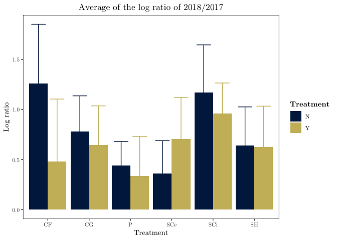

# Introduction

In forested systems, streams and their biota are intrinsically linked to riparian vegetation (@Vannote1980). Stream food webs depend on direct carbon subsidies from the terrestiral environment in the form of both leaf litter and terrestrial invertebrates, but riparian controls on stream systems aren't limited to biological inputs. Riparian canopy cover also has an indirect effect on stream food webs throughthe control of light available for benthic primary production. In the Pacific Northwest (PNW) region of North America, riparian forests have changed substantially in the past half century. After a legacy of heavy harvesting, riparian forest protections have created dense second-growth vegetation along streams in contrast with old-growth forests with high canopy heterogeneity. The dense vegetation in these regenerating forests decreases light availability and limits benthic primary production. As forest stand development continues natural disturbances and individual tree mortality will increase canopy heterogeneity through the introduction of gaps.To understand how aquatic food webs respond to an increase in light associated with canopy gaps, we investigate the response of macroinvertebrates and fish feeding to canopy-opening manipulations.

Light, and its impact on primary productivity in streams is of particular interest because autochthonous carbon can be disproportionately represented in higher trophic levels relative to its availability in many aquatic environments (@Lau2009, @McCutchan2002). In headwater systems specifically, basal carbon availability is dominated by leaf litter (@McCutchan2002) yet, energetically, algae is a higher quality food source and is preferentially assimilated (@Macarelli2011). Invertebrates in the scraper feeding guild have a competetive advantage evolved specialized mouthparts for consuming benthic algal biofilms (periphyton), have a competetive advantage. Increases in algal production often ilicits a positive response among these scraping taxa (@ sources). 

Stream secondary production is dominated by aquatic macroinvertebrates which play an important role in assimilating and transducing energy to higher trophic levels such as insectivorous fish and other vertebrate predators.  Because macroinvertebrates play a crucial role in mediating food web interactions, understanding their community dynamics can provide key insights into broader ecosystem functioning. Macroinvertebrate community data can be used as a metric of stream health, 

In headwater streams trout are oportunistic foragers, eating whatever is available in their habitat. Cutthroat trout feed from the water column using visual cues to capture prey. Because salmonids are visual predators, their feeding efficiency can be influenced by light conditions and visibility (@Wilzbach1986). 

Clear cutting and the resultant reach-level increase in stream light can increase stream primary and secondary productivity, but increases in light also lead to increases in temperature, and cutting to the stream edge can increase sediment loads. Given these negative impacts, clear cutting along streams is no longer a common practice in the Pacific Northwest--even in managed landscapes riparian buffers are left. In unmanaged forests, and in these riparian forest buffers, stands are in the early to mid-seral stages with dense homogenous canopy cover and low stream light (@Kaylor2017). **As forest stand development continues natural disturbances and individual tree mortality will increase canopy heterogeneity through the introduction of gaps.** While studies on reach-scale forest clearing demonstrate a clear response in benthic primary producers, invertebrates, and trout to release from light limitation, this does not reflect the future stream conditions in most forested landscapes. As stands progress toward late succesional forest structure, localized light patches (rather than large openings) will become increasingly prevelant, and have not been studied. We hypothesize that canopy gaps will produce a muted response compared to clear cutting,  causing an increase in primary production causing the macroinvertebrate community to change in response to resource availability, and changes in the invertebrate community will be reflected in the opportunistic foraging of trout.

# Methods

##Study location

The study consists of five reach pairs on five replicate streams in the western Cascade Mountains of Oregon. Each reach pair consisted of one treatment reach and one reference reach. Two of the reach pairs (W-100, W-113) are located on private Weyerhaeuser Co. land, and three (LOON, CHUCK, MCTE) are located on U.S. Forest Service land, one of which (MCTE) is situated in the HJ Andrews Experimental Forest. Stream reaches were 90 meters in length and treatment gaps were 20 to 40 meters in diameter and situated approximately in the middle of treatment reaches. Sites had a buffer between stream reach pairs to limit any effects of the upstream reach on downstream conditions.

All of the streams are wadeable, fish-bearing streams with bankfull widths of 1-8 meters. Fish-bearing streams were purposefully selected to provide management-relevant results for key species such as salmonids. The streams run through 40-60-year-old riparian forests regenerating from previous harvest. These forests have a homogenous canopy structure with heavy understory shading, as defined by their early seral stage. Small streams were chosen for ease of sampling and to maximize the effect of a canopy opening manipulation since small streams may be completely shaded by overhead vegetation. 

## Study Design

The before-after, control-impact (BACI) study design lends itself to experimental field studies by accounting for natural variations between sites.  Going forward, a sample unit will refer to a whole stream including both treatment and reference reaches because the metric of interest will always be the ratio between the two reaches. Therefore we have five sample units with two repeated measures, pre and post-treatment. To test for effects of the gap treatment, we quantify changes in the reach ratio between the two years.

Samples were collected during summer 2017 and summer 2018 with pre-treatment data gathered during summer 2017 and post-treatment data gathered during summer 2018. Canopy gaps were cut in the treatment reach during the winter of 2017-18 to permit adequate time for response to the canopy manipulation. 

## Data Collection

### Light

Photosynthetically active radiation (PAR) was estimated from flourescien decay rate over a twenty-four hour period. 

### Chlorophyll *a*

In each study reach, and every ten meters, three ceramic tiles (dimension x dimension) were placed every 10 meters within a stream reach and left for at least three weeks before they were collected so periphyton communities could establish. Tiles were deployed and collected at the same time for both the control and treatment reaches of each stream to keep within unit measures consistent. Chlorophyll **a** concentrations were quanitified using a BenthoTorch^TM^ after tiles were kept in the dark, submerged in water for two hours.

During collection at the two streams with snails as the dominant scraper , the number of snails (Juga) and cased caddisfly (observed taxa being Uenoidae and Glossosomatidae primarily) on each tile were recorded and then removed.  before taking readings with a BenthoTorch^TM^. 

### Benthic Invertebrate Sampling

Three benthic invertebrate samples were taken at each stream reach at meters 15, 45, and 75, or the closest area with non-boulder substrate. Samples were collected once per year over the course of one week using a Surber sampler with a .09 m^2^ sampling area. Substrate was disturbed to a depth of approximately 4 inches for one minute. The sample was then preserved in 95% ethanol for identification and enumeration in the lab.  

In the lab, the three benthic samples per reach were combined and subsampled using a Caton tray. Squares $\frac{1} {30}$ of the area of the Caton tray were randomly sampled until the cutoff of 300 individuals or greater was reached. Benthic invertebrates were then identified down to genus or the lowest taxonomic unit (LTU) for cryptic taxa. Counts from subsamples were then converted to densities using the formula $\frac{1}{3*s*0.09}$ where $s$ is the fraction subsampled, 0.09 is the area of the Surber sampler in square meters, and the result is divided by three because three samples were pooled. Singleton taxa (taxa occurring in only one SU) were removed from the original matrix and density values were square-root transformed to reduce the effect of abundant taxa (Chironomidae, Baetis, Micrasema) on community relationships. The resulting matrix of benthic invertebrates at the LTU level of identification (20 reaches by 64 taxa) was then used for analysis. 
Functional feeding groups assigned from Meritt and Cummins.

### Trout Diets

To avoid influencing the benthic invertebrate community, streams were electroshocked to collect cutthroat trout diets either immediately following, or the day after invertebrate sampling. Trout diets were collected during three-pass depletion of fish standing stock and were only taken from a subset of fish greater than 100 mm in length. Fish were anesthetized using NOT CLOVE OIL and gastro-lavaged. Stomach contents were evacuated using two 60 mL syringes of water injected with a piece of 4 inch long tubing. Diet samples were collected in filter paper and preserved in 95% ethanol for lab processing.

All trout diets were processed (9 to 13 diets per reach) with aquatic invertebrates identified down to the family level and terrestrial invertebrates identified to order. Because the number of fish dieted in each reach varied, the average of all fish diets was used. The resulting matrix was then filtered for aquatic species and appended to a matrix of 2018 benthic invertebrate families (10 reaches by 38 families), producing a matrix of 20 sample units (SU’s) by 40 families consisting of both fish diets and benthic samples. Singleton taxa were then removed to create a matrix of combined diet and benthic families of 20 SU’s by 36 families. At this point, the combined matrix was relativized by row maxima to compensate for the difference between benthic sampling—measured in density per m2—and fish diets.

## Data Analysis

BACI for light, chla, invert densities, ffg density, 

Statistical analyses were performed in PC-ORD (@PC-ORD) and R (@R-base) using the Vegan package (@vegan). Blocked multi-response permutation procedure (MRBP) was used to assess differences between treatment and control reaches in the pre and post treatment years. MRBP was followed up with blocked indicator species analysis (ISA) to determine underlying taxa driving any grouping detected by MRBP. This two-step procedure was performed twice for the benthic community, once with family level community data and once at the LTU level in order to compare any differences in results. The combined benthic and diet matrix was subsequently tested for any differences between treatment and control reaches using the same MRBP and ISA methods. 

To test for any pre-treatment reach differences in 2017, MRBP was run on 2017 data only with Treatment as the two a priori groups and blocked by Stream. The 2018 post-treatment data was then assessed using the same MRBP grouping and blocking. MRBP is a nonparametric method used to test for differences between groups. This method accommodates paired or blocked study designs by accounting for variation related to study design variables that have little bearing on the question being addressed. In this case, MRBP accounts for any between-stream variation. MRBP outputs a p-value for the observed within-group distance (smaller distances constituting stronger grouping) by shuffling SU’s between groups to generate a distribution of possible within-group distances (@McCune2002).

The follow-up ISA calculates an indicator value (IV) for each species. The IV is a composite of a taxon’s fidelity and exclusivity to a group. If a taxon is consistently abundant in one group and never present in any other, then it would receive a high IV. Conversely, a taxon rarely abundant in SU’s of one group and present in other groups would receive a low IV (@McCune2002). A Monte Carlo test of 1,000 permutations of the taxa matrix was used to generate a p-value for each taxon’s IV.

The taxon resolution was lowered from the LTU level to family level for benthic samples in order to create a matrix of both fish and benthic samples. In order to judge the impact of reducing taxon resolution on interpreting benthic community relationships, two ordinations of benthic invertebrates were performed, one in LTU space and one in family space using nonmetric multidimensional scaling (NMS) in order to determine whether different conclusions would be drawn from lower levels of identification (Kruskal, 1964). Sorensen distance was used for both ordinations to reduce the impact of outliers. Ties were not penalized, although there were no ties in either matrix, and the ordination was rotated to maximize the environmental variable BenthoTotal along axis 1. A random start was used 

and the real data were run 250 times to ensure an absolute stress minima was reached. A Monte Carlo test with 100 permutations was used to generate a p-value for the probability of the final ordination have a lower than expected p-value by chance.To further test for differences between the level of identification used, a mantel test was applied to the original family and LTU benthic distance matrices. The distance matrices were calculated using Sorensen distances and a Monte Carlo test of 1000 permutations was used to generate a p-value.

# Results

## Light

In 2017, before treatment, the average light reaching the stream benthos among the five streams was **XXX** $\frac{moles}{m^2}$ and there was an average difference between the treatment and reference reach of **XXX** $\frac{moles}{m^2}$.  In 2018, after gaps were cut, light went up by **XXX** $\frac{moles}{m^2}$ on average in the treatment reach compared to the reference reach resulting in a final yearly difference between reach ratios of **XXX** (**XXX** p-value, **XXX** t-value).

## Chlorophyll *a*

Mean chlorophyll *a* values for each reach varied between **XXX** and **XXX** in 2017, with little difference between the reach pairs (**Ratio value**, **XXX** p-value).  After gaps were cut, Chla values went up by **XXX** on average, but increased significantly more in the gap reach (**Ratio value**, **XXX** p-value). 

## *Juga* on Tiles

The average density of snails on tiles between the two streams with *Juga* present in the pre-treatment year varied between **XXX** and **XXX** snails per m^2 with little difference between the control and treatment reach.  In the post treatment year the average snail density in the treatment reach increased by **XXX** snails per m^2, whereas snail density in the control reach only increased by **XXX**. The ratio between 

## Benthic Invertebrate Community

There was little difference between benthic LTU-level communities in the treatment versus reference reaches in the 2017 pre-treatment year (MRBP: A = 0.041, p = 0.071), or the post-treatment year (A = -0.022, p = 0.838). When the family-level benthic community data was used, the results were similar (Table 1). The results from the NMS ordinations support the results of the MRBP, showing similar results for both LTU space and family space (Fig. 1a and Fig. 1b). The NMS ordination of benthic invertebrates in LTU space converged on a 2D solution with a final stress of 12.031, whereas in family space a 3D solution was more desirable. To make comparisons easier, a 2D solution was forced for the ordination in family space. The forced 2D solution in family space had a similar stress value (stress = 11.412) to the 2D ordination in LTU space, and they captured similar amounts of variance in original taxa space (genera level = 89.3% of variance, family level = 91.3% of variance). In addition, the family ordination and the LTU ordination had similar relationships with the environmental variables BenthoTotal (total chlorophyll values from the Bentho TorchTM) and YearTreatQ (a binary variable coded with 1’s for 2018 treated reaches and 0’s for all other reaches) with positive r values with axis 1 of 0.272 and 0.298 for YearTreatQ, and 0.304 and 0.41 for BenthoTotal respectively. The mantel test showed a similar level of relatedness between the original family and LTU distance matrices (r = 0.986, p = 0.001)

## Invertebrate Functional Feeding Groups

|FFG|t-value |  p-value |
|---|:------:|----------|
|SH	|  0.07	 |      0.95|
|P	|  0.52  |      0.62|
|SCe|	-1.55	 |      0.16|
|CG	|  0.60  |      0.57|
|SCi|	 0.86  |      0.42|
|CF	|  2.13	 |      0.07|
|All Bugs|0.84|     0.43|

## Trout Diet

# Discussion

Light and Chla responded as expected to an opening of the riparian canopy. 

The *Juga* snail response fits our hypothesis, but hadn't been anticipated prior to field observations.  

The overall response of the benthic invertebrate community to the canopy gaps was slight and indicates that no one species confers a competitive advantage from either increases in light or increased autochthonous production. 

When we replace taxonomy with functional groups, we still see no real changes in the relative abundance of functional feeding groups, which fits with our results from NMS.

Power and Dietrich advocate for species exculsion studies to determine the top-down pressure of upper level consumers on lower members of the stream community (2002), but experimentally enhancing a particular basal resource can also reveal energy pathways and which community members are poised to take advantage of specific energy subsidies. 

In resiliency theory, the ability of a community to resist change is dependent on both the magnitude of disturbance and the degree of interspecific competition.

\pagebreak

# References 

