## Introduction

Streams and their biota are inherently linked to riparian vegetation in forested systems.  In the Pacific Northwest (PNW) region of North America, riparian forests have changed substantially in the past half century. After a legacy of heavy harvesting, riparian forest protections have created dense second-growth vegetation along streams. The dense vegetation in these regenerating forests decreases light availability and limits benthic primary production.  Algae can have a disproportionate effect on higher trophic levels as an energy-dense food source, and a shift in this basal resource can have substantial effects on stream biota. To understand how aquatic food webs respond to an increase in light associated with canopy gaps, we investigate the response of macroinvertebrates and fish feeding to canopy-opening manipulations.

Earlier research has shown that relieving light limitation by clear-cutting riparian forests can result in an increase in stream primary and secondary productivity, but increases inlight also lead to increases in temperature and cutting to the stream edge can increase sediment loads. Given these negative impacts, clear cutting along streams is no longer a common practice in the Pacific Northwest—even in managed landscapes riparian buffers are left. In unmanaged forests, and in these riparian forest buffers, stands are in the early to mid-seral stages with dense homogenous canopy cover and low stream light (Kaylor et al., 2017). As forest stand development continues natural disturbances and individual tree mortality will increase canopy heterogeneity through the introduction of gaps. While studies on forest clearing at the reach level demonstrate a clear response in benthic primary producers, invertebrates, and fish to release from light limitation, the effects of localized light patches – that reflect a more realistic picture of future stream conditions in forested landscapes – have not been evaluated. 

## PAR {.tabset .tabset-fade .tabset-pills}
***

### 


### Methods
PAR values are from flourecien placed every 5 meters along streams. Three 1mL stint vials were placed every 5 meters in each reach and the average value of the three was used. To account for natural fluctuations in FL flourecence, controls wrapped in tin foil were placed at random 5 meter intervals with the 3 replicate vials.  The measured means were then adjusted by the mean natural change in control values.

### Figures


```r
FL$Stream <- recode(FL$Stream, Loon = "LOON", MCTE = "MCTE", `W-100` = "W-100", `W-113` = "W-113", Chucksney = "CHUCK")
FL$Stream <- factor(FL$Stream, levels = c("LOON", "MCTE", "W-113", "W-100", "CHUCK"))
FL$Reach<-as.factor(FL$Reach)
FL$Meter<-as.factor(FL$Meter)
FL$PAR<- as.numeric(FL$PAR)
```

```
## Warning: NAs introduced by coercion
```

```r
PAR.mean <- aggregate(PAR ~ Stream + Reach + Meter, mean, data = FL)

PAR.mean %>% filter(Stream != "W-122") %>%
  
  ggplot(aes(x = Meter, y = PAR, color = Reach, group = Reach)) +
    geom_line(size = 3) +
    ylab("PAR (mol/m^2 day)")+ scale_x_discrete(breaks = seq(0, 90, by = 15)) +
    labs(title = "Post Treatment",
         y = "PAR (mol/m^2 day)",
         x = "Meter",
         color = "Reach") + 
    ylim(0,18) +
    facet_wrap("Stream") +
    scale_color_viridis_d(option = "E") +
    theme(legend.position = c(.84, .27), legend.key.width = unit(3, "cm"),
          aspect.ratio = 1)
```

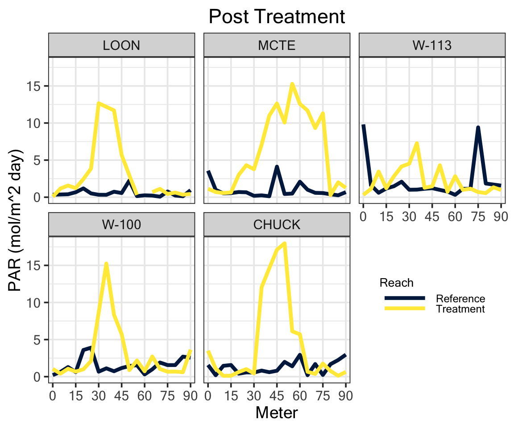<!-- -->

## Chlorophyll $\alpha$ {.tabset .tabset-fade .tabset-pills}
***

###

### Methods
Chlorophyll \alpha\ values were measured using a BenthoTorch. Three tiles every 10 meters

### Figures


```r
# Change variables to factors.  Re-order with CHUCK at the end
Both_years$Stream <- factor(Both_years$Stream, levels = c("LOON", "MCTE", "W-113", "W-100", "CHUCK", "W-122"))
Both_years$Year <- factor(Both_years$Year, levels = c("2018", "2017"))
Both_years$Year.Treatment <- as.factor(Both_years$Year.Treatment)
Both_years$Treatment <- as.factor(Both_years$Treatment)
Both_years$Meter <- as.factor(Both_years$Meter)
Both_years$BenthoTotal <- as.numeric(Both_years$BenthoTotal)

# Drop W-122.
Both_years <- Both_years %>% filter(Stream != "W-122")

# Calculate mean of the three tiles for each meter
bentho_both.mean <- aggregate(BenthoTotal ~ Stream + Treatment + Year.Treatment + Meter + Year, mean, data = Both_years)
bentho.reach <- aggregate(BenthoTotal ~ Stream + Treatment + Year.Treatment + Year, mean, data = Both_years)
write_csv(bentho.reach, "./Data/bentho.reach.csv")

ggplot(data = bentho_both.mean) +
  geom_line(mapping = aes(x = Meter, y = BenthoTotal, color = Treatment, 
  linetype = Year, group = Year.Treatment), size = 3) +
  labs(title = "Chlorophyll a by Meter Pre and Post Treatment", 
       y = "Chlorophyll a (ug/cm^2)",
       x = "Meter",
       color = "Reach") + 
  scale_x_discrete(breaks = seq(0, 90, by = 15)) +
  scale_color_viridis_d(option = "E") +
  facet_wrap("Stream") +
  theme(legend.position = c(.86, .2), legend.key.width = unit(3, "cm"),
        aspect.ratio = 1)
```

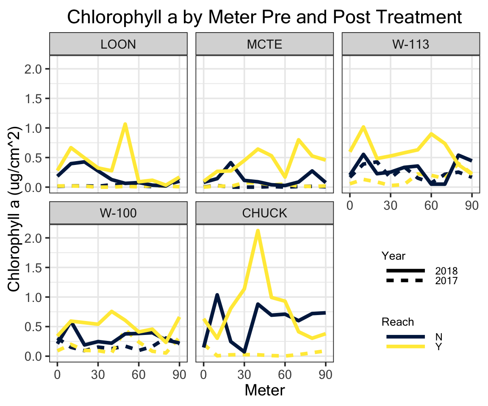<!-- -->

## Benthic Invertebrates {.tabset .tabset-fade .tabset-pills}
***

### Benthic Setup
***

In order to calculate density we must take into account that our count values are from a subsample of three pooled samples.


```r
#Calculations...
bugs$Density <- bugs$Count / bugs$PercentSub / .09  #Calculate total in pooled sample

bugs$CollDate <- as.Date(bugs$CollDate, format = "%m/%d/%y") %>% year() %>% as.factor()

bugs.agg <- bugs %>%
  group_by(CollDate, Stream, Treatment, Taxon) %>%
  summarise_at(vars(Density), funs(sum)) %>% ungroup

bugs.agg$Density <- bugs.agg$Density / 3    #Divide by number of samples pooled
```

***

We divide Count by percent subsampled (actually a fraction) to get a count for the total sample taken.  We then divide by .09 which is the area of the surber sampler (in m$^2$). We then aggregate and divide by three (There were three samples taken per reach).


```r
# Spread and then gather to fill missing Taxons with 0's
bugs.agg <- spread(bugs.agg, key = "Taxon", value = "Density") %>% #bugs.agg is benthic samples
  mutate_if(is.numeric , replace_na, replace = 0) %>% 
  gather(key = "Taxon", value = "Density", 4:ncol(.))
```


```r
# Add FFG and size classes
bugs.agg <- merge(bugs.agg, sizes) %>% merge(., ffg)

bugs.agg <- bugs.agg %>% mutate(StreamTreat = interaction(Stream, Treatment, sep = " "))
bugs.agg <- bugs.agg %>% mutate(YearTreat = interaction(CollDate, Treatment, sep = " "))

# Create list of CollDate, Stream and Taxon
bugs.reach.diff <- bugs.agg %>% select(-c("Density", "CollDate")) %>% unique()

# Calculate Differences
bugs.reach.diff$Diff <- bugs.agg$Density[bugs.agg$CollDate == "2018"] -     
  bugs.agg$Density[bugs.agg$CollDate == "2017"]

# Filter for only 2018 bugs
bugs18 <- filter(bugs.agg, CollDate == "2018")

bugs.treat <- bugs.agg %>% 
  group_by(Stream, Treatment, StreamTreat, YearTreat, FFG) %>%
  summarise_at(vars(Density), funs(sum)) %>% ungroup

bugs.treat <- bugs.agg %>% select(-c("Density", "CollDate")) %>% unique()
```


### Statistics


```r
# Find total density for all bugs per stream-reach and total density by FFG
bug_totals <- bugs.agg %>% group_by(Stream, Treatment, CollDate, YearTreat, StreamTreat) %>% 
  summarise_at(vars(Density), sum)
ffg_totals <- bugs.agg %>% group_by(Stream, Treatment, CollDate, YearTreat, StreamTreat, FFG) %>% 
  summarise_at(vars(Density), sum)

# Log transform density
bug_totals <- bug_totals %>% mutate(logDensity = log(Density))
ffg_totals <- ffg_totals %>% mutate(logDensity = log(Density))
```

We will start with plotting total invertebrate density for a single stream with both reaches for both years in order to get a feel for the raw data.  Ultimately we will be taking the ratio between years for each reach and then comparing the change between years in the treatment reach to the change between years of the control reach to assess the effects of the canopy-opening treatment.


```r
bug_totals %>% filter(Stream == "W-113") %>%
  ggplot(aes(x = YearTreat, y = Density, group = CollDate, fill = Treatment)) +
  geom_col() +
  labs(title = "W-113 Invertebrate Density by Year and Reach",
       x = "Year and Treatment \n (Y = Treatment reach, N = Control reach)",
       y = "Invertebrate Density") +
  scale_fill_grey() +
    scale_color_grey()
```

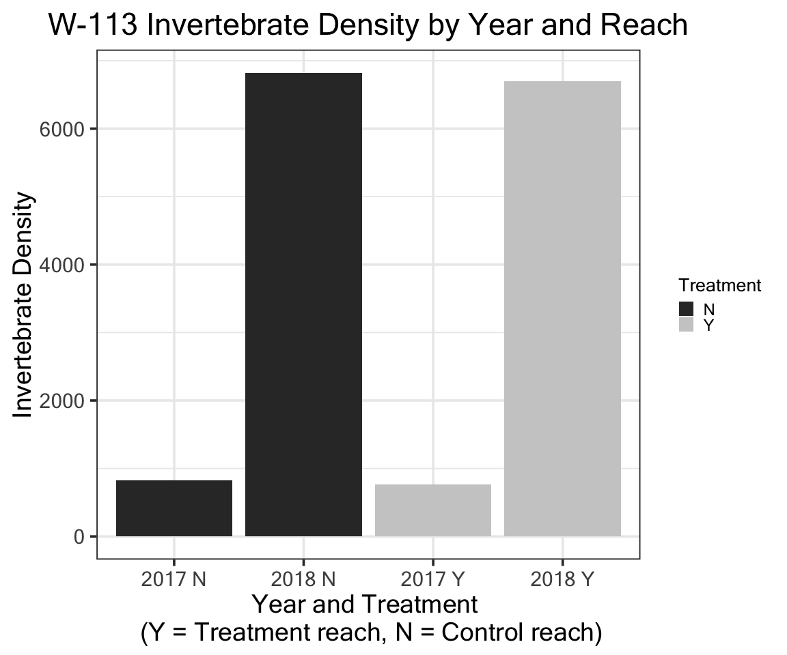<!-- -->

Next we plot log ratios between years (2018Y / 2017Y and 2018N / 2017N) for a single stream

A log ratio of 0 indicates no change in abundance between 2017 and 2018. Positive values mean an increase in abundance in the post-treatment year, and a negative value would suggest a decline in abundance in the post-treatment year.  We then compare the yearly ratio's of each reach (control or treatment) to assess the effect of the treatment.


```r
ffg.ratios %>%  group_by(Stream, Treatment) %>% summarise_at(vars(Difference, Ratio, `Log(Ratio) Year`), mean) %>% 
  filter(Stream == "W-113") %>% 
  ggplot(aes(x = Treatment, y = `Log(Ratio) Year`, fill = Treatment)) +
  geom_col() +
  labs(title = "W-113 Log of Invertebrate Density Ratio's \n (2018 / 2017)",
       x = "Treatment \n (Y = Treatment reach, N = Control reach)",
       y = "Log(Ratio) of Invertebrate Density") +
  scale_fill_grey() +
    scale_color_grey()
```

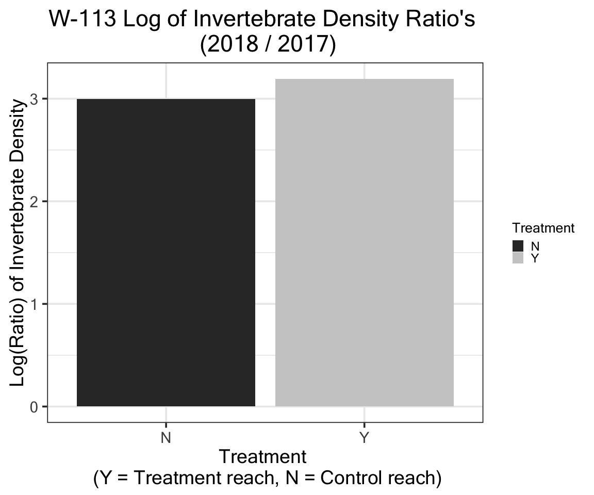<!-- -->


Now we plot all the log ratios


```r
ffg.ratios %>%  group_by(Stream, Treatment) %>% summarise_at(vars(Difference, Ratio, `Log(Ratio) Year`), mean) %>% 
  ggplot(aes(x = Stream, y = `Log(Ratio) Year`, fill = Treatment)) +
  geom_col(position = "dodge") +
  labs(title = "Log of Invertebrate Density Ratio's \n (2018 / 2017)",
       x = "Treatment \n (Y = Treatment reach, N = Control reach)",
       y = "Log(Ratio) of Invertebrate Density") +
  scale_fill_grey() +
    scale_color_grey()
```

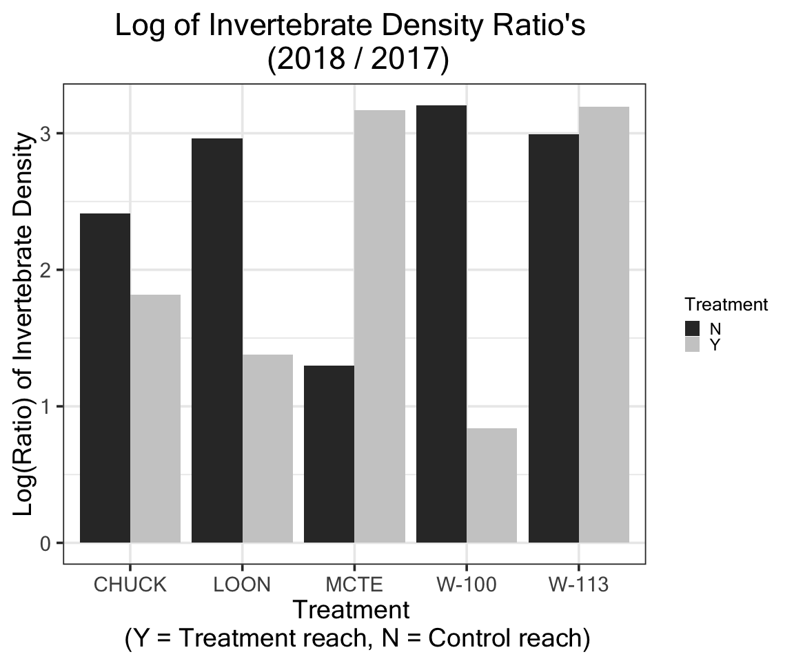<!-- -->


And now the average log ratio across streams for each reach with 95% confidence interval calculated using the t score from Welch's t-test.


```
## 
## 	Welch Two Sample t-test
## 
## data:  Log(Ratio) Year by Treatment
## t = 0.8416, df = 7.2983, p-value = 0.4267
## alternative hypothesis: true difference in means is not equal to 0
## 95 percent confidence interval:
##  -0.8831886  1.8718997
## sample estimates:
## mean in group N mean in group Y 
##        2.573705        2.079349
```

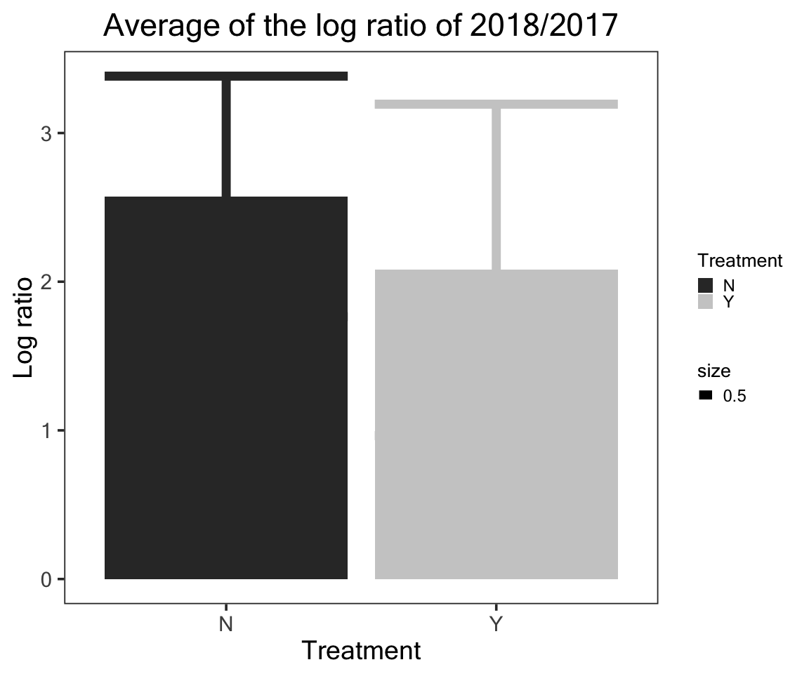<!-- -->

And now do it *all* again for FFG's.  We start with looking at one stream, then the log ratio for that stream, then the log ratio for all streams and finally the average log ratio for each FFG with error bars of one SD.


```r
ffg.ratios %>%  group_by(Stream, Treatment) %>% 
  filter(Stream == "W-113") %>% 
  ggplot(aes(x = Treatment, y = `Log(Ratio) Year`, fill = Treatment)) +
  geom_col() +
  labs(title = "W-113 Log of Invertebrate FFG Density Ratio's \n (2018 / 2017)",
       x = "Treatment \n (Y = Treatment reach, N = Control reach)",
       y = "Log(Ratio) of Invertebrate Density") +
  facet_wrap("FFG") +
  scale_fill_grey() +
    scale_color_grey()
```

<!-- -->


```r
ffg.ratios %>%  
  ggplot(aes(x = Stream, y = `Log(Ratio) Year`, fill = Treatment)) +
  geom_col(position = "dodge") +
  labs(title = "Log of Invertebrate Density Ratio's \n (2018 / 2017)",
       x = "Treatment \n (Y = Treatment reach, N = Control reach)",
       y = "Log(Ratio) of Invertebrate Density") +
  theme(legend.position = c(.1, .4), 
          legend.key.width = unit(5, "cm"),
          axis.text.x = element_text(angle = 45, vjust = 1, hjust=1)) +
  facet_wrap("FFG") +
  scale_fill_grey()+
    scale_color_grey()
```

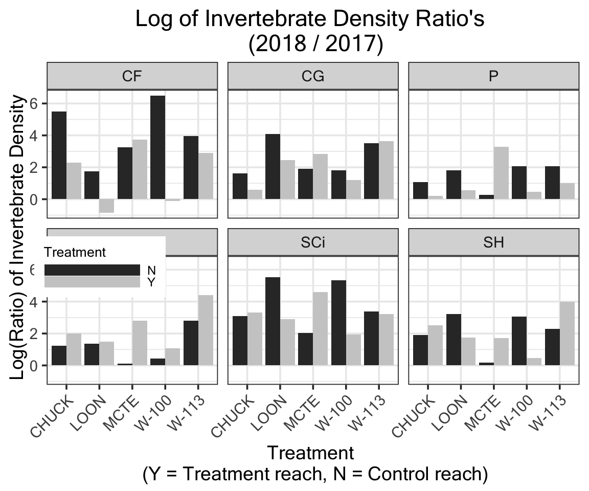<!-- -->


```r
ffg.avg.ratio <- ddply(ffg.ratios, .(FFG, Treatment), summarize,
      Mean = mean(`Log(Ratio) Year`),
      SD = sd(`Log(Ratio) Year`))

ffg_names <- c("SH", "P", "SCe", "CG", "SCi", "CF")

ffg_results <- data.frame("FFG" = numeric(6), "tval" = numeric(6), "pval" = numeric(6))  #initialize data frame
for (i in ffg_names){
  k = match(i, ffg_names)  #find the index of i in ffg_names
  x <- filter(ffg.ratios, FFG == i) %>%
  t.test(`Log(Ratio) Year` ~ Treatment, data = .)
  ffg_results[k, "FFG"] <- i
  ffg_results[k, "tval"] <- x$statistic
  ffg_results[k, "pval"] <- x$p.value
}

ffg_results
```

```
##   FFG        tval       pval
## 1  SH  0.07116171 0.94502245
## 2   P  0.51615186 0.62249307
## 3 SCe -1.54654398 0.16243792
## 4  CG  0.59784682 0.56661332
## 5 SCi  0.85529788 0.42161230
## 6  CF  2.13219822 0.06567809
```

```r
ffg.avg.ratio %>% 
  ggplot(aes(x = FFG, y = Mean, fill = Treatment)) +
  geom_col(position = "dodge") +
  geom_errorbar(aes(x = FFG, ymin = Mean - ((SD*2.345)/sqrt(5)), ymax = Mean + ((SD*2.345)/sqrt(5)), 
                    color = Treatment), 
                position = "dodge") +
  labs(title = "Average of the log ratio of 2018/2017",
       x = "Treatment",
       y = "Log ratio") +
  theme(panel.grid.minor = element_blank(),
        panel.grid.major = element_blank()) + 
  scale_fill_grey()+
    scale_color_grey()
```

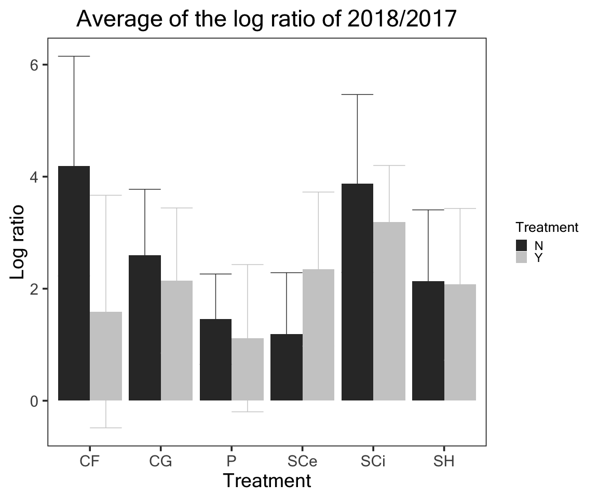<!-- -->

Use differences instead of ratio's to see if there's a difference.


```r
bugs.reach.diff %>% filter(FFG == "SCe" | FFG == "SCi") %>% group_by(Treatment, Taxon) %>% 
  ddply(.(Treatment, Taxon), summarize,
        Mean = mean(Diff),
        SD = sd(Diff)) %>%
  ggplot(aes(x = Taxon, y = Mean, fill = Treatment)) +
    geom_col(position = "dodge") +
  geom_errorbar(aes(x = Taxon, ymin = Mean - ((SD*2.345)/sqrt(5)), ymax = Mean + ((SD*2.345)/sqrt(5)), color = Treatment), position = "dodge") +
    labs(title = "Mean Difference of Scraper Taxa (2018-2017)",
         x = "Taxon",
         y = "Mean Difference in Density") +
  theme(axis.text.x = element_text(angle = 45, vjust = 1, hjust = 1)) +
    scale_fill_grey() +
    scale_color_grey()
```

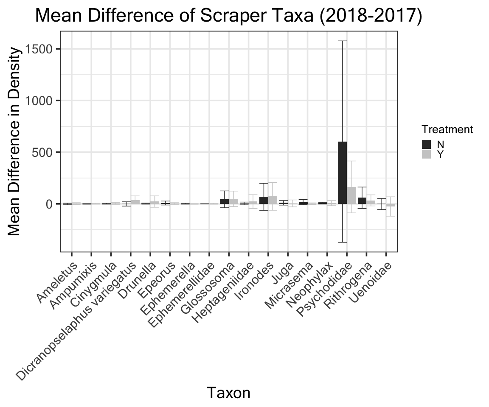<!-- -->

### NMS
***
Who knows what I'm actually doing, all of this ordination stuff is currently pre BOT 570.  I will definitely update all this once I know how to handle singleton taxa, loads of zero's, etc.


```r
# Spread data to get a taxon matrix, create factor of CollDate and Treatment
bugs.mds <- bugs.agg %>% 
  select(-c("FFG", "Size")) %>%
  group_by(Stream, Treatment, CollDate, Taxon) %>%  
  spread(key = "Taxon", value = "Density") %>%
  mutate_if(is.numeric , replace_na, replace = 0) %>% ungroup() %>%
  mutate(YearTreat = interaction(CollDate, Treatment) %>% factor(levels = c("2017.N", "2017.Y", "2018.N", "2018.Y"))) 
```


```r
# Get grouping variables and taxon matrix
Density <- bugs.mds %>% 
  select("Ameletus":"Zapada")

grouping <- select(Enviro, Stream, Treatment, CollDate, YearTreat, YearTreatQ, BenthoTotal)
```


```
## Run 0 stress 0.09528951 
## Run 1 stress 0.09895797 
## Run 2 stress 0.09448783 
## ... New best solution
## ... Procrustes: rmse 0.03108128  max resid 0.1062777 
## Run 3 stress 0.09528918 
## Run 4 stress 0.377059 
## Run 5 stress 0.1006329 
## Run 6 stress 0.09475369 
## ... Procrustes: rmse 0.0186945  max resid 0.06804548 
## Run 7 stress 0.103675 
## Run 8 stress 0.103675 
## Run 9 stress 0.09475523 
## ... Procrustes: rmse 0.01893683  max resid 0.06901956 
## Run 10 stress 0.09448773 
## ... New best solution
## ... Procrustes: rmse 0.0001926075  max resid 0.0006338606 
## ... Similar to previous best
## Run 11 stress 0.1036791 
## Run 12 stress 0.1006332 
## Run 13 stress 0.09751135 
## Run 14 stress 0.1031149 
## Run 15 stress 0.09800212 
## Run 16 stress 0.09448774 
## ... Procrustes: rmse 8.844221e-05  max resid 0.0002978479 
## ... Similar to previous best
## Run 17 stress 0.1036757 
## Run 18 stress 0.1006329 
## Run 19 stress 0.09448733 
## ... New best solution
## ... Procrustes: rmse 0.0009820302  max resid 0.003475514 
## ... Similar to previous best
## Run 20 stress 0.09448721 
## ... New best solution
## ... Procrustes: rmse 0.0007888625  max resid 0.002812891 
## ... Similar to previous best
## *** Solution reached
```


```r
#set up NMDS with dimensions of sol and env factors from "Enviro". 
NMDS <- data.frame(x = sol$points[, 1], y = sol$points[ ,2], 
                   Stream = select(grouping, Stream), 
                   Treatment = select(grouping, Treatment), 
                   CollDate = select(grouping, CollDate),
                   YearTreat = select(grouping, YearTreat),
                   Chla = select(grouping, BenthoTotal),
                   YearTreatQ = select(grouping, YearTreatQ))
```


```r
Reach17N <- NMDS[NMDS$YearTreat == "2017.N", ][chull(NMDS[NMDS$YearTreat == 
    "2017.N", c("x", "y")]), ] 

Reach17Y <- NMDS[NMDS$YearTreat == "2017.Y", ][chull(NMDS[NMDS$YearTreat == 
    "2017.Y", c("x", "y")]), ] 

Reach18N <- NMDS[NMDS$YearTreat == "2018.N", ][chull(NMDS[NMDS$YearTreat == 
    "2018.N", c("x", "y")]), ] 

Reach18Y <- NMDS[NMDS$YearTreat == "2018.Y", ][chull(NMDS[NMDS$YearTreat == 
    "2018.Y", c("x", "y")]), ] 

hull.data <- rbind(Reach17N, Reach17Y, Reach18Y, Reach18N) 
```


```r
vec.env <- envfit(sol, grouping, perm = 1000, na.rm = TRUE)
vec.env.df <- scores(vec.env, display = "vectors") %>% as.tibble() %>% slice(2:n())
vec.env.df$names <- c("Chla", "YearTreatQ") 
```


```r
ggplot(data = NMDS, aes(x, y)) +
  annotate("text", x = (NMDS$x), y = (NMDS$y) + .02, label = NMDS$Stream, size = 8) +
  geom_polygon(hull.data, mapping = aes(x = x, y = y, fill = YearTreat, group = YearTreat), alpha = .2) +
  geom_point(aes(x = x, y = y, shape = Stream), size = 5) +
  geom_segment(data = vec.env.df, aes(x = 0, xend = NMDS1, y = 0, yend = NMDS2),
      arrow = arrow(length = unit(0.1, "cm")), colour = "red", inherit_aes = FALSE, size = 4) +
  geom_text(data = vec.env.df, aes(x = NMDS1, y = NMDS2, label = names), size = 18, color = "red") +
  labs(title = "NMS of Benthic Invertebrate Community",
       x = "Axis 1",
       y = "Axis 2") +
  scale_fill_viridis_d() +
  theme(axis.text.x = element_blank(),  # remove x-axis text
        axis.text.y = element_blank(), # remove y-axis text
        axis.ticks = element_blank(),  # remove axis ticks
        panel.background = element_blank(), 
        panel.grid.major = element_blank(),  #remove major-grid labels
        panel.grid.minor = element_blank(),  #remove minor-grid labels
        plot.background = element_blank(),
        legend.position = c(.08, .76)) 
```

```
## Warning: Ignoring unknown parameters: inherit_aes
```

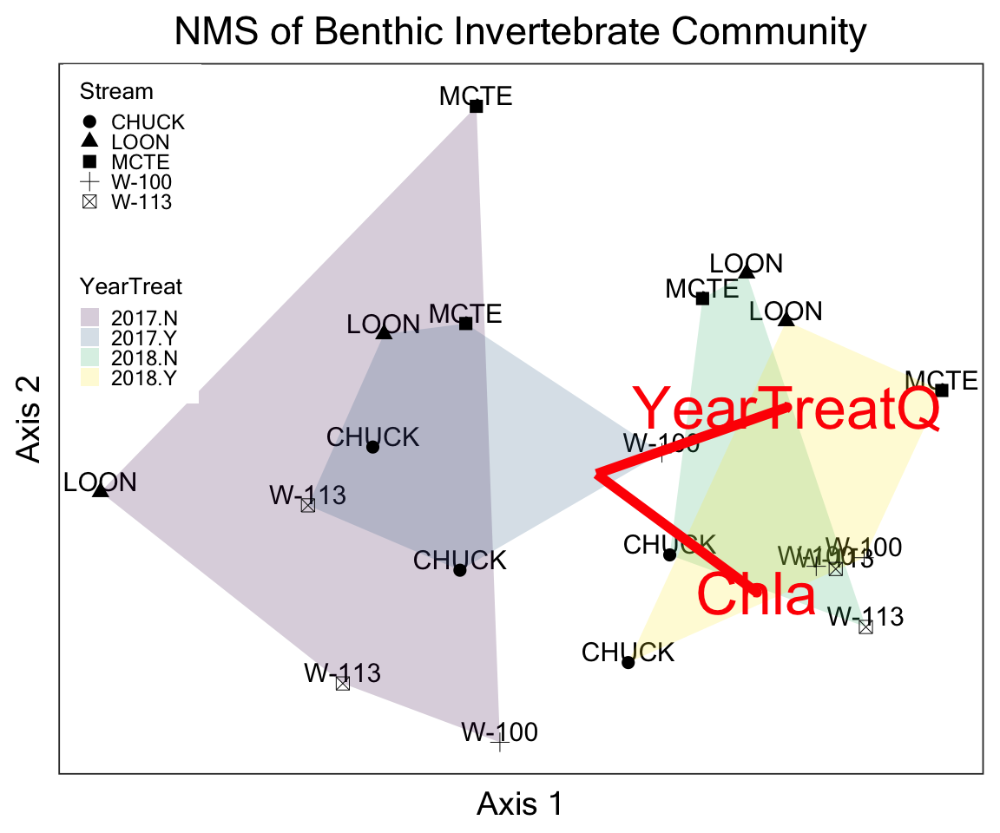<!-- -->

Actually maybe cool result, all of the treatment reaches now plot closer post-gap year. The controls show a similar pattern though maybe a little less pronounced. Everything also shifted left between the two years, although this isn't because of the treatment, just annual changes. Maybe the gap amplified whatever effect the year had, extra, extra light or temperature maybe.


### Summary Info 
***


```r
bugs.agg %>% mutate(CollDate.Treatment = interaction(Treatment, CollDate)) %>%
group_by(Stream, CollDate.Treatment) %>%
  summarise_at(vars(Density), funs(sum)) %>%
  
  ggplot(aes(x = Stream, y = Density, fill = CollDate.Treatment)) + 
  geom_col(position = "dodge") +
  ggtitle("Total Inverebrate Density (m^2)") +
  scale_fill_viridis_d(option = "E") 
```

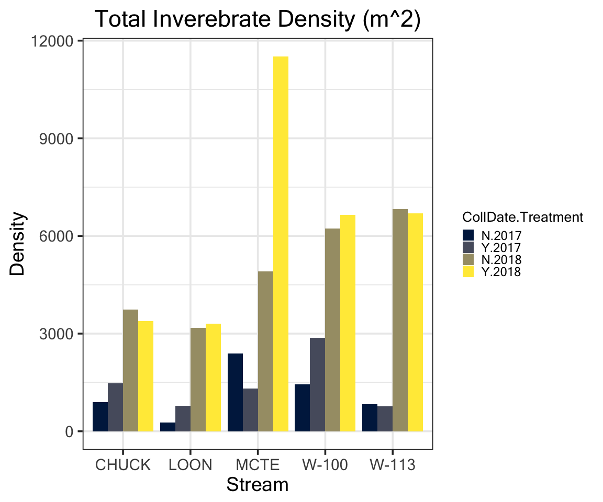<!-- -->

The gap has no real effect, except maybe MCTE. We saw this in the t tests and bar plots, and in the ordination.  

## Diets {.tabset .tabset-fade .tabset-pills}
***

### Diet Setup
***


```r
# Fill missing family's with order
Diets$Family[is.na(Diets$Family)] <- Diets$Order[is.na(Diets$Family)]

# Merge diets, sizes and FFG's
Diets <- merge(Diets, sizes, by.x = "Family", by.y = "Taxon") %>% 
  merge(., ffg, by.x = "Family", by.y = "Taxon")

# Aggregate by rep
Diets.by.fish <- Diets %>% 
  group_by(Family, Stream, Treatment, Origin, FFG, Size, Rep) %>%
  summarise_at("Count", funs(sum)) %>% ungroup

# Aggregate by reach
Diets.reach <- Diets %>% 
  group_by(Family, Stream, Treatment, Origin, FFG, Size) %>%
  summarise_at("Count", funs(sum)) %>% ungroup
```


```r
bugs.family <- bugs %>% 
  filter(CollDate == "2018") %>%
  select(-Taxon) %>% 
  group_by(Stream, Treatment, Family, CollDate) %>%
  summarise_at(vars(Density), funs(sum)) %>% ungroup

bugndiet <- merge(Diets.reach, bugs.family, all.x = TRUE, all.y = TRUE) %>% 
  filter(Origin == "A") %>%
  mutate_if(is.numeric, replace_na, replace = 0)
```


```r
Diets.reach$Stream.Treat <- interaction(Diets.reach$Treatment, Diets.reach$Stream)

Diets.reach %>%
  group_by(Stream.Treat, Origin) %>%
  summarise_at(vars(Count), funs(sum)) %>% ungroup() %>%

ggplot(aes(x = Stream.Treat, y = Count, fill = Origin)) +
  geom_col(position = "stack") +
  labs(title = "Mean Aquatics and Terrestrials \n in Diets by Reach",
       y = "Mean # in Diet",
       x = "Stream and Reach") +
    theme(legend.position = c(.15, .9), 
          legend.key.width = unit(5, "cm"),
          axis.text.x = element_text(angle = 45, vjust = 1, hjust=1)) +
    scale_fill_viridis_d(option = "E", end = .8)
```

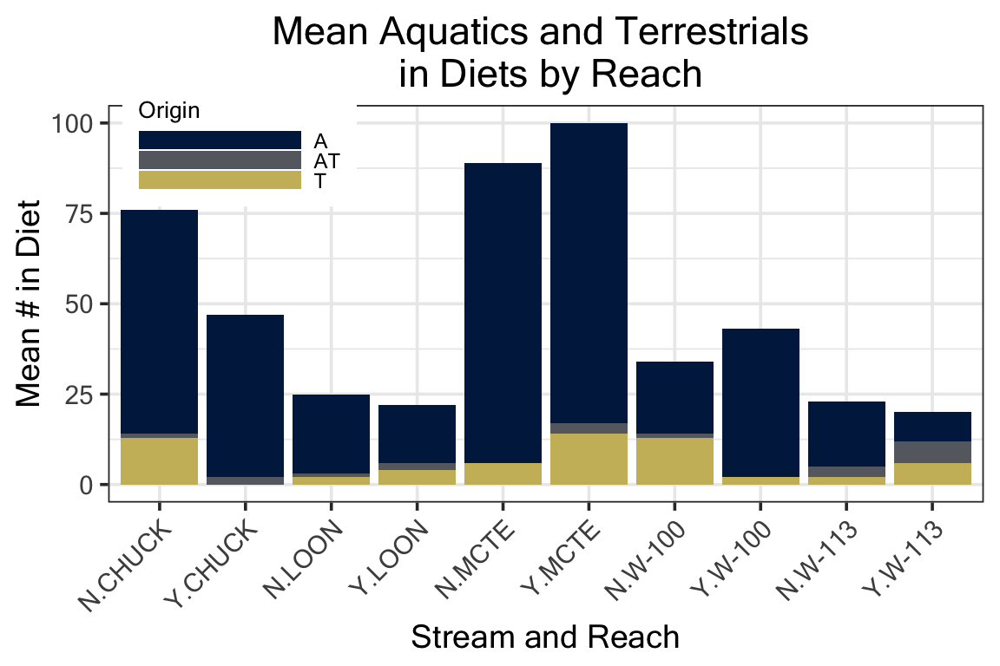<!-- -->


### By Family
***


```r
# Plot proportion of a taxon in the benthic community versus proporion of a taxon in the diet community
bugndiet$StreamTreat <- interaction(bugndiet$Stream, bugndiet$Treatment)
  
bugndiet.fam <- bugndiet %>% 
  transform(frac.diet = Count / ave(Count, StreamTreat, FUN = sum)) %>%
  transform(frac.benthic = Density / ave(Density, StreamTreat, FUN = sum)) 


bugndiet.fam <- bugndiet.fam %>% mutate(Family = recode(Family, "Brachycentridae" = "Brachycentridae", "Chironomidae" = "Chironomidae", "Juga" = "Juga", "Baetidae" = "Baetidae", "Micrasema" = "Micrasema", "Ephemerellidae" = "Ephemerellidae", "Heptageniidae" = "Heptageniidae", "Elmidae" = "Elmidae", .default = ""))


ggplot(aes(x = frac.benthic, y = frac.diet, color = Treatment), data = bugndiet.fam) +
    geom_point(size = 8) +
    geom_abline(slope = 1, intercept = 0) +
    coord_cartesian(ylim = c(0, .8), xlim = c(0, .8)) +
    geom_text_repel(aes(x = frac.benthic, y = frac.diet, label = Family), size = 8, point.padding = 1, box.padding = .5) +
    labs(title = "Prop. of Taxa in Benthic Comm. \n Vs. Prop. in Diets",
         x = "Proportion of Benthic",
         y = "Proportion of Diet") +
    facet_wrap("Stream", ncol = 3) +
    scale_color_viridis_d(option = "E") +
    theme(legend.position = c(.84, .27), legend.key.width = unit(3, "cm"),
          aspect.ratio = 1)
```

<!-- -->

```r
c("Brachycentridae", "Chironomidae", "Juga", "Baetidae", "Micrasema", "Ephemerellidae")
```

```
## [1] "Brachycentridae" "Chironomidae"    "Juga"            "Baetidae"       
## [5] "Micrasema"       "Ephemerellidae"
```

Plot of proportional abundance of an individual taxon in the benthic community versus the proportional abundance of the aggregate diets for that reach. 

Here we see that Chironomidae typically make up the greatest abundance of both the fish diets and the benthic community, with LOON being the exception (Brachycentridae are equally represented in the diets of control reach and over represented in the treatment). In MCTE, Juga compose a large part of the diets relative to their abundance due to one outlier fish. 

There are no overarching differences in how a taxa maps out given the treatment, but the difference in Brachycentridae in LOON between treatment and control is interesting.

### By FFG
***


```r
# Plot proportion of a FFG in the benthic community versus proporion of a FFG in the diet community
bugndiet %>% 
  group_by(StreamTreat, Stream, Treatment, FFG) %>% 
  summarise_if(is.numeric, funs(sum)) %>% 
  transform(frac.diet = Count / ave(Count, StreamTreat, FUN = sum)) %>%
  transform(frac.benthic = Density / ave(Density, StreamTreat, FUN = sum)) %>% ungroup() %>%

  ggplot(aes(x = frac.benthic, y = frac.diet, color = Treatment)) +
    geom_point(size = 6) +
    geom_abline(slope = 1, intercept = 0) +
    coord_cartesian(ylim = c(0, 1), xlim = c(0, 1)) +
    geom_text_repel(aes(x = frac.benthic, y = frac.diet, label = FFG), size = 8, point.padding = .5, box.padding = .5) +
    facet_wrap("Stream", ncol = 4) +
    labs(title = "Prop. of FFG's in Benthic Comm. Vs. Prop. in Diets", 
         x = "Proportion of Benthic",
         y = "Proportion of Diet") +
    scale_color_viridis_d(option = "E") +
    theme(legend.position = c(.4, .15),
          axis.title.x = element_text(hjust = -.1),
          aspect.ratio = 1,
          axis.text.x = element_text(angle = 45, vjust = 1, hjust = 1))
```

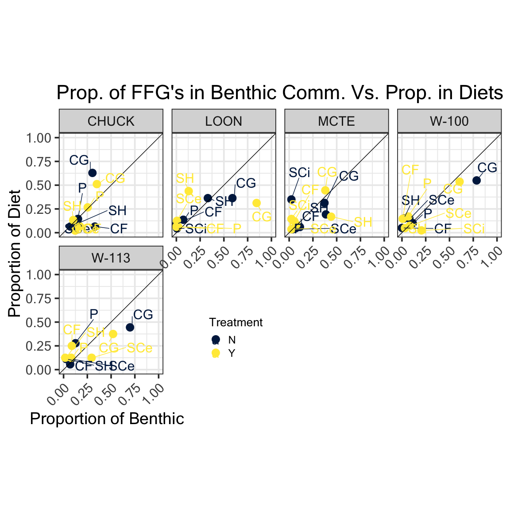<!-- -->

Plot of proportional abundance of an individual FFG in the benthic community versus the proportional abundance of the aggregate diets for that reach.

We see that Collector Gatherers and Shredders are the most abundant both in diets and in the benthic community.  There aren't any over arching trends in how FFG's fall out by treatment.


### By Size Class
***


```r
# Plot proportion of a size class in the benthic community versus proporion of a FFG in the diet community
bugndiet %>% 
  group_by(Stream, Treatment, Size) %>% 
  summarise_if(is.numeric, funs(sum)) %>% 
  mutate(frac.diet = Count / sum(Count)) %>%
  mutate(frac.benthic = Density / sum(Density)) %>%
  mutate_if(is.character, replace_na, replace = "T") %>%

  ggplot(aes(x = frac.benthic, y = frac.diet, color = Treatment)) +
    geom_point() +
    geom_text(aes(x = frac.benthic, y = frac.diet, label = Size), size = 4, nudge_y = .02) +
    geom_abline(slope = 1, intercept = 0) +
    coord_cartesian(ylim = c(0, 1), xlim = c(0, 1)) +
    facet_wrap("Stream") +
    ggtitle("1-1 Prop. of Size Classes in Benthic Comm. Vs. Prop. in Diets") +
    scale_color_viridis_d(option = "E") +
    theme(legend.position = c(.84, .27), legend.key.width = unit(5, "cm"))
```

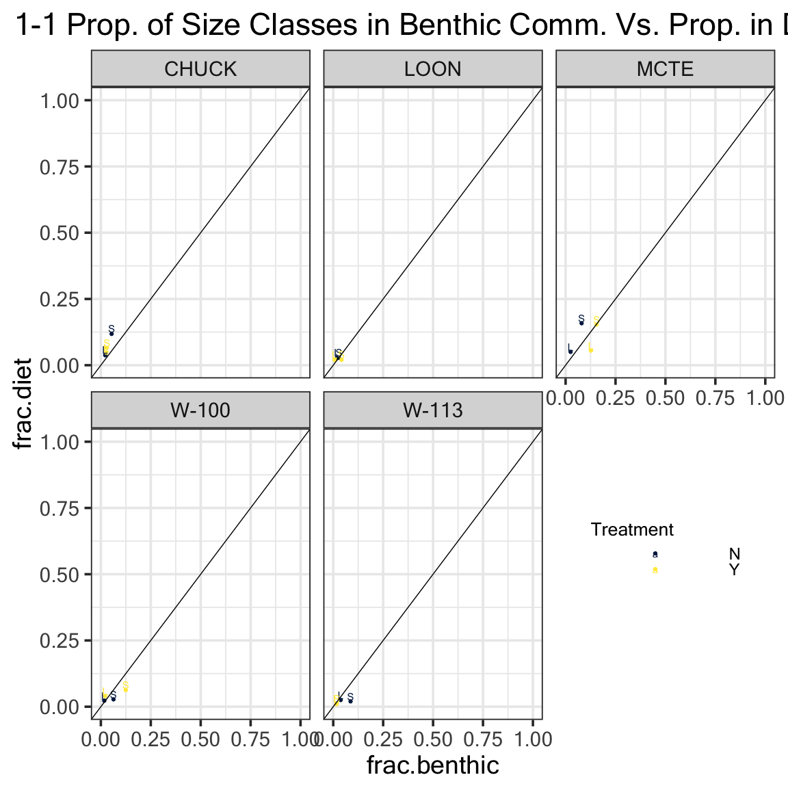<!-- -->

Plot of proportional abundance of an individual size class in the benthic community versus the proportional abundance of the aggregate diets for that reach.


### Costello method plot
***


```r
Diets.fish <- Diets.by.fish %>% 
  group_by(Stream, Treatment, Rep) %>%
  mutate(frac.diet = Count / sum(Count))

Diets.fish <- Diets.fish %>% 
  group_by(Stream, Treatment, Family) %>%
  mutate(frac.fish = length(Family[Count > 0])) %>%
  group_by(Stream, Treatment) %>%
  mutate(frac.fish = frac.fish / max(Rep)) %>%
  group_by(Stream, Treatment, Family)

Diets.fish <- Diets.fish %>%
  summarise_at(vars(frac.fish, frac.diet), funs(mean))
```


```r
ggplot(data = Diets.fish) +
  geom_point(mapping = aes(x = frac.fish, y = frac.diet, color = Treatment)) +
  geom_text(aes(x = frac.fish, y = frac.diet, label = Family), size = 3, nudge_y = .02) +
  geom_abline(slope = 1, intercept = 0) +
  coord_cartesian(ylim = c(0, 1), xlim = c(0, 1)) +
  facet_wrap("Stream") +
  ggtitle("Costello Plot of Prop. Fish Occurance Vs. Prop. Diet Community") +
  scale_color_viridis_d(option = "E") +
  theme(legend.position = c(.84, .27), legend.key.width = unit(5, "cm"))
```

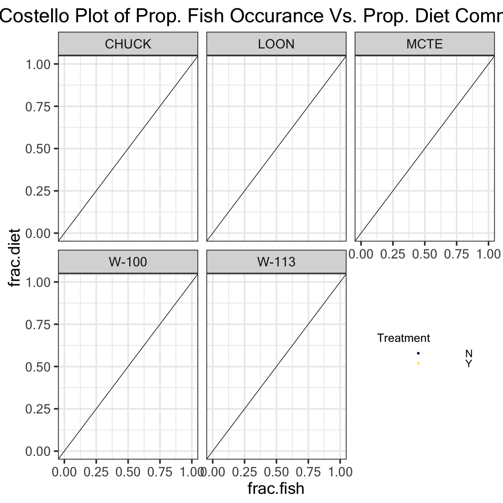<!-- -->

The Costello method plots % occurance of a taxon in fish versus % of aggregate diet. With the adjusted method the aggregate diet is only of fish that had the taxon present (ignoring zero values).  We see that in MCTE and in W-100 there seem to be just a couple fish that specifically target Juga and ELmidae respectively. In MCTE, the taxa from treatment diets seem to consistently constitute a smaller portion of the diet than would be expected given how many fish they occur in. 


### Diet MDS
***

Who knows what I'm actually doing, all of this ordination stuff is currently pre BOT 570.  I will definitely update all this once I know how to handle singleton taxa, loads of zero's, etc.


```r
# Spread data to get a taxon matrix, create factor of CollDate and Treatment
bugs.mds <- Diets.reach %>% 
  filter(Origin %in% c("A", "T")) %>%
  select(-c("FFG", "Size", "Origin")) %>%
  slice(-65) %>%
  spread(key = "Family", value = "Count") %>%
  mutate_if(is.numeric , replace_na, replace = 0) 
```


```r
# Get grouping variables and taxon matrix
Enviro <- bugs.mds %>%
  select(Stream, Treatment) 

Density <- bugs.mds %>% 
  select("Amphizoidae":"Uenoidae")

grouping <- select(Enviro, Stream, Treatment)
```


```
## Wisconsin double standardization
## Run 0 stress 0.128467 
## Run 1 stress 0.1710722 
## Run 2 stress 0.3314815 
## Run 3 stress 0.1204535 
## ... New best solution
## ... Procrustes: rmse 0.2198177  max resid 0.4822754 
## Run 4 stress 0.1204533 
## ... New best solution
## ... Procrustes: rmse 0.0001596655  max resid 0.0002481959 
## ... Similar to previous best
## Run 5 stress 0.1204532 
## ... New best solution
## ... Procrustes: rmse 0.0001203855  max resid 0.0002798965 
## ... Similar to previous best
## Run 6 stress 0.1204532 
## ... Procrustes: rmse 0.0001892728  max resid 0.000398562 
## ... Similar to previous best
## Run 7 stress 0.1284667 
## Run 8 stress 0.1204531 
## ... New best solution
## ... Procrustes: rmse 7.023348e-05  max resid 0.0001045477 
## ... Similar to previous best
## Run 9 stress 0.1204532 
## ... Procrustes: rmse 9.311089e-05  max resid 0.0001959723 
## ... Similar to previous best
## Run 10 stress 0.1284672 
## Run 11 stress 0.1204532 
## ... Procrustes: rmse 8.117938e-05  max resid 0.0001641761 
## ... Similar to previous best
## Run 12 stress 0.1284666 
## Run 13 stress 0.1204532 
## ... Procrustes: rmse 0.0001541052  max resid 0.0003296515 
## ... Similar to previous best
## Run 14 stress 0.1204535 
## ... Procrustes: rmse 0.0003708178  max resid 0.0007824685 
## ... Similar to previous best
## Run 15 stress 0.1284667 
## Run 16 stress 0.2129743 
## Run 17 stress 0.1204533 
## ... Procrustes: rmse 0.0002223879  max resid 0.0004736304 
## ... Similar to previous best
## Run 18 stress 0.2557225 
## Run 19 stress 0.128467 
## Run 20 stress 0.1204532 
## ... Procrustes: rmse 7.56541e-05  max resid 0.0001153935 
## ... Similar to previous best
## *** Solution reached
```


```r
#set up NMDS with dimensions of sol and env factors from "Enviro". 
NMDS <- data.frame(x = sol$points[, 1], y = sol$points[ ,2], 
                   Stream = select(grouping, Stream), 
                   Treatment = select(grouping, Treatment))
```


```r
Reach18N <- NMDS[NMDS$Treatment == "2018.N", ][chull(NMDS[NMDS$Treatment == 
    "2018.N", c("x", "y")]), ] 

Reach18Y <- NMDS[NMDS$Treatment == "2018.Y", ][chull(NMDS[NMDS$Treatment == 
    "2018.Y", c("x", "y")]), ] 

hull.data <- rbind(Reach18Y, Reach18N) 
```


```r
ggplot(data = NMDS, aes(x, y, color = Treatment)) +
  geom_polygon(hull.data, mapping = aes(x = x, y = y, fill = Treatment, group = Treatment), alpha = 0) +
  annotate("text", x = (NMDS$x), y = (NMDS$y) + .04, label = NMDS$Stream, size = 3) +
  geom_point(aes(shape = Stream)) +
  ggtitle("MDS of Community in Fish Diets") +
  scale_color_viridis_d() +
  theme(axis.text.x = element_blank(),  # remove x-axis text
        axis.text.y = element_blank(), # remove y-axis text
        axis.ticks = element_blank(),  # remove axis ticks
        panel.background = element_blank(), 
        panel.grid.major = element_blank(),  #remove major-grid labels
        panel.grid.minor = element_blank(),  #remove minor-grid labels
        plot.background = element_blank())
```

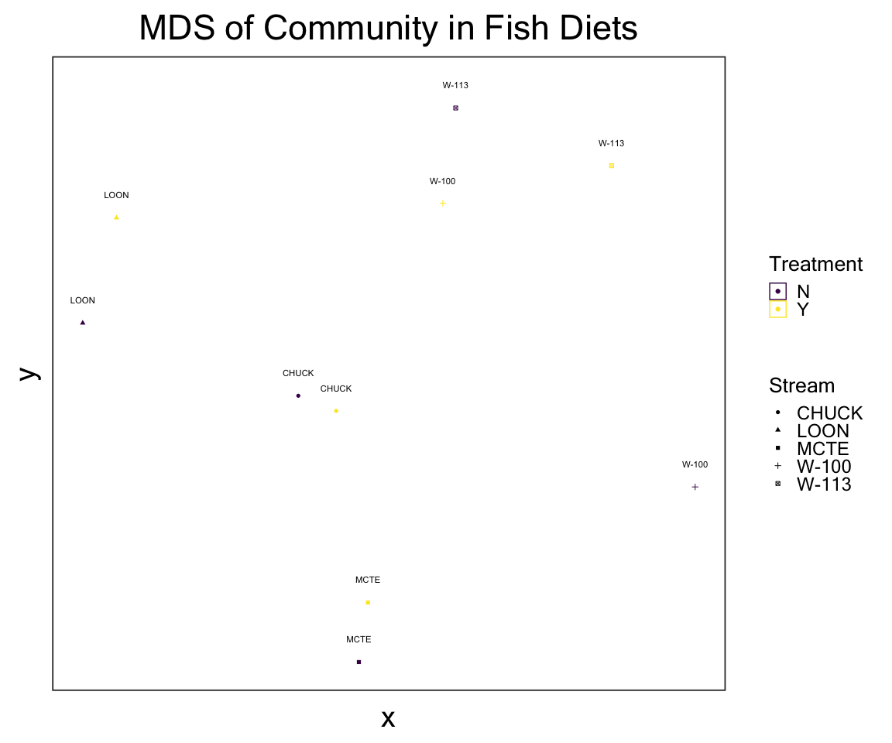<!-- -->

```r
  #theme(legend.position = c(.84, .27), legend.key.width = unit(5, "cm"))
```

There seems to be total overlap of the diet communities in the control versus treatment reaches.  This seems to be consistent with what we saw in other plots.


##
***

Session Info:


```r
sessionInfo()
```

```
## R version 3.5.1 (2018-07-02)
## Platform: x86_64-apple-darwin15.6.0 (64-bit)
## Running under: macOS  10.14.4
## 
## Matrix products: default
## BLAS: /Library/Frameworks/R.framework/Versions/3.5/Resources/lib/libRblas.0.dylib
## LAPACK: /Library/Frameworks/R.framework/Versions/3.5/Resources/lib/libRlapack.dylib
## 
## locale:
## [1] en_US.UTF-8/en_US.UTF-8/en_US.UTF-8/C/en_US.UTF-8/en_US.UTF-8
## 
## attached base packages:
## [1] stats     graphics  grDevices utils     datasets  methods   base     
## 
## other attached packages:
##  [1] bindrcpp_0.2.2  ggrepel_0.8.0   ggthemes_4.0.1  readxl_1.1.0   
##  [5] lubridate_1.7.4 vegan_2.5-2     lattice_0.20-35 permute_0.9-4  
##  [9] plyr_1.8.4      forcats_0.3.0   stringr_1.3.1   dplyr_0.7.5    
## [13] purrr_0.2.5     readr_1.1.1     tidyr_0.8.1     tibble_1.4.2   
## [17] ggplot2_3.1.0   tidyverse_1.2.1
## 
## loaded via a namespace (and not attached):
##  [1] tidyselect_0.2.4  reshape2_1.4.3    haven_1.1.1      
##  [4] colorspace_1.3-2  viridisLite_0.3.0 htmltools_0.3.6  
##  [7] mgcv_1.8-24       yaml_2.2.0        rlang_0.3.0.1    
## [10] pillar_1.2.3      foreign_0.8-70    glue_1.2.0       
## [13] withr_2.1.2       modelr_0.1.2      bindr_0.1.1      
## [16] munsell_0.5.0     gtable_0.2.0      cellranger_1.1.0 
## [19] rvest_0.3.2       psych_1.8.4       evaluate_0.10.1  
## [22] labeling_0.3      knitr_1.20        parallel_3.5.1   
## [25] broom_0.4.4       Rcpp_1.0.0        scales_1.0.0     
## [28] backports_1.1.2   jsonlite_1.5      mnormt_1.5-5     
## [31] hms_0.4.2         digest_0.6.18     stringi_1.2.3    
## [34] grid_3.5.1        rprojroot_1.3-2   cli_1.0.0        
## [37] tools_3.5.1       magrittr_1.5      lazyeval_0.2.1   
## [40] cluster_2.0.7-1   crayon_1.3.4      pkgconfig_2.0.1  
## [43] Matrix_1.2-14     MASS_7.3-50       xml2_1.2.0       
## [46] rematch_1.0.1     assertthat_0.2.0  rmarkdown_1.10   
## [49] httr_1.3.1        rstudioapi_0.7    R6_2.3.0         
## [52] nlme_3.1-139      compiler_3.5.1
```


