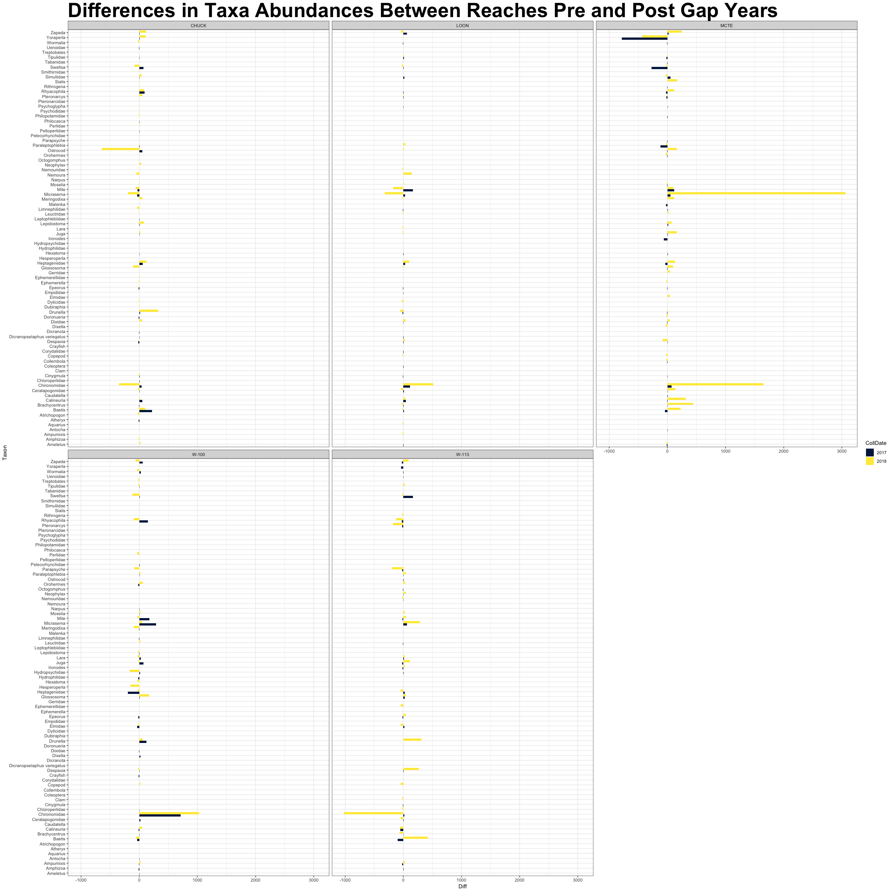
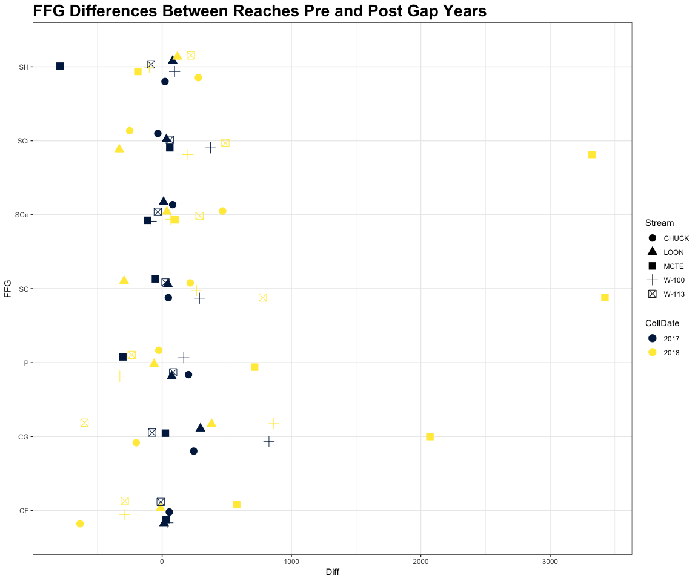
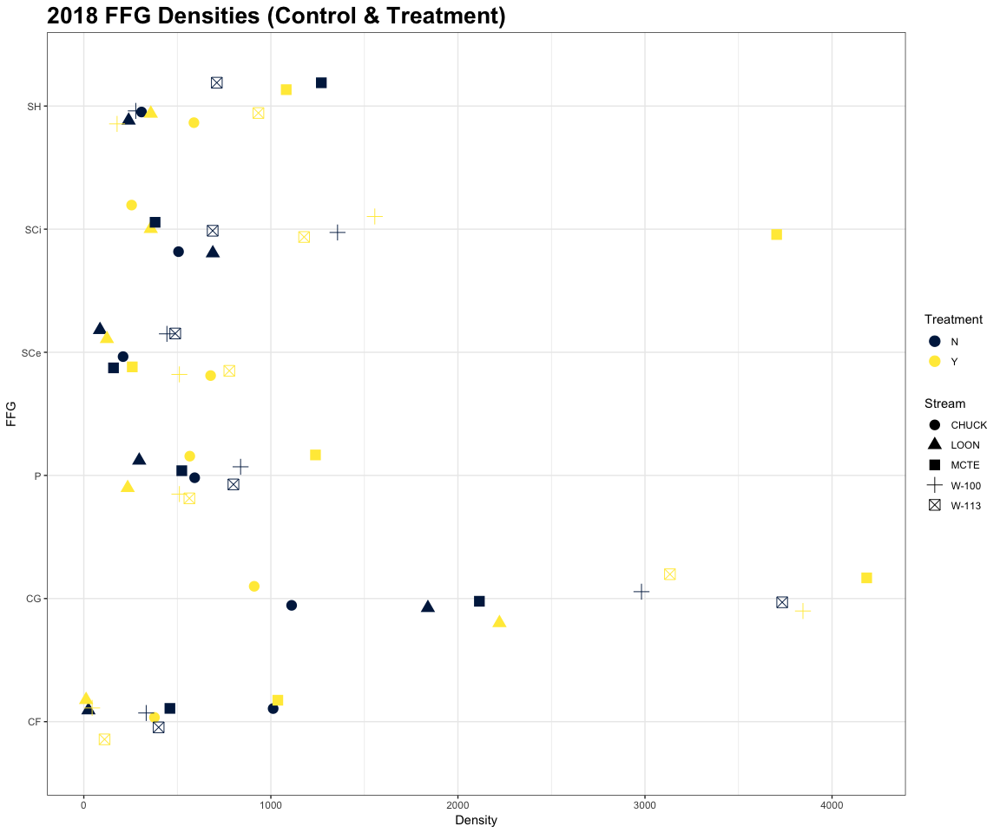
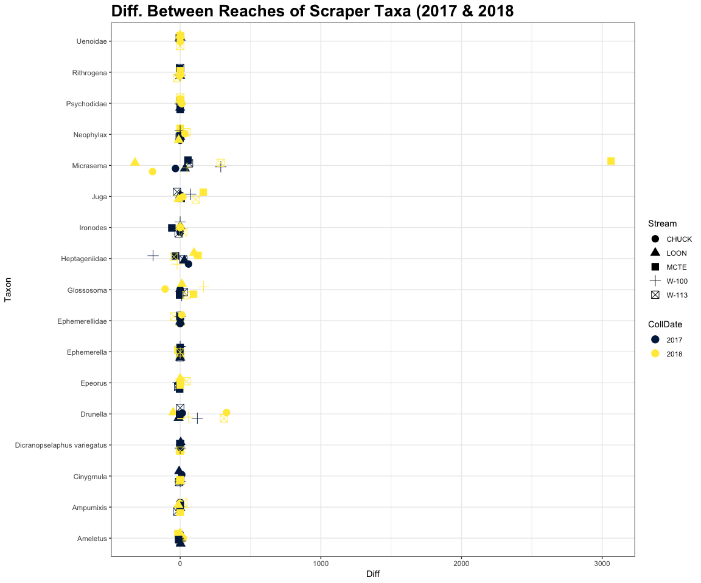
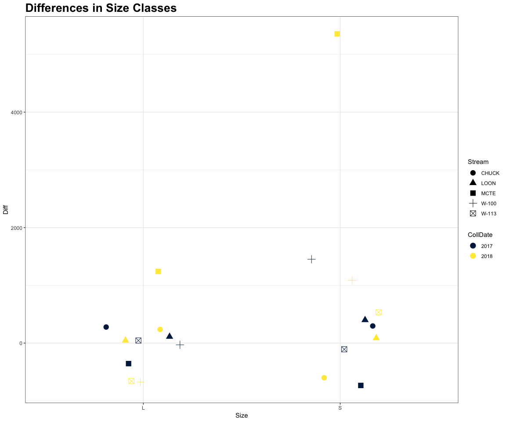

2017-18 Densities
================
Cedar Mackaness
12/01/2018

Benthic Community Analysis
--------------------------

Working with 2017-18 benthic invertebrate data to calculate and plot:

-   Ratio's and Differences of density by family

-   Ratio's and Differences of density by FFG

-   Changes in scaper taxa community

-   NMDS analysis

Taxa
----



Plot of density differences between reaches for both 2017 and 2018. As seen, there are no ubiquitous taxa that consistently increase or decrease across streams. Can also see how shitty the plot is, too many taxa...

FFG's
-----



Here we plot density differences of FFG's.
- CF = Collector Filterer

-   CG = Collector Gatherer

-   SC = Scrapers (a composite of SCe and SCi)

-   SCe = Scrapers that are edible

-   SCi = Scrapers that are inedible

-   P = Predators

Notice the only group with consistently elevated differences in the post gap year (2018) is Scrapers.

``` r
bugs18.ffg <- bugs18 %>%
  group_by(Stream, Treatment, FFG) %>%
  summarise_at(vars(Density), funs(sum))
```



Here we can see that Collector Gatherers are the most abundant taxa, but the aggregate of the two scraper categories (SCe and SCi) is also up there.

When comparing between the reaches we see elevated abundances of both scraper groups (except for SCi in CHUCK). Collector Gatherers are also consistently elevated (except in CHUCK), which seems contradictory to the between year comparison (Control reach has always had elevated abundances of CG's?)

-   Will these functional feeding groups be important in diets?

-   Does the relative change in abundance of a taxa group change fish selection (i.e. now that there are more scrapers in the treatment reach are the fish going to town on Scrapers?)

-   TBD. (see other.md file in the Diets project)



Here we see that the Scraper taxa with the greatest change are:

-   Micrasema

-   Juga

-   Glossosoma

-   Drunella

-   Heptageniidae taxa




Two size classes are plotted, small (S) and large (L) based on nothing, just observation... Hopefully I will soon incorporate some information from the Poff database about final larval instar size and have three size classes: small, medium, and large.

NMDS :metal:
------------

Who knows what I'm actually doing, all of this ordination stuff is currently pre BOT 570. I will definitely update all this once I know how to handle singleton taxa, loads of zero's, etc.

    ## Square root transformation
    ## Wisconsin double standardization
    ## Run 0 stress 0.1726121 
    ## Run 1 stress 0.1738211 
    ## Run 2 stress 0.1726121 
    ## ... Procrustes: rmse 0.0001024801  max resid 0.0002321119 
    ## ... Similar to previous best
    ## Run 3 stress 0.2714117 
    ## Run 4 stress 0.1738211 
    ## Run 5 stress 0.2476796 
    ## Run 6 stress 0.1726121 
    ## ... Procrustes: rmse 2.665987e-05  max resid 5.896951e-05 
    ## ... Similar to previous best
    ## Run 7 stress 0.1726121 
    ## ... Procrustes: rmse 1.863363e-05  max resid 3.882806e-05 
    ## ... Similar to previous best
    ## Run 8 stress 0.2287274 
    ## Run 9 stress 0.2287261 
    ## Run 10 stress 0.1726121 
    ## ... New best solution
    ## ... Procrustes: rmse 1.769136e-05  max resid 4.112827e-05 
    ## ... Similar to previous best
    ## Run 11 stress 0.1726121 
    ## ... New best solution
    ## ... Procrustes: rmse 5.677393e-06  max resid 1.810813e-05 
    ## ... Similar to previous best
    ## Run 12 stress 0.1738211 
    ## Run 13 stress 0.1726121 
    ## ... Procrustes: rmse 1.238556e-05  max resid 3.450062e-05 
    ## ... Similar to previous best
    ## Run 14 stress 0.1726121 
    ## ... Procrustes: rmse 9.354206e-06  max resid 2.399353e-05 
    ## ... Similar to previous best
    ## Run 15 stress 0.2488585 
    ## Run 16 stress 0.1738211 
    ## Run 17 stress 0.1726121 
    ## ... Procrustes: rmse 1.464778e-05  max resid 3.260931e-05 
    ## ... Similar to previous best
    ## Run 18 stress 0.2523417 
    ## Run 19 stress 0.1738211 
    ## Run 20 stress 0.1738211 
    ## *** Solution reached

This is a pretty good stress value, who knows how that will change when I start doing this right... Can see the transfrmations applied at the top of the output, this was done automatically, I wouldn't know what to do. Used the Bray-Curtis distance metric, max tries is set to 100 with dimensions equal to 2.

The "display" argument can be set to "site" or "species" depending on what you want to group. "kind" can be standard deviation or standard error, not sure which to use here.

``` r
# Fit the ellipse function to actual data
df_ell <- data.frame()
for(g in NMDS$YearTreat){
  df_ell <- rbind(df_ell, cbind(as.data.frame(with(NMDS[NMDS$YearTreat == g,],
                  vegan:::veganCovEllipse(ord[[g]]$cov, ord[[g]]$center, ord[[g]]$scale)))
                                ,YearTreat = g))
}
```

not going to pretend like I know how this works, got it from <https://stackoverflow.com/questions/13794419/plotting-ordiellipse-function-from-vegan-package-onto-nmds-plot-created-in-ggplo> but I do know that changing the column selected from NMDS changes which variable is used for grouping.


Actually maybe cool result, all of the treatment reaches now plot closer post-gap year. The controls show a similar pattern though maybe a little less pronounced. Everything also shifted left between the two years, although this isn't because of the treatment, just annual changes. Maybe the gap amplified whatever effect the year had, extra, extra light or temperature maybe.
