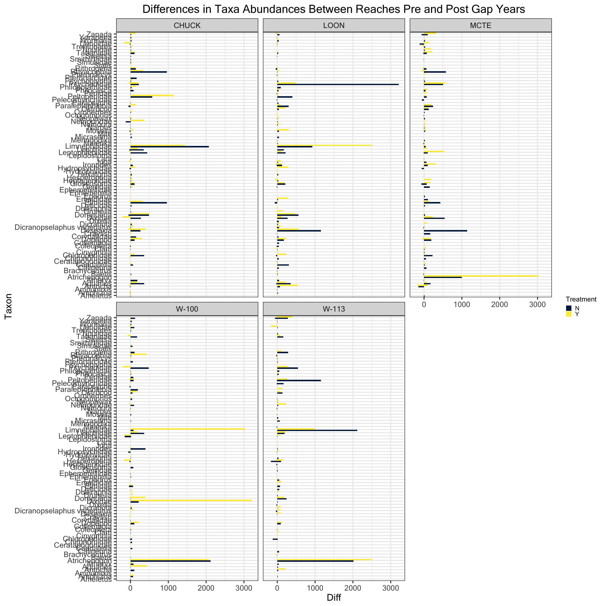
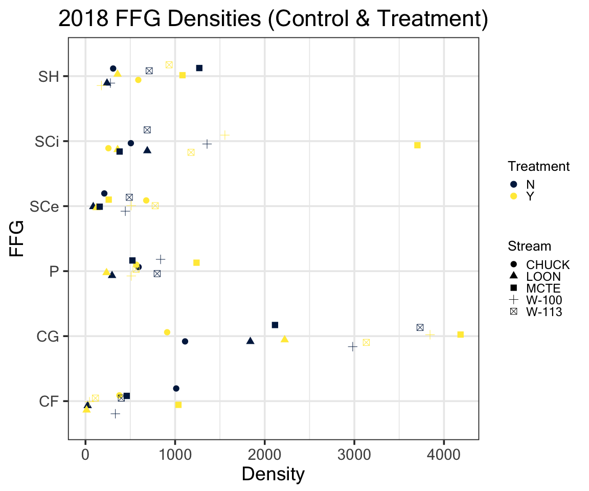
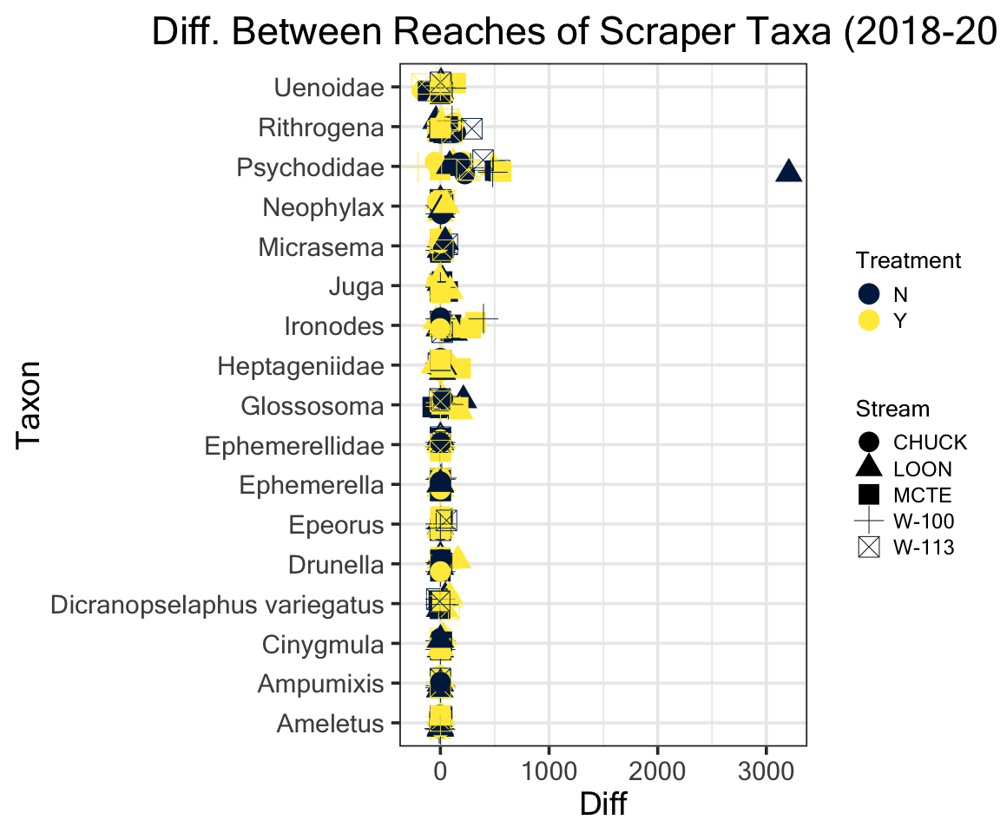
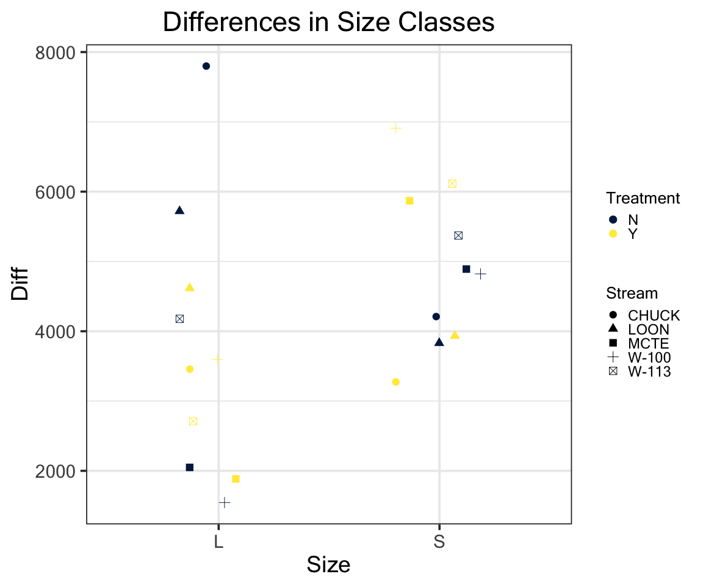

## Purpose of This Document 
***
Working with 2017-18 benthic invertebrate and fish diet data to calculate and plot:

- Changes in scaper taxa community

- NMS analysis

- Diet NMS

- Diet 1:1 and costello plot

- Analysis of diet and benthic overlay

- Effect of treatment on benthic and diet communities using MRPP or perMANOVA?

## Benthic {.tabset .tabset-fade .tabset-pills}
***
<br>

### Load Packages
*** 


```r
# import data
bugs <- readxl::read_xlsx("./Data/2017-18 bugs.xlsx", sheet = "Cleaned")
ffg <- readxl::read_xlsx("./Data/2017-18 bugs.xlsx", sheet = "FFG")
sizes <- readxl::read_xlsx("./Data/2017-18 bugs.xlsx", sheet = "Size")
Diets <- readxl::read_xlsx("./Data/2018 Diets.xlsx")
Bentho <- read_xlsx("./Data/2018 Tiles Allison's Computer.xlsx", sheet = "Tiles")
Both_years<- read_excel("./Data/2018 Tiles Allison's Computer.xlsx", sheet = "2017 and 2018")
FL <- read_excel("~/Google Drive/Stream Ecology/2018 Field Data/2018_Fluorescein.xlsx", sheet = "Compiled")
Enviro <- read_excel("./Data/benthic2.xlsx")
#Replace Ssp. in Taxon with Family
bugs$Taxon[bugs$Taxon == "Ssp."] <- bugs$Family[bugs$Taxon == "Ssp."]
```


```r
#Setup ggplot theme
my_theme <- theme_bw(base_size = 28, base_family = "Microsoft Sans Serif") +
          theme(plot.title = element_text(hjust = 0.5),
                plot.caption = element_text(hjust = 0.5, face = "italic", color = "grey"),
                legend.title = element_text(colour = "black", size = 20, face = "bold"),
                legend.text = element_text(colour = "black", size = 18))
                
theme_set(my_theme)
```


### Benthic Setup
***

In order to calculate density we must take into account that our count values are from a subsample of three pooled samples.


```r
#Calculations...
bugs$Density <- bugs$Count / bugs$PercentSub / .09  #Calculate total in pooled sample

bugs$CollDate <- as.Date(bugs$CollDate, format = "%m/%d/%y") %>% year() %>% as.factor()

bugs.agg <- bugs %>%
  group_by(CollDate, Stream, Treatment, Taxon) %>%
  summarise_at(vars(Density), funs(sum)) %>% ungroup

bugs.agg$Density <- bugs.agg$Density / 3    #Divide by number of samples pooled
```

***

We divide Count by percent subsampled (actually a fraction) to get a count for the total sample taken.  We then divide by .09 which is the area of the surber sampler (in m$^2$). We then aggregate and divide by three (There were three samples taken per reach).


```r
# Spread and then gather to fill missing Taxons with 0's
bugs.agg <- spread(bugs.agg, key = "Taxon", value = "Density") %>% #bugs.agg is benthic samples
  mutate_if(is.numeric , replace_na, replace = 0) %>% 
  gather(key = "Taxon", value = "Density", 4:ncol(.))
```


```r
# Add FFG and size classes
bugs.agg <- merge(bugs.agg, sizes) %>% merge(., ffg)

# Create list of CollDate, Stream and Taxon
bugs.reach.diff <- bugs.agg %>% select(-c("Density", "CollDate")) %>% unique()

# Calculate Differences
bugs.reach.diff$Diff <- bugs.agg$Density[bugs.agg$CollDate == "2018"] -     
  bugs.agg$Density[bugs.agg$CollDate == "2017"]

# Filter for only 2018 bugs
bugs18 <- filter(bugs.agg, CollDate == "2018")
```

A quick taste of the finished data table product:


```r
# Datatable with filters and data ranges
datatable(bugs.agg, rownames = FALSE, class = "hover", filter = "top", options = list(pageLength = 10, scrollX = T)) %>% formatRound("Density", digits = 2, interval = 3, 
                                          mark = ",", dec.mark = getOption("OutDec"))
```

<!--html_preserve--><div id="htmlwidget-9c6f22a6c52cb43010c9" style="width:100%;height:auto;" class="datatables html-widget"></div>
<script type="application/json" data-for="htmlwidget-9c6f22a6c52cb43010c9">{"x":{"filter":"top","filterHTML":"<tr>\n  <td data-type=\"character\" style=\"vertical-align: top;\">\n    <div class=\"form-group has-feedback\" style=\"margin-bottom: auto;\">\n      <input type=\"search\" placeholder=\"All\" class=\"form-control\" style=\"width: 100%;\"/>\n      <span class=\"glyphicon glyphicon-remove-circle form-control-feedback\"><\/span>\n    <\/div>\n  <\/td>\n  <td data-type=\"factor\" style=\"vertical-align: top;\">\n    <div class=\"form-group has-feedback\" style=\"margin-bottom: auto;\">\n      <input type=\"search\" placeholder=\"All\" class=\"form-control\" style=\"width: 100%;\"/>\n      <span class=\"glyphicon glyphicon-remove-circle form-control-feedback\"><\/span>\n    <\/div>\n    <div style=\"width: 100%; display: none;\">\n      <select multiple=\"multiple\" style=\"width: 100%;\" data-options=\"[&quot;2017&quot;,&quot;2018&quot;]\"><\/select>\n    <\/div>\n  <\/td>\n  <td data-type=\"character\" style=\"vertical-align: top;\">\n    <div class=\"form-group has-feedback\" style=\"margin-bottom: auto;\">\n      <input type=\"search\" placeholder=\"All\" class=\"form-control\" style=\"width: 100%;\"/>\n      <span class=\"glyphicon glyphicon-remove-circle form-control-feedback\"><\/span>\n    <\/div>\n  <\/td>\n  <td data-type=\"character\" style=\"vertical-align: top;\">\n    <div class=\"form-group has-feedback\" style=\"margin-bottom: auto;\">\n      <input type=\"search\" placeholder=\"All\" class=\"form-control\" style=\"width: 100%;\"/>\n      <span class=\"glyphicon glyphicon-remove-circle form-control-feedback\"><\/span>\n    <\/div>\n  <\/td>\n  <td data-type=\"number\" style=\"vertical-align: top;\">\n    <div class=\"form-group has-feedback\" style=\"margin-bottom: auto;\">\n      <input type=\"search\" placeholder=\"All\" class=\"form-control\" style=\"width: 100%;\"/>\n      <span class=\"glyphicon glyphicon-remove-circle form-control-feedback\"><\/span>\n    <\/div>\n    <div style=\"display: none; position: absolute; width: 200px;\">\n      <div data-min=\"0\" data-max=\"3333.33333333333\" data-scale=\"15\"><\/div>\n      <span style=\"float: left;\"><\/span>\n      <span style=\"float: right;\"><\/span>\n    <\/div>\n  <\/td>\n  <td data-type=\"character\" style=\"vertical-align: top;\">\n    <div class=\"form-group has-feedback\" style=\"margin-bottom: auto;\">\n      <input type=\"search\" placeholder=\"All\" class=\"form-control\" style=\"width: 100%;\"/>\n      <span class=\"glyphicon glyphicon-remove-circle form-control-feedback\"><\/span>\n    <\/div>\n  <\/td>\n  <td data-type=\"character\" style=\"vertical-align: top;\">\n    <div class=\"form-group has-feedback\" style=\"margin-bottom: auto;\">\n      <input type=\"search\" placeholder=\"All\" class=\"form-control\" style=\"width: 100%;\"/>\n      <span class=\"glyphicon glyphicon-remove-circle form-control-feedback\"><\/span>\n    <\/div>\n  <\/td>\n<\/tr>","data":[["Ameletus","Ameletus","Ameletus","Ameletus","Ameletus","Ameletus","Ameletus","Ameletus","Ameletus","Ameletus","Ameletus","Ameletus","Ameletus","Ameletus","Ameletus","Ameletus","Ameletus","Ameletus","Ameletus","Ameletus","Amphizoa","Amphizoa","Amphizoa","Amphizoa","Amphizoa","Amphizoa","Amphizoa","Amphizoa","Amphizoa","Amphizoa","Amphizoa","Amphizoa","Amphizoa","Amphizoa","Amphizoa","Amphizoa","Amphizoa","Amphizoa","Amphizoa","Amphizoa","Ampumixis","Ampumixis","Ampumixis","Ampumixis","Ampumixis","Ampumixis","Ampumixis","Ampumixis","Ampumixis","Ampumixis","Ampumixis","Ampumixis","Ampumixis","Ampumixis","Ampumixis","Ampumixis","Ampumixis","Ampumixis","Ampumixis","Ampumixis","Antocha","Antocha","Antocha","Antocha","Antocha","Antocha","Antocha","Antocha","Antocha","Antocha","Antocha","Antocha","Antocha","Antocha","Antocha","Antocha","Antocha","Antocha","Antocha","Antocha","Aquarius","Aquarius","Aquarius","Aquarius","Aquarius","Aquarius","Aquarius","Aquarius","Aquarius","Aquarius","Aquarius","Aquarius","Aquarius","Aquarius","Aquarius","Aquarius","Aquarius","Aquarius","Aquarius","Aquarius","Atheryx","Atheryx","Atheryx","Atheryx","Atheryx","Atheryx","Atheryx","Atheryx","Atheryx","Atheryx","Atheryx","Atheryx","Atheryx","Atheryx","Atheryx","Atheryx","Atheryx","Atheryx","Atheryx","Atheryx","Atrichopogon","Atrichopogon","Atrichopogon","Atrichopogon","Atrichopogon","Atrichopogon","Atrichopogon","Atrichopogon","Atrichopogon","Atrichopogon","Atrichopogon","Atrichopogon","Atrichopogon","Atrichopogon","Atrichopogon","Atrichopogon","Atrichopogon","Atrichopogon","Atrichopogon","Atrichopogon","Baetis","Baetis","Baetis","Baetis","Baetis","Baetis","Baetis","Baetis","Baetis","Baetis","Baetis","Baetis","Baetis","Baetis","Baetis","Baetis","Baetis","Baetis","Baetis","Baetis","Brachycentrus","Brachycentrus","Brachycentrus","Brachycentrus","Brachycentrus","Brachycentrus","Brachycentrus","Brachycentrus","Brachycentrus","Brachycentrus","Brachycentrus","Brachycentrus","Brachycentrus","Brachycentrus","Brachycentrus","Brachycentrus","Brachycentrus","Brachycentrus","Brachycentrus","Brachycentrus","Calineuria","Calineuria","Calineuria","Calineuria","Calineuria","Calineuria","Calineuria","Calineuria","Calineuria","Calineuria","Calineuria","Calineuria","Calineuria","Calineuria","Calineuria","Calineuria","Calineuria","Calineuria","Calineuria","Calineuria","Caudatella","Caudatella","Caudatella","Caudatella","Caudatella","Caudatella","Caudatella","Caudatella","Caudatella","Caudatella","Caudatella","Caudatella","Caudatella","Caudatella","Caudatella","Caudatella","Caudatella","Caudatella","Caudatella","Caudatella","Ceratapogonidae","Ceratapogonidae","Ceratapogonidae","Ceratapogonidae","Ceratapogonidae","Ceratapogonidae","Ceratapogonidae","Ceratapogonidae","Ceratapogonidae","Ceratapogonidae","Ceratapogonidae","Ceratapogonidae","Ceratapogonidae","Ceratapogonidae","Ceratapogonidae","Ceratapogonidae","Ceratapogonidae","Ceratapogonidae","Ceratapogonidae","Ceratapogonidae","Chironomidae","Chironomidae","Chironomidae","Chironomidae","Chironomidae","Chironomidae","Chironomidae","Chironomidae","Chironomidae","Chironomidae","Chironomidae","Chironomidae","Chironomidae","Chironomidae","Chironomidae","Chironomidae","Chironomidae","Chironomidae","Chironomidae","Chironomidae","Chloroperlidae","Chloroperlidae","Chloroperlidae","Chloroperlidae","Chloroperlidae","Chloroperlidae","Chloroperlidae","Chloroperlidae","Chloroperlidae","Chloroperlidae","Chloroperlidae","Chloroperlidae","Chloroperlidae","Chloroperlidae","Chloroperlidae","Chloroperlidae","Chloroperlidae","Chloroperlidae","Chloroperlidae","Chloroperlidae","Cinygmula","Cinygmula","Cinygmula","Cinygmula","Cinygmula","Cinygmula","Cinygmula","Cinygmula","Cinygmula","Cinygmula","Cinygmula","Cinygmula","Cinygmula","Cinygmula","Cinygmula","Cinygmula","Cinygmula","Cinygmula","Cinygmula","Cinygmula","Clam","Clam","Clam","Clam","Clam","Clam","Clam","Clam","Clam","Clam","Clam","Clam","Clam","Clam","Clam","Clam","Clam","Clam","Clam","Clam","Coleoptera","Coleoptera","Coleoptera","Coleoptera","Coleoptera","Coleoptera","Coleoptera","Coleoptera","Coleoptera","Coleoptera","Coleoptera","Coleoptera","Coleoptera","Coleoptera","Coleoptera","Coleoptera","Coleoptera","Coleoptera","Coleoptera","Coleoptera","Collembola","Collembola","Collembola","Collembola","Collembola","Collembola","Collembola","Collembola","Collembola","Collembola","Collembola","Collembola","Collembola","Collembola","Collembola","Collembola","Collembola","Collembola","Collembola","Collembola","Copepod","Copepod","Copepod","Copepod","Copepod","Copepod","Copepod","Copepod","Copepod","Copepod","Copepod","Copepod","Copepod","Copepod","Copepod","Copepod","Copepod","Copepod","Copepod","Copepod","Corydalidae","Corydalidae","Corydalidae","Corydalidae","Corydalidae","Corydalidae","Corydalidae","Corydalidae","Corydalidae","Corydalidae","Corydalidae","Corydalidae","Corydalidae","Corydalidae","Corydalidae","Corydalidae","Corydalidae","Corydalidae","Corydalidae","Corydalidae","Crayfish","Crayfish","Crayfish","Crayfish","Crayfish","Crayfish","Crayfish","Crayfish","Crayfish","Crayfish","Crayfish","Crayfish","Crayfish","Crayfish","Crayfish","Crayfish","Crayfish","Crayfish","Crayfish","Crayfish","Despaxia","Despaxia","Despaxia","Despaxia","Despaxia","Despaxia","Despaxia","Despaxia","Despaxia","Despaxia","Despaxia","Despaxia","Despaxia","Despaxia","Despaxia","Despaxia","Despaxia","Despaxia","Despaxia","Despaxia","Dicranopselaphus variegatus","Dicranopselaphus variegatus","Dicranopselaphus variegatus","Dicranopselaphus variegatus","Dicranopselaphus variegatus","Dicranopselaphus variegatus","Dicranopselaphus variegatus","Dicranopselaphus variegatus","Dicranopselaphus variegatus","Dicranopselaphus variegatus","Dicranopselaphus variegatus","Dicranopselaphus variegatus","Dicranopselaphus variegatus","Dicranopselaphus variegatus","Dicranopselaphus variegatus","Dicranopselaphus variegatus","Dicranopselaphus variegatus","Dicranopselaphus variegatus","Dicranopselaphus variegatus","Dicranopselaphus variegatus","Dicranota","Dicranota","Dicranota","Dicranota","Dicranota","Dicranota","Dicranota","Dicranota","Dicranota","Dicranota","Dicranota","Dicranota","Dicranota","Dicranota","Dicranota","Dicranota","Dicranota","Dicranota","Dicranota","Dicranota","Dixella","Dixella","Dixella","Dixella","Dixella","Dixella","Dixella","Dixella","Dixella","Dixella","Dixella","Dixella","Dixella","Dixella","Dixella","Dixella","Dixella","Dixella","Dixella","Dixella","Dixidae","Dixidae","Dixidae","Dixidae","Dixidae","Dixidae","Dixidae","Dixidae","Dixidae","Dixidae","Dixidae","Dixidae","Dixidae","Dixidae","Dixidae","Dixidae","Dixidae","Dixidae","Dixidae","Dixidae","Doronueria","Doronueria","Doronueria","Doronueria","Doronueria","Doronueria","Doronueria","Doronueria","Doronueria","Doronueria","Doronueria","Doronueria","Doronueria","Doronueria","Doronueria","Doronueria","Doronueria","Doronueria","Doronueria","Doronueria","Drunella","Drunella","Drunella","Drunella","Drunella","Drunella","Drunella","Drunella","Drunella","Drunella","Drunella","Drunella","Drunella","Drunella","Drunella","Drunella","Drunella","Drunella","Drunella","Drunella","Dubiraphia","Dubiraphia","Dubiraphia","Dubiraphia","Dubiraphia","Dubiraphia","Dubiraphia","Dubiraphia","Dubiraphia","Dubiraphia","Dubiraphia","Dubiraphia","Dubiraphia","Dubiraphia","Dubiraphia","Dubiraphia","Dubiraphia","Dubiraphia","Dubiraphia","Dubiraphia","Dyticidae","Dyticidae","Dyticidae","Dyticidae","Dyticidae","Dyticidae","Dyticidae","Dyticidae","Dyticidae","Dyticidae","Dyticidae","Dyticidae","Dyticidae","Dyticidae","Dyticidae","Dyticidae","Dyticidae","Dyticidae","Dyticidae","Dyticidae","Elmidae","Elmidae","Elmidae","Elmidae","Elmidae","Elmidae","Elmidae","Elmidae","Elmidae","Elmidae","Elmidae","Elmidae","Elmidae","Elmidae","Elmidae","Elmidae","Elmidae","Elmidae","Elmidae","Elmidae","Empididae","Empididae","Empididae","Empididae","Empididae","Empididae","Empididae","Empididae","Empididae","Empididae","Empididae","Empididae","Empididae","Empididae","Empididae","Empididae","Empididae","Empididae","Empididae","Empididae","Epeorus","Epeorus","Epeorus","Epeorus","Epeorus","Epeorus","Epeorus","Epeorus","Epeorus","Epeorus","Epeorus","Epeorus","Epeorus","Epeorus","Epeorus","Epeorus","Epeorus","Epeorus","Epeorus","Epeorus","Ephemerella","Ephemerella","Ephemerella","Ephemerella","Ephemerella","Ephemerella","Ephemerella","Ephemerella","Ephemerella","Ephemerella","Ephemerella","Ephemerella","Ephemerella","Ephemerella","Ephemerella","Ephemerella","Ephemerella","Ephemerella","Ephemerella","Ephemerella","Ephemerellidae","Ephemerellidae","Ephemerellidae","Ephemerellidae","Ephemerellidae","Ephemerellidae","Ephemerellidae","Ephemerellidae","Ephemerellidae","Ephemerellidae","Ephemerellidae","Ephemerellidae","Ephemerellidae","Ephemerellidae","Ephemerellidae","Ephemerellidae","Ephemerellidae","Ephemerellidae","Ephemerellidae","Ephemerellidae","Gerridae","Gerridae","Gerridae","Gerridae","Gerridae","Gerridae","Gerridae","Gerridae","Gerridae","Gerridae","Gerridae","Gerridae","Gerridae","Gerridae","Gerridae","Gerridae","Gerridae","Gerridae","Gerridae","Gerridae","Glossosoma","Glossosoma","Glossosoma","Glossosoma","Glossosoma","Glossosoma","Glossosoma","Glossosoma","Glossosoma","Glossosoma","Glossosoma","Glossosoma","Glossosoma","Glossosoma","Glossosoma","Glossosoma","Glossosoma","Glossosoma","Glossosoma","Glossosoma","Heptageniidae","Heptageniidae","Heptageniidae","Heptageniidae","Heptageniidae","Heptageniidae","Heptageniidae","Heptageniidae","Heptageniidae","Heptageniidae","Heptageniidae","Heptageniidae","Heptageniidae","Heptageniidae","Heptageniidae","Heptageniidae","Heptageniidae","Heptageniidae","Heptageniidae","Heptageniidae","Hesperoperla","Hesperoperla","Hesperoperla","Hesperoperla","Hesperoperla","Hesperoperla","Hesperoperla","Hesperoperla","Hesperoperla","Hesperoperla","Hesperoperla","Hesperoperla","Hesperoperla","Hesperoperla","Hesperoperla","Hesperoperla","Hesperoperla","Hesperoperla","Hesperoperla","Hesperoperla","Hexatoma","Hexatoma","Hexatoma","Hexatoma","Hexatoma","Hexatoma","Hexatoma","Hexatoma","Hexatoma","Hexatoma","Hexatoma","Hexatoma","Hexatoma","Hexatoma","Hexatoma","Hexatoma","Hexatoma","Hexatoma","Hexatoma","Hexatoma","Hydrophilidae","Hydrophilidae","Hydrophilidae","Hydrophilidae","Hydrophilidae","Hydrophilidae","Hydrophilidae","Hydrophilidae","Hydrophilidae","Hydrophilidae","Hydrophilidae","Hydrophilidae","Hydrophilidae","Hydrophilidae","Hydrophilidae","Hydrophilidae","Hydrophilidae","Hydrophilidae","Hydrophilidae","Hydrophilidae","Hydropsychidae","Hydropsychidae","Hydropsychidae","Hydropsychidae","Hydropsychidae","Hydropsychidae","Hydropsychidae","Hydropsychidae","Hydropsychidae","Hydropsychidae","Hydropsychidae","Hydropsychidae","Hydropsychidae","Hydropsychidae","Hydropsychidae","Hydropsychidae","Hydropsychidae","Hydropsychidae","Hydropsychidae","Hydropsychidae","Ironodes","Ironodes","Ironodes","Ironodes","Ironodes","Ironodes","Ironodes","Ironodes","Ironodes","Ironodes","Ironodes","Ironodes","Ironodes","Ironodes","Ironodes","Ironodes","Ironodes","Ironodes","Ironodes","Ironodes","Juga","Juga","Juga","Juga","Juga","Juga","Juga","Juga","Juga","Juga","Juga","Juga","Juga","Juga","Juga","Juga","Juga","Juga","Juga","Juga","Lara","Lara","Lara","Lara","Lara","Lara","Lara","Lara","Lara","Lara","Lara","Lara","Lara","Lara","Lara","Lara","Lara","Lara","Lara","Lara","Lepidostoma","Lepidostoma","Lepidostoma","Lepidostoma","Lepidostoma","Lepidostoma","Lepidostoma","Lepidostoma","Lepidostoma","Lepidostoma","Lepidostoma","Lepidostoma","Lepidostoma","Lepidostoma","Lepidostoma","Lepidostoma","Lepidostoma","Lepidostoma","Lepidostoma","Lepidostoma","Leptophlebiidae","Leptophlebiidae","Leptophlebiidae","Leptophlebiidae","Leptophlebiidae","Leptophlebiidae","Leptophlebiidae","Leptophlebiidae","Leptophlebiidae","Leptophlebiidae","Leptophlebiidae","Leptophlebiidae","Leptophlebiidae","Leptophlebiidae","Leptophlebiidae","Leptophlebiidae","Leptophlebiidae","Leptophlebiidae","Leptophlebiidae","Leptophlebiidae","Leuctridae","Leuctridae","Leuctridae","Leuctridae","Leuctridae","Leuctridae","Leuctridae","Leuctridae","Leuctridae","Leuctridae","Leuctridae","Leuctridae","Leuctridae","Leuctridae","Leuctridae","Leuctridae","Leuctridae","Leuctridae","Leuctridae","Leuctridae","Limnephilidae","Limnephilidae","Limnephilidae","Limnephilidae","Limnephilidae","Limnephilidae","Limnephilidae","Limnephilidae","Limnephilidae","Limnephilidae","Limnephilidae","Limnephilidae","Limnephilidae","Limnephilidae","Limnephilidae","Limnephilidae","Limnephilidae","Limnephilidae","Limnephilidae","Limnephilidae","Malenka","Malenka","Malenka","Malenka","Malenka","Malenka","Malenka","Malenka","Malenka","Malenka","Malenka","Malenka","Malenka","Malenka","Malenka","Malenka","Malenka","Malenka","Malenka","Malenka","Meringodixa","Meringodixa","Meringodixa","Meringodixa","Meringodixa","Meringodixa","Meringodixa","Meringodixa","Meringodixa","Meringodixa","Meringodixa","Meringodixa","Meringodixa","Meringodixa","Meringodixa","Meringodixa","Meringodixa","Meringodixa","Meringodixa","Meringodixa","Micrasema","Micrasema","Micrasema","Micrasema","Micrasema","Micrasema","Micrasema","Micrasema","Micrasema","Micrasema","Micrasema","Micrasema","Micrasema","Micrasema","Micrasema","Micrasema","Micrasema","Micrasema","Micrasema","Micrasema","Mite","Mite","Mite","Mite","Mite","Mite","Mite","Mite","Mite","Mite","Mite","Mite","Mite","Mite","Mite","Mite","Mite","Mite","Mite","Mite","Moselia","Moselia","Moselia","Moselia","Moselia","Moselia","Moselia","Moselia","Moselia","Moselia","Moselia","Moselia","Moselia","Moselia","Moselia","Moselia","Moselia","Moselia","Moselia","Moselia","Narpus","Narpus","Narpus","Narpus","Narpus","Narpus","Narpus","Narpus","Narpus","Narpus","Narpus","Narpus","Narpus","Narpus","Narpus","Narpus","Narpus","Narpus","Narpus","Narpus","Nemoura","Nemoura","Nemoura","Nemoura","Nemoura","Nemoura","Nemoura","Nemoura","Nemoura","Nemoura","Nemoura","Nemoura","Nemoura","Nemoura","Nemoura","Nemoura","Nemoura","Nemoura","Nemoura","Nemoura","Nemouridae","Nemouridae","Nemouridae","Nemouridae","Nemouridae","Nemouridae","Nemouridae","Nemouridae","Nemouridae","Nemouridae","Nemouridae","Nemouridae","Nemouridae","Nemouridae","Nemouridae","Nemouridae","Nemouridae","Nemouridae","Nemouridae","Nemouridae","Neophylax","Neophylax","Neophylax","Neophylax","Neophylax","Neophylax","Neophylax","Neophylax","Neophylax","Neophylax","Neophylax","Neophylax","Neophylax","Neophylax","Neophylax","Neophylax","Neophylax","Neophylax","Neophylax","Neophylax","Octogomphus","Octogomphus","Octogomphus","Octogomphus","Octogomphus","Octogomphus","Octogomphus","Octogomphus","Octogomphus","Octogomphus","Octogomphus","Octogomphus","Octogomphus","Octogomphus","Octogomphus","Octogomphus","Octogomphus","Octogomphus","Octogomphus","Octogomphus","Orohermes","Orohermes","Orohermes","Orohermes","Orohermes","Orohermes","Orohermes","Orohermes","Orohermes","Orohermes","Orohermes","Orohermes","Orohermes","Orohermes","Orohermes","Orohermes","Orohermes","Orohermes","Orohermes","Orohermes","Ostrocod","Ostrocod","Ostrocod","Ostrocod","Ostrocod","Ostrocod","Ostrocod","Ostrocod","Ostrocod","Ostrocod","Ostrocod","Ostrocod","Ostrocod","Ostrocod","Ostrocod","Ostrocod","Ostrocod","Ostrocod","Ostrocod","Ostrocod","Paraleptophlebia","Paraleptophlebia","Paraleptophlebia","Paraleptophlebia","Paraleptophlebia","Paraleptophlebia","Paraleptophlebia","Paraleptophlebia","Paraleptophlebia","Paraleptophlebia","Paraleptophlebia","Paraleptophlebia","Paraleptophlebia","Paraleptophlebia","Paraleptophlebia","Paraleptophlebia","Paraleptophlebia","Paraleptophlebia","Paraleptophlebia","Paraleptophlebia","Parapsyche","Parapsyche","Parapsyche","Parapsyche","Parapsyche","Parapsyche","Parapsyche","Parapsyche","Parapsyche","Parapsyche","Parapsyche","Parapsyche","Parapsyche","Parapsyche","Parapsyche","Parapsyche","Parapsyche","Parapsyche","Parapsyche","Parapsyche","Pelecorhynchidae","Pelecorhynchidae","Pelecorhynchidae","Pelecorhynchidae","Pelecorhynchidae","Pelecorhynchidae","Pelecorhynchidae","Pelecorhynchidae","Pelecorhynchidae","Pelecorhynchidae","Pelecorhynchidae","Pelecorhynchidae","Pelecorhynchidae","Pelecorhynchidae","Pelecorhynchidae","Pelecorhynchidae","Pelecorhynchidae","Pelecorhynchidae","Pelecorhynchidae","Pelecorhynchidae","Peltoperlidae","Peltoperlidae","Peltoperlidae","Peltoperlidae","Peltoperlidae","Peltoperlidae","Peltoperlidae","Peltoperlidae","Peltoperlidae","Peltoperlidae","Peltoperlidae","Peltoperlidae","Peltoperlidae","Peltoperlidae","Peltoperlidae","Peltoperlidae","Peltoperlidae","Peltoperlidae","Peltoperlidae","Peltoperlidae","Perlidae","Perlidae","Perlidae","Perlidae","Perlidae","Perlidae","Perlidae","Perlidae","Perlidae","Perlidae","Perlidae","Perlidae","Perlidae","Perlidae","Perlidae","Perlidae","Perlidae","Perlidae","Perlidae","Perlidae","Philocasca","Philocasca","Philocasca","Philocasca","Philocasca","Philocasca","Philocasca","Philocasca","Philocasca","Philocasca","Philocasca","Philocasca","Philocasca","Philocasca","Philocasca","Philocasca","Philocasca","Philocasca","Philocasca","Philocasca","Philopotamidae","Philopotamidae","Philopotamidae","Philopotamidae","Philopotamidae","Philopotamidae","Philopotamidae","Philopotamidae","Philopotamidae","Philopotamidae","Philopotamidae","Philopotamidae","Philopotamidae","Philopotamidae","Philopotamidae","Philopotamidae","Philopotamidae","Philopotamidae","Philopotamidae","Philopotamidae","Psychodidae","Psychodidae","Psychodidae","Psychodidae","Psychodidae","Psychodidae","Psychodidae","Psychodidae","Psychodidae","Psychodidae","Psychodidae","Psychodidae","Psychodidae","Psychodidae","Psychodidae","Psychodidae","Psychodidae","Psychodidae","Psychodidae","Psychodidae","Psychoglypha","Psychoglypha","Psychoglypha","Psychoglypha","Psychoglypha","Psychoglypha","Psychoglypha","Psychoglypha","Psychoglypha","Psychoglypha","Psychoglypha","Psychoglypha","Psychoglypha","Psychoglypha","Psychoglypha","Psychoglypha","Psychoglypha","Psychoglypha","Psychoglypha","Psychoglypha","Pteronarcidae","Pteronarcidae","Pteronarcidae","Pteronarcidae","Pteronarcidae","Pteronarcidae","Pteronarcidae","Pteronarcidae","Pteronarcidae","Pteronarcidae","Pteronarcidae","Pteronarcidae","Pteronarcidae","Pteronarcidae","Pteronarcidae","Pteronarcidae","Pteronarcidae","Pteronarcidae","Pteronarcidae","Pteronarcidae","Pteronarcys","Pteronarcys","Pteronarcys","Pteronarcys","Pteronarcys","Pteronarcys","Pteronarcys","Pteronarcys","Pteronarcys","Pteronarcys","Pteronarcys","Pteronarcys","Pteronarcys","Pteronarcys","Pteronarcys","Pteronarcys","Pteronarcys","Pteronarcys","Pteronarcys","Pteronarcys","Rhyacophila","Rhyacophila","Rhyacophila","Rhyacophila","Rhyacophila","Rhyacophila","Rhyacophila","Rhyacophila","Rhyacophila","Rhyacophila","Rhyacophila","Rhyacophila","Rhyacophila","Rhyacophila","Rhyacophila","Rhyacophila","Rhyacophila","Rhyacophila","Rhyacophila","Rhyacophila","Rithrogena","Rithrogena","Rithrogena","Rithrogena","Rithrogena","Rithrogena","Rithrogena","Rithrogena","Rithrogena","Rithrogena","Rithrogena","Rithrogena","Rithrogena","Rithrogena","Rithrogena","Rithrogena","Rithrogena","Rithrogena","Rithrogena","Rithrogena","Sialis","Sialis","Sialis","Sialis","Sialis","Sialis","Sialis","Sialis","Sialis","Sialis","Sialis","Sialis","Sialis","Sialis","Sialis","Sialis","Sialis","Sialis","Sialis","Sialis","Simuliidae","Simuliidae","Simuliidae","Simuliidae","Simuliidae","Simuliidae","Simuliidae","Simuliidae","Simuliidae","Simuliidae","Simuliidae","Simuliidae","Simuliidae","Simuliidae","Simuliidae","Simuliidae","Simuliidae","Simuliidae","Simuliidae","Simuliidae","Smithirnidae","Smithirnidae","Smithirnidae","Smithirnidae","Smithirnidae","Smithirnidae","Smithirnidae","Smithirnidae","Smithirnidae","Smithirnidae","Smithirnidae","Smithirnidae","Smithirnidae","Smithirnidae","Smithirnidae","Smithirnidae","Smithirnidae","Smithirnidae","Smithirnidae","Smithirnidae","Sweltsa","Sweltsa","Sweltsa","Sweltsa","Sweltsa","Sweltsa","Sweltsa","Sweltsa","Sweltsa","Sweltsa","Sweltsa","Sweltsa","Sweltsa","Sweltsa","Sweltsa","Sweltsa","Sweltsa","Sweltsa","Sweltsa","Sweltsa","Tabanidae","Tabanidae","Tabanidae","Tabanidae","Tabanidae","Tabanidae","Tabanidae","Tabanidae","Tabanidae","Tabanidae","Tabanidae","Tabanidae","Tabanidae","Tabanidae","Tabanidae","Tabanidae","Tabanidae","Tabanidae","Tabanidae","Tabanidae","Tipulidae","Tipulidae","Tipulidae","Tipulidae","Tipulidae","Tipulidae","Tipulidae","Tipulidae","Tipulidae","Tipulidae","Tipulidae","Tipulidae","Tipulidae","Tipulidae","Tipulidae","Tipulidae","Tipulidae","Tipulidae","Tipulidae","Tipulidae","Treptobates","Treptobates","Treptobates","Treptobates","Treptobates","Treptobates","Treptobates","Treptobates","Treptobates","Treptobates","Treptobates","Treptobates","Treptobates","Treptobates","Treptobates","Treptobates","Treptobates","Treptobates","Treptobates","Treptobates","Uenoidae","Uenoidae","Uenoidae","Uenoidae","Uenoidae","Uenoidae","Uenoidae","Uenoidae","Uenoidae","Uenoidae","Uenoidae","Uenoidae","Uenoidae","Uenoidae","Uenoidae","Uenoidae","Uenoidae","Uenoidae","Uenoidae","Uenoidae","Wormalia","Wormalia","Wormalia","Wormalia","Wormalia","Wormalia","Wormalia","Wormalia","Wormalia","Wormalia","Wormalia","Wormalia","Wormalia","Wormalia","Wormalia","Wormalia","Wormalia","Wormalia","Wormalia","Wormalia","Yoraperla","Yoraperla","Yoraperla","Yoraperla","Yoraperla","Yoraperla","Yoraperla","Yoraperla","Yoraperla","Yoraperla","Yoraperla","Yoraperla","Yoraperla","Yoraperla","Yoraperla","Yoraperla","Yoraperla","Yoraperla","Yoraperla","Yoraperla","Zapada","Zapada","Zapada","Zapada","Zapada","Zapada","Zapada","Zapada","Zapada","Zapada","Zapada","Zapada","Zapada","Zapada","Zapada","Zapada","Zapada","Zapada","Zapada","Zapada"],["2018","2018","2018","2018","2018","2018","2018","2018","2018","2018","2017","2017","2017","2017","2017","2017","2017","2017","2017","2017","2018","2018","2018","2018","2018","2018","2018","2018","2017","2017","2017","2017","2017","2018","2018","2017","2017","2017","2017","2017","2017","2017","2017","2017","2018","2018","2018","2018","2017","2017","2017","2018","2017","2017","2017","2018","2018","2018","2018","2018","2018","2018","2018","2018","2018","2018","2018","2018","2017","2017","2017","2018","2017","2017","2018","2017","2017","2017","2017","2017","2017","2017","2017","2017","2018","2018","2018","2018","2017","2017","2018","2018","2017","2017","2017","2017","2018","2018","2018","2018","2018","2018","2018","2018","2018","2018","2018","2018","2018","2017","2018","2017","2017","2017","2017","2017","2017","2017","2017","2017","2017","2017","2017","2017","2018","2018","2018","2018","2017","2017","2018","2018","2017","2017","2017","2017","2018","2018","2018","2018","2018","2018","2018","2018","2018","2018","2018","2018","2018","2017","2018","2017","2017","2017","2017","2017","2017","2017","2017","2017","2017","2017","2017","2017","2018","2018","2018","2018","2018","2018","2017","2017","2017","2017","2017","2017","2018","2018","2018","2018","2018","2018","2018","2018","2018","2018","2017","2018","2018","2017","2017","2018","2018","2017","2017","2017","2017","2017","2017","2017","2017","2017","2017","2017","2017","2018","2018","2018","2018","2017","2018","2018","2017","2017","2017","2017","2018","2018","2018","2018","2018","2018","2018","2018","2018","2017","2017","2018","2018","2018","2017","2018","2017","2017","2017","2017","2017","2017","2017","2018","2017","2017","2017","2017","2017","2018","2018","2018","2018","2017","2018","2018","2017","2017","2017","2017","2018","2018","2018","2018","2018","2018","2018","2018","2018","2017","2017","2018","2018","2018","2017","2018","2017","2017","2017","2017","2017","2017","2017","2018","2017","2017","2017","2017","2017","2018","2018","2018","2018","2018","2018","2018","2018","2017","2017","2017","2017","2017","2018","2018","2018","2018","2018","2018","2018","2018","2018","2017","2017","2018","2017","2017","2018","2018","2017","2017","2017","2017","2017","2017","2017","2018","2017","2017","2017","2017","2017","2018","2018","2018","2018","2018","2017","2017","2017","2017","2018","2018","2018","2018","2018","2018","2018","2018","2018","2017","2017","2017","2017","2018","2017","2017","2018","2018","2017","2017","2018","2017","2017","2018","2017","2018","2017","2017","2017","2017","2017","2018","2018","2018","2018","2018","2017","2017","2017","2017","2018","2018","2018","2018","2018","2018","2018","2018","2018","2017","2017","2017","2017","2018","2017","2017","2018","2018","2017","2017","2018","2017","2017","2018","2017","2018","2017","2017","2017","2017","2017","2018","2018","2018","2018","2017","2018","2018","2017","2018","2017","2017","2018","2018","2018","2018","2018","2018","2017","2018","2018","2017","2017","2017","2017","2017","2018","2018","2018","2017","2017","2017","2017","2018","2017","2018","2018","2017","2017","2017","2017","2017","2018","2018","2018","2018","2017","2017","2017","2017","2018","2018","2018","2018","2018","2018","2018","2018","2018","2018","2017","2017","2017","2017","2017","2017","2017","2018","2017","2017","2018","2018","2017","2018","2017","2018","2018","2017","2017","2017","2017","2017","2018","2018","2018","2018","2017","2017","2017","2017","2018","2018","2018","2018","2018","2018","2018","2018","2018","2018","2017","2017","2017","2017","2017","2017","2017","2018","2017","2017","2018","2018","2017","2018","2017","2018","2018","2017","2017","2017","2017","2017","2018","2018","2018","2018","2017","2017","2018","2017","2018","2017","2018","2018","2017","2018","2018","2018","2018","2017","2017","2018","2017","2017","2018","2017","2017","2018","2017","2018","2017","2017","2018","2018","2017","2018","2018","2018","2018","2017","2017","2017","2017","2017","2018","2018","2018","2017","2017","2017","2017","2018","2018","2018","2018","2018","2018","2018","2018","2017","2017","2017","2017","2017","2017","2017","2017","2017","2018","2017","2018","2018","2018","2018","2017","2018","2018","2018","2018","2017","2017","2017","2017","2017","2018","2018","2018","2017","2017","2017","2017","2018","2018","2018","2018","2018","2018","2018","2018","2017","2017","2017","2017","2017","2017","2017","2017","2017","2018","2017","2018","2018","2018","2018","2017","2018","2018","2018","2018","2017","2017","2017","2017","2018","2018","2018","2018","2017","2017","2017","2017","2017","2018","2018","2018","2018","2017","2018","2018","2017","2018","2017","2017","2017","2017","2018","2017","2017","2017","2018","2018","2017","2018","2018","2017","2017","2018","2018","2018","2017","2017","2017","2017","2017","2018","2018","2018","2018","2018","2017","2017","2017","2018","2018","2018","2018","2017","2018","2018","2017","2017","2018","2017","2017","2017","2017","2018","2017","2018","2018","2017","2017","2018","2018","2017","2017","2018","2018","2018","2017","2017","2017","2017","2017","2018","2018","2018","2018","2018","2017","2017","2017","2018","2018","2018","2018","2017","2018","2018","2017","2017","2018","2017","2017","2017","2017","2018","2017","2018","2018","2017","2017","2018","2018","2017","2017","2018","2018","2018","2017","2017","2017","2017","2017","2018","2017","2018","2018","2018","2018","2017","2017","2018","2018","2018","2018","2017","2017","2018","2018","2017","2018","2017","2017","2017","2017","2017","2018","2017","2018","2018","2017","2018","2018","2017","2017","2017","2018","2018","2018","2017","2017","2017","2017","2017","2018","2018","2018","2018","2018","2017","2017","2018","2018","2018","2017","2017","2017","2018","2018","2017","2018","2018","2017","2017","2017","2017","2018","2017","2018","2018","2017","2018","2018","2017","2017","2017","2018","2018","2018","2017","2017","2017","2017","2017","2018","2018","2018","2018","2018","2017","2017","2018","2018","2018","2017","2017","2017","2018","2018","2017","2018","2018","2017","2017","2017","2017","2018","2017","2018","2018","2017","2018","2018","2017","2017","2017","2018","2018","2018","2017","2017","2017","2017","2017","2018","2017","2017","2018","2018","2018","2018","2018","2018","2018","2018","2017","2017","2017","2018","2017","2017","2018","2017","2018","2017","2017","2017","2017","2018","2018","2018","2018","2018","2017","2017","2017","2017","2018","2018","2018","2018","2017","2017","2017","2017","2017","2017","2018","2018","2018","2018","2018","2018","2017","2018","2017","2017","2017","2017","2017","2018","2018","2018","2018","2017","2017","2017","2017","2018","2018","2018","2018","2018","2017","2017","2017","2017","2018","2018","2018","2018","2017","2017","2017","2017","2017","2017","2018","2018","2018","2018","2018","2018","2017","2018","2017","2017","2017","2017","2017","2018","2018","2018","2018","2017","2017","2017","2017","2018","2018","2018","2018","2018","2017","2017","2017","2017","2018","2018","2018","2018","2017","2017","2017","2017","2017","2017","2018","2018","2018","2018","2018","2018","2017","2017","2017","2017","2017","2017","2018","2018","2018","2018","2018","2018","2017","2017","2017","2017","2018","2018","2018","2018","2018","2017","2017","2017","2018","2018","2017","2017","2017","2017","2017","2017","2017","2018","2018","2018","2018","2018","2018","2018","2017","2017","2017","2017","2017","2017","2018","2018","2018","2018","2018","2018","2017","2017","2017","2017","2018","2018","2018","2018","2018","2017","2017","2017","2018","2018","2017","2017","2017","2017","2017","2017","2017","2018","2018","2018","2018","2018","2018","2018","2017","2017","2017","2017","2017","2017","2018","2018","2018","2018","2018","2018","2017","2017","2017","2017","2018","2018","2018","2018","2017","2017","2017","2018","2017","2018","2018","2017","2017","2017","2017","2017","2017","2018","2018","2018","2018","2018","2018","2018","2017","2017","2017","2017","2017","2017","2017","2018","2018","2018","2018","2018","2018","2017","2017","2017","2018","2018","2018","2018","2017","2017","2017","2017","2018","2018","2018","2017","2017","2017","2017","2017","2017","2018","2018","2018","2018","2018","2018","2018","2017","2017","2017","2017","2017","2017","2017","2018","2018","2018","2018","2018","2018","2017","2017","2017","2018","2018","2018","2018","2017","2017","2017","2017","2018","2018","2018","2017","2017","2017","2017","2017","2017","2018","2018","2018","2018","2018","2018","2018","2017","2017","2017","2017","2017","2017","2017","2018","2018","2018","2018","2018","2018","2017","2017","2017","2018","2018","2018","2018","2017","2017","2017","2017","2017","2017","2017","2017","2017","2017","2018","2018","2018","2018","2018","2018","2018","2018","2018","2018","2017","2017","2017","2017","2017","2017","2017","2017","2017","2017","2018","2018","2018","2018","2018","2018","2018","2018","2018","2018","2017","2017","2017","2017","2017","2017","2017","2017","2017","2017","2018","2018","2018","2018","2018","2018","2018","2018","2018","2018","2017","2017","2017","2017","2017","2017","2017","2017","2017","2017","2018","2018","2018","2018","2018","2018","2018","2018","2018","2018","2017","2017","2017","2017","2017","2017","2017","2017","2017","2017","2018","2018","2018","2018","2018","2018","2018","2018","2018","2018","2017","2017","2017","2017","2017","2017","2017","2017","2017","2017","2018","2018","2018","2018","2018","2018","2018","2018","2018","2018","2017","2017","2017","2017","2017","2017","2017","2017","2017","2017","2018","2018","2018","2018","2018","2018","2018","2018","2018","2018","2017","2017","2017","2017","2017","2017","2017","2017","2017","2017","2018","2018","2018","2018","2018","2018","2018","2018","2018","2018","2017","2017","2017","2017","2017","2017","2017","2017","2017","2017","2018","2018","2018","2018","2018","2018","2018","2018","2018","2018","2017","2017","2017","2017","2017","2017","2017","2017","2017","2017","2018","2018","2018","2018","2018","2018","2018","2018","2018","2018","2017","2017","2017","2017","2017","2017","2017","2017","2017","2017","2018","2018","2018","2018","2018","2018","2018","2018","2018","2018","2017","2017","2017","2017","2017","2017","2017","2017","2017","2017","2018","2018","2018","2018","2018","2018","2018","2018","2018","2018","2017","2017","2017","2017","2017","2017","2017","2017","2017","2017","2018","2018","2018","2018","2018","2018","2018","2018","2018","2018","2017","2017","2017","2017","2017","2017","2017","2017","2017","2017","2018","2018","2018","2018","2018","2018","2018","2018","2018","2018","2017","2017","2017","2017","2017","2017","2017","2017","2017","2017","2018","2018","2018","2018","2018","2018","2018","2018","2018","2018","2017","2017","2017","2017","2017","2017","2017","2017","2017","2017","2018","2018","2018","2018","2018","2018","2018","2018","2018","2018","2017","2017","2017","2017","2017","2017","2017","2017","2017","2017","2018","2018","2018","2018","2018","2018","2018","2018","2018","2018","2017","2017","2017","2017","2017","2017","2017","2017","2017","2017","2018","2018","2018","2018","2018","2018","2018","2018","2018","2018","2017","2017","2017","2017","2017","2017","2017","2017","2017","2017","2018","2018","2018","2018","2018","2018","2018","2018","2018","2018","2017","2017","2017","2017","2017","2017","2017","2017","2017","2017","2018","2018","2018","2018","2018","2018","2018","2018","2018","2018","2017","2017","2017","2017","2017","2017","2017","2017","2017","2017","2018","2018","2018","2018","2018","2018","2018","2018","2018","2018","2017","2017","2017","2017","2017","2017","2017","2017","2017","2017","2018","2018","2018","2018","2018","2018","2018","2018","2018","2018","2017","2017","2017","2017","2017","2017","2017","2017","2017","2017","2018","2018","2018","2018","2018","2018","2018","2018","2018","2018"],["W-113","W-100","CHUCK","CHUCK","W-100","W-113","MCTE","MCTE","LOON","LOON","LOON","MCTE","CHUCK","LOON","W-113","W-113","CHUCK","MCTE","W-100","W-100","CHUCK","CHUCK","LOON","LOON","W-113","MCTE","W-100","W-100","W-113","W-113","CHUCK","CHUCK","LOON","MCTE","W-113","MCTE","W-100","LOON","MCTE","W-100","MCTE","W-100","LOON","MCTE","MCTE","MCTE","W-100","LOON","W-100","W-113","W-113","W-100","CHUCK","CHUCK","LOON","LOON","W-113","W-113","CHUCK","CHUCK","CHUCK","MCTE","CHUCK","LOON","W-113","W-113","LOON","W-100","W-100","W-113","W-113","W-100","CHUCK","CHUCK","MCTE","LOON","MCTE","MCTE","LOON","W-100","MCTE","W-100","W-100","MCTE","W-100","W-100","W-113","W-113","W-113","W-113","CHUCK","CHUCK","CHUCK","CHUCK","LOON","LOON","MCTE","LOON","LOON","MCTE","CHUCK","MCTE","LOON","LOON","MCTE","W-113","W-100","W-100","W-113","W-113","CHUCK","CHUCK","LOON","LOON","CHUCK","MCTE","W-100","W-100","MCTE","W-113","MCTE","W-100","W-100","MCTE","W-100","W-100","W-113","W-113","W-113","W-113","CHUCK","CHUCK","CHUCK","CHUCK","LOON","LOON","MCTE","LOON","LOON","MCTE","CHUCK","MCTE","LOON","LOON","MCTE","W-113","W-100","W-100","W-113","W-113","CHUCK","CHUCK","LOON","LOON","CHUCK","MCTE","W-100","W-100","MCTE","W-113","MCTE","W-100","W-100","MCTE","LOON","MCTE","MCTE","W-100","W-100","W-113","W-113","W-113","CHUCK","CHUCK","LOON","LOON","LOON","W-113","CHUCK","CHUCK","CHUCK","LOON","MCTE","W-100","MCTE","W-113","LOON","LOON","W-113","W-113","W-113","CHUCK","W-100","CHUCK","CHUCK","W-100","LOON","MCTE","MCTE","W-100","W-113","W-100","W-113","CHUCK","W-100","W-100","W-113","W-113","LOON","CHUCK","CHUCK","CHUCK","MCTE","MCTE","LOON","LOON","MCTE","MCTE","W-100","LOON","MCTE","W-100","LOON","LOON","MCTE","CHUCK","CHUCK","W-100","W-113","W-113","MCTE","CHUCK","LOON","LOON","MCTE","W-113","W-100","W-100","W-113","CHUCK","W-113","W-100","W-113","CHUCK","W-100","W-100","W-113","W-113","LOON","CHUCK","CHUCK","CHUCK","MCTE","MCTE","LOON","LOON","MCTE","MCTE","W-100","LOON","MCTE","W-100","LOON","LOON","MCTE","CHUCK","CHUCK","W-100","W-113","W-113","MCTE","CHUCK","LOON","LOON","MCTE","W-113","W-100","W-100","W-113","CHUCK","W-113","W-100","W-113","CHUCK","W-100","MCTE","MCTE","W-100","W-100","W-113","W-113","CHUCK","CHUCK","CHUCK","LOON","LOON","MCTE","MCTE","LOON","LOON","LOON","MCTE","LOON","W-100","W-113","MCTE","W-100","LOON","MCTE","W-113","LOON","W-113","CHUCK","CHUCK","CHUCK","W-100","W-100","CHUCK","MCTE","W-113","W-113","CHUCK","W-113","CHUCK","CHUCK","LOON","W-100","W-113","LOON","LOON","MCTE","CHUCK","MCTE","MCTE","W-100","LOON","MCTE","W-100","W-113","W-100","MCTE","MCTE","W-100","W-100","W-113","CHUCK","CHUCK","LOON","W-100","W-113","MCTE","W-100","LOON","LOON","MCTE","W-113","CHUCK","LOON","W-113","CHUCK","W-113","CHUCK","W-113","CHUCK","CHUCK","LOON","W-100","W-113","LOON","LOON","MCTE","CHUCK","MCTE","MCTE","W-100","LOON","MCTE","W-100","W-113","W-100","MCTE","MCTE","W-100","W-100","W-113","CHUCK","CHUCK","LOON","W-100","W-113","MCTE","W-100","LOON","LOON","MCTE","W-113","CHUCK","LOON","W-113","CHUCK","W-113","CHUCK","W-113","CHUCK","CHUCK","LOON","W-100","W-100","W-113","W-113","LOON","LOON","CHUCK","LOON","W-100","W-100","MCTE","MCTE","MCTE","MCTE","MCTE","MCTE","W-100","W-113","CHUCK","W-113","W-100","CHUCK","MCTE","W-100","LOON","MCTE","CHUCK","LOON","LOON","W-100","W-113","W-113","LOON","CHUCK","W-113","CHUCK","CHUCK","CHUCK","CHUCK","LOON","LOON","W-113","LOON","LOON","MCTE","MCTE","MCTE","MCTE","W-100","W-100","W-113","W-100","W-100","W-113","W-100","MCTE","W-100","W-113","MCTE","W-113","CHUCK","LOON","LOON","W-113","MCTE","W-100","W-100","LOON","CHUCK","W-113","CHUCK","CHUCK","MCTE","LOON","W-113","CHUCK","CHUCK","CHUCK","CHUCK","LOON","LOON","W-113","LOON","LOON","MCTE","MCTE","MCTE","MCTE","W-100","W-100","W-113","W-100","W-100","W-113","W-100","MCTE","W-100","W-113","MCTE","W-113","CHUCK","LOON","LOON","W-113","MCTE","W-100","W-100","LOON","CHUCK","W-113","CHUCK","CHUCK","MCTE","LOON","W-113","CHUCK","CHUCK","CHUCK","CHUCK","LOON","LOON","W-113","W-100","W-113","W-113","LOON","MCTE","MCTE","LOON","W-100","W-100","W-100","MCTE","MCTE","LOON","MCTE","W-100","W-113","W-113","CHUCK","W-100","W-100","CHUCK","MCTE","LOON","LOON","MCTE","LOON","W-113","MCTE","W-100","W-113","CHUCK","CHUCK","CHUCK","CHUCK","LOON","LOON","CHUCK","LOON","LOON","MCTE","CHUCK","MCTE","MCTE","MCTE","W-100","W-113","W-100","W-100","W-113","W-113","W-100","W-113","W-100","W-100","MCTE","W-113","W-113","MCTE","W-113","LOON","LOON","MCTE","CHUCK","W-100","W-100","W-113","LOON","CHUCK","CHUCK","CHUCK","LOON","MCTE","CHUCK","CHUCK","LOON","LOON","CHUCK","LOON","LOON","MCTE","CHUCK","MCTE","MCTE","MCTE","W-100","W-113","W-100","W-100","W-113","W-113","W-100","W-113","W-100","W-100","MCTE","W-113","W-113","MCTE","W-113","LOON","LOON","MCTE","CHUCK","W-100","W-100","W-113","LOON","CHUCK","CHUCK","CHUCK","LOON","MCTE","CHUCK","CHUCK","LOON","LOON","CHUCK","LOON","LOON","MCTE","CHUCK","W-113","W-113","MCTE","MCTE","MCTE","W-100","W-100","W-113","W-113","W-100","W-100","W-113","W-113","LOON","W-100","MCTE","LOON","W-100","W-100","MCTE","CHUCK","W-100","LOON","W-113","MCTE","W-113","CHUCK","MCTE","CHUCK","CHUCK","LOON","CHUCK","CHUCK","LOON","LOON","MCTE","LOON","LOON","MCTE","MCTE","W-100","CHUCK","MCTE","W-100","W-100","W-113","W-100","W-113","W-113","CHUCK","W-113","W-113","W-113","W-100","W-100","W-100","MCTE","W-113","CHUCK","W-100","MCTE","CHUCK","CHUCK","CHUCK","W-113","LOON","LOON","LOON","LOON","MCTE","MCTE","CHUCK","CHUCK","LOON","LOON","MCTE","LOON","LOON","MCTE","MCTE","W-100","CHUCK","MCTE","W-100","W-100","W-113","W-100","W-113","W-113","CHUCK","W-113","W-113","W-113","W-100","W-100","W-100","MCTE","W-113","CHUCK","W-100","MCTE","CHUCK","CHUCK","CHUCK","W-113","LOON","LOON","LOON","LOON","MCTE","MCTE","CHUCK","CHUCK","LOON","LOON","MCTE","LOON","LOON","MCTE","MCTE","W-100","CHUCK","W-100","MCTE","W-100","W-100","W-113","W-113","W-113","CHUCK","W-113","W-113","W-113","LOON","MCTE","W-100","W-100","MCTE","MCTE","W-113","W-100","W-100","W-113","CHUCK","CHUCK","LOON","CHUCK","LOON","CHUCK","MCTE","LOON","CHUCK","LOON","CHUCK","LOON","MCTE","MCTE","LOON","MCTE","MCTE","W-100","W-100","LOON","W-100","W-100","W-113","W-113","W-113","W-113","CHUCK","CHUCK","W-113","MCTE","W-100","W-100","W-100","W-113","W-113","CHUCK","CHUCK","W-113","CHUCK","CHUCK","LOON","LOON","MCTE","LOON","MCTE","LOON","W-100","MCTE","CHUCK","LOON","CHUCK","LOON","MCTE","MCTE","LOON","MCTE","MCTE","W-100","W-100","LOON","W-100","W-100","W-113","W-113","W-113","W-113","CHUCK","CHUCK","W-113","MCTE","W-100","W-100","W-100","W-113","W-113","CHUCK","CHUCK","W-113","CHUCK","CHUCK","LOON","LOON","MCTE","LOON","MCTE","LOON","W-100","MCTE","CHUCK","LOON","CHUCK","LOON","MCTE","MCTE","LOON","MCTE","MCTE","W-100","W-100","LOON","W-113","W-113","W-100","W-100","W-113","CHUCK","CHUCK","W-113","W-113","W-113","W-100","LOON","MCTE","W-100","LOON","MCTE","W-100","W-113","CHUCK","W-100","W-113","CHUCK","CHUCK","MCTE","CHUCK","LOON","LOON","MCTE","LOON","LOON","MCTE","CHUCK","MCTE","MCTE","W-100","W-100","MCTE","W-100","W-100","W-113","CHUCK","W-113","W-113","W-113","LOON","LOON","CHUCK","CHUCK","W-113","W-113","W-100","W-100","CHUCK","W-113","MCTE","CHUCK","CHUCK","LOON","LOON","CHUCK","LOON","LOON","MCTE","W-113","MCTE","MCTE","W-100","W-100","LOON","LOON","MCTE","CHUCK","MCTE","MCTE","W-100","W-100","MCTE","W-100","W-100","W-113","CHUCK","W-113","W-113","W-113","LOON","LOON","CHUCK","CHUCK","W-113","W-113","W-100","W-100","CHUCK","W-113","MCTE","CHUCK","CHUCK","LOON","LOON","CHUCK","LOON","LOON","MCTE","W-113","MCTE","MCTE","W-100","W-100","LOON","LOON","MCTE","CHUCK","MCTE","MCTE","W-100","W-100","MCTE","W-100","W-100","W-113","CHUCK","W-113","CHUCK","W-113","W-113","LOON","CHUCK","LOON","CHUCK","CHUCK","MCTE","LOON","LOON","MCTE","LOON","MCTE","MCTE","W-100","W-100","W-113","W-100","W-100","W-113","W-113","CHUCK","CHUCK","LOON","W-113","W-113","W-100","W-100","W-113","CHUCK","CHUCK","W-113","CHUCK","CHUCK","LOON","LOON","MCTE","MCTE","MCTE","MCTE","LOON","LOON","W-113","W-100","W-100","CHUCK","CHUCK","MCTE","LOON","LOON","MCTE","LOON","MCTE","MCTE","W-100","W-100","W-113","W-100","W-100","W-113","W-113","CHUCK","CHUCK","LOON","W-113","W-113","W-100","W-100","W-113","CHUCK","CHUCK","W-113","CHUCK","CHUCK","LOON","LOON","MCTE","MCTE","MCTE","MCTE","LOON","LOON","W-113","W-100","W-100","CHUCK","CHUCK","MCTE","LOON","LOON","MCTE","LOON","MCTE","MCTE","W-100","W-100","W-113","W-100","W-100","W-113","W-113","CHUCK","CHUCK","LOON","W-113","MCTE","W-100","W-100","W-113","W-113","CHUCK","CHUCK","W-113","CHUCK","CHUCK","LOON","LOON","MCTE","W-113","MCTE","MCTE","LOON","LOON","W-100","W-100","CHUCK","LOON","MCTE","W-100","LOON","MCTE","CHUCK","MCTE","MCTE","W-100","W-100","W-113","W-113","W-100","W-113","W-113","CHUCK","CHUCK","LOON","LOON","W-100","W-100","W-113","W-113","CHUCK","CHUCK","LOON","CHUCK","CHUCK","LOON","LOON","MCTE","MCTE","W-113","MCTE","W-100","LOON","MCTE","W-100","W-113","CHUCK","LOON","MCTE","W-100","LOON","MCTE","CHUCK","MCTE","MCTE","W-100","W-100","W-113","W-113","W-100","W-113","W-113","CHUCK","CHUCK","LOON","LOON","W-100","W-100","W-113","W-113","CHUCK","CHUCK","LOON","CHUCK","CHUCK","LOON","LOON","MCTE","MCTE","W-113","MCTE","W-100","LOON","MCTE","W-100","W-113","CHUCK","LOON","MCTE","W-100","LOON","MCTE","CHUCK","MCTE","MCTE","W-100","W-100","W-113","W-113","W-100","W-113","W-113","CHUCK","CHUCK","LOON","LOON","CHUCK","CHUCK","LOON","LOON","MCTE","MCTE","W-100","W-100","W-113","W-113","CHUCK","CHUCK","LOON","LOON","MCTE","MCTE","W-100","W-100","W-113","W-113","CHUCK","CHUCK","LOON","LOON","MCTE","MCTE","W-100","W-100","W-113","W-113","CHUCK","CHUCK","LOON","LOON","MCTE","MCTE","W-100","W-100","W-113","W-113","CHUCK","CHUCK","LOON","LOON","MCTE","MCTE","W-100","W-100","W-113","W-113","CHUCK","CHUCK","LOON","LOON","MCTE","MCTE","W-100","W-100","W-113","W-113","CHUCK","CHUCK","LOON","LOON","MCTE","MCTE","W-100","W-100","W-113","W-113","CHUCK","CHUCK","LOON","LOON","MCTE","MCTE","W-100","W-100","W-113","W-113","CHUCK","CHUCK","LOON","LOON","MCTE","MCTE","W-100","W-100","W-113","W-113","CHUCK","CHUCK","LOON","LOON","MCTE","MCTE","W-100","W-100","W-113","W-113","CHUCK","CHUCK","LOON","LOON","MCTE","MCTE","W-100","W-100","W-113","W-113","CHUCK","CHUCK","LOON","LOON","MCTE","MCTE","W-100","W-100","W-113","W-113","CHUCK","CHUCK","LOON","LOON","MCTE","MCTE","W-100","W-100","W-113","W-113","CHUCK","CHUCK","LOON","LOON","MCTE","MCTE","W-100","W-100","W-113","W-113","CHUCK","CHUCK","LOON","LOON","MCTE","MCTE","W-100","W-100","W-113","W-113","CHUCK","CHUCK","LOON","LOON","MCTE","MCTE","W-100","W-100","W-113","W-113","CHUCK","CHUCK","LOON","LOON","MCTE","MCTE","W-100","W-100","W-113","W-113","CHUCK","CHUCK","LOON","LOON","MCTE","MCTE","W-100","W-100","W-113","W-113","CHUCK","CHUCK","LOON","LOON","MCTE","MCTE","W-100","W-100","W-113","W-113","CHUCK","CHUCK","LOON","LOON","MCTE","MCTE","W-100","W-100","W-113","W-113","CHUCK","CHUCK","LOON","LOON","MCTE","MCTE","W-100","W-100","W-113","W-113","CHUCK","CHUCK","LOON","LOON","MCTE","MCTE","W-100","W-100","W-113","W-113","CHUCK","CHUCK","LOON","LOON","MCTE","MCTE","W-100","W-100","W-113","W-113","CHUCK","CHUCK","LOON","LOON","MCTE","MCTE","W-100","W-100","W-113","W-113","CHUCK","CHUCK","LOON","LOON","MCTE","MCTE","W-100","W-100","W-113","W-113","CHUCK","CHUCK","LOON","LOON","MCTE","MCTE","W-100","W-100","W-113","W-113","CHUCK","CHUCK","LOON","LOON","MCTE","MCTE","W-100","W-100","W-113","W-113","CHUCK","CHUCK","LOON","LOON","MCTE","MCTE","W-100","W-100","W-113","W-113","CHUCK","CHUCK","LOON","LOON","MCTE","MCTE","W-100","W-100","W-113","W-113","CHUCK","CHUCK","LOON","LOON","MCTE","MCTE","W-100","W-100","W-113","W-113","CHUCK","CHUCK","LOON","LOON","MCTE","MCTE","W-100","W-100","W-113","W-113","CHUCK","CHUCK","LOON","LOON","MCTE","MCTE","W-100","W-100","W-113","W-113","CHUCK","CHUCK","LOON","LOON","MCTE","MCTE","W-100","W-100","W-113","W-113","CHUCK","CHUCK","LOON","LOON","MCTE","MCTE","W-100","W-100","W-113","W-113","CHUCK","CHUCK","LOON","LOON","MCTE","MCTE","W-100","W-100","W-113","W-113","CHUCK","CHUCK","LOON","LOON","MCTE","MCTE","W-100","W-100","W-113","W-113","CHUCK","CHUCK","LOON","LOON","MCTE","MCTE","W-100","W-100","W-113","W-113","CHUCK","CHUCK","LOON","LOON","MCTE","MCTE","W-100","W-100","W-113","W-113","CHUCK","CHUCK","LOON","LOON","MCTE","MCTE","W-100","W-100","W-113","W-113","CHUCK","CHUCK","LOON","LOON","MCTE","MCTE","W-100","W-100","W-113","W-113","CHUCK","CHUCK","LOON","LOON","MCTE","MCTE","W-100","W-100","W-113","W-113","CHUCK","CHUCK","LOON","LOON","MCTE","MCTE","W-100","W-100","W-113","W-113","CHUCK","CHUCK","LOON","LOON","MCTE","MCTE","W-100","W-100","W-113","W-113","CHUCK","CHUCK","LOON","LOON","MCTE","MCTE","W-100","W-100","W-113","W-113","CHUCK","CHUCK","LOON","LOON","MCTE","MCTE","W-100","W-100","W-113","W-113","CHUCK","CHUCK","LOON","LOON","MCTE","MCTE","W-100","W-100","W-113","W-113"],["Y","N","N","Y","Y","N","N","Y","N","Y","Y","N","Y","N","N","Y","N","Y","N","Y","N","Y","N","Y","N","Y","N","Y","N","Y","N","Y","N","N","Y","Y","N","Y","N","Y","N","N","Y","Y","N","Y","N","Y","Y","N","Y","Y","N","Y","N","N","N","Y","Y","N","N","N","Y","Y","N","Y","N","Y","Y","N","Y","N","N","Y","Y","Y","N","Y","N","N","Y","N","Y","N","N","Y","N","Y","N","Y","N","Y","N","Y","N","Y","Y","N","Y","N","Y","Y","N","Y","N","Y","N","Y","N","Y","N","Y","N","Y","N","Y","N","Y","N","N","Y","N","Y","N","N","Y","N","Y","N","Y","N","Y","N","Y","N","Y","Y","N","Y","N","Y","Y","N","Y","N","Y","N","Y","N","Y","N","Y","N","Y","N","Y","N","Y","N","N","Y","N","Y","N","Y","N","Y","N","Y","N","N","Y","N","Y","N","Y","N","Y","Y","N","Y","N","Y","N","N","Y","N","Y","N","N","Y","N","Y","N","Y","N","Y","N","Y","Y","Y","Y","N","N","N","Y","N","Y","N","Y","N","Y","N","Y","N","Y","N","Y","N","Y","Y","N","N","Y","N","N","Y","Y","N","Y","Y","Y","N","Y","N","Y","N","Y","N","N","Y","Y","N","N","N","Y","N","Y","N","Y","N","Y","N","Y","N","Y","N","Y","N","Y","Y","N","N","Y","N","N","Y","Y","N","Y","Y","Y","N","Y","N","Y","N","Y","N","N","Y","Y","N","N","N","N","Y","N","Y","N","Y","N","Y","Y","N","Y","N","Y","Y","N","Y","N","N","Y","N","Y","N","Y","N","Y","N","Y","N","Y","Y","N","Y","N","Y","N","Y","N","N","N","Y","N","Y","Y","N","Y","N","Y","N","Y","N","Y","Y","N","N","Y","Y","N","N","Y","N","N","Y","N","Y","Y","Y","N","N","Y","N","Y","N","Y","N","Y","Y","N","N","N","Y","N","Y","Y","N","Y","N","Y","N","Y","N","Y","Y","N","N","Y","Y","N","N","Y","N","N","Y","N","Y","Y","Y","N","N","Y","N","Y","N","Y","N","Y","Y","N","N","N","Y","N","Y","Y","N","Y","Y","Y","Y","N","N","N","N","Y","N","Y","N","Y","Y","N","Y","Y","N","N","Y","N","Y","N","Y","N","Y","Y","N","Y","N","N","Y","N","Y","N","Y","N","Y","N","N","Y","N","Y","N","Y","N","Y","Y","N","Y","N","N","N","Y","N","Y","Y","Y","N","Y","N","Y","N","Y","Y","N","Y","N","Y","N","N","Y","N","Y","N","Y","N","Y","N","N","Y","N","Y","N","Y","N","Y","Y","N","Y","N","N","N","Y","N","Y","Y","Y","N","Y","N","Y","N","Y","Y","N","Y","N","Y","N","N","Y","N","Y","N","Y","N","Y","N","Y","N","Y","Y","N","Y","N","Y","N","N","N","Y","N","Y","N","N","Y","Y","N","Y","N","Y","Y","Y","N","N","Y","N","Y","N","N","Y","N","Y","N","Y","N","N","Y","N","Y","Y","N","Y","N","Y","N","Y","N","Y","Y","N","Y","N","Y","N","Y","Y","Y","N","Y","N","N","N","Y","N","N","Y","N","Y","Y","N","N","Y","N","Y","N","N","Y","N","Y","Y","N","Y","N","Y","N","Y","N","Y","Y","N","Y","N","Y","N","Y","Y","Y","N","Y","N","N","N","Y","N","N","Y","N","Y","Y","N","N","Y","N","Y","N","N","Y","N","Y","N","Y","N","Y","Y","N","Y","N","Y","Y","N","N","Y","Y","Y","Y","N","N","Y","N","Y","N","Y","N","Y","Y","N","N","N","Y","N","N","Y","N","Y","N","N","Y","N","Y","N","Y","Y","N","Y","N","Y","N","Y","N","Y","N","Y","N","N","Y","Y","Y","N","Y","N","N","Y","Y","N","N","Y","N","Y","N","Y","N","Y","N","Y","N","N","Y","N","Y","N","Y","Y","N","Y","N","Y","N","Y","N","Y","N","Y","N","N","Y","Y","Y","N","Y","N","N","Y","Y","N","N","Y","N","Y","N","Y","N","Y","N","Y","N","N","Y","N","Y","N","Y","Y","Y","N","Y","Y","N","Y","N","N","N","Y","Y","Y","N","Y","N","Y","Y","N","Y","N","N","N","N","Y","N","Y","N","Y","Y","N","N","Y","N","Y","Y","N","Y","N","Y","N","N","Y","N","Y","N","Y","N","Y","Y","Y","N","Y","Y","N","Y","N","Y","N","N","Y","N","N","N","Y","N","Y","N","Y","Y","N","N","Y","N","Y","Y","N","Y","N","Y","N","N","Y","N","Y","N","Y","N","Y","Y","Y","N","Y","Y","N","Y","N","Y","N","N","Y","N","N","N","Y","N","Y","N","Y","Y","N","N","Y","N","Y","Y","N","Y","N","Y","N","N","Y","N","Y","Y","N","Y","N","N","Y","N","Y","Y","Y","N","N","N","Y","N","Y","N","N","Y","Y","Y","N","Y","N","N","Y","N","Y","N","Y","N","Y","Y","N","Y","N","N","Y","N","Y","N","Y","N","Y","N","Y","N","Y","N","Y","Y","N","Y","N","Y","Y","N","Y","N","N","N","Y","N","Y","N","Y","N","Y","N","Y","N","Y","Y","N","Y","N","N","Y","N","Y","N","Y","N","Y","N","Y","N","Y","N","Y","Y","N","Y","N","Y","Y","N","Y","N","N","N","Y","N","Y","N","Y","N","Y","N","Y","N","Y","Y","N","Y","N","N","Y","N","N","Y","Y","Y","N","Y","N","Y","N","Y","N","Y","N","Y","N","Y","N","N","Y","N","Y","N","Y","N","Y","Y","N","Y","Y","N","Y","N","N","Y","N","Y","N","Y","N","Y","N","Y","N","N","Y","Y","N","Y","N","Y","N","Y","N","Y","N","Y","N","N","Y","N","Y","N","Y","N","Y","Y","N","Y","Y","N","Y","N","N","Y","N","Y","N","Y","N","Y","N","Y","N","N","Y","Y","N","Y","N","Y","N","Y","N","Y","N","Y","N","N","Y","N","Y","N","Y","N","Y","Y","N","Y","Y","Y","N","Y","N","N","Y","N","Y","N","N","N","Y","N","Y","N","Y","Y","N","Y","N","Y","N","N","N","Y","N","Y","N","Y","Y","N","Y","N","Y","N","Y","N","Y","N","Y","N","Y","N","N","Y","N","Y","N","Y","Y","Y","N","Y","N","Y","N","Y","N","Y","N","Y","N","N","N","Y","N","Y","N","Y","Y","N","Y","N","Y","N","Y","N","Y","N","Y","N","Y","N","N","Y","N","Y","N","Y","Y","Y","N","Y","N","Y","N","Y","N","Y","N","Y","N","N","N","Y","N","Y","N","Y","Y","N","Y","N","Y","N","Y","N","Y","N","Y","N","Y","N","Y","N","Y","N","Y","N","Y","N","Y","N","Y","N","Y","N","Y","N","Y","N","Y","N","Y","N","Y","N","Y","N","Y","N","Y","N","Y","N","Y","N","Y","N","Y","N","Y","N","Y","N","Y","N","Y","N","Y","N","Y","N","Y","N","Y","N","Y","N","Y","N","Y","N","Y","N","Y","N","Y","N","Y","N","Y","N","Y","N","Y","N","Y","N","Y","N","Y","N","Y","N","Y","N","Y","N","Y","N","Y","N","Y","N","Y","N","Y","N","Y","N","Y","N","Y","N","Y","N","Y","N","Y","N","Y","N","Y","N","Y","N","Y","N","Y","N","Y","N","Y","N","Y","N","Y","N","Y","N","Y","N","Y","N","Y","N","Y","N","Y","N","Y","N","Y","N","Y","N","Y","N","Y","N","Y","N","Y","N","Y","N","Y","N","Y","N","Y","N","Y","N","Y","N","Y","N","Y","N","Y","N","Y","N","Y","N","Y","N","Y","N","Y","N","Y","N","Y","N","Y","N","Y","N","Y","N","Y","N","Y","N","Y","N","Y","N","Y","N","Y","N","Y","N","Y","N","Y","N","Y","N","Y","N","Y","N","Y","N","Y","N","Y","N","Y","N","Y","N","Y","N","Y","N","Y","N","Y","N","Y","N","Y","N","Y","N","Y","N","Y","N","Y","N","Y","N","Y","N","Y","N","Y","N","Y","N","Y","N","Y","N","Y","N","Y","N","Y","N","Y","N","Y","N","Y","N","Y","N","Y","N","Y","N","Y","N","Y","N","Y","N","Y","N","Y","N","Y","N","Y","N","Y","N","Y","N","Y","N","Y","N","Y","N","Y","N","Y","N","Y","N","Y","N","Y","N","Y","N","Y","N","Y","N","Y","N","Y","N","Y","N","Y","N","Y","N","Y","N","Y","N","Y","N","Y","N","Y","N","Y","N","Y","N","Y","N","Y","N","Y","N","Y","N","Y","N","Y","N","Y","N","Y","N","Y","N","Y","N","Y","N","Y","N","Y","N","Y","N","Y","N","Y","N","Y","N","Y","N","Y","N","Y","N","Y","N","Y","N","Y","N","Y","N","Y","N","Y","N","Y","N","Y","N","Y","N","Y","N","Y","N","Y","N","Y","N","Y","N","Y","N","Y","N","Y","N","Y","N","Y","N","Y","N","Y","N","Y","N","Y","N","Y","N","Y","N","Y","N","Y","N","Y","N","Y","N","Y","N","Y","N","Y","N","Y","N","Y","N","Y","N","Y","N","Y"],[0,0,0,22.2222222226144,0,0,15.8730158756428,0,0,0,3.7037037037037,11.1111111111111,0,0,0,0,0,0,0,3.7037037037037,12.3456790123457,0,0,0,0,0,0,0,0,7.40740740740741,0,0,0,0,0,0,7.40740740740741,0,0,0,0,33.3333333333333,0,0,0,0,18.5185185185185,0,29.6296296296296,22.2222222222222,0,44.4444444462222,0,0,0,12.3456790123457,66.6666666933333,88.8888888924445,0,0,0,0,0,0,0,0,0,0,3.7037037037037,0,0,0,0,0,0,0,0,3.7037037037037,0,0,0,0,0,0,0,0,0,0,0,0,0,0,0,0,0,0,0,12.3456790123457,0,0,0,0,0,0,0,0,0,0,0,0,0,0,0,0,7.40740740740741,0,0,0,0,0,0,0,0,0,0,0,0,0,0,0,24.6913580246914,0,0,0,0,0,0,0,0,0,377.777777828283,481.481481481482,49.3827160493827,37.037037037037,257.671957712236,666.666666693333,277.777777777778,222.222222231111,244.444444542222,159.259259259259,271.604938271605,381.481481481481,59.2592592592593,74.0740740740741,159.259259259259,129.62962962963,429.62962962963,396.296296296296,174.074074074074,259.259259259259,3.7037037037037,0,3.7037037037037,0,0,0,444.444444444445,0,0,66.6666666933333,3.7037037037037,0,3.7037037037037,0,0,3.7037037037037,24.6913580246914,0,0,0,222.222222254063,98.7654320987654,378.600823045268,222.222222222222,63.4920635063875,320.000000012448,25.9259259259259,135.802469135802,377.777777928889,66.6666666666667,14.8148148148148,209.876543209877,266.666666677333,40.7407407407407,92.5925925925926,103.703703703704,70.3703703703704,25.9259259259259,18.5185185185185,96.2962962962963,0,0,0,0,0,0,0,0,0,0,0,0,0,7.40740740740741,0,0,0,0,0,0,185.185185185185,18.5185185185185,49.3827160493827,12.3456790123457,47.6190476279833,3.7037037037037,7.40740740740741,22.2222222231111,88.8888889244444,44.4444444462222,3.7037037037037,11.1111111119122,0,11.1111111111111,0,3.7037037037037,0,22.2222222222222,0,37.037037037037,37.037037037037,992.592592592593,18.5185185185185,48.1481481481481,277.777777777778,3066.66666678933,3111.11111235556,2088.88888897244,1049.38271604938,88.8888888888889,617.283950617284,266.666666709341,88.8888888888889,159.259259259259,18.5185185185185,133.333333333333,1015.87301610382,2666.66666666667,2037.03703703704,1567.9012345679,0,0,0,0,0,0,7.40740740740741,0,22.2222222311111,0,0,0,0,0,0,0,0,3.7037037037037,0,0,0,18.5185185185185,7.40740740740741,3.7037037037037,18.5185185185185,0,0,18.5185185185185,22.2222222231111,0,0,12.3456790123457,0,14.8148148148148,7.40740740740741,0,0,3.7037037037037,0,0,0,0,0,0,22.2222222311111,0,0,0,0,0,0,0,0,0,0,0,0,0,0,0,0,0,0,0,0,0,0,0,0,0,0,0,0,0,0,3.7037037037037,0,0,0,0,0,15.8730158747896,0,0,0,0,0,0,0,0,0,0,0,0,3.7037037037037,0,0,0,0,0,0,0,0,0,0,0,0,0,12.3456790123457,0,63.4920635042547,0,0,0,0,0,37.037037037037,0,44.4444444622222,22.2222222231111,0,0,0,0,0,0,0,0,0,0,0,0,24.6913580246914,24.6913580246914,0,0,0,3.7037037037037,0,0,0,0,0,0,0,0,0,0,0,0,0,0,0,0,7.40740740740741,0,0,0,0,0,79.3650793852405,0,0,44.4444444622222,7.40740740740741,311.111111123556,18.5185185185185,22.2222222222222,3.7037037037037,0,7.40740740740741,0,22.2222222249243,37.037037037037,61.7283950617284,3.7037037037037,7.40740740740741,11.1111111111111,0,24.6913580246914,0,0,0,0,3.7037037037037,0,3.7037037037037,0,0,0,0,0,0,0,0,0,0,0,0,0,4.62962962962963,0,0,0,0,0,0,0,0,0,0,0,0,0,3.7037037037037,0,0,0,0,0,0,0,11.1111111118122,0,0,0,0,0,0,0,31.7460317493772,0,0,0,0,22.2222222222222,0,0,0,0,0,0,0,0,37.037037037037,0,0,3.7037037037037,0,0,0,3.7037037037037,0,49.3827160493827,0,0,0,44.4444444510385,3.7037037037037,12.3456790123457,0,0,0,11.1111111111111,0,0,0,0,0,0,0,0,0,0,0,0,0,0,15.8730158738018,0,14.8148148148148,37.037037037037,185.185185185185,0,311.111111123556,88.8888888888889,37.037037037037,244.444444454222,74.0740740740741,18.5185185185185,12.3456790123457,3.7037037037037,22.2222222222222,61.7283950617284,7.40740740740741,31.7460317560898,159.259259259259,7.40740740740741,37.037037037037,366.66666672543,0,11.1111111136521,0,0,0,0,0,0,0,0,0,0,0,0,0,0,0,0,0,0,0,0,0,0,0,0,0,0,0,0,0,0,0,0,24.6913580246914,0,12.3456790123457,0,0,0,0,0,12.3456790123457,12.3456790123457,0,3.7037037037037,3.7037037037037,0,0,0,0,37.037037037037,37.037037037037,29.6296296296296,51.8518518518518,14.8148148148148,11.1111111111111,22.2222222231111,22.2222222231111,66.6666666933333,0,0,0,0,0,0,0,3.7037037037037,0,0,0,0,0,0,0,0,0,0,0,0,7.40740740740741,11.1111111114922,0,0,12.3456790123457,11.1111111111111,3.7037037037037,7.40740740740741,0,0,44.4444444462222,0,0,3.7037037037037,18.5185185185185,3.7037037037037,14.8148148148148,0,0,0,0,0,0,0,0,0,0,0,0,0,0,0,0,0,0,12.3456790123457,15.8730158744754,0,0,0,0,0,0,0,0,0,0,0,0,0,11.1111111135721,0,0,0,44.4444444622222,0,0,0,0,0,0,0,0,0,0,0,0,0,0,0,0,0,0,0,0,0,0,0,0,37.037037037037,0,0,98.7654320987654,111.111111111111,15.8730158798858,0,0,3.7037037037037,0,0,77.7777777903648,111.111111111111,55.5555555555556,222.222222231111,133.333333386667,11.1111111111111,14.8148148148148,40.7407407407407,185.185185185185,177.777777784889,355.555555697778,311.111111123556,218.518518518519,222.222222222222,200.000000008,11.1111111111111,29.6296296296296,123.456790123457,25.9259259259259,44.4444444444444,3.7037037037037,62.962962962963,244.444444474177,7.40740740740741,12.3456790123457,111.111111111111,0,29.6296296296296,95.2380952602097,222.222222222222,0,0,0,0,0,0,0,0,0,0,0,0,0,148.148148148148,0,0,0,0,0,0,0,0,3.7037037037037,7.40740740740741,32.4074074074074,0,0,0,0,0,0,0,0,0,0,0,0,3.7037037037037,0,0,0,0,0,0,0,0,0,0,0,22.2222222222222,7.40740740740741,0,0,0,0,0,0,0,0,0,0,0,0,14.8148148148148,0,0,3.7037037037037,0,0,0,0,0,0,0,0,0,0,0,166.666666666667,0,0,0,0,0,0,0,0,59.2592592592593,0,0,0,0,0,0,0,22.2222222231111,11.1111111111111,0,0,0,600.000000024,25.9259259259259,14.8148148148148,88.8888888888889,1155.55555560178,488.888889084444,0,24.6913580246914,44.4444444497686,22.2222222222222,0,3.7037037037037,0,12.3456790123457,18.5185185185185,0,95.2380952599852,0,1171.2962962963,259.259259259259,0,0,0,0,0,0,0,0,0,3.7037037037037,33.3333333333333,12.3456790123457,7.40740740740741,22.2222222222222,74.0740740740741,44.4444444462222,88.8888888924445,0,0,66.6666666933333,0,0,3.7037037037037,0,14.8148148148148,0,0,0,18.5185185185185,0,0,0,0,0,7.40740740740741,74.0740740740741,77.7777777928047,0,0,0,0,0,0,3.7037037037037,0,0,0,0,0,0,0,0,0,0,0,0,0,0,0,0,7.40740740740741,88.8888888924445,0,0,0,0,0,37.037037037037,33.3333333402863,49.3827160493827,37.037037037037,0,0,0,0,88.8888889244444,15.8730158738243,37.037037037037,0,22.2222222231111,7.40740740740741,0,0,0,0,0,0,0,11.1111111111111,3.7037037037037,0,0,0,0,0,0,0,0,37.037037037037,0,0,0,0,0,0,0,0,0,0,0,0,0,0,0,22.2222222222222,0,0,0,0,0,0,0,0,0,31.7460317532386,148.148148148148,92.5925925925926,0,0,7.40740740740741,3.7037037037037,0,0,0,0,0,0,0,55.5555555595909,12.3456790123457,22.2222222222222,55.5555555555556,125.925925925926,14.8148148148148,48.1481481481481,70.3703703703704,246.913580246914,269.841269898341,3333.33333333333,129.62962962963,177.777777784889,66.6666666933333,18.5185185185185,307.407407407407,22.2222222222222,85.1851851851852,296.296296296296,100.00000000779,567.901234567901,355.555555569778,222.222222231111,44.4444444444444,222.222222222222,25.9259259259259,172.839506172839,111.111111126081,37.037037037037,125.925925925926,96.2962962962963,0,166.666666666667,126.209599479951,244.444444444444,523.809523929122,629.62962962963,654.320987654321,481.481481481482,177.777777848889,518.518518518519,488.888888908444,0,0,11.1111111111111,0,0,14.8148148148148,12.3456790123457,47.6190476314406,37.037037037037,0,22.2222222231111,0,0,3.7037037037037,0,0,0,11.1111111126121,0,22.2222222231111,0,0,3.7037037037037,0,0,0,0,0,0,0,0,0,0,0,0,0,0,0,0,0,0,0,0,0,0,0,160.493827160494,0,0,0,0,0,0,0,0,0,61.7283950617284,11.1111111121522,12.3456790123457,0,0,0,0,0,0,0,0,3.7037037037037,0,0,0,0,0,22.2222222311111,0,0,12.3456790123457,0,0,0,0,0,0,0,0,0,0,0,0,0,0,0,44.4444444462222,0,3.7037037037037,0,0,33.3333333400962,10.5820105820106,0,0,0,14.8148148148148,7.40740740740741,0,0,0,0,0,0,0,0,0,22.2222222231111,0,0,0,0,0,22.2222222311111,0,0,0,14.8148148148148,0,7.40740740740741,0,31.7460317533059,4.11522633744856,4.62962962962963,66.6666666693333,0,31.1111111120036,0,0,0,0,0,0,0,0,0,0,3.7037037037037,962.962962962963,322.222222269512,0,14.8148148148148,70.3703703703704,0,0,25.9259259259259,18.5185185185185,0,592.592592592593,0,12.3456790123457,428.571428682449,0,0,33.3333333333333,22.2222222222222,40.7407407407407,0,22.2222222222222,162.962962962963,25.9259259259259,174.603174640534,148.148148148148,0,22.2222222231111,88.8888889244444,133.333333338667,3.7037037037037,3.7037037037037,0,24.6913580246914,22.2222222239343,37.037037037037,74.0740740740741,0,0,0,0,7.40740740740741,0,3.7037037037037,3.7037037037037,22.2222222222222,3.7037037037037,0,0,0,0,0,0,111.111111111111,22.2222222231111,311.111111235555,111.111111115556,0,0,0,0,0,0,0,7.40740740740741,0,0,0,0,0,0,0,0,0,0,0,0,0,3.7037037037037,0,0,0,0,0,0,0,0,0,0,0,0,0,0,0,0,0,0,0,0,0,0,0,0,0,0,0,0,12.3456790123457,22.2222222246843,0,0,0,0,55.5555555555556,22.2222222231111,0,0,0,3.7037037037037,0,0,0,0,0,0,0,0,0,0,0,0,0,0,0,0,0,0,0,0,0,0,7.40740740740741,0,0,0,0,0,12.3456790123457,0,0,0,0,0,0,0,0,0,0,0,0,0,0,0,0,0,0,0,0,11.1111111116322,0,0,0,0,0,0,0,0,0,0,3.7037037037037,0,0,3.7037037037037,0,0,0,0,0,0,0,0,0,0,0,0,0,0,0,0,0,0,0,0,0,0,0,0,12.3456790123457,11.1111111115222,0,0,0,0,0,0,0,0,0,0,0,7.40740740740741,14.8148148148148,0,0,0,25.9259259259259,3.7037037037037,12.3456790123457,66.6666666761628,5.29100529100529,0,0,8.23045267489712,0,0,177.777777848889,0,51.8518518518518,140.740740740741,11.1111111111111,18.5185185185185,40.7407407407407,14.8148148148148,7.40740740740741,159.259259259259,59.2592592592593,29.6296296296296,160.493827160494,244.444444473377,37.037037037037,37.037037037037,111.111111139377,226.337448559671,185.185185185185,88.8888888924445,222.222222311111,102.222222225783,0,0,0,0,3.7037037037037,0,0,0,0,0,12.3456790123457,11.1111111112022,0,0,0,0,0,0,22.2222222311111,0,0,0,0,0,0,0,0,0,0,0,0,0,0,0,15.8730158777081,185.185185185185,0,0,0,0,0,3.7037037037037,0,18.5185185185185,3.7037037037037,55.5555555555556,0,0,0,0,12.3456790123457,55.5555555625507,0,0,31.7460317543612,0,18.5185185185185,22.2222222231111,0,0,0,0,0,0,0,0,0,0,0,0,0,11.1111111118822,0,0,0,0,0,0,0,0,162.962962962963,233.333333333333,44.4444444444444,51.8518518518518,351.851851851852,81.4814814814815,66.6666666666667,77.7777777777778,51.8518518518518,214.814814814815,148.148148148148,66.6666666775827,49.3827160493827,24.6913580246914,238.095238146809,222.222222222222,166.666666666667,44.4444444462222,66.6666666933333,44.4444444462222,0,0,0,0,3.7037037037037,0,0,0,0,0,0,0,0,0,0,0,0,0,0,0,7.40740740740741,11.1111111111111,0,14.8148148148148,22.2222222222222,7.40740740740741,14.8148148148148,18.5185185185185,0,0,37.037037037037,44.4444444513885,37.037037037037,49.3827160493827,47.6190476294201,37.037037037037,37.037037037037,22.2222222231111,0,22.2222222231111,0,0,0,0,0,0,0,0,0,0,0,0,0,0,0,0,18.5185185185185,0,0,0,3.7037037037037,0,0,0,0,0,0,0,3.7037037037037,0,0,0,0,0,0,0,0,0,0,0,3.7037037037037,3.7037037037037,7.40740740740741,0,3.7037037037037,0,0,25.9259259259259,0,3.7037037037037,24.6913580246914,0,0,0,0,0,37.037037037037,0,0,0,11.1111111111111,18.5185185185185,0,0,903.703703703704,118.518518518519,0,0,59.2592592592593,18.5185185185185,24.6913580246914,133.333333346496,0,0,841.269841457086,407.407407407407,0,0,0,0,40.7407407407407,51.8518518518518,14.8148148148148,77.7777777777778,140.740740740741,159.259259259259,7.40740740740741,70.3703703703704,33.3333333333333,3.7037037037037,61.7283950617284,177.777777802584,74.0740740740741,37.037037037037,238.095238144788,481.481481481482,129.62962962963,66.6666666693333,311.111111235555,400.000000016],["S","S","S","S","S","S","S","S","S","S","S","S","S","S","S","S","S","S","S","S","S","S","S","S","S","S","S","S","S","S","S","S","S","S","S","S","S","S","S","S","S","S","S","S","S","S","S","S","S","S","S","S","S","S","S","S","S","S","S","S","S","S","S","S","S","S","S","S","S","S","S","S","S","S","S","S","S","S","S","S","S","S","S","S","S","S","S","S","S","S","S","S","S","S","S","S","S","S","S","S","S","S","S","S","S","S","S","S","S","S","S","S","S","S","S","S","S","S","S","S","S","S","S","S","S","S","S","S","S","S","S","S","S","S","S","S","S","S","S","S","S","S","S","S","S","S","S","S","S","S","S","S","S","S","S","S","S","S","S","S","L","L","L","L","L","L","L","L","L","L","L","L","L","L","L","L","L","L","L","L","L","L","L","L","L","L","L","L","L","L","L","L","L","L","L","L","L","L","L","L","S","S","S","S","S","S","S","S","S","S","S","S","S","S","S","S","S","S","S","S","S","S","S","S","S","S","S","S","S","S","S","S","S","S","S","S","S","S","S","S","S","S","S","S","S","S","S","S","S","S","S","S","S","S","S","S","S","S","S","S","L","L","L","L","L","L","L","L","L","L","L","L","L","L","L","L","L","L","L","L","S","S","S","S","S","S","S","S","S","S","S","S","S","S","S","S","S","S","S","S","L","L","L","L","L","L","L","L","L","L","L","L","L","L","L","L","L","L","L","L","L","L","L","L","L","L","L","L","L","L","L","L","L","L","L","L","L","L","L","L","S","S","S","S","S","S","S","S","S","S","S","S","S","S","S","S","S","S","S","S","S","S","S","S","S","S","S","S","S","S","S","S","S","S","S","S","S","S","S","S","L","L","L","L","L","L","L","L","L","L","L","L","L","L","L","L","L","L","L","L","L","L","L","L","L","L","L","L","L","L","L","L","L","L","L","L","L","L","L","L","S","S","S","S","S","S","S","S","S","S","S","S","S","S","S","S","S","S","S","S","L","L","L","L","L","L","L","L","L","L","L","L","L","L","L","L","L","L","L","L","L","L","L","L","L","L","L","L","L","L","L","L","L","L","L","L","L","L","L","L","S","S","S","S","S","S","S","S","S","S","S","S","S","S","S","S","S","S","S","S","S","S","S","S","S","S","S","S","S","S","S","S","S","S","S","S","S","S","S","S","L","L","L","L","L","L","L","L","L","L","L","L","L","L","L","L","L","L","L","L","S","S","S","S","S","S","S","S","S","S","S","S","S","S","S","S","S","S","S","S","S","S","S","S","S","S","S","S","S","S","S","S","S","S","S","S","S","S","S","S","L","L","L","L","L","L","L","L","L","L","L","L","L","L","L","L","L","L","L","L","S","S","S","S","S","S","S","S","S","S","S","S","S","S","S","S","S","S","S","S","S","S","S","S","S","S","S","S","S","S","S","S","S","S","S","S","S","S","S","S","S","S","S","S","S","S","S","S","S","S","S","S","S","S","S","S","S","S","S","S","S","S","S","S","S","S","S","S","S","S","S","S","S","S","S","S","S","S","S","S","S","S","S","S","S","S","S","S","S","S","S","S","S","S","S","S","S","S","S","S","L","L","L","L","L","L","L","L","L","L","L","L","L","L","L","L","L","L","L","L","S","S","S","S","S","S","S","S","S","S","S","S","S","S","S","S","S","S","S","S","L","L","L","L","L","L","L","L","L","L","L","L","L","L","L","L","L","L","L","L","L","L","L","L","L","L","L","L","L","L","L","L","L","L","L","L","L","L","L","L","L","L","L","L","L","L","L","L","L","L","L","L","L","L","L","L","L","L","L","L","L","L","L","L","L","L","L","L","L","L","L","L","L","L","L","L","L","L","L","L","L","L","L","L","L","L","L","L","L","L","L","L","L","L","L","L","L","L","L","L","S","S","S","S","S","S","S","S","S","S","S","S","S","S","S","S","S","S","S","S","S","S","S","S","S","S","S","S","S","S","S","S","S","S","S","S","S","S","S","S","S","S","S","S","S","S","S","S","S","S","S","S","S","S","S","S","S","S","S","S","L","L","L","L","L","L","L","L","L","L","L","L","L","L","L","L","L","L","L","L","L","L","L","L","L","L","L","L","L","L","L","L","L","L","L","L","L","L","L","L","L","L","L","L","L","L","L","L","L","L","L","L","L","L","L","L","L","L","L","L","L","L","L","L","L","L","L","L","L","L","L","L","L","L","L","L","L","L","L","L","S","S","S","S","S","S","S","S","S","S","S","S","S","S","S","S","S","S","S","S","S","S","S","S","S","S","S","S","S","S","S","S","S","S","S","S","S","S","S","S","S","S","S","S","S","S","S","S","S","S","S","S","S","S","S","S","S","S","S","S","S","S","S","S","S","S","S","S","S","S","S","S","S","S","S","S","S","S","S","S","S","S","S","S","S","S","S","S","S","S","S","S","S","S","S","S","S","S","S","S","S","S","S","S","S","S","S","S","S","S","S","S","S","S","S","S","S","S","S","S","S","S","S","S","S","S","S","S","S","S","S","S","S","S","S","S","S","S","S","S","S","S","S","S","S","S","S","S","S","S","S","S","S","S","S","S","S","S","S","S","L","L","L","L","L","L","L","L","L","L","L","L","L","L","L","L","L","L","L","L","L","L","L","L","L","L","L","L","L","L","L","L","L","L","L","L","L","L","L","L","L","L","L","L","L","L","L","L","L","L","L","L","L","L","L","L","L","L","L","L","S","S","S","S","S","S","S","S","S","S","S","S","S","S","S","S","S","S","S","S","S","S","S","S","S","S","S","S","S","S","S","S","S","S","S","S","S","S","S","S","L","L","L","L","L","L","L","L","L","L","L","L","L","L","L","L","L","L","L","L","S","S","S","S","S","S","S","S","S","S","S","S","S","S","S","S","S","S","S","S","S","S","S","S","S","S","S","S","S","S","S","S","S","S","S","S","S","S","S","S","L","L","L","L","L","L","L","L","L","L","L","L","L","L","L","L","L","L","L","L","S","S","S","S","S","S","S","S","S","S","S","S","S","S","S","S","S","S","S","S","L","L","L","L","L","L","L","L","L","L","L","L","L","L","L","L","L","L","L","L","L","L","L","L","L","L","L","L","L","L","L","L","L","L","L","L","L","L","L","L","L","L","L","L","L","L","L","L","L","L","L","L","L","L","L","L","L","L","L","L","L","L","L","L","L","L","L","L","L","L","L","L","L","L","L","L","L","L","L","L","L","L","L","L","L","L","L","L","L","L","L","L","L","L","L","L","L","L","L","L","L","L","L","L","L","L","L","L","L","L","L","L","L","L","L","L","L","L","L","L","L","L","L","L","L","L","L","L","L","L","L","L","L","L","L","L","L","L","L","L","L","L","L","L","L","L","L","L","L","L","L","L","L","L","L","L","L","L","L","L","S","S","S","S","S","S","S","S","S","S","S","S","S","S","S","S","S","S","S","S","S","S","S","S","S","S","S","S","S","S","S","S","S","S","S","S","S","S","S","S","L","L","L","L","L","L","L","L","L","L","L","L","L","L","L","L","L","L","L","L","S","S","S","S","S","S","S","S","S","S","S","S","S","S","S","S","S","S","S","S","L","L","L","L","L","L","L","L","L","L","L","L","L","L","L","L","L","L","L","L","L","L","L","L","L","L","L","L","L","L","L","L","L","L","L","L","L","L","L","L","L","L","L","L","L","L","L","L","L","L","L","L","L","L","L","L","L","L","L","L","L","L","L","L","L","L","L","L","L","L","L","L","L","L","L","L","L","L","L","L","S","S","S","S","S","S","S","S","S","S","S","S","S","S","S","S","S","S","S","S","S","S","S","S","S","S","S","S","S","S","S","S","S","S","S","S","S","S","S","S"],["SCe","SCe","SCe","SCe","SCe","SCe","SCe","SCe","SCe","SCe","SCe","SCe","SCe","SCe","SCe","SCe","SCe","SCe","SCe","SCe","P","P","P","P","P","P","P","P","P","P","P","P","P","P","P","P","P","P","P","P","SCe","SCe","SCe","SCe","SCe","SCe","SCe","SCe","SCe","SCe","SCe","SCe","SCe","SCe","SCe","SCe","SCe","SCe","SCe","SCe","CG","CG","CG","CG","CG","CG","CG","CG","CG","CG","CG","CG","CG","CG","CG","CG","CG","CG","CG","CG","P","P","P","P","P","P","P","P","P","P","P","P","P","P","P","P","P","P","P","P","P","P","P","P","P","P","P","P","P","P","P","P","P","P","P","P","P","P","P","P","CG","CG","CG","CG","CG","CG","CG","CG","CG","CG","CG","CG","CG","CG","CG","CG","CG","CG","CG","CG","CG","CG","CG","CG","CG","CG","CG","CG","CG","CG","CG","CG","CG","CG","CG","CG","CG","CG","CG","CG","CF","CF","CF","CF","CF","CF","CF","CF","CF","CF","CF","CF","CF","CF","CF","CF","CF","CF","CF","CF","P","P","P","P","P","P","P","P","P","P","P","P","P","P","P","P","P","P","P","P","CG","CG","CG","CG","CG","CG","CG","CG","CG","CG","CG","CG","CG","CG","CG","CG","CG","CG","CG","CG","P","P","P","P","P","P","P","P","P","P","P","P","P","P","P","P","P","P","P","P","CG","CG","CG","CG","CG","CG","CG","CG","CG","CG","CG","CG","CG","CG","CG","CG","CG","CG","CG","CG","P","P","P","P","P","P","P","P","P","P","P","P","P","P","P","P","P","P","P","P","SCe","SCe","SCe","SCe","SCe","SCe","SCe","SCe","SCe","SCe","SCe","SCe","SCe","SCe","SCe","SCe","SCe","SCe","SCe","SCe","CF","CF","CF","CF","CF","CF","CF","CF","CF","CF","CF","CF","CF","CF","CF","CF","CF","CF","CF","CF","CG","CG","CG","CG","CG","CG","CG","CG","CG","CG","CG","CG","CG","CG","CG","CG","CG","CG","CG","CG","CG","CG","CG","CG","CG","CG","CG","CG","CG","CG","CG","CG","CG","CG","CG","CG","CG","CG","CG","CG","CG","CG","CG","CG","CG","CG","CG","CG","CG","CG","CG","CG","CG","CG","CG","CG","CG","CG","CG","CG","P","P","P","P","P","P","P","P","P","P","P","P","P","P","P","P","P","P","P","P","CG","CG","CG","CG","CG","CG","CG","CG","CG","CG","CG","CG","CG","CG","CG","CG","CG","CG","CG","CG","SH","SH","SH","SH","SH","SH","SH","SH","SH","SH","SH","SH","SH","SH","SH","SH","SH","SH","SH","SH","SCe","SCe","SCe","SCe","SCe","SCe","SCe","SCe","SCe","SCe","SCe","SCe","SCe","SCe","SCe","SCe","SCe","SCe","SCe","SCe","P","P","P","P","P","P","P","P","P","P","P","P","P","P","P","P","P","P","P","P","CG","CG","CG","CG","CG","CG","CG","CG","CG","CG","CG","CG","CG","CG","CG","CG","CG","CG","CG","CG","CG","CG","CG","CG","CG","CG","CG","CG","CG","CG","CG","CG","CG","CG","CG","CG","CG","CG","CG","CG","P","P","P","P","P","P","P","P","P","P","P","P","P","P","P","P","P","P","P","P","SCe","SCe","SCe","SCe","SCe","SCe","SCe","SCe","SCe","SCe","SCe","SCe","SCe","SCe","SCe","SCe","SCe","SCe","SCe","SCe","CG","CG","CG","CG","CG","CG","CG","CG","CG","CG","CG","CG","CG","CG","CG","CG","CG","CG","CG","CG","P","P","P","P","P","P","P","P","P","P","P","P","P","P","P","P","P","P","P","P","CG","CG","CG","CG","CG","CG","CG","CG","CG","CG","CG","CG","CG","CG","CG","CG","CG","CG","CG","CG","P","P","P","P","P","P","P","P","P","P","P","P","P","P","P","P","P","P","P","P","SCe","SCe","SCe","SCe","SCe","SCe","SCe","SCe","SCe","SCe","SCe","SCe","SCe","SCe","SCe","SCe","SCe","SCe","SCe","SCe","SCe","SCe","SCe","SCe","SCe","SCe","SCe","SCe","SCe","SCe","SCe","SCe","SCe","SCe","SCe","SCe","SCe","SCe","SCe","SCe","SCe","SCe","SCe","SCe","SCe","SCe","SCe","SCe","SCe","SCe","SCe","SCe","SCe","SCe","SCe","SCe","SCe","SCe","SCe","SCe","P","P","P","P","P","P","P","P","P","P","P","P","P","P","P","P","P","P","P","P","SCi","SCi","SCi","SCi","SCi","SCi","SCi","SCi","SCi","SCi","SCi","SCi","SCi","SCi","SCi","SCi","SCi","SCi","SCi","SCi","SCe","SCe","SCe","SCe","SCe","SCe","SCe","SCe","SCe","SCe","SCe","SCe","SCe","SCe","SCe","SCe","SCe","SCe","SCe","SCe","P","P","P","P","P","P","P","P","P","P","P","P","P","P","P","P","P","P","P","P","P","P","P","P","P","P","P","P","P","P","P","P","P","P","P","P","P","P","P","P","CG","CG","CG","CG","CG","CG","CG","CG","CG","CG","CG","CG","CG","CG","CG","CG","CG","CG","CG","CG","CF","CF","CF","CF","CF","CF","CF","CF","CF","CF","CF","CF","CF","CF","CF","CF","CF","CF","CF","CF","SCe","SCe","SCe","SCe","SCe","SCe","SCe","SCe","SCe","SCe","SCe","SCe","SCe","SCe","SCe","SCe","SCe","SCe","SCe","SCe","SCi","SCi","SCi","SCi","SCi","SCi","SCi","SCi","SCi","SCi","SCi","SCi","SCi","SCi","SCi","SCi","SCi","SCi","SCi","SCi","SH","SH","SH","SH","SH","SH","SH","SH","SH","SH","SH","SH","SH","SH","SH","SH","SH","SH","SH","SH","SH","SH","SH","SH","SH","SH","SH","SH","SH","SH","SH","SH","SH","SH","SH","SH","SH","SH","SH","SH","CG","CG","CG","CG","CG","CG","CG","CG","CG","CG","CG","CG","CG","CG","CG","CG","CG","CG","CG","CG","SH","SH","SH","SH","SH","SH","SH","SH","SH","SH","SH","SH","SH","SH","SH","SH","SH","SH","SH","SH","SH","SH","SH","SH","SH","SH","SH","SH","SH","SH","SH","SH","SH","SH","SH","SH","SH","SH","SH","SH","SH","SH","SH","SH","SH","SH","SH","SH","SH","SH","SH","SH","SH","SH","SH","SH","SH","SH","SH","SH","CG","CG","CG","CG","CG","CG","CG","CG","CG","CG","CG","CG","CG","CG","CG","CG","CG","CG","CG","CG","SCi","SCi","SCi","SCi","SCi","SCi","SCi","SCi","SCi","SCi","SCi","SCi","SCi","SCi","SCi","SCi","SCi","SCi","SCi","SCi","CG","CG","CG","CG","CG","CG","CG","CG","CG","CG","CG","CG","CG","CG","CG","CG","CG","CG","CG","CG","SH","SH","SH","SH","SH","SH","SH","SH","SH","SH","SH","SH","SH","SH","SH","SH","SH","SH","SH","SH","CG","CG","CG","CG","CG","CG","CG","CG","CG","CG","CG","CG","CG","CG","CG","CG","CG","CG","CG","CG","SH","SH","SH","SH","SH","SH","SH","SH","SH","SH","SH","SH","SH","SH","SH","SH","SH","SH","SH","SH","SH","SH","SH","SH","SH","SH","SH","SH","SH","SH","SH","SH","SH","SH","SH","SH","SH","SH","SH","SH","SCi","SCi","SCi","SCi","SCi","SCi","SCi","SCi","SCi","SCi","SCi","SCi","SCi","SCi","SCi","SCi","SCi","SCi","SCi","SCi","P","P","P","P","P","P","P","P","P","P","P","P","P","P","P","P","P","P","P","P","P","P","P","P","P","P","P","P","P","P","P","P","P","P","P","P","P","P","P","P","CF","CF","CF","CF","CF","CF","CF","CF","CF","CF","CF","CF","CF","CF","CF","CF","CF","CF","CF","CF","CG","CG","CG","CG","CG","CG","CG","CG","CG","CG","CG","CG","CG","CG","CG","CG","CG","CG","CG","CG","CF","CF","CF","CF","CF","CF","CF","CF","CF","CF","CF","CF","CF","CF","CF","CF","CF","CF","CF","CF","P","P","P","P","P","P","P","P","P","P","P","P","P","P","P","P","P","P","P","P","SH","SH","SH","SH","SH","SH","SH","SH","SH","SH","SH","SH","SH","SH","SH","SH","SH","SH","SH","SH","P","P","P","P","P","P","P","P","P","P","P","P","P","P","P","P","P","P","P","P","SH","SH","SH","SH","SH","SH","SH","SH","SH","SH","SH","SH","SH","SH","SH","SH","SH","SH","SH","SH","CF","CF","CF","CF","CF","CF","CF","CF","CF","CF","CF","CF","CF","CF","CF","CF","CF","CF","CF","CF","SCe","SCe","SCe","SCe","SCe","SCe","SCe","SCe","SCe","SCe","SCe","SCe","SCe","SCe","SCe","SCe","SCe","SCe","SCe","SCe","SH","SH","SH","SH","SH","SH","SH","SH","SH","SH","SH","SH","SH","SH","SH","SH","SH","SH","SH","SH","SH","SH","SH","SH","SH","SH","SH","SH","SH","SH","SH","SH","SH","SH","SH","SH","SH","SH","SH","SH","SH","SH","SH","SH","SH","SH","SH","SH","SH","SH","SH","SH","SH","SH","SH","SH","SH","SH","SH","SH","P","P","P","P","P","P","P","P","P","P","P","P","P","P","P","P","P","P","P","P","SCe","SCe","SCe","SCe","SCe","SCe","SCe","SCe","SCe","SCe","SCe","SCe","SCe","SCe","SCe","SCe","SCe","SCe","SCe","SCe","P","P","P","P","P","P","P","P","P","P","P","P","P","P","P","P","P","P","P","P","CF","CF","CF","CF","CF","CF","CF","CF","CF","CF","CF","CF","CF","CF","CF","CF","CF","CF","CF","CF","CG","CG","CG","CG","CG","CG","CG","CG","CG","CG","CG","CG","CG","CG","CG","CG","CG","CG","CG","CG","P","P","P","P","P","P","P","P","P","P","P","P","P","P","P","P","P","P","P","P","P","P","P","P","P","P","P","P","P","P","P","P","P","P","P","P","P","P","P","P","SH","SH","SH","SH","SH","SH","SH","SH","SH","SH","SH","SH","SH","SH","SH","SH","SH","SH","SH","SH","CG","CG","CG","CG","CG","CG","CG","CG","CG","CG","CG","CG","CG","CG","CG","CG","CG","CG","CG","CG","SCi","SCi","SCi","SCi","SCi","SCi","SCi","SCi","SCi","SCi","SCi","SCi","SCi","SCi","SCi","SCi","SCi","SCi","SCi","SCi","CF","CF","CF","CF","CF","CF","CF","CF","CF","CF","CF","CF","CF","CF","CF","CF","CF","CF","CF","CF","SH","SH","SH","SH","SH","SH","SH","SH","SH","SH","SH","SH","SH","SH","SH","SH","SH","SH","SH","SH","SH","SH","SH","SH","SH","SH","SH","SH","SH","SH","SH","SH","SH","SH","SH","SH","SH","SH","SH","SH"]],"container":"<table class=\"hover\">\n  <thead>\n    <tr>\n      <th>Taxon<\/th>\n      <th>CollDate<\/th>\n      <th>Stream<\/th>\n      <th>Treatment<\/th>\n      <th>Density<\/th>\n      <th>Size<\/th>\n      <th>FFG<\/th>\n    <\/tr>\n  <\/thead>\n<\/table>","options":{"pageLength":10,"scrollX":true,"columnDefs":[{"className":"dt-right","targets":4}],"order":[],"autoWidth":false,"orderClasses":false,"orderCellsTop":true,"rowCallback":"function(row, data) {\nDTWidget.formatRound(this, row, data, 4, 2, 3, ',', '.');\n}"}},"evals":["options.rowCallback"],"jsHooks":[]}</script><!--/html_preserve-->

### PAR 
***


```r
FL$Stream <- recode(FL$Stream, Loon = "LOON", MCTE = "MCTE", `W-100` = "W-100", `W-113` = "W-113", Chucksney = "CHUCK")
FL$Stream <- factor(FL$Stream, levels = c("LOON", "MCTE", "W-113", "W-100", "CHUCK", "W-122"))
FL$Reach<-as.factor(FL$Reach)
FL$Meter<-as.factor(FL$Meter)
FL$PAR<- as.numeric(FL$PAR)
```

```
## Warning: NAs introduced by coercion
```

```r
PAR.mean <- aggregate(PAR ~ Stream + Reach + Meter, mean, data = FL)

PAR.mean %>% filter(Stream != "W-122") %>%
  
  ggplot(aes(x = Meter, y = PAR, color = Reach, group = Reach)) +
    geom_line(size = 3) +
    ylab("PAR (mol/m^2 day)")+ scale_x_discrete(breaks = seq(0, 90, by = 15)) +
    labs(title = "Post Treatment",
         y = "PAR (mol/m^2 day)",
         x = "Meter",
         color = "Reach") + 
    ylim(0,18) +
    facet_wrap("Stream") +
    scale_color_viridis_d(option = "E") +
    theme(legend.position = c(.84, .27), legend.key.width = unit(3, "cm"),
          aspect.ratio = 1)
```

<!-- -->


### Chlorophyll *a*
***


```r
# Change variables to factors.  Re-order with CHUCK at the end
Both_years$Stream <- factor(Both_years$Stream, levels = c("LOON", "MCTE", "W-113", "W-100", "CHUCK", "W-122"))
Both_years$Year <- factor(Both_years$Year, levels = c("2018", "2017"))
Both_years$Year.Treatment <- as.factor(Both_years$Year.Treatment)
Both_years$Treatment <- as.factor(Both_years$Treatment)
Both_years$Meter <- as.factor(Both_years$Meter)
Both_years$BenthoTotal <- as.numeric(Both_years$BenthoTotal)

# Drop W-122.
Both_years <- Both_years %>% filter(Stream != "W-122")

# Calculate mean of the three tiles for each meter
bentho_both.mean <- aggregate(BenthoTotal ~ Stream + Treatment + Year.Treatment + Meter + Year, mean, data = Both_years)
bentho.reach <- aggregate(BenthoTotal ~ Stream + Treatment + Year.Treatment + Year, mean, data = Both_years)
write_csv(bentho.reach, "./Data/bentho.reach.csv")

ggplot(data = bentho_both.mean) +
  geom_line(mapping = aes(x = Meter, y = BenthoTotal, color = Treatment, 
  linetype = Year, group = Year.Treatment), size = 3) +
  labs(title = "Chlorophyll a by Meter Pre and Post Treatment", 
       y = "Chlorophyll a (ug/cm^2)",
       x = "Meter",
       color = "Reach") + 
  scale_x_discrete(breaks = seq(0, 90, by = 15)) +
  scale_color_viridis_d(option = "E") +
  facet_wrap("Stream") +
  theme(legend.position = c(.86, .2), legend.key.width = unit(3, "cm"),
        aspect.ratio = 1)
```

<!-- -->


### Taxa
***

```r
# Plot density differences
ggplot(data = bugs.reach.diff, aes(x = Taxon, y = Diff, fill = Treatment)) + 
  geom_col(position = "dodge") +
  facet_wrap(c("Stream")) +
  ggtitle("Differences in Taxa Abundances Between Reaches Pre and Post Gap Years") +
  scale_fill_viridis_d(option = "E") +
  coord_flip()
```

<!-- -->

Plot of density differences between 2017 and 2018 for both reaches. As seen, there are no ubiquitous taxa that consistently increase or decrease across streams. 


### FFG's
***

```r
#Aggregate to get density differences of FFG's
bugs.ffg <- bugs.reach.diff %>% 
  group_by(FFG, Stream, Treatment) %>%
  summarise_at(vars(Diff), funs(sum)) %>% ungroup
```


```r
#Add total SC, this throws off counts (scrapers doubly reprented)
ffg.SC <- filter(bugs.ffg, FFG %in% c("SCi", "SCe"))
ffg.SC$FFG <- "SC"
ffg.SC <- ffg.SC %>% group_by(FFG, Stream, Treatment) %>%
  summarise_at(vars(Diff), funs(sum)) %>% ungroup
ffg.SC <- rbind(bugs.ffg, ffg.SC) 
```


```r
ffg.SC %>% group_by(Treatment, FFG) %>%
  summarise_if(is.numeric, funs(sum)) %>%
  
ggplot(aes(x = FFG, y = Diff, fill = Treatment)) + 
  geom_col(position = "dodge") +
  labs(title = "FFG Differences Between Years", 
       x = "Difference in Density (2018 - 2017)",
       y = "Functional Feeding Group (FFG)") +
  scale_fill_viridis_d(option = "E") +
  theme(legend.position = c(.84, .8), legend.key.size = unit(3, "cm")) +
  coord_flip()
```

<!-- -->

Here we plot density differences of FFG's.  

 
Notice the only group with consistently elevated differences in the post gap year (2018) is Scrapers.


```r
bugs18 %>%
  group_by(Stream, Treatment, FFG) %>%
  summarise_at(vars(Density), funs(sum)) %>% 
  ungroup() %>%
  
  ggplot(aes(x = FFG, y = Density, color = Treatment, shape = Stream)) + 
    geom_jitter(width = .2, height = .2, size = 4) + 
    ggtitle("2018 FFG Densities (Control & Treatment)")  +
    scale_color_viridis_d(option = "E") +
    coord_flip()
```

<!-- -->

Here we can see that Collector Gatherers are the most abundant taxa, but the aggregate of the two scraper categories (SCe and SCi) is also up there. 

When comparing between the reaches we see elevated abundances of both scraper groups (except for SCi in CHUCK).  Collector Gatherers are also consistently elevated (except in CHUCK), which seems contradictory to the between year comparison (Control reach has always had elevated abundances of CG's?)

- Will these functional feeding groups be important in diets? 

- Does the relative change in abundance of a taxa group change fish selection  (i.e. now that there are more scrapers in the treatment reach are the fish going to town on Scrapers?)

- TBD. (see other.md file in the Diets project)


```r
bugs.reach.diff %>% filter(FFG == "SCe" | FFG == "SCi") %>% 
  ggplot(aes(x = Taxon, y = Diff, color = Treatment, shape = Stream)) + 
    geom_jitter(width = .2, height = .2, size = 8) +
    ggtitle("Diff. Between Reaches of Scraper Taxa (2018-2017)") +
    scale_color_viridis_d(option = "E") +
    coord_flip()
```

<!-- -->

Here we see that the Scraper taxa with the greatest change are: 

- Micrasema

- Juga

- Glossosoma

- Drunella

- Heptageniidae taxa


```r
bugs18 %>% filter(FFG == "SCe" | FFG == "SCi") %>%
  ggplot(aes(x = Taxon, y = Density, color = Treatment, shape = Stream)) +
    geom_jitter(width = .2, height = .2, size = 4) +
    ggtitle("Density of Scraper Taxa in 2018") +
    scale_color_viridis_d(option = "E") +
    coord_flip()
```

<!-- -->


```r
bugs.reach.diff %>% 
  group_by(Size, Stream, Treatment) %>%
  summarise_at(vars(Diff), funs(sum)) %>%
  ungroup() %>%
    ggplot(aes(x = Size, y = Diff, color = Treatment, shape = Stream)) + 
      geom_jitter( width = .2, height = .2, size = 4) +
      ggtitle("Differences in Size Classes") +
      scale_color_viridis_d(option = "E")
```

<!-- -->

Two size classes are plotted, small (S) and large (L) based on nothing, just observation... Hopefully I will soon incorporate some information from the Poff database about final larval instar size and have three size classes: small, medium, and large.


### NMS
***
Who knows what I'm actually doing, all of this ordination stuff is currently pre BOT 570.  I will definitely update all this once I know how to handle singleton taxa, loads of zero's, etc.


```r
# Spread data to get a taxon matrix, create factor of CollDate and Treatment
bugs.mds <- bugs.agg %>% 
  select(-c("FFG", "Size")) %>%
  group_by(Stream, Treatment, CollDate, Taxon) %>%  
  spread(key = "Taxon", value = "Density") %>%
  mutate_if(is.numeric , replace_na, replace = 0) %>% ungroup() %>%
  mutate(YearTreat = interaction(CollDate, Treatment) %>% factor(levels = c("2017.N", "2017.Y", "2018.N", "2018.Y"))) 
```


```r
# Get grouping variables and taxon matrix
Density <- bugs.mds %>% 
  select("Ameletus":"Zapada")

grouping <- select(Enviro, Stream, Treatment, CollDate, YearTreat, YearTreatQ, BenthoTotal)
```


```
## Run 0 stress 0.09528951 
## Run 1 stress 0.103675 
## Run 2 stress 0.098958 
## Run 3 stress 0.09751296 
## Run 4 stress 0.09448814 
## ... New best solution
## ... Procrustes: rmse 0.03037219  max resid 0.1040397 
## Run 5 stress 0.09448752 
## ... New best solution
## ... Procrustes: rmse 0.0001899555  max resid 0.0006389928 
## ... Similar to previous best
## Run 6 stress 0.1036755 
## Run 7 stress 0.1006329 
## Run 8 stress 0.09475786 
## ... Procrustes: rmse 0.01850608  max resid 0.06848862 
## Run 9 stress 0.09448692 
## ... New best solution
## ... Procrustes: rmse 0.0002823254  max resid 0.001010534 
## ... Similar to previous best
## Run 10 stress 0.09895708 
## Run 11 stress 0.09475541 
## ... Procrustes: rmse 0.0144566  max resid 0.05275172 
## Run 12 stress 0.09895993 
## Run 13 stress 0.0980019 
## Run 14 stress 0.09746818 
## Run 15 stress 0.1036786 
## Run 16 stress 0.09800192 
## Run 17 stress 0.1006329 
## Run 18 stress 0.09476124 
## ... Procrustes: rmse 0.01896559  max resid 0.07001886 
## Run 19 stress 0.09475326 
## ... Procrustes: rmse 0.0180425  max resid 0.06633924 
## Run 20 stress 0.09895057 
## *** Solution reached
```


```r
#set up NMDS with dimensions of sol and env factors from "Enviro". 
NMDS <- data.frame(x = sol$points[, 1], y = sol$points[ ,2], 
                   Stream = select(grouping, Stream), 
                   Treatment = select(grouping, Treatment), 
                   CollDate = select(grouping, CollDate),
                   YearTreat = select(grouping, YearTreat),
                   Chla = select(grouping, BenthoTotal),
                   YearTreatQ = select(grouping, YearTreatQ))
```


```r
Reach17N <- NMDS[NMDS$YearTreat == "2017.N", ][chull(NMDS[NMDS$YearTreat == 
    "2017.N", c("x", "y")]), ] 

Reach17Y <- NMDS[NMDS$YearTreat == "2017.Y", ][chull(NMDS[NMDS$YearTreat == 
    "2017.Y", c("x", "y")]), ] 

Reach18N <- NMDS[NMDS$YearTreat == "2018.N", ][chull(NMDS[NMDS$YearTreat == 
    "2018.N", c("x", "y")]), ] 

Reach18Y <- NMDS[NMDS$YearTreat == "2018.Y", ][chull(NMDS[NMDS$YearTreat == 
    "2018.Y", c("x", "y")]), ] 

hull.data <- rbind(Reach17N, Reach17Y, Reach18Y, Reach18N) 
```


```r
vec.env <- envfit(sol, grouping, perm = 1000, na.rm = TRUE)
vec.env.df <- scores(vec.env, display = "vectors") %>% as.tibble() %>% slice(2:n())
vec.env.df$names <- c("Chla", "YearTreatQ") 
```


```r
ggplot(data = NMDS, aes(x, y)) +
  annotate("text", x = (NMDS$x), y = (NMDS$y) + .02, label = NMDS$Stream, size = 8) +
  geom_polygon(hull.data, mapping = aes(x = x, y = y, fill = YearTreat, group = YearTreat), alpha = .2) +
  geom_point(aes(x = x, y = y, shape = Stream), size = 5) +
  geom_segment(data = vec.env.df, aes(x = 0, xend = NMDS1, y = 0, yend = NMDS2),
      arrow = arrow(length = unit(0.1, "cm")), colour = "red", inherit_aes = FALSE, size = 4) +
  geom_text(data = vec.env.df, aes(x = NMDS1, y = NMDS2, label = names), size = 18, color = "red") +
  labs(title = "NMS of Benthic Invertebrate Community",
       x = "Axis 1",
       y = "Axis 2") +
  scale_fill_viridis_d() +
  theme(axis.text.x = element_blank(),  # remove x-axis text
        axis.text.y = element_blank(), # remove y-axis text
        axis.ticks = element_blank(),  # remove axis ticks
        panel.background = element_blank(), 
        panel.grid.major = element_blank(),  #remove major-grid labels
        panel.grid.minor = element_blank(),  #remove minor-grid labels
        plot.background = element_blank(),
        legend.position = c(.08, .76)) 
```

```
## Warning: Ignoring unknown parameters: inherit_aes
```

<!-- -->

Actually maybe cool result, all of the treatment reaches now plot closer post-gap year. The controls show a similar pattern though maybe a little less pronounced. Everything also shifted left between the two years, although this isn't because of the treatment, just annual changes. Maybe the gap amplified whatever effect the year had, extra, extra light or temperature maybe.


### Summary Info 
***


```r
bugs.agg %>% mutate(CollDate.Treatment = interaction(Treatment, CollDate)) %>%
group_by(Stream, CollDate.Treatment) %>%
  summarise_at(vars(Density), funs(sum)) %>%
  
  ggplot(aes(x = Stream, y = Density, fill = CollDate.Treatment)) + 
  geom_col(position = "dodge") +
  ggtitle("Total Inverebrate Density (m^2)") +
  scale_fill_viridis_d(option = "E") 
```

<!-- -->


```r
group_by(bugs.reach.diff, Stream, Treatment) %>%
  summarise_at(vars(Diff), funs(sum)) %>% 
  arrange(Treatment) %>% 
  
  ggplot(aes(x = Stream, y = Diff, fill = Treatment)) + 
  geom_col(position = "dodge") +
  labs(title = "Differences in Density (2018-2017)",
       x = "Stream",
       y = "Difference in Density (2018-2017)") +
  scale_fill_viridis_d(option = "E") +
  theme(legend.position = c(.1, .85), legend.key.size = unit(2, "cm"))
```

<!-- -->


## Diets {.tabset .tabset-fade .tabset-pills}
***

### Diet Setup
***


```r
# Fill missing family's with order
Diets$Family[is.na(Diets$Family)] <- Diets$Order[is.na(Diets$Family)]

# Merge diets, sizes and FFG's
Diets <- merge(Diets, sizes, by.x = "Family", by.y = "Taxon") %>% 
  merge(., ffg, by.x = "Family", by.y = "Taxon")

# Aggregate by rep
Diets.by.fish <- Diets %>% 
  group_by(Family, Stream, Treatment, Origin, FFG, Size, Rep) %>%
  summarise_at("Count", funs(sum)) %>% ungroup

# Aggregate by reach
Diets.reach <- Diets %>% 
  group_by(Family, Stream, Treatment, Origin, FFG, Size) %>%
  summarise_at("Count", funs(sum)) %>% ungroup
```


```r
bugs.family <- bugs %>% 
  filter(CollDate == "2018") %>%
  select(-Taxon) %>% 
  group_by(Stream, Treatment, Family, CollDate) %>%
  summarise_at(vars(Density), funs(sum)) %>% ungroup

bugndiet <- merge(Diets.reach, bugs.family, all.x = TRUE, all.y = TRUE) %>% 
  filter(Origin == "A") %>%
  mutate_if(is.numeric, replace_na, replace = 0)
```


```r
Diets.reach$Stream.Treat <- interaction(Diets.reach$Treatment, Diets.reach$Stream)

Diets.reach %>%
  group_by(Stream.Treat, Origin) %>%
  summarise_at(vars(Count), funs(sum)) %>% ungroup() %>%

ggplot(aes(x = Stream.Treat, y = Count, fill = Origin)) +
  geom_col(position = "stack") +
  labs(title = "Mean Aquatics and Terrestricals \n in Diets by Reach",
       y = "Mean # in Diet",
       x = "Stream and Reach") +
    theme(legend.position = c(.78, .9), 
          legend.key.width = unit(5, "cm"),
          axis.text.x = element_text(angle = 45, vjust = 1, hjust=1), aspect.ratio = 1.5) +
    scale_fill_viridis_d(option = "E", end = .8) +
  coord_flip() 
```

<!-- -->


### By Family
***


```r
# Plot proportion of a taxon in the benthic community versus proporion of a taxon in the diet community
bugndiet$StreamTreat <- interaction(bugndiet$Stream, bugndiet$Treatment)
  
bugndiet.fam <- bugndiet %>% 
  transform(frac.diet = Count / ave(Count, StreamTreat, FUN = sum)) %>%
  transform(frac.benthic = Density / ave(Density, StreamTreat, FUN = sum)) 


bugndiet.fam <- bugndiet.fam %>% mutate(Family = recode(Family, "Brachycentridae" = "Brachycentridae", "Chironomidae" = "Chironomidae", "Juga" = "Juga", "Baetidae" = "Baetidae", "Micrasema" = "Micrasema", "Ephemerellidae" = "Ephemerellidae", "Heptageniidae" = "Heptageniidae", "Elmidae" = "Elmidae", .default = ""))


ggplot(aes(x = frac.benthic, y = frac.diet, color = Treatment), data = bugndiet.fam) +
    geom_point(size = 8) +
    geom_abline(slope = 1, intercept = 0) +
    coord_cartesian(ylim = c(0, .8), xlim = c(0, .8)) +
    geom_text_repel(aes(x = frac.benthic, y = frac.diet, label = Family), size = 8, point.padding = 1, box.padding = .5) +
    labs(title = "Prop. of Taxa in Benthic Comm. \n Vs. Prop. in Diets",
         x = "Proportion of Benthic",
         y = "Proportion of Diet") +
    facet_wrap("Stream", ncol = 3) +
    scale_color_viridis_d(option = "E") +
    theme(legend.position = c(.84, .27), legend.key.width = unit(3, "cm"),
          aspect.ratio = 1)
```

<!-- -->

```r
c("Brachycentridae", "Chironomidae", "Juga", "Baetidae", "Micrasema", "Ephemerellidae")
```

```
## [1] "Brachycentridae" "Chironomidae"    "Juga"            "Baetidae"       
## [5] "Micrasema"       "Ephemerellidae"
```

Plot of proportional abundance of an individual taxon in the benthic community versus the proportional abundance of the aggregate diets for that reach. 

Here we see that Chironomidae typically make up the greatest abundance of both the fish diets and the benthic community, with LOON being the exception (Brachycentridae are equally represented in the diets of control reach and over represented in the treatment). In MCTE, Juga compose a large part of the diets relative to their abundance due to one outlier fish. 

There are no overarching differences in how a taxa maps out given the treatment, but the difference in Brachycentridae in LOON between treatment and control is interesting.

### By FFG
***


```r
# Plot proportion of a FFG in the benthic community versus proporion of a FFG in the diet community
bugndiet %>% 
  group_by(StreamTreat, Stream, Treatment, FFG) %>% 
  summarise_if(is.numeric, funs(sum)) %>% 
  transform(frac.diet = Count / ave(Count, StreamTreat, FUN = sum)) %>%
  transform(frac.benthic = Density / ave(Density, StreamTreat, FUN = sum)) %>% ungroup() %>%

  ggplot(aes(x = frac.benthic, y = frac.diet, color = Treatment)) +
    geom_point(size = 8) +
    geom_abline(slope = 1, intercept = 0) +
    coord_cartesian(ylim = c(0, 1), xlim = c(0, 1)) +
    geom_text_repel(aes(x = frac.benthic, y = frac.diet, label = FFG), size = 10, face = "bold", point.padding = 1, box.padding = .5) +
    facet_wrap("Stream", ncol = 2) +
    labs(title = "Prop. of FFG's in Benthic Comm. \n Vs. Prop. in Diets", 
         x = "Proportion of Benthic",
         y = "Proportion of Diet") +
    scale_color_viridis_d(option = "E") +
    theme(legend.position = c(.75, .15),
          aspect.ratio = 1)
```

```
## Warning: Ignoring unknown parameters: face
```

<!-- -->

Plot of proportional abundance of an individual FFG in the benthic community versus the proportional abundance of the aggregate diets for that reach.

We see that Collector Gatherers and Shredders are the most abundant both in diets and in the benthic community.  There aren't any over arching trends in how FFG's fall out by treatment.


### By Size Class
***


```r
# Plot proportion of a size class in the benthic community versus proporion of a FFG in the diet community
bugndiet %>% 
  group_by(Stream, Treatment, Size) %>% 
  summarise_if(is.numeric, funs(sum)) %>% 
  mutate(frac.diet = Count / sum(Count)) %>%
  mutate(frac.benthic = Density / sum(Density)) %>%
  mutate_if(is.character, replace_na, replace = "T") %>%

  ggplot(aes(x = frac.benthic, y = frac.diet, color = Treatment)) +
    geom_point() +
    geom_text(aes(x = frac.benthic, y = frac.diet, label = Size), size = 4, nudge_y = .02) +
    geom_abline(slope = 1, intercept = 0) +
    coord_cartesian(ylim = c(0, 1), xlim = c(0, 1)) +
    facet_wrap("Stream") +
    ggtitle("1-1 Prop. of Size Classes in Benthic Comm. Vs. Prop. in Diets") +
    scale_color_viridis_d(option = "E") +
    theme(legend.position = c(.84, .27), legend.key.width = unit(5, "cm"))
```

<!-- -->

Plot of proportional abundance of an individual size class in the benthic community versus the proportional abundance of the aggregate diets for that reach.


### Costello method plot
***


```r
Diets.fish <- Diets.by.fish %>% 
  group_by(Stream, Treatment, Rep) %>%
  mutate(frac.diet = Count / sum(Count))

Diets.fish <- Diets.fish %>% 
  group_by(Stream, Treatment, Family) %>%
  mutate(frac.fish = length(Family[Count > 0])) %>%
  group_by(Stream, Treatment) %>%
  mutate(frac.fish = frac.fish / max(Rep)) %>%
  group_by(Stream, Treatment, Family)

Diets.fish <- Diets.fish %>%
  summarise_at(vars(frac.fish, frac.diet), funs(mean))
```


```r
ggplot(data = Diets.fish) +
  geom_point(mapping = aes(x = frac.fish, y = frac.diet, color = Treatment)) +
  geom_text(aes(x = frac.fish, y = frac.diet, label = Family), size = 3, nudge_y = .02) +
  geom_abline(slope = 1, intercept = 0) +
  coord_cartesian(ylim = c(0, 1), xlim = c(0, 1)) +
  facet_wrap("Stream") +
  ggtitle("Costello Plot of Prop. Fish Occurance Vs. Prop. Diet Community") +
  scale_color_viridis_d(option = "E") +
  theme(legend.position = c(.84, .27), legend.key.width = unit(5, "cm"))
```

<!-- -->

The Costello method plots % occurance of a taxon in fish versus % of aggregate diet. With the adjusted method the aggregate diet is only of fish that had the taxon present (ignoring zero values).  We see that in MCTE and in W-100 there seem to be just a couple fish that specifically target Juga and ELmidae respectively. In MCTE, the taxa from treatment diets seem to consistently constitute a smaller portion of the diet than would be expected given how many fish they occur in. 


### Diet MDS
***

Who knows what I'm actually doing, all of this ordination stuff is currently pre BOT 570.  I will definitely update all this once I know how to handle singleton taxa, loads of zero's, etc.


```r
# Spread data to get a taxon matrix, create factor of CollDate and Treatment
bugs.mds <- Diets.reach %>% 
  filter(Origin %in% c("A", "T")) %>%
  select(-c("FFG", "Size", "Origin")) %>%
  slice(-65) %>%
  spread(key = "Family", value = "Count") %>%
  mutate_if(is.numeric , replace_na, replace = 0) 
```


```r
# Get grouping variables and taxon matrix
Enviro <- bugs.mds %>%
  select(Stream, Treatment) 

Density <- bugs.mds %>% 
  select("Amphizoidae":"Uenoidae")

grouping <- select(Enviro, Stream, Treatment)
```


```
## Wisconsin double standardization
## Run 0 stress 0.128467 
## Run 1 stress 0.1284676 
## ... Procrustes: rmse 0.0003484838  max resid 0.0008371977 
## ... Similar to previous best
## Run 2 stress 0.1204534 
## ... New best solution
## ... Procrustes: rmse 0.2197944  max resid 0.4822763 
## Run 3 stress 0.1284672 
## Run 4 stress 0.1204532 
## ... New best solution
## ... Procrustes: rmse 0.0003324719  max resid 0.000716903 
## ... Similar to previous best
## Run 5 stress 0.1204532 
## ... Procrustes: rmse 0.0001691068  max resid 0.0003614384 
## ... Similar to previous best
## Run 6 stress 0.1284674 
## Run 7 stress 0.2480234 
## Run 8 stress 0.1204532 
## ... Procrustes: rmse 0.0002089046  max resid 0.000444713 
## ... Similar to previous best
## Run 9 stress 0.1710745 
## Run 10 stress 0.1204536 
## ... Procrustes: rmse 0.0004415983  max resid 0.0009480948 
## ... Similar to previous best
## Run 11 stress 0.1204532 
## ... Procrustes: rmse 0.0001430977  max resid 0.000283973 
## ... Similar to previous best
## Run 12 stress 0.1204531 
## ... New best solution
## ... Procrustes: rmse 8.127009e-05  max resid 0.0001542658 
## ... Similar to previous best
## Run 13 stress 0.1204538 
## ... Procrustes: rmse 0.0003630356  max resid 0.0007579995 
## ... Similar to previous best
## Run 14 stress 0.1204533 
## ... Procrustes: rmse 0.0001731176  max resid 0.0003659909 
## ... Similar to previous best
## Run 15 stress 0.1747406 
## Run 16 stress 0.1710651 
## Run 17 stress 0.1284672 
## Run 18 stress 0.1204534 
## ... Procrustes: rmse 0.0001490404  max resid 0.0002860368 
## ... Similar to previous best
## Run 19 stress 0.1747406 
## Run 20 stress 0.1204535 
## ... Procrustes: rmse 0.0001251573  max resid 0.0002002412 
## ... Similar to previous best
## *** Solution reached
```


```r
#set up NMDS with dimensions of sol and env factors from "Enviro". 
NMDS <- data.frame(x = sol$points[, 1], y = sol$points[ ,2], 
                   Stream = select(grouping, Stream), 
                   Treatment = select(grouping, Treatment))
```


```r
Reach18N <- NMDS[NMDS$Treatment == "2018.N", ][chull(NMDS[NMDS$Treatment == 
    "2018.N", c("x", "y")]), ] 

Reach18Y <- NMDS[NMDS$Treatment == "2018.Y", ][chull(NMDS[NMDS$Treatment == 
    "2018.Y", c("x", "y")]), ] 

hull.data <- rbind(Reach18Y, Reach18N) 
```


```r
ggplot(data = NMDS, aes(x, y, color = Treatment)) +
  geom_polygon(hull.data, mapping = aes(x = x, y = y, fill = Treatment, group = Treatment), alpha = 0) +
  annotate("text", x = (NMDS$x), y = (NMDS$y) + .04, label = NMDS$Stream, size = 3) +
  geom_point(aes(shape = Stream)) +
  ggtitle("MDS of Community in Fish Diets") +
  scale_color_viridis_d() +
  theme(axis.text.x = element_blank(),  # remove x-axis text
        axis.text.y = element_blank(), # remove y-axis text
        axis.ticks = element_blank(),  # remove axis ticks
        panel.background = element_blank(), 
        panel.grid.major = element_blank(),  #remove major-grid labels
        panel.grid.minor = element_blank(),  #remove minor-grid labels
        plot.background = element_blank())
```

<!-- -->

```r
  #theme(legend.position = c(.84, .27), legend.key.width = unit(5, "cm"))
```

There seems to be total overlap of the diet communities in the control versus treatment reaches.  This seems to be consistent with what we saw in other plots.


##
***

Session Info:


```r
sessionInfo()
```

```
## R version 3.5.1 (2018-07-02)
## Platform: x86_64-apple-darwin15.6.0 (64-bit)
## Running under: macOS  10.14
## 
## Matrix products: default
## BLAS: /Library/Frameworks/R.framework/Versions/3.5/Resources/lib/libRblas.0.dylib
## LAPACK: /Library/Frameworks/R.framework/Versions/3.5/Resources/lib/libRlapack.dylib
## 
## locale:
## [1] en_US.UTF-8/en_US.UTF-8/en_US.UTF-8/C/en_US.UTF-8/en_US.UTF-8
## 
## attached base packages:
## [1] stats     graphics  grDevices utils     datasets  methods   base     
## 
## other attached packages:
##  [1] bindrcpp_0.2.2    ggrepel_0.8.0     DT_0.5           
##  [4] viridis_0.5.1     viridisLite_0.3.0 ggthemes_4.0.1   
##  [7] readxl_1.1.0      lubridate_1.7.4   vegan_2.5-2      
## [10] lattice_0.20-35   permute_0.9-4     forcats_0.3.0    
## [13] stringr_1.3.1     dplyr_0.7.5       purrr_0.2.5      
## [16] readr_1.1.1       tidyr_0.8.1       tibble_1.4.2     
## [19] ggplot2_3.1.0     tidyverse_1.2.1  
## 
## loaded via a namespace (and not attached):
##  [1] httr_1.3.1       jsonlite_1.5     modelr_0.1.2     shiny_1.2.0     
##  [5] assertthat_0.2.0 cellranger_1.1.0 yaml_2.2.0       pillar_1.2.3    
##  [9] backports_1.1.2  glue_1.2.0       digest_0.6.18    promises_1.0.1  
## [13] rvest_0.3.2      colorspace_1.3-2 htmltools_0.3.6  httpuv_1.4.5    
## [17] Matrix_1.2-14    plyr_1.8.4       psych_1.8.4      pkgconfig_2.0.1 
## [21] broom_0.4.4      haven_1.1.1      xtable_1.8-3     scales_1.0.0    
## [25] later_0.7.5      mgcv_1.8-24      withr_2.1.2      lazyeval_0.2.1  
## [29] cli_1.0.0        mnormt_1.5-5     magrittr_1.5     crayon_1.3.4    
## [33] mime_0.6         evaluate_0.10.1  nlme_3.1-137     MASS_7.3-50     
## [37] xml2_1.2.0       foreign_0.8-70   tools_3.5.1      hms_0.4.2       
## [41] munsell_0.5.0    cluster_2.0.7-1  compiler_3.5.1   rlang_0.3.0.1   
## [45] grid_3.5.1       rstudioapi_0.7   htmlwidgets_1.3  crosstalk_1.0.0 
## [49] labeling_0.3     rmarkdown_1.10   gtable_0.2.0     reshape2_1.4.3  
## [53] R6_2.3.0         gridExtra_2.3    knitr_1.20       bindr_0.1.1     
## [57] rprojroot_1.3-2  stringi_1.2.3    parallel_3.5.1   Rcpp_1.0.0      
## [61] tidyselect_0.2.4
```


