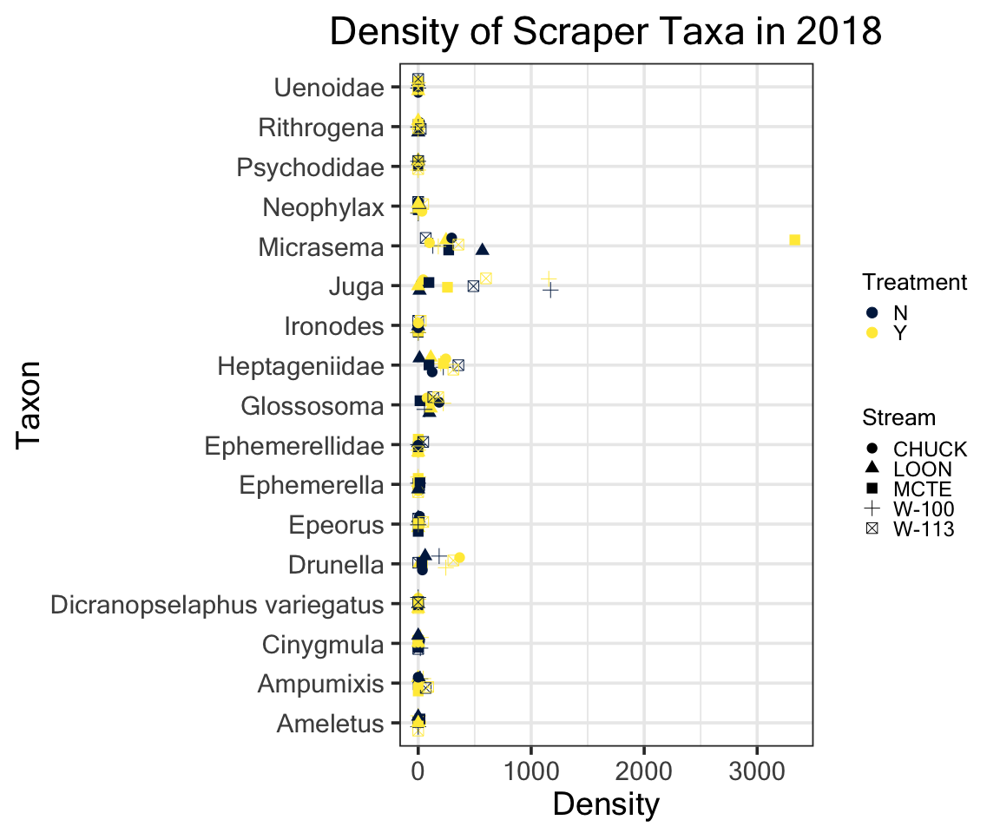
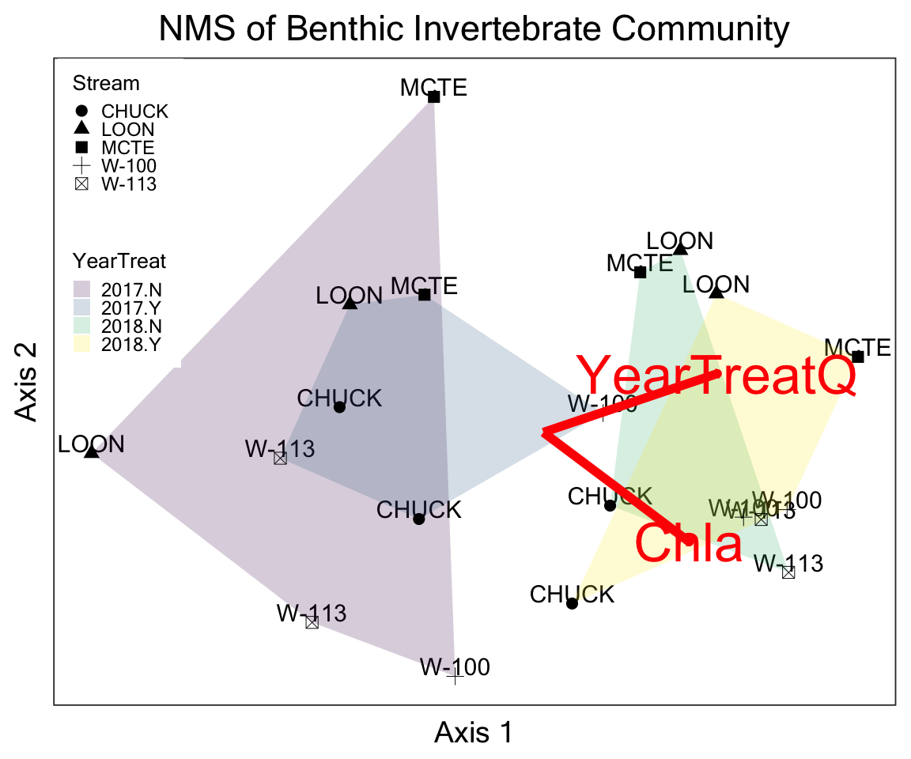
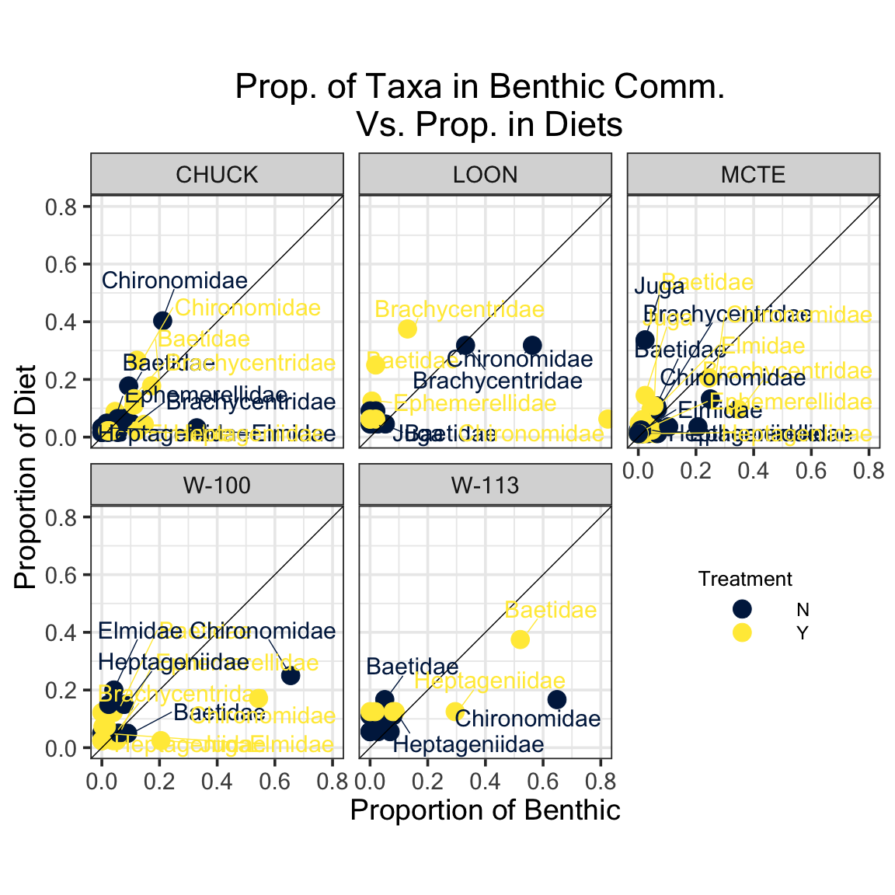
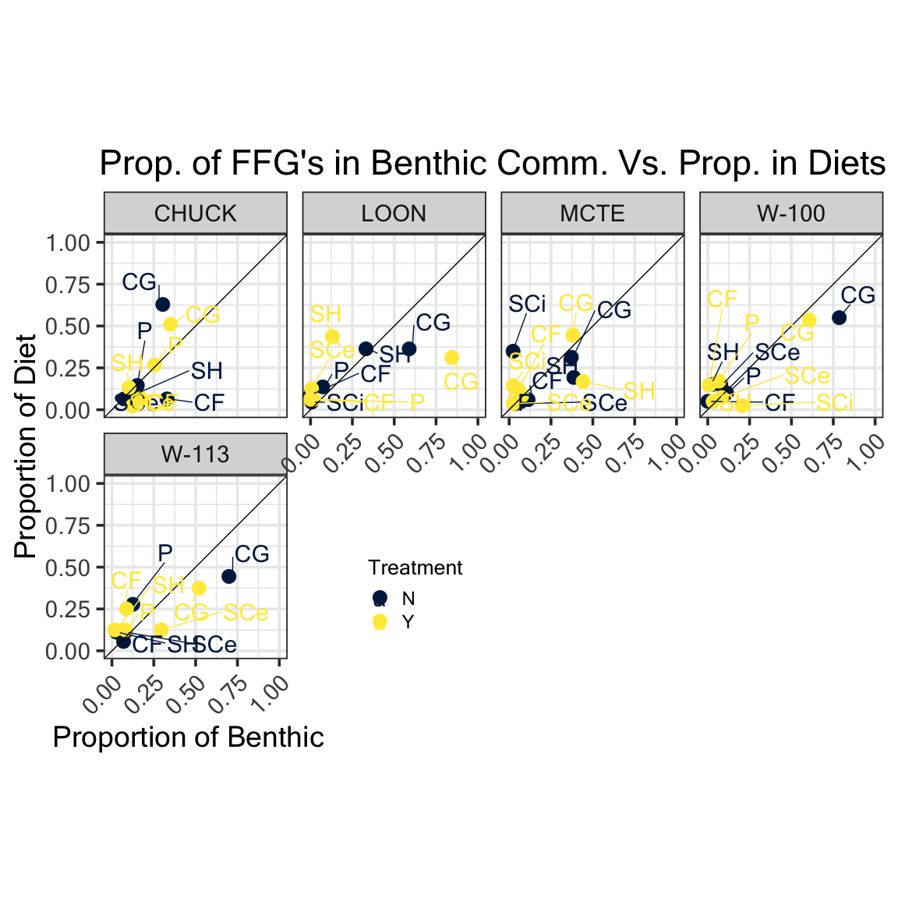

## Purpose of This Document 
***
Working with 2017-18 benthic invertebrate and fish diet data to calculate and plot:

- Changes in scaper taxa community

- NMS analysis

- Diet NMS

- Diet 1:1 and costello plot

- Analysis of diet and benthic overlay

- Effect of treatment on benthic and diet communities using MRPP or perMANOVA?

## Benthic {.tabset .tabset-fade .tabset-pills}
***
<br>

### Load Packages
*** 


```r
# import data
bugs <- readxl::read_xlsx("./Data/2017-18 bugs.xlsx", sheet = "Cleaned", col_types = c("date", "guess", "guess", "guess","guess", "guess", "guess","guess", "guess", "guess","guess", "guess"))
```

```
## Warning in read_fun(path = path, sheet_i = sheet, limits = limits, shim =
## shim, : Coercing numeric to date A2 / R2C1
```

```
## Warning in read_fun(path = path, sheet_i = sheet, limits = limits, shim =
## shim, : Coercing numeric to date A3 / R3C1
```

```
## Warning in read_fun(path = path, sheet_i = sheet, limits = limits, shim =
## shim, : Coercing numeric to date A4 / R4C1
```

```
## Warning in read_fun(path = path, sheet_i = sheet, limits = limits, shim =
## shim, : Coercing numeric to date A5 / R5C1
```

```
## Warning in read_fun(path = path, sheet_i = sheet, limits = limits, shim =
## shim, : Coercing numeric to date A6 / R6C1
```

```
## Warning in read_fun(path = path, sheet_i = sheet, limits = limits, shim =
## shim, : Coercing numeric to date A7 / R7C1
```

```
## Warning in read_fun(path = path, sheet_i = sheet, limits = limits, shim =
## shim, : Coercing numeric to date A8 / R8C1
```

```
## Warning in read_fun(path = path, sheet_i = sheet, limits = limits, shim =
## shim, : Coercing numeric to date A9 / R9C1
```

```
## Warning in read_fun(path = path, sheet_i = sheet, limits = limits, shim =
## shim, : Coercing numeric to date A10 / R10C1
```

```
## Warning in read_fun(path = path, sheet_i = sheet, limits = limits, shim =
## shim, : Coercing numeric to date A11 / R11C1
```

```
## Warning in read_fun(path = path, sheet_i = sheet, limits = limits, shim =
## shim, : Coercing numeric to date A12 / R12C1
```

```
## Warning in read_fun(path = path, sheet_i = sheet, limits = limits, shim =
## shim, : Coercing numeric to date A13 / R13C1
```

```
## Warning in read_fun(path = path, sheet_i = sheet, limits = limits, shim =
## shim, : Coercing numeric to date A14 / R14C1
```

```
## Warning in read_fun(path = path, sheet_i = sheet, limits = limits, shim =
## shim, : Coercing numeric to date A15 / R15C1
```

```
## Warning in read_fun(path = path, sheet_i = sheet, limits = limits, shim =
## shim, : Coercing numeric to date A16 / R16C1
```

```
## Warning in read_fun(path = path, sheet_i = sheet, limits = limits, shim =
## shim, : Coercing numeric to date A17 / R17C1
```

```
## Warning in read_fun(path = path, sheet_i = sheet, limits = limits, shim =
## shim, : Coercing numeric to date A18 / R18C1
```

```
## Warning in read_fun(path = path, sheet_i = sheet, limits = limits, shim =
## shim, : Coercing numeric to date A19 / R19C1
```

```
## Warning in read_fun(path = path, sheet_i = sheet, limits = limits, shim =
## shim, : Coercing numeric to date A20 / R20C1
```

```
## Warning in read_fun(path = path, sheet_i = sheet, limits = limits, shim =
## shim, : Coercing numeric to date A21 / R21C1
```

```
## Warning in read_fun(path = path, sheet_i = sheet, limits = limits, shim =
## shim, : Coercing numeric to date A22 / R22C1
```

```
## Warning in read_fun(path = path, sheet_i = sheet, limits = limits, shim =
## shim, : Coercing numeric to date A23 / R23C1
```

```
## Warning in read_fun(path = path, sheet_i = sheet, limits = limits, shim =
## shim, : Coercing numeric to date A24 / R24C1
```

```
## Warning in read_fun(path = path, sheet_i = sheet, limits = limits, shim =
## shim, : Coercing numeric to date A25 / R25C1
```

```
## Warning in read_fun(path = path, sheet_i = sheet, limits = limits, shim =
## shim, : Coercing numeric to date A26 / R26C1
```

```
## Warning in read_fun(path = path, sheet_i = sheet, limits = limits, shim =
## shim, : Coercing numeric to date A27 / R27C1
```

```
## Warning in read_fun(path = path, sheet_i = sheet, limits = limits, shim =
## shim, : Coercing numeric to date A28 / R28C1
```

```
## Warning in read_fun(path = path, sheet_i = sheet, limits = limits, shim =
## shim, : Coercing numeric to date A29 / R29C1
```

```
## Warning in read_fun(path = path, sheet_i = sheet, limits = limits, shim =
## shim, : Coercing numeric to date A30 / R30C1
```

```
## Warning in read_fun(path = path, sheet_i = sheet, limits = limits, shim =
## shim, : Coercing numeric to date A31 / R31C1
```

```
## Warning in read_fun(path = path, sheet_i = sheet, limits = limits, shim =
## shim, : Coercing numeric to date A32 / R32C1
```

```
## Warning in read_fun(path = path, sheet_i = sheet, limits = limits, shim =
## shim, : Coercing numeric to date A33 / R33C1
```

```
## Warning in read_fun(path = path, sheet_i = sheet, limits = limits, shim =
## shim, : Coercing numeric to date A34 / R34C1
```

```
## Warning in read_fun(path = path, sheet_i = sheet, limits = limits, shim =
## shim, : Coercing numeric to date A35 / R35C1
```

```
## Warning in read_fun(path = path, sheet_i = sheet, limits = limits, shim =
## shim, : Coercing numeric to date A36 / R36C1
```

```
## Warning in read_fun(path = path, sheet_i = sheet, limits = limits, shim =
## shim, : Coercing numeric to date A37 / R37C1
```

```
## Warning in read_fun(path = path, sheet_i = sheet, limits = limits, shim =
## shim, : Coercing numeric to date A38 / R38C1
```

```
## Warning in read_fun(path = path, sheet_i = sheet, limits = limits, shim =
## shim, : Coercing numeric to date A39 / R39C1
```

```
## Warning in read_fun(path = path, sheet_i = sheet, limits = limits, shim =
## shim, : Coercing numeric to date A40 / R40C1
```

```
## Warning in read_fun(path = path, sheet_i = sheet, limits = limits, shim =
## shim, : Coercing numeric to date A41 / R41C1
```

```
## Warning in read_fun(path = path, sheet_i = sheet, limits = limits, shim =
## shim, : Coercing numeric to date A42 / R42C1
```

```
## Warning in read_fun(path = path, sheet_i = sheet, limits = limits, shim =
## shim, : Coercing numeric to date A43 / R43C1
```

```
## Warning in read_fun(path = path, sheet_i = sheet, limits = limits, shim =
## shim, : Coercing numeric to date A44 / R44C1
```

```
## Warning in read_fun(path = path, sheet_i = sheet, limits = limits, shim =
## shim, : Coercing numeric to date A45 / R45C1
```

```
## Warning in read_fun(path = path, sheet_i = sheet, limits = limits, shim =
## shim, : Coercing numeric to date A46 / R46C1
```

```
## Warning in read_fun(path = path, sheet_i = sheet, limits = limits, shim =
## shim, : Coercing numeric to date A47 / R47C1
```

```
## Warning in read_fun(path = path, sheet_i = sheet, limits = limits, shim =
## shim, : Coercing numeric to date A48 / R48C1
```

```
## Warning in read_fun(path = path, sheet_i = sheet, limits = limits, shim =
## shim, : Coercing numeric to date A49 / R49C1
```

```
## Warning in read_fun(path = path, sheet_i = sheet, limits = limits, shim =
## shim, : Coercing numeric to date A50 / R50C1
```

```
## Warning in read_fun(path = path, sheet_i = sheet, limits = limits, shim =
## shim, : Coercing numeric to date A51 / R51C1
```

```
## Warning in read_fun(path = path, sheet_i = sheet, limits = limits, shim =
## shim, : Coercing numeric to date A52 / R52C1
```

```
## Warning in read_fun(path = path, sheet_i = sheet, limits = limits, shim =
## shim, : Coercing numeric to date A53 / R53C1
```

```
## Warning in read_fun(path = path, sheet_i = sheet, limits = limits, shim =
## shim, : Coercing numeric to date A54 / R54C1
```

```
## Warning in read_fun(path = path, sheet_i = sheet, limits = limits, shim =
## shim, : Coercing numeric to date A55 / R55C1
```

```
## Warning in read_fun(path = path, sheet_i = sheet, limits = limits, shim =
## shim, : Coercing numeric to date A56 / R56C1
```

```
## Warning in read_fun(path = path, sheet_i = sheet, limits = limits, shim =
## shim, : Coercing numeric to date A57 / R57C1
```

```
## Warning in read_fun(path = path, sheet_i = sheet, limits = limits, shim =
## shim, : Coercing numeric to date A58 / R58C1
```

```
## Warning in read_fun(path = path, sheet_i = sheet, limits = limits, shim =
## shim, : Coercing numeric to date A59 / R59C1
```

```
## Warning in read_fun(path = path, sheet_i = sheet, limits = limits, shim =
## shim, : Coercing numeric to date A60 / R60C1
```

```
## Warning in read_fun(path = path, sheet_i = sheet, limits = limits, shim =
## shim, : Coercing numeric to date A61 / R61C1
```

```
## Warning in read_fun(path = path, sheet_i = sheet, limits = limits, shim =
## shim, : Coercing numeric to date A62 / R62C1
```

```
## Warning in read_fun(path = path, sheet_i = sheet, limits = limits, shim =
## shim, : Coercing numeric to date A63 / R63C1
```

```
## Warning in read_fun(path = path, sheet_i = sheet, limits = limits, shim =
## shim, : Coercing numeric to date A64 / R64C1
```

```
## Warning in read_fun(path = path, sheet_i = sheet, limits = limits, shim =
## shim, : Coercing numeric to date A65 / R65C1
```

```
## Warning in read_fun(path = path, sheet_i = sheet, limits = limits, shim =
## shim, : Coercing numeric to date A66 / R66C1
```

```
## Warning in read_fun(path = path, sheet_i = sheet, limits = limits, shim =
## shim, : Coercing numeric to date A67 / R67C1
```

```
## Warning in read_fun(path = path, sheet_i = sheet, limits = limits, shim =
## shim, : Coercing numeric to date A68 / R68C1
```

```
## Warning in read_fun(path = path, sheet_i = sheet, limits = limits, shim =
## shim, : Coercing numeric to date A69 / R69C1
```

```
## Warning in read_fun(path = path, sheet_i = sheet, limits = limits, shim =
## shim, : Coercing numeric to date A70 / R70C1
```

```
## Warning in read_fun(path = path, sheet_i = sheet, limits = limits, shim =
## shim, : Coercing numeric to date A71 / R71C1
```

```
## Warning in read_fun(path = path, sheet_i = sheet, limits = limits, shim =
## shim, : Coercing numeric to date A72 / R72C1
```

```
## Warning in read_fun(path = path, sheet_i = sheet, limits = limits, shim =
## shim, : Coercing numeric to date A73 / R73C1
```

```
## Warning in read_fun(path = path, sheet_i = sheet, limits = limits, shim =
## shim, : Coercing numeric to date A74 / R74C1
```

```
## Warning in read_fun(path = path, sheet_i = sheet, limits = limits, shim =
## shim, : Coercing numeric to date A75 / R75C1
```

```
## Warning in read_fun(path = path, sheet_i = sheet, limits = limits, shim =
## shim, : Coercing numeric to date A76 / R76C1
```

```
## Warning in read_fun(path = path, sheet_i = sheet, limits = limits, shim =
## shim, : Coercing numeric to date A77 / R77C1
```

```
## Warning in read_fun(path = path, sheet_i = sheet, limits = limits, shim =
## shim, : Coercing numeric to date A78 / R78C1
```

```
## Warning in read_fun(path = path, sheet_i = sheet, limits = limits, shim =
## shim, : Coercing numeric to date A79 / R79C1
```

```
## Warning in read_fun(path = path, sheet_i = sheet, limits = limits, shim =
## shim, : Coercing numeric to date A80 / R80C1
```

```
## Warning in read_fun(path = path, sheet_i = sheet, limits = limits, shim =
## shim, : Coercing numeric to date A81 / R81C1
```

```
## Warning in read_fun(path = path, sheet_i = sheet, limits = limits, shim =
## shim, : Coercing numeric to date A82 / R82C1
```

```
## Warning in read_fun(path = path, sheet_i = sheet, limits = limits, shim =
## shim, : Coercing numeric to date A83 / R83C1
```

```
## Warning in read_fun(path = path, sheet_i = sheet, limits = limits, shim =
## shim, : Coercing numeric to date A84 / R84C1
```

```
## Warning in read_fun(path = path, sheet_i = sheet, limits = limits, shim =
## shim, : Coercing numeric to date A85 / R85C1
```

```
## Warning in read_fun(path = path, sheet_i = sheet, limits = limits, shim =
## shim, : Coercing numeric to date A86 / R86C1
```

```
## Warning in read_fun(path = path, sheet_i = sheet, limits = limits, shim =
## shim, : Coercing numeric to date A87 / R87C1
```

```
## Warning in read_fun(path = path, sheet_i = sheet, limits = limits, shim =
## shim, : Coercing numeric to date A88 / R88C1
```

```
## Warning in read_fun(path = path, sheet_i = sheet, limits = limits, shim =
## shim, : Coercing numeric to date A89 / R89C1
```

```
## Warning in read_fun(path = path, sheet_i = sheet, limits = limits, shim =
## shim, : Coercing numeric to date A90 / R90C1
```

```
## Warning in read_fun(path = path, sheet_i = sheet, limits = limits, shim =
## shim, : Coercing numeric to date A91 / R91C1
```

```
## Warning in read_fun(path = path, sheet_i = sheet, limits = limits, shim =
## shim, : Coercing numeric to date A92 / R92C1
```

```
## Warning in read_fun(path = path, sheet_i = sheet, limits = limits, shim =
## shim, : Coercing numeric to date A93 / R93C1
```

```
## Warning in read_fun(path = path, sheet_i = sheet, limits = limits, shim =
## shim, : Coercing numeric to date A94 / R94C1
```

```
## Warning in read_fun(path = path, sheet_i = sheet, limits = limits, shim =
## shim, : Coercing numeric to date A95 / R95C1
```

```
## Warning in read_fun(path = path, sheet_i = sheet, limits = limits, shim =
## shim, : Coercing numeric to date A96 / R96C1
```

```
## Warning in read_fun(path = path, sheet_i = sheet, limits = limits, shim =
## shim, : Coercing numeric to date A97 / R97C1
```

```
## Warning in read_fun(path = path, sheet_i = sheet, limits = limits, shim =
## shim, : Coercing numeric to date A98 / R98C1
```

```
## Warning in read_fun(path = path, sheet_i = sheet, limits = limits, shim =
## shim, : Coercing numeric to date A99 / R99C1
```

```
## Warning in read_fun(path = path, sheet_i = sheet, limits = limits, shim =
## shim, : Coercing numeric to date A100 / R100C1
```

```
## Warning in read_fun(path = path, sheet_i = sheet, limits = limits, shim =
## shim, : Coercing numeric to date A101 / R101C1
```

```
## Warning in read_fun(path = path, sheet_i = sheet, limits = limits, shim =
## shim, : Coercing numeric to date A102 / R102C1
```

```
## Warning in read_fun(path = path, sheet_i = sheet, limits = limits, shim =
## shim, : Coercing numeric to date A103 / R103C1
```

```
## Warning in read_fun(path = path, sheet_i = sheet, limits = limits, shim =
## shim, : Coercing numeric to date A104 / R104C1
```

```
## Warning in read_fun(path = path, sheet_i = sheet, limits = limits, shim =
## shim, : Coercing numeric to date A105 / R105C1
```

```
## Warning in read_fun(path = path, sheet_i = sheet, limits = limits, shim =
## shim, : Coercing numeric to date A106 / R106C1
```

```
## Warning in read_fun(path = path, sheet_i = sheet, limits = limits, shim =
## shim, : Coercing numeric to date A107 / R107C1
```

```
## Warning in read_fun(path = path, sheet_i = sheet, limits = limits, shim =
## shim, : Coercing numeric to date A108 / R108C1
```

```
## Warning in read_fun(path = path, sheet_i = sheet, limits = limits, shim =
## shim, : Coercing numeric to date A109 / R109C1
```

```
## Warning in read_fun(path = path, sheet_i = sheet, limits = limits, shim =
## shim, : Coercing numeric to date A110 / R110C1
```

```
## Warning in read_fun(path = path, sheet_i = sheet, limits = limits, shim =
## shim, : Coercing numeric to date A111 / R111C1
```

```
## Warning in read_fun(path = path, sheet_i = sheet, limits = limits, shim =
## shim, : Coercing numeric to date A112 / R112C1
```

```
## Warning in read_fun(path = path, sheet_i = sheet, limits = limits, shim =
## shim, : Coercing numeric to date A113 / R113C1
```

```
## Warning in read_fun(path = path, sheet_i = sheet, limits = limits, shim =
## shim, : Coercing numeric to date A114 / R114C1
```

```
## Warning in read_fun(path = path, sheet_i = sheet, limits = limits, shim =
## shim, : Coercing numeric to date A115 / R115C1
```

```
## Warning in read_fun(path = path, sheet_i = sheet, limits = limits, shim =
## shim, : Coercing numeric to date A116 / R116C1
```

```
## Warning in read_fun(path = path, sheet_i = sheet, limits = limits, shim =
## shim, : Coercing numeric to date A117 / R117C1
```

```
## Warning in read_fun(path = path, sheet_i = sheet, limits = limits, shim =
## shim, : Coercing numeric to date A118 / R118C1
```

```
## Warning in read_fun(path = path, sheet_i = sheet, limits = limits, shim =
## shim, : Coercing numeric to date A119 / R119C1
```

```
## Warning in read_fun(path = path, sheet_i = sheet, limits = limits, shim =
## shim, : Coercing numeric to date A120 / R120C1
```

```
## Warning in read_fun(path = path, sheet_i = sheet, limits = limits, shim =
## shim, : Coercing numeric to date A121 / R121C1
```

```
## Warning in read_fun(path = path, sheet_i = sheet, limits = limits, shim =
## shim, : Coercing numeric to date A122 / R122C1
```

```
## Warning in read_fun(path = path, sheet_i = sheet, limits = limits, shim =
## shim, : Coercing numeric to date A123 / R123C1
```

```
## Warning in read_fun(path = path, sheet_i = sheet, limits = limits, shim =
## shim, : Coercing numeric to date A124 / R124C1
```

```
## Warning in read_fun(path = path, sheet_i = sheet, limits = limits, shim =
## shim, : Coercing numeric to date A125 / R125C1
```

```
## Warning in read_fun(path = path, sheet_i = sheet, limits = limits, shim =
## shim, : Coercing numeric to date A126 / R126C1
```

```
## Warning in read_fun(path = path, sheet_i = sheet, limits = limits, shim =
## shim, : Coercing numeric to date A127 / R127C1
```

```
## Warning in read_fun(path = path, sheet_i = sheet, limits = limits, shim =
## shim, : Coercing numeric to date A128 / R128C1
```

```
## Warning in read_fun(path = path, sheet_i = sheet, limits = limits, shim =
## shim, : Coercing numeric to date A129 / R129C1
```

```
## Warning in read_fun(path = path, sheet_i = sheet, limits = limits, shim =
## shim, : Coercing numeric to date A130 / R130C1
```

```
## Warning in read_fun(path = path, sheet_i = sheet, limits = limits, shim =
## shim, : Coercing numeric to date A131 / R131C1
```

```
## Warning in read_fun(path = path, sheet_i = sheet, limits = limits, shim =
## shim, : Coercing numeric to date A132 / R132C1
```

```
## Warning in read_fun(path = path, sheet_i = sheet, limits = limits, shim =
## shim, : Coercing numeric to date A133 / R133C1
```

```
## Warning in read_fun(path = path, sheet_i = sheet, limits = limits, shim =
## shim, : Coercing numeric to date A134 / R134C1
```

```
## Warning in read_fun(path = path, sheet_i = sheet, limits = limits, shim =
## shim, : Coercing numeric to date A135 / R135C1
```

```
## Warning in read_fun(path = path, sheet_i = sheet, limits = limits, shim =
## shim, : Coercing numeric to date A136 / R136C1
```

```
## Warning in read_fun(path = path, sheet_i = sheet, limits = limits, shim =
## shim, : Coercing numeric to date A137 / R137C1
```

```
## Warning in read_fun(path = path, sheet_i = sheet, limits = limits, shim =
## shim, : Coercing numeric to date A138 / R138C1
```

```
## Warning in read_fun(path = path, sheet_i = sheet, limits = limits, shim =
## shim, : Coercing numeric to date A139 / R139C1
```

```
## Warning in read_fun(path = path, sheet_i = sheet, limits = limits, shim =
## shim, : Coercing numeric to date A140 / R140C1
```

```
## Warning in read_fun(path = path, sheet_i = sheet, limits = limits, shim =
## shim, : Coercing numeric to date A141 / R141C1
```

```
## Warning in read_fun(path = path, sheet_i = sheet, limits = limits, shim =
## shim, : Coercing numeric to date A142 / R142C1
```

```
## Warning in read_fun(path = path, sheet_i = sheet, limits = limits, shim =
## shim, : Coercing numeric to date A143 / R143C1
```

```
## Warning in read_fun(path = path, sheet_i = sheet, limits = limits, shim =
## shim, : Coercing numeric to date A144 / R144C1
```

```
## Warning in read_fun(path = path, sheet_i = sheet, limits = limits, shim =
## shim, : Coercing numeric to date A145 / R145C1
```

```
## Warning in read_fun(path = path, sheet_i = sheet, limits = limits, shim =
## shim, : Coercing numeric to date A146 / R146C1
```

```
## Warning in read_fun(path = path, sheet_i = sheet, limits = limits, shim =
## shim, : Coercing numeric to date A147 / R147C1
```

```
## Warning in read_fun(path = path, sheet_i = sheet, limits = limits, shim =
## shim, : Coercing numeric to date A148 / R148C1
```

```
## Warning in read_fun(path = path, sheet_i = sheet, limits = limits, shim =
## shim, : Coercing numeric to date A149 / R149C1
```

```
## Warning in read_fun(path = path, sheet_i = sheet, limits = limits, shim =
## shim, : Coercing numeric to date A150 / R150C1
```

```
## Warning in read_fun(path = path, sheet_i = sheet, limits = limits, shim =
## shim, : Coercing numeric to date A151 / R151C1
```

```
## Warning in read_fun(path = path, sheet_i = sheet, limits = limits, shim =
## shim, : Coercing numeric to date A152 / R152C1
```

```
## Warning in read_fun(path = path, sheet_i = sheet, limits = limits, shim =
## shim, : Coercing numeric to date A153 / R153C1
```

```
## Warning in read_fun(path = path, sheet_i = sheet, limits = limits, shim =
## shim, : Coercing numeric to date A154 / R154C1
```

```
## Warning in read_fun(path = path, sheet_i = sheet, limits = limits, shim =
## shim, : Coercing numeric to date A155 / R155C1
```

```
## Warning in read_fun(path = path, sheet_i = sheet, limits = limits, shim =
## shim, : Coercing numeric to date A156 / R156C1
```

```
## Warning in read_fun(path = path, sheet_i = sheet, limits = limits, shim =
## shim, : Coercing numeric to date A157 / R157C1
```

```
## Warning in read_fun(path = path, sheet_i = sheet, limits = limits, shim =
## shim, : Coercing numeric to date A158 / R158C1
```

```
## Warning in read_fun(path = path, sheet_i = sheet, limits = limits, shim =
## shim, : Coercing numeric to date A159 / R159C1
```

```
## Warning in read_fun(path = path, sheet_i = sheet, limits = limits, shim =
## shim, : Coercing numeric to date A160 / R160C1
```

```
## Warning in read_fun(path = path, sheet_i = sheet, limits = limits, shim =
## shim, : Coercing numeric to date A161 / R161C1
```

```
## Warning in read_fun(path = path, sheet_i = sheet, limits = limits, shim =
## shim, : Coercing numeric to date A162 / R162C1
```

```
## Warning in read_fun(path = path, sheet_i = sheet, limits = limits, shim =
## shim, : Coercing numeric to date A163 / R163C1
```

```
## Warning in read_fun(path = path, sheet_i = sheet, limits = limits, shim =
## shim, : Coercing numeric to date A164 / R164C1
```

```
## Warning in read_fun(path = path, sheet_i = sheet, limits = limits, shim =
## shim, : Coercing numeric to date A165 / R165C1
```

```
## Warning in read_fun(path = path, sheet_i = sheet, limits = limits, shim =
## shim, : Coercing numeric to date A166 / R166C1
```

```
## Warning in read_fun(path = path, sheet_i = sheet, limits = limits, shim =
## shim, : Coercing numeric to date A167 / R167C1
```

```
## Warning in read_fun(path = path, sheet_i = sheet, limits = limits, shim =
## shim, : Coercing numeric to date A168 / R168C1
```

```
## Warning in read_fun(path = path, sheet_i = sheet, limits = limits, shim =
## shim, : Coercing numeric to date A169 / R169C1
```

```
## Warning in read_fun(path = path, sheet_i = sheet, limits = limits, shim =
## shim, : Coercing numeric to date A170 / R170C1
```

```
## Warning in read_fun(path = path, sheet_i = sheet, limits = limits, shim =
## shim, : Coercing numeric to date A171 / R171C1
```

```
## Warning in read_fun(path = path, sheet_i = sheet, limits = limits, shim =
## shim, : Coercing numeric to date A172 / R172C1
```

```
## Warning in read_fun(path = path, sheet_i = sheet, limits = limits, shim =
## shim, : Coercing numeric to date A173 / R173C1
```

```
## Warning in read_fun(path = path, sheet_i = sheet, limits = limits, shim =
## shim, : Coercing numeric to date A174 / R174C1
```

```
## Warning in read_fun(path = path, sheet_i = sheet, limits = limits, shim =
## shim, : Coercing numeric to date A175 / R175C1
```

```
## Warning in read_fun(path = path, sheet_i = sheet, limits = limits, shim =
## shim, : Coercing numeric to date A176 / R176C1
```

```
## Warning in read_fun(path = path, sheet_i = sheet, limits = limits, shim =
## shim, : Coercing numeric to date A177 / R177C1
```

```
## Warning in read_fun(path = path, sheet_i = sheet, limits = limits, shim =
## shim, : Coercing numeric to date A178 / R178C1
```

```
## Warning in read_fun(path = path, sheet_i = sheet, limits = limits, shim =
## shim, : Coercing numeric to date A179 / R179C1
```

```
## Warning in read_fun(path = path, sheet_i = sheet, limits = limits, shim =
## shim, : Coercing numeric to date A180 / R180C1
```

```
## Warning in read_fun(path = path, sheet_i = sheet, limits = limits, shim =
## shim, : Coercing numeric to date A181 / R181C1
```

```
## Warning in read_fun(path = path, sheet_i = sheet, limits = limits, shim =
## shim, : Coercing numeric to date A182 / R182C1
```

```
## Warning in read_fun(path = path, sheet_i = sheet, limits = limits, shim =
## shim, : Coercing numeric to date A183 / R183C1
```

```
## Warning in read_fun(path = path, sheet_i = sheet, limits = limits, shim =
## shim, : Coercing numeric to date A184 / R184C1
```

```
## Warning in read_fun(path = path, sheet_i = sheet, limits = limits, shim =
## shim, : Coercing numeric to date A185 / R185C1
```

```
## Warning in read_fun(path = path, sheet_i = sheet, limits = limits, shim =
## shim, : Coercing numeric to date A186 / R186C1
```

```
## Warning in read_fun(path = path, sheet_i = sheet, limits = limits, shim =
## shim, : Coercing numeric to date A187 / R187C1
```

```
## Warning in read_fun(path = path, sheet_i = sheet, limits = limits, shim =
## shim, : Coercing numeric to date A188 / R188C1
```

```
## Warning in read_fun(path = path, sheet_i = sheet, limits = limits, shim =
## shim, : Coercing numeric to date A189 / R189C1
```

```
## Warning in read_fun(path = path, sheet_i = sheet, limits = limits, shim =
## shim, : Coercing numeric to date A190 / R190C1
```

```
## Warning in read_fun(path = path, sheet_i = sheet, limits = limits, shim =
## shim, : Coercing numeric to date A191 / R191C1
```

```
## Warning in read_fun(path = path, sheet_i = sheet, limits = limits, shim =
## shim, : Coercing numeric to date A192 / R192C1
```

```
## Warning in read_fun(path = path, sheet_i = sheet, limits = limits, shim =
## shim, : Coercing numeric to date A193 / R193C1
```

```
## Warning in read_fun(path = path, sheet_i = sheet, limits = limits, shim =
## shim, : Coercing numeric to date A194 / R194C1
```

```
## Warning in read_fun(path = path, sheet_i = sheet, limits = limits, shim =
## shim, : Coercing numeric to date A195 / R195C1
```

```
## Warning in read_fun(path = path, sheet_i = sheet, limits = limits, shim =
## shim, : Coercing numeric to date A196 / R196C1
```

```
## Warning in read_fun(path = path, sheet_i = sheet, limits = limits, shim =
## shim, : Coercing numeric to date A197 / R197C1
```

```
## Warning in read_fun(path = path, sheet_i = sheet, limits = limits, shim =
## shim, : Coercing numeric to date A198 / R198C1
```

```
## Warning in read_fun(path = path, sheet_i = sheet, limits = limits, shim =
## shim, : Coercing numeric to date A199 / R199C1
```

```
## Warning in read_fun(path = path, sheet_i = sheet, limits = limits, shim =
## shim, : Coercing numeric to date A200 / R200C1
```

```
## Warning in read_fun(path = path, sheet_i = sheet, limits = limits, shim =
## shim, : Coercing numeric to date A201 / R201C1
```

```
## Warning in read_fun(path = path, sheet_i = sheet, limits = limits, shim =
## shim, : Coercing numeric to date A202 / R202C1
```

```
## Warning in read_fun(path = path, sheet_i = sheet, limits = limits, shim =
## shim, : Coercing numeric to date A203 / R203C1
```

```
## Warning in read_fun(path = path, sheet_i = sheet, limits = limits, shim =
## shim, : Coercing numeric to date A204 / R204C1
```

```
## Warning in read_fun(path = path, sheet_i = sheet, limits = limits, shim =
## shim, : Coercing numeric to date A205 / R205C1
```

```
## Warning in read_fun(path = path, sheet_i = sheet, limits = limits, shim =
## shim, : Coercing numeric to date A206 / R206C1
```

```
## Warning in read_fun(path = path, sheet_i = sheet, limits = limits, shim =
## shim, : Coercing numeric to date A207 / R207C1
```

```
## Warning in read_fun(path = path, sheet_i = sheet, limits = limits, shim =
## shim, : Coercing numeric to date A208 / R208C1
```

```
## Warning in read_fun(path = path, sheet_i = sheet, limits = limits, shim =
## shim, : Coercing numeric to date A209 / R209C1
```

```
## Warning in read_fun(path = path, sheet_i = sheet, limits = limits, shim =
## shim, : Coercing numeric to date A210 / R210C1
```

```
## Warning in read_fun(path = path, sheet_i = sheet, limits = limits, shim =
## shim, : Coercing numeric to date A211 / R211C1
```

```
## Warning in read_fun(path = path, sheet_i = sheet, limits = limits, shim =
## shim, : Coercing numeric to date A212 / R212C1
```

```
## Warning in read_fun(path = path, sheet_i = sheet, limits = limits, shim =
## shim, : Coercing numeric to date A213 / R213C1
```

```
## Warning in read_fun(path = path, sheet_i = sheet, limits = limits, shim =
## shim, : Coercing numeric to date A214 / R214C1
```

```
## Warning in read_fun(path = path, sheet_i = sheet, limits = limits, shim =
## shim, : Coercing numeric to date A215 / R215C1
```

```
## Warning in read_fun(path = path, sheet_i = sheet, limits = limits, shim =
## shim, : Coercing numeric to date A216 / R216C1
```

```
## Warning in read_fun(path = path, sheet_i = sheet, limits = limits, shim =
## shim, : Coercing numeric to date A217 / R217C1
```

```
## Warning in read_fun(path = path, sheet_i = sheet, limits = limits, shim =
## shim, : Coercing numeric to date A218 / R218C1
```

```
## Warning in read_fun(path = path, sheet_i = sheet, limits = limits, shim =
## shim, : Coercing numeric to date A219 / R219C1
```

```
## Warning in read_fun(path = path, sheet_i = sheet, limits = limits, shim =
## shim, : Coercing numeric to date A220 / R220C1
```

```
## Warning in read_fun(path = path, sheet_i = sheet, limits = limits, shim =
## shim, : Coercing numeric to date A221 / R221C1
```

```
## Warning in read_fun(path = path, sheet_i = sheet, limits = limits, shim =
## shim, : Coercing numeric to date A222 / R222C1
```

```
## Warning in read_fun(path = path, sheet_i = sheet, limits = limits, shim =
## shim, : Coercing numeric to date A223 / R223C1
```

```
## Warning in read_fun(path = path, sheet_i = sheet, limits = limits, shim =
## shim, : Coercing numeric to date A224 / R224C1
```

```
## Warning in read_fun(path = path, sheet_i = sheet, limits = limits, shim =
## shim, : Coercing numeric to date A225 / R225C1
```

```
## Warning in read_fun(path = path, sheet_i = sheet, limits = limits, shim =
## shim, : Coercing numeric to date A226 / R226C1
```

```
## Warning in read_fun(path = path, sheet_i = sheet, limits = limits, shim =
## shim, : Coercing numeric to date A227 / R227C1
```

```
## Warning in read_fun(path = path, sheet_i = sheet, limits = limits, shim =
## shim, : Coercing numeric to date A228 / R228C1
```

```
## Warning in read_fun(path = path, sheet_i = sheet, limits = limits, shim =
## shim, : Coercing numeric to date A229 / R229C1
```

```
## Warning in read_fun(path = path, sheet_i = sheet, limits = limits, shim =
## shim, : Coercing numeric to date A230 / R230C1
```

```
## Warning in read_fun(path = path, sheet_i = sheet, limits = limits, shim =
## shim, : Coercing numeric to date A231 / R231C1
```

```
## Warning in read_fun(path = path, sheet_i = sheet, limits = limits, shim =
## shim, : Coercing numeric to date A232 / R232C1
```

```
## Warning in read_fun(path = path, sheet_i = sheet, limits = limits, shim =
## shim, : Coercing numeric to date A233 / R233C1
```

```
## Warning in read_fun(path = path, sheet_i = sheet, limits = limits, shim =
## shim, : Coercing numeric to date A234 / R234C1
```

```
## Warning in read_fun(path = path, sheet_i = sheet, limits = limits, shim =
## shim, : Coercing numeric to date A235 / R235C1
```

```
## Warning in read_fun(path = path, sheet_i = sheet, limits = limits, shim =
## shim, : Coercing numeric to date A236 / R236C1
```

```
## Warning in read_fun(path = path, sheet_i = sheet, limits = limits, shim =
## shim, : Coercing numeric to date A237 / R237C1
```

```
## Warning in read_fun(path = path, sheet_i = sheet, limits = limits, shim =
## shim, : Coercing numeric to date A238 / R238C1
```

```
## Warning in read_fun(path = path, sheet_i = sheet, limits = limits, shim =
## shim, : Coercing numeric to date A239 / R239C1
```

```
## Warning in read_fun(path = path, sheet_i = sheet, limits = limits, shim =
## shim, : Coercing numeric to date A240 / R240C1
```

```
## Warning in read_fun(path = path, sheet_i = sheet, limits = limits, shim =
## shim, : Coercing numeric to date A241 / R241C1
```

```
## Warning in read_fun(path = path, sheet_i = sheet, limits = limits, shim =
## shim, : Coercing numeric to date A242 / R242C1
```

```
## Warning in read_fun(path = path, sheet_i = sheet, limits = limits, shim =
## shim, : Coercing numeric to date A243 / R243C1
```

```
## Warning in read_fun(path = path, sheet_i = sheet, limits = limits, shim =
## shim, : Coercing numeric to date A244 / R244C1
```

```
## Warning in read_fun(path = path, sheet_i = sheet, limits = limits, shim =
## shim, : Coercing numeric to date A245 / R245C1
```

```
## Warning in read_fun(path = path, sheet_i = sheet, limits = limits, shim =
## shim, : Coercing numeric to date A246 / R246C1
```

```
## Warning in read_fun(path = path, sheet_i = sheet, limits = limits, shim =
## shim, : Coercing numeric to date A247 / R247C1
```

```
## Warning in read_fun(path = path, sheet_i = sheet, limits = limits, shim =
## shim, : Coercing numeric to date A248 / R248C1
```

```
## Warning in read_fun(path = path, sheet_i = sheet, limits = limits, shim =
## shim, : Coercing numeric to date A249 / R249C1
```

```
## Warning in read_fun(path = path, sheet_i = sheet, limits = limits, shim =
## shim, : Coercing numeric to date A250 / R250C1
```

```
## Warning in read_fun(path = path, sheet_i = sheet, limits = limits, shim =
## shim, : Coercing numeric to date A251 / R251C1
```

```
## Warning in read_fun(path = path, sheet_i = sheet, limits = limits, shim =
## shim, : Coercing numeric to date A252 / R252C1
```

```
## Warning in read_fun(path = path, sheet_i = sheet, limits = limits, shim =
## shim, : Coercing numeric to date A253 / R253C1
```

```
## Warning in read_fun(path = path, sheet_i = sheet, limits = limits, shim =
## shim, : Coercing numeric to date A254 / R254C1
```

```
## Warning in read_fun(path = path, sheet_i = sheet, limits = limits, shim =
## shim, : Coercing numeric to date A255 / R255C1
```

```
## Warning in read_fun(path = path, sheet_i = sheet, limits = limits, shim =
## shim, : Coercing numeric to date A256 / R256C1
```

```
## Warning in read_fun(path = path, sheet_i = sheet, limits = limits, shim =
## shim, : Coercing numeric to date A257 / R257C1
```

```
## Warning in read_fun(path = path, sheet_i = sheet, limits = limits, shim =
## shim, : Coercing numeric to date A258 / R258C1
```

```
## Warning in read_fun(path = path, sheet_i = sheet, limits = limits, shim =
## shim, : Coercing numeric to date A259 / R259C1
```

```
## Warning in read_fun(path = path, sheet_i = sheet, limits = limits, shim =
## shim, : Coercing numeric to date A260 / R260C1
```

```
## Warning in read_fun(path = path, sheet_i = sheet, limits = limits, shim =
## shim, : Coercing numeric to date A261 / R261C1
```

```
## Warning in read_fun(path = path, sheet_i = sheet, limits = limits, shim =
## shim, : Coercing numeric to date A262 / R262C1
```

```
## Warning in read_fun(path = path, sheet_i = sheet, limits = limits, shim =
## shim, : Coercing numeric to date A263 / R263C1
```

```
## Warning in read_fun(path = path, sheet_i = sheet, limits = limits, shim =
## shim, : Coercing numeric to date A264 / R264C1
```

```
## Warning in read_fun(path = path, sheet_i = sheet, limits = limits, shim =
## shim, : Coercing numeric to date A265 / R265C1
```

```
## Warning in read_fun(path = path, sheet_i = sheet, limits = limits, shim =
## shim, : Coercing numeric to date A266 / R266C1
```

```
## Warning in read_fun(path = path, sheet_i = sheet, limits = limits, shim =
## shim, : Coercing numeric to date A267 / R267C1
```

```
## Warning in read_fun(path = path, sheet_i = sheet, limits = limits, shim =
## shim, : Coercing numeric to date A268 / R268C1
```

```
## Warning in read_fun(path = path, sheet_i = sheet, limits = limits, shim =
## shim, : Coercing numeric to date A269 / R269C1
```

```
## Warning in read_fun(path = path, sheet_i = sheet, limits = limits, shim =
## shim, : Coercing numeric to date A270 / R270C1
```

```
## Warning in read_fun(path = path, sheet_i = sheet, limits = limits, shim =
## shim, : Coercing numeric to date A271 / R271C1
```

```
## Warning in read_fun(path = path, sheet_i = sheet, limits = limits, shim =
## shim, : Coercing numeric to date A272 / R272C1
```

```
## Warning in read_fun(path = path, sheet_i = sheet, limits = limits, shim =
## shim, : Coercing numeric to date A273 / R273C1
```

```
## Warning in read_fun(path = path, sheet_i = sheet, limits = limits, shim =
## shim, : Coercing numeric to date A274 / R274C1
```

```
## Warning in read_fun(path = path, sheet_i = sheet, limits = limits, shim =
## shim, : Coercing numeric to date A275 / R275C1
```

```
## Warning in read_fun(path = path, sheet_i = sheet, limits = limits, shim =
## shim, : Coercing numeric to date A276 / R276C1
```

```
## Warning in read_fun(path = path, sheet_i = sheet, limits = limits, shim =
## shim, : Coercing numeric to date A277 / R277C1
```

```
## Warning in read_fun(path = path, sheet_i = sheet, limits = limits, shim =
## shim, : Coercing numeric to date A278 / R278C1
```

```
## Warning in read_fun(path = path, sheet_i = sheet, limits = limits, shim =
## shim, : Coercing numeric to date A279 / R279C1
```

```
## Warning in read_fun(path = path, sheet_i = sheet, limits = limits, shim =
## shim, : Coercing numeric to date A280 / R280C1
```

```
## Warning in read_fun(path = path, sheet_i = sheet, limits = limits, shim =
## shim, : Coercing numeric to date A281 / R281C1
```

```
## Warning in read_fun(path = path, sheet_i = sheet, limits = limits, shim =
## shim, : Coercing numeric to date A282 / R282C1
```

```
## Warning in read_fun(path = path, sheet_i = sheet, limits = limits, shim =
## shim, : Coercing numeric to date A283 / R283C1
```

```
## Warning in read_fun(path = path, sheet_i = sheet, limits = limits, shim =
## shim, : Coercing numeric to date A284 / R284C1
```

```
## Warning in read_fun(path = path, sheet_i = sheet, limits = limits, shim =
## shim, : Coercing numeric to date A285 / R285C1
```

```
## Warning in read_fun(path = path, sheet_i = sheet, limits = limits, shim =
## shim, : Coercing numeric to date A286 / R286C1
```

```
## Warning in read_fun(path = path, sheet_i = sheet, limits = limits, shim =
## shim, : Coercing numeric to date A287 / R287C1
```

```
## Warning in read_fun(path = path, sheet_i = sheet, limits = limits, shim =
## shim, : Coercing numeric to date A288 / R288C1
```

```
## Warning in read_fun(path = path, sheet_i = sheet, limits = limits, shim =
## shim, : Coercing numeric to date A289 / R289C1
```

```
## Warning in read_fun(path = path, sheet_i = sheet, limits = limits, shim =
## shim, : Coercing numeric to date A290 / R290C1
```

```
## Warning in read_fun(path = path, sheet_i = sheet, limits = limits, shim =
## shim, : Coercing numeric to date A291 / R291C1
```

```
## Warning in read_fun(path = path, sheet_i = sheet, limits = limits, shim =
## shim, : Coercing numeric to date A292 / R292C1
```

```
## Warning in read_fun(path = path, sheet_i = sheet, limits = limits, shim =
## shim, : Coercing numeric to date A293 / R293C1
```

```
## Warning in read_fun(path = path, sheet_i = sheet, limits = limits, shim =
## shim, : Coercing numeric to date A294 / R294C1
```

```
## Warning in read_fun(path = path, sheet_i = sheet, limits = limits, shim =
## shim, : Coercing numeric to date A295 / R295C1
```

```
## Warning in read_fun(path = path, sheet_i = sheet, limits = limits, shim =
## shim, : Coercing numeric to date A296 / R296C1
```

```
## Warning in read_fun(path = path, sheet_i = sheet, limits = limits, shim =
## shim, : Coercing numeric to date A297 / R297C1
```

```
## Warning in read_fun(path = path, sheet_i = sheet, limits = limits, shim =
## shim, : Coercing numeric to date A298 / R298C1
```

```
## Warning in read_fun(path = path, sheet_i = sheet, limits = limits, shim =
## shim, : Coercing numeric to date A299 / R299C1
```

```
## Warning in read_fun(path = path, sheet_i = sheet, limits = limits, shim =
## shim, : Coercing numeric to date A300 / R300C1
```

```
## Warning in read_fun(path = path, sheet_i = sheet, limits = limits, shim =
## shim, : Coercing numeric to date A301 / R301C1
```

```
## Warning in read_fun(path = path, sheet_i = sheet, limits = limits, shim =
## shim, : Coercing numeric to date A302 / R302C1
```

```
## Warning in read_fun(path = path, sheet_i = sheet, limits = limits, shim =
## shim, : Coercing numeric to date A303 / R303C1
```

```
## Warning in read_fun(path = path, sheet_i = sheet, limits = limits, shim =
## shim, : Coercing numeric to date A304 / R304C1
```

```
## Warning in read_fun(path = path, sheet_i = sheet, limits = limits, shim =
## shim, : Coercing numeric to date A305 / R305C1
```

```
## Warning in read_fun(path = path, sheet_i = sheet, limits = limits, shim =
## shim, : Coercing numeric to date A306 / R306C1
```

```
## Warning in read_fun(path = path, sheet_i = sheet, limits = limits, shim =
## shim, : Coercing numeric to date A307 / R307C1
```

```
## Warning in read_fun(path = path, sheet_i = sheet, limits = limits, shim =
## shim, : Coercing numeric to date A308 / R308C1
```

```
## Warning in read_fun(path = path, sheet_i = sheet, limits = limits, shim =
## shim, : Coercing numeric to date A309 / R309C1
```

```
## Warning in read_fun(path = path, sheet_i = sheet, limits = limits, shim =
## shim, : Coercing numeric to date A310 / R310C1
```

```
## Warning in read_fun(path = path, sheet_i = sheet, limits = limits, shim =
## shim, : Coercing numeric to date A311 / R311C1
```

```
## Warning in read_fun(path = path, sheet_i = sheet, limits = limits, shim =
## shim, : Coercing numeric to date A312 / R312C1
```

```
## Warning in read_fun(path = path, sheet_i = sheet, limits = limits, shim =
## shim, : Coercing numeric to date A313 / R313C1
```

```
## Warning in read_fun(path = path, sheet_i = sheet, limits = limits, shim =
## shim, : Coercing numeric to date A314 / R314C1
```

```
## Warning in read_fun(path = path, sheet_i = sheet, limits = limits, shim =
## shim, : Coercing numeric to date A315 / R315C1
```

```
## Warning in read_fun(path = path, sheet_i = sheet, limits = limits, shim =
## shim, : Coercing numeric to date A316 / R316C1
```

```
## Warning in read_fun(path = path, sheet_i = sheet, limits = limits, shim =
## shim, : Coercing numeric to date A317 / R317C1
```

```
## Warning in read_fun(path = path, sheet_i = sheet, limits = limits, shim =
## shim, : Coercing numeric to date A318 / R318C1
```

```
## Warning in read_fun(path = path, sheet_i = sheet, limits = limits, shim =
## shim, : Coercing numeric to date A319 / R319C1
```

```
## Warning in read_fun(path = path, sheet_i = sheet, limits = limits, shim =
## shim, : Coercing numeric to date A320 / R320C1
```

```
## Warning in read_fun(path = path, sheet_i = sheet, limits = limits, shim =
## shim, : Coercing numeric to date A321 / R321C1
```

```
## Warning in read_fun(path = path, sheet_i = sheet, limits = limits, shim =
## shim, : Coercing numeric to date A322 / R322C1
```

```
## Warning in read_fun(path = path, sheet_i = sheet, limits = limits, shim =
## shim, : Coercing numeric to date A323 / R323C1
```

```
## Warning in read_fun(path = path, sheet_i = sheet, limits = limits, shim =
## shim, : Coercing numeric to date A324 / R324C1
```

```
## Warning in read_fun(path = path, sheet_i = sheet, limits = limits, shim =
## shim, : Coercing numeric to date A325 / R325C1
```

```
## Warning in read_fun(path = path, sheet_i = sheet, limits = limits, shim =
## shim, : Coercing numeric to date A326 / R326C1
```

```
## Warning in read_fun(path = path, sheet_i = sheet, limits = limits, shim =
## shim, : Coercing numeric to date A327 / R327C1
```

```
## Warning in read_fun(path = path, sheet_i = sheet, limits = limits, shim =
## shim, : Coercing numeric to date A328 / R328C1
```

```
## Warning in read_fun(path = path, sheet_i = sheet, limits = limits, shim =
## shim, : Coercing numeric to date A329 / R329C1
```

```
## Warning in read_fun(path = path, sheet_i = sheet, limits = limits, shim =
## shim, : Coercing numeric to date A330 / R330C1
```

```
## Warning in read_fun(path = path, sheet_i = sheet, limits = limits, shim =
## shim, : Coercing numeric to date A331 / R331C1
```

```
## Warning in read_fun(path = path, sheet_i = sheet, limits = limits, shim =
## shim, : Coercing numeric to date A332 / R332C1
```

```
## Warning in read_fun(path = path, sheet_i = sheet, limits = limits, shim =
## shim, : Coercing numeric to date A333 / R333C1
```

```
## Warning in read_fun(path = path, sheet_i = sheet, limits = limits, shim =
## shim, : Coercing numeric to date A334 / R334C1
```

```
## Warning in read_fun(path = path, sheet_i = sheet, limits = limits, shim =
## shim, : Coercing numeric to date A335 / R335C1
```

```
## Warning in read_fun(path = path, sheet_i = sheet, limits = limits, shim =
## shim, : Coercing numeric to date A336 / R336C1
```

```
## Warning in read_fun(path = path, sheet_i = sheet, limits = limits, shim =
## shim, : Coercing numeric to date A337 / R337C1
```

```
## Warning in read_fun(path = path, sheet_i = sheet, limits = limits, shim =
## shim, : Coercing numeric to date A338 / R338C1
```

```
## Warning in read_fun(path = path, sheet_i = sheet, limits = limits, shim =
## shim, : Coercing numeric to date A339 / R339C1
```

```
## Warning in read_fun(path = path, sheet_i = sheet, limits = limits, shim =
## shim, : Coercing numeric to date A340 / R340C1
```

```
## Warning in read_fun(path = path, sheet_i = sheet, limits = limits, shim =
## shim, : Coercing numeric to date A341 / R341C1
```

```
## Warning in read_fun(path = path, sheet_i = sheet, limits = limits, shim =
## shim, : Coercing numeric to date A342 / R342C1
```

```
## Warning in read_fun(path = path, sheet_i = sheet, limits = limits, shim =
## shim, : Coercing numeric to date A343 / R343C1
```

```
## Warning in read_fun(path = path, sheet_i = sheet, limits = limits, shim =
## shim, : Coercing numeric to date A344 / R344C1
```

```
## Warning in read_fun(path = path, sheet_i = sheet, limits = limits, shim =
## shim, : Coercing numeric to date A345 / R345C1
```

```
## Warning in read_fun(path = path, sheet_i = sheet, limits = limits, shim =
## shim, : Coercing numeric to date A346 / R346C1
```

```
## Warning in read_fun(path = path, sheet_i = sheet, limits = limits, shim =
## shim, : Coercing numeric to date A347 / R347C1
```

```
## Warning in read_fun(path = path, sheet_i = sheet, limits = limits, shim =
## shim, : Coercing numeric to date A348 / R348C1
```

```
## Warning in read_fun(path = path, sheet_i = sheet, limits = limits, shim =
## shim, : Coercing numeric to date A349 / R349C1
```

```
## Warning in read_fun(path = path, sheet_i = sheet, limits = limits, shim =
## shim, : Coercing numeric to date A350 / R350C1
```

```
## Warning in read_fun(path = path, sheet_i = sheet, limits = limits, shim =
## shim, : Coercing numeric to date A351 / R351C1
```

```
## Warning in read_fun(path = path, sheet_i = sheet, limits = limits, shim =
## shim, : Coercing numeric to date A352 / R352C1
```

```
## Warning in read_fun(path = path, sheet_i = sheet, limits = limits, shim =
## shim, : Coercing numeric to date A353 / R353C1
```

```
## Warning in read_fun(path = path, sheet_i = sheet, limits = limits, shim =
## shim, : Coercing numeric to date A354 / R354C1
```

```
## Warning in read_fun(path = path, sheet_i = sheet, limits = limits, shim =
## shim, : Coercing numeric to date A355 / R355C1
```

```
## Warning in read_fun(path = path, sheet_i = sheet, limits = limits, shim =
## shim, : Coercing numeric to date A356 / R356C1
```

```
## Warning in read_fun(path = path, sheet_i = sheet, limits = limits, shim =
## shim, : Coercing numeric to date A357 / R357C1
```

```
## Warning in read_fun(path = path, sheet_i = sheet, limits = limits, shim =
## shim, : Coercing numeric to date A358 / R358C1
```

```
## Warning in read_fun(path = path, sheet_i = sheet, limits = limits, shim =
## shim, : Coercing numeric to date A359 / R359C1
```

```
## Warning in read_fun(path = path, sheet_i = sheet, limits = limits, shim =
## shim, : Coercing numeric to date A360 / R360C1
```

```
## Warning in read_fun(path = path, sheet_i = sheet, limits = limits, shim =
## shim, : Coercing numeric to date A361 / R361C1
```

```
## Warning in read_fun(path = path, sheet_i = sheet, limits = limits, shim =
## shim, : Coercing numeric to date A362 / R362C1
```

```
## Warning in read_fun(path = path, sheet_i = sheet, limits = limits, shim =
## shim, : Coercing numeric to date A363 / R363C1
```

```
## Warning in read_fun(path = path, sheet_i = sheet, limits = limits, shim =
## shim, : Coercing numeric to date A364 / R364C1
```

```
## Warning in read_fun(path = path, sheet_i = sheet, limits = limits, shim =
## shim, : Coercing numeric to date A365 / R365C1
```

```
## Warning in read_fun(path = path, sheet_i = sheet, limits = limits, shim =
## shim, : Coercing numeric to date A366 / R366C1
```

```
## Warning in read_fun(path = path, sheet_i = sheet, limits = limits, shim =
## shim, : Coercing numeric to date A367 / R367C1
```

```
## Warning in read_fun(path = path, sheet_i = sheet, limits = limits, shim =
## shim, : Coercing numeric to date A368 / R368C1
```

```
## Warning in read_fun(path = path, sheet_i = sheet, limits = limits, shim =
## shim, : Coercing numeric to date A369 / R369C1
```

```
## Warning in read_fun(path = path, sheet_i = sheet, limits = limits, shim =
## shim, : Coercing numeric to date A370 / R370C1
```

```
## Warning in read_fun(path = path, sheet_i = sheet, limits = limits, shim =
## shim, : Coercing numeric to date A371 / R371C1
```

```
## Warning in read_fun(path = path, sheet_i = sheet, limits = limits, shim =
## shim, : Coercing numeric to date A372 / R372C1
```

```
## Warning in read_fun(path = path, sheet_i = sheet, limits = limits, shim =
## shim, : Coercing numeric to date A373 / R373C1
```

```
## Warning in read_fun(path = path, sheet_i = sheet, limits = limits, shim =
## shim, : Coercing numeric to date A374 / R374C1
```

```
## Warning in read_fun(path = path, sheet_i = sheet, limits = limits, shim =
## shim, : Coercing numeric to date A375 / R375C1
```

```
## Warning in read_fun(path = path, sheet_i = sheet, limits = limits, shim =
## shim, : Coercing numeric to date A376 / R376C1
```

```
## Warning in read_fun(path = path, sheet_i = sheet, limits = limits, shim =
## shim, : Coercing numeric to date A377 / R377C1
```

```
## Warning in read_fun(path = path, sheet_i = sheet, limits = limits, shim =
## shim, : Coercing numeric to date A378 / R378C1
```

```
## Warning in read_fun(path = path, sheet_i = sheet, limits = limits, shim =
## shim, : Coercing numeric to date A379 / R379C1
```

```
## Warning in read_fun(path = path, sheet_i = sheet, limits = limits, shim =
## shim, : Coercing numeric to date A380 / R380C1
```

```
## Warning in read_fun(path = path, sheet_i = sheet, limits = limits, shim =
## shim, : Coercing numeric to date A381 / R381C1
```

```
## Warning in read_fun(path = path, sheet_i = sheet, limits = limits, shim =
## shim, : Coercing numeric to date A382 / R382C1
```

```
## Warning in read_fun(path = path, sheet_i = sheet, limits = limits, shim =
## shim, : Coercing numeric to date A383 / R383C1
```

```
## Warning in read_fun(path = path, sheet_i = sheet, limits = limits, shim =
## shim, : Coercing numeric to date A384 / R384C1
```

```
## Warning in read_fun(path = path, sheet_i = sheet, limits = limits, shim =
## shim, : Coercing numeric to date A385 / R385C1
```

```
## Warning in read_fun(path = path, sheet_i = sheet, limits = limits, shim =
## shim, : Coercing numeric to date A386 / R386C1
```

```
## Warning in read_fun(path = path, sheet_i = sheet, limits = limits, shim =
## shim, : Coercing numeric to date A387 / R387C1
```

```
## Warning in read_fun(path = path, sheet_i = sheet, limits = limits, shim =
## shim, : Coercing numeric to date A388 / R388C1
```

```
## Warning in read_fun(path = path, sheet_i = sheet, limits = limits, shim =
## shim, : Coercing numeric to date A389 / R389C1
```

```
## Warning in read_fun(path = path, sheet_i = sheet, limits = limits, shim =
## shim, : Coercing numeric to date A390 / R390C1
```

```
## Warning in read_fun(path = path, sheet_i = sheet, limits = limits, shim =
## shim, : Coercing numeric to date A391 / R391C1
```

```
## Warning in read_fun(path = path, sheet_i = sheet, limits = limits, shim =
## shim, : Coercing numeric to date A392 / R392C1
```

```
## Warning in read_fun(path = path, sheet_i = sheet, limits = limits, shim =
## shim, : Coercing numeric to date A393 / R393C1
```

```
## Warning in read_fun(path = path, sheet_i = sheet, limits = limits, shim =
## shim, : Coercing numeric to date A394 / R394C1
```

```
## Warning in read_fun(path = path, sheet_i = sheet, limits = limits, shim =
## shim, : Coercing numeric to date A395 / R395C1
```

```
## Warning in read_fun(path = path, sheet_i = sheet, limits = limits, shim =
## shim, : Coercing numeric to date A396 / R396C1
```

```
## Warning in read_fun(path = path, sheet_i = sheet, limits = limits, shim =
## shim, : Coercing numeric to date A397 / R397C1
```

```
## Warning in read_fun(path = path, sheet_i = sheet, limits = limits, shim =
## shim, : Coercing numeric to date A398 / R398C1
```

```
## Warning in read_fun(path = path, sheet_i = sheet, limits = limits, shim =
## shim, : Coercing numeric to date A399 / R399C1
```

```
## Warning in read_fun(path = path, sheet_i = sheet, limits = limits, shim =
## shim, : Coercing numeric to date A400 / R400C1
```

```
## Warning in read_fun(path = path, sheet_i = sheet, limits = limits, shim =
## shim, : Coercing numeric to date A401 / R401C1
```

```
## Warning in read_fun(path = path, sheet_i = sheet, limits = limits, shim =
## shim, : Coercing numeric to date A402 / R402C1
```

```
## Warning in read_fun(path = path, sheet_i = sheet, limits = limits, shim =
## shim, : Coercing numeric to date A403 / R403C1
```

```
## Warning in read_fun(path = path, sheet_i = sheet, limits = limits, shim =
## shim, : Coercing numeric to date A404 / R404C1
```

```
## Warning in read_fun(path = path, sheet_i = sheet, limits = limits, shim =
## shim, : Coercing numeric to date A405 / R405C1
```

```
## Warning in read_fun(path = path, sheet_i = sheet, limits = limits, shim =
## shim, : Coercing numeric to date A406 / R406C1
```

```
## Warning in read_fun(path = path, sheet_i = sheet, limits = limits, shim =
## shim, : Coercing numeric to date A407 / R407C1
```

```
## Warning in read_fun(path = path, sheet_i = sheet, limits = limits, shim =
## shim, : Coercing numeric to date A408 / R408C1
```

```
## Warning in read_fun(path = path, sheet_i = sheet, limits = limits, shim =
## shim, : Coercing numeric to date A409 / R409C1
```

```
## Warning in read_fun(path = path, sheet_i = sheet, limits = limits, shim =
## shim, : Coercing numeric to date A410 / R410C1
```

```
## Warning in read_fun(path = path, sheet_i = sheet, limits = limits, shim =
## shim, : Coercing numeric to date A411 / R411C1
```

```
## Warning in read_fun(path = path, sheet_i = sheet, limits = limits, shim =
## shim, : Coercing numeric to date A412 / R412C1
```

```
## Warning in read_fun(path = path, sheet_i = sheet, limits = limits, shim =
## shim, : Coercing numeric to date A413 / R413C1
```

```
## Warning in read_fun(path = path, sheet_i = sheet, limits = limits, shim =
## shim, : Coercing numeric to date A414 / R414C1
```

```
## Warning in read_fun(path = path, sheet_i = sheet, limits = limits, shim =
## shim, : Coercing numeric to date A415 / R415C1
```

```
## Warning in read_fun(path = path, sheet_i = sheet, limits = limits, shim =
## shim, : Coercing numeric to date A416 / R416C1
```

```
## Warning in read_fun(path = path, sheet_i = sheet, limits = limits, shim =
## shim, : Coercing numeric to date A417 / R417C1
```

```
## Warning in read_fun(path = path, sheet_i = sheet, limits = limits, shim =
## shim, : Coercing numeric to date A418 / R418C1
```

```
## Warning in read_fun(path = path, sheet_i = sheet, limits = limits, shim =
## shim, : Coercing numeric to date A419 / R419C1
```

```
## Warning in read_fun(path = path, sheet_i = sheet, limits = limits, shim =
## shim, : Coercing numeric to date A420 / R420C1
```

```
## Warning in read_fun(path = path, sheet_i = sheet, limits = limits, shim =
## shim, : Coercing numeric to date A421 / R421C1
```

```
## Warning in read_fun(path = path, sheet_i = sheet, limits = limits, shim =
## shim, : Coercing numeric to date A422 / R422C1
```

```
## Warning in read_fun(path = path, sheet_i = sheet, limits = limits, shim =
## shim, : Coercing numeric to date A423 / R423C1
```

```
## Warning in read_fun(path = path, sheet_i = sheet, limits = limits, shim =
## shim, : Coercing numeric to date A424 / R424C1
```

```
## Warning in read_fun(path = path, sheet_i = sheet, limits = limits, shim =
## shim, : Coercing numeric to date A425 / R425C1
```

```
## Warning in read_fun(path = path, sheet_i = sheet, limits = limits, shim =
## shim, : Coercing numeric to date A426 / R426C1
```

```
## Warning in read_fun(path = path, sheet_i = sheet, limits = limits, shim =
## shim, : Coercing numeric to date A427 / R427C1
```

```
## Warning in read_fun(path = path, sheet_i = sheet, limits = limits, shim =
## shim, : Coercing numeric to date A428 / R428C1
```

```
## Warning in read_fun(path = path, sheet_i = sheet, limits = limits, shim =
## shim, : Coercing numeric to date A429 / R429C1
```

```
## Warning in read_fun(path = path, sheet_i = sheet, limits = limits, shim =
## shim, : Coercing numeric to date A430 / R430C1
```

```
## Warning in read_fun(path = path, sheet_i = sheet, limits = limits, shim =
## shim, : Coercing numeric to date A431 / R431C1
```

```
## Warning in read_fun(path = path, sheet_i = sheet, limits = limits, shim =
## shim, : Coercing numeric to date A432 / R432C1
```

```
## Warning in read_fun(path = path, sheet_i = sheet, limits = limits, shim =
## shim, : Coercing numeric to date A433 / R433C1
```

```
## Warning in read_fun(path = path, sheet_i = sheet, limits = limits, shim =
## shim, : Coercing numeric to date A434 / R434C1
```

```
## Warning in read_fun(path = path, sheet_i = sheet, limits = limits, shim =
## shim, : Coercing numeric to date A435 / R435C1
```

```
## Warning in read_fun(path = path, sheet_i = sheet, limits = limits, shim =
## shim, : Coercing numeric to date A436 / R436C1
```

```
## Warning in read_fun(path = path, sheet_i = sheet, limits = limits, shim =
## shim, : Coercing numeric to date A437 / R437C1
```

```
## Warning in read_fun(path = path, sheet_i = sheet, limits = limits, shim =
## shim, : Coercing numeric to date A438 / R438C1
```

```
## Warning in read_fun(path = path, sheet_i = sheet, limits = limits, shim =
## shim, : Coercing numeric to date A439 / R439C1
```

```
## Warning in read_fun(path = path, sheet_i = sheet, limits = limits, shim =
## shim, : Coercing numeric to date A440 / R440C1
```

```
## Warning in read_fun(path = path, sheet_i = sheet, limits = limits, shim =
## shim, : Coercing numeric to date A441 / R441C1
```

```
## Warning in read_fun(path = path, sheet_i = sheet, limits = limits, shim =
## shim, : Coercing numeric to date A442 / R442C1
```

```
## Warning in read_fun(path = path, sheet_i = sheet, limits = limits, shim =
## shim, : Coercing numeric to date A443 / R443C1
```

```
## Warning in read_fun(path = path, sheet_i = sheet, limits = limits, shim =
## shim, : Coercing numeric to date A444 / R444C1
```

```
## Warning in read_fun(path = path, sheet_i = sheet, limits = limits, shim =
## shim, : Coercing numeric to date A445 / R445C1
```

```
## Warning in read_fun(path = path, sheet_i = sheet, limits = limits, shim =
## shim, : Coercing numeric to date A446 / R446C1
```

```
## Warning in read_fun(path = path, sheet_i = sheet, limits = limits, shim =
## shim, : Coercing numeric to date A447 / R447C1
```

```
## Warning in read_fun(path = path, sheet_i = sheet, limits = limits, shim =
## shim, : Coercing numeric to date A448 / R448C1
```

```
## Warning in read_fun(path = path, sheet_i = sheet, limits = limits, shim =
## shim, : Coercing numeric to date A449 / R449C1
```

```
## Warning in read_fun(path = path, sheet_i = sheet, limits = limits, shim =
## shim, : Coercing numeric to date A450 / R450C1
```

```
## Warning in read_fun(path = path, sheet_i = sheet, limits = limits, shim =
## shim, : Coercing numeric to date A451 / R451C1
```

```
## Warning in read_fun(path = path, sheet_i = sheet, limits = limits, shim =
## shim, : Coercing numeric to date A452 / R452C1
```

```
## Warning in read_fun(path = path, sheet_i = sheet, limits = limits, shim =
## shim, : Coercing numeric to date A453 / R453C1
```

```
## Warning in read_fun(path = path, sheet_i = sheet, limits = limits, shim =
## shim, : Coercing numeric to date A454 / R454C1
```

```
## Warning in read_fun(path = path, sheet_i = sheet, limits = limits, shim =
## shim, : Coercing numeric to date A455 / R455C1
```

```
## Warning in read_fun(path = path, sheet_i = sheet, limits = limits, shim =
## shim, : Coercing numeric to date A456 / R456C1
```

```
## Warning in read_fun(path = path, sheet_i = sheet, limits = limits, shim =
## shim, : Coercing numeric to date A457 / R457C1
```

```
## Warning in read_fun(path = path, sheet_i = sheet, limits = limits, shim =
## shim, : Coercing numeric to date A458 / R458C1
```

```
## Warning in read_fun(path = path, sheet_i = sheet, limits = limits, shim =
## shim, : Coercing numeric to date A459 / R459C1
```

```
## Warning in read_fun(path = path, sheet_i = sheet, limits = limits, shim =
## shim, : Coercing numeric to date A460 / R460C1
```

```
## Warning in read_fun(path = path, sheet_i = sheet, limits = limits, shim =
## shim, : Coercing numeric to date A461 / R461C1
```

```
## Warning in read_fun(path = path, sheet_i = sheet, limits = limits, shim =
## shim, : Coercing numeric to date A462 / R462C1
```

```
## Warning in read_fun(path = path, sheet_i = sheet, limits = limits, shim =
## shim, : Coercing numeric to date A463 / R463C1
```

```
## Warning in read_fun(path = path, sheet_i = sheet, limits = limits, shim =
## shim, : Coercing numeric to date A464 / R464C1
```

```
## Warning in read_fun(path = path, sheet_i = sheet, limits = limits, shim =
## shim, : Coercing numeric to date A465 / R465C1
```

```
## Warning in read_fun(path = path, sheet_i = sheet, limits = limits, shim =
## shim, : Coercing numeric to date A466 / R466C1
```

```
## Warning in read_fun(path = path, sheet_i = sheet, limits = limits, shim =
## shim, : Coercing numeric to date A467 / R467C1
```

```
## Warning in read_fun(path = path, sheet_i = sheet, limits = limits, shim =
## shim, : Coercing numeric to date A468 / R468C1
```

```
## Warning in read_fun(path = path, sheet_i = sheet, limits = limits, shim =
## shim, : Coercing numeric to date A469 / R469C1
```

```
## Warning in read_fun(path = path, sheet_i = sheet, limits = limits, shim =
## shim, : Coercing numeric to date A470 / R470C1
```

```
## Warning in read_fun(path = path, sheet_i = sheet, limits = limits, shim =
## shim, : Coercing numeric to date A471 / R471C1
```

```
## Warning in read_fun(path = path, sheet_i = sheet, limits = limits, shim =
## shim, : Coercing numeric to date A472 / R472C1
```

```
## Warning in read_fun(path = path, sheet_i = sheet, limits = limits, shim =
## shim, : Coercing numeric to date A473 / R473C1
```

```
## Warning in read_fun(path = path, sheet_i = sheet, limits = limits, shim =
## shim, : Coercing numeric to date A474 / R474C1
```

```
## Warning in read_fun(path = path, sheet_i = sheet, limits = limits, shim =
## shim, : Coercing numeric to date A475 / R475C1
```

```
## Warning in read_fun(path = path, sheet_i = sheet, limits = limits, shim =
## shim, : Coercing numeric to date A476 / R476C1
```

```
## Warning in read_fun(path = path, sheet_i = sheet, limits = limits, shim =
## shim, : Coercing numeric to date A477 / R477C1
```

```
## Warning in read_fun(path = path, sheet_i = sheet, limits = limits, shim =
## shim, : Coercing numeric to date A478 / R478C1
```

```
## Warning in read_fun(path = path, sheet_i = sheet, limits = limits, shim =
## shim, : Coercing numeric to date A479 / R479C1
```

```
## Warning in read_fun(path = path, sheet_i = sheet, limits = limits, shim =
## shim, : Coercing numeric to date A480 / R480C1
```

```
## Warning in read_fun(path = path, sheet_i = sheet, limits = limits, shim =
## shim, : Coercing numeric to date A481 / R481C1
```

```
## Warning in read_fun(path = path, sheet_i = sheet, limits = limits, shim =
## shim, : Coercing numeric to date A482 / R482C1
```

```
## Warning in read_fun(path = path, sheet_i = sheet, limits = limits, shim =
## shim, : Coercing numeric to date A483 / R483C1
```

```
## Warning in read_fun(path = path, sheet_i = sheet, limits = limits, shim =
## shim, : Coercing numeric to date A484 / R484C1
```

```
## Warning in read_fun(path = path, sheet_i = sheet, limits = limits, shim =
## shim, : Coercing numeric to date A485 / R485C1
```

```
## Warning in read_fun(path = path, sheet_i = sheet, limits = limits, shim =
## shim, : Coercing numeric to date A486 / R486C1
```

```
## Warning in read_fun(path = path, sheet_i = sheet, limits = limits, shim =
## shim, : Coercing numeric to date A487 / R487C1
```

```
## Warning in read_fun(path = path, sheet_i = sheet, limits = limits, shim =
## shim, : Coercing numeric to date A488 / R488C1
```

```
## Warning in read_fun(path = path, sheet_i = sheet, limits = limits, shim =
## shim, : Coercing numeric to date A489 / R489C1
```

```
## Warning in read_fun(path = path, sheet_i = sheet, limits = limits, shim =
## shim, : Coercing numeric to date A490 / R490C1
```

```
## Warning in read_fun(path = path, sheet_i = sheet, limits = limits, shim =
## shim, : Coercing numeric to date A491 / R491C1
```

```
## Warning in read_fun(path = path, sheet_i = sheet, limits = limits, shim =
## shim, : Coercing numeric to date A492 / R492C1
```

```
## Warning in read_fun(path = path, sheet_i = sheet, limits = limits, shim =
## shim, : Coercing numeric to date A493 / R493C1
```

```
## Warning in read_fun(path = path, sheet_i = sheet, limits = limits, shim =
## shim, : Coercing numeric to date A494 / R494C1
```

```
## Warning in read_fun(path = path, sheet_i = sheet, limits = limits, shim =
## shim, : Coercing numeric to date A495 / R495C1
```

```
## Warning in read_fun(path = path, sheet_i = sheet, limits = limits, shim =
## shim, : Coercing numeric to date A496 / R496C1
```

```
## Warning in read_fun(path = path, sheet_i = sheet, limits = limits, shim =
## shim, : Coercing numeric to date A497 / R497C1
```

```
## Warning in read_fun(path = path, sheet_i = sheet, limits = limits, shim =
## shim, : Coercing numeric to date A498 / R498C1
```

```
## Warning in read_fun(path = path, sheet_i = sheet, limits = limits, shim =
## shim, : Coercing numeric to date A499 / R499C1
```

```
## Warning in read_fun(path = path, sheet_i = sheet, limits = limits, shim =
## shim, : Coercing numeric to date A500 / R500C1
```

```
## Warning in read_fun(path = path, sheet_i = sheet, limits = limits, shim =
## shim, : Coercing numeric to date A501 / R501C1
```

```
## Warning in read_fun(path = path, sheet_i = sheet, limits = limits, shim =
## shim, : Coercing numeric to date A502 / R502C1
```

```
## Warning in read_fun(path = path, sheet_i = sheet, limits = limits, shim =
## shim, : Coercing numeric to date A503 / R503C1
```

```
## Warning in read_fun(path = path, sheet_i = sheet, limits = limits, shim =
## shim, : Coercing numeric to date A504 / R504C1
```

```
## Warning in read_fun(path = path, sheet_i = sheet, limits = limits, shim =
## shim, : Coercing numeric to date A505 / R505C1
```

```
## Warning in read_fun(path = path, sheet_i = sheet, limits = limits, shim =
## shim, : Coercing numeric to date A506 / R506C1
```

```
## Warning in read_fun(path = path, sheet_i = sheet, limits = limits, shim =
## shim, : Coercing numeric to date A507 / R507C1
```

```
## Warning in read_fun(path = path, sheet_i = sheet, limits = limits, shim =
## shim, : Coercing numeric to date A508 / R508C1
```

```
## Warning in read_fun(path = path, sheet_i = sheet, limits = limits, shim =
## shim, : Coercing numeric to date A509 / R509C1
```

```
## Warning in read_fun(path = path, sheet_i = sheet, limits = limits, shim =
## shim, : Coercing numeric to date A510 / R510C1
```

```
## Warning in read_fun(path = path, sheet_i = sheet, limits = limits, shim =
## shim, : Coercing numeric to date A511 / R511C1
```

```
## Warning in read_fun(path = path, sheet_i = sheet, limits = limits, shim =
## shim, : Coercing numeric to date A512 / R512C1
```

```
## Warning in read_fun(path = path, sheet_i = sheet, limits = limits, shim =
## shim, : Coercing numeric to date A513 / R513C1
```

```
## Warning in read_fun(path = path, sheet_i = sheet, limits = limits, shim =
## shim, : Coercing numeric to date A514 / R514C1
```

```
## Warning in read_fun(path = path, sheet_i = sheet, limits = limits, shim =
## shim, : Coercing numeric to date A515 / R515C1
```

```
## Warning in read_fun(path = path, sheet_i = sheet, limits = limits, shim =
## shim, : Coercing numeric to date A516 / R516C1
```

```
## Warning in read_fun(path = path, sheet_i = sheet, limits = limits, shim =
## shim, : Coercing numeric to date A517 / R517C1
```

```
## Warning in read_fun(path = path, sheet_i = sheet, limits = limits, shim =
## shim, : Coercing numeric to date A518 / R518C1
```

```
## Warning in read_fun(path = path, sheet_i = sheet, limits = limits, shim =
## shim, : Coercing numeric to date A519 / R519C1
```

```
## Warning in read_fun(path = path, sheet_i = sheet, limits = limits, shim =
## shim, : Coercing numeric to date A520 / R520C1
```

```
## Warning in read_fun(path = path, sheet_i = sheet, limits = limits, shim =
## shim, : Coercing numeric to date A521 / R521C1
```

```
## Warning in read_fun(path = path, sheet_i = sheet, limits = limits, shim =
## shim, : Coercing numeric to date A522 / R522C1
```

```
## Warning in read_fun(path = path, sheet_i = sheet, limits = limits, shim =
## shim, : Coercing numeric to date A523 / R523C1
```

```
## Warning in read_fun(path = path, sheet_i = sheet, limits = limits, shim =
## shim, : Coercing numeric to date A524 / R524C1
```

```
## Warning in read_fun(path = path, sheet_i = sheet, limits = limits, shim =
## shim, : Coercing numeric to date A525 / R525C1
```

```
## Warning in read_fun(path = path, sheet_i = sheet, limits = limits, shim =
## shim, : Coercing numeric to date A526 / R526C1
```

```
## Warning in read_fun(path = path, sheet_i = sheet, limits = limits, shim =
## shim, : Coercing numeric to date A527 / R527C1
```

```
## Warning in read_fun(path = path, sheet_i = sheet, limits = limits, shim =
## shim, : Coercing numeric to date A528 / R528C1
```

```
## Warning in read_fun(path = path, sheet_i = sheet, limits = limits, shim =
## shim, : Coercing numeric to date A529 / R529C1
```

```
## Warning in read_fun(path = path, sheet_i = sheet, limits = limits, shim =
## shim, : Coercing numeric to date A530 / R530C1
```

```
## Warning in read_fun(path = path, sheet_i = sheet, limits = limits, shim =
## shim, : Coercing numeric to date A531 / R531C1
```

```
## Warning in read_fun(path = path, sheet_i = sheet, limits = limits, shim =
## shim, : Coercing numeric to date A532 / R532C1
```

```
## Warning in read_fun(path = path, sheet_i = sheet, limits = limits, shim =
## shim, : Coercing numeric to date A533 / R533C1
```

```
## Warning in read_fun(path = path, sheet_i = sheet, limits = limits, shim =
## shim, : Coercing numeric to date A534 / R534C1
```

```
## Warning in read_fun(path = path, sheet_i = sheet, limits = limits, shim =
## shim, : Coercing numeric to date A535 / R535C1
```

```
## Warning in read_fun(path = path, sheet_i = sheet, limits = limits, shim =
## shim, : Coercing numeric to date A536 / R536C1
```

```
## Warning in read_fun(path = path, sheet_i = sheet, limits = limits, shim =
## shim, : Coercing numeric to date A537 / R537C1
```

```
## Warning in read_fun(path = path, sheet_i = sheet, limits = limits, shim =
## shim, : Coercing numeric to date A538 / R538C1
```

```
## Warning in read_fun(path = path, sheet_i = sheet, limits = limits, shim =
## shim, : Coercing numeric to date A539 / R539C1
```

```
## Warning in read_fun(path = path, sheet_i = sheet, limits = limits, shim =
## shim, : Coercing numeric to date A540 / R540C1
```

```
## Warning in read_fun(path = path, sheet_i = sheet, limits = limits, shim =
## shim, : Coercing numeric to date A541 / R541C1
```

```
## Warning in read_fun(path = path, sheet_i = sheet, limits = limits, shim =
## shim, : Coercing numeric to date A542 / R542C1
```

```
## Warning in read_fun(path = path, sheet_i = sheet, limits = limits, shim =
## shim, : Coercing numeric to date A543 / R543C1
```

```
## Warning in read_fun(path = path, sheet_i = sheet, limits = limits, shim =
## shim, : Coercing numeric to date A544 / R544C1
```

```
## Warning in read_fun(path = path, sheet_i = sheet, limits = limits, shim =
## shim, : Coercing numeric to date A545 / R545C1
```

```
## Warning in read_fun(path = path, sheet_i = sheet, limits = limits, shim =
## shim, : Coercing numeric to date A546 / R546C1
```

```
## Warning in read_fun(path = path, sheet_i = sheet, limits = limits, shim =
## shim, : Coercing numeric to date A547 / R547C1
```

```
## Warning in read_fun(path = path, sheet_i = sheet, limits = limits, shim =
## shim, : Coercing numeric to date A548 / R548C1
```

```
## Warning in read_fun(path = path, sheet_i = sheet, limits = limits, shim =
## shim, : Coercing numeric to date A549 / R549C1
```

```
## Warning in read_fun(path = path, sheet_i = sheet, limits = limits, shim =
## shim, : Coercing numeric to date A550 / R550C1
```

```
## Warning in read_fun(path = path, sheet_i = sheet, limits = limits, shim =
## shim, : Coercing numeric to date A551 / R551C1
```

```
## Warning in read_fun(path = path, sheet_i = sheet, limits = limits, shim =
## shim, : Coercing numeric to date A552 / R552C1
```

```
## Warning in read_fun(path = path, sheet_i = sheet, limits = limits, shim =
## shim, : Coercing numeric to date A553 / R553C1
```

```
## Warning in read_fun(path = path, sheet_i = sheet, limits = limits, shim =
## shim, : Coercing numeric to date A554 / R554C1
```

```
## Warning in read_fun(path = path, sheet_i = sheet, limits = limits, shim =
## shim, : Coercing numeric to date A555 / R555C1
```

```
## Warning in read_fun(path = path, sheet_i = sheet, limits = limits, shim =
## shim, : Coercing numeric to date A556 / R556C1
```

```
## Warning in read_fun(path = path, sheet_i = sheet, limits = limits, shim =
## shim, : Coercing numeric to date A557 / R557C1
```

```
## Warning in read_fun(path = path, sheet_i = sheet, limits = limits, shim =
## shim, : Coercing numeric to date A558 / R558C1
```

```
## Warning in read_fun(path = path, sheet_i = sheet, limits = limits, shim =
## shim, : Coercing numeric to date A559 / R559C1
```

```
## Warning in read_fun(path = path, sheet_i = sheet, limits = limits, shim =
## shim, : Coercing numeric to date A560 / R560C1
```

```
## Warning in read_fun(path = path, sheet_i = sheet, limits = limits, shim =
## shim, : Coercing numeric to date A561 / R561C1
```

```
## Warning in read_fun(path = path, sheet_i = sheet, limits = limits, shim =
## shim, : Coercing numeric to date A562 / R562C1
```

```
## Warning in read_fun(path = path, sheet_i = sheet, limits = limits, shim =
## shim, : Coercing numeric to date A563 / R563C1
```

```
## Warning in read_fun(path = path, sheet_i = sheet, limits = limits, shim =
## shim, : Coercing numeric to date A564 / R564C1
```

```
## Warning in read_fun(path = path, sheet_i = sheet, limits = limits, shim =
## shim, : Coercing numeric to date A565 / R565C1
```

```
## Warning in read_fun(path = path, sheet_i = sheet, limits = limits, shim =
## shim, : Coercing numeric to date A566 / R566C1
```

```
## Warning in read_fun(path = path, sheet_i = sheet, limits = limits, shim =
## shim, : Coercing numeric to date A567 / R567C1
```

```
## Warning in read_fun(path = path, sheet_i = sheet, limits = limits, shim =
## shim, : Coercing numeric to date A568 / R568C1
```

```
## Warning in read_fun(path = path, sheet_i = sheet, limits = limits, shim =
## shim, : Coercing numeric to date A569 / R569C1
```

```
## Warning in read_fun(path = path, sheet_i = sheet, limits = limits, shim =
## shim, : Coercing numeric to date A570 / R570C1
```

```
## Warning in read_fun(path = path, sheet_i = sheet, limits = limits, shim =
## shim, : Coercing numeric to date A571 / R571C1
```

```
## Warning in read_fun(path = path, sheet_i = sheet, limits = limits, shim =
## shim, : Coercing numeric to date A572 / R572C1
```

```
## Warning in read_fun(path = path, sheet_i = sheet, limits = limits, shim =
## shim, : Coercing numeric to date A573 / R573C1
```

```
## Warning in read_fun(path = path, sheet_i = sheet, limits = limits, shim =
## shim, : Coercing numeric to date A574 / R574C1
```

```
## Warning in read_fun(path = path, sheet_i = sheet, limits = limits, shim =
## shim, : Coercing numeric to date A575 / R575C1
```

```
## Warning in read_fun(path = path, sheet_i = sheet, limits = limits, shim =
## shim, : Coercing numeric to date A576 / R576C1
```

```
## Warning in read_fun(path = path, sheet_i = sheet, limits = limits, shim =
## shim, : Coercing numeric to date A577 / R577C1
```

```
## Warning in read_fun(path = path, sheet_i = sheet, limits = limits, shim =
## shim, : Coercing numeric to date A578 / R578C1
```

```
## Warning in read_fun(path = path, sheet_i = sheet, limits = limits, shim =
## shim, : Coercing numeric to date A579 / R579C1
```

```
## Warning in read_fun(path = path, sheet_i = sheet, limits = limits, shim =
## shim, : Coercing numeric to date A580 / R580C1
```

```
## Warning in read_fun(path = path, sheet_i = sheet, limits = limits, shim =
## shim, : Coercing numeric to date A581 / R581C1
```

```
## Warning in read_fun(path = path, sheet_i = sheet, limits = limits, shim =
## shim, : Coercing numeric to date A582 / R582C1
```

```
## Warning in read_fun(path = path, sheet_i = sheet, limits = limits, shim =
## shim, : Coercing numeric to date A583 / R583C1
```

```
## Warning in read_fun(path = path, sheet_i = sheet, limits = limits, shim =
## shim, : Coercing numeric to date A584 / R584C1
```

```
## Warning in read_fun(path = path, sheet_i = sheet, limits = limits, shim =
## shim, : Coercing numeric to date A585 / R585C1
```

```
## Warning in read_fun(path = path, sheet_i = sheet, limits = limits, shim =
## shim, : Coercing numeric to date A586 / R586C1
```

```
## Warning in read_fun(path = path, sheet_i = sheet, limits = limits, shim =
## shim, : Coercing numeric to date A587 / R587C1
```

```
## Warning in read_fun(path = path, sheet_i = sheet, limits = limits, shim =
## shim, : Coercing numeric to date A588 / R588C1
```

```
## Warning in read_fun(path = path, sheet_i = sheet, limits = limits, shim =
## shim, : Coercing numeric to date A589 / R589C1
```

```
## Warning in read_fun(path = path, sheet_i = sheet, limits = limits, shim =
## shim, : Coercing numeric to date A590 / R590C1
```

```
## Warning in read_fun(path = path, sheet_i = sheet, limits = limits, shim =
## shim, : Coercing numeric to date A591 / R591C1
```

```
## Warning in read_fun(path = path, sheet_i = sheet, limits = limits, shim =
## shim, : Coercing numeric to date A592 / R592C1
```

```
## Warning in read_fun(path = path, sheet_i = sheet, limits = limits, shim =
## shim, : Coercing numeric to date A593 / R593C1
```

```
## Warning in read_fun(path = path, sheet_i = sheet, limits = limits, shim =
## shim, : Coercing numeric to date A594 / R594C1
```

```
## Warning in read_fun(path = path, sheet_i = sheet, limits = limits, shim =
## shim, : Coercing numeric to date A595 / R595C1
```

```
## Warning in read_fun(path = path, sheet_i = sheet, limits = limits, shim =
## shim, : Coercing numeric to date A596 / R596C1
```

```
## Warning in read_fun(path = path, sheet_i = sheet, limits = limits, shim =
## shim, : Coercing numeric to date A597 / R597C1
```

```
## Warning in read_fun(path = path, sheet_i = sheet, limits = limits, shim =
## shim, : Coercing numeric to date A598 / R598C1
```

```
## Warning in read_fun(path = path, sheet_i = sheet, limits = limits, shim =
## shim, : Coercing numeric to date A599 / R599C1
```

```
## Warning in read_fun(path = path, sheet_i = sheet, limits = limits, shim =
## shim, : Coercing numeric to date A600 / R600C1
```

```
## Warning in read_fun(path = path, sheet_i = sheet, limits = limits, shim =
## shim, : Coercing numeric to date A601 / R601C1
```

```
## Warning in read_fun(path = path, sheet_i = sheet, limits = limits, shim =
## shim, : Coercing numeric to date A602 / R602C1
```

```
## Warning in read_fun(path = path, sheet_i = sheet, limits = limits, shim =
## shim, : Coercing numeric to date A603 / R603C1
```

```
## Warning in read_fun(path = path, sheet_i = sheet, limits = limits, shim =
## shim, : Coercing numeric to date A604 / R604C1
```

```
## Warning in read_fun(path = path, sheet_i = sheet, limits = limits, shim =
## shim, : Coercing numeric to date A605 / R605C1
```

```
## Warning in read_fun(path = path, sheet_i = sheet, limits = limits, shim =
## shim, : Coercing numeric to date A606 / R606C1
```

```
## Warning in read_fun(path = path, sheet_i = sheet, limits = limits, shim =
## shim, : Coercing numeric to date A607 / R607C1
```

```
## Warning in read_fun(path = path, sheet_i = sheet, limits = limits, shim =
## shim, : Coercing numeric to date A608 / R608C1
```

```
## Warning in read_fun(path = path, sheet_i = sheet, limits = limits, shim =
## shim, : Coercing numeric to date A609 / R609C1
```

```
## Warning in read_fun(path = path, sheet_i = sheet, limits = limits, shim =
## shim, : Coercing numeric to date A610 / R610C1
```

```
## Warning in read_fun(path = path, sheet_i = sheet, limits = limits, shim =
## shim, : Coercing numeric to date A611 / R611C1
```

```
## Warning in read_fun(path = path, sheet_i = sheet, limits = limits, shim =
## shim, : Coercing numeric to date A612 / R612C1
```

```
## Warning in read_fun(path = path, sheet_i = sheet, limits = limits, shim =
## shim, : Coercing numeric to date A613 / R613C1
```

```
## Warning in read_fun(path = path, sheet_i = sheet, limits = limits, shim =
## shim, : Coercing numeric to date A614 / R614C1
```

```
## Warning in read_fun(path = path, sheet_i = sheet, limits = limits, shim =
## shim, : Coercing numeric to date A615 / R615C1
```

```
## Warning in read_fun(path = path, sheet_i = sheet, limits = limits, shim =
## shim, : Coercing numeric to date A616 / R616C1
```

```
## Warning in read_fun(path = path, sheet_i = sheet, limits = limits, shim =
## shim, : Coercing numeric to date A617 / R617C1
```

```
## Warning in read_fun(path = path, sheet_i = sheet, limits = limits, shim =
## shim, : Coercing numeric to date A618 / R618C1
```

```
## Warning in read_fun(path = path, sheet_i = sheet, limits = limits, shim =
## shim, : Coercing numeric to date A619 / R619C1
```

```
## Warning in read_fun(path = path, sheet_i = sheet, limits = limits, shim =
## shim, : Coercing numeric to date A620 / R620C1
```

```
## Warning in read_fun(path = path, sheet_i = sheet, limits = limits, shim =
## shim, : Coercing numeric to date A621 / R621C1
```

```
## Warning in read_fun(path = path, sheet_i = sheet, limits = limits, shim =
## shim, : Coercing numeric to date A622 / R622C1
```

```
## Warning in read_fun(path = path, sheet_i = sheet, limits = limits, shim =
## shim, : Coercing numeric to date A623 / R623C1
```

```
## Warning in read_fun(path = path, sheet_i = sheet, limits = limits, shim =
## shim, : Coercing numeric to date A624 / R624C1
```

```
## Warning in read_fun(path = path, sheet_i = sheet, limits = limits, shim =
## shim, : Coercing numeric to date A625 / R625C1
```

```
## Warning in read_fun(path = path, sheet_i = sheet, limits = limits, shim =
## shim, : Coercing numeric to date A626 / R626C1
```

```
## Warning in read_fun(path = path, sheet_i = sheet, limits = limits, shim =
## shim, : Coercing numeric to date A627 / R627C1
```

```
## Warning in read_fun(path = path, sheet_i = sheet, limits = limits, shim =
## shim, : Coercing numeric to date A628 / R628C1
```

```
## Warning in read_fun(path = path, sheet_i = sheet, limits = limits, shim =
## shim, : Coercing numeric to date A629 / R629C1
```

```
## Warning in read_fun(path = path, sheet_i = sheet, limits = limits, shim =
## shim, : Coercing numeric to date A630 / R630C1
```

```
## Warning in read_fun(path = path, sheet_i = sheet, limits = limits, shim =
## shim, : Coercing numeric to date A631 / R631C1
```

```
## Warning in read_fun(path = path, sheet_i = sheet, limits = limits, shim =
## shim, : Coercing numeric to date A632 / R632C1
```

```
## Warning in read_fun(path = path, sheet_i = sheet, limits = limits, shim =
## shim, : Coercing numeric to date A633 / R633C1
```

```
## Warning in read_fun(path = path, sheet_i = sheet, limits = limits, shim =
## shim, : Coercing numeric to date A634 / R634C1
```

```
## Warning in read_fun(path = path, sheet_i = sheet, limits = limits, shim =
## shim, : Coercing numeric to date A635 / R635C1
```

```
## Warning in read_fun(path = path, sheet_i = sheet, limits = limits, shim =
## shim, : Coercing numeric to date A636 / R636C1
```

```
## Warning in read_fun(path = path, sheet_i = sheet, limits = limits, shim =
## shim, : Coercing numeric to date A637 / R637C1
```

```
## Warning in read_fun(path = path, sheet_i = sheet, limits = limits, shim =
## shim, : Coercing numeric to date A638 / R638C1
```

```
## Warning in read_fun(path = path, sheet_i = sheet, limits = limits, shim =
## shim, : Coercing numeric to date A639 / R639C1
```

```
## Warning in read_fun(path = path, sheet_i = sheet, limits = limits, shim =
## shim, : Coercing numeric to date A640 / R640C1
```

```
## Warning in read_fun(path = path, sheet_i = sheet, limits = limits, shim =
## shim, : Coercing numeric to date A641 / R641C1
```

```
## Warning in read_fun(path = path, sheet_i = sheet, limits = limits, shim =
## shim, : Coercing numeric to date A642 / R642C1
```

```
## Warning in read_fun(path = path, sheet_i = sheet, limits = limits, shim =
## shim, : Coercing numeric to date A643 / R643C1
```

```
## Warning in read_fun(path = path, sheet_i = sheet, limits = limits, shim =
## shim, : Coercing numeric to date A644 / R644C1
```

```
## Warning in read_fun(path = path, sheet_i = sheet, limits = limits, shim =
## shim, : Coercing numeric to date A645 / R645C1
```

```
## Warning in read_fun(path = path, sheet_i = sheet, limits = limits, shim =
## shim, : Coercing numeric to date A646 / R646C1
```

```
## Warning in read_fun(path = path, sheet_i = sheet, limits = limits, shim =
## shim, : Coercing numeric to date A647 / R647C1
```

```
## Warning in read_fun(path = path, sheet_i = sheet, limits = limits, shim =
## shim, : Coercing numeric to date A648 / R648C1
```

```
## Warning in read_fun(path = path, sheet_i = sheet, limits = limits, shim =
## shim, : Coercing numeric to date A649 / R649C1
```

```
## Warning in read_fun(path = path, sheet_i = sheet, limits = limits, shim =
## shim, : Coercing numeric to date A650 / R650C1
```

```
## Warning in read_fun(path = path, sheet_i = sheet, limits = limits, shim =
## shim, : Coercing numeric to date A651 / R651C1
```

```
## Warning in read_fun(path = path, sheet_i = sheet, limits = limits, shim =
## shim, : Coercing numeric to date A652 / R652C1
```

```
## Warning in read_fun(path = path, sheet_i = sheet, limits = limits, shim =
## shim, : Coercing numeric to date A653 / R653C1
```

```
## Warning in read_fun(path = path, sheet_i = sheet, limits = limits, shim =
## shim, : Coercing numeric to date A654 / R654C1
```

```
## Warning in read_fun(path = path, sheet_i = sheet, limits = limits, shim =
## shim, : Coercing numeric to date A655 / R655C1
```

```
## Warning in read_fun(path = path, sheet_i = sheet, limits = limits, shim =
## shim, : Coercing numeric to date A656 / R656C1
```

```
## Warning in read_fun(path = path, sheet_i = sheet, limits = limits, shim =
## shim, : Coercing numeric to date A657 / R657C1
```

```
## Warning in read_fun(path = path, sheet_i = sheet, limits = limits, shim =
## shim, : Coercing numeric to date A658 / R658C1
```

```
## Warning in read_fun(path = path, sheet_i = sheet, limits = limits, shim =
## shim, : Coercing numeric to date A659 / R659C1
```

```
## Warning in read_fun(path = path, sheet_i = sheet, limits = limits, shim =
## shim, : Coercing numeric to date A660 / R660C1
```

```
## Warning in read_fun(path = path, sheet_i = sheet, limits = limits, shim =
## shim, : Coercing numeric to date A661 / R661C1
```

```
## Warning in read_fun(path = path, sheet_i = sheet, limits = limits, shim =
## shim, : Coercing numeric to date A662 / R662C1
```

```
## Warning in read_fun(path = path, sheet_i = sheet, limits = limits, shim =
## shim, : Coercing numeric to date A663 / R663C1
```

```
## Warning in read_fun(path = path, sheet_i = sheet, limits = limits, shim =
## shim, : Coercing numeric to date A664 / R664C1
```

```
## Warning in read_fun(path = path, sheet_i = sheet, limits = limits, shim =
## shim, : Coercing numeric to date A665 / R665C1
```

```
## Warning in read_fun(path = path, sheet_i = sheet, limits = limits, shim =
## shim, : Coercing numeric to date A666 / R666C1
```

```
## Warning in read_fun(path = path, sheet_i = sheet, limits = limits, shim =
## shim, : Coercing numeric to date A667 / R667C1
```

```
## Warning in read_fun(path = path, sheet_i = sheet, limits = limits, shim =
## shim, : Coercing numeric to date A668 / R668C1
```

```
## Warning in read_fun(path = path, sheet_i = sheet, limits = limits, shim =
## shim, : Coercing numeric to date A669 / R669C1
```

```
## Warning in read_fun(path = path, sheet_i = sheet, limits = limits, shim =
## shim, : Coercing numeric to date A670 / R670C1
```

```
## Warning in read_fun(path = path, sheet_i = sheet, limits = limits, shim =
## shim, : Coercing numeric to date A671 / R671C1
```

```
## Warning in read_fun(path = path, sheet_i = sheet, limits = limits, shim =
## shim, : Coercing numeric to date A672 / R672C1
```

```
## Warning in read_fun(path = path, sheet_i = sheet, limits = limits, shim =
## shim, : Coercing numeric to date A673 / R673C1
```

```
## Warning in read_fun(path = path, sheet_i = sheet, limits = limits, shim =
## shim, : Coercing numeric to date A674 / R674C1
```

```
## Warning in read_fun(path = path, sheet_i = sheet, limits = limits, shim =
## shim, : Coercing numeric to date A675 / R675C1
```

```
## Warning in read_fun(path = path, sheet_i = sheet, limits = limits, shim =
## shim, : Coercing numeric to date A676 / R676C1
```

```
## Warning in read_fun(path = path, sheet_i = sheet, limits = limits, shim =
## shim, : Coercing numeric to date A677 / R677C1
```

```
## Warning in read_fun(path = path, sheet_i = sheet, limits = limits, shim =
## shim, : Coercing numeric to date A678 / R678C1
```

```
## Warning in read_fun(path = path, sheet_i = sheet, limits = limits, shim =
## shim, : Coercing numeric to date A679 / R679C1
```

```
## Warning in read_fun(path = path, sheet_i = sheet, limits = limits, shim =
## shim, : Coercing numeric to date A680 / R680C1
```

```
## Warning in read_fun(path = path, sheet_i = sheet, limits = limits, shim =
## shim, : Coercing numeric to date A681 / R681C1
```

```
## Warning in read_fun(path = path, sheet_i = sheet, limits = limits, shim =
## shim, : Coercing numeric to date A682 / R682C1
```

```
## Warning in read_fun(path = path, sheet_i = sheet, limits = limits, shim =
## shim, : Coercing numeric to date A683 / R683C1
```

```
## Warning in read_fun(path = path, sheet_i = sheet, limits = limits, shim =
## shim, : Coercing numeric to date A684 / R684C1
```

```
## Warning in read_fun(path = path, sheet_i = sheet, limits = limits, shim =
## shim, : Coercing numeric to date A685 / R685C1
```

```
## Warning in read_fun(path = path, sheet_i = sheet, limits = limits, shim =
## shim, : Coercing numeric to date A686 / R686C1
```

```
## Warning in read_fun(path = path, sheet_i = sheet, limits = limits, shim =
## shim, : Coercing numeric to date A687 / R687C1
```

```
## Warning in read_fun(path = path, sheet_i = sheet, limits = limits, shim =
## shim, : Coercing numeric to date A688 / R688C1
```

```
## Warning in read_fun(path = path, sheet_i = sheet, limits = limits, shim =
## shim, : Coercing numeric to date A689 / R689C1
```

```
## Warning in read_fun(path = path, sheet_i = sheet, limits = limits, shim =
## shim, : Coercing numeric to date A690 / R690C1
```

```
## Warning in read_fun(path = path, sheet_i = sheet, limits = limits, shim =
## shim, : Coercing numeric to date A691 / R691C1
```

```
## Warning in read_fun(path = path, sheet_i = sheet, limits = limits, shim =
## shim, : Coercing numeric to date A692 / R692C1
```

```
## Warning in read_fun(path = path, sheet_i = sheet, limits = limits, shim =
## shim, : Coercing numeric to date A693 / R693C1
```

```
## Warning in read_fun(path = path, sheet_i = sheet, limits = limits, shim =
## shim, : Coercing numeric to date A694 / R694C1
```

```
## Warning in read_fun(path = path, sheet_i = sheet, limits = limits, shim =
## shim, : Coercing numeric to date A695 / R695C1
```

```
## Warning in read_fun(path = path, sheet_i = sheet, limits = limits, shim =
## shim, : Coercing numeric to date A696 / R696C1
```

```
## Warning in read_fun(path = path, sheet_i = sheet, limits = limits, shim =
## shim, : Coercing numeric to date A697 / R697C1
```

```
## Warning in read_fun(path = path, sheet_i = sheet, limits = limits, shim =
## shim, : Coercing numeric to date A698 / R698C1
```

```
## Warning in read_fun(path = path, sheet_i = sheet, limits = limits, shim =
## shim, : Coercing numeric to date A699 / R699C1
```

```
## Warning in read_fun(path = path, sheet_i = sheet, limits = limits, shim =
## shim, : Coercing numeric to date A700 / R700C1
```

```
## Warning in read_fun(path = path, sheet_i = sheet, limits = limits, shim =
## shim, : Coercing numeric to date A701 / R701C1
```

```
## Warning in read_fun(path = path, sheet_i = sheet, limits = limits, shim =
## shim, : Coercing numeric to date A702 / R702C1
```

```
## Warning in read_fun(path = path, sheet_i = sheet, limits = limits, shim =
## shim, : Coercing numeric to date A703 / R703C1
```

```
## Warning in read_fun(path = path, sheet_i = sheet, limits = limits, shim =
## shim, : Coercing numeric to date A704 / R704C1
```

```
## Warning in read_fun(path = path, sheet_i = sheet, limits = limits, shim =
## shim, : Coercing numeric to date A705 / R705C1
```

```
## Warning in read_fun(path = path, sheet_i = sheet, limits = limits, shim =
## shim, : Coercing numeric to date A706 / R706C1
```

```
## Warning in read_fun(path = path, sheet_i = sheet, limits = limits, shim =
## shim, : Coercing numeric to date A707 / R707C1
```

```
## Warning in read_fun(path = path, sheet_i = sheet, limits = limits, shim =
## shim, : Coercing numeric to date A708 / R708C1
```

```
## Warning in read_fun(path = path, sheet_i = sheet, limits = limits, shim =
## shim, : Coercing numeric to date A709 / R709C1
```

```
## Warning in read_fun(path = path, sheet_i = sheet, limits = limits, shim =
## shim, : Coercing numeric to date A710 / R710C1
```

```
## Warning in read_fun(path = path, sheet_i = sheet, limits = limits, shim =
## shim, : Coercing numeric to date A711 / R711C1
```

```
## Warning in read_fun(path = path, sheet_i = sheet, limits = limits, shim =
## shim, : Coercing numeric to date A712 / R712C1
```

```
## Warning in read_fun(path = path, sheet_i = sheet, limits = limits, shim =
## shim, : Coercing numeric to date A713 / R713C1
```

```
## Warning in read_fun(path = path, sheet_i = sheet, limits = limits, shim =
## shim, : Coercing numeric to date A714 / R714C1
```

```
## Warning in read_fun(path = path, sheet_i = sheet, limits = limits, shim =
## shim, : Coercing numeric to date A715 / R715C1
```

```
## Warning in read_fun(path = path, sheet_i = sheet, limits = limits, shim =
## shim, : Coercing numeric to date A716 / R716C1
```

```
## Warning in read_fun(path = path, sheet_i = sheet, limits = limits, shim =
## shim, : Coercing numeric to date A717 / R717C1
```

```
## Warning in read_fun(path = path, sheet_i = sheet, limits = limits, shim =
## shim, : Coercing numeric to date A718 / R718C1
```

```
## Warning in read_fun(path = path, sheet_i = sheet, limits = limits, shim =
## shim, : Coercing numeric to date A719 / R719C1
```

```
## Warning in read_fun(path = path, sheet_i = sheet, limits = limits, shim =
## shim, : Coercing numeric to date A720 / R720C1
```

```
## Warning in read_fun(path = path, sheet_i = sheet, limits = limits, shim =
## shim, : Coercing numeric to date A721 / R721C1
```

```
## Warning in read_fun(path = path, sheet_i = sheet, limits = limits, shim =
## shim, : Coercing numeric to date A722 / R722C1
```

```
## Warning in read_fun(path = path, sheet_i = sheet, limits = limits, shim =
## shim, : Coercing numeric to date A723 / R723C1
```

```
## Warning in read_fun(path = path, sheet_i = sheet, limits = limits, shim =
## shim, : Coercing numeric to date A724 / R724C1
```

```
## Warning in read_fun(path = path, sheet_i = sheet, limits = limits, shim =
## shim, : Coercing numeric to date A725 / R725C1
```

```
## Warning in read_fun(path = path, sheet_i = sheet, limits = limits, shim =
## shim, : Coercing numeric to date A726 / R726C1
```

```
## Warning in read_fun(path = path, sheet_i = sheet, limits = limits, shim =
## shim, : Coercing numeric to date A727 / R727C1
```

```
## Warning in read_fun(path = path, sheet_i = sheet, limits = limits, shim =
## shim, : Coercing numeric to date A728 / R728C1
```

```
## Warning in read_fun(path = path, sheet_i = sheet, limits = limits, shim =
## shim, : Coercing numeric to date A729 / R729C1
```

```
## Warning in read_fun(path = path, sheet_i = sheet, limits = limits, shim =
## shim, : Coercing numeric to date A730 / R730C1
```

```
## Warning in read_fun(path = path, sheet_i = sheet, limits = limits, shim =
## shim, : Coercing numeric to date A731 / R731C1
```

```
## Warning in read_fun(path = path, sheet_i = sheet, limits = limits, shim =
## shim, : Coercing numeric to date A732 / R732C1
```

```
## Warning in read_fun(path = path, sheet_i = sheet, limits = limits, shim =
## shim, : Coercing numeric to date A733 / R733C1
```

```
## Warning in read_fun(path = path, sheet_i = sheet, limits = limits, shim =
## shim, : Coercing numeric to date A734 / R734C1
```

```
## Warning in read_fun(path = path, sheet_i = sheet, limits = limits, shim =
## shim, : Coercing numeric to date A735 / R735C1
```

```
## Warning in read_fun(path = path, sheet_i = sheet, limits = limits, shim =
## shim, : Coercing numeric to date A736 / R736C1
```

```
## Warning in read_fun(path = path, sheet_i = sheet, limits = limits, shim =
## shim, : Coercing numeric to date A737 / R737C1
```

```
## Warning in read_fun(path = path, sheet_i = sheet, limits = limits, shim =
## shim, : Coercing numeric to date A738 / R738C1
```

```
## Warning in read_fun(path = path, sheet_i = sheet, limits = limits, shim =
## shim, : Coercing numeric to date A739 / R739C1
```

```
## Warning in read_fun(path = path, sheet_i = sheet, limits = limits, shim =
## shim, : Coercing numeric to date A740 / R740C1
```

```
## Warning in read_fun(path = path, sheet_i = sheet, limits = limits, shim =
## shim, : Coercing numeric to date A741 / R741C1
```

```
## Warning in read_fun(path = path, sheet_i = sheet, limits = limits, shim =
## shim, : Coercing numeric to date A742 / R742C1
```

```
## Warning in read_fun(path = path, sheet_i = sheet, limits = limits, shim =
## shim, : Coercing numeric to date A743 / R743C1
```

```
## Warning in read_fun(path = path, sheet_i = sheet, limits = limits, shim =
## shim, : Coercing numeric to date A744 / R744C1
```

```
## Warning in read_fun(path = path, sheet_i = sheet, limits = limits, shim =
## shim, : Coercing numeric to date A745 / R745C1
```

```
## Warning in read_fun(path = path, sheet_i = sheet, limits = limits, shim =
## shim, : Coercing numeric to date A746 / R746C1
```

```
## Warning in read_fun(path = path, sheet_i = sheet, limits = limits, shim =
## shim, : Coercing numeric to date A747 / R747C1
```

```
## Warning in read_fun(path = path, sheet_i = sheet, limits = limits, shim =
## shim, : Coercing numeric to date A748 / R748C1
```

```
## Warning in read_fun(path = path, sheet_i = sheet, limits = limits, shim =
## shim, : Coercing numeric to date A749 / R749C1
```

```
## Warning in read_fun(path = path, sheet_i = sheet, limits = limits, shim =
## shim, : Coercing numeric to date A750 / R750C1
```

```
## Warning in read_fun(path = path, sheet_i = sheet, limits = limits, shim =
## shim, : Coercing numeric to date A751 / R751C1
```

```
## Warning in read_fun(path = path, sheet_i = sheet, limits = limits, shim =
## shim, : Coercing numeric to date A752 / R752C1
```

```
## Warning in read_fun(path = path, sheet_i = sheet, limits = limits, shim =
## shim, : Coercing numeric to date A753 / R753C1
```

```
## Warning in read_fun(path = path, sheet_i = sheet, limits = limits, shim =
## shim, : Coercing numeric to date A754 / R754C1
```

```
## Warning in read_fun(path = path, sheet_i = sheet, limits = limits, shim =
## shim, : Coercing numeric to date A755 / R755C1
```

```
## Warning in read_fun(path = path, sheet_i = sheet, limits = limits, shim =
## shim, : Coercing numeric to date A756 / R756C1
```

```
## Warning in read_fun(path = path, sheet_i = sheet, limits = limits, shim =
## shim, : Coercing numeric to date A757 / R757C1
```

```
## Warning in read_fun(path = path, sheet_i = sheet, limits = limits, shim =
## shim, : Coercing numeric to date A758 / R758C1
```

```
## Warning in read_fun(path = path, sheet_i = sheet, limits = limits, shim =
## shim, : Coercing numeric to date A759 / R759C1
```

```
## Warning in read_fun(path = path, sheet_i = sheet, limits = limits, shim =
## shim, : Coercing numeric to date A760 / R760C1
```

```
## Warning in read_fun(path = path, sheet_i = sheet, limits = limits, shim =
## shim, : Coercing numeric to date A761 / R761C1
```

```
## Warning in read_fun(path = path, sheet_i = sheet, limits = limits, shim =
## shim, : Coercing numeric to date A762 / R762C1
```

```
## Warning in read_fun(path = path, sheet_i = sheet, limits = limits, shim =
## shim, : Coercing numeric to date A763 / R763C1
```

```
## Warning in read_fun(path = path, sheet_i = sheet, limits = limits, shim =
## shim, : Coercing numeric to date A764 / R764C1
```

```
## Warning in read_fun(path = path, sheet_i = sheet, limits = limits, shim =
## shim, : Coercing numeric to date A765 / R765C1
```

```
## Warning in read_fun(path = path, sheet_i = sheet, limits = limits, shim =
## shim, : Coercing numeric to date A766 / R766C1
```

```
## Warning in read_fun(path = path, sheet_i = sheet, limits = limits, shim =
## shim, : Coercing numeric to date A767 / R767C1
```

```
## Warning in read_fun(path = path, sheet_i = sheet, limits = limits, shim =
## shim, : Coercing numeric to date A768 / R768C1
```

```
## Warning in read_fun(path = path, sheet_i = sheet, limits = limits, shim =
## shim, : Coercing numeric to date A769 / R769C1
```

```
## Warning in read_fun(path = path, sheet_i = sheet, limits = limits, shim =
## shim, : Coercing numeric to date A770 / R770C1
```

```
## Warning in read_fun(path = path, sheet_i = sheet, limits = limits, shim =
## shim, : Coercing numeric to date A771 / R771C1
```

```
## Warning in read_fun(path = path, sheet_i = sheet, limits = limits, shim =
## shim, : Coercing numeric to date A772 / R772C1
```

```
## Warning in read_fun(path = path, sheet_i = sheet, limits = limits, shim =
## shim, : Coercing numeric to date A773 / R773C1
```

```
## Warning in read_fun(path = path, sheet_i = sheet, limits = limits, shim =
## shim, : Coercing numeric to date A774 / R774C1
```

```
## Warning in read_fun(path = path, sheet_i = sheet, limits = limits, shim =
## shim, : Coercing numeric to date A775 / R775C1
```

```
## Warning in read_fun(path = path, sheet_i = sheet, limits = limits, shim =
## shim, : Coercing numeric to date A776 / R776C1
```

```
## Warning in read_fun(path = path, sheet_i = sheet, limits = limits, shim =
## shim, : Coercing numeric to date A777 / R777C1
```

```
## Warning in read_fun(path = path, sheet_i = sheet, limits = limits, shim =
## shim, : Coercing numeric to date A778 / R778C1
```

```
## Warning in read_fun(path = path, sheet_i = sheet, limits = limits, shim =
## shim, : Coercing numeric to date A779 / R779C1
```

```
## Warning in read_fun(path = path, sheet_i = sheet, limits = limits, shim =
## shim, : Coercing numeric to date A780 / R780C1
```

```
## Warning in read_fun(path = path, sheet_i = sheet, limits = limits, shim =
## shim, : Coercing numeric to date A781 / R781C1
```

```
## Warning in read_fun(path = path, sheet_i = sheet, limits = limits, shim =
## shim, : Coercing numeric to date A782 / R782C1
```

```
## Warning in read_fun(path = path, sheet_i = sheet, limits = limits, shim =
## shim, : Coercing numeric to date A783 / R783C1
```

```
## Warning in read_fun(path = path, sheet_i = sheet, limits = limits, shim =
## shim, : Coercing numeric to date A784 / R784C1
```

```
## Warning in read_fun(path = path, sheet_i = sheet, limits = limits, shim =
## shim, : Coercing numeric to date A785 / R785C1
```

```
## Warning in read_fun(path = path, sheet_i = sheet, limits = limits, shim =
## shim, : Coercing numeric to date A786 / R786C1
```

```
## Warning in read_fun(path = path, sheet_i = sheet, limits = limits, shim =
## shim, : Coercing numeric to date A787 / R787C1
```

```
## Warning in read_fun(path = path, sheet_i = sheet, limits = limits, shim =
## shim, : Coercing numeric to date A788 / R788C1
```

```
## Warning in read_fun(path = path, sheet_i = sheet, limits = limits, shim =
## shim, : Coercing numeric to date A789 / R789C1
```

```
## Warning in read_fun(path = path, sheet_i = sheet, limits = limits, shim =
## shim, : Coercing numeric to date A790 / R790C1
```

```
## Warning in read_fun(path = path, sheet_i = sheet, limits = limits, shim =
## shim, : Coercing numeric to date A791 / R791C1
```

```
## Warning in read_fun(path = path, sheet_i = sheet, limits = limits, shim =
## shim, : Coercing numeric to date A792 / R792C1
```

```
## Warning in read_fun(path = path, sheet_i = sheet, limits = limits, shim =
## shim, : Coercing numeric to date A793 / R793C1
```

```
## Warning in read_fun(path = path, sheet_i = sheet, limits = limits, shim =
## shim, : Coercing numeric to date A794 / R794C1
```

```
## Warning in read_fun(path = path, sheet_i = sheet, limits = limits, shim =
## shim, : Coercing numeric to date A795 / R795C1
```

```
## Warning in read_fun(path = path, sheet_i = sheet, limits = limits, shim =
## shim, : Coercing numeric to date A796 / R796C1
```

```
## Warning in read_fun(path = path, sheet_i = sheet, limits = limits, shim =
## shim, : Coercing numeric to date A797 / R797C1
```

```
## Warning in read_fun(path = path, sheet_i = sheet, limits = limits, shim =
## shim, : Coercing numeric to date A798 / R798C1
```

```
## Warning in read_fun(path = path, sheet_i = sheet, limits = limits, shim =
## shim, : Coercing numeric to date A799 / R799C1
```

```
## Warning in read_fun(path = path, sheet_i = sheet, limits = limits, shim =
## shim, : Coercing numeric to date A800 / R800C1
```

```
## Warning in read_fun(path = path, sheet_i = sheet, limits = limits, shim =
## shim, : Coercing numeric to date A801 / R801C1
```

```
## Warning in read_fun(path = path, sheet_i = sheet, limits = limits, shim =
## shim, : Coercing numeric to date A802 / R802C1
```

```
## Warning in read_fun(path = path, sheet_i = sheet, limits = limits, shim =
## shim, : Coercing numeric to date A803 / R803C1
```

```
## Warning in read_fun(path = path, sheet_i = sheet, limits = limits, shim =
## shim, : Coercing numeric to date A804 / R804C1
```

```
## Warning in read_fun(path = path, sheet_i = sheet, limits = limits, shim =
## shim, : Coercing numeric to date A805 / R805C1
```

```
## Warning in read_fun(path = path, sheet_i = sheet, limits = limits, shim =
## shim, : Coercing numeric to date A806 / R806C1
```

```
## Warning in read_fun(path = path, sheet_i = sheet, limits = limits, shim =
## shim, : Coercing numeric to date A807 / R807C1
```

```
## Warning in read_fun(path = path, sheet_i = sheet, limits = limits, shim =
## shim, : Coercing numeric to date A808 / R808C1
```

```
## Warning in read_fun(path = path, sheet_i = sheet, limits = limits, shim =
## shim, : Coercing numeric to date A809 / R809C1
```

```
## Warning in read_fun(path = path, sheet_i = sheet, limits = limits, shim =
## shim, : Coercing numeric to date A810 / R810C1
```

```
## Warning in read_fun(path = path, sheet_i = sheet, limits = limits, shim =
## shim, : Coercing numeric to date A811 / R811C1
```

```
## Warning in read_fun(path = path, sheet_i = sheet, limits = limits, shim =
## shim, : Coercing numeric to date A812 / R812C1
```

```
## Warning in read_fun(path = path, sheet_i = sheet, limits = limits, shim =
## shim, : Coercing numeric to date A813 / R813C1
```

```
## Warning in read_fun(path = path, sheet_i = sheet, limits = limits, shim =
## shim, : Coercing numeric to date A814 / R814C1
```

```
## Warning in read_fun(path = path, sheet_i = sheet, limits = limits, shim =
## shim, : Coercing numeric to date A815 / R815C1
```

```
## Warning in read_fun(path = path, sheet_i = sheet, limits = limits, shim =
## shim, : Coercing numeric to date A816 / R816C1
```

```
## Warning in read_fun(path = path, sheet_i = sheet, limits = limits, shim =
## shim, : Coercing numeric to date A817 / R817C1
```

```
## Warning in read_fun(path = path, sheet_i = sheet, limits = limits, shim =
## shim, : Coercing numeric to date A818 / R818C1
```

```
## Warning in read_fun(path = path, sheet_i = sheet, limits = limits, shim =
## shim, : Coercing numeric to date A819 / R819C1
```

```
## Warning in read_fun(path = path, sheet_i = sheet, limits = limits, shim =
## shim, : Coercing numeric to date A820 / R820C1
```

```
## Warning in read_fun(path = path, sheet_i = sheet, limits = limits, shim =
## shim, : Coercing numeric to date A821 / R821C1
```

```
## Warning in read_fun(path = path, sheet_i = sheet, limits = limits, shim =
## shim, : Coercing numeric to date A822 / R822C1
```

```
## Warning in read_fun(path = path, sheet_i = sheet, limits = limits, shim =
## shim, : Coercing numeric to date A823 / R823C1
```

```
## Warning in read_fun(path = path, sheet_i = sheet, limits = limits, shim =
## shim, : Coercing numeric to date A824 / R824C1
```

```
## Warning in read_fun(path = path, sheet_i = sheet, limits = limits, shim =
## shim, : Coercing numeric to date A825 / R825C1
```

```
## Warning in read_fun(path = path, sheet_i = sheet, limits = limits, shim =
## shim, : Coercing numeric to date A826 / R826C1
```

```
## Warning in read_fun(path = path, sheet_i = sheet, limits = limits, shim =
## shim, : Coercing numeric to date A827 / R827C1
```

```
## Warning in read_fun(path = path, sheet_i = sheet, limits = limits, shim =
## shim, : Coercing numeric to date A828 / R828C1
```

```
## Warning in read_fun(path = path, sheet_i = sheet, limits = limits, shim =
## shim, : Coercing numeric to date A829 / R829C1
```

```
## Warning in read_fun(path = path, sheet_i = sheet, limits = limits, shim =
## shim, : Coercing numeric to date A830 / R830C1
```

```
## Warning in read_fun(path = path, sheet_i = sheet, limits = limits, shim =
## shim, : Coercing numeric to date A831 / R831C1
```

```
## Warning in read_fun(path = path, sheet_i = sheet, limits = limits, shim =
## shim, : Coercing numeric to date A832 / R832C1
```

```
## Warning in read_fun(path = path, sheet_i = sheet, limits = limits, shim =
## shim, : Coercing numeric to date A833 / R833C1
```

```
## Warning in read_fun(path = path, sheet_i = sheet, limits = limits, shim =
## shim, : Coercing numeric to date A834 / R834C1
```

```
## Warning in read_fun(path = path, sheet_i = sheet, limits = limits, shim =
## shim, : Coercing numeric to date A835 / R835C1
```

```
## Warning in read_fun(path = path, sheet_i = sheet, limits = limits, shim =
## shim, : Coercing numeric to date A836 / R836C1
```

```
## Warning in read_fun(path = path, sheet_i = sheet, limits = limits, shim =
## shim, : Coercing numeric to date A837 / R837C1
```

```
## Warning in read_fun(path = path, sheet_i = sheet, limits = limits, shim =
## shim, : Coercing numeric to date A838 / R838C1
```

```
## Warning in read_fun(path = path, sheet_i = sheet, limits = limits, shim =
## shim, : Coercing numeric to date A839 / R839C1
```

```
## Warning in read_fun(path = path, sheet_i = sheet, limits = limits, shim =
## shim, : Coercing numeric to date A840 / R840C1
```

```
## Warning in read_fun(path = path, sheet_i = sheet, limits = limits, shim =
## shim, : Coercing numeric to date A841 / R841C1
```

```
## Warning in read_fun(path = path, sheet_i = sheet, limits = limits, shim =
## shim, : Coercing numeric to date A842 / R842C1
```

```
## Warning in read_fun(path = path, sheet_i = sheet, limits = limits, shim =
## shim, : Coercing numeric to date A843 / R843C1
```

```
## Warning in read_fun(path = path, sheet_i = sheet, limits = limits, shim =
## shim, : Coercing numeric to date A844 / R844C1
```

```
## Warning in read_fun(path = path, sheet_i = sheet, limits = limits, shim =
## shim, : Coercing numeric to date A845 / R845C1
```

```
## Warning in read_fun(path = path, sheet_i = sheet, limits = limits, shim =
## shim, : Coercing numeric to date A846 / R846C1
```

```
## Warning in read_fun(path = path, sheet_i = sheet, limits = limits, shim =
## shim, : Coercing numeric to date A847 / R847C1
```

```
## Warning in read_fun(path = path, sheet_i = sheet, limits = limits, shim =
## shim, : Coercing numeric to date A848 / R848C1
```

```
## Warning in read_fun(path = path, sheet_i = sheet, limits = limits, shim =
## shim, : Coercing numeric to date A849 / R849C1
```

```
## Warning in read_fun(path = path, sheet_i = sheet, limits = limits, shim =
## shim, : Coercing numeric to date A850 / R850C1
```

```
## Warning in read_fun(path = path, sheet_i = sheet, limits = limits, shim =
## shim, : Coercing numeric to date A851 / R851C1
```

```
## Warning in read_fun(path = path, sheet_i = sheet, limits = limits, shim =
## shim, : Coercing numeric to date A852 / R852C1
```

```
## Warning in read_fun(path = path, sheet_i = sheet, limits = limits, shim =
## shim, : Coercing numeric to date A853 / R853C1
```

```
## Warning in read_fun(path = path, sheet_i = sheet, limits = limits, shim =
## shim, : Coercing numeric to date A854 / R854C1
```

```
## Warning in read_fun(path = path, sheet_i = sheet, limits = limits, shim =
## shim, : Coercing numeric to date A855 / R855C1
```

```
## Warning in read_fun(path = path, sheet_i = sheet, limits = limits, shim =
## shim, : Coercing numeric to date A856 / R856C1
```

```
## Warning in read_fun(path = path, sheet_i = sheet, limits = limits, shim =
## shim, : Coercing numeric to date A857 / R857C1
```

```
## Warning in read_fun(path = path, sheet_i = sheet, limits = limits, shim =
## shim, : Coercing numeric to date A858 / R858C1
```

```
## Warning in read_fun(path = path, sheet_i = sheet, limits = limits, shim =
## shim, : Coercing numeric to date A859 / R859C1
```

```
## Warning in read_fun(path = path, sheet_i = sheet, limits = limits, shim =
## shim, : Coercing numeric to date A860 / R860C1
```

```
## Warning in read_fun(path = path, sheet_i = sheet, limits = limits, shim =
## shim, : Coercing numeric to date A861 / R861C1
```

```
## Warning in read_fun(path = path, sheet_i = sheet, limits = limits, shim =
## shim, : Coercing numeric to date A862 / R862C1
```

```
## Warning in read_fun(path = path, sheet_i = sheet, limits = limits, shim =
## shim, : Coercing numeric to date A863 / R863C1
```

```
## Warning in read_fun(path = path, sheet_i = sheet, limits = limits, shim =
## shim, : Coercing numeric to date A864 / R864C1
```

```
## Warning in read_fun(path = path, sheet_i = sheet, limits = limits, shim =
## shim, : Coercing numeric to date A865 / R865C1
```

```
## Warning in read_fun(path = path, sheet_i = sheet, limits = limits, shim =
## shim, : Coercing numeric to date A866 / R866C1
```

```
## Warning in read_fun(path = path, sheet_i = sheet, limits = limits, shim =
## shim, : Coercing numeric to date A867 / R867C1
```

```
## Warning in read_fun(path = path, sheet_i = sheet, limits = limits, shim =
## shim, : Coercing numeric to date A868 / R868C1
```

```
## Warning in read_fun(path = path, sheet_i = sheet, limits = limits, shim =
## shim, : Coercing numeric to date A869 / R869C1
```

```
## Warning in read_fun(path = path, sheet_i = sheet, limits = limits, shim =
## shim, : Coercing numeric to date A870 / R870C1
```

```
## Warning in read_fun(path = path, sheet_i = sheet, limits = limits, shim =
## shim, : Coercing numeric to date A871 / R871C1
```

```
## Warning in read_fun(path = path, sheet_i = sheet, limits = limits, shim =
## shim, : Coercing numeric to date A872 / R872C1
```

```
## Warning in read_fun(path = path, sheet_i = sheet, limits = limits, shim =
## shim, : Coercing numeric to date A873 / R873C1
```

```
## Warning in read_fun(path = path, sheet_i = sheet, limits = limits, shim =
## shim, : Coercing numeric to date A874 / R874C1
```

```
## Warning in read_fun(path = path, sheet_i = sheet, limits = limits, shim =
## shim, : Coercing numeric to date A875 / R875C1
```

```
## Warning in read_fun(path = path, sheet_i = sheet, limits = limits, shim =
## shim, : Coercing numeric to date A876 / R876C1
```

```
## Warning in read_fun(path = path, sheet_i = sheet, limits = limits, shim =
## shim, : Coercing numeric to date A877 / R877C1
```

```
## Warning in read_fun(path = path, sheet_i = sheet, limits = limits, shim =
## shim, : Coercing numeric to date A878 / R878C1
```

```
## Warning in read_fun(path = path, sheet_i = sheet, limits = limits, shim =
## shim, : Coercing numeric to date A879 / R879C1
```

```
## Warning in read_fun(path = path, sheet_i = sheet, limits = limits, shim =
## shim, : Coercing numeric to date A880 / R880C1
```

```
## Warning in read_fun(path = path, sheet_i = sheet, limits = limits, shim =
## shim, : Coercing numeric to date A881 / R881C1
```

```
## Warning in read_fun(path = path, sheet_i = sheet, limits = limits, shim =
## shim, : Coercing numeric to date A882 / R882C1
```

```
## Warning in read_fun(path = path, sheet_i = sheet, limits = limits, shim =
## shim, : Coercing numeric to date A883 / R883C1
```

```
## Warning in read_fun(path = path, sheet_i = sheet, limits = limits, shim =
## shim, : Coercing numeric to date A884 / R884C1
```

```
## Warning in read_fun(path = path, sheet_i = sheet, limits = limits, shim =
## shim, : Coercing numeric to date A885 / R885C1
```

```
## Warning in read_fun(path = path, sheet_i = sheet, limits = limits, shim =
## shim, : Coercing numeric to date A886 / R886C1
```

```
## Warning in read_fun(path = path, sheet_i = sheet, limits = limits, shim =
## shim, : Coercing numeric to date A887 / R887C1
```

```
## Warning in read_fun(path = path, sheet_i = sheet, limits = limits, shim =
## shim, : Coercing numeric to date A888 / R888C1
```

```
## Warning in read_fun(path = path, sheet_i = sheet, limits = limits, shim =
## shim, : Coercing numeric to date A889 / R889C1
```

```
## Warning in read_fun(path = path, sheet_i = sheet, limits = limits, shim =
## shim, : Coercing numeric to date A890 / R890C1
```

```
## Warning in read_fun(path = path, sheet_i = sheet, limits = limits, shim =
## shim, : Coercing numeric to date A891 / R891C1
```

```
## Warning in read_fun(path = path, sheet_i = sheet, limits = limits, shim =
## shim, : Coercing numeric to date A892 / R892C1
```

```
## Warning in read_fun(path = path, sheet_i = sheet, limits = limits, shim =
## shim, : Coercing numeric to date A893 / R893C1
```

```
## Warning in read_fun(path = path, sheet_i = sheet, limits = limits, shim =
## shim, : Coercing numeric to date A894 / R894C1
```

```
## Warning in read_fun(path = path, sheet_i = sheet, limits = limits, shim =
## shim, : Coercing numeric to date A895 / R895C1
```

```
## Warning in read_fun(path = path, sheet_i = sheet, limits = limits, shim =
## shim, : Coercing numeric to date A896 / R896C1
```

```
## Warning in read_fun(path = path, sheet_i = sheet, limits = limits, shim =
## shim, : Coercing numeric to date A897 / R897C1
```

```
## Warning in read_fun(path = path, sheet_i = sheet, limits = limits, shim =
## shim, : Coercing numeric to date A898 / R898C1
```

```
## Warning in read_fun(path = path, sheet_i = sheet, limits = limits, shim =
## shim, : Coercing numeric to date A899 / R899C1
```

```
## Warning in read_fun(path = path, sheet_i = sheet, limits = limits, shim =
## shim, : Coercing numeric to date A900 / R900C1
```

```
## Warning in read_fun(path = path, sheet_i = sheet, limits = limits, shim =
## shim, : Coercing numeric to date A901 / R901C1
```

```
## Warning in read_fun(path = path, sheet_i = sheet, limits = limits, shim =
## shim, : Coercing numeric to date A902 / R902C1
```

```
## Warning in read_fun(path = path, sheet_i = sheet, limits = limits, shim =
## shim, : Coercing numeric to date A903 / R903C1
```

```
## Warning in read_fun(path = path, sheet_i = sheet, limits = limits, shim =
## shim, : Coercing numeric to date A904 / R904C1
```

```
## Warning in read_fun(path = path, sheet_i = sheet, limits = limits, shim =
## shim, : Coercing numeric to date A905 / R905C1
```

```
## Warning in read_fun(path = path, sheet_i = sheet, limits = limits, shim =
## shim, : Coercing numeric to date A906 / R906C1
```

```
## Warning in read_fun(path = path, sheet_i = sheet, limits = limits, shim =
## shim, : Coercing numeric to date A907 / R907C1
```

```
## Warning in read_fun(path = path, sheet_i = sheet, limits = limits, shim =
## shim, : Coercing numeric to date A908 / R908C1
```

```
## Warning in read_fun(path = path, sheet_i = sheet, limits = limits, shim =
## shim, : Coercing numeric to date A909 / R909C1
```

```
## Warning in read_fun(path = path, sheet_i = sheet, limits = limits, shim =
## shim, : Coercing numeric to date A910 / R910C1
```

```
## Warning in read_fun(path = path, sheet_i = sheet, limits = limits, shim =
## shim, : Coercing numeric to date A911 / R911C1
```

```
## Warning in read_fun(path = path, sheet_i = sheet, limits = limits, shim =
## shim, : Coercing numeric to date A912 / R912C1
```

```
## Warning in read_fun(path = path, sheet_i = sheet, limits = limits, shim =
## shim, : Coercing numeric to date A913 / R913C1
```

```
## Warning in read_fun(path = path, sheet_i = sheet, limits = limits, shim =
## shim, : Coercing numeric to date A914 / R914C1
```

```
## Warning in read_fun(path = path, sheet_i = sheet, limits = limits, shim =
## shim, : Coercing numeric to date A915 / R915C1
```

```
## Warning in read_fun(path = path, sheet_i = sheet, limits = limits, shim =
## shim, : Coercing numeric to date A916 / R916C1
```

```
## Warning in read_fun(path = path, sheet_i = sheet, limits = limits, shim =
## shim, : Coercing numeric to date A917 / R917C1
```

```
## Warning in read_fun(path = path, sheet_i = sheet, limits = limits, shim =
## shim, : Coercing numeric to date A918 / R918C1
```

```
## Warning in read_fun(path = path, sheet_i = sheet, limits = limits, shim =
## shim, : Coercing numeric to date A919 / R919C1
```

```
## Warning in read_fun(path = path, sheet_i = sheet, limits = limits, shim =
## shim, : Coercing numeric to date A920 / R920C1
```

```
## Warning in read_fun(path = path, sheet_i = sheet, limits = limits, shim =
## shim, : Coercing numeric to date A921 / R921C1
```

```
## Warning in read_fun(path = path, sheet_i = sheet, limits = limits, shim =
## shim, : Coercing numeric to date A922 / R922C1
```

```
## Warning in read_fun(path = path, sheet_i = sheet, limits = limits, shim =
## shim, : Coercing numeric to date A923 / R923C1
```

```
## Warning in read_fun(path = path, sheet_i = sheet, limits = limits, shim =
## shim, : Coercing numeric to date A924 / R924C1
```

```
## Warning in read_fun(path = path, sheet_i = sheet, limits = limits, shim =
## shim, : Coercing numeric to date A925 / R925C1
```

```
## Warning in read_fun(path = path, sheet_i = sheet, limits = limits, shim =
## shim, : Coercing numeric to date A926 / R926C1
```

```
## Warning in read_fun(path = path, sheet_i = sheet, limits = limits, shim =
## shim, : Coercing numeric to date A927 / R927C1
```

```
## Warning in read_fun(path = path, sheet_i = sheet, limits = limits, shim =
## shim, : Coercing numeric to date A928 / R928C1
```

```
## Warning in read_fun(path = path, sheet_i = sheet, limits = limits, shim =
## shim, : Coercing numeric to date A929 / R929C1
```

```
## Warning in read_fun(path = path, sheet_i = sheet, limits = limits, shim =
## shim, : Coercing numeric to date A930 / R930C1
```

```
## Warning in read_fun(path = path, sheet_i = sheet, limits = limits, shim =
## shim, : Coercing numeric to date A931 / R931C1
```

```
## Warning in read_fun(path = path, sheet_i = sheet, limits = limits, shim =
## shim, : Coercing numeric to date A932 / R932C1
```

```
## Warning in read_fun(path = path, sheet_i = sheet, limits = limits, shim =
## shim, : Coercing numeric to date A933 / R933C1
```

```
## Warning in read_fun(path = path, sheet_i = sheet, limits = limits, shim =
## shim, : Coercing numeric to date A934 / R934C1
```

```
## Warning in read_fun(path = path, sheet_i = sheet, limits = limits, shim =
## shim, : Coercing numeric to date A935 / R935C1
```

```
## Warning in read_fun(path = path, sheet_i = sheet, limits = limits, shim =
## shim, : Coercing numeric to date A936 / R936C1
```

```
## Warning in read_fun(path = path, sheet_i = sheet, limits = limits, shim =
## shim, : Coercing numeric to date A937 / R937C1
```

```
## Warning in read_fun(path = path, sheet_i = sheet, limits = limits, shim =
## shim, : Coercing numeric to date A938 / R938C1
```

```
## Warning in read_fun(path = path, sheet_i = sheet, limits = limits, shim =
## shim, : Coercing numeric to date A939 / R939C1
```

```
## Warning in read_fun(path = path, sheet_i = sheet, limits = limits, shim =
## shim, : Coercing numeric to date A940 / R940C1
```

```
## Warning in read_fun(path = path, sheet_i = sheet, limits = limits, shim =
## shim, : Coercing numeric to date A941 / R941C1
```

```
## Warning in read_fun(path = path, sheet_i = sheet, limits = limits, shim =
## shim, : Coercing numeric to date A942 / R942C1
```

```
## Warning in read_fun(path = path, sheet_i = sheet, limits = limits, shim =
## shim, : Coercing numeric to date A943 / R943C1
```

```
## Warning in read_fun(path = path, sheet_i = sheet, limits = limits, shim =
## shim, : Coercing numeric to date A944 / R944C1
```

```
## Warning in read_fun(path = path, sheet_i = sheet, limits = limits, shim =
## shim, : Coercing numeric to date A945 / R945C1
```

```
## Warning in read_fun(path = path, sheet_i = sheet, limits = limits, shim =
## shim, : Coercing numeric to date A946 / R946C1
```

```
## Warning in read_fun(path = path, sheet_i = sheet, limits = limits, shim =
## shim, : Coercing numeric to date A947 / R947C1
```

```
## Warning in read_fun(path = path, sheet_i = sheet, limits = limits, shim =
## shim, : Coercing numeric to date A948 / R948C1
```

```
## Warning in read_fun(path = path, sheet_i = sheet, limits = limits, shim =
## shim, : Coercing numeric to date A949 / R949C1
```

```
## Warning in read_fun(path = path, sheet_i = sheet, limits = limits, shim =
## shim, : Coercing numeric to date A950 / R950C1
```

```
## Warning in read_fun(path = path, sheet_i = sheet, limits = limits, shim =
## shim, : Coercing numeric to date A951 / R951C1
```

```
## Warning in read_fun(path = path, sheet_i = sheet, limits = limits, shim =
## shim, : Coercing numeric to date A952 / R952C1
```

```
## Warning in read_fun(path = path, sheet_i = sheet, limits = limits, shim =
## shim, : Coercing numeric to date A953 / R953C1
```

```
## Warning in read_fun(path = path, sheet_i = sheet, limits = limits, shim =
## shim, : Coercing numeric to date A954 / R954C1
```

```
## Warning in read_fun(path = path, sheet_i = sheet, limits = limits, shim =
## shim, : Coercing numeric to date A955 / R955C1
```

```
## Warning in read_fun(path = path, sheet_i = sheet, limits = limits, shim =
## shim, : Coercing numeric to date A956 / R956C1
```

```
## Warning in read_fun(path = path, sheet_i = sheet, limits = limits, shim =
## shim, : Coercing numeric to date A957 / R957C1
```

```
## Warning in read_fun(path = path, sheet_i = sheet, limits = limits, shim =
## shim, : Coercing numeric to date A958 / R958C1
```

```
## Warning in read_fun(path = path, sheet_i = sheet, limits = limits, shim =
## shim, : Coercing numeric to date A959 / R959C1
```

```
## Warning in read_fun(path = path, sheet_i = sheet, limits = limits, shim =
## shim, : Coercing numeric to date A960 / R960C1
```

```
## Warning in read_fun(path = path, sheet_i = sheet, limits = limits, shim =
## shim, : Coercing numeric to date A961 / R961C1
```

```
## Warning in read_fun(path = path, sheet_i = sheet, limits = limits, shim =
## shim, : Coercing numeric to date A962 / R962C1
```

```
## Warning in read_fun(path = path, sheet_i = sheet, limits = limits, shim =
## shim, : Coercing numeric to date A963 / R963C1
```

```
## Warning in read_fun(path = path, sheet_i = sheet, limits = limits, shim =
## shim, : Coercing numeric to date A964 / R964C1
```

```
## Warning in read_fun(path = path, sheet_i = sheet, limits = limits, shim =
## shim, : Coercing numeric to date A965 / R965C1
```

```
## Warning in read_fun(path = path, sheet_i = sheet, limits = limits, shim =
## shim, : Coercing numeric to date A966 / R966C1
```

```
## Warning in read_fun(path = path, sheet_i = sheet, limits = limits, shim =
## shim, : Coercing numeric to date A967 / R967C1
```

```
## Warning in read_fun(path = path, sheet_i = sheet, limits = limits, shim =
## shim, : Coercing numeric to date A968 / R968C1
```

```
## Warning in read_fun(path = path, sheet_i = sheet, limits = limits, shim =
## shim, : Coercing numeric to date A969 / R969C1
```

```
## Warning in read_fun(path = path, sheet_i = sheet, limits = limits, shim =
## shim, : Coercing numeric to date A970 / R970C1
```

```
## Warning in read_fun(path = path, sheet_i = sheet, limits = limits, shim =
## shim, : Coercing numeric to date A971 / R971C1
```

```
## Warning in read_fun(path = path, sheet_i = sheet, limits = limits, shim =
## shim, : Coercing numeric to date A972 / R972C1
```

```
## Warning in read_fun(path = path, sheet_i = sheet, limits = limits, shim =
## shim, : Coercing numeric to date A973 / R973C1
```

```
## Warning in read_fun(path = path, sheet_i = sheet, limits = limits, shim =
## shim, : Coercing numeric to date A974 / R974C1
```

```
## Warning in read_fun(path = path, sheet_i = sheet, limits = limits, shim =
## shim, : Coercing numeric to date A975 / R975C1
```

```
## Warning in read_fun(path = path, sheet_i = sheet, limits = limits, shim =
## shim, : Coercing numeric to date A976 / R976C1
```

```
## Warning in read_fun(path = path, sheet_i = sheet, limits = limits, shim =
## shim, : Coercing numeric to date A977 / R977C1
```

```
## Warning in read_fun(path = path, sheet_i = sheet, limits = limits, shim =
## shim, : Coercing numeric to date A978 / R978C1
```

```
## Warning in read_fun(path = path, sheet_i = sheet, limits = limits, shim =
## shim, : Coercing numeric to date A979 / R979C1
```

```
## Warning in read_fun(path = path, sheet_i = sheet, limits = limits, shim =
## shim, : Coercing numeric to date A980 / R980C1
```

```
## Warning in read_fun(path = path, sheet_i = sheet, limits = limits, shim =
## shim, : Coercing numeric to date A981 / R981C1
```

```
## Warning in read_fun(path = path, sheet_i = sheet, limits = limits, shim =
## shim, : Coercing numeric to date A982 / R982C1
```

```
## Warning in read_fun(path = path, sheet_i = sheet, limits = limits, shim =
## shim, : Coercing numeric to date A983 / R983C1
```

```
## Warning in read_fun(path = path, sheet_i = sheet, limits = limits, shim =
## shim, : Coercing numeric to date A984 / R984C1
```

```
## Warning in read_fun(path = path, sheet_i = sheet, limits = limits, shim =
## shim, : Coercing numeric to date A985 / R985C1
```

```
## Warning in read_fun(path = path, sheet_i = sheet, limits = limits, shim =
## shim, : Coercing numeric to date A986 / R986C1
```

```
## Warning in read_fun(path = path, sheet_i = sheet, limits = limits, shim =
## shim, : Coercing numeric to date A987 / R987C1
```

```
## Warning in read_fun(path = path, sheet_i = sheet, limits = limits, shim =
## shim, : Coercing numeric to date A988 / R988C1
```

```
## Warning in read_fun(path = path, sheet_i = sheet, limits = limits, shim =
## shim, : Coercing numeric to date A989 / R989C1
```

```
## Warning in read_fun(path = path, sheet_i = sheet, limits = limits, shim =
## shim, : Coercing numeric to date A990 / R990C1
```

```
## Warning in read_fun(path = path, sheet_i = sheet, limits = limits, shim =
## shim, : Coercing numeric to date A991 / R991C1
```

```
## Warning in read_fun(path = path, sheet_i = sheet, limits = limits, shim =
## shim, : Coercing numeric to date A992 / R992C1
```

```
## Warning in read_fun(path = path, sheet_i = sheet, limits = limits, shim =
## shim, : Coercing numeric to date A993 / R993C1
```

```
## Warning in read_fun(path = path, sheet_i = sheet, limits = limits, shim =
## shim, : Coercing numeric to date A994 / R994C1
```

```
## Warning in read_fun(path = path, sheet_i = sheet, limits = limits, shim =
## shim, : Coercing numeric to date A995 / R995C1
```

```
## Warning in read_fun(path = path, sheet_i = sheet, limits = limits, shim =
## shim, : Coercing numeric to date A996 / R996C1
```

```
## Warning in read_fun(path = path, sheet_i = sheet, limits = limits, shim =
## shim, : Coercing numeric to date A997 / R997C1
```

```
## Warning in read_fun(path = path, sheet_i = sheet, limits = limits, shim =
## shim, : Coercing numeric to date A998 / R998C1
```

```
## Warning in read_fun(path = path, sheet_i = sheet, limits = limits, shim =
## shim, : Coercing numeric to date A999 / R999C1
```

```
## Warning in read_fun(path = path, sheet_i = sheet, limits = limits, shim =
## shim, : Coercing numeric to date A1000 / R1000C1
```

```
## Warning in read_fun(path = path, sheet_i = sheet, limits = limits, shim =
## shim, : Coercing numeric to date A1001 / R1001C1
```

```
## Warning in read_fun(path = path, sheet_i = sheet, limits = limits, shim =
## shim, : Coercing numeric to date A1002 / R1002C1
```

```
## Warning in read_fun(path = path, sheet_i = sheet, limits = limits, shim =
## shim, : Coercing numeric to date A1003 / R1003C1
```

```
## Warning in read_fun(path = path, sheet_i = sheet, limits = limits, shim =
## shim, : Coercing numeric to date A1004 / R1004C1
```

```
## Warning in read_fun(path = path, sheet_i = sheet, limits = limits, shim =
## shim, : Coercing numeric to date A1005 / R1005C1
```

```
## Warning in read_fun(path = path, sheet_i = sheet, limits = limits, shim =
## shim, : Coercing numeric to date A1006 / R1006C1
```

```
## Warning in read_fun(path = path, sheet_i = sheet, limits = limits, shim =
## shim, : Coercing numeric to date A1007 / R1007C1
```

```
## Warning in read_fun(path = path, sheet_i = sheet, limits = limits, shim =
## shim, : Coercing numeric to date A1008 / R1008C1
```

```
## Warning in read_fun(path = path, sheet_i = sheet, limits = limits, shim =
## shim, : Coercing numeric to date A1009 / R1009C1
```

```
## Warning in read_fun(path = path, sheet_i = sheet, limits = limits, shim =
## shim, : Coercing numeric to date A1010 / R1010C1
```

```
## Warning in read_fun(path = path, sheet_i = sheet, limits = limits, shim =
## shim, : Coercing numeric to date A1011 / R1011C1
```

```
## Warning in read_fun(path = path, sheet_i = sheet, limits = limits, shim =
## shim, : Coercing numeric to date A1012 / R1012C1
```

```
## Warning in read_fun(path = path, sheet_i = sheet, limits = limits, shim =
## shim, : Coercing numeric to date A1013 / R1013C1
```

```
## Warning in read_fun(path = path, sheet_i = sheet, limits = limits, shim =
## shim, : Coercing numeric to date A1014 / R1014C1
```

```
## Warning in read_fun(path = path, sheet_i = sheet, limits = limits, shim =
## shim, : Coercing numeric to date A1015 / R1015C1
```

```
## Warning in read_fun(path = path, sheet_i = sheet, limits = limits, shim =
## shim, : Coercing numeric to date A1016 / R1016C1
```

```
## Warning in read_fun(path = path, sheet_i = sheet, limits = limits, shim =
## shim, : Coercing numeric to date A1017 / R1017C1
```

```
## Warning in read_fun(path = path, sheet_i = sheet, limits = limits, shim =
## shim, : Coercing numeric to date A1018 / R1018C1
```

```
## Warning in read_fun(path = path, sheet_i = sheet, limits = limits, shim =
## shim, : Coercing numeric to date A1019 / R1019C1
```

```
## Warning in read_fun(path = path, sheet_i = sheet, limits = limits, shim =
## shim, : Coercing numeric to date A1020 / R1020C1
```

```
## Warning in read_fun(path = path, sheet_i = sheet, limits = limits, shim =
## shim, : Coercing numeric to date A1021 / R1021C1
```

```
## Warning in read_fun(path = path, sheet_i = sheet, limits = limits, shim =
## shim, : Coercing numeric to date A1022 / R1022C1
```

```
## Warning in read_fun(path = path, sheet_i = sheet, limits = limits, shim =
## shim, : Coercing numeric to date A1023 / R1023C1
```

```
## Warning in read_fun(path = path, sheet_i = sheet, limits = limits, shim =
## shim, : Coercing numeric to date A1024 / R1024C1
```

```
## Warning in read_fun(path = path, sheet_i = sheet, limits = limits, shim =
## shim, : Coercing numeric to date A1025 / R1025C1
```

```
## Warning in read_fun(path = path, sheet_i = sheet, limits = limits, shim =
## shim, : Coercing numeric to date A1026 / R1026C1
```

```
## Warning in read_fun(path = path, sheet_i = sheet, limits = limits, shim =
## shim, : Coercing numeric to date A1027 / R1027C1
```

```
## Warning in read_fun(path = path, sheet_i = sheet, limits = limits, shim =
## shim, : Coercing numeric to date A1028 / R1028C1
```

```
## Warning in read_fun(path = path, sheet_i = sheet, limits = limits, shim =
## shim, : Coercing numeric to date A1029 / R1029C1
```

```
## Warning in read_fun(path = path, sheet_i = sheet, limits = limits, shim =
## shim, : Coercing numeric to date A1030 / R1030C1
```

```
## Warning in read_fun(path = path, sheet_i = sheet, limits = limits, shim =
## shim, : Coercing numeric to date A1031 / R1031C1
```

```
## Warning in read_fun(path = path, sheet_i = sheet, limits = limits, shim =
## shim, : Coercing numeric to date A1032 / R1032C1
```

```
## Warning in read_fun(path = path, sheet_i = sheet, limits = limits, shim =
## shim, : Coercing numeric to date A1033 / R1033C1
```

```
## Warning in read_fun(path = path, sheet_i = sheet, limits = limits, shim =
## shim, : Coercing numeric to date A1034 / R1034C1
```

```
## Warning in read_fun(path = path, sheet_i = sheet, limits = limits, shim =
## shim, : Coercing numeric to date A1035 / R1035C1
```

```
## Warning in read_fun(path = path, sheet_i = sheet, limits = limits, shim =
## shim, : Coercing numeric to date A1036 / R1036C1
```

```
## Warning in read_fun(path = path, sheet_i = sheet, limits = limits, shim =
## shim, : Coercing numeric to date A1037 / R1037C1
```

```
## Warning in read_fun(path = path, sheet_i = sheet, limits = limits, shim =
## shim, : Coercing numeric to date A1038 / R1038C1
```

```
## Warning in read_fun(path = path, sheet_i = sheet, limits = limits, shim =
## shim, : Coercing numeric to date A1039 / R1039C1
```

```
## Warning in read_fun(path = path, sheet_i = sheet, limits = limits, shim =
## shim, : Coercing numeric to date A1040 / R1040C1
```

```
## Warning in read_fun(path = path, sheet_i = sheet, limits = limits, shim =
## shim, : Coercing numeric to date A1041 / R1041C1
```

```
## Warning in read_fun(path = path, sheet_i = sheet, limits = limits, shim =
## shim, : Coercing numeric to date A1042 / R1042C1
```

```
## Warning in read_fun(path = path, sheet_i = sheet, limits = limits, shim =
## shim, : Coercing numeric to date A1043 / R1043C1
```

```
## Warning in read_fun(path = path, sheet_i = sheet, limits = limits, shim =
## shim, : Coercing numeric to date A1044 / R1044C1
```

```
## Warning in read_fun(path = path, sheet_i = sheet, limits = limits, shim =
## shim, : Coercing numeric to date A1045 / R1045C1
```

```
## Warning in read_fun(path = path, sheet_i = sheet, limits = limits, shim =
## shim, : Coercing numeric to date A1046 / R1046C1
```

```
## Warning in read_fun(path = path, sheet_i = sheet, limits = limits, shim =
## shim, : Coercing numeric to date A1047 / R1047C1
```

```
## Warning in read_fun(path = path, sheet_i = sheet, limits = limits, shim =
## shim, : Coercing numeric to date A1048 / R1048C1
```

```
## Warning in read_fun(path = path, sheet_i = sheet, limits = limits, shim =
## shim, : Coercing numeric to date A1049 / R1049C1
```

```
## Warning in read_fun(path = path, sheet_i = sheet, limits = limits, shim =
## shim, : Coercing numeric to date A1050 / R1050C1
```

```
## Warning in read_fun(path = path, sheet_i = sheet, limits = limits, shim =
## shim, : Coercing numeric to date A1051 / R1051C1
```

```
## Warning in read_fun(path = path, sheet_i = sheet, limits = limits, shim =
## shim, : Coercing numeric to date A1052 / R1052C1
```

```
## Warning in read_fun(path = path, sheet_i = sheet, limits = limits, shim =
## shim, : Coercing numeric to date A1053 / R1053C1
```

```
## Warning in read_fun(path = path, sheet_i = sheet, limits = limits, shim =
## shim, : Coercing numeric to date A1054 / R1054C1
```

```
## Warning in read_fun(path = path, sheet_i = sheet, limits = limits, shim =
## shim, : Coercing numeric to date A1055 / R1055C1
```

```
## Warning in read_fun(path = path, sheet_i = sheet, limits = limits, shim =
## shim, : Coercing numeric to date A1056 / R1056C1
```

```
## Warning in read_fun(path = path, sheet_i = sheet, limits = limits, shim =
## shim, : Coercing numeric to date A1057 / R1057C1
```

```
## Warning in read_fun(path = path, sheet_i = sheet, limits = limits, shim =
## shim, : Coercing numeric to date A1058 / R1058C1
```

```
## Warning in read_fun(path = path, sheet_i = sheet, limits = limits, shim =
## shim, : Coercing numeric to date A1059 / R1059C1
```

```
## Warning in read_fun(path = path, sheet_i = sheet, limits = limits, shim =
## shim, : Coercing numeric to date A1060 / R1060C1
```

```
## Warning in read_fun(path = path, sheet_i = sheet, limits = limits, shim =
## shim, : Coercing numeric to date A1061 / R1061C1
```

```
## Warning in read_fun(path = path, sheet_i = sheet, limits = limits, shim =
## shim, : Coercing numeric to date A1062 / R1062C1
```

```
## Warning in read_fun(path = path, sheet_i = sheet, limits = limits, shim =
## shim, : Coercing numeric to date A1063 / R1063C1
```

```
## Warning in read_fun(path = path, sheet_i = sheet, limits = limits, shim =
## shim, : Coercing numeric to date A1064 / R1064C1
```

```
## Warning in read_fun(path = path, sheet_i = sheet, limits = limits, shim =
## shim, : Coercing numeric to date A1065 / R1065C1
```

```
## Warning in read_fun(path = path, sheet_i = sheet, limits = limits, shim =
## shim, : Coercing numeric to date A1066 / R1066C1
```

```
## Warning in read_fun(path = path, sheet_i = sheet, limits = limits, shim =
## shim, : Coercing numeric to date A1067 / R1067C1
```

```
## Warning in read_fun(path = path, sheet_i = sheet, limits = limits, shim =
## shim, : Coercing numeric to date A1068 / R1068C1
```

```
## Warning in read_fun(path = path, sheet_i = sheet, limits = limits, shim =
## shim, : Coercing numeric to date A1069 / R1069C1
```

```
## Warning in read_fun(path = path, sheet_i = sheet, limits = limits, shim =
## shim, : Coercing numeric to date A1070 / R1070C1
```

```
## Warning in read_fun(path = path, sheet_i = sheet, limits = limits, shim =
## shim, : Coercing numeric to date A1071 / R1071C1
```

```
## Warning in read_fun(path = path, sheet_i = sheet, limits = limits, shim =
## shim, : Coercing numeric to date A1072 / R1072C1
```

```
## Warning in read_fun(path = path, sheet_i = sheet, limits = limits, shim =
## shim, : Coercing numeric to date A1073 / R1073C1
```

```
## Warning in read_fun(path = path, sheet_i = sheet, limits = limits, shim =
## shim, : Coercing numeric to date A1074 / R1074C1
```

```
## Warning in read_fun(path = path, sheet_i = sheet, limits = limits, shim =
## shim, : Coercing numeric to date A1075 / R1075C1
```

```
## Warning in read_fun(path = path, sheet_i = sheet, limits = limits, shim =
## shim, : Coercing numeric to date A1076 / R1076C1
```

```
## Warning in read_fun(path = path, sheet_i = sheet, limits = limits, shim =
## shim, : Coercing numeric to date A1077 / R1077C1
```

```
## Warning in read_fun(path = path, sheet_i = sheet, limits = limits, shim =
## shim, : Coercing numeric to date A1078 / R1078C1
```

```
## Warning in read_fun(path = path, sheet_i = sheet, limits = limits, shim =
## shim, : Coercing numeric to date A1079 / R1079C1
```

```
## Warning in read_fun(path = path, sheet_i = sheet, limits = limits, shim =
## shim, : Coercing numeric to date A1080 / R1080C1
```

```
## Warning in read_fun(path = path, sheet_i = sheet, limits = limits, shim =
## shim, : Coercing numeric to date A1081 / R1081C1
```

```
## Warning in read_fun(path = path, sheet_i = sheet, limits = limits, shim =
## shim, : Coercing numeric to date A1082 / R1082C1
```

```
## Warning in read_fun(path = path, sheet_i = sheet, limits = limits, shim =
## shim, : Coercing numeric to date A1083 / R1083C1
```

```
## Warning in read_fun(path = path, sheet_i = sheet, limits = limits, shim =
## shim, : Coercing numeric to date A1084 / R1084C1
```

```
## Warning in read_fun(path = path, sheet_i = sheet, limits = limits, shim =
## shim, : Coercing numeric to date A1085 / R1085C1
```

```
## Warning in read_fun(path = path, sheet_i = sheet, limits = limits, shim =
## shim, : Coercing numeric to date A1086 / R1086C1
```

```
## Warning in read_fun(path = path, sheet_i = sheet, limits = limits, shim =
## shim, : Coercing numeric to date A1087 / R1087C1
```

```
## Warning in read_fun(path = path, sheet_i = sheet, limits = limits, shim =
## shim, : Coercing numeric to date A1088 / R1088C1
```

```
## Warning in read_fun(path = path, sheet_i = sheet, limits = limits, shim =
## shim, : Coercing numeric to date A1089 / R1089C1
```

```
## Warning in read_fun(path = path, sheet_i = sheet, limits = limits, shim =
## shim, : Coercing numeric to date A1090 / R1090C1
```

```
## Warning in read_fun(path = path, sheet_i = sheet, limits = limits, shim =
## shim, : Coercing numeric to date A1091 / R1091C1
```

```
## Warning in read_fun(path = path, sheet_i = sheet, limits = limits, shim =
## shim, : Coercing numeric to date A1092 / R1092C1
```

```
## Warning in read_fun(path = path, sheet_i = sheet, limits = limits, shim =
## shim, : Coercing numeric to date A1093 / R1093C1
```

```
## Warning in read_fun(path = path, sheet_i = sheet, limits = limits, shim =
## shim, : Coercing numeric to date A1094 / R1094C1
```

```
## Warning in read_fun(path = path, sheet_i = sheet, limits = limits, shim =
## shim, : Coercing numeric to date A1095 / R1095C1
```

```
## Warning in read_fun(path = path, sheet_i = sheet, limits = limits, shim =
## shim, : Coercing numeric to date A1096 / R1096C1
```

```
## Warning in read_fun(path = path, sheet_i = sheet, limits = limits, shim =
## shim, : Coercing numeric to date A1097 / R1097C1
```

```
## Warning in read_fun(path = path, sheet_i = sheet, limits = limits, shim =
## shim, : Coercing numeric to date A1098 / R1098C1
```

```
## Warning in read_fun(path = path, sheet_i = sheet, limits = limits, shim =
## shim, : Coercing numeric to date A1099 / R1099C1
```

```
## Warning in read_fun(path = path, sheet_i = sheet, limits = limits, shim =
## shim, : Coercing numeric to date A1100 / R1100C1
```

```
## Warning in read_fun(path = path, sheet_i = sheet, limits = limits, shim =
## shim, : Coercing numeric to date A1101 / R1101C1
```

```
## Warning in read_fun(path = path, sheet_i = sheet, limits = limits, shim =
## shim, : Coercing numeric to date A1102 / R1102C1
```

```
## Warning in read_fun(path = path, sheet_i = sheet, limits = limits, shim =
## shim, : Coercing numeric to date A1103 / R1103C1
```

```
## Warning in read_fun(path = path, sheet_i = sheet, limits = limits, shim =
## shim, : Coercing numeric to date A1104 / R1104C1
```

```
## Warning in read_fun(path = path, sheet_i = sheet, limits = limits, shim =
## shim, : Coercing numeric to date A1105 / R1105C1
```

```
## Warning in read_fun(path = path, sheet_i = sheet, limits = limits, shim =
## shim, : Coercing numeric to date A1106 / R1106C1
```

```
## Warning in read_fun(path = path, sheet_i = sheet, limits = limits, shim =
## shim, : Coercing numeric to date A1107 / R1107C1
```

```
## Warning in read_fun(path = path, sheet_i = sheet, limits = limits, shim =
## shim, : Coercing numeric to date A1108 / R1108C1
```

```
## Warning in read_fun(path = path, sheet_i = sheet, limits = limits, shim =
## shim, : Coercing numeric to date A1109 / R1109C1
```

```
## Warning in read_fun(path = path, sheet_i = sheet, limits = limits, shim =
## shim, : Coercing numeric to date A1110 / R1110C1
```

```
## Warning in read_fun(path = path, sheet_i = sheet, limits = limits, shim =
## shim, : Coercing numeric to date A1111 / R1111C1
```

```
## Warning in read_fun(path = path, sheet_i = sheet, limits = limits, shim =
## shim, : Coercing numeric to date A1112 / R1112C1
```

```
## Warning in read_fun(path = path, sheet_i = sheet, limits = limits, shim =
## shim, : Coercing numeric to date A1113 / R1113C1
```

```
## Warning in read_fun(path = path, sheet_i = sheet, limits = limits, shim =
## shim, : Coercing numeric to date A1114 / R1114C1
```

```
## Warning in read_fun(path = path, sheet_i = sheet, limits = limits, shim =
## shim, : Coercing numeric to date A1115 / R1115C1
```

```
## Warning in read_fun(path = path, sheet_i = sheet, limits = limits, shim =
## shim, : Coercing numeric to date A1116 / R1116C1
```

```
## Warning in read_fun(path = path, sheet_i = sheet, limits = limits, shim =
## shim, : Coercing numeric to date A1117 / R1117C1
```

```
## Warning in read_fun(path = path, sheet_i = sheet, limits = limits, shim =
## shim, : Coercing numeric to date A1118 / R1118C1
```

```
## Warning in read_fun(path = path, sheet_i = sheet, limits = limits, shim =
## shim, : Coercing numeric to date A1119 / R1119C1
```

```
## Warning in read_fun(path = path, sheet_i = sheet, limits = limits, shim =
## shim, : Coercing numeric to date A1120 / R1120C1
```

```
## Warning in read_fun(path = path, sheet_i = sheet, limits = limits, shim =
## shim, : Coercing numeric to date A1121 / R1121C1
```

```
## Warning in read_fun(path = path, sheet_i = sheet, limits = limits, shim =
## shim, : Coercing numeric to date A1122 / R1122C1
```

```
## Warning in read_fun(path = path, sheet_i = sheet, limits = limits, shim =
## shim, : Coercing numeric to date A1123 / R1123C1
```

```
## Warning in read_fun(path = path, sheet_i = sheet, limits = limits, shim =
## shim, : Coercing numeric to date A1124 / R1124C1
```

```
## Warning in read_fun(path = path, sheet_i = sheet, limits = limits, shim =
## shim, : Coercing numeric to date A1125 / R1125C1
```

```
## Warning in read_fun(path = path, sheet_i = sheet, limits = limits, shim =
## shim, : Coercing numeric to date A1126 / R1126C1
```

```
## Warning in read_fun(path = path, sheet_i = sheet, limits = limits, shim =
## shim, : Coercing numeric to date A1127 / R1127C1
```

```
## Warning in read_fun(path = path, sheet_i = sheet, limits = limits, shim =
## shim, : Coercing numeric to date A1128 / R1128C1
```

```
## Warning in read_fun(path = path, sheet_i = sheet, limits = limits, shim =
## shim, : Coercing numeric to date A1129 / R1129C1
```

```
## Warning in read_fun(path = path, sheet_i = sheet, limits = limits, shim =
## shim, : Coercing numeric to date A1130 / R1130C1
```

```
## Warning in read_fun(path = path, sheet_i = sheet, limits = limits, shim =
## shim, : Coercing numeric to date A1131 / R1131C1
```

```
## Warning in read_fun(path = path, sheet_i = sheet, limits = limits, shim =
## shim, : Coercing numeric to date A1132 / R1132C1
```

```
## Warning in read_fun(path = path, sheet_i = sheet, limits = limits, shim =
## shim, : Coercing numeric to date A1133 / R1133C1
```

```
## Warning in read_fun(path = path, sheet_i = sheet, limits = limits, shim =
## shim, : Coercing numeric to date A1134 / R1134C1
```

```
## Warning in read_fun(path = path, sheet_i = sheet, limits = limits, shim =
## shim, : Coercing numeric to date A1135 / R1135C1
```

```
## Warning in read_fun(path = path, sheet_i = sheet, limits = limits, shim =
## shim, : Coercing numeric to date A1136 / R1136C1
```

```
## Warning in read_fun(path = path, sheet_i = sheet, limits = limits, shim =
## shim, : Coercing numeric to date A1137 / R1137C1
```

```
## Warning in read_fun(path = path, sheet_i = sheet, limits = limits, shim =
## shim, : Coercing numeric to date A1138 / R1138C1
```

```
## Warning in read_fun(path = path, sheet_i = sheet, limits = limits, shim =
## shim, : Coercing numeric to date A1139 / R1139C1
```

```
## Warning in read_fun(path = path, sheet_i = sheet, limits = limits, shim =
## shim, : Coercing numeric to date A1140 / R1140C1
```

```
## Warning in read_fun(path = path, sheet_i = sheet, limits = limits, shim =
## shim, : Coercing numeric to date A1141 / R1141C1
```

```
## Warning in read_fun(path = path, sheet_i = sheet, limits = limits, shim =
## shim, : Coercing numeric to date A1142 / R1142C1
```

```
## Warning in read_fun(path = path, sheet_i = sheet, limits = limits, shim =
## shim, : Coercing numeric to date A1143 / R1143C1
```

```
## Warning in read_fun(path = path, sheet_i = sheet, limits = limits, shim =
## shim, : Coercing numeric to date A1144 / R1144C1
```

```
## Warning in read_fun(path = path, sheet_i = sheet, limits = limits, shim =
## shim, : Coercing numeric to date A1145 / R1145C1
```

```
## Warning in read_fun(path = path, sheet_i = sheet, limits = limits, shim =
## shim, : Coercing numeric to date A1146 / R1146C1
```

```
## Warning in read_fun(path = path, sheet_i = sheet, limits = limits, shim =
## shim, : Coercing numeric to date A1147 / R1147C1
```

```
## Warning in read_fun(path = path, sheet_i = sheet, limits = limits, shim =
## shim, : Coercing numeric to date A1148 / R1148C1
```

```
## Warning in read_fun(path = path, sheet_i = sheet, limits = limits, shim =
## shim, : Coercing numeric to date A1149 / R1149C1
```

```
## Warning in read_fun(path = path, sheet_i = sheet, limits = limits, shim =
## shim, : Coercing numeric to date A1150 / R1150C1
```

```
## Warning in read_fun(path = path, sheet_i = sheet, limits = limits, shim =
## shim, : Coercing numeric to date A1151 / R1151C1
```

```
## Warning in read_fun(path = path, sheet_i = sheet, limits = limits, shim =
## shim, : Coercing numeric to date A1152 / R1152C1
```

```
## Warning in read_fun(path = path, sheet_i = sheet, limits = limits, shim =
## shim, : Coercing numeric to date A1153 / R1153C1
```

```
## Warning in read_fun(path = path, sheet_i = sheet, limits = limits, shim =
## shim, : Coercing numeric to date A1154 / R1154C1
```

```
## Warning in read_fun(path = path, sheet_i = sheet, limits = limits, shim =
## shim, : Coercing numeric to date A1155 / R1155C1
```

```
## Warning in read_fun(path = path, sheet_i = sheet, limits = limits, shim =
## shim, : Coercing numeric to date A1156 / R1156C1
```

```
## Warning in read_fun(path = path, sheet_i = sheet, limits = limits, shim =
## shim, : Coercing numeric to date A1157 / R1157C1
```

```
## Warning in read_fun(path = path, sheet_i = sheet, limits = limits, shim =
## shim, : Coercing numeric to date A1158 / R1158C1
```

```
## Warning in read_fun(path = path, sheet_i = sheet, limits = limits, shim =
## shim, : Coercing numeric to date A1159 / R1159C1
```

```
## Warning in read_fun(path = path, sheet_i = sheet, limits = limits, shim =
## shim, : Coercing numeric to date A1160 / R1160C1
```

```
## Warning in read_fun(path = path, sheet_i = sheet, limits = limits, shim =
## shim, : Coercing numeric to date A1161 / R1161C1
```

```
## Warning in read_fun(path = path, sheet_i = sheet, limits = limits, shim =
## shim, : Coercing numeric to date A1162 / R1162C1
```

```
## Warning in read_fun(path = path, sheet_i = sheet, limits = limits, shim =
## shim, : Coercing numeric to date A1163 / R1163C1
```

```
## Warning in read_fun(path = path, sheet_i = sheet, limits = limits, shim =
## shim, : Coercing numeric to date A1164 / R1164C1
```

```
## Warning in read_fun(path = path, sheet_i = sheet, limits = limits, shim =
## shim, : Coercing numeric to date A1165 / R1165C1
```

```
## Warning in read_fun(path = path, sheet_i = sheet, limits = limits, shim =
## shim, : Coercing numeric to date A1166 / R1166C1
```

```
## Warning in read_fun(path = path, sheet_i = sheet, limits = limits, shim =
## shim, : Coercing numeric to date A1167 / R1167C1
```

```
## Warning in read_fun(path = path, sheet_i = sheet, limits = limits, shim =
## shim, : Coercing numeric to date A1168 / R1168C1
```

```
## Warning in read_fun(path = path, sheet_i = sheet, limits = limits, shim =
## shim, : Coercing numeric to date A1169 / R1169C1
```

```
## Warning in read_fun(path = path, sheet_i = sheet, limits = limits, shim =
## shim, : Coercing numeric to date A1170 / R1170C1
```

```
## Warning in read_fun(path = path, sheet_i = sheet, limits = limits, shim =
## shim, : Coercing numeric to date A1171 / R1171C1
```

```
## Warning in read_fun(path = path, sheet_i = sheet, limits = limits, shim =
## shim, : Coercing numeric to date A1172 / R1172C1
```

```
## Warning in read_fun(path = path, sheet_i = sheet, limits = limits, shim =
## shim, : Coercing numeric to date A1173 / R1173C1
```

```
## Warning in read_fun(path = path, sheet_i = sheet, limits = limits, shim =
## shim, : Coercing numeric to date A1174 / R1174C1
```

```
## Warning in read_fun(path = path, sheet_i = sheet, limits = limits, shim =
## shim, : Coercing numeric to date A1175 / R1175C1
```

```
## Warning in read_fun(path = path, sheet_i = sheet, limits = limits, shim =
## shim, : Coercing numeric to date A1176 / R1176C1
```

```
## Warning in read_fun(path = path, sheet_i = sheet, limits = limits, shim =
## shim, : Coercing numeric to date A1177 / R1177C1
```

```
## Warning in read_fun(path = path, sheet_i = sheet, limits = limits, shim =
## shim, : Coercing numeric to date A1178 / R1178C1
```

```
## Warning in read_fun(path = path, sheet_i = sheet, limits = limits, shim =
## shim, : Coercing numeric to date A1179 / R1179C1
```

```
## Warning in read_fun(path = path, sheet_i = sheet, limits = limits, shim =
## shim, : Coercing numeric to date A1180 / R1180C1
```

```
## Warning in read_fun(path = path, sheet_i = sheet, limits = limits, shim =
## shim, : Coercing numeric to date A1181 / R1181C1
```

```
## Warning in read_fun(path = path, sheet_i = sheet, limits = limits, shim =
## shim, : Coercing numeric to date A1182 / R1182C1
```

```
## Warning in read_fun(path = path, sheet_i = sheet, limits = limits, shim =
## shim, : Coercing numeric to date A1183 / R1183C1
```

```
## Warning in read_fun(path = path, sheet_i = sheet, limits = limits, shim =
## shim, : Coercing numeric to date A1184 / R1184C1
```

```
## Warning in read_fun(path = path, sheet_i = sheet, limits = limits, shim =
## shim, : Coercing numeric to date A1185 / R1185C1
```

```
## Warning in read_fun(path = path, sheet_i = sheet, limits = limits, shim =
## shim, : Coercing numeric to date A1186 / R1186C1
```

```
## Warning in read_fun(path = path, sheet_i = sheet, limits = limits, shim =
## shim, : Coercing numeric to date A1187 / R1187C1
```

```
## Warning in read_fun(path = path, sheet_i = sheet, limits = limits, shim =
## shim, : Coercing numeric to date A1188 / R1188C1
```

```
## Warning in read_fun(path = path, sheet_i = sheet, limits = limits, shim =
## shim, : Coercing numeric to date A1189 / R1189C1
```

```
## Warning in read_fun(path = path, sheet_i = sheet, limits = limits, shim =
## shim, : Coercing numeric to date A1190 / R1190C1
```

```
## Warning in read_fun(path = path, sheet_i = sheet, limits = limits, shim =
## shim, : Coercing numeric to date A1191 / R1191C1
```

```
## Warning in read_fun(path = path, sheet_i = sheet, limits = limits, shim =
## shim, : Coercing numeric to date A1192 / R1192C1
```

```
## Warning in read_fun(path = path, sheet_i = sheet, limits = limits, shim =
## shim, : Coercing numeric to date A1193 / R1193C1
```

```
## Warning in read_fun(path = path, sheet_i = sheet, limits = limits, shim =
## shim, : Coercing numeric to date A1194 / R1194C1
```

```
## Warning in read_fun(path = path, sheet_i = sheet, limits = limits, shim =
## shim, : Coercing numeric to date A1195 / R1195C1
```

```
## Warning in read_fun(path = path, sheet_i = sheet, limits = limits, shim =
## shim, : Coercing numeric to date A1196 / R1196C1
```

```
## Warning in read_fun(path = path, sheet_i = sheet, limits = limits, shim =
## shim, : Coercing numeric to date A1197 / R1197C1
```

```
## Warning in read_fun(path = path, sheet_i = sheet, limits = limits, shim =
## shim, : Coercing numeric to date A1198 / R1198C1
```

```
## Warning in read_fun(path = path, sheet_i = sheet, limits = limits, shim =
## shim, : Coercing numeric to date A1199 / R1199C1
```

```
## Warning in read_fun(path = path, sheet_i = sheet, limits = limits, shim =
## shim, : Coercing numeric to date A1200 / R1200C1
```

```
## Warning in read_fun(path = path, sheet_i = sheet, limits = limits, shim =
## shim, : Coercing numeric to date A1201 / R1201C1
```

```
## Warning in read_fun(path = path, sheet_i = sheet, limits = limits, shim =
## shim, : Coercing numeric to date A1202 / R1202C1
```

```
## Warning in read_fun(path = path, sheet_i = sheet, limits = limits, shim =
## shim, : Coercing numeric to date A1203 / R1203C1
```

```
## Warning in read_fun(path = path, sheet_i = sheet, limits = limits, shim =
## shim, : Coercing numeric to date A1204 / R1204C1
```

```
## Warning in read_fun(path = path, sheet_i = sheet, limits = limits, shim =
## shim, : Coercing numeric to date A1205 / R1205C1
```

```
## Warning in read_fun(path = path, sheet_i = sheet, limits = limits, shim =
## shim, : Coercing numeric to date A1206 / R1206C1
```

```
## Warning in read_fun(path = path, sheet_i = sheet, limits = limits, shim =
## shim, : Coercing numeric to date A1207 / R1207C1
```

```
## Warning in read_fun(path = path, sheet_i = sheet, limits = limits, shim =
## shim, : Coercing numeric to date A1208 / R1208C1
```

```
## Warning in read_fun(path = path, sheet_i = sheet, limits = limits, shim =
## shim, : Coercing numeric to date A1209 / R1209C1
```

```
## Warning in read_fun(path = path, sheet_i = sheet, limits = limits, shim =
## shim, : Coercing numeric to date A1210 / R1210C1
```

```
## Warning in read_fun(path = path, sheet_i = sheet, limits = limits, shim =
## shim, : Coercing numeric to date A1211 / R1211C1
```

```
## Warning in read_fun(path = path, sheet_i = sheet, limits = limits, shim =
## shim, : Coercing numeric to date A1212 / R1212C1
```

```
## Warning in read_fun(path = path, sheet_i = sheet, limits = limits, shim =
## shim, : Coercing numeric to date A1213 / R1213C1
```

```
## Warning in read_fun(path = path, sheet_i = sheet, limits = limits, shim =
## shim, : Coercing numeric to date A1214 / R1214C1
```

```
## Warning in read_fun(path = path, sheet_i = sheet, limits = limits, shim =
## shim, : Coercing numeric to date A1215 / R1215C1
```

```
## Warning in read_fun(path = path, sheet_i = sheet, limits = limits, shim =
## shim, : Coercing numeric to date A1216 / R1216C1
```

```
## Warning in read_fun(path = path, sheet_i = sheet, limits = limits, shim =
## shim, : Coercing numeric to date A1217 / R1217C1
```

```
## Warning in read_fun(path = path, sheet_i = sheet, limits = limits, shim =
## shim, : Coercing numeric to date A1218 / R1218C1
```

```
## Warning in read_fun(path = path, sheet_i = sheet, limits = limits, shim =
## shim, : Coercing numeric to date A1219 / R1219C1
```

```
## Warning in read_fun(path = path, sheet_i = sheet, limits = limits, shim =
## shim, : Coercing numeric to date A1220 / R1220C1
```

```
## Warning in read_fun(path = path, sheet_i = sheet, limits = limits, shim =
## shim, : Coercing numeric to date A1221 / R1221C1
```

```
## Warning in read_fun(path = path, sheet_i = sheet, limits = limits, shim =
## shim, : Coercing numeric to date A1222 / R1222C1
```

```
## Warning in read_fun(path = path, sheet_i = sheet, limits = limits, shim =
## shim, : Coercing numeric to date A1223 / R1223C1
```

```
## Warning in read_fun(path = path, sheet_i = sheet, limits = limits, shim =
## shim, : Coercing numeric to date A1224 / R1224C1
```

```
## Warning in read_fun(path = path, sheet_i = sheet, limits = limits, shim =
## shim, : Coercing numeric to date A1225 / R1225C1
```

```
## Warning in read_fun(path = path, sheet_i = sheet, limits = limits, shim =
## shim, : Coercing numeric to date A1226 / R1226C1
```

```
## Warning in read_fun(path = path, sheet_i = sheet, limits = limits, shim =
## shim, : Coercing numeric to date A1227 / R1227C1
```

```
## Warning in read_fun(path = path, sheet_i = sheet, limits = limits, shim =
## shim, : Coercing numeric to date A1228 / R1228C1
```

```
## Warning in read_fun(path = path, sheet_i = sheet, limits = limits, shim =
## shim, : Coercing numeric to date A1229 / R1229C1
```

```
## Warning in read_fun(path = path, sheet_i = sheet, limits = limits, shim =
## shim, : Coercing numeric to date A1230 / R1230C1
```

```
## Warning in read_fun(path = path, sheet_i = sheet, limits = limits, shim =
## shim, : Coercing numeric to date A1231 / R1231C1
```

```
## Warning in read_fun(path = path, sheet_i = sheet, limits = limits, shim =
## shim, : Coercing numeric to date A1232 / R1232C1
```

```
## Warning in read_fun(path = path, sheet_i = sheet, limits = limits, shim =
## shim, : Coercing numeric to date A1233 / R1233C1
```

```
## Warning in read_fun(path = path, sheet_i = sheet, limits = limits, shim =
## shim, : Coercing numeric to date A1234 / R1234C1
```

```
## Warning in read_fun(path = path, sheet_i = sheet, limits = limits, shim =
## shim, : Coercing numeric to date A1235 / R1235C1
```

```
## Warning in read_fun(path = path, sheet_i = sheet, limits = limits, shim =
## shim, : Coercing numeric to date A1236 / R1236C1
```

```
## Warning in read_fun(path = path, sheet_i = sheet, limits = limits, shim =
## shim, : Coercing numeric to date A1237 / R1237C1
```

```
## Warning in read_fun(path = path, sheet_i = sheet, limits = limits, shim =
## shim, : Coercing numeric to date A1238 / R1238C1
```

```
## Warning in read_fun(path = path, sheet_i = sheet, limits = limits, shim =
## shim, : Coercing numeric to date A1239 / R1239C1
```

```
## Warning in read_fun(path = path, sheet_i = sheet, limits = limits, shim =
## shim, : Coercing numeric to date A1240 / R1240C1
```

```
## Warning in read_fun(path = path, sheet_i = sheet, limits = limits, shim =
## shim, : Coercing numeric to date A1241 / R1241C1
```

```
## Warning in read_fun(path = path, sheet_i = sheet, limits = limits, shim =
## shim, : Coercing numeric to date A1242 / R1242C1
```

```
## Warning in read_fun(path = path, sheet_i = sheet, limits = limits, shim =
## shim, : Coercing numeric to date A1243 / R1243C1
```

```
## Warning in read_fun(path = path, sheet_i = sheet, limits = limits, shim =
## shim, : Coercing numeric to date A1244 / R1244C1
```

```
## Warning in read_fun(path = path, sheet_i = sheet, limits = limits, shim =
## shim, : Coercing numeric to date A1245 / R1245C1
```

```
## Warning in read_fun(path = path, sheet_i = sheet, limits = limits, shim =
## shim, : Coercing numeric to date A1246 / R1246C1
```

```
## Warning in read_fun(path = path, sheet_i = sheet, limits = limits, shim =
## shim, : Coercing numeric to date A1247 / R1247C1
```

```
## Warning in read_fun(path = path, sheet_i = sheet, limits = limits, shim =
## shim, : Coercing numeric to date A1248 / R1248C1
```

```
## Warning in read_fun(path = path, sheet_i = sheet, limits = limits, shim =
## shim, : Coercing numeric to date A1249 / R1249C1
```

```
## Warning in read_fun(path = path, sheet_i = sheet, limits = limits, shim =
## shim, : Coercing numeric to date A1250 / R1250C1
```

```
## Warning in read_fun(path = path, sheet_i = sheet, limits = limits, shim =
## shim, : Coercing numeric to date A1251 / R1251C1
```

```
## Warning in read_fun(path = path, sheet_i = sheet, limits = limits, shim =
## shim, : Coercing numeric to date A1252 / R1252C1
```

```
## Warning in read_fun(path = path, sheet_i = sheet, limits = limits, shim =
## shim, : Coercing numeric to date A1253 / R1253C1
```

```
## Warning in read_fun(path = path, sheet_i = sheet, limits = limits, shim =
## shim, : Coercing numeric to date A1254 / R1254C1
```

```
## Warning in read_fun(path = path, sheet_i = sheet, limits = limits, shim =
## shim, : Coercing numeric to date A1255 / R1255C1
```

```
## Warning in read_fun(path = path, sheet_i = sheet, limits = limits, shim =
## shim, : Coercing numeric to date A1256 / R1256C1
```

```
## Warning in read_fun(path = path, sheet_i = sheet, limits = limits, shim =
## shim, : Coercing numeric to date A1257 / R1257C1
```

```
## Warning in read_fun(path = path, sheet_i = sheet, limits = limits, shim =
## shim, : Coercing numeric to date A1258 / R1258C1
```

```
## Warning in read_fun(path = path, sheet_i = sheet, limits = limits, shim =
## shim, : Coercing numeric to date A1259 / R1259C1
```

```
## Warning in read_fun(path = path, sheet_i = sheet, limits = limits, shim =
## shim, : Coercing numeric to date A1260 / R1260C1
```

```
## Warning in read_fun(path = path, sheet_i = sheet, limits = limits, shim =
## shim, : Coercing numeric to date A1261 / R1261C1
```

```
## Warning in read_fun(path = path, sheet_i = sheet, limits = limits, shim =
## shim, : Coercing numeric to date A1262 / R1262C1
```

```
## Warning in read_fun(path = path, sheet_i = sheet, limits = limits, shim =
## shim, : Coercing numeric to date A1263 / R1263C1
```

```
## Warning in read_fun(path = path, sheet_i = sheet, limits = limits, shim =
## shim, : Coercing numeric to date A1264 / R1264C1
```

```
## Warning in read_fun(path = path, sheet_i = sheet, limits = limits, shim =
## shim, : Coercing numeric to date A1265 / R1265C1
```

```
## Warning in read_fun(path = path, sheet_i = sheet, limits = limits, shim =
## shim, : Coercing numeric to date A1266 / R1266C1
```

```
## Warning in read_fun(path = path, sheet_i = sheet, limits = limits, shim =
## shim, : Coercing numeric to date A1267 / R1267C1
```

```
## Warning in read_fun(path = path, sheet_i = sheet, limits = limits, shim =
## shim, : Coercing numeric to date A1268 / R1268C1
```

```
## Warning in read_fun(path = path, sheet_i = sheet, limits = limits, shim =
## shim, : Coercing numeric to date A1269 / R1269C1
```

```
## Warning in read_fun(path = path, sheet_i = sheet, limits = limits, shim =
## shim, : Coercing numeric to date A1270 / R1270C1
```

```
## Warning in read_fun(path = path, sheet_i = sheet, limits = limits, shim =
## shim, : Coercing numeric to date A1271 / R1271C1
```

```
## Warning in read_fun(path = path, sheet_i = sheet, limits = limits, shim =
## shim, : Coercing numeric to date A1272 / R1272C1
```

```
## Warning in read_fun(path = path, sheet_i = sheet, limits = limits, shim =
## shim, : Coercing numeric to date A1273 / R1273C1
```

```
## Warning in read_fun(path = path, sheet_i = sheet, limits = limits, shim =
## shim, : Coercing numeric to date A1274 / R1274C1
```

```
## Warning in read_fun(path = path, sheet_i = sheet, limits = limits, shim =
## shim, : Coercing numeric to date A1275 / R1275C1
```

```
## Warning in read_fun(path = path, sheet_i = sheet, limits = limits, shim =
## shim, : Coercing numeric to date A1276 / R1276C1
```

```
## Warning in read_fun(path = path, sheet_i = sheet, limits = limits, shim =
## shim, : Coercing numeric to date A1277 / R1277C1
```

```
## Warning in read_fun(path = path, sheet_i = sheet, limits = limits, shim =
## shim, : Coercing numeric to date A1278 / R1278C1
```

```
## Warning in read_fun(path = path, sheet_i = sheet, limits = limits, shim =
## shim, : Coercing numeric to date A1279 / R1279C1
```

```
## Warning in read_fun(path = path, sheet_i = sheet, limits = limits, shim =
## shim, : Coercing numeric to date A1280 / R1280C1
```

```
## Warning in read_fun(path = path, sheet_i = sheet, limits = limits, shim =
## shim, : Coercing numeric to date A1281 / R1281C1
```

```
## Warning in read_fun(path = path, sheet_i = sheet, limits = limits, shim =
## shim, : Coercing numeric to date A1282 / R1282C1
```

```
## Warning in read_fun(path = path, sheet_i = sheet, limits = limits, shim =
## shim, : Coercing numeric to date A1283 / R1283C1
```

```
## Warning in read_fun(path = path, sheet_i = sheet, limits = limits, shim =
## shim, : Coercing numeric to date A1284 / R1284C1
```

```
## Warning in read_fun(path = path, sheet_i = sheet, limits = limits, shim =
## shim, : Coercing numeric to date A1285 / R1285C1
```

```
## Warning in read_fun(path = path, sheet_i = sheet, limits = limits, shim =
## shim, : Coercing numeric to date A1286 / R1286C1
```

```
## Warning in read_fun(path = path, sheet_i = sheet, limits = limits, shim =
## shim, : Coercing numeric to date A1287 / R1287C1
```

```
## Warning in read_fun(path = path, sheet_i = sheet, limits = limits, shim =
## shim, : Coercing numeric to date A1288 / R1288C1
```

```
## Warning in read_fun(path = path, sheet_i = sheet, limits = limits, shim =
## shim, : Coercing numeric to date A1289 / R1289C1
```

```
## Warning in read_fun(path = path, sheet_i = sheet, limits = limits, shim =
## shim, : Coercing numeric to date A1290 / R1290C1
```

```
## Warning in read_fun(path = path, sheet_i = sheet, limits = limits, shim =
## shim, : Coercing numeric to date A1291 / R1291C1
```

```
## Warning in read_fun(path = path, sheet_i = sheet, limits = limits, shim =
## shim, : Coercing numeric to date A1292 / R1292C1
```

```
## Warning in read_fun(path = path, sheet_i = sheet, limits = limits, shim =
## shim, : Coercing numeric to date A1293 / R1293C1
```

```
## Warning in read_fun(path = path, sheet_i = sheet, limits = limits, shim =
## shim, : Coercing numeric to date A1294 / R1294C1
```

```
## Warning in read_fun(path = path, sheet_i = sheet, limits = limits, shim =
## shim, : Coercing numeric to date A1295 / R1295C1
```

```
## Warning in read_fun(path = path, sheet_i = sheet, limits = limits, shim =
## shim, : Coercing numeric to date A1296 / R1296C1
```

```
## Warning in read_fun(path = path, sheet_i = sheet, limits = limits, shim =
## shim, : Coercing numeric to date A1297 / R1297C1
```

```
## Warning in read_fun(path = path, sheet_i = sheet, limits = limits, shim =
## shim, : Coercing numeric to date A1298 / R1298C1
```

```
## Warning in read_fun(path = path, sheet_i = sheet, limits = limits, shim =
## shim, : Coercing numeric to date A1299 / R1299C1
```

```
## Warning in read_fun(path = path, sheet_i = sheet, limits = limits, shim =
## shim, : Coercing numeric to date A1300 / R1300C1
```

```
## Warning in read_fun(path = path, sheet_i = sheet, limits = limits, shim =
## shim, : Coercing numeric to date A1301 / R1301C1
```

```
## Warning in read_fun(path = path, sheet_i = sheet, limits = limits, shim =
## shim, : Coercing numeric to date A1302 / R1302C1
```

```
## Warning in read_fun(path = path, sheet_i = sheet, limits = limits, shim =
## shim, : Coercing numeric to date A1303 / R1303C1
```

```
## Warning in read_fun(path = path, sheet_i = sheet, limits = limits, shim =
## shim, : Coercing numeric to date A1304 / R1304C1
```

```
## Warning in read_fun(path = path, sheet_i = sheet, limits = limits, shim =
## shim, : Coercing numeric to date A1305 / R1305C1
```

```
## Warning in read_fun(path = path, sheet_i = sheet, limits = limits, shim =
## shim, : Coercing numeric to date A1306 / R1306C1
```

```
## Warning in read_fun(path = path, sheet_i = sheet, limits = limits, shim =
## shim, : Coercing numeric to date A1307 / R1307C1
```

```
## Warning in read_fun(path = path, sheet_i = sheet, limits = limits, shim =
## shim, : Coercing numeric to date A1308 / R1308C1
```

```
## Warning in read_fun(path = path, sheet_i = sheet, limits = limits, shim =
## shim, : Coercing numeric to date A1309 / R1309C1
```

```
## Warning in read_fun(path = path, sheet_i = sheet, limits = limits, shim =
## shim, : Coercing numeric to date A1310 / R1310C1
```

```
## Warning in read_fun(path = path, sheet_i = sheet, limits = limits, shim =
## shim, : Coercing numeric to date A1311 / R1311C1
```

```
## Warning in read_fun(path = path, sheet_i = sheet, limits = limits, shim =
## shim, : Coercing numeric to date A1312 / R1312C1
```

```
## Warning in read_fun(path = path, sheet_i = sheet, limits = limits, shim =
## shim, : Coercing numeric to date A1313 / R1313C1
```

```
## Warning in read_fun(path = path, sheet_i = sheet, limits = limits, shim =
## shim, : Coercing numeric to date A1314 / R1314C1
```

```
## Warning in read_fun(path = path, sheet_i = sheet, limits = limits, shim =
## shim, : Coercing numeric to date A1315 / R1315C1
```

```
## Warning in read_fun(path = path, sheet_i = sheet, limits = limits, shim =
## shim, : Coercing numeric to date A1316 / R1316C1
```

```
## Warning in read_fun(path = path, sheet_i = sheet, limits = limits, shim =
## shim, : Coercing numeric to date A1317 / R1317C1
```

```
## Warning in read_fun(path = path, sheet_i = sheet, limits = limits, shim =
## shim, : Coercing numeric to date A1318 / R1318C1
```

```
## Warning in read_fun(path = path, sheet_i = sheet, limits = limits, shim =
## shim, : Coercing numeric to date A1319 / R1319C1
```

```
## Warning in read_fun(path = path, sheet_i = sheet, limits = limits, shim =
## shim, : Coercing numeric to date A1320 / R1320C1
```

```
## Warning in read_fun(path = path, sheet_i = sheet, limits = limits, shim =
## shim, : Coercing numeric to date A1321 / R1321C1
```

```
## Warning in read_fun(path = path, sheet_i = sheet, limits = limits, shim =
## shim, : Coercing numeric to date A1322 / R1322C1
```

```
## Warning in read_fun(path = path, sheet_i = sheet, limits = limits, shim =
## shim, : Coercing numeric to date A1323 / R1323C1
```

```
## Warning in read_fun(path = path, sheet_i = sheet, limits = limits, shim =
## shim, : Coercing numeric to date A1324 / R1324C1
```

```
## Warning in read_fun(path = path, sheet_i = sheet, limits = limits, shim =
## shim, : Coercing numeric to date A1325 / R1325C1
```

```
## Warning in read_fun(path = path, sheet_i = sheet, limits = limits, shim =
## shim, : Coercing numeric to date A1326 / R1326C1
```

```
## Warning in read_fun(path = path, sheet_i = sheet, limits = limits, shim =
## shim, : Coercing numeric to date A1327 / R1327C1
```

```
## Warning in read_fun(path = path, sheet_i = sheet, limits = limits, shim =
## shim, : Coercing numeric to date A1328 / R1328C1
```

```
## Warning in read_fun(path = path, sheet_i = sheet, limits = limits, shim =
## shim, : Coercing numeric to date A1329 / R1329C1
```

```
## Warning in read_fun(path = path, sheet_i = sheet, limits = limits, shim =
## shim, : Coercing numeric to date A1330 / R1330C1
```

```
## Warning in read_fun(path = path, sheet_i = sheet, limits = limits, shim =
## shim, : Coercing numeric to date A1331 / R1331C1
```

```
## Warning in read_fun(path = path, sheet_i = sheet, limits = limits, shim =
## shim, : Coercing numeric to date A1332 / R1332C1
```

```
## Warning in read_fun(path = path, sheet_i = sheet, limits = limits, shim =
## shim, : Coercing numeric to date A1333 / R1333C1
```

```
## Warning in read_fun(path = path, sheet_i = sheet, limits = limits, shim =
## shim, : Coercing numeric to date A1334 / R1334C1
```

```
## Warning in read_fun(path = path, sheet_i = sheet, limits = limits, shim =
## shim, : Coercing numeric to date A1335 / R1335C1
```

```
## Warning in read_fun(path = path, sheet_i = sheet, limits = limits, shim =
## shim, : Coercing numeric to date A1336 / R1336C1
```

```
## Warning in read_fun(path = path, sheet_i = sheet, limits = limits, shim =
## shim, : Coercing numeric to date A1337 / R1337C1
```

```
## Warning in read_fun(path = path, sheet_i = sheet, limits = limits, shim =
## shim, : Coercing numeric to date A1338 / R1338C1
```

```
## Warning in read_fun(path = path, sheet_i = sheet, limits = limits, shim =
## shim, : Coercing numeric to date A1339 / R1339C1
```

```
## Warning in read_fun(path = path, sheet_i = sheet, limits = limits, shim =
## shim, : Coercing numeric to date A1340 / R1340C1
```

```
## Warning in read_fun(path = path, sheet_i = sheet, limits = limits, shim =
## shim, : Coercing numeric to date A1341 / R1341C1
```

```
## Warning in read_fun(path = path, sheet_i = sheet, limits = limits, shim =
## shim, : Coercing numeric to date A1342 / R1342C1
```

```
## Warning in read_fun(path = path, sheet_i = sheet, limits = limits, shim =
## shim, : Coercing numeric to date A1343 / R1343C1
```

```
## Warning in read_fun(path = path, sheet_i = sheet, limits = limits, shim =
## shim, : Coercing numeric to date A1344 / R1344C1
```

```
## Warning in read_fun(path = path, sheet_i = sheet, limits = limits, shim =
## shim, : Coercing numeric to date A1345 / R1345C1
```

```
## Warning in read_fun(path = path, sheet_i = sheet, limits = limits, shim =
## shim, : Coercing numeric to date A1346 / R1346C1
```

```
## Warning in read_fun(path = path, sheet_i = sheet, limits = limits, shim =
## shim, : Coercing numeric to date A1347 / R1347C1
```

```
## Warning in read_fun(path = path, sheet_i = sheet, limits = limits, shim =
## shim, : Coercing numeric to date A1348 / R1348C1
```

```
## Warning in read_fun(path = path, sheet_i = sheet, limits = limits, shim =
## shim, : Coercing numeric to date A1349 / R1349C1
```

```
## Warning in read_fun(path = path, sheet_i = sheet, limits = limits, shim =
## shim, : Coercing numeric to date A1350 / R1350C1
```

```
## Warning in read_fun(path = path, sheet_i = sheet, limits = limits, shim =
## shim, : Coercing numeric to date A1351 / R1351C1
```

```
## Warning in read_fun(path = path, sheet_i = sheet, limits = limits, shim =
## shim, : Coercing numeric to date A1352 / R1352C1
```

```
## Warning in read_fun(path = path, sheet_i = sheet, limits = limits, shim =
## shim, : Coercing numeric to date A1353 / R1353C1
```

```
## Warning in read_fun(path = path, sheet_i = sheet, limits = limits, shim =
## shim, : Coercing numeric to date A1354 / R1354C1
```

```
## Warning in read_fun(path = path, sheet_i = sheet, limits = limits, shim =
## shim, : Coercing numeric to date A1355 / R1355C1
```

```
## Warning in read_fun(path = path, sheet_i = sheet, limits = limits, shim =
## shim, : Coercing numeric to date A1356 / R1356C1
```

```
## Warning in read_fun(path = path, sheet_i = sheet, limits = limits, shim =
## shim, : Coercing numeric to date A1357 / R1357C1
```

```
## Warning in read_fun(path = path, sheet_i = sheet, limits = limits, shim =
## shim, : Coercing numeric to date A1358 / R1358C1
```

```
## Warning in read_fun(path = path, sheet_i = sheet, limits = limits, shim =
## shim, : Coercing numeric to date A1359 / R1359C1
```

```
## Warning in read_fun(path = path, sheet_i = sheet, limits = limits, shim =
## shim, : Coercing numeric to date A1360 / R1360C1
```

```
## Warning in read_fun(path = path, sheet_i = sheet, limits = limits, shim =
## shim, : Coercing numeric to date A1361 / R1361C1
```

```
## Warning in read_fun(path = path, sheet_i = sheet, limits = limits, shim =
## shim, : Coercing numeric to date A1362 / R1362C1
```

```
## Warning in read_fun(path = path, sheet_i = sheet, limits = limits, shim =
## shim, : Coercing numeric to date A1363 / R1363C1
```

```
## Warning in read_fun(path = path, sheet_i = sheet, limits = limits, shim =
## shim, : Coercing numeric to date A1364 / R1364C1
```

```
## Warning in read_fun(path = path, sheet_i = sheet, limits = limits, shim =
## shim, : Coercing numeric to date A1365 / R1365C1
```

```
## Warning in read_fun(path = path, sheet_i = sheet, limits = limits, shim =
## shim, : Coercing numeric to date A1366 / R1366C1
```

```
## Warning in read_fun(path = path, sheet_i = sheet, limits = limits, shim =
## shim, : Coercing numeric to date A1367 / R1367C1
```

```
## Warning in read_fun(path = path, sheet_i = sheet, limits = limits, shim =
## shim, : Coercing numeric to date A1368 / R1368C1
```

```
## Warning in read_fun(path = path, sheet_i = sheet, limits = limits, shim =
## shim, : Coercing numeric to date A1369 / R1369C1
```

```
## Warning in read_fun(path = path, sheet_i = sheet, limits = limits, shim =
## shim, : Coercing numeric to date A1370 / R1370C1
```

```
## Warning in read_fun(path = path, sheet_i = sheet, limits = limits, shim =
## shim, : Coercing numeric to date A1371 / R1371C1
```

```
## Warning in read_fun(path = path, sheet_i = sheet, limits = limits, shim =
## shim, : Coercing numeric to date A1372 / R1372C1
```

```
## Warning in read_fun(path = path, sheet_i = sheet, limits = limits, shim =
## shim, : Coercing numeric to date A1373 / R1373C1
```

```
## Warning in read_fun(path = path, sheet_i = sheet, limits = limits, shim =
## shim, : Coercing numeric to date A1374 / R1374C1
```

```
## Warning in read_fun(path = path, sheet_i = sheet, limits = limits, shim =
## shim, : Coercing numeric to date A1375 / R1375C1
```

```
## Warning in read_fun(path = path, sheet_i = sheet, limits = limits, shim =
## shim, : Coercing numeric to date A1376 / R1376C1
```

```
## Warning in read_fun(path = path, sheet_i = sheet, limits = limits, shim =
## shim, : Coercing numeric to date A1377 / R1377C1
```

```
## Warning in read_fun(path = path, sheet_i = sheet, limits = limits, shim =
## shim, : Coercing numeric to date A1378 / R1378C1
```

```
## Warning in read_fun(path = path, sheet_i = sheet, limits = limits, shim =
## shim, : Coercing numeric to date A1379 / R1379C1
```

```
## Warning in read_fun(path = path, sheet_i = sheet, limits = limits, shim =
## shim, : Coercing numeric to date A1380 / R1380C1
```

```
## Warning in read_fun(path = path, sheet_i = sheet, limits = limits, shim =
## shim, : Coercing numeric to date A1381 / R1381C1
```

```
## Warning in read_fun(path = path, sheet_i = sheet, limits = limits, shim =
## shim, : Coercing numeric to date A1382 / R1382C1
```

```
## Warning in read_fun(path = path, sheet_i = sheet, limits = limits, shim =
## shim, : Coercing numeric to date A1383 / R1383C1
```

```
## Warning in read_fun(path = path, sheet_i = sheet, limits = limits, shim =
## shim, : Coercing numeric to date A1384 / R1384C1
```

```
## Warning in read_fun(path = path, sheet_i = sheet, limits = limits, shim =
## shim, : Coercing numeric to date A1385 / R1385C1
```

```
## Warning in read_fun(path = path, sheet_i = sheet, limits = limits, shim =
## shim, : Coercing numeric to date A1386 / R1386C1
```

```
## Warning in read_fun(path = path, sheet_i = sheet, limits = limits, shim =
## shim, : Coercing numeric to date A1387 / R1387C1
```

```
## Warning in read_fun(path = path, sheet_i = sheet, limits = limits, shim =
## shim, : Coercing numeric to date A1388 / R1388C1
```

```
## Warning in read_fun(path = path, sheet_i = sheet, limits = limits, shim =
## shim, : Coercing numeric to date A1389 / R1389C1
```

```
## Warning in read_fun(path = path, sheet_i = sheet, limits = limits, shim =
## shim, : Coercing numeric to date A1390 / R1390C1
```

```
## Warning in read_fun(path = path, sheet_i = sheet, limits = limits, shim =
## shim, : Coercing numeric to date A1391 / R1391C1
```

```
## Warning in read_fun(path = path, sheet_i = sheet, limits = limits, shim =
## shim, : Coercing numeric to date A1392 / R1392C1
```

```
## Warning in read_fun(path = path, sheet_i = sheet, limits = limits, shim =
## shim, : Coercing numeric to date A1393 / R1393C1
```

```
## Warning in read_fun(path = path, sheet_i = sheet, limits = limits, shim =
## shim, : Coercing numeric to date A1394 / R1394C1
```

```
## Warning in read_fun(path = path, sheet_i = sheet, limits = limits, shim =
## shim, : Coercing numeric to date A1395 / R1395C1
```

```
## Warning in read_fun(path = path, sheet_i = sheet, limits = limits, shim =
## shim, : Coercing numeric to date A1396 / R1396C1
```

```
## Warning in read_fun(path = path, sheet_i = sheet, limits = limits, shim =
## shim, : Coercing numeric to date A1397 / R1397C1
```

```
## Warning in read_fun(path = path, sheet_i = sheet, limits = limits, shim =
## shim, : Coercing numeric to date A1398 / R1398C1
```

```
## Warning in read_fun(path = path, sheet_i = sheet, limits = limits, shim =
## shim, : Coercing numeric to date A1399 / R1399C1
```

```
## Warning in read_fun(path = path, sheet_i = sheet, limits = limits, shim =
## shim, : Coercing numeric to date A1400 / R1400C1
```

```
## Warning in read_fun(path = path, sheet_i = sheet, limits = limits, shim =
## shim, : Coercing numeric to date A1401 / R1401C1
```

```
## Warning in read_fun(path = path, sheet_i = sheet, limits = limits, shim =
## shim, : Coercing numeric to date A1402 / R1402C1
```

```
## Warning in read_fun(path = path, sheet_i = sheet, limits = limits, shim =
## shim, : Coercing numeric to date A1403 / R1403C1
```

```
## Warning in read_fun(path = path, sheet_i = sheet, limits = limits, shim =
## shim, : Coercing numeric to date A1404 / R1404C1
```

```
## Warning in read_fun(path = path, sheet_i = sheet, limits = limits, shim =
## shim, : Coercing numeric to date A1405 / R1405C1
```

```
## Warning in read_fun(path = path, sheet_i = sheet, limits = limits, shim =
## shim, : Coercing numeric to date A1406 / R1406C1
```

```
## Warning in read_fun(path = path, sheet_i = sheet, limits = limits, shim =
## shim, : Coercing numeric to date A1407 / R1407C1
```

```
## Warning in read_fun(path = path, sheet_i = sheet, limits = limits, shim =
## shim, : Coercing numeric to date A1408 / R1408C1
```

```
## Warning in read_fun(path = path, sheet_i = sheet, limits = limits, shim =
## shim, : Coercing numeric to date A1409 / R1409C1
```

```
## Warning in read_fun(path = path, sheet_i = sheet, limits = limits, shim =
## shim, : Coercing numeric to date A1410 / R1410C1
```

```
## Warning in read_fun(path = path, sheet_i = sheet, limits = limits, shim =
## shim, : Coercing numeric to date A1411 / R1411C1
```

```
## Warning in read_fun(path = path, sheet_i = sheet, limits = limits, shim =
## shim, : Coercing numeric to date A1412 / R1412C1
```

```
## Warning in read_fun(path = path, sheet_i = sheet, limits = limits, shim =
## shim, : Coercing numeric to date A1413 / R1413C1
```

```
## Warning in read_fun(path = path, sheet_i = sheet, limits = limits, shim =
## shim, : Coercing numeric to date A1414 / R1414C1
```

```
## Warning in read_fun(path = path, sheet_i = sheet, limits = limits, shim =
## shim, : Coercing numeric to date A1415 / R1415C1
```

```
## Warning in read_fun(path = path, sheet_i = sheet, limits = limits, shim =
## shim, : Coercing numeric to date A1416 / R1416C1
```

```
## Warning in read_fun(path = path, sheet_i = sheet, limits = limits, shim =
## shim, : Coercing numeric to date A1417 / R1417C1
```

```
## Warning in read_fun(path = path, sheet_i = sheet, limits = limits, shim =
## shim, : Coercing numeric to date A1418 / R1418C1
```

```
## Warning in read_fun(path = path, sheet_i = sheet, limits = limits, shim =
## shim, : Coercing numeric to date A1419 / R1419C1
```

```
## Warning in read_fun(path = path, sheet_i = sheet, limits = limits, shim =
## shim, : Coercing numeric to date A1420 / R1420C1
```

```
## Warning in read_fun(path = path, sheet_i = sheet, limits = limits, shim =
## shim, : Coercing numeric to date A1421 / R1421C1
```

```
## Warning in read_fun(path = path, sheet_i = sheet, limits = limits, shim =
## shim, : Coercing numeric to date A1422 / R1422C1
```

```
## Warning in read_fun(path = path, sheet_i = sheet, limits = limits, shim =
## shim, : Coercing numeric to date A1423 / R1423C1
```

```
## Warning in read_fun(path = path, sheet_i = sheet, limits = limits, shim =
## shim, : Coercing numeric to date A1424 / R1424C1
```

```
## Warning in read_fun(path = path, sheet_i = sheet, limits = limits, shim =
## shim, : Coercing numeric to date A1425 / R1425C1
```

```
## Warning in read_fun(path = path, sheet_i = sheet, limits = limits, shim =
## shim, : Coercing numeric to date A1426 / R1426C1
```

```
## Warning in read_fun(path = path, sheet_i = sheet, limits = limits, shim =
## shim, : Coercing numeric to date A1427 / R1427C1
```

```
## Warning in read_fun(path = path, sheet_i = sheet, limits = limits, shim =
## shim, : Coercing numeric to date A1428 / R1428C1
```

```
## Warning in read_fun(path = path, sheet_i = sheet, limits = limits, shim =
## shim, : Coercing numeric to date A1429 / R1429C1
```

```
## Warning in read_fun(path = path, sheet_i = sheet, limits = limits, shim =
## shim, : Coercing numeric to date A1430 / R1430C1
```

```
## Warning in read_fun(path = path, sheet_i = sheet, limits = limits, shim =
## shim, : Coercing numeric to date A1431 / R1431C1
```

```
## Warning in read_fun(path = path, sheet_i = sheet, limits = limits, shim =
## shim, : Coercing numeric to date A1432 / R1432C1
```

```
## Warning in read_fun(path = path, sheet_i = sheet, limits = limits, shim =
## shim, : Coercing numeric to date A1433 / R1433C1
```

```
## Warning in read_fun(path = path, sheet_i = sheet, limits = limits, shim =
## shim, : Coercing numeric to date A1434 / R1434C1
```

```
## Warning in read_fun(path = path, sheet_i = sheet, limits = limits, shim =
## shim, : Coercing numeric to date A1435 / R1435C1
```

```
## Warning in read_fun(path = path, sheet_i = sheet, limits = limits, shim =
## shim, : Coercing numeric to date A1436 / R1436C1
```

```
## Warning in read_fun(path = path, sheet_i = sheet, limits = limits, shim =
## shim, : Coercing numeric to date A1437 / R1437C1
```

```
## Warning in read_fun(path = path, sheet_i = sheet, limits = limits, shim =
## shim, : Coercing numeric to date A1438 / R1438C1
```

```
## Warning in read_fun(path = path, sheet_i = sheet, limits = limits, shim =
## shim, : Coercing numeric to date A1439 / R1439C1
```

```
## Warning in read_fun(path = path, sheet_i = sheet, limits = limits, shim =
## shim, : Coercing numeric to date A1440 / R1440C1
```

```
## Warning in read_fun(path = path, sheet_i = sheet, limits = limits, shim =
## shim, : Coercing numeric to date A1441 / R1441C1
```

```
## Warning in read_fun(path = path, sheet_i = sheet, limits = limits, shim =
## shim, : Coercing numeric to date A1442 / R1442C1
```

```
## Warning in read_fun(path = path, sheet_i = sheet, limits = limits, shim =
## shim, : Coercing numeric to date A1443 / R1443C1
```

```
## Warning in read_fun(path = path, sheet_i = sheet, limits = limits, shim =
## shim, : Coercing numeric to date A1444 / R1444C1
```

```
## Warning in read_fun(path = path, sheet_i = sheet, limits = limits, shim =
## shim, : Coercing numeric to date A1445 / R1445C1
```

```
## Warning in read_fun(path = path, sheet_i = sheet, limits = limits, shim =
## shim, : Coercing numeric to date A1446 / R1446C1
```

```
## Warning in read_fun(path = path, sheet_i = sheet, limits = limits, shim =
## shim, : Coercing numeric to date A1447 / R1447C1
```

```
## Warning in read_fun(path = path, sheet_i = sheet, limits = limits, shim =
## shim, : Coercing numeric to date A1448 / R1448C1
```

```
## Warning in read_fun(path = path, sheet_i = sheet, limits = limits, shim =
## shim, : Coercing numeric to date A1449 / R1449C1
```

```
## Warning in read_fun(path = path, sheet_i = sheet, limits = limits, shim =
## shim, : Coercing numeric to date A1450 / R1450C1
```

```
## Warning in read_fun(path = path, sheet_i = sheet, limits = limits, shim =
## shim, : Coercing numeric to date A1451 / R1451C1
```

```
## Warning in read_fun(path = path, sheet_i = sheet, limits = limits, shim =
## shim, : Coercing numeric to date A1452 / R1452C1
```

```
## Warning in read_fun(path = path, sheet_i = sheet, limits = limits, shim =
## shim, : Coercing numeric to date A1453 / R1453C1
```

```
## Warning in read_fun(path = path, sheet_i = sheet, limits = limits, shim =
## shim, : Coercing numeric to date A1454 / R1454C1
```

```
## Warning in read_fun(path = path, sheet_i = sheet, limits = limits, shim =
## shim, : Coercing numeric to date A1455 / R1455C1
```

```
## Warning in read_fun(path = path, sheet_i = sheet, limits = limits, shim =
## shim, : Coercing numeric to date A1456 / R1456C1
```

```
## Warning in read_fun(path = path, sheet_i = sheet, limits = limits, shim =
## shim, : Coercing numeric to date A1457 / R1457C1
```

```
## Warning in read_fun(path = path, sheet_i = sheet, limits = limits, shim =
## shim, : Coercing numeric to date A1458 / R1458C1
```

```
## Warning in read_fun(path = path, sheet_i = sheet, limits = limits, shim =
## shim, : Coercing numeric to date A1459 / R1459C1
```

```
## Warning in read_fun(path = path, sheet_i = sheet, limits = limits, shim =
## shim, : Coercing numeric to date A1460 / R1460C1
```

```
## Warning in read_fun(path = path, sheet_i = sheet, limits = limits, shim =
## shim, : Coercing numeric to date A1461 / R1461C1
```

```
## Warning in read_fun(path = path, sheet_i = sheet, limits = limits, shim =
## shim, : Coercing numeric to date A1462 / R1462C1
```

```
## Warning in read_fun(path = path, sheet_i = sheet, limits = limits, shim =
## shim, : Coercing numeric to date A1463 / R1463C1
```

```
## Warning in read_fun(path = path, sheet_i = sheet, limits = limits, shim =
## shim, : Coercing numeric to date A1464 / R1464C1
```

```
## Warning in read_fun(path = path, sheet_i = sheet, limits = limits, shim =
## shim, : Coercing numeric to date A1465 / R1465C1
```

```
## Warning in read_fun(path = path, sheet_i = sheet, limits = limits, shim =
## shim, : Coercing numeric to date A1466 / R1466C1
```

```
## Warning in read_fun(path = path, sheet_i = sheet, limits = limits, shim =
## shim, : Coercing numeric to date A1467 / R1467C1
```

```
## Warning in read_fun(path = path, sheet_i = sheet, limits = limits, shim =
## shim, : Coercing numeric to date A1468 / R1468C1
```

```
## Warning in read_fun(path = path, sheet_i = sheet, limits = limits, shim =
## shim, : Coercing numeric to date A1469 / R1469C1
```

```
## Warning in read_fun(path = path, sheet_i = sheet, limits = limits, shim =
## shim, : Coercing numeric to date A1470 / R1470C1
```

```
## Warning in read_fun(path = path, sheet_i = sheet, limits = limits, shim =
## shim, : Coercing numeric to date A1471 / R1471C1
```

```
## Warning in read_fun(path = path, sheet_i = sheet, limits = limits, shim =
## shim, : Coercing numeric to date A1472 / R1472C1
```

```
## Warning in read_fun(path = path, sheet_i = sheet, limits = limits, shim =
## shim, : Coercing numeric to date A1473 / R1473C1
```

```
## Warning in read_fun(path = path, sheet_i = sheet, limits = limits, shim =
## shim, : Coercing numeric to date A1474 / R1474C1
```

```
## Warning in read_fun(path = path, sheet_i = sheet, limits = limits, shim =
## shim, : Coercing numeric to date A1475 / R1475C1
```

```
## Warning in read_fun(path = path, sheet_i = sheet, limits = limits, shim =
## shim, : Coercing numeric to date A1476 / R1476C1
```

```
## Warning in read_fun(path = path, sheet_i = sheet, limits = limits, shim =
## shim, : Coercing numeric to date A1477 / R1477C1
```

```
## Warning in read_fun(path = path, sheet_i = sheet, limits = limits, shim =
## shim, : Coercing numeric to date A1478 / R1478C1
```

```
## Warning in read_fun(path = path, sheet_i = sheet, limits = limits, shim =
## shim, : Coercing numeric to date A1479 / R1479C1
```

```
## Warning in read_fun(path = path, sheet_i = sheet, limits = limits, shim =
## shim, : Coercing numeric to date A1480 / R1480C1
```

```
## Warning in read_fun(path = path, sheet_i = sheet, limits = limits, shim =
## shim, : Coercing numeric to date A1481 / R1481C1
```

```
## Warning in read_fun(path = path, sheet_i = sheet, limits = limits, shim =
## shim, : Coercing numeric to date A1482 / R1482C1
```

```
## Warning in read_fun(path = path, sheet_i = sheet, limits = limits, shim =
## shim, : Coercing numeric to date A1483 / R1483C1
```

```
## Warning in read_fun(path = path, sheet_i = sheet, limits = limits, shim =
## shim, : Coercing numeric to date A1484 / R1484C1
```

```
## Warning in read_fun(path = path, sheet_i = sheet, limits = limits, shim =
## shim, : Coercing numeric to date A1485 / R1485C1
```

```
## Warning in read_fun(path = path, sheet_i = sheet, limits = limits, shim =
## shim, : Coercing numeric to date A1486 / R1486C1
```

```
## Warning in read_fun(path = path, sheet_i = sheet, limits = limits, shim =
## shim, : Coercing numeric to date A1487 / R1487C1
```

```
## Warning in read_fun(path = path, sheet_i = sheet, limits = limits, shim =
## shim, : Coercing numeric to date A1488 / R1488C1
```

```
## Warning in read_fun(path = path, sheet_i = sheet, limits = limits, shim =
## shim, : Coercing numeric to date A1489 / R1489C1
```

```
## Warning in read_fun(path = path, sheet_i = sheet, limits = limits, shim =
## shim, : Coercing numeric to date A1490 / R1490C1
```

```
## Warning in read_fun(path = path, sheet_i = sheet, limits = limits, shim =
## shim, : Coercing numeric to date A1491 / R1491C1
```

```
## Warning in read_fun(path = path, sheet_i = sheet, limits = limits, shim =
## shim, : Coercing numeric to date A1492 / R1492C1
```

```
## Warning in read_fun(path = path, sheet_i = sheet, limits = limits, shim =
## shim, : Coercing numeric to date A1493 / R1493C1
```

```
## Warning in read_fun(path = path, sheet_i = sheet, limits = limits, shim =
## shim, : Coercing numeric to date A1494 / R1494C1
```

```
## Warning in read_fun(path = path, sheet_i = sheet, limits = limits, shim =
## shim, : Coercing numeric to date A1495 / R1495C1
```

```
## Warning in read_fun(path = path, sheet_i = sheet, limits = limits, shim =
## shim, : Coercing numeric to date A1496 / R1496C1
```

```
## Warning in read_fun(path = path, sheet_i = sheet, limits = limits, shim =
## shim, : Coercing numeric to date A1497 / R1497C1
```

```
## Warning in read_fun(path = path, sheet_i = sheet, limits = limits, shim =
## shim, : Coercing numeric to date A1498 / R1498C1
```

```
## Warning in read_fun(path = path, sheet_i = sheet, limits = limits, shim =
## shim, : Coercing numeric to date A1499 / R1499C1
```

```
## Warning in read_fun(path = path, sheet_i = sheet, limits = limits, shim =
## shim, : Coercing numeric to date A1500 / R1500C1
```

```
## Warning in read_fun(path = path, sheet_i = sheet, limits = limits, shim =
## shim, : Coercing numeric to date A1501 / R1501C1
```

```
## Warning in read_fun(path = path, sheet_i = sheet, limits = limits, shim =
## shim, : Coercing numeric to date A1502 / R1502C1
```

```
## Warning in read_fun(path = path, sheet_i = sheet, limits = limits, shim =
## shim, : Coercing numeric to date A1503 / R1503C1
```

```
## Warning in read_fun(path = path, sheet_i = sheet, limits = limits, shim =
## shim, : Coercing numeric to date A1504 / R1504C1
```

```
## Warning in read_fun(path = path, sheet_i = sheet, limits = limits, shim =
## shim, : Coercing numeric to date A1505 / R1505C1
```

```
## Warning in read_fun(path = path, sheet_i = sheet, limits = limits, shim =
## shim, : Coercing numeric to date A1506 / R1506C1
```

```
## Warning in read_fun(path = path, sheet_i = sheet, limits = limits, shim =
## shim, : Coercing numeric to date A1507 / R1507C1
```

```
## Warning in read_fun(path = path, sheet_i = sheet, limits = limits, shim =
## shim, : Coercing numeric to date A1508 / R1508C1
```

```
## Warning in read_fun(path = path, sheet_i = sheet, limits = limits, shim =
## shim, : Coercing numeric to date A1509 / R1509C1
```

```
## Warning in read_fun(path = path, sheet_i = sheet, limits = limits, shim =
## shim, : Coercing numeric to date A1510 / R1510C1
```

```
## Warning in read_fun(path = path, sheet_i = sheet, limits = limits, shim =
## shim, : Coercing numeric to date A1511 / R1511C1
```

```
## Warning in read_fun(path = path, sheet_i = sheet, limits = limits, shim =
## shim, : Coercing numeric to date A1512 / R1512C1
```

```
## Warning in read_fun(path = path, sheet_i = sheet, limits = limits, shim =
## shim, : Coercing numeric to date A1513 / R1513C1
```

```
## Warning in read_fun(path = path, sheet_i = sheet, limits = limits, shim =
## shim, : Coercing numeric to date A1514 / R1514C1
```

```
## Warning in read_fun(path = path, sheet_i = sheet, limits = limits, shim =
## shim, : Coercing numeric to date A1515 / R1515C1
```

```
## Warning in read_fun(path = path, sheet_i = sheet, limits = limits, shim =
## shim, : Coercing numeric to date A1516 / R1516C1
```

```
## Warning in read_fun(path = path, sheet_i = sheet, limits = limits, shim =
## shim, : Coercing numeric to date A1517 / R1517C1
```

```
## Warning in read_fun(path = path, sheet_i = sheet, limits = limits, shim =
## shim, : Coercing numeric to date A1518 / R1518C1
```

```
## Warning in read_fun(path = path, sheet_i = sheet, limits = limits, shim =
## shim, : Coercing numeric to date A1519 / R1519C1
```

```
## Warning in read_fun(path = path, sheet_i = sheet, limits = limits, shim =
## shim, : Coercing numeric to date A1520 / R1520C1
```

```
## Warning in read_fun(path = path, sheet_i = sheet, limits = limits, shim =
## shim, : Coercing numeric to date A1521 / R1521C1
```

```
## Warning in read_fun(path = path, sheet_i = sheet, limits = limits, shim =
## shim, : Coercing numeric to date A1522 / R1522C1
```

```
## Warning in read_fun(path = path, sheet_i = sheet, limits = limits, shim =
## shim, : Coercing numeric to date A1523 / R1523C1
```

```
## Warning in read_fun(path = path, sheet_i = sheet, limits = limits, shim =
## shim, : Coercing numeric to date A1524 / R1524C1
```

```
## Warning in read_fun(path = path, sheet_i = sheet, limits = limits, shim =
## shim, : Coercing numeric to date A1525 / R1525C1
```

```
## Warning in read_fun(path = path, sheet_i = sheet, limits = limits, shim =
## shim, : Coercing numeric to date A1526 / R1526C1
```

```
## Warning in read_fun(path = path, sheet_i = sheet, limits = limits, shim =
## shim, : Coercing numeric to date A1527 / R1527C1
```

```
## Warning in read_fun(path = path, sheet_i = sheet, limits = limits, shim =
## shim, : Coercing numeric to date A1528 / R1528C1
```

```
## Warning in read_fun(path = path, sheet_i = sheet, limits = limits, shim =
## shim, : Coercing numeric to date A1529 / R1529C1
```

```
## Warning in read_fun(path = path, sheet_i = sheet, limits = limits, shim =
## shim, : Coercing numeric to date A1530 / R1530C1
```

```
## Warning in read_fun(path = path, sheet_i = sheet, limits = limits, shim =
## shim, : Coercing numeric to date A1531 / R1531C1
```

```
## Warning in read_fun(path = path, sheet_i = sheet, limits = limits, shim =
## shim, : Coercing numeric to date A1532 / R1532C1
```

```
## Warning in read_fun(path = path, sheet_i = sheet, limits = limits, shim =
## shim, : Coercing numeric to date A1533 / R1533C1
```

```
## Warning in read_fun(path = path, sheet_i = sheet, limits = limits, shim =
## shim, : Coercing numeric to date A1534 / R1534C1
```

```
## Warning in read_fun(path = path, sheet_i = sheet, limits = limits, shim =
## shim, : Coercing numeric to date A1535 / R1535C1
```

```
## Warning in read_fun(path = path, sheet_i = sheet, limits = limits, shim =
## shim, : Coercing numeric to date A1536 / R1536C1
```

```
## Warning in read_fun(path = path, sheet_i = sheet, limits = limits, shim =
## shim, : Coercing numeric to date A1537 / R1537C1
```

```
## Warning in read_fun(path = path, sheet_i = sheet, limits = limits, shim =
## shim, : Coercing numeric to date A1538 / R1538C1
```

```
## Warning in read_fun(path = path, sheet_i = sheet, limits = limits, shim =
## shim, : Coercing numeric to date A1539 / R1539C1
```

```
## Warning in read_fun(path = path, sheet_i = sheet, limits = limits, shim =
## shim, : Coercing numeric to date A1540 / R1540C1
```

```
## Warning in read_fun(path = path, sheet_i = sheet, limits = limits, shim =
## shim, : Coercing numeric to date A1541 / R1541C1
```

```
## Warning in read_fun(path = path, sheet_i = sheet, limits = limits, shim =
## shim, : Coercing numeric to date A1542 / R1542C1
```

```
## Warning in read_fun(path = path, sheet_i = sheet, limits = limits, shim =
## shim, : Coercing numeric to date A1543 / R1543C1
```

```
## Warning in read_fun(path = path, sheet_i = sheet, limits = limits, shim =
## shim, : Coercing numeric to date A1544 / R1544C1
```

```
## Warning in read_fun(path = path, sheet_i = sheet, limits = limits, shim =
## shim, : Coercing numeric to date A1545 / R1545C1
```

```
## Warning in read_fun(path = path, sheet_i = sheet, limits = limits, shim =
## shim, : Coercing numeric to date A1546 / R1546C1
```

```
## Warning in read_fun(path = path, sheet_i = sheet, limits = limits, shim =
## shim, : Coercing numeric to date A1547 / R1547C1
```

```
## Warning in read_fun(path = path, sheet_i = sheet, limits = limits, shim =
## shim, : Coercing numeric to date A1548 / R1548C1
```

```
## Warning in read_fun(path = path, sheet_i = sheet, limits = limits, shim =
## shim, : Coercing numeric to date A1549 / R1549C1
```

```
## Warning in read_fun(path = path, sheet_i = sheet, limits = limits, shim =
## shim, : Coercing numeric to date A1550 / R1550C1
```

```
## Warning in read_fun(path = path, sheet_i = sheet, limits = limits, shim =
## shim, : Coercing numeric to date A1551 / R1551C1
```

```
## Warning in read_fun(path = path, sheet_i = sheet, limits = limits, shim =
## shim, : Coercing numeric to date A1552 / R1552C1
```

```
## Warning in read_fun(path = path, sheet_i = sheet, limits = limits, shim =
## shim, : Coercing numeric to date A1553 / R1553C1
```

```
## Warning in read_fun(path = path, sheet_i = sheet, limits = limits, shim =
## shim, : Coercing numeric to date A1554 / R1554C1
```

```
## Warning in read_fun(path = path, sheet_i = sheet, limits = limits, shim =
## shim, : Coercing numeric to date A1555 / R1555C1
```

```
## Warning in read_fun(path = path, sheet_i = sheet, limits = limits, shim =
## shim, : Coercing numeric to date A1556 / R1556C1
```

```
## Warning in read_fun(path = path, sheet_i = sheet, limits = limits, shim =
## shim, : Coercing numeric to date A1557 / R1557C1
```

```
## Warning in read_fun(path = path, sheet_i = sheet, limits = limits, shim =
## shim, : Coercing numeric to date A1558 / R1558C1
```

```
## Warning in read_fun(path = path, sheet_i = sheet, limits = limits, shim =
## shim, : Coercing numeric to date A1559 / R1559C1
```

```
## Warning in read_fun(path = path, sheet_i = sheet, limits = limits, shim =
## shim, : Coercing numeric to date A1560 / R1560C1
```

```
## Warning in read_fun(path = path, sheet_i = sheet, limits = limits, shim =
## shim, : Coercing numeric to date A1561 / R1561C1
```

```
## Warning in read_fun(path = path, sheet_i = sheet, limits = limits, shim =
## shim, : Coercing numeric to date A1562 / R1562C1
```

```
## Warning in read_fun(path = path, sheet_i = sheet, limits = limits, shim =
## shim, : Coercing numeric to date A1563 / R1563C1
```

```
## Warning in read_fun(path = path, sheet_i = sheet, limits = limits, shim =
## shim, : Coercing numeric to date A1564 / R1564C1
```

```
## Warning in read_fun(path = path, sheet_i = sheet, limits = limits, shim =
## shim, : Coercing numeric to date A1565 / R1565C1
```

```
## Warning in read_fun(path = path, sheet_i = sheet, limits = limits, shim =
## shim, : Coercing numeric to date A1566 / R1566C1
```

```
## Warning in read_fun(path = path, sheet_i = sheet, limits = limits, shim =
## shim, : Coercing numeric to date A1567 / R1567C1
```

```
## Warning in read_fun(path = path, sheet_i = sheet, limits = limits, shim =
## shim, : Coercing numeric to date A1568 / R1568C1
```

```
## Warning in read_fun(path = path, sheet_i = sheet, limits = limits, shim =
## shim, : Coercing numeric to date A1569 / R1569C1
```

```
## Warning in read_fun(path = path, sheet_i = sheet, limits = limits, shim =
## shim, : Coercing numeric to date A1570 / R1570C1
```

```
## Warning in read_fun(path = path, sheet_i = sheet, limits = limits, shim =
## shim, : Coercing numeric to date A1571 / R1571C1
```

```
## Warning in read_fun(path = path, sheet_i = sheet, limits = limits, shim =
## shim, : Coercing numeric to date A1572 / R1572C1
```

```
## Warning in read_fun(path = path, sheet_i = sheet, limits = limits, shim =
## shim, : Coercing numeric to date A1573 / R1573C1
```

```
## Warning in read_fun(path = path, sheet_i = sheet, limits = limits, shim =
## shim, : Coercing numeric to date A1574 / R1574C1
```

```
## Warning in read_fun(path = path, sheet_i = sheet, limits = limits, shim =
## shim, : Coercing numeric to date A1575 / R1575C1
```

```
## Warning in read_fun(path = path, sheet_i = sheet, limits = limits, shim =
## shim, : Coercing numeric to date A1576 / R1576C1
```

```
## Warning in read_fun(path = path, sheet_i = sheet, limits = limits, shim =
## shim, : Coercing numeric to date A1577 / R1577C1
```

```
## Warning in read_fun(path = path, sheet_i = sheet, limits = limits, shim =
## shim, : Coercing numeric to date A1578 / R1578C1
```

```
## Warning in read_fun(path = path, sheet_i = sheet, limits = limits, shim =
## shim, : Coercing numeric to date A1579 / R1579C1
```

```
## Warning in read_fun(path = path, sheet_i = sheet, limits = limits, shim =
## shim, : Coercing numeric to date A1580 / R1580C1
```

```
## Warning in read_fun(path = path, sheet_i = sheet, limits = limits, shim =
## shim, : Coercing numeric to date A1581 / R1581C1
```

```
## Warning in read_fun(path = path, sheet_i = sheet, limits = limits, shim =
## shim, : Coercing numeric to date A1582 / R1582C1
```

```
## Warning in read_fun(path = path, sheet_i = sheet, limits = limits, shim =
## shim, : Coercing numeric to date A1583 / R1583C1
```

```
## Warning in read_fun(path = path, sheet_i = sheet, limits = limits, shim =
## shim, : Coercing numeric to date A1584 / R1584C1
```

```
## Warning in read_fun(path = path, sheet_i = sheet, limits = limits, shim =
## shim, : Coercing numeric to date A1585 / R1585C1
```

```
## Warning in read_fun(path = path, sheet_i = sheet, limits = limits, shim =
## shim, : Coercing numeric to date A1586 / R1586C1
```

```
## Warning in read_fun(path = path, sheet_i = sheet, limits = limits, shim =
## shim, : Coercing numeric to date A1587 / R1587C1
```

```
## Warning in read_fun(path = path, sheet_i = sheet, limits = limits, shim =
## shim, : Coercing numeric to date A1588 / R1588C1
```

```
## Warning in read_fun(path = path, sheet_i = sheet, limits = limits, shim =
## shim, : Coercing numeric to date A1589 / R1589C1
```

```
## Warning in read_fun(path = path, sheet_i = sheet, limits = limits, shim =
## shim, : Coercing numeric to date A1590 / R1590C1
```

```
## Warning in read_fun(path = path, sheet_i = sheet, limits = limits, shim =
## shim, : Coercing numeric to date A1591 / R1591C1
```

```
## Warning in read_fun(path = path, sheet_i = sheet, limits = limits, shim =
## shim, : Coercing numeric to date A1592 / R1592C1
```

```
## Warning in read_fun(path = path, sheet_i = sheet, limits = limits, shim =
## shim, : Coercing numeric to date A1593 / R1593C1
```

```
## Warning in read_fun(path = path, sheet_i = sheet, limits = limits, shim =
## shim, : Coercing numeric to date A1594 / R1594C1
```

```
## Warning in read_fun(path = path, sheet_i = sheet, limits = limits, shim =
## shim, : Coercing numeric to date A1595 / R1595C1
```

```
## Warning in read_fun(path = path, sheet_i = sheet, limits = limits, shim =
## shim, : Coercing numeric to date A1596 / R1596C1
```

```
## Warning in read_fun(path = path, sheet_i = sheet, limits = limits, shim =
## shim, : Coercing numeric to date A1597 / R1597C1
```

```
## Warning in read_fun(path = path, sheet_i = sheet, limits = limits, shim =
## shim, : Coercing numeric to date A1598 / R1598C1
```

```
## Warning in read_fun(path = path, sheet_i = sheet, limits = limits, shim =
## shim, : Coercing numeric to date A1599 / R1599C1
```

```
## Warning in read_fun(path = path, sheet_i = sheet, limits = limits, shim =
## shim, : Coercing numeric to date A1600 / R1600C1
```

```
## Warning in read_fun(path = path, sheet_i = sheet, limits = limits, shim =
## shim, : Coercing numeric to date A1601 / R1601C1
```

```
## Warning in read_fun(path = path, sheet_i = sheet, limits = limits, shim =
## shim, : Coercing numeric to date A1602 / R1602C1
```

```
## Warning in read_fun(path = path, sheet_i = sheet, limits = limits, shim =
## shim, : Coercing numeric to date A1603 / R1603C1
```

```
## Warning in read_fun(path = path, sheet_i = sheet, limits = limits, shim =
## shim, : Coercing numeric to date A1604 / R1604C1
```

```
## Warning in read_fun(path = path, sheet_i = sheet, limits = limits, shim =
## shim, : Coercing numeric to date A1605 / R1605C1
```

```
## Warning in read_fun(path = path, sheet_i = sheet, limits = limits, shim =
## shim, : Coercing numeric to date A1606 / R1606C1
```

```
## Warning in read_fun(path = path, sheet_i = sheet, limits = limits, shim =
## shim, : Coercing numeric to date A1607 / R1607C1
```

```
## Warning in read_fun(path = path, sheet_i = sheet, limits = limits, shim =
## shim, : Coercing numeric to date A1608 / R1608C1
```

```
## Warning in read_fun(path = path, sheet_i = sheet, limits = limits, shim =
## shim, : Coercing numeric to date A1609 / R1609C1
```

```
## Warning in read_fun(path = path, sheet_i = sheet, limits = limits, shim =
## shim, : Coercing numeric to date A1610 / R1610C1
```

```
## Warning in read_fun(path = path, sheet_i = sheet, limits = limits, shim =
## shim, : Coercing numeric to date A1611 / R1611C1
```

```
## Warning in read_fun(path = path, sheet_i = sheet, limits = limits, shim =
## shim, : Coercing numeric to date A1612 / R1612C1
```

```
## Warning in read_fun(path = path, sheet_i = sheet, limits = limits, shim =
## shim, : Coercing numeric to date A1613 / R1613C1
```

```
## Warning in read_fun(path = path, sheet_i = sheet, limits = limits, shim =
## shim, : Coercing numeric to date A1614 / R1614C1
```

```
## Warning in read_fun(path = path, sheet_i = sheet, limits = limits, shim =
## shim, : Coercing numeric to date A1615 / R1615C1
```

```
## Warning in read_fun(path = path, sheet_i = sheet, limits = limits, shim =
## shim, : Coercing numeric to date A1616 / R1616C1
```

```
## Warning in read_fun(path = path, sheet_i = sheet, limits = limits, shim =
## shim, : Coercing numeric to date A1617 / R1617C1
```

```
## Warning in read_fun(path = path, sheet_i = sheet, limits = limits, shim =
## shim, : Coercing numeric to date A1618 / R1618C1
```

```
## Warning in read_fun(path = path, sheet_i = sheet, limits = limits, shim =
## shim, : Coercing numeric to date A1619 / R1619C1
```

```
## Warning in read_fun(path = path, sheet_i = sheet, limits = limits, shim =
## shim, : Coercing numeric to date A1620 / R1620C1
```

```
## Warning in read_fun(path = path, sheet_i = sheet, limits = limits, shim =
## shim, : Coercing numeric to date A1621 / R1621C1
```

```
## Warning in read_fun(path = path, sheet_i = sheet, limits = limits, shim =
## shim, : Coercing numeric to date A1622 / R1622C1
```

```
## Warning in read_fun(path = path, sheet_i = sheet, limits = limits, shim =
## shim, : Coercing numeric to date A1623 / R1623C1
```

```
## Warning in read_fun(path = path, sheet_i = sheet, limits = limits, shim =
## shim, : Coercing numeric to date A1624 / R1624C1
```

```
## Warning in read_fun(path = path, sheet_i = sheet, limits = limits, shim =
## shim, : Coercing numeric to date A1625 / R1625C1
```

```
## Warning in read_fun(path = path, sheet_i = sheet, limits = limits, shim =
## shim, : Coercing numeric to date A1626 / R1626C1
```

```
## Warning in read_fun(path = path, sheet_i = sheet, limits = limits, shim =
## shim, : Coercing numeric to date A1627 / R1627C1
```

```
## Warning in read_fun(path = path, sheet_i = sheet, limits = limits, shim =
## shim, : Coercing numeric to date A1628 / R1628C1
```

```
## Warning in read_fun(path = path, sheet_i = sheet, limits = limits, shim =
## shim, : Coercing numeric to date A1629 / R1629C1
```

```
## Warning in read_fun(path = path, sheet_i = sheet, limits = limits, shim =
## shim, : Coercing numeric to date A1630 / R1630C1
```

```
## Warning in read_fun(path = path, sheet_i = sheet, limits = limits, shim =
## shim, : Coercing numeric to date A1631 / R1631C1
```

```
## Warning in read_fun(path = path, sheet_i = sheet, limits = limits, shim =
## shim, : Coercing numeric to date A1632 / R1632C1
```

```
## Warning in read_fun(path = path, sheet_i = sheet, limits = limits, shim =
## shim, : Coercing numeric to date A1633 / R1633C1
```

```
## Warning in read_fun(path = path, sheet_i = sheet, limits = limits, shim =
## shim, : Coercing numeric to date A1634 / R1634C1
```

```
## Warning in read_fun(path = path, sheet_i = sheet, limits = limits, shim =
## shim, : Coercing numeric to date A1635 / R1635C1
```

```
## Warning in read_fun(path = path, sheet_i = sheet, limits = limits, shim =
## shim, : Coercing numeric to date A1636 / R1636C1
```

```
## Warning in read_fun(path = path, sheet_i = sheet, limits = limits, shim =
## shim, : Coercing numeric to date A1637 / R1637C1
```

```
## Warning in read_fun(path = path, sheet_i = sheet, limits = limits, shim =
## shim, : Coercing numeric to date A1638 / R1638C1
```

```
## Warning in read_fun(path = path, sheet_i = sheet, limits = limits, shim =
## shim, : Coercing numeric to date A1639 / R1639C1
```

```
## Warning in read_fun(path = path, sheet_i = sheet, limits = limits, shim =
## shim, : Coercing numeric to date A1640 / R1640C1
```

```
## Warning in read_fun(path = path, sheet_i = sheet, limits = limits, shim =
## shim, : Coercing numeric to date A1641 / R1641C1
```

```
## Warning in read_fun(path = path, sheet_i = sheet, limits = limits, shim =
## shim, : Coercing numeric to date A1642 / R1642C1
```

```
## Warning in read_fun(path = path, sheet_i = sheet, limits = limits, shim =
## shim, : Coercing numeric to date A1643 / R1643C1
```

```
## Warning in read_fun(path = path, sheet_i = sheet, limits = limits, shim =
## shim, : Coercing numeric to date A1644 / R1644C1
```

```
## Warning in read_fun(path = path, sheet_i = sheet, limits = limits, shim =
## shim, : Coercing numeric to date A1645 / R1645C1
```

```
## Warning in read_fun(path = path, sheet_i = sheet, limits = limits, shim =
## shim, : Coercing numeric to date A1646 / R1646C1
```

```
## Warning in read_fun(path = path, sheet_i = sheet, limits = limits, shim =
## shim, : Coercing numeric to date A1647 / R1647C1
```

```
## Warning in read_fun(path = path, sheet_i = sheet, limits = limits, shim =
## shim, : Coercing numeric to date A1648 / R1648C1
```

```
## Warning in read_fun(path = path, sheet_i = sheet, limits = limits, shim =
## shim, : Coercing numeric to date A1649 / R1649C1
```

```
## Warning in read_fun(path = path, sheet_i = sheet, limits = limits, shim =
## shim, : Coercing numeric to date A1650 / R1650C1
```

```
## Warning in read_fun(path = path, sheet_i = sheet, limits = limits, shim =
## shim, : Coercing numeric to date A1651 / R1651C1
```

```
## Warning in read_fun(path = path, sheet_i = sheet, limits = limits, shim =
## shim, : Coercing numeric to date A1652 / R1652C1
```

```
## Warning in read_fun(path = path, sheet_i = sheet, limits = limits, shim =
## shim, : Coercing numeric to date A1653 / R1653C1
```

```
## Warning in read_fun(path = path, sheet_i = sheet, limits = limits, shim =
## shim, : Coercing numeric to date A1654 / R1654C1
```

```
## Warning in read_fun(path = path, sheet_i = sheet, limits = limits, shim =
## shim, : Coercing numeric to date A1655 / R1655C1
```

```
## Warning in read_fun(path = path, sheet_i = sheet, limits = limits, shim =
## shim, : Coercing numeric to date A1656 / R1656C1
```

```
## Warning in read_fun(path = path, sheet_i = sheet, limits = limits, shim =
## shim, : Coercing numeric to date A1657 / R1657C1
```

```
## Warning in read_fun(path = path, sheet_i = sheet, limits = limits, shim =
## shim, : Coercing numeric to date A1658 / R1658C1
```

```
## Warning in read_fun(path = path, sheet_i = sheet, limits = limits, shim =
## shim, : Coercing numeric to date A1659 / R1659C1
```

```
## Warning in read_fun(path = path, sheet_i = sheet, limits = limits, shim =
## shim, : Coercing numeric to date A1660 / R1660C1
```

```
## Warning in read_fun(path = path, sheet_i = sheet, limits = limits, shim =
## shim, : Coercing numeric to date A1661 / R1661C1
```

```
## Warning in read_fun(path = path, sheet_i = sheet, limits = limits, shim =
## shim, : Coercing numeric to date A1662 / R1662C1
```

```
## Warning in read_fun(path = path, sheet_i = sheet, limits = limits, shim =
## shim, : Coercing numeric to date A1663 / R1663C1
```

```
## Warning in read_fun(path = path, sheet_i = sheet, limits = limits, shim =
## shim, : Coercing numeric to date A1664 / R1664C1
```

```
## Warning in read_fun(path = path, sheet_i = sheet, limits = limits, shim =
## shim, : Coercing numeric to date A1665 / R1665C1
```

```
## Warning in read_fun(path = path, sheet_i = sheet, limits = limits, shim =
## shim, : Coercing numeric to date A1666 / R1666C1
```

```
## Warning in read_fun(path = path, sheet_i = sheet, limits = limits, shim =
## shim, : Coercing numeric to date A1667 / R1667C1
```

```
## Warning in read_fun(path = path, sheet_i = sheet, limits = limits, shim =
## shim, : Coercing numeric to date A1668 / R1668C1
```

```
## Warning in read_fun(path = path, sheet_i = sheet, limits = limits, shim =
## shim, : Coercing numeric to date A1669 / R1669C1
```

```
## Warning in read_fun(path = path, sheet_i = sheet, limits = limits, shim =
## shim, : Coercing numeric to date A1670 / R1670C1
```

```
## Warning in read_fun(path = path, sheet_i = sheet, limits = limits, shim =
## shim, : Coercing numeric to date A1671 / R1671C1
```

```
## Warning in read_fun(path = path, sheet_i = sheet, limits = limits, shim =
## shim, : Coercing numeric to date A1672 / R1672C1
```

```
## Warning in read_fun(path = path, sheet_i = sheet, limits = limits, shim =
## shim, : Coercing numeric to date A1673 / R1673C1
```

```
## Warning in read_fun(path = path, sheet_i = sheet, limits = limits, shim =
## shim, : Coercing numeric to date A1674 / R1674C1
```

```
## Warning in read_fun(path = path, sheet_i = sheet, limits = limits, shim =
## shim, : Coercing numeric to date A1675 / R1675C1
```

```
## Warning in read_fun(path = path, sheet_i = sheet, limits = limits, shim =
## shim, : Coercing numeric to date A1676 / R1676C1
```

```
## Warning in read_fun(path = path, sheet_i = sheet, limits = limits, shim =
## shim, : Coercing numeric to date A1677 / R1677C1
```

```
## Warning in read_fun(path = path, sheet_i = sheet, limits = limits, shim =
## shim, : Coercing numeric to date A1678 / R1678C1
```

```
## Warning in read_fun(path = path, sheet_i = sheet, limits = limits, shim =
## shim, : Coercing numeric to date A1679 / R1679C1
```

```
## Warning in read_fun(path = path, sheet_i = sheet, limits = limits, shim =
## shim, : Coercing numeric to date A1680 / R1680C1
```

```
## Warning in read_fun(path = path, sheet_i = sheet, limits = limits, shim =
## shim, : Coercing numeric to date A1681 / R1681C1
```

```
## Warning in read_fun(path = path, sheet_i = sheet, limits = limits, shim =
## shim, : Coercing numeric to date A1682 / R1682C1
```

```
## Warning in read_fun(path = path, sheet_i = sheet, limits = limits, shim =
## shim, : Coercing numeric to date A1683 / R1683C1
```

```
## Warning in read_fun(path = path, sheet_i = sheet, limits = limits, shim =
## shim, : Coercing numeric to date A1684 / R1684C1
```

```
## Warning in read_fun(path = path, sheet_i = sheet, limits = limits, shim =
## shim, : Coercing numeric to date A1685 / R1685C1
```

```
## Warning in read_fun(path = path, sheet_i = sheet, limits = limits, shim =
## shim, : Coercing numeric to date A1686 / R1686C1
```

```
## Warning in read_fun(path = path, sheet_i = sheet, limits = limits, shim =
## shim, : Coercing numeric to date A1687 / R1687C1
```

```
## Warning in read_fun(path = path, sheet_i = sheet, limits = limits, shim =
## shim, : Coercing numeric to date A1688 / R1688C1
```

```
## Warning in read_fun(path = path, sheet_i = sheet, limits = limits, shim =
## shim, : Coercing numeric to date A1689 / R1689C1
```

```
## Warning in read_fun(path = path, sheet_i = sheet, limits = limits, shim =
## shim, : Coercing numeric to date A1690 / R1690C1
```

```
## Warning in read_fun(path = path, sheet_i = sheet, limits = limits, shim =
## shim, : Coercing numeric to date A1691 / R1691C1
```

```
## Warning in read_fun(path = path, sheet_i = sheet, limits = limits, shim =
## shim, : Coercing numeric to date A1692 / R1692C1
```

```
## Warning in read_fun(path = path, sheet_i = sheet, limits = limits, shim =
## shim, : Coercing numeric to date A1693 / R1693C1
```

```
## Warning in read_fun(path = path, sheet_i = sheet, limits = limits, shim =
## shim, : Coercing numeric to date A1694 / R1694C1
```

```
## Warning in read_fun(path = path, sheet_i = sheet, limits = limits, shim =
## shim, : Coercing numeric to date A1695 / R1695C1
```

```
## Warning in read_fun(path = path, sheet_i = sheet, limits = limits, shim =
## shim, : Coercing numeric to date A1696 / R1696C1
```

```
## Warning in read_fun(path = path, sheet_i = sheet, limits = limits, shim =
## shim, : Coercing numeric to date A1697 / R1697C1
```

```
## Warning in read_fun(path = path, sheet_i = sheet, limits = limits, shim =
## shim, : Coercing numeric to date A1698 / R1698C1
```

```
## Warning in read_fun(path = path, sheet_i = sheet, limits = limits, shim =
## shim, : Coercing numeric to date A1699 / R1699C1
```

```
## Warning in read_fun(path = path, sheet_i = sheet, limits = limits, shim =
## shim, : Coercing numeric to date A1700 / R1700C1
```

```
## Warning in read_fun(path = path, sheet_i = sheet, limits = limits, shim =
## shim, : Coercing numeric to date A1701 / R1701C1
```

```
## Warning in read_fun(path = path, sheet_i = sheet, limits = limits, shim =
## shim, : Coercing numeric to date A1702 / R1702C1
```

```
## Warning in read_fun(path = path, sheet_i = sheet, limits = limits, shim =
## shim, : Coercing numeric to date A1703 / R1703C1
```

```
## Warning in read_fun(path = path, sheet_i = sheet, limits = limits, shim =
## shim, : Coercing numeric to date A1704 / R1704C1
```

```
## Warning in read_fun(path = path, sheet_i = sheet, limits = limits, shim =
## shim, : Coercing numeric to date A1705 / R1705C1
```

```
## Warning in read_fun(path = path, sheet_i = sheet, limits = limits, shim =
## shim, : Coercing numeric to date A1706 / R1706C1
```

```
## Warning in read_fun(path = path, sheet_i = sheet, limits = limits, shim =
## shim, : Coercing numeric to date A1707 / R1707C1
```

```
## Warning in read_fun(path = path, sheet_i = sheet, limits = limits, shim =
## shim, : Coercing numeric to date A1708 / R1708C1
```

```
## Warning in read_fun(path = path, sheet_i = sheet, limits = limits, shim =
## shim, : Coercing numeric to date A1709 / R1709C1
```

```
## Warning in read_fun(path = path, sheet_i = sheet, limits = limits, shim =
## shim, : Coercing numeric to date A1710 / R1710C1
```

```
## Warning in read_fun(path = path, sheet_i = sheet, limits = limits, shim =
## shim, : Coercing numeric to date A1711 / R1711C1
```

```
## Warning in read_fun(path = path, sheet_i = sheet, limits = limits, shim =
## shim, : Coercing numeric to date A1712 / R1712C1
```

```
## Warning in read_fun(path = path, sheet_i = sheet, limits = limits, shim =
## shim, : Coercing numeric to date A1713 / R1713C1
```

```
## Warning in read_fun(path = path, sheet_i = sheet, limits = limits, shim =
## shim, : Coercing numeric to date A1714 / R1714C1
```

```
## Warning in read_fun(path = path, sheet_i = sheet, limits = limits, shim =
## shim, : Coercing numeric to date A1715 / R1715C1
```

```
## Warning in read_fun(path = path, sheet_i = sheet, limits = limits, shim =
## shim, : Coercing numeric to date A1716 / R1716C1
```

```
## Warning in read_fun(path = path, sheet_i = sheet, limits = limits, shim =
## shim, : Coercing numeric to date A1717 / R1717C1
```

```
## Warning in read_fun(path = path, sheet_i = sheet, limits = limits, shim =
## shim, : Coercing numeric to date A1718 / R1718C1
```

```
## Warning in read_fun(path = path, sheet_i = sheet, limits = limits, shim =
## shim, : Coercing numeric to date A1719 / R1719C1
```

```
## Warning in read_fun(path = path, sheet_i = sheet, limits = limits, shim =
## shim, : Coercing numeric to date A1720 / R1720C1
```

```
## Warning in read_fun(path = path, sheet_i = sheet, limits = limits, shim =
## shim, : Coercing numeric to date A1721 / R1721C1
```

```
## Warning in read_fun(path = path, sheet_i = sheet, limits = limits, shim =
## shim, : Coercing numeric to date A1722 / R1722C1
```

```
## Warning in read_fun(path = path, sheet_i = sheet, limits = limits, shim =
## shim, : Coercing numeric to date A1723 / R1723C1
```

```
## Warning in read_fun(path = path, sheet_i = sheet, limits = limits, shim =
## shim, : Coercing numeric to date A1724 / R1724C1
```

```
## Warning in read_fun(path = path, sheet_i = sheet, limits = limits, shim =
## shim, : Coercing numeric to date A1725 / R1725C1
```

```
## Warning in read_fun(path = path, sheet_i = sheet, limits = limits, shim =
## shim, : Coercing numeric to date A1726 / R1726C1
```

```
## Warning in read_fun(path = path, sheet_i = sheet, limits = limits, shim =
## shim, : Coercing numeric to date A1727 / R1727C1
```

```
## Warning in read_fun(path = path, sheet_i = sheet, limits = limits, shim =
## shim, : Coercing numeric to date A1728 / R1728C1
```

```
## Warning in read_fun(path = path, sheet_i = sheet, limits = limits, shim =
## shim, : Coercing numeric to date A1729 / R1729C1
```

```
## Warning in read_fun(path = path, sheet_i = sheet, limits = limits, shim =
## shim, : Coercing numeric to date A1730 / R1730C1
```

```
## Warning in read_fun(path = path, sheet_i = sheet, limits = limits, shim =
## shim, : Coercing numeric to date A1731 / R1731C1
```

```
## Warning in read_fun(path = path, sheet_i = sheet, limits = limits, shim =
## shim, : Coercing numeric to date A1732 / R1732C1
```

```
## Warning in read_fun(path = path, sheet_i = sheet, limits = limits, shim =
## shim, : Coercing numeric to date A1733 / R1733C1
```

```
## Warning in read_fun(path = path, sheet_i = sheet, limits = limits, shim =
## shim, : Coercing numeric to date A1734 / R1734C1
```

```
## Warning in read_fun(path = path, sheet_i = sheet, limits = limits, shim =
## shim, : Coercing numeric to date A1735 / R1735C1
```

```
## Warning in read_fun(path = path, sheet_i = sheet, limits = limits, shim =
## shim, : Coercing numeric to date A1736 / R1736C1
```

```
## Warning in read_fun(path = path, sheet_i = sheet, limits = limits, shim =
## shim, : Coercing numeric to date A1737 / R1737C1
```

```
## Warning in read_fun(path = path, sheet_i = sheet, limits = limits, shim =
## shim, : Coercing numeric to date A1738 / R1738C1
```

```
## Warning in read_fun(path = path, sheet_i = sheet, limits = limits, shim =
## shim, : Coercing numeric to date A1739 / R1739C1
```

```
## Warning in read_fun(path = path, sheet_i = sheet, limits = limits, shim =
## shim, : Coercing numeric to date A1740 / R1740C1
```

```
## Warning in read_fun(path = path, sheet_i = sheet, limits = limits, shim =
## shim, : Coercing numeric to date A1741 / R1741C1
```

```
## Warning in read_fun(path = path, sheet_i = sheet, limits = limits, shim =
## shim, : Coercing numeric to date A1742 / R1742C1
```

```
## Warning in read_fun(path = path, sheet_i = sheet, limits = limits, shim =
## shim, : Coercing numeric to date A1743 / R1743C1
```

```
## Warning in read_fun(path = path, sheet_i = sheet, limits = limits, shim =
## shim, : Coercing numeric to date A1744 / R1744C1
```

```
## Warning in read_fun(path = path, sheet_i = sheet, limits = limits, shim =
## shim, : Coercing numeric to date A1745 / R1745C1
```

```
## Warning in read_fun(path = path, sheet_i = sheet, limits = limits, shim =
## shim, : Coercing numeric to date A1746 / R1746C1
```

```
## Warning in read_fun(path = path, sheet_i = sheet, limits = limits, shim =
## shim, : Coercing numeric to date A1747 / R1747C1
```

```
## Warning in read_fun(path = path, sheet_i = sheet, limits = limits, shim =
## shim, : Coercing numeric to date A1748 / R1748C1
```

```
## Warning in read_fun(path = path, sheet_i = sheet, limits = limits, shim =
## shim, : Coercing numeric to date A1749 / R1749C1
```

```
## Warning in read_fun(path = path, sheet_i = sheet, limits = limits, shim =
## shim, : Coercing numeric to date A1750 / R1750C1
```

```
## Warning in read_fun(path = path, sheet_i = sheet, limits = limits, shim =
## shim, : Coercing numeric to date A1751 / R1751C1
```

```
## Warning in read_fun(path = path, sheet_i = sheet, limits = limits, shim =
## shim, : Coercing numeric to date A1752 / R1752C1
```

```
## Warning in read_fun(path = path, sheet_i = sheet, limits = limits, shim =
## shim, : Coercing numeric to date A1753 / R1753C1
```

```
## Warning in read_fun(path = path, sheet_i = sheet, limits = limits, shim =
## shim, : Coercing numeric to date A1754 / R1754C1
```

```
## Warning in read_fun(path = path, sheet_i = sheet, limits = limits, shim =
## shim, : Coercing numeric to date A1755 / R1755C1
```

```
## Warning in read_fun(path = path, sheet_i = sheet, limits = limits, shim =
## shim, : Coercing numeric to date A1756 / R1756C1
```

```
## Warning in read_fun(path = path, sheet_i = sheet, limits = limits, shim =
## shim, : Coercing numeric to date A1757 / R1757C1
```

```
## Warning in read_fun(path = path, sheet_i = sheet, limits = limits, shim =
## shim, : Coercing numeric to date A1758 / R1758C1
```

```
## Warning in read_fun(path = path, sheet_i = sheet, limits = limits, shim =
## shim, : Coercing numeric to date A1759 / R1759C1
```

```
## Warning in read_fun(path = path, sheet_i = sheet, limits = limits, shim =
## shim, : Coercing numeric to date A1760 / R1760C1
```

```
## Warning in read_fun(path = path, sheet_i = sheet, limits = limits, shim =
## shim, : Coercing numeric to date A1761 / R1761C1
```

```
## Warning in read_fun(path = path, sheet_i = sheet, limits = limits, shim =
## shim, : Coercing numeric to date A1762 / R1762C1
```

```
## Warning in read_fun(path = path, sheet_i = sheet, limits = limits, shim =
## shim, : Coercing numeric to date A1763 / R1763C1
```

```
## Warning in read_fun(path = path, sheet_i = sheet, limits = limits, shim =
## shim, : Coercing numeric to date A1764 / R1764C1
```

```
## Warning in read_fun(path = path, sheet_i = sheet, limits = limits, shim =
## shim, : Coercing numeric to date A1765 / R1765C1
```

```
## Warning in read_fun(path = path, sheet_i = sheet, limits = limits, shim =
## shim, : Coercing numeric to date A1766 / R1766C1
```

```
## Warning in read_fun(path = path, sheet_i = sheet, limits = limits, shim =
## shim, : Coercing numeric to date A1767 / R1767C1
```

```
## Warning in read_fun(path = path, sheet_i = sheet, limits = limits, shim =
## shim, : Coercing numeric to date A1768 / R1768C1
```

```
## Warning in read_fun(path = path, sheet_i = sheet, limits = limits, shim =
## shim, : Coercing numeric to date A1769 / R1769C1
```

```
## Warning in read_fun(path = path, sheet_i = sheet, limits = limits, shim =
## shim, : Coercing numeric to date A1770 / R1770C1
```

```
## Warning in read_fun(path = path, sheet_i = sheet, limits = limits, shim =
## shim, : Coercing numeric to date A1771 / R1771C1
```

```
## Warning in read_fun(path = path, sheet_i = sheet, limits = limits, shim =
## shim, : Coercing numeric to date A1772 / R1772C1
```

```
## Warning in read_fun(path = path, sheet_i = sheet, limits = limits, shim =
## shim, : Coercing numeric to date A1773 / R1773C1
```

```
## Warning in read_fun(path = path, sheet_i = sheet, limits = limits, shim =
## shim, : Coercing numeric to date A1774 / R1774C1
```

```
## Warning in read_fun(path = path, sheet_i = sheet, limits = limits, shim =
## shim, : Coercing numeric to date A1775 / R1775C1
```

```
## Warning in read_fun(path = path, sheet_i = sheet, limits = limits, shim =
## shim, : Coercing numeric to date A1776 / R1776C1
```

```
## Warning in read_fun(path = path, sheet_i = sheet, limits = limits, shim =
## shim, : Coercing numeric to date A1777 / R1777C1
```

```
## Warning in read_fun(path = path, sheet_i = sheet, limits = limits, shim =
## shim, : Coercing numeric to date A1778 / R1778C1
```

```
## Warning in read_fun(path = path, sheet_i = sheet, limits = limits, shim =
## shim, : Coercing numeric to date A1779 / R1779C1
```

```
## Warning in read_fun(path = path, sheet_i = sheet, limits = limits, shim =
## shim, : Coercing numeric to date A1780 / R1780C1
```

```
## Warning in read_fun(path = path, sheet_i = sheet, limits = limits, shim =
## shim, : Coercing numeric to date A1781 / R1781C1
```

```
## Warning in read_fun(path = path, sheet_i = sheet, limits = limits, shim =
## shim, : Coercing numeric to date A1782 / R1782C1
```

```
## Warning in read_fun(path = path, sheet_i = sheet, limits = limits, shim =
## shim, : Coercing numeric to date A1783 / R1783C1
```

```
## Warning in read_fun(path = path, sheet_i = sheet, limits = limits, shim =
## shim, : Coercing numeric to date A1784 / R1784C1
```

```
## Warning in read_fun(path = path, sheet_i = sheet, limits = limits, shim =
## shim, : Coercing numeric to date A1785 / R1785C1
```

```
## Warning in read_fun(path = path, sheet_i = sheet, limits = limits, shim =
## shim, : Coercing numeric to date A1786 / R1786C1
```

```
## Warning in read_fun(path = path, sheet_i = sheet, limits = limits, shim =
## shim, : Coercing numeric to date A1787 / R1787C1
```

```
## Warning in read_fun(path = path, sheet_i = sheet, limits = limits, shim =
## shim, : Coercing numeric to date A1788 / R1788C1
```

```
## Warning in read_fun(path = path, sheet_i = sheet, limits = limits, shim =
## shim, : Coercing numeric to date A1789 / R1789C1
```

```
## Warning in read_fun(path = path, sheet_i = sheet, limits = limits, shim =
## shim, : Coercing numeric to date A1790 / R1790C1
```

```
## Warning in read_fun(path = path, sheet_i = sheet, limits = limits, shim =
## shim, : Coercing numeric to date A1791 / R1791C1
```

```
## Warning in read_fun(path = path, sheet_i = sheet, limits = limits, shim =
## shim, : Coercing numeric to date A1792 / R1792C1
```

```
## Warning in read_fun(path = path, sheet_i = sheet, limits = limits, shim =
## shim, : Coercing numeric to date A1793 / R1793C1
```

```
## Warning in read_fun(path = path, sheet_i = sheet, limits = limits, shim =
## shim, : Coercing numeric to date A1794 / R1794C1
```

```
## Warning in read_fun(path = path, sheet_i = sheet, limits = limits, shim =
## shim, : Coercing numeric to date A1795 / R1795C1
```

```
## Warning in read_fun(path = path, sheet_i = sheet, limits = limits, shim =
## shim, : Coercing numeric to date A1796 / R1796C1
```

```
## Warning in read_fun(path = path, sheet_i = sheet, limits = limits, shim =
## shim, : Coercing numeric to date A1797 / R1797C1
```

```
## Warning in read_fun(path = path, sheet_i = sheet, limits = limits, shim =
## shim, : Coercing numeric to date A1798 / R1798C1
```

```
## Warning in read_fun(path = path, sheet_i = sheet, limits = limits, shim =
## shim, : Coercing numeric to date A1799 / R1799C1
```

```
## Warning in read_fun(path = path, sheet_i = sheet, limits = limits, shim =
## shim, : Coercing numeric to date A1800 / R1800C1
```

```
## Warning in read_fun(path = path, sheet_i = sheet, limits = limits, shim =
## shim, : Coercing numeric to date A1801 / R1801C1
```

```
## Warning in read_fun(path = path, sheet_i = sheet, limits = limits, shim =
## shim, : Coercing numeric to date A1802 / R1802C1
```

```
## Warning in read_fun(path = path, sheet_i = sheet, limits = limits, shim =
## shim, : Coercing numeric to date A1803 / R1803C1
```

```
## Warning in read_fun(path = path, sheet_i = sheet, limits = limits, shim =
## shim, : Coercing numeric to date A1804 / R1804C1
```

```
## Warning in read_fun(path = path, sheet_i = sheet, limits = limits, shim =
## shim, : Coercing numeric to date A1805 / R1805C1
```

```
## Warning in read_fun(path = path, sheet_i = sheet, limits = limits, shim =
## shim, : Coercing numeric to date A1806 / R1806C1
```

```
## Warning in read_fun(path = path, sheet_i = sheet, limits = limits, shim =
## shim, : Coercing numeric to date A1807 / R1807C1
```

```
## Warning in read_fun(path = path, sheet_i = sheet, limits = limits, shim =
## shim, : Coercing numeric to date A1808 / R1808C1
```

```
## Warning in read_fun(path = path, sheet_i = sheet, limits = limits, shim =
## shim, : Coercing numeric to date A1809 / R1809C1
```

```
## Warning in read_fun(path = path, sheet_i = sheet, limits = limits, shim =
## shim, : Coercing numeric to date A1810 / R1810C1
```

```
## Warning in read_fun(path = path, sheet_i = sheet, limits = limits, shim =
## shim, : Coercing numeric to date A1811 / R1811C1
```

```
## Warning in read_fun(path = path, sheet_i = sheet, limits = limits, shim =
## shim, : Coercing numeric to date A1812 / R1812C1
```

```
## Warning in read_fun(path = path, sheet_i = sheet, limits = limits, shim =
## shim, : Coercing numeric to date A1813 / R1813C1
```

```
## Warning in read_fun(path = path, sheet_i = sheet, limits = limits, shim =
## shim, : Coercing numeric to date A1814 / R1814C1
```

```
## Warning in read_fun(path = path, sheet_i = sheet, limits = limits, shim =
## shim, : Coercing numeric to date A1815 / R1815C1
```

```
## Warning in read_fun(path = path, sheet_i = sheet, limits = limits, shim =
## shim, : Coercing numeric to date A1816 / R1816C1
```

```
## Warning in read_fun(path = path, sheet_i = sheet, limits = limits, shim =
## shim, : Coercing numeric to date A1817 / R1817C1
```

```
## Warning in read_fun(path = path, sheet_i = sheet, limits = limits, shim =
## shim, : Coercing numeric to date A1818 / R1818C1
```

```
## Warning in read_fun(path = path, sheet_i = sheet, limits = limits, shim =
## shim, : Coercing numeric to date A1819 / R1819C1
```

```
## Warning in read_fun(path = path, sheet_i = sheet, limits = limits, shim =
## shim, : Coercing numeric to date A1820 / R1820C1
```

```
## Warning in read_fun(path = path, sheet_i = sheet, limits = limits, shim =
## shim, : Coercing numeric to date A1821 / R1821C1
```

```
## Warning in read_fun(path = path, sheet_i = sheet, limits = limits, shim =
## shim, : Coercing numeric to date A1822 / R1822C1
```

```
## Warning in read_fun(path = path, sheet_i = sheet, limits = limits, shim =
## shim, : Coercing numeric to date A1823 / R1823C1
```

```
## Warning in read_fun(path = path, sheet_i = sheet, limits = limits, shim =
## shim, : Coercing numeric to date A1824 / R1824C1
```

```
## Warning in read_fun(path = path, sheet_i = sheet, limits = limits, shim =
## shim, : Coercing numeric to date A1825 / R1825C1
```

```
## Warning in read_fun(path = path, sheet_i = sheet, limits = limits, shim =
## shim, : Coercing numeric to date A1826 / R1826C1
```

```
## Warning in read_fun(path = path, sheet_i = sheet, limits = limits, shim =
## shim, : Coercing numeric to date A1827 / R1827C1
```

```
## Warning in read_fun(path = path, sheet_i = sheet, limits = limits, shim =
## shim, : Coercing numeric to date A1828 / R1828C1
```

```
## Warning in read_fun(path = path, sheet_i = sheet, limits = limits, shim =
## shim, : Coercing numeric to date A1829 / R1829C1
```

```
## Warning in read_fun(path = path, sheet_i = sheet, limits = limits, shim =
## shim, : Coercing numeric to date A1830 / R1830C1
```

```
## Warning in read_fun(path = path, sheet_i = sheet, limits = limits, shim =
## shim, : Coercing numeric to date A1831 / R1831C1
```

```
## Warning in read_fun(path = path, sheet_i = sheet, limits = limits, shim =
## shim, : Coercing numeric to date A1832 / R1832C1
```

```
## Warning in read_fun(path = path, sheet_i = sheet, limits = limits, shim =
## shim, : Coercing numeric to date A1833 / R1833C1
```

```
## Warning in read_fun(path = path, sheet_i = sheet, limits = limits, shim =
## shim, : Coercing numeric to date A1834 / R1834C1
```

```
## Warning in read_fun(path = path, sheet_i = sheet, limits = limits, shim =
## shim, : Coercing numeric to date A1835 / R1835C1
```

```
## Warning in read_fun(path = path, sheet_i = sheet, limits = limits, shim =
## shim, : Coercing numeric to date A1836 / R1836C1
```

```
## Warning in read_fun(path = path, sheet_i = sheet, limits = limits, shim =
## shim, : Coercing numeric to date A1837 / R1837C1
```

```
## Warning in read_fun(path = path, sheet_i = sheet, limits = limits, shim =
## shim, : Coercing numeric to date A1838 / R1838C1
```

```
## Warning in read_fun(path = path, sheet_i = sheet, limits = limits, shim =
## shim, : Coercing numeric to date A1839 / R1839C1
```

```
## Warning in read_fun(path = path, sheet_i = sheet, limits = limits, shim =
## shim, : Coercing numeric to date A1840 / R1840C1
```

```
## Warning in read_fun(path = path, sheet_i = sheet, limits = limits, shim =
## shim, : Coercing numeric to date A1841 / R1841C1
```

```
## Warning in read_fun(path = path, sheet_i = sheet, limits = limits, shim =
## shim, : Coercing numeric to date A1842 / R1842C1
```

```
## Warning in read_fun(path = path, sheet_i = sheet, limits = limits, shim =
## shim, : Coercing numeric to date A1843 / R1843C1
```

```
## Warning in read_fun(path = path, sheet_i = sheet, limits = limits, shim =
## shim, : Coercing numeric to date A1844 / R1844C1
```

```
## Warning in read_fun(path = path, sheet_i = sheet, limits = limits, shim =
## shim, : Coercing numeric to date A1845 / R1845C1
```

```
## Warning in read_fun(path = path, sheet_i = sheet, limits = limits, shim =
## shim, : Coercing numeric to date A1846 / R1846C1
```

```
## Warning in read_fun(path = path, sheet_i = sheet, limits = limits, shim =
## shim, : Coercing numeric to date A1847 / R1847C1
```

```
## Warning in read_fun(path = path, sheet_i = sheet, limits = limits, shim =
## shim, : Coercing numeric to date A1848 / R1848C1
```

```
## Warning in read_fun(path = path, sheet_i = sheet, limits = limits, shim =
## shim, : Coercing numeric to date A1849 / R1849C1
```

```
## Warning in read_fun(path = path, sheet_i = sheet, limits = limits, shim =
## shim, : Coercing numeric to date A1850 / R1850C1
```

```
## Warning in read_fun(path = path, sheet_i = sheet, limits = limits, shim =
## shim, : Coercing numeric to date A1851 / R1851C1
```

```
## Warning in read_fun(path = path, sheet_i = sheet, limits = limits, shim =
## shim, : Coercing numeric to date A1852 / R1852C1
```

```
## Warning in read_fun(path = path, sheet_i = sheet, limits = limits, shim =
## shim, : Coercing numeric to date A1853 / R1853C1
```

```
## Warning in read_fun(path = path, sheet_i = sheet, limits = limits, shim =
## shim, : Coercing numeric to date A1854 / R1854C1
```

```
## Warning in read_fun(path = path, sheet_i = sheet, limits = limits, shim =
## shim, : Coercing numeric to date A1855 / R1855C1
```

```
## Warning in read_fun(path = path, sheet_i = sheet, limits = limits, shim =
## shim, : Coercing numeric to date A1856 / R1856C1
```

```
## Warning in read_fun(path = path, sheet_i = sheet, limits = limits, shim =
## shim, : Coercing numeric to date A1857 / R1857C1
```

```
## Warning in read_fun(path = path, sheet_i = sheet, limits = limits, shim =
## shim, : Coercing numeric to date A1858 / R1858C1
```

```
## Warning in read_fun(path = path, sheet_i = sheet, limits = limits, shim =
## shim, : Coercing numeric to date A1859 / R1859C1
```

```
## Warning in read_fun(path = path, sheet_i = sheet, limits = limits, shim =
## shim, : Coercing numeric to date A1860 / R1860C1
```

```
## Warning in read_fun(path = path, sheet_i = sheet, limits = limits, shim =
## shim, : Coercing numeric to date A1861 / R1861C1
```

```
## Warning in read_fun(path = path, sheet_i = sheet, limits = limits, shim =
## shim, : Coercing numeric to date A1862 / R1862C1
```

```
## Warning in read_fun(path = path, sheet_i = sheet, limits = limits, shim =
## shim, : Coercing numeric to date A1863 / R1863C1
```

```
## Warning in read_fun(path = path, sheet_i = sheet, limits = limits, shim =
## shim, : Coercing numeric to date A1864 / R1864C1
```

```
## Warning in read_fun(path = path, sheet_i = sheet, limits = limits, shim =
## shim, : Coercing numeric to date A1865 / R1865C1
```

```
## Warning in read_fun(path = path, sheet_i = sheet, limits = limits, shim =
## shim, : Coercing numeric to date A1866 / R1866C1
```

```
## Warning in read_fun(path = path, sheet_i = sheet, limits = limits, shim =
## shim, : Coercing numeric to date A1867 / R1867C1
```

```
## Warning in read_fun(path = path, sheet_i = sheet, limits = limits, shim =
## shim, : Coercing numeric to date A1868 / R1868C1
```

```
## Warning in read_fun(path = path, sheet_i = sheet, limits = limits, shim =
## shim, : Coercing numeric to date A1869 / R1869C1
```

```
## Warning in read_fun(path = path, sheet_i = sheet, limits = limits, shim =
## shim, : Coercing numeric to date A1870 / R1870C1
```

```
## Warning in read_fun(path = path, sheet_i = sheet, limits = limits, shim =
## shim, : Coercing numeric to date A1871 / R1871C1
```

```
## Warning in read_fun(path = path, sheet_i = sheet, limits = limits, shim =
## shim, : Coercing numeric to date A1872 / R1872C1
```

```
## Warning in read_fun(path = path, sheet_i = sheet, limits = limits, shim =
## shim, : Coercing numeric to date A1873 / R1873C1
```

```
## Warning in read_fun(path = path, sheet_i = sheet, limits = limits, shim =
## shim, : Coercing numeric to date A1874 / R1874C1
```

```
## Warning in read_fun(path = path, sheet_i = sheet, limits = limits, shim =
## shim, : Coercing numeric to date A1875 / R1875C1
```

```
## Warning in read_fun(path = path, sheet_i = sheet, limits = limits, shim =
## shim, : Coercing numeric to date A1876 / R1876C1
```

```
## Warning in read_fun(path = path, sheet_i = sheet, limits = limits, shim =
## shim, : Coercing numeric to date A1877 / R1877C1
```

```
## Warning in read_fun(path = path, sheet_i = sheet, limits = limits, shim =
## shim, : Coercing numeric to date A1878 / R1878C1
```

```
## Warning in read_fun(path = path, sheet_i = sheet, limits = limits, shim =
## shim, : Coercing numeric to date A1879 / R1879C1
```

```
## Warning in read_fun(path = path, sheet_i = sheet, limits = limits, shim =
## shim, : Coercing numeric to date A1880 / R1880C1
```

```
## Warning in read_fun(path = path, sheet_i = sheet, limits = limits, shim =
## shim, : Coercing numeric to date A1881 / R1881C1
```

```
## Warning in read_fun(path = path, sheet_i = sheet, limits = limits, shim =
## shim, : Coercing numeric to date A1882 / R1882C1
```

```
## Warning in read_fun(path = path, sheet_i = sheet, limits = limits, shim =
## shim, : Coercing numeric to date A1883 / R1883C1
```

```
## Warning in read_fun(path = path, sheet_i = sheet, limits = limits, shim =
## shim, : Coercing numeric to date A1884 / R1884C1
```

```
## Warning in read_fun(path = path, sheet_i = sheet, limits = limits, shim =
## shim, : Coercing numeric to date A1885 / R1885C1
```

```
## Warning in read_fun(path = path, sheet_i = sheet, limits = limits, shim =
## shim, : Coercing numeric to date A1886 / R1886C1
```

```
## Warning in read_fun(path = path, sheet_i = sheet, limits = limits, shim =
## shim, : Coercing numeric to date A1887 / R1887C1
```

```
## Warning in read_fun(path = path, sheet_i = sheet, limits = limits, shim =
## shim, : Coercing numeric to date A1888 / R1888C1
```

```
## Warning in read_fun(path = path, sheet_i = sheet, limits = limits, shim =
## shim, : Coercing numeric to date A1889 / R1889C1
```

```
## Warning in read_fun(path = path, sheet_i = sheet, limits = limits, shim =
## shim, : Coercing numeric to date A1890 / R1890C1
```

```
## Warning in read_fun(path = path, sheet_i = sheet, limits = limits, shim =
## shim, : Coercing numeric to date A1891 / R1891C1
```

```
## Warning in read_fun(path = path, sheet_i = sheet, limits = limits, shim =
## shim, : Coercing numeric to date A1892 / R1892C1
```

```
## Warning in read_fun(path = path, sheet_i = sheet, limits = limits, shim =
## shim, : Coercing numeric to date A1893 / R1893C1
```

```
## Warning in read_fun(path = path, sheet_i = sheet, limits = limits, shim =
## shim, : Coercing numeric to date A1894 / R1894C1
```

```
## Warning in read_fun(path = path, sheet_i = sheet, limits = limits, shim =
## shim, : Coercing numeric to date A1895 / R1895C1
```

```
## Warning in read_fun(path = path, sheet_i = sheet, limits = limits, shim =
## shim, : Coercing numeric to date A1896 / R1896C1
```

```
## Warning in read_fun(path = path, sheet_i = sheet, limits = limits, shim =
## shim, : Coercing numeric to date A1897 / R1897C1
```

```
## Warning in read_fun(path = path, sheet_i = sheet, limits = limits, shim =
## shim, : Coercing numeric to date A1898 / R1898C1
```

```
## Warning in read_fun(path = path, sheet_i = sheet, limits = limits, shim =
## shim, : Coercing numeric to date A1899 / R1899C1
```

```
## Warning in read_fun(path = path, sheet_i = sheet, limits = limits, shim =
## shim, : Coercing numeric to date A1900 / R1900C1
```

```
## Warning in read_fun(path = path, sheet_i = sheet, limits = limits, shim =
## shim, : Coercing numeric to date A1901 / R1901C1
```

```
## Warning in read_fun(path = path, sheet_i = sheet, limits = limits, shim =
## shim, : Coercing numeric to date A1902 / R1902C1
```

```
## Warning in read_fun(path = path, sheet_i = sheet, limits = limits, shim =
## shim, : Coercing numeric to date A1903 / R1903C1
```

```
## Warning in read_fun(path = path, sheet_i = sheet, limits = limits, shim =
## shim, : Coercing numeric to date A1904 / R1904C1
```

```
## Warning in read_fun(path = path, sheet_i = sheet, limits = limits, shim =
## shim, : Coercing numeric to date A1905 / R1905C1
```

```
## Warning in read_fun(path = path, sheet_i = sheet, limits = limits, shim =
## shim, : Coercing numeric to date A1906 / R1906C1
```

```
## Warning in read_fun(path = path, sheet_i = sheet, limits = limits, shim =
## shim, : Coercing numeric to date A1907 / R1907C1
```

```
## Warning in read_fun(path = path, sheet_i = sheet, limits = limits, shim =
## shim, : Coercing numeric to date A1908 / R1908C1
```

```
## Warning in read_fun(path = path, sheet_i = sheet, limits = limits, shim =
## shim, : Coercing numeric to date A1909 / R1909C1
```

```
## Warning in read_fun(path = path, sheet_i = sheet, limits = limits, shim =
## shim, : Coercing numeric to date A1910 / R1910C1
```

```
## Warning in read_fun(path = path, sheet_i = sheet, limits = limits, shim =
## shim, : Coercing numeric to date A1911 / R1911C1
```

```
## Warning in read_fun(path = path, sheet_i = sheet, limits = limits, shim =
## shim, : Coercing numeric to date A1912 / R1912C1
```

```
## Warning in read_fun(path = path, sheet_i = sheet, limits = limits, shim =
## shim, : Coercing numeric to date A1913 / R1913C1
```

```
## Warning in read_fun(path = path, sheet_i = sheet, limits = limits, shim =
## shim, : Coercing numeric to date A1914 / R1914C1
```

```
## Warning in read_fun(path = path, sheet_i = sheet, limits = limits, shim =
## shim, : Coercing numeric to date A1915 / R1915C1
```

```
## Warning in read_fun(path = path, sheet_i = sheet, limits = limits, shim =
## shim, : Coercing numeric to date A1916 / R1916C1
```

```
## Warning in read_fun(path = path, sheet_i = sheet, limits = limits, shim =
## shim, : Coercing numeric to date A1917 / R1917C1
```

```
## Warning in read_fun(path = path, sheet_i = sheet, limits = limits, shim =
## shim, : Coercing numeric to date A1918 / R1918C1
```

```
## Warning in read_fun(path = path, sheet_i = sheet, limits = limits, shim =
## shim, : Coercing numeric to date A1919 / R1919C1
```

```
## Warning in read_fun(path = path, sheet_i = sheet, limits = limits, shim =
## shim, : Coercing numeric to date A1920 / R1920C1
```

```
## Warning in read_fun(path = path, sheet_i = sheet, limits = limits, shim =
## shim, : Coercing numeric to date A1921 / R1921C1
```

```
## Warning in read_fun(path = path, sheet_i = sheet, limits = limits, shim =
## shim, : Coercing numeric to date A1922 / R1922C1
```

```
## Warning in read_fun(path = path, sheet_i = sheet, limits = limits, shim =
## shim, : Coercing numeric to date A1923 / R1923C1
```

```
## Warning in read_fun(path = path, sheet_i = sheet, limits = limits, shim =
## shim, : Coercing numeric to date A1924 / R1924C1
```

```
## Warning in read_fun(path = path, sheet_i = sheet, limits = limits, shim =
## shim, : Coercing numeric to date A1925 / R1925C1
```

```
## Warning in read_fun(path = path, sheet_i = sheet, limits = limits, shim =
## shim, : Coercing numeric to date A1926 / R1926C1
```

```
## Warning in read_fun(path = path, sheet_i = sheet, limits = limits, shim =
## shim, : Coercing numeric to date A1927 / R1927C1
```

```
## Warning in read_fun(path = path, sheet_i = sheet, limits = limits, shim =
## shim, : Coercing numeric to date A1928 / R1928C1
```

```
## Warning in read_fun(path = path, sheet_i = sheet, limits = limits, shim =
## shim, : Coercing numeric to date A1929 / R1929C1
```

```
## Warning in read_fun(path = path, sheet_i = sheet, limits = limits, shim =
## shim, : Coercing numeric to date A1930 / R1930C1
```

```
## Warning in read_fun(path = path, sheet_i = sheet, limits = limits, shim =
## shim, : Coercing numeric to date A1931 / R1931C1
```

```
## Warning in read_fun(path = path, sheet_i = sheet, limits = limits, shim =
## shim, : Coercing numeric to date A1932 / R1932C1
```

```
## Warning in read_fun(path = path, sheet_i = sheet, limits = limits, shim =
## shim, : Coercing numeric to date A1933 / R1933C1
```

```
## Warning in read_fun(path = path, sheet_i = sheet, limits = limits, shim =
## shim, : Coercing numeric to date A1934 / R1934C1
```

```
## Warning in read_fun(path = path, sheet_i = sheet, limits = limits, shim =
## shim, : Coercing numeric to date A1935 / R1935C1
```

```
## Warning in read_fun(path = path, sheet_i = sheet, limits = limits, shim =
## shim, : Coercing numeric to date A1936 / R1936C1
```

```
## Warning in read_fun(path = path, sheet_i = sheet, limits = limits, shim =
## shim, : Coercing numeric to date A1937 / R1937C1
```

```
## Warning in read_fun(path = path, sheet_i = sheet, limits = limits, shim =
## shim, : Coercing numeric to date A1938 / R1938C1
```

```
## Warning in read_fun(path = path, sheet_i = sheet, limits = limits, shim =
## shim, : Coercing numeric to date A1939 / R1939C1
```

```
## Warning in read_fun(path = path, sheet_i = sheet, limits = limits, shim =
## shim, : Coercing numeric to date A1940 / R1940C1
```

```
## Warning in read_fun(path = path, sheet_i = sheet, limits = limits, shim =
## shim, : Coercing numeric to date A1941 / R1941C1
```

```
## Warning in read_fun(path = path, sheet_i = sheet, limits = limits, shim =
## shim, : Coercing numeric to date A1942 / R1942C1
```

```
## Warning in read_fun(path = path, sheet_i = sheet, limits = limits, shim =
## shim, : Coercing numeric to date A1943 / R1943C1
```

```
## Warning in read_fun(path = path, sheet_i = sheet, limits = limits, shim =
## shim, : Coercing numeric to date A1944 / R1944C1
```

```
## Warning in read_fun(path = path, sheet_i = sheet, limits = limits, shim =
## shim, : Coercing numeric to date A1945 / R1945C1
```

```
## Warning in read_fun(path = path, sheet_i = sheet, limits = limits, shim =
## shim, : Coercing numeric to date A1946 / R1946C1
```

```
## Warning in read_fun(path = path, sheet_i = sheet, limits = limits, shim =
## shim, : Coercing numeric to date A1947 / R1947C1
```

```
## Warning in read_fun(path = path, sheet_i = sheet, limits = limits, shim =
## shim, : Coercing numeric to date A1948 / R1948C1
```

```
## Warning in read_fun(path = path, sheet_i = sheet, limits = limits, shim =
## shim, : Coercing numeric to date A1949 / R1949C1
```

```
## Warning in read_fun(path = path, sheet_i = sheet, limits = limits, shim =
## shim, : Coercing numeric to date A1950 / R1950C1
```

```
## Warning in read_fun(path = path, sheet_i = sheet, limits = limits, shim =
## shim, : Coercing numeric to date A1951 / R1951C1
```

```
## Warning in read_fun(path = path, sheet_i = sheet, limits = limits, shim =
## shim, : Coercing numeric to date A1952 / R1952C1
```

```
## Warning in read_fun(path = path, sheet_i = sheet, limits = limits, shim =
## shim, : Coercing numeric to date A1953 / R1953C1
```

```
## Warning in read_fun(path = path, sheet_i = sheet, limits = limits, shim =
## shim, : Coercing numeric to date A1954 / R1954C1
```

```
## Warning in read_fun(path = path, sheet_i = sheet, limits = limits, shim =
## shim, : Coercing numeric to date A1955 / R1955C1
```

```
## Warning in read_fun(path = path, sheet_i = sheet, limits = limits, shim =
## shim, : Coercing numeric to date A1956 / R1956C1
```

```
## Warning in read_fun(path = path, sheet_i = sheet, limits = limits, shim =
## shim, : Coercing numeric to date A1957 / R1957C1
```

```
## Warning in read_fun(path = path, sheet_i = sheet, limits = limits, shim =
## shim, : Coercing numeric to date A1958 / R1958C1
```

```
## Warning in read_fun(path = path, sheet_i = sheet, limits = limits, shim =
## shim, : Coercing numeric to date A1959 / R1959C1
```

```
## Warning in read_fun(path = path, sheet_i = sheet, limits = limits, shim =
## shim, : Coercing numeric to date A1960 / R1960C1
```

```
## Warning in read_fun(path = path, sheet_i = sheet, limits = limits, shim =
## shim, : Coercing numeric to date A1961 / R1961C1
```

```
## Warning in read_fun(path = path, sheet_i = sheet, limits = limits, shim =
## shim, : Coercing numeric to date A1962 / R1962C1
```

```
## Warning in read_fun(path = path, sheet_i = sheet, limits = limits, shim =
## shim, : Coercing numeric to date A1963 / R1963C1
```

```
## Warning in read_fun(path = path, sheet_i = sheet, limits = limits, shim =
## shim, : Coercing numeric to date A1964 / R1964C1
```

```
## Warning in read_fun(path = path, sheet_i = sheet, limits = limits, shim =
## shim, : Coercing numeric to date A1965 / R1965C1
```

```
## Warning in read_fun(path = path, sheet_i = sheet, limits = limits, shim =
## shim, : Coercing numeric to date A1966 / R1966C1
```

```
## Warning in read_fun(path = path, sheet_i = sheet, limits = limits, shim =
## shim, : Coercing numeric to date A1967 / R1967C1
```

```
## Warning in read_fun(path = path, sheet_i = sheet, limits = limits, shim =
## shim, : Coercing numeric to date A1968 / R1968C1
```

```
## Warning in read_fun(path = path, sheet_i = sheet, limits = limits, shim =
## shim, : Coercing numeric to date A1969 / R1969C1
```

```
## Warning in read_fun(path = path, sheet_i = sheet, limits = limits, shim =
## shim, : Coercing numeric to date A1970 / R1970C1
```

```
## Warning in read_fun(path = path, sheet_i = sheet, limits = limits, shim =
## shim, : Coercing numeric to date A1971 / R1971C1
```

```
## Warning in read_fun(path = path, sheet_i = sheet, limits = limits, shim =
## shim, : Coercing numeric to date A1972 / R1972C1
```

```
## Warning in read_fun(path = path, sheet_i = sheet, limits = limits, shim =
## shim, : Coercing numeric to date A1973 / R1973C1
```

```
## Warning in read_fun(path = path, sheet_i = sheet, limits = limits, shim =
## shim, : Coercing numeric to date A1974 / R1974C1
```

```
## Warning in read_fun(path = path, sheet_i = sheet, limits = limits, shim =
## shim, : Coercing numeric to date A1975 / R1975C1
```

```
## Warning in read_fun(path = path, sheet_i = sheet, limits = limits, shim =
## shim, : Coercing numeric to date A1976 / R1976C1
```

```
## Warning in read_fun(path = path, sheet_i = sheet, limits = limits, shim =
## shim, : Coercing numeric to date A1977 / R1977C1
```

```
## Warning in read_fun(path = path, sheet_i = sheet, limits = limits, shim =
## shim, : Coercing numeric to date A1978 / R1978C1
```

```
## Warning in read_fun(path = path, sheet_i = sheet, limits = limits, shim =
## shim, : Coercing numeric to date A1979 / R1979C1
```

```
## Warning in read_fun(path = path, sheet_i = sheet, limits = limits, shim =
## shim, : Coercing numeric to date A1980 / R1980C1
```

```
## Warning in read_fun(path = path, sheet_i = sheet, limits = limits, shim =
## shim, : Coercing numeric to date A1981 / R1981C1
```

```
## Warning in read_fun(path = path, sheet_i = sheet, limits = limits, shim =
## shim, : Coercing numeric to date A1982 / R1982C1
```

```
## Warning in read_fun(path = path, sheet_i = sheet, limits = limits, shim =
## shim, : Coercing numeric to date A1983 / R1983C1
```

```
## Warning in read_fun(path = path, sheet_i = sheet, limits = limits, shim =
## shim, : Coercing numeric to date A1984 / R1984C1
```

```
## Warning in read_fun(path = path, sheet_i = sheet, limits = limits, shim =
## shim, : Coercing numeric to date A1985 / R1985C1
```

```
## Warning in read_fun(path = path, sheet_i = sheet, limits = limits, shim =
## shim, : Coercing numeric to date A1986 / R1986C1
```

```
## Warning in read_fun(path = path, sheet_i = sheet, limits = limits, shim =
## shim, : Coercing numeric to date A1987 / R1987C1
```

```
## Warning in read_fun(path = path, sheet_i = sheet, limits = limits, shim =
## shim, : Coercing numeric to date A1988 / R1988C1
```

```
## Warning in read_fun(path = path, sheet_i = sheet, limits = limits, shim =
## shim, : Coercing numeric to date A1989 / R1989C1
```

```
## Warning in read_fun(path = path, sheet_i = sheet, limits = limits, shim =
## shim, : Coercing numeric to date A1990 / R1990C1
```

```
## Warning in read_fun(path = path, sheet_i = sheet, limits = limits, shim =
## shim, : Coercing numeric to date A1991 / R1991C1
```

```
## Warning in read_fun(path = path, sheet_i = sheet, limits = limits, shim =
## shim, : Coercing numeric to date A1992 / R1992C1
```

```
## Warning in read_fun(path = path, sheet_i = sheet, limits = limits, shim =
## shim, : Coercing numeric to date A1993 / R1993C1
```

```
## Warning in read_fun(path = path, sheet_i = sheet, limits = limits, shim =
## shim, : Coercing numeric to date A1994 / R1994C1
```

```
## Warning in read_fun(path = path, sheet_i = sheet, limits = limits, shim =
## shim, : Coercing numeric to date A1995 / R1995C1
```

```
## Warning in read_fun(path = path, sheet_i = sheet, limits = limits, shim =
## shim, : Coercing numeric to date A1996 / R1996C1
```

```
## Warning in read_fun(path = path, sheet_i = sheet, limits = limits, shim =
## shim, : Coercing numeric to date A1997 / R1997C1
```

```
## Warning in read_fun(path = path, sheet_i = sheet, limits = limits, shim =
## shim, : Coercing numeric to date A1998 / R1998C1
```

```
## Warning in read_fun(path = path, sheet_i = sheet, limits = limits, shim =
## shim, : Coercing numeric to date A1999 / R1999C1
```

```
## Warning in read_fun(path = path, sheet_i = sheet, limits = limits, shim =
## shim, : Coercing numeric to date A2000 / R2000C1
```

```
## Warning in read_fun(path = path, sheet_i = sheet, limits = limits, shim =
## shim, : Coercing numeric to date A2001 / R2001C1
```

```
## Warning in read_fun(path = path, sheet_i = sheet, limits = limits, shim =
## shim, : Coercing numeric to date A2002 / R2002C1
```

```
## Warning in read_fun(path = path, sheet_i = sheet, limits = limits, shim =
## shim, : Coercing numeric to date A2003 / R2003C1
```

```
## Warning in read_fun(path = path, sheet_i = sheet, limits = limits, shim =
## shim, : Coercing numeric to date A2004 / R2004C1
```

```
## Warning in read_fun(path = path, sheet_i = sheet, limits = limits, shim =
## shim, : Coercing numeric to date A2005 / R2005C1
```

```
## Warning in read_fun(path = path, sheet_i = sheet, limits = limits, shim =
## shim, : Coercing numeric to date A2006 / R2006C1
```

```
## Warning in read_fun(path = path, sheet_i = sheet, limits = limits, shim =
## shim, : Coercing numeric to date A2007 / R2007C1
```

```
## Warning in read_fun(path = path, sheet_i = sheet, limits = limits, shim =
## shim, : Coercing numeric to date A2008 / R2008C1
```

```
## Warning in read_fun(path = path, sheet_i = sheet, limits = limits, shim =
## shim, : Coercing numeric to date A2009 / R2009C1
```

```
## Warning in read_fun(path = path, sheet_i = sheet, limits = limits, shim =
## shim, : Coercing numeric to date A2010 / R2010C1
```

```
## Warning in read_fun(path = path, sheet_i = sheet, limits = limits, shim =
## shim, : Coercing numeric to date A2011 / R2011C1
```

```
## Warning in read_fun(path = path, sheet_i = sheet, limits = limits, shim =
## shim, : Coercing numeric to date A2012 / R2012C1
```

```
## Warning in read_fun(path = path, sheet_i = sheet, limits = limits, shim =
## shim, : Coercing numeric to date A2013 / R2013C1
```

```
## Warning in read_fun(path = path, sheet_i = sheet, limits = limits, shim =
## shim, : Coercing numeric to date A2014 / R2014C1
```

```
## Warning in read_fun(path = path, sheet_i = sheet, limits = limits, shim =
## shim, : Coercing numeric to date A2015 / R2015C1
```

```
## Warning in read_fun(path = path, sheet_i = sheet, limits = limits, shim =
## shim, : Coercing numeric to date A2016 / R2016C1
```

```
## Warning in read_fun(path = path, sheet_i = sheet, limits = limits, shim =
## shim, : Coercing numeric to date A2017 / R2017C1
```

```
## Warning in read_fun(path = path, sheet_i = sheet, limits = limits, shim =
## shim, : Coercing numeric to date A2018 / R2018C1
```

```
## Warning in read_fun(path = path, sheet_i = sheet, limits = limits, shim =
## shim, : Coercing numeric to date A2019 / R2019C1
```

```
## Warning in read_fun(path = path, sheet_i = sheet, limits = limits, shim =
## shim, : Coercing numeric to date A2020 / R2020C1
```

```
## Warning in read_fun(path = path, sheet_i = sheet, limits = limits, shim =
## shim, : Coercing numeric to date A2021 / R2021C1
```

```
## Warning in read_fun(path = path, sheet_i = sheet, limits = limits, shim =
## shim, : Coercing numeric to date A2022 / R2022C1
```

```
## Warning in read_fun(path = path, sheet_i = sheet, limits = limits, shim =
## shim, : Coercing numeric to date A2023 / R2023C1
```

```
## Warning in read_fun(path = path, sheet_i = sheet, limits = limits, shim =
## shim, : Coercing numeric to date A2024 / R2024C1
```

```
## Warning in read_fun(path = path, sheet_i = sheet, limits = limits, shim =
## shim, : Coercing numeric to date A2025 / R2025C1
```

```
## Warning in read_fun(path = path, sheet_i = sheet, limits = limits, shim =
## shim, : Coercing numeric to date A2026 / R2026C1
```

```
## Warning in read_fun(path = path, sheet_i = sheet, limits = limits, shim =
## shim, : Coercing numeric to date A2027 / R2027C1
```

```
## Warning in read_fun(path = path, sheet_i = sheet, limits = limits, shim =
## shim, : Coercing numeric to date A2028 / R2028C1
```

```
## Warning in read_fun(path = path, sheet_i = sheet, limits = limits, shim =
## shim, : Coercing numeric to date A2029 / R2029C1
```

```
## Warning in read_fun(path = path, sheet_i = sheet, limits = limits, shim =
## shim, : Coercing numeric to date A2030 / R2030C1
```

```
## Warning in read_fun(path = path, sheet_i = sheet, limits = limits, shim =
## shim, : Coercing numeric to date A2031 / R2031C1
```

```
## Warning in read_fun(path = path, sheet_i = sheet, limits = limits, shim =
## shim, : Coercing numeric to date A2032 / R2032C1
```

```
## Warning in read_fun(path = path, sheet_i = sheet, limits = limits, shim =
## shim, : Coercing numeric to date A2033 / R2033C1
```

```
## Warning in read_fun(path = path, sheet_i = sheet, limits = limits, shim =
## shim, : Coercing numeric to date A2034 / R2034C1
```

```
## Warning in read_fun(path = path, sheet_i = sheet, limits = limits, shim =
## shim, : Coercing numeric to date A2035 / R2035C1
```

```
## Warning in read_fun(path = path, sheet_i = sheet, limits = limits, shim =
## shim, : Coercing numeric to date A2036 / R2036C1
```

```
## Warning in read_fun(path = path, sheet_i = sheet, limits = limits, shim =
## shim, : Coercing numeric to date A2037 / R2037C1
```

```
## Warning in read_fun(path = path, sheet_i = sheet, limits = limits, shim =
## shim, : Coercing numeric to date A2038 / R2038C1
```

```
## Warning in read_fun(path = path, sheet_i = sheet, limits = limits, shim =
## shim, : Coercing numeric to date A2039 / R2039C1
```

```
## Warning in read_fun(path = path, sheet_i = sheet, limits = limits, shim =
## shim, : Coercing numeric to date A2040 / R2040C1
```

```
## Warning in read_fun(path = path, sheet_i = sheet, limits = limits, shim =
## shim, : Coercing numeric to date A2041 / R2041C1
```

```
## Warning in read_fun(path = path, sheet_i = sheet, limits = limits, shim =
## shim, : Coercing numeric to date A2042 / R2042C1
```

```
## Warning in read_fun(path = path, sheet_i = sheet, limits = limits, shim =
## shim, : Coercing numeric to date A2043 / R2043C1
```

```
## Warning in read_fun(path = path, sheet_i = sheet, limits = limits, shim =
## shim, : Coercing numeric to date A2044 / R2044C1
```

```
## Warning in read_fun(path = path, sheet_i = sheet, limits = limits, shim =
## shim, : Coercing numeric to date A2045 / R2045C1
```

```
## Warning in read_fun(path = path, sheet_i = sheet, limits = limits, shim =
## shim, : Coercing numeric to date A2046 / R2046C1
```

```
## Warning in read_fun(path = path, sheet_i = sheet, limits = limits, shim =
## shim, : Coercing numeric to date A2047 / R2047C1
```

```
## Warning in read_fun(path = path, sheet_i = sheet, limits = limits, shim =
## shim, : Coercing numeric to date A2048 / R2048C1
```

```
## Warning in read_fun(path = path, sheet_i = sheet, limits = limits, shim =
## shim, : Coercing numeric to date A2049 / R2049C1
```

```
## Warning in read_fun(path = path, sheet_i = sheet, limits = limits, shim =
## shim, : Coercing numeric to date A2050 / R2050C1
```

```
## Warning in read_fun(path = path, sheet_i = sheet, limits = limits, shim =
## shim, : Coercing numeric to date A2051 / R2051C1
```

```
## Warning in read_fun(path = path, sheet_i = sheet, limits = limits, shim =
## shim, : Coercing numeric to date A2052 / R2052C1
```

```
## Warning in read_fun(path = path, sheet_i = sheet, limits = limits, shim =
## shim, : Coercing numeric to date A2053 / R2053C1
```

```
## Warning in read_fun(path = path, sheet_i = sheet, limits = limits, shim =
## shim, : Coercing numeric to date A2054 / R2054C1
```

```
## Warning in read_fun(path = path, sheet_i = sheet, limits = limits, shim =
## shim, : Coercing numeric to date A2055 / R2055C1
```

```
## Warning in read_fun(path = path, sheet_i = sheet, limits = limits, shim =
## shim, : Coercing numeric to date A2056 / R2056C1
```

```
## Warning in read_fun(path = path, sheet_i = sheet, limits = limits, shim =
## shim, : Coercing numeric to date A2057 / R2057C1
```

```
## Warning in read_fun(path = path, sheet_i = sheet, limits = limits, shim =
## shim, : Coercing numeric to date A2058 / R2058C1
```

```
## Warning in read_fun(path = path, sheet_i = sheet, limits = limits, shim =
## shim, : Coercing numeric to date A2059 / R2059C1
```

```
## Warning in read_fun(path = path, sheet_i = sheet, limits = limits, shim =
## shim, : Coercing numeric to date A2060 / R2060C1
```

```
## Warning in read_fun(path = path, sheet_i = sheet, limits = limits, shim =
## shim, : Coercing numeric to date A2061 / R2061C1
```

```
## Warning in read_fun(path = path, sheet_i = sheet, limits = limits, shim =
## shim, : Coercing numeric to date A2062 / R2062C1
```

```
## Warning in read_fun(path = path, sheet_i = sheet, limits = limits, shim =
## shim, : Coercing numeric to date A2063 / R2063C1
```

```
## Warning in read_fun(path = path, sheet_i = sheet, limits = limits, shim =
## shim, : Coercing numeric to date A2064 / R2064C1
```

```
## Warning in read_fun(path = path, sheet_i = sheet, limits = limits, shim =
## shim, : Coercing numeric to date A2065 / R2065C1
```

```
## Warning in read_fun(path = path, sheet_i = sheet, limits = limits, shim =
## shim, : Coercing numeric to date A2066 / R2066C1
```

```
## Warning in read_fun(path = path, sheet_i = sheet, limits = limits, shim =
## shim, : Coercing numeric to date A2067 / R2067C1
```

```
## Warning in read_fun(path = path, sheet_i = sheet, limits = limits, shim =
## shim, : Coercing numeric to date A2068 / R2068C1
```

```
## Warning in read_fun(path = path, sheet_i = sheet, limits = limits, shim =
## shim, : Coercing numeric to date A2069 / R2069C1
```

```
## Warning in read_fun(path = path, sheet_i = sheet, limits = limits, shim =
## shim, : Coercing numeric to date A2070 / R2070C1
```

```
## Warning in read_fun(path = path, sheet_i = sheet, limits = limits, shim =
## shim, : Coercing numeric to date A2071 / R2071C1
```

```
## Warning in read_fun(path = path, sheet_i = sheet, limits = limits, shim =
## shim, : Coercing numeric to date A2072 / R2072C1
```

```
## Warning in read_fun(path = path, sheet_i = sheet, limits = limits, shim =
## shim, : Coercing numeric to date A2073 / R2073C1
```

```
## Warning in read_fun(path = path, sheet_i = sheet, limits = limits, shim =
## shim, : Coercing numeric to date A2074 / R2074C1
```

```
## Warning in read_fun(path = path, sheet_i = sheet, limits = limits, shim =
## shim, : Coercing numeric to date A2075 / R2075C1
```

```
## Warning in read_fun(path = path, sheet_i = sheet, limits = limits, shim =
## shim, : Coercing numeric to date A2076 / R2076C1
```

```
## Warning in read_fun(path = path, sheet_i = sheet, limits = limits, shim =
## shim, : Coercing numeric to date A2077 / R2077C1
```

```
## Warning in read_fun(path = path, sheet_i = sheet, limits = limits, shim =
## shim, : Coercing numeric to date A2078 / R2078C1
```

```
## Warning in read_fun(path = path, sheet_i = sheet, limits = limits, shim =
## shim, : Coercing numeric to date A2079 / R2079C1
```

```
## Warning in read_fun(path = path, sheet_i = sheet, limits = limits, shim =
## shim, : Coercing numeric to date A2080 / R2080C1
```

```
## Warning in read_fun(path = path, sheet_i = sheet, limits = limits, shim =
## shim, : Coercing numeric to date A2081 / R2081C1
```

```
## Warning in read_fun(path = path, sheet_i = sheet, limits = limits, shim =
## shim, : Coercing numeric to date A2082 / R2082C1
```

```
## Warning in read_fun(path = path, sheet_i = sheet, limits = limits, shim =
## shim, : Coercing numeric to date A2083 / R2083C1
```

```
## Warning in read_fun(path = path, sheet_i = sheet, limits = limits, shim =
## shim, : Coercing numeric to date A2084 / R2084C1
```

```
## Warning in read_fun(path = path, sheet_i = sheet, limits = limits, shim =
## shim, : Coercing numeric to date A2085 / R2085C1
```

```
## Warning in read_fun(path = path, sheet_i = sheet, limits = limits, shim =
## shim, : Coercing numeric to date A2086 / R2086C1
```

```
## Warning in read_fun(path = path, sheet_i = sheet, limits = limits, shim =
## shim, : Coercing numeric to date A2087 / R2087C1
```

```
## Warning in read_fun(path = path, sheet_i = sheet, limits = limits, shim =
## shim, : Coercing numeric to date A2088 / R2088C1
```

```
## Warning in read_fun(path = path, sheet_i = sheet, limits = limits, shim =
## shim, : Coercing numeric to date A2089 / R2089C1
```

```
## Warning in read_fun(path = path, sheet_i = sheet, limits = limits, shim =
## shim, : Coercing numeric to date A2090 / R2090C1
```

```
## Warning in read_fun(path = path, sheet_i = sheet, limits = limits, shim =
## shim, : Coercing numeric to date A2091 / R2091C1
```

```
## Warning in read_fun(path = path, sheet_i = sheet, limits = limits, shim =
## shim, : Coercing numeric to date A2092 / R2092C1
```

```
## Warning in read_fun(path = path, sheet_i = sheet, limits = limits, shim =
## shim, : Coercing numeric to date A2093 / R2093C1
```

```
## Warning in read_fun(path = path, sheet_i = sheet, limits = limits, shim =
## shim, : Coercing numeric to date A2094 / R2094C1
```

```
## Warning in read_fun(path = path, sheet_i = sheet, limits = limits, shim =
## shim, : Coercing numeric to date A2095 / R2095C1
```

```
## Warning in read_fun(path = path, sheet_i = sheet, limits = limits, shim =
## shim, : Coercing numeric to date A2096 / R2096C1
```

```
## Warning in read_fun(path = path, sheet_i = sheet, limits = limits, shim =
## shim, : Coercing numeric to date A2097 / R2097C1
```

```
## Warning in read_fun(path = path, sheet_i = sheet, limits = limits, shim =
## shim, : Coercing numeric to date A2098 / R2098C1
```

```
## Warning in read_fun(path = path, sheet_i = sheet, limits = limits, shim =
## shim, : Coercing numeric to date A2099 / R2099C1
```

```
## Warning in read_fun(path = path, sheet_i = sheet, limits = limits, shim =
## shim, : Coercing numeric to date A2100 / R2100C1
```

```
## Warning in read_fun(path = path, sheet_i = sheet, limits = limits, shim =
## shim, : Coercing numeric to date A2101 / R2101C1
```

```
## Warning in read_fun(path = path, sheet_i = sheet, limits = limits, shim =
## shim, : Coercing numeric to date A2102 / R2102C1
```

```
## Warning in read_fun(path = path, sheet_i = sheet, limits = limits, shim =
## shim, : Coercing numeric to date A2103 / R2103C1
```

```
## Warning in read_fun(path = path, sheet_i = sheet, limits = limits, shim =
## shim, : Coercing numeric to date A2104 / R2104C1
```

```
## Warning in read_fun(path = path, sheet_i = sheet, limits = limits, shim =
## shim, : Coercing numeric to date A2105 / R2105C1
```

```
## Warning in read_fun(path = path, sheet_i = sheet, limits = limits, shim =
## shim, : Coercing numeric to date A2106 / R2106C1
```

```
## Warning in read_fun(path = path, sheet_i = sheet, limits = limits, shim =
## shim, : Coercing numeric to date A2107 / R2107C1
```

```
## Warning in read_fun(path = path, sheet_i = sheet, limits = limits, shim =
## shim, : Coercing numeric to date A2108 / R2108C1
```

```
## Warning in read_fun(path = path, sheet_i = sheet, limits = limits, shim =
## shim, : Coercing numeric to date A2109 / R2109C1
```

```
## Warning in read_fun(path = path, sheet_i = sheet, limits = limits, shim =
## shim, : Coercing numeric to date A2110 / R2110C1
```

```
## Warning in read_fun(path = path, sheet_i = sheet, limits = limits, shim =
## shim, : Coercing numeric to date A2111 / R2111C1
```

```
## Warning in read_fun(path = path, sheet_i = sheet, limits = limits, shim =
## shim, : Coercing numeric to date A2112 / R2112C1
```

```
## Warning in read_fun(path = path, sheet_i = sheet, limits = limits, shim =
## shim, : Coercing numeric to date A2113 / R2113C1
```

```
## Warning in read_fun(path = path, sheet_i = sheet, limits = limits, shim =
## shim, : Coercing numeric to date A2114 / R2114C1
```

```
## Warning in read_fun(path = path, sheet_i = sheet, limits = limits, shim =
## shim, : Coercing numeric to date A2115 / R2115C1
```

```
## Warning in read_fun(path = path, sheet_i = sheet, limits = limits, shim =
## shim, : Coercing numeric to date A2116 / R2116C1
```

```
## Warning in read_fun(path = path, sheet_i = sheet, limits = limits, shim =
## shim, : Coercing numeric to date A2117 / R2117C1
```

```
## Warning in read_fun(path = path, sheet_i = sheet, limits = limits, shim =
## shim, : Coercing numeric to date A2118 / R2118C1
```

```
## Warning in read_fun(path = path, sheet_i = sheet, limits = limits, shim =
## shim, : Coercing numeric to date A2119 / R2119C1
```

```
## Warning in read_fun(path = path, sheet_i = sheet, limits = limits, shim =
## shim, : Coercing numeric to date A2120 / R2120C1
```

```
## Warning in read_fun(path = path, sheet_i = sheet, limits = limits, shim =
## shim, : Coercing numeric to date A2121 / R2121C1
```

```
## Warning in read_fun(path = path, sheet_i = sheet, limits = limits, shim =
## shim, : Coercing numeric to date A2122 / R2122C1
```

```
## Warning in read_fun(path = path, sheet_i = sheet, limits = limits, shim =
## shim, : Coercing numeric to date A2123 / R2123C1
```

```
## Warning in read_fun(path = path, sheet_i = sheet, limits = limits, shim =
## shim, : Coercing numeric to date A2124 / R2124C1
```

```
## Warning in read_fun(path = path, sheet_i = sheet, limits = limits, shim =
## shim, : Coercing numeric to date A2125 / R2125C1
```

```
## Warning in read_fun(path = path, sheet_i = sheet, limits = limits, shim =
## shim, : Coercing numeric to date A2126 / R2126C1
```

```
## Warning in read_fun(path = path, sheet_i = sheet, limits = limits, shim =
## shim, : Coercing numeric to date A2127 / R2127C1
```

```
## Warning in read_fun(path = path, sheet_i = sheet, limits = limits, shim =
## shim, : Coercing numeric to date A2128 / R2128C1
```

```
## Warning in read_fun(path = path, sheet_i = sheet, limits = limits, shim =
## shim, : Coercing numeric to date A2129 / R2129C1
```

```
## Warning in read_fun(path = path, sheet_i = sheet, limits = limits, shim =
## shim, : Coercing numeric to date A2130 / R2130C1
```

```
## Warning in read_fun(path = path, sheet_i = sheet, limits = limits, shim =
## shim, : Coercing numeric to date A2131 / R2131C1
```

```
## Warning in read_fun(path = path, sheet_i = sheet, limits = limits, shim =
## shim, : Coercing numeric to date A2132 / R2132C1
```

```
## Warning in read_fun(path = path, sheet_i = sheet, limits = limits, shim =
## shim, : Coercing numeric to date A2133 / R2133C1
```

```
## Warning in read_fun(path = path, sheet_i = sheet, limits = limits, shim =
## shim, : Coercing numeric to date A2134 / R2134C1
```

```
## Warning in read_fun(path = path, sheet_i = sheet, limits = limits, shim =
## shim, : Coercing numeric to date A2135 / R2135C1
```

```
## Warning in read_fun(path = path, sheet_i = sheet, limits = limits, shim =
## shim, : Coercing numeric to date A2136 / R2136C1
```

```
## Warning in read_fun(path = path, sheet_i = sheet, limits = limits, shim =
## shim, : Coercing numeric to date A2137 / R2137C1
```

```
## Warning in read_fun(path = path, sheet_i = sheet, limits = limits, shim =
## shim, : Coercing numeric to date A2138 / R2138C1
```

```
## Warning in read_fun(path = path, sheet_i = sheet, limits = limits, shim =
## shim, : Coercing numeric to date A2139 / R2139C1
```

```
## Warning in read_fun(path = path, sheet_i = sheet, limits = limits, shim =
## shim, : Coercing numeric to date A2140 / R2140C1
```

```
## Warning in read_fun(path = path, sheet_i = sheet, limits = limits, shim =
## shim, : Coercing numeric to date A2141 / R2141C1
```

```
## Warning in read_fun(path = path, sheet_i = sheet, limits = limits, shim =
## shim, : Coercing numeric to date A2142 / R2142C1
```

```
## Warning in read_fun(path = path, sheet_i = sheet, limits = limits, shim =
## shim, : Coercing numeric to date A2143 / R2143C1
```

```
## Warning in read_fun(path = path, sheet_i = sheet, limits = limits, shim =
## shim, : Coercing numeric to date A2144 / R2144C1
```

```
## Warning in read_fun(path = path, sheet_i = sheet, limits = limits, shim =
## shim, : Coercing numeric to date A2145 / R2145C1
```

```
## Warning in read_fun(path = path, sheet_i = sheet, limits = limits, shim =
## shim, : Coercing numeric to date A2146 / R2146C1
```

```
## Warning in read_fun(path = path, sheet_i = sheet, limits = limits, shim =
## shim, : Coercing numeric to date A2147 / R2147C1
```

```
## Warning in read_fun(path = path, sheet_i = sheet, limits = limits, shim =
## shim, : Coercing numeric to date A2148 / R2148C1
```

```
## Warning in read_fun(path = path, sheet_i = sheet, limits = limits, shim =
## shim, : Coercing numeric to date A2149 / R2149C1
```

```
## Warning in read_fun(path = path, sheet_i = sheet, limits = limits, shim =
## shim, : Coercing numeric to date A2150 / R2150C1
```

```
## Warning in read_fun(path = path, sheet_i = sheet, limits = limits, shim =
## shim, : Coercing numeric to date A2151 / R2151C1
```

```
## Warning in read_fun(path = path, sheet_i = sheet, limits = limits, shim =
## shim, : Coercing numeric to date A2152 / R2152C1
```

```
## Warning in read_fun(path = path, sheet_i = sheet, limits = limits, shim =
## shim, : Coercing numeric to date A2153 / R2153C1
```

```
## Warning in read_fun(path = path, sheet_i = sheet, limits = limits, shim =
## shim, : Coercing numeric to date A2154 / R2154C1
```

```
## Warning in read_fun(path = path, sheet_i = sheet, limits = limits, shim =
## shim, : Coercing numeric to date A2155 / R2155C1
```

```
## Warning in read_fun(path = path, sheet_i = sheet, limits = limits, shim =
## shim, : Coercing numeric to date A2156 / R2156C1
```

```
## Warning in read_fun(path = path, sheet_i = sheet, limits = limits, shim =
## shim, : Coercing numeric to date A2157 / R2157C1
```

```
## Warning in read_fun(path = path, sheet_i = sheet, limits = limits, shim =
## shim, : Coercing numeric to date A2158 / R2158C1
```

```
## Warning in read_fun(path = path, sheet_i = sheet, limits = limits, shim =
## shim, : Coercing numeric to date A2159 / R2159C1
```

```
## Warning in read_fun(path = path, sheet_i = sheet, limits = limits, shim =
## shim, : Coercing numeric to date A2160 / R2160C1
```

```
## Warning in read_fun(path = path, sheet_i = sheet, limits = limits, shim =
## shim, : Coercing numeric to date A2161 / R2161C1
```

```
## Warning in read_fun(path = path, sheet_i = sheet, limits = limits, shim =
## shim, : Coercing numeric to date A2162 / R2162C1
```

```
## Warning in read_fun(path = path, sheet_i = sheet, limits = limits, shim =
## shim, : Coercing numeric to date A2163 / R2163C1
```

```
## Warning in read_fun(path = path, sheet_i = sheet, limits = limits, shim =
## shim, : Coercing numeric to date A2164 / R2164C1
```

```
## Warning in read_fun(path = path, sheet_i = sheet, limits = limits, shim =
## shim, : Coercing numeric to date A2165 / R2165C1
```

```
## Warning in read_fun(path = path, sheet_i = sheet, limits = limits, shim =
## shim, : Coercing numeric to date A2166 / R2166C1
```

```
## Warning in read_fun(path = path, sheet_i = sheet, limits = limits, shim =
## shim, : Coercing numeric to date A2167 / R2167C1
```

```
## Warning in read_fun(path = path, sheet_i = sheet, limits = limits, shim =
## shim, : Coercing numeric to date A2168 / R2168C1
```

```
## Warning in read_fun(path = path, sheet_i = sheet, limits = limits, shim =
## shim, : Coercing numeric to date A2169 / R2169C1
```

```
## Warning in read_fun(path = path, sheet_i = sheet, limits = limits, shim =
## shim, : Coercing numeric to date A2170 / R2170C1
```

```
## Warning in read_fun(path = path, sheet_i = sheet, limits = limits, shim =
## shim, : Coercing numeric to date A2171 / R2171C1
```

```
## Warning in read_fun(path = path, sheet_i = sheet, limits = limits, shim =
## shim, : Coercing numeric to date A2172 / R2172C1
```

```
## Warning in read_fun(path = path, sheet_i = sheet, limits = limits, shim =
## shim, : Coercing numeric to date A2173 / R2173C1
```

```
## Warning in read_fun(path = path, sheet_i = sheet, limits = limits, shim =
## shim, : Coercing numeric to date A2174 / R2174C1
```

```
## Warning in read_fun(path = path, sheet_i = sheet, limits = limits, shim =
## shim, : Coercing numeric to date A2175 / R2175C1
```

```
## Warning in read_fun(path = path, sheet_i = sheet, limits = limits, shim =
## shim, : Coercing numeric to date A2176 / R2176C1
```

```
## Warning in read_fun(path = path, sheet_i = sheet, limits = limits, shim =
## shim, : Coercing numeric to date A2177 / R2177C1
```

```
## Warning in read_fun(path = path, sheet_i = sheet, limits = limits, shim =
## shim, : Coercing numeric to date A2178 / R2178C1
```

```
## Warning in read_fun(path = path, sheet_i = sheet, limits = limits, shim =
## shim, : Coercing numeric to date A2179 / R2179C1
```

```
## Warning in read_fun(path = path, sheet_i = sheet, limits = limits, shim =
## shim, : Coercing numeric to date A2180 / R2180C1
```

```
## Warning in read_fun(path = path, sheet_i = sheet, limits = limits, shim =
## shim, : Coercing numeric to date A2181 / R2181C1
```

```
## Warning in read_fun(path = path, sheet_i = sheet, limits = limits, shim =
## shim, : Coercing numeric to date A2182 / R2182C1
```

```
## Warning in read_fun(path = path, sheet_i = sheet, limits = limits, shim =
## shim, : Coercing numeric to date A2183 / R2183C1
```

```
## Warning in read_fun(path = path, sheet_i = sheet, limits = limits, shim =
## shim, : Coercing numeric to date A2184 / R2184C1
```

```
## Warning in read_fun(path = path, sheet_i = sheet, limits = limits, shim =
## shim, : Coercing numeric to date A2185 / R2185C1
```

```
## Warning in read_fun(path = path, sheet_i = sheet, limits = limits, shim =
## shim, : Coercing numeric to date A2186 / R2186C1
```

```
## Warning in read_fun(path = path, sheet_i = sheet, limits = limits, shim =
## shim, : Coercing numeric to date A2187 / R2187C1
```

```
## Warning in read_fun(path = path, sheet_i = sheet, limits = limits, shim =
## shim, : Coercing numeric to date A2188 / R2188C1
```

```
## Warning in read_fun(path = path, sheet_i = sheet, limits = limits, shim =
## shim, : Coercing numeric to date A2189 / R2189C1
```

```
## Warning in read_fun(path = path, sheet_i = sheet, limits = limits, shim =
## shim, : Coercing numeric to date A2190 / R2190C1
```

```
## Warning in read_fun(path = path, sheet_i = sheet, limits = limits, shim =
## shim, : Coercing numeric to date A2191 / R2191C1
```

```
## Warning in read_fun(path = path, sheet_i = sheet, limits = limits, shim =
## shim, : Coercing numeric to date A2192 / R2192C1
```

```
## Warning in read_fun(path = path, sheet_i = sheet, limits = limits, shim =
## shim, : Coercing numeric to date A2193 / R2193C1
```

```
## Warning in read_fun(path = path, sheet_i = sheet, limits = limits, shim =
## shim, : Coercing numeric to date A2194 / R2194C1
```

```
## Warning in read_fun(path = path, sheet_i = sheet, limits = limits, shim =
## shim, : Coercing numeric to date A2195 / R2195C1
```

```
## Warning in read_fun(path = path, sheet_i = sheet, limits = limits, shim =
## shim, : Coercing numeric to date A2196 / R2196C1
```

```
## Warning in read_fun(path = path, sheet_i = sheet, limits = limits, shim =
## shim, : Coercing numeric to date A2197 / R2197C1
```

```
## Warning in read_fun(path = path, sheet_i = sheet, limits = limits, shim =
## shim, : Coercing numeric to date A2198 / R2198C1
```

```
## Warning in read_fun(path = path, sheet_i = sheet, limits = limits, shim =
## shim, : Coercing numeric to date A2199 / R2199C1
```

```
## Warning in read_fun(path = path, sheet_i = sheet, limits = limits, shim =
## shim, : Coercing numeric to date A2200 / R2200C1
```

```
## Warning in read_fun(path = path, sheet_i = sheet, limits = limits, shim =
## shim, : Coercing numeric to date A2201 / R2201C1
```

```
## Warning in read_fun(path = path, sheet_i = sheet, limits = limits, shim =
## shim, : Coercing numeric to date A2202 / R2202C1
```

```
## Warning in read_fun(path = path, sheet_i = sheet, limits = limits, shim =
## shim, : Coercing numeric to date A2203 / R2203C1
```

```
## Warning in read_fun(path = path, sheet_i = sheet, limits = limits, shim =
## shim, : Coercing numeric to date A2204 / R2204C1
```

```
## Warning in read_fun(path = path, sheet_i = sheet, limits = limits, shim =
## shim, : Coercing numeric to date A2205 / R2205C1
```

```
## Warning in read_fun(path = path, sheet_i = sheet, limits = limits, shim =
## shim, : Coercing numeric to date A2206 / R2206C1
```

```
## Warning in read_fun(path = path, sheet_i = sheet, limits = limits, shim =
## shim, : Coercing numeric to date A2207 / R2207C1
```

```
## Warning in read_fun(path = path, sheet_i = sheet, limits = limits, shim =
## shim, : Coercing numeric to date A2208 / R2208C1
```

```
## Warning in read_fun(path = path, sheet_i = sheet, limits = limits, shim =
## shim, : Coercing numeric to date A2209 / R2209C1
```

```
## Warning in read_fun(path = path, sheet_i = sheet, limits = limits, shim =
## shim, : Coercing numeric to date A2210 / R2210C1
```

```
## Warning in read_fun(path = path, sheet_i = sheet, limits = limits, shim =
## shim, : Coercing numeric to date A2211 / R2211C1
```

```
## Warning in read_fun(path = path, sheet_i = sheet, limits = limits, shim =
## shim, : Coercing numeric to date A2212 / R2212C1
```

```
## Warning in read_fun(path = path, sheet_i = sheet, limits = limits, shim =
## shim, : Coercing numeric to date A2213 / R2213C1
```

```
## Warning in read_fun(path = path, sheet_i = sheet, limits = limits, shim =
## shim, : Coercing numeric to date A2214 / R2214C1
```

```
## Warning in read_fun(path = path, sheet_i = sheet, limits = limits, shim =
## shim, : Coercing numeric to date A2215 / R2215C1
```

```
## Warning in read_fun(path = path, sheet_i = sheet, limits = limits, shim =
## shim, : Coercing numeric to date A2216 / R2216C1
```

```
## Warning in read_fun(path = path, sheet_i = sheet, limits = limits, shim =
## shim, : Coercing numeric to date A2217 / R2217C1
```

```
## Warning in read_fun(path = path, sheet_i = sheet, limits = limits, shim =
## shim, : Coercing numeric to date A2218 / R2218C1
```

```
## Warning in read_fun(path = path, sheet_i = sheet, limits = limits, shim =
## shim, : Coercing numeric to date A2219 / R2219C1
```

```
## Warning in read_fun(path = path, sheet_i = sheet, limits = limits, shim =
## shim, : Coercing numeric to date A2220 / R2220C1
```

```
## Warning in read_fun(path = path, sheet_i = sheet, limits = limits, shim =
## shim, : Coercing numeric to date A2221 / R2221C1
```

```
## Warning in read_fun(path = path, sheet_i = sheet, limits = limits, shim =
## shim, : Coercing numeric to date A2222 / R2222C1
```

```
## Warning in read_fun(path = path, sheet_i = sheet, limits = limits, shim =
## shim, : Coercing numeric to date A2223 / R2223C1
```

```
## Warning in read_fun(path = path, sheet_i = sheet, limits = limits, shim =
## shim, : Coercing numeric to date A2224 / R2224C1
```

```
## Warning in read_fun(path = path, sheet_i = sheet, limits = limits, shim =
## shim, : Coercing numeric to date A2225 / R2225C1
```

```
## Warning in read_fun(path = path, sheet_i = sheet, limits = limits, shim =
## shim, : Coercing numeric to date A2226 / R2226C1
```

```
## Warning in read_fun(path = path, sheet_i = sheet, limits = limits, shim =
## shim, : Coercing numeric to date A2227 / R2227C1
```

```
## Warning in read_fun(path = path, sheet_i = sheet, limits = limits, shim =
## shim, : Coercing numeric to date A2228 / R2228C1
```

```
## Warning in read_fun(path = path, sheet_i = sheet, limits = limits, shim =
## shim, : Coercing numeric to date A2229 / R2229C1
```

```
## Warning in read_fun(path = path, sheet_i = sheet, limits = limits, shim =
## shim, : Coercing numeric to date A2230 / R2230C1
```

```
## Warning in read_fun(path = path, sheet_i = sheet, limits = limits, shim =
## shim, : Coercing numeric to date A2231 / R2231C1
```

```
## Warning in read_fun(path = path, sheet_i = sheet, limits = limits, shim =
## shim, : Coercing numeric to date A2232 / R2232C1
```

```
## Warning in read_fun(path = path, sheet_i = sheet, limits = limits, shim =
## shim, : Coercing numeric to date A2233 / R2233C1
```

```
## Warning in read_fun(path = path, sheet_i = sheet, limits = limits, shim =
## shim, : Coercing numeric to date A2234 / R2234C1
```

```
## Warning in read_fun(path = path, sheet_i = sheet, limits = limits, shim =
## shim, : Coercing numeric to date A2235 / R2235C1
```

```
## Warning in read_fun(path = path, sheet_i = sheet, limits = limits, shim =
## shim, : Coercing numeric to date A2236 / R2236C1
```

```
## Warning in read_fun(path = path, sheet_i = sheet, limits = limits, shim =
## shim, : Coercing numeric to date A2237 / R2237C1
```

```
## Warning in read_fun(path = path, sheet_i = sheet, limits = limits, shim =
## shim, : Coercing numeric to date A2238 / R2238C1
```

```
## Warning in read_fun(path = path, sheet_i = sheet, limits = limits, shim =
## shim, : Coercing numeric to date A2239 / R2239C1
```

```
## Warning in read_fun(path = path, sheet_i = sheet, limits = limits, shim =
## shim, : Coercing numeric to date A2240 / R2240C1
```

```
## Warning in read_fun(path = path, sheet_i = sheet, limits = limits, shim =
## shim, : Coercing numeric to date A2241 / R2241C1
```

```
## Warning in read_fun(path = path, sheet_i = sheet, limits = limits, shim =
## shim, : Coercing numeric to date A2242 / R2242C1
```

```
## Warning in read_fun(path = path, sheet_i = sheet, limits = limits, shim =
## shim, : Coercing numeric to date A2243 / R2243C1
```

```
## Warning in read_fun(path = path, sheet_i = sheet, limits = limits, shim =
## shim, : Coercing numeric to date A2244 / R2244C1
```

```
## Warning in read_fun(path = path, sheet_i = sheet, limits = limits, shim =
## shim, : Coercing numeric to date A2245 / R2245C1
```

```
## Warning in read_fun(path = path, sheet_i = sheet, limits = limits, shim =
## shim, : Coercing numeric to date A2246 / R2246C1
```

```
## Warning in read_fun(path = path, sheet_i = sheet, limits = limits, shim =
## shim, : Coercing numeric to date A2247 / R2247C1
```

```
## Warning in read_fun(path = path, sheet_i = sheet, limits = limits, shim =
## shim, : Coercing numeric to date A2248 / R2248C1
```

```
## Warning in read_fun(path = path, sheet_i = sheet, limits = limits, shim =
## shim, : Coercing numeric to date A2249 / R2249C1
```

```
## Warning in read_fun(path = path, sheet_i = sheet, limits = limits, shim =
## shim, : Coercing numeric to date A2250 / R2250C1
```

```
## Warning in read_fun(path = path, sheet_i = sheet, limits = limits, shim =
## shim, : Coercing numeric to date A2251 / R2251C1
```

```
## Warning in read_fun(path = path, sheet_i = sheet, limits = limits, shim =
## shim, : Coercing numeric to date A2252 / R2252C1
```

```
## Warning in read_fun(path = path, sheet_i = sheet, limits = limits, shim =
## shim, : Coercing numeric to date A2253 / R2253C1
```

```
## Warning in read_fun(path = path, sheet_i = sheet, limits = limits, shim =
## shim, : Coercing numeric to date A2254 / R2254C1
```

```
## Warning in read_fun(path = path, sheet_i = sheet, limits = limits, shim =
## shim, : Coercing numeric to date A2255 / R2255C1
```

```
## Warning in read_fun(path = path, sheet_i = sheet, limits = limits, shim =
## shim, : Coercing numeric to date A2256 / R2256C1
```

```
## Warning in read_fun(path = path, sheet_i = sheet, limits = limits, shim =
## shim, : Coercing numeric to date A2257 / R2257C1
```

```
## Warning in read_fun(path = path, sheet_i = sheet, limits = limits, shim =
## shim, : Coercing numeric to date A2258 / R2258C1
```

```
## Warning in read_fun(path = path, sheet_i = sheet, limits = limits, shim =
## shim, : Coercing numeric to date A2259 / R2259C1
```

```
## Warning in read_fun(path = path, sheet_i = sheet, limits = limits, shim =
## shim, : Coercing numeric to date A2260 / R2260C1
```

```
## Warning in read_fun(path = path, sheet_i = sheet, limits = limits, shim =
## shim, : Coercing numeric to date A2261 / R2261C1
```

```
## Warning in read_fun(path = path, sheet_i = sheet, limits = limits, shim =
## shim, : Coercing numeric to date A2262 / R2262C1
```

```
## Warning in read_fun(path = path, sheet_i = sheet, limits = limits, shim =
## shim, : Coercing numeric to date A2263 / R2263C1
```

```
## Warning in read_fun(path = path, sheet_i = sheet, limits = limits, shim =
## shim, : Coercing numeric to date A2264 / R2264C1
```

```
## Warning in read_fun(path = path, sheet_i = sheet, limits = limits, shim =
## shim, : Coercing numeric to date A2265 / R2265C1
```

```
## Warning in read_fun(path = path, sheet_i = sheet, limits = limits, shim =
## shim, : Coercing numeric to date A2266 / R2266C1
```

```
## Warning in read_fun(path = path, sheet_i = sheet, limits = limits, shim =
## shim, : Coercing numeric to date A2267 / R2267C1
```

```
## Warning in read_fun(path = path, sheet_i = sheet, limits = limits, shim =
## shim, : Coercing numeric to date A2268 / R2268C1
```

```
## Warning in read_fun(path = path, sheet_i = sheet, limits = limits, shim =
## shim, : Coercing numeric to date A2269 / R2269C1
```

```
## Warning in read_fun(path = path, sheet_i = sheet, limits = limits, shim =
## shim, : Coercing numeric to date A2270 / R2270C1
```

```
## Warning in read_fun(path = path, sheet_i = sheet, limits = limits, shim =
## shim, : Coercing numeric to date A2271 / R2271C1
```

```
## Warning in read_fun(path = path, sheet_i = sheet, limits = limits, shim =
## shim, : Coercing numeric to date A2272 / R2272C1
```

```
## Warning in read_fun(path = path, sheet_i = sheet, limits = limits, shim =
## shim, : Coercing numeric to date A2273 / R2273C1
```

```
## Warning in read_fun(path = path, sheet_i = sheet, limits = limits, shim =
## shim, : Coercing numeric to date A2274 / R2274C1
```

```
## Warning in read_fun(path = path, sheet_i = sheet, limits = limits, shim =
## shim, : Coercing numeric to date A2275 / R2275C1
```

```
## Warning in read_fun(path = path, sheet_i = sheet, limits = limits, shim =
## shim, : Coercing numeric to date A2276 / R2276C1
```

```
## Warning in read_fun(path = path, sheet_i = sheet, limits = limits, shim =
## shim, : Coercing numeric to date A2277 / R2277C1
```

```
## Warning in read_fun(path = path, sheet_i = sheet, limits = limits, shim =
## shim, : Coercing numeric to date A2278 / R2278C1
```

```
## Warning in read_fun(path = path, sheet_i = sheet, limits = limits, shim =
## shim, : Coercing numeric to date A2279 / R2279C1
```

```
## Warning in read_fun(path = path, sheet_i = sheet, limits = limits, shim =
## shim, : Coercing numeric to date A2280 / R2280C1
```

```
## Warning in read_fun(path = path, sheet_i = sheet, limits = limits, shim =
## shim, : Coercing numeric to date A2281 / R2281C1
```

```
## Warning in read_fun(path = path, sheet_i = sheet, limits = limits, shim =
## shim, : Coercing numeric to date A2282 / R2282C1
```

```
## Warning in read_fun(path = path, sheet_i = sheet, limits = limits, shim =
## shim, : Coercing numeric to date A2283 / R2283C1
```

```
## Warning in read_fun(path = path, sheet_i = sheet, limits = limits, shim =
## shim, : Coercing numeric to date A2284 / R2284C1
```

```
## Warning in read_fun(path = path, sheet_i = sheet, limits = limits, shim =
## shim, : Coercing numeric to date A2285 / R2285C1
```

```
## Warning in read_fun(path = path, sheet_i = sheet, limits = limits, shim =
## shim, : Coercing numeric to date A2286 / R2286C1
```

```
## Warning in read_fun(path = path, sheet_i = sheet, limits = limits, shim =
## shim, : Coercing numeric to date A2287 / R2287C1
```

```
## Warning in read_fun(path = path, sheet_i = sheet, limits = limits, shim =
## shim, : Coercing numeric to date A2288 / R2288C1
```

```
## Warning in read_fun(path = path, sheet_i = sheet, limits = limits, shim =
## shim, : Coercing numeric to date A2289 / R2289C1
```

```
## Warning in read_fun(path = path, sheet_i = sheet, limits = limits, shim =
## shim, : Coercing numeric to date A2290 / R2290C1
```

```
## Warning in read_fun(path = path, sheet_i = sheet, limits = limits, shim =
## shim, : Coercing numeric to date A2291 / R2291C1
```

```
## Warning in read_fun(path = path, sheet_i = sheet, limits = limits, shim =
## shim, : Coercing numeric to date A2292 / R2292C1
```

```
## Warning in read_fun(path = path, sheet_i = sheet, limits = limits, shim =
## shim, : Coercing numeric to date A2293 / R2293C1
```

```
## Warning in read_fun(path = path, sheet_i = sheet, limits = limits, shim =
## shim, : Coercing numeric to date A2294 / R2294C1
```

```
## Warning in read_fun(path = path, sheet_i = sheet, limits = limits, shim =
## shim, : Coercing numeric to date A2295 / R2295C1
```

```
## Warning in read_fun(path = path, sheet_i = sheet, limits = limits, shim =
## shim, : Coercing numeric to date A2296 / R2296C1
```

```
## Warning in read_fun(path = path, sheet_i = sheet, limits = limits, shim =
## shim, : Coercing numeric to date A2297 / R2297C1
```

```
## Warning in read_fun(path = path, sheet_i = sheet, limits = limits, shim =
## shim, : Coercing numeric to date A2298 / R2298C1
```

```
## Warning in read_fun(path = path, sheet_i = sheet, limits = limits, shim =
## shim, : Coercing numeric to date A2299 / R2299C1
```

```
## Warning in read_fun(path = path, sheet_i = sheet, limits = limits, shim =
## shim, : Coercing numeric to date A2300 / R2300C1
```

```
## Warning in read_fun(path = path, sheet_i = sheet, limits = limits, shim =
## shim, : Coercing numeric to date A2301 / R2301C1
```

```
## Warning in read_fun(path = path, sheet_i = sheet, limits = limits, shim =
## shim, : Coercing numeric to date A2302 / R2302C1
```

```
## Warning in read_fun(path = path, sheet_i = sheet, limits = limits, shim =
## shim, : Coercing numeric to date A2303 / R2303C1
```

```
## Warning in read_fun(path = path, sheet_i = sheet, limits = limits, shim =
## shim, : Coercing numeric to date A2304 / R2304C1
```

```
## Warning in read_fun(path = path, sheet_i = sheet, limits = limits, shim =
## shim, : Coercing numeric to date A2305 / R2305C1
```

```
## Warning in read_fun(path = path, sheet_i = sheet, limits = limits, shim =
## shim, : Coercing numeric to date A2306 / R2306C1
```

```
## Warning in read_fun(path = path, sheet_i = sheet, limits = limits, shim =
## shim, : Coercing numeric to date A2307 / R2307C1
```

```
## Warning in read_fun(path = path, sheet_i = sheet, limits = limits, shim =
## shim, : Coercing numeric to date A2308 / R2308C1
```

```
## Warning in read_fun(path = path, sheet_i = sheet, limits = limits, shim =
## shim, : Coercing numeric to date A2309 / R2309C1
```

```
## Warning in read_fun(path = path, sheet_i = sheet, limits = limits, shim =
## shim, : Coercing numeric to date A2310 / R2310C1
```

```
## Warning in read_fun(path = path, sheet_i = sheet, limits = limits, shim =
## shim, : Coercing numeric to date A2311 / R2311C1
```

```
## Warning in read_fun(path = path, sheet_i = sheet, limits = limits, shim =
## shim, : Coercing numeric to date A2312 / R2312C1
```

```
## Warning in read_fun(path = path, sheet_i = sheet, limits = limits, shim =
## shim, : Coercing numeric to date A2313 / R2313C1
```

```
## Warning in read_fun(path = path, sheet_i = sheet, limits = limits, shim =
## shim, : Coercing numeric to date A2314 / R2314C1
```

```
## Warning in read_fun(path = path, sheet_i = sheet, limits = limits, shim =
## shim, : Coercing numeric to date A2315 / R2315C1
```

```
## Warning in read_fun(path = path, sheet_i = sheet, limits = limits, shim =
## shim, : Coercing numeric to date A2316 / R2316C1
```

```
## Warning in read_fun(path = path, sheet_i = sheet, limits = limits, shim =
## shim, : Coercing numeric to date A2317 / R2317C1
```

```
## Warning in read_fun(path = path, sheet_i = sheet, limits = limits, shim =
## shim, : Coercing numeric to date A2318 / R2318C1
```

```
## Warning in read_fun(path = path, sheet_i = sheet, limits = limits, shim =
## shim, : Coercing numeric to date A2319 / R2319C1
```

```
## Warning in read_fun(path = path, sheet_i = sheet, limits = limits, shim =
## shim, : Coercing numeric to date A2320 / R2320C1
```

```
## Warning in read_fun(path = path, sheet_i = sheet, limits = limits, shim =
## shim, : Coercing numeric to date A2321 / R2321C1
```

```
## Warning in read_fun(path = path, sheet_i = sheet, limits = limits, shim =
## shim, : Coercing numeric to date A2322 / R2322C1
```

```
## Warning in read_fun(path = path, sheet_i = sheet, limits = limits, shim =
## shim, : Coercing numeric to date A2323 / R2323C1
```

```
## Warning in read_fun(path = path, sheet_i = sheet, limits = limits, shim =
## shim, : Coercing numeric to date A2324 / R2324C1
```

```
## Warning in read_fun(path = path, sheet_i = sheet, limits = limits, shim =
## shim, : Coercing numeric to date A2325 / R2325C1
```

```
## Warning in read_fun(path = path, sheet_i = sheet, limits = limits, shim =
## shim, : Coercing numeric to date A2326 / R2326C1
```

```
## Warning in read_fun(path = path, sheet_i = sheet, limits = limits, shim =
## shim, : Coercing numeric to date A2327 / R2327C1
```

```
## Warning in read_fun(path = path, sheet_i = sheet, limits = limits, shim =
## shim, : Coercing numeric to date A2328 / R2328C1
```

```
## Warning in read_fun(path = path, sheet_i = sheet, limits = limits, shim =
## shim, : Coercing numeric to date A2329 / R2329C1
```

```
## Warning in read_fun(path = path, sheet_i = sheet, limits = limits, shim =
## shim, : Coercing numeric to date A2330 / R2330C1
```

```
## Warning in read_fun(path = path, sheet_i = sheet, limits = limits, shim =
## shim, : Coercing numeric to date A2331 / R2331C1
```

```
## Warning in read_fun(path = path, sheet_i = sheet, limits = limits, shim =
## shim, : Coercing numeric to date A2332 / R2332C1
```

```
## Warning in read_fun(path = path, sheet_i = sheet, limits = limits, shim =
## shim, : Coercing numeric to date A2333 / R2333C1
```

```
## Warning in read_fun(path = path, sheet_i = sheet, limits = limits, shim =
## shim, : Coercing numeric to date A2334 / R2334C1
```

```
## Warning in read_fun(path = path, sheet_i = sheet, limits = limits, shim =
## shim, : Coercing numeric to date A2335 / R2335C1
```

```
## Warning in read_fun(path = path, sheet_i = sheet, limits = limits, shim =
## shim, : Coercing numeric to date A2336 / R2336C1
```

```
## Warning in read_fun(path = path, sheet_i = sheet, limits = limits, shim =
## shim, : Coercing numeric to date A2337 / R2337C1
```

```
## Warning in read_fun(path = path, sheet_i = sheet, limits = limits, shim =
## shim, : Coercing numeric to date A2338 / R2338C1
```

```
## Warning in read_fun(path = path, sheet_i = sheet, limits = limits, shim =
## shim, : Coercing numeric to date A2339 / R2339C1
```

```
## Warning in read_fun(path = path, sheet_i = sheet, limits = limits, shim =
## shim, : Coercing numeric to date A2340 / R2340C1
```

```
## Warning in read_fun(path = path, sheet_i = sheet, limits = limits, shim =
## shim, : Coercing numeric to date A2341 / R2341C1
```

```
## Warning in read_fun(path = path, sheet_i = sheet, limits = limits, shim =
## shim, : Coercing numeric to date A2342 / R2342C1
```

```
## Warning in read_fun(path = path, sheet_i = sheet, limits = limits, shim =
## shim, : Coercing numeric to date A2343 / R2343C1
```

```
## Warning in read_fun(path = path, sheet_i = sheet, limits = limits, shim =
## shim, : Coercing numeric to date A2344 / R2344C1
```

```
## Warning in read_fun(path = path, sheet_i = sheet, limits = limits, shim =
## shim, : Coercing numeric to date A2345 / R2345C1
```

```
## Warning in read_fun(path = path, sheet_i = sheet, limits = limits, shim =
## shim, : Coercing numeric to date A2346 / R2346C1
```

```
## Warning in read_fun(path = path, sheet_i = sheet, limits = limits, shim =
## shim, : Coercing numeric to date A2347 / R2347C1
```

```
## Warning in read_fun(path = path, sheet_i = sheet, limits = limits, shim =
## shim, : Coercing numeric to date A2348 / R2348C1
```

```
## Warning in read_fun(path = path, sheet_i = sheet, limits = limits, shim =
## shim, : Coercing numeric to date A2349 / R2349C1
```

```
## Warning in read_fun(path = path, sheet_i = sheet, limits = limits, shim =
## shim, : Coercing numeric to date A2350 / R2350C1
```

```
## Warning in read_fun(path = path, sheet_i = sheet, limits = limits, shim =
## shim, : Coercing numeric to date A2351 / R2351C1
```

```
## Warning in read_fun(path = path, sheet_i = sheet, limits = limits, shim =
## shim, : Coercing numeric to date A2352 / R2352C1
```

```
## Warning in read_fun(path = path, sheet_i = sheet, limits = limits, shim =
## shim, : Coercing numeric to date A2353 / R2353C1
```

```
## Warning in read_fun(path = path, sheet_i = sheet, limits = limits, shim =
## shim, : Coercing numeric to date A2354 / R2354C1
```

```
## Warning in read_fun(path = path, sheet_i = sheet, limits = limits, shim =
## shim, : Coercing numeric to date A2355 / R2355C1
```

```
## Warning in read_fun(path = path, sheet_i = sheet, limits = limits, shim =
## shim, : Coercing numeric to date A2356 / R2356C1
```

```
## Warning in read_fun(path = path, sheet_i = sheet, limits = limits, shim =
## shim, : Coercing numeric to date A2357 / R2357C1
```

```
## Warning in read_fun(path = path, sheet_i = sheet, limits = limits, shim =
## shim, : Coercing numeric to date A2358 / R2358C1
```

```
## Warning in read_fun(path = path, sheet_i = sheet, limits = limits, shim =
## shim, : Coercing numeric to date A2359 / R2359C1
```

```
## Warning in read_fun(path = path, sheet_i = sheet, limits = limits, shim =
## shim, : Coercing numeric to date A2360 / R2360C1
```

```
## Warning in read_fun(path = path, sheet_i = sheet, limits = limits, shim =
## shim, : Coercing numeric to date A2361 / R2361C1
```

```
## Warning in read_fun(path = path, sheet_i = sheet, limits = limits, shim =
## shim, : Coercing numeric to date A2362 / R2362C1
```

```
## Warning in read_fun(path = path, sheet_i = sheet, limits = limits, shim =
## shim, : Coercing numeric to date A2363 / R2363C1
```

```
## Warning in read_fun(path = path, sheet_i = sheet, limits = limits, shim =
## shim, : Coercing numeric to date A2364 / R2364C1
```

```
## Warning in read_fun(path = path, sheet_i = sheet, limits = limits, shim =
## shim, : Coercing numeric to date A2365 / R2365C1
```

```
## Warning in read_fun(path = path, sheet_i = sheet, limits = limits, shim =
## shim, : Coercing numeric to date A2366 / R2366C1
```

```
## Warning in read_fun(path = path, sheet_i = sheet, limits = limits, shim =
## shim, : Coercing numeric to date A2367 / R2367C1
```

```
## Warning in read_fun(path = path, sheet_i = sheet, limits = limits, shim =
## shim, : Coercing numeric to date A2368 / R2368C1
```

```
## Warning in read_fun(path = path, sheet_i = sheet, limits = limits, shim =
## shim, : Coercing numeric to date A2369 / R2369C1
```

```
## Warning in read_fun(path = path, sheet_i = sheet, limits = limits, shim =
## shim, : Coercing numeric to date A2370 / R2370C1
```

```
## Warning in read_fun(path = path, sheet_i = sheet, limits = limits, shim =
## shim, : Coercing numeric to date A2371 / R2371C1
```

```
## Warning in read_fun(path = path, sheet_i = sheet, limits = limits, shim =
## shim, : Coercing numeric to date A2372 / R2372C1
```

```
## Warning in read_fun(path = path, sheet_i = sheet, limits = limits, shim =
## shim, : Coercing numeric to date A2373 / R2373C1
```

```
## Warning in read_fun(path = path, sheet_i = sheet, limits = limits, shim =
## shim, : Coercing numeric to date A2374 / R2374C1
```

```
## Warning in read_fun(path = path, sheet_i = sheet, limits = limits, shim =
## shim, : Coercing numeric to date A2375 / R2375C1
```

```
## Warning in read_fun(path = path, sheet_i = sheet, limits = limits, shim =
## shim, : Coercing numeric to date A2376 / R2376C1
```

```
## Warning in read_fun(path = path, sheet_i = sheet, limits = limits, shim =
## shim, : Coercing numeric to date A2377 / R2377C1
```

```
## Warning in read_fun(path = path, sheet_i = sheet, limits = limits, shim =
## shim, : Coercing numeric to date A2378 / R2378C1
```

```
## Warning in read_fun(path = path, sheet_i = sheet, limits = limits, shim =
## shim, : Coercing numeric to date A2379 / R2379C1
```

```
## Warning in read_fun(path = path, sheet_i = sheet, limits = limits, shim =
## shim, : Coercing numeric to date A2380 / R2380C1
```

```
## Warning in read_fun(path = path, sheet_i = sheet, limits = limits, shim =
## shim, : Coercing numeric to date A2381 / R2381C1
```

```
## Warning in read_fun(path = path, sheet_i = sheet, limits = limits, shim =
## shim, : Coercing numeric to date A2382 / R2382C1
```

```
## Warning in read_fun(path = path, sheet_i = sheet, limits = limits, shim =
## shim, : Coercing numeric to date A2383 / R2383C1
```

```
## Warning in read_fun(path = path, sheet_i = sheet, limits = limits, shim =
## shim, : Coercing numeric to date A2384 / R2384C1
```

```
## Warning in read_fun(path = path, sheet_i = sheet, limits = limits, shim =
## shim, : Coercing numeric to date A2385 / R2385C1
```

```
## Warning in read_fun(path = path, sheet_i = sheet, limits = limits, shim =
## shim, : Coercing numeric to date A2386 / R2386C1
```

```
## Warning in read_fun(path = path, sheet_i = sheet, limits = limits, shim =
## shim, : Coercing numeric to date A2387 / R2387C1
```

```
## Warning in read_fun(path = path, sheet_i = sheet, limits = limits, shim =
## shim, : Coercing numeric to date A2388 / R2388C1
```

```
## Warning in read_fun(path = path, sheet_i = sheet, limits = limits, shim =
## shim, : Coercing numeric to date A2389 / R2389C1
```

```
## Warning in read_fun(path = path, sheet_i = sheet, limits = limits, shim =
## shim, : Coercing numeric to date A2390 / R2390C1
```

```
## Warning in read_fun(path = path, sheet_i = sheet, limits = limits, shim =
## shim, : Coercing numeric to date A2391 / R2391C1
```

```
## Warning in read_fun(path = path, sheet_i = sheet, limits = limits, shim =
## shim, : Coercing numeric to date A2392 / R2392C1
```

```
## Warning in read_fun(path = path, sheet_i = sheet, limits = limits, shim =
## shim, : Coercing numeric to date A2393 / R2393C1
```

```
## Warning in read_fun(path = path, sheet_i = sheet, limits = limits, shim =
## shim, : Coercing numeric to date A2394 / R2394C1
```

```
## Warning in read_fun(path = path, sheet_i = sheet, limits = limits, shim =
## shim, : Coercing numeric to date A2395 / R2395C1
```

```
## Warning in read_fun(path = path, sheet_i = sheet, limits = limits, shim =
## shim, : Coercing numeric to date A2396 / R2396C1
```

```
## Warning in read_fun(path = path, sheet_i = sheet, limits = limits, shim =
## shim, : Coercing numeric to date A2397 / R2397C1
```

```
## Warning in read_fun(path = path, sheet_i = sheet, limits = limits, shim =
## shim, : Coercing numeric to date A2398 / R2398C1
```

```
## Warning in read_fun(path = path, sheet_i = sheet, limits = limits, shim =
## shim, : Coercing numeric to date A2399 / R2399C1
```

```
## Warning in read_fun(path = path, sheet_i = sheet, limits = limits, shim =
## shim, : Coercing numeric to date A2400 / R2400C1
```

```
## Warning in read_fun(path = path, sheet_i = sheet, limits = limits, shim =
## shim, : Coercing numeric to date A2401 / R2401C1
```

```
## Warning in read_fun(path = path, sheet_i = sheet, limits = limits, shim =
## shim, : Coercing numeric to date A2402 / R2402C1
```

```
## Warning in read_fun(path = path, sheet_i = sheet, limits = limits, shim =
## shim, : Coercing numeric to date A2403 / R2403C1
```

```
## Warning in read_fun(path = path, sheet_i = sheet, limits = limits, shim =
## shim, : Coercing numeric to date A2404 / R2404C1
```

```
## Warning in read_fun(path = path, sheet_i = sheet, limits = limits, shim =
## shim, : Coercing numeric to date A2405 / R2405C1
```

```
## Warning in read_fun(path = path, sheet_i = sheet, limits = limits, shim =
## shim, : Coercing numeric to date A2406 / R2406C1
```

```
## Warning in read_fun(path = path, sheet_i = sheet, limits = limits, shim =
## shim, : Coercing numeric to date A2407 / R2407C1
```

```
## Warning in read_fun(path = path, sheet_i = sheet, limits = limits, shim =
## shim, : Coercing numeric to date A2408 / R2408C1
```

```
## Warning in read_fun(path = path, sheet_i = sheet, limits = limits, shim =
## shim, : Coercing numeric to date A2409 / R2409C1
```

```
## Warning in read_fun(path = path, sheet_i = sheet, limits = limits, shim =
## shim, : Coercing numeric to date A2410 / R2410C1
```

```
## Warning in read_fun(path = path, sheet_i = sheet, limits = limits, shim =
## shim, : Coercing numeric to date A2411 / R2411C1
```

```
## Warning in read_fun(path = path, sheet_i = sheet, limits = limits, shim =
## shim, : Coercing numeric to date A2412 / R2412C1
```

```
## Warning in read_fun(path = path, sheet_i = sheet, limits = limits, shim =
## shim, : Coercing numeric to date A2413 / R2413C1
```

```
## Warning in read_fun(path = path, sheet_i = sheet, limits = limits, shim =
## shim, : Coercing numeric to date A2414 / R2414C1
```

```
## Warning in read_fun(path = path, sheet_i = sheet, limits = limits, shim =
## shim, : Coercing numeric to date A2415 / R2415C1
```

```
## Warning in read_fun(path = path, sheet_i = sheet, limits = limits, shim =
## shim, : Coercing numeric to date A2416 / R2416C1
```

```
## Warning in read_fun(path = path, sheet_i = sheet, limits = limits, shim =
## shim, : Coercing numeric to date A2417 / R2417C1
```

```
## Warning in read_fun(path = path, sheet_i = sheet, limits = limits, shim =
## shim, : Coercing numeric to date A2418 / R2418C1
```

```
## Warning in read_fun(path = path, sheet_i = sheet, limits = limits, shim =
## shim, : Coercing numeric to date A2419 / R2419C1
```

```
## Warning in read_fun(path = path, sheet_i = sheet, limits = limits, shim =
## shim, : Coercing numeric to date A2420 / R2420C1
```

```
## Warning in read_fun(path = path, sheet_i = sheet, limits = limits, shim =
## shim, : Coercing numeric to date A2421 / R2421C1
```

```
## Warning in read_fun(path = path, sheet_i = sheet, limits = limits, shim =
## shim, : Coercing numeric to date A2422 / R2422C1
```

```
## Warning in read_fun(path = path, sheet_i = sheet, limits = limits, shim =
## shim, : Coercing numeric to date A2423 / R2423C1
```

```
## Warning in read_fun(path = path, sheet_i = sheet, limits = limits, shim =
## shim, : Coercing numeric to date A2424 / R2424C1
```

```
## Warning in read_fun(path = path, sheet_i = sheet, limits = limits, shim =
## shim, : Coercing numeric to date A2425 / R2425C1
```

```
## Warning in read_fun(path = path, sheet_i = sheet, limits = limits, shim =
## shim, : Coercing numeric to date A2426 / R2426C1
```

```
## Warning in read_fun(path = path, sheet_i = sheet, limits = limits, shim =
## shim, : Coercing numeric to date A2427 / R2427C1
```

```
## Warning in read_fun(path = path, sheet_i = sheet, limits = limits, shim =
## shim, : Coercing numeric to date A2428 / R2428C1
```

```
## Warning in read_fun(path = path, sheet_i = sheet, limits = limits, shim =
## shim, : Coercing numeric to date A2429 / R2429C1
```

```
## Warning in read_fun(path = path, sheet_i = sheet, limits = limits, shim =
## shim, : Coercing numeric to date A2430 / R2430C1
```

```
## Warning in read_fun(path = path, sheet_i = sheet, limits = limits, shim =
## shim, : Coercing numeric to date A2431 / R2431C1
```

```
## Warning in read_fun(path = path, sheet_i = sheet, limits = limits, shim =
## shim, : Coercing numeric to date A2432 / R2432C1
```

```
## Warning in read_fun(path = path, sheet_i = sheet, limits = limits, shim =
## shim, : Coercing numeric to date A2433 / R2433C1
```

```
## Warning in read_fun(path = path, sheet_i = sheet, limits = limits, shim =
## shim, : Coercing numeric to date A2434 / R2434C1
```

```
## Warning in read_fun(path = path, sheet_i = sheet, limits = limits, shim =
## shim, : Coercing numeric to date A2435 / R2435C1
```

```
## Warning in read_fun(path = path, sheet_i = sheet, limits = limits, shim =
## shim, : Coercing numeric to date A2436 / R2436C1
```

```
## Warning in read_fun(path = path, sheet_i = sheet, limits = limits, shim =
## shim, : Coercing numeric to date A2437 / R2437C1
```

```
## Warning in read_fun(path = path, sheet_i = sheet, limits = limits, shim =
## shim, : Coercing numeric to date A2438 / R2438C1
```

```
## Warning in read_fun(path = path, sheet_i = sheet, limits = limits, shim =
## shim, : Coercing numeric to date A2439 / R2439C1
```

```
## Warning in read_fun(path = path, sheet_i = sheet, limits = limits, shim =
## shim, : Coercing numeric to date A2440 / R2440C1
```

```
## Warning in read_fun(path = path, sheet_i = sheet, limits = limits, shim =
## shim, : Coercing numeric to date A2441 / R2441C1
```

```
## Warning in read_fun(path = path, sheet_i = sheet, limits = limits, shim =
## shim, : Coercing numeric to date A2442 / R2442C1
```

```
## Warning in read_fun(path = path, sheet_i = sheet, limits = limits, shim =
## shim, : Coercing numeric to date A2443 / R2443C1
```

```
## Warning in read_fun(path = path, sheet_i = sheet, limits = limits, shim =
## shim, : Coercing numeric to date A2444 / R2444C1
```

```
## Warning in read_fun(path = path, sheet_i = sheet, limits = limits, shim =
## shim, : Coercing numeric to date A2445 / R2445C1
```

```
## Warning in read_fun(path = path, sheet_i = sheet, limits = limits, shim =
## shim, : Coercing numeric to date A2446 / R2446C1
```

```
## Warning in read_fun(path = path, sheet_i = sheet, limits = limits, shim =
## shim, : Coercing numeric to date A2447 / R2447C1
```

```
## Warning in read_fun(path = path, sheet_i = sheet, limits = limits, shim =
## shim, : Coercing numeric to date A2448 / R2448C1
```

```
## Warning in read_fun(path = path, sheet_i = sheet, limits = limits, shim =
## shim, : Coercing numeric to date A2449 / R2449C1
```

```
## Warning in read_fun(path = path, sheet_i = sheet, limits = limits, shim =
## shim, : Coercing numeric to date A2450 / R2450C1
```

```
## Warning in read_fun(path = path, sheet_i = sheet, limits = limits, shim =
## shim, : Coercing numeric to date A2451 / R2451C1
```

```
## Warning in read_fun(path = path, sheet_i = sheet, limits = limits, shim =
## shim, : Coercing numeric to date A2452 / R2452C1
```

```
## Warning in read_fun(path = path, sheet_i = sheet, limits = limits, shim =
## shim, : Coercing numeric to date A2453 / R2453C1
```

```
## Warning in read_fun(path = path, sheet_i = sheet, limits = limits, shim =
## shim, : Coercing numeric to date A2454 / R2454C1
```

```
## Warning in read_fun(path = path, sheet_i = sheet, limits = limits, shim =
## shim, : Coercing numeric to date A2455 / R2455C1
```

```
## Warning in read_fun(path = path, sheet_i = sheet, limits = limits, shim =
## shim, : Coercing numeric to date A2456 / R2456C1
```

```
## Warning in read_fun(path = path, sheet_i = sheet, limits = limits, shim =
## shim, : Coercing numeric to date A2457 / R2457C1
```

```
## Warning in read_fun(path = path, sheet_i = sheet, limits = limits, shim =
## shim, : Coercing numeric to date A2458 / R2458C1
```

```
## Warning in read_fun(path = path, sheet_i = sheet, limits = limits, shim =
## shim, : Coercing numeric to date A2459 / R2459C1
```

```
## Warning in read_fun(path = path, sheet_i = sheet, limits = limits, shim =
## shim, : Coercing numeric to date A2460 / R2460C1
```

```
## Warning in read_fun(path = path, sheet_i = sheet, limits = limits, shim =
## shim, : Coercing numeric to date A2461 / R2461C1
```

```
## Warning in read_fun(path = path, sheet_i = sheet, limits = limits, shim =
## shim, : Coercing numeric to date A2462 / R2462C1
```

```
## Warning in read_fun(path = path, sheet_i = sheet, limits = limits, shim =
## shim, : Coercing numeric to date A2463 / R2463C1
```

```
## Warning in read_fun(path = path, sheet_i = sheet, limits = limits, shim =
## shim, : Coercing numeric to date A2464 / R2464C1
```

```
## Warning in read_fun(path = path, sheet_i = sheet, limits = limits, shim =
## shim, : Coercing numeric to date A2465 / R2465C1
```

```
## Warning in read_fun(path = path, sheet_i = sheet, limits = limits, shim =
## shim, : Coercing numeric to date A2466 / R2466C1
```

```
## Warning in read_fun(path = path, sheet_i = sheet, limits = limits, shim =
## shim, : Coercing numeric to date A2467 / R2467C1
```

```
## Warning in read_fun(path = path, sheet_i = sheet, limits = limits, shim =
## shim, : Coercing numeric to date A2468 / R2468C1
```

```
## Warning in read_fun(path = path, sheet_i = sheet, limits = limits, shim =
## shim, : Coercing numeric to date A2469 / R2469C1
```

```
## Warning in read_fun(path = path, sheet_i = sheet, limits = limits, shim =
## shim, : Coercing numeric to date A2470 / R2470C1
```

```
## Warning in read_fun(path = path, sheet_i = sheet, limits = limits, shim =
## shim, : Coercing numeric to date A2471 / R2471C1
```

```
## Warning in read_fun(path = path, sheet_i = sheet, limits = limits, shim =
## shim, : Coercing numeric to date A2472 / R2472C1
```

```
## Warning in read_fun(path = path, sheet_i = sheet, limits = limits, shim =
## shim, : Coercing numeric to date A2473 / R2473C1
```

```
## Warning in read_fun(path = path, sheet_i = sheet, limits = limits, shim =
## shim, : Coercing numeric to date A2474 / R2474C1
```

```
## Warning in read_fun(path = path, sheet_i = sheet, limits = limits, shim =
## shim, : Coercing numeric to date A2475 / R2475C1
```

```
## Warning in read_fun(path = path, sheet_i = sheet, limits = limits, shim =
## shim, : Coercing numeric to date A2476 / R2476C1
```

```
## Warning in read_fun(path = path, sheet_i = sheet, limits = limits, shim =
## shim, : Coercing numeric to date A2477 / R2477C1
```

```
## Warning in read_fun(path = path, sheet_i = sheet, limits = limits, shim =
## shim, : Coercing numeric to date A2478 / R2478C1
```

```
## Warning in read_fun(path = path, sheet_i = sheet, limits = limits, shim =
## shim, : Coercing numeric to date A2479 / R2479C1
```

```
## Warning in read_fun(path = path, sheet_i = sheet, limits = limits, shim =
## shim, : Coercing numeric to date A2480 / R2480C1
```

```
## Warning in read_fun(path = path, sheet_i = sheet, limits = limits, shim =
## shim, : Coercing numeric to date A2481 / R2481C1
```

```
## Warning in read_fun(path = path, sheet_i = sheet, limits = limits, shim =
## shim, : Coercing numeric to date A2482 / R2482C1
```

```
## Warning in read_fun(path = path, sheet_i = sheet, limits = limits, shim =
## shim, : Coercing numeric to date A2483 / R2483C1
```

```
## Warning in read_fun(path = path, sheet_i = sheet, limits = limits, shim =
## shim, : Coercing numeric to date A2484 / R2484C1
```

```
## Warning in read_fun(path = path, sheet_i = sheet, limits = limits, shim =
## shim, : Coercing numeric to date A2485 / R2485C1
```

```
## Warning in read_fun(path = path, sheet_i = sheet, limits = limits, shim =
## shim, : Coercing numeric to date A2486 / R2486C1
```

```
## Warning in read_fun(path = path, sheet_i = sheet, limits = limits, shim =
## shim, : Coercing numeric to date A2487 / R2487C1
```

```
## Warning in read_fun(path = path, sheet_i = sheet, limits = limits, shim =
## shim, : Coercing numeric to date A2488 / R2488C1
```

```
## Warning in read_fun(path = path, sheet_i = sheet, limits = limits, shim =
## shim, : Coercing numeric to date A2489 / R2489C1
```

```
## Warning in read_fun(path = path, sheet_i = sheet, limits = limits, shim =
## shim, : Coercing numeric to date A2490 / R2490C1
```

```
## Warning in read_fun(path = path, sheet_i = sheet, limits = limits, shim =
## shim, : Coercing numeric to date A2491 / R2491C1
```

```
## Warning in read_fun(path = path, sheet_i = sheet, limits = limits, shim =
## shim, : Coercing numeric to date A2492 / R2492C1
```

```
## Warning in read_fun(path = path, sheet_i = sheet, limits = limits, shim =
## shim, : Coercing numeric to date A2493 / R2493C1
```

```
## Warning in read_fun(path = path, sheet_i = sheet, limits = limits, shim =
## shim, : Coercing numeric to date A2494 / R2494C1
```

```
## Warning in read_fun(path = path, sheet_i = sheet, limits = limits, shim =
## shim, : Coercing numeric to date A2495 / R2495C1
```

```
## Warning in read_fun(path = path, sheet_i = sheet, limits = limits, shim =
## shim, : Coercing numeric to date A2496 / R2496C1
```

```
## Warning in read_fun(path = path, sheet_i = sheet, limits = limits, shim =
## shim, : Coercing numeric to date A2497 / R2497C1
```

```
## Warning in read_fun(path = path, sheet_i = sheet, limits = limits, shim =
## shim, : Coercing numeric to date A2498 / R2498C1
```

```
## Warning in read_fun(path = path, sheet_i = sheet, limits = limits, shim =
## shim, : Coercing numeric to date A2499 / R2499C1
```

```
## Warning in read_fun(path = path, sheet_i = sheet, limits = limits, shim =
## shim, : Coercing numeric to date A2500 / R2500C1
```

```
## Warning in read_fun(path = path, sheet_i = sheet, limits = limits, shim =
## shim, : Coercing numeric to date A2501 / R2501C1
```

```
## Warning in read_fun(path = path, sheet_i = sheet, limits = limits, shim =
## shim, : Coercing numeric to date A2502 / R2502C1
```

```
## Warning in read_fun(path = path, sheet_i = sheet, limits = limits, shim =
## shim, : Coercing numeric to date A2503 / R2503C1
```

```
## Warning in read_fun(path = path, sheet_i = sheet, limits = limits, shim =
## shim, : Coercing numeric to date A2504 / R2504C1
```

```
## Warning in read_fun(path = path, sheet_i = sheet, limits = limits, shim =
## shim, : Coercing numeric to date A2505 / R2505C1
```

```
## Warning in read_fun(path = path, sheet_i = sheet, limits = limits, shim =
## shim, : Coercing numeric to date A2506 / R2506C1
```

```
## Warning in read_fun(path = path, sheet_i = sheet, limits = limits, shim =
## shim, : Coercing numeric to date A2507 / R2507C1
```

```
## Warning in read_fun(path = path, sheet_i = sheet, limits = limits, shim =
## shim, : Coercing numeric to date A2508 / R2508C1
```

```
## Warning in read_fun(path = path, sheet_i = sheet, limits = limits, shim =
## shim, : Coercing numeric to date A2509 / R2509C1
```

```
## Warning in read_fun(path = path, sheet_i = sheet, limits = limits, shim =
## shim, : Coercing numeric to date A2510 / R2510C1
```

```
## Warning in read_fun(path = path, sheet_i = sheet, limits = limits, shim =
## shim, : Coercing numeric to date A2511 / R2511C1
```

```
## Warning in read_fun(path = path, sheet_i = sheet, limits = limits, shim =
## shim, : Coercing numeric to date A2512 / R2512C1
```

```
## Warning in read_fun(path = path, sheet_i = sheet, limits = limits, shim =
## shim, : Coercing numeric to date A2513 / R2513C1
```

```
## Warning in read_fun(path = path, sheet_i = sheet, limits = limits, shim =
## shim, : Coercing numeric to date A2514 / R2514C1
```

```
## Warning in read_fun(path = path, sheet_i = sheet, limits = limits, shim =
## shim, : Coercing numeric to date A2515 / R2515C1
```

```
## Warning in read_fun(path = path, sheet_i = sheet, limits = limits, shim =
## shim, : Coercing numeric to date A2516 / R2516C1
```

```
## Warning in read_fun(path = path, sheet_i = sheet, limits = limits, shim =
## shim, : Coercing numeric to date A2517 / R2517C1
```

```
## Warning in read_fun(path = path, sheet_i = sheet, limits = limits, shim =
## shim, : Coercing numeric to date A2518 / R2518C1
```

```
## Warning in read_fun(path = path, sheet_i = sheet, limits = limits, shim =
## shim, : Coercing numeric to date A2519 / R2519C1
```

```
## Warning in read_fun(path = path, sheet_i = sheet, limits = limits, shim =
## shim, : Coercing numeric to date A2520 / R2520C1
```

```
## Warning in read_fun(path = path, sheet_i = sheet, limits = limits, shim =
## shim, : Coercing numeric to date A2521 / R2521C1
```

```
## Warning in read_fun(path = path, sheet_i = sheet, limits = limits, shim =
## shim, : Coercing numeric to date A2522 / R2522C1
```

```
## Warning in read_fun(path = path, sheet_i = sheet, limits = limits, shim =
## shim, : Coercing numeric to date A2523 / R2523C1
```

```
## Warning in read_fun(path = path, sheet_i = sheet, limits = limits, shim =
## shim, : Coercing numeric to date A2524 / R2524C1
```

```
## Warning in read_fun(path = path, sheet_i = sheet, limits = limits, shim =
## shim, : Coercing numeric to date A2525 / R2525C1
```

```
## Warning in read_fun(path = path, sheet_i = sheet, limits = limits, shim =
## shim, : Coercing numeric to date A2526 / R2526C1
```

```
## Warning in read_fun(path = path, sheet_i = sheet, limits = limits, shim =
## shim, : Coercing numeric to date A2527 / R2527C1
```

```
## Warning in read_fun(path = path, sheet_i = sheet, limits = limits, shim =
## shim, : Coercing numeric to date A2528 / R2528C1
```

```
## Warning in read_fun(path = path, sheet_i = sheet, limits = limits, shim =
## shim, : Coercing numeric to date A2529 / R2529C1
```

```
## Warning in read_fun(path = path, sheet_i = sheet, limits = limits, shim =
## shim, : Coercing numeric to date A2530 / R2530C1
```

```
## Warning in read_fun(path = path, sheet_i = sheet, limits = limits, shim =
## shim, : Coercing numeric to date A2531 / R2531C1
```

```
## Warning in read_fun(path = path, sheet_i = sheet, limits = limits, shim =
## shim, : Coercing numeric to date A2532 / R2532C1
```

```
## Warning in read_fun(path = path, sheet_i = sheet, limits = limits, shim =
## shim, : Coercing numeric to date A2533 / R2533C1
```

```
## Warning in read_fun(path = path, sheet_i = sheet, limits = limits, shim =
## shim, : Coercing numeric to date A2534 / R2534C1
```

```
## Warning in read_fun(path = path, sheet_i = sheet, limits = limits, shim =
## shim, : Coercing numeric to date A2535 / R2535C1
```

```
## Warning in read_fun(path = path, sheet_i = sheet, limits = limits, shim =
## shim, : Coercing numeric to date A2536 / R2536C1
```

```
## Warning in read_fun(path = path, sheet_i = sheet, limits = limits, shim =
## shim, : Coercing numeric to date A2537 / R2537C1
```

```
## Warning in read_fun(path = path, sheet_i = sheet, limits = limits, shim =
## shim, : Coercing numeric to date A2538 / R2538C1
```

```
## Warning in read_fun(path = path, sheet_i = sheet, limits = limits, shim =
## shim, : Coercing numeric to date A2539 / R2539C1
```

```
## Warning in read_fun(path = path, sheet_i = sheet, limits = limits, shim =
## shim, : Coercing numeric to date A2540 / R2540C1
```

```
## Warning in read_fun(path = path, sheet_i = sheet, limits = limits, shim =
## shim, : Coercing numeric to date A2541 / R2541C1
```

```
## Warning in read_fun(path = path, sheet_i = sheet, limits = limits, shim =
## shim, : Coercing numeric to date A2542 / R2542C1
```

```
## Warning in read_fun(path = path, sheet_i = sheet, limits = limits, shim =
## shim, : Coercing numeric to date A2543 / R2543C1
```

```
## Warning in read_fun(path = path, sheet_i = sheet, limits = limits, shim =
## shim, : Coercing numeric to date A2544 / R2544C1
```

```
## Warning in read_fun(path = path, sheet_i = sheet, limits = limits, shim =
## shim, : Coercing numeric to date A2545 / R2545C1
```

```
## Warning in read_fun(path = path, sheet_i = sheet, limits = limits, shim =
## shim, : Coercing numeric to date A2546 / R2546C1
```

```
## Warning in read_fun(path = path, sheet_i = sheet, limits = limits, shim =
## shim, : Coercing numeric to date A2547 / R2547C1
```

```
## Warning in read_fun(path = path, sheet_i = sheet, limits = limits, shim =
## shim, : Coercing numeric to date A2548 / R2548C1
```

```
## Warning in read_fun(path = path, sheet_i = sheet, limits = limits, shim =
## shim, : Coercing numeric to date A2549 / R2549C1
```

```
## Warning in read_fun(path = path, sheet_i = sheet, limits = limits, shim =
## shim, : Coercing numeric to date A2550 / R2550C1
```

```
## Warning in read_fun(path = path, sheet_i = sheet, limits = limits, shim =
## shim, : Coercing numeric to date A2551 / R2551C1
```

```
## Warning in read_fun(path = path, sheet_i = sheet, limits = limits, shim =
## shim, : Coercing numeric to date A2552 / R2552C1
```

```
## Warning in read_fun(path = path, sheet_i = sheet, limits = limits, shim =
## shim, : Coercing numeric to date A2553 / R2553C1
```

```
## Warning in read_fun(path = path, sheet_i = sheet, limits = limits, shim =
## shim, : Coercing numeric to date A2554 / R2554C1
```

```
## Warning in read_fun(path = path, sheet_i = sheet, limits = limits, shim =
## shim, : Coercing numeric to date A2555 / R2555C1
```

```
## Warning in read_fun(path = path, sheet_i = sheet, limits = limits, shim =
## shim, : Coercing numeric to date A2556 / R2556C1
```

```
## Warning in read_fun(path = path, sheet_i = sheet, limits = limits, shim =
## shim, : Coercing numeric to date A2557 / R2557C1
```

```
## Warning in read_fun(path = path, sheet_i = sheet, limits = limits, shim =
## shim, : Coercing numeric to date A2558 / R2558C1
```

```
## Warning in read_fun(path = path, sheet_i = sheet, limits = limits, shim =
## shim, : Coercing numeric to date A2559 / R2559C1
```

```
## Warning in read_fun(path = path, sheet_i = sheet, limits = limits, shim =
## shim, : Coercing numeric to date A2560 / R2560C1
```

```
## Warning in read_fun(path = path, sheet_i = sheet, limits = limits, shim =
## shim, : Coercing numeric to date A2561 / R2561C1
```

```
## Warning in read_fun(path = path, sheet_i = sheet, limits = limits, shim =
## shim, : Coercing numeric to date A2562 / R2562C1
```

```
## Warning in read_fun(path = path, sheet_i = sheet, limits = limits, shim =
## shim, : Coercing numeric to date A2563 / R2563C1
```

```
## Warning in read_fun(path = path, sheet_i = sheet, limits = limits, shim =
## shim, : Coercing numeric to date A2564 / R2564C1
```

```
## Warning in read_fun(path = path, sheet_i = sheet, limits = limits, shim =
## shim, : Coercing numeric to date A2565 / R2565C1
```

```
## Warning in read_fun(path = path, sheet_i = sheet, limits = limits, shim =
## shim, : Coercing numeric to date A2566 / R2566C1
```

```
## Warning in read_fun(path = path, sheet_i = sheet, limits = limits, shim =
## shim, : Coercing numeric to date A2567 / R2567C1
```

```
## Warning in read_fun(path = path, sheet_i = sheet, limits = limits, shim =
## shim, : Coercing numeric to date A2568 / R2568C1
```

```
## Warning in read_fun(path = path, sheet_i = sheet, limits = limits, shim =
## shim, : Coercing numeric to date A2569 / R2569C1
```

```
## Warning in read_fun(path = path, sheet_i = sheet, limits = limits, shim =
## shim, : Coercing numeric to date A2570 / R2570C1
```

```
## Warning in read_fun(path = path, sheet_i = sheet, limits = limits, shim =
## shim, : Coercing numeric to date A2571 / R2571C1
```

```
## Warning in read_fun(path = path, sheet_i = sheet, limits = limits, shim =
## shim, : Coercing numeric to date A2572 / R2572C1
```

```
## Warning in read_fun(path = path, sheet_i = sheet, limits = limits, shim =
## shim, : Coercing numeric to date A2573 / R2573C1
```

```
## Warning in read_fun(path = path, sheet_i = sheet, limits = limits, shim =
## shim, : Coercing numeric to date A2574 / R2574C1
```

```
## Warning in read_fun(path = path, sheet_i = sheet, limits = limits, shim =
## shim, : Coercing numeric to date A2575 / R2575C1
```

```
## Warning in read_fun(path = path, sheet_i = sheet, limits = limits, shim =
## shim, : Coercing numeric to date A2576 / R2576C1
```

```
## Warning in read_fun(path = path, sheet_i = sheet, limits = limits, shim =
## shim, : Coercing numeric to date A2577 / R2577C1
```

```
## Warning in read_fun(path = path, sheet_i = sheet, limits = limits, shim =
## shim, : Coercing numeric to date A2578 / R2578C1
```

```
## Warning in read_fun(path = path, sheet_i = sheet, limits = limits, shim =
## shim, : Coercing numeric to date A2579 / R2579C1
```

```
## Warning in read_fun(path = path, sheet_i = sheet, limits = limits, shim =
## shim, : Coercing numeric to date A2580 / R2580C1
```

```
## Warning in read_fun(path = path, sheet_i = sheet, limits = limits, shim =
## shim, : Coercing numeric to date A2581 / R2581C1
```

```
## Warning in read_fun(path = path, sheet_i = sheet, limits = limits, shim =
## shim, : Coercing numeric to date A2582 / R2582C1
```

```
## Warning in read_fun(path = path, sheet_i = sheet, limits = limits, shim =
## shim, : Coercing numeric to date A2583 / R2583C1
```

```
## Warning in read_fun(path = path, sheet_i = sheet, limits = limits, shim =
## shim, : Coercing numeric to date A2584 / R2584C1
```

```
## Warning in read_fun(path = path, sheet_i = sheet, limits = limits, shim =
## shim, : Coercing numeric to date A2585 / R2585C1
```

```
## Warning in read_fun(path = path, sheet_i = sheet, limits = limits, shim =
## shim, : Coercing numeric to date A2586 / R2586C1
```

```
## Warning in read_fun(path = path, sheet_i = sheet, limits = limits, shim =
## shim, : Coercing numeric to date A2587 / R2587C1
```

```
## Warning in read_fun(path = path, sheet_i = sheet, limits = limits, shim =
## shim, : Coercing numeric to date A2588 / R2588C1
```

```
## Warning in read_fun(path = path, sheet_i = sheet, limits = limits, shim =
## shim, : Coercing numeric to date A2589 / R2589C1
```

```
## Warning in read_fun(path = path, sheet_i = sheet, limits = limits, shim =
## shim, : Coercing numeric to date A2590 / R2590C1
```

```
## Warning in read_fun(path = path, sheet_i = sheet, limits = limits, shim =
## shim, : Coercing numeric to date A2591 / R2591C1
```

```
## Warning in read_fun(path = path, sheet_i = sheet, limits = limits, shim =
## shim, : Coercing numeric to date A2592 / R2592C1
```

```
## Warning in read_fun(path = path, sheet_i = sheet, limits = limits, shim =
## shim, : Coercing numeric to date A2593 / R2593C1
```

```
## Warning in read_fun(path = path, sheet_i = sheet, limits = limits, shim =
## shim, : Coercing numeric to date A2594 / R2594C1
```

```
## Warning in read_fun(path = path, sheet_i = sheet, limits = limits, shim =
## shim, : Coercing numeric to date A2595 / R2595C1
```

```
## Warning in read_fun(path = path, sheet_i = sheet, limits = limits, shim =
## shim, : Coercing numeric to date A2596 / R2596C1
```

```
## Warning in read_fun(path = path, sheet_i = sheet, limits = limits, shim =
## shim, : Coercing numeric to date A2597 / R2597C1
```

```
## Warning in read_fun(path = path, sheet_i = sheet, limits = limits, shim =
## shim, : Coercing numeric to date A2598 / R2598C1
```

```
## Warning in read_fun(path = path, sheet_i = sheet, limits = limits, shim =
## shim, : Coercing numeric to date A2599 / R2599C1
```

```
## Warning in read_fun(path = path, sheet_i = sheet, limits = limits, shim =
## shim, : Coercing numeric to date A2600 / R2600C1
```

```
## Warning in read_fun(path = path, sheet_i = sheet, limits = limits, shim =
## shim, : Coercing numeric to date A2601 / R2601C1
```

```
## Warning in read_fun(path = path, sheet_i = sheet, limits = limits, shim =
## shim, : Coercing numeric to date A2602 / R2602C1
```

```
## Warning in read_fun(path = path, sheet_i = sheet, limits = limits, shim =
## shim, : Coercing numeric to date A2603 / R2603C1
```

```
## Warning in read_fun(path = path, sheet_i = sheet, limits = limits, shim =
## shim, : Coercing numeric to date A2604 / R2604C1
```

```
## Warning in read_fun(path = path, sheet_i = sheet, limits = limits, shim =
## shim, : Coercing numeric to date A2605 / R2605C1
```

```
## Warning in read_fun(path = path, sheet_i = sheet, limits = limits, shim =
## shim, : Coercing numeric to date A2606 / R2606C1
```

```
## Warning in read_fun(path = path, sheet_i = sheet, limits = limits, shim =
## shim, : Coercing numeric to date A2607 / R2607C1
```

```
## Warning in read_fun(path = path, sheet_i = sheet, limits = limits, shim =
## shim, : Coercing numeric to date A2608 / R2608C1
```

```
## Warning in read_fun(path = path, sheet_i = sheet, limits = limits, shim =
## shim, : Coercing numeric to date A2609 / R2609C1
```

```
## Warning in read_fun(path = path, sheet_i = sheet, limits = limits, shim =
## shim, : Coercing numeric to date A2610 / R2610C1
```

```
## Warning in read_fun(path = path, sheet_i = sheet, limits = limits, shim =
## shim, : Coercing numeric to date A2611 / R2611C1
```

```
## Warning in read_fun(path = path, sheet_i = sheet, limits = limits, shim =
## shim, : Coercing numeric to date A2612 / R2612C1
```

```
## Warning in read_fun(path = path, sheet_i = sheet, limits = limits, shim =
## shim, : Coercing numeric to date A2613 / R2613C1
```

```
## Warning in read_fun(path = path, sheet_i = sheet, limits = limits, shim =
## shim, : Coercing numeric to date A2614 / R2614C1
```

```
## Warning in read_fun(path = path, sheet_i = sheet, limits = limits, shim =
## shim, : Coercing numeric to date A2615 / R2615C1
```

```
## Warning in read_fun(path = path, sheet_i = sheet, limits = limits, shim =
## shim, : Coercing numeric to date A2616 / R2616C1
```

```
## Warning in read_fun(path = path, sheet_i = sheet, limits = limits, shim =
## shim, : Coercing numeric to date A2617 / R2617C1
```

```
## Warning in read_fun(path = path, sheet_i = sheet, limits = limits, shim =
## shim, : Coercing numeric to date A2618 / R2618C1
```

```
## Warning in read_fun(path = path, sheet_i = sheet, limits = limits, shim =
## shim, : Coercing numeric to date A2619 / R2619C1
```

```
## Warning in read_fun(path = path, sheet_i = sheet, limits = limits, shim =
## shim, : Coercing numeric to date A2620 / R2620C1
```

```
## Warning in read_fun(path = path, sheet_i = sheet, limits = limits, shim =
## shim, : Coercing numeric to date A2621 / R2621C1
```

```
## Warning in read_fun(path = path, sheet_i = sheet, limits = limits, shim =
## shim, : Coercing numeric to date A2622 / R2622C1
```

```
## Warning in read_fun(path = path, sheet_i = sheet, limits = limits, shim =
## shim, : Coercing numeric to date A2623 / R2623C1
```

```
## Warning in read_fun(path = path, sheet_i = sheet, limits = limits, shim =
## shim, : Coercing numeric to date A2624 / R2624C1
```

```
## Warning in read_fun(path = path, sheet_i = sheet, limits = limits, shim =
## shim, : Coercing numeric to date A2625 / R2625C1
```

```
## Warning in read_fun(path = path, sheet_i = sheet, limits = limits, shim =
## shim, : Coercing numeric to date A2626 / R2626C1
```

```
## Warning in read_fun(path = path, sheet_i = sheet, limits = limits, shim =
## shim, : Coercing numeric to date A2627 / R2627C1
```

```
## Warning in read_fun(path = path, sheet_i = sheet, limits = limits, shim =
## shim, : Coercing numeric to date A2628 / R2628C1
```

```
## Warning in read_fun(path = path, sheet_i = sheet, limits = limits, shim =
## shim, : Coercing numeric to date A2629 / R2629C1
```

```
## Warning in read_fun(path = path, sheet_i = sheet, limits = limits, shim =
## shim, : Coercing numeric to date A2630 / R2630C1
```

```
## Warning in read_fun(path = path, sheet_i = sheet, limits = limits, shim =
## shim, : Coercing numeric to date A2631 / R2631C1
```

```
## Warning in read_fun(path = path, sheet_i = sheet, limits = limits, shim =
## shim, : Coercing numeric to date A2632 / R2632C1
```

```
## Warning in read_fun(path = path, sheet_i = sheet, limits = limits, shim =
## shim, : Coercing numeric to date A2633 / R2633C1
```

```
## Warning in read_fun(path = path, sheet_i = sheet, limits = limits, shim =
## shim, : Coercing numeric to date A2634 / R2634C1
```

```
## Warning in read_fun(path = path, sheet_i = sheet, limits = limits, shim =
## shim, : Coercing numeric to date A2635 / R2635C1
```

```
## Warning in read_fun(path = path, sheet_i = sheet, limits = limits, shim =
## shim, : Coercing numeric to date A2636 / R2636C1
```

```
## Warning in read_fun(path = path, sheet_i = sheet, limits = limits, shim =
## shim, : Coercing numeric to date A2637 / R2637C1
```

```
## Warning in read_fun(path = path, sheet_i = sheet, limits = limits, shim =
## shim, : Coercing numeric to date A2638 / R2638C1
```

```
## Warning in read_fun(path = path, sheet_i = sheet, limits = limits, shim =
## shim, : Coercing numeric to date A2639 / R2639C1
```

```
## Warning in read_fun(path = path, sheet_i = sheet, limits = limits, shim =
## shim, : Coercing numeric to date A2640 / R2640C1
```

```
## Warning in read_fun(path = path, sheet_i = sheet, limits = limits, shim =
## shim, : Coercing numeric to date A2641 / R2641C1
```

```
## Warning in read_fun(path = path, sheet_i = sheet, limits = limits, shim =
## shim, : Coercing numeric to date A2642 / R2642C1
```

```
## Warning in read_fun(path = path, sheet_i = sheet, limits = limits, shim =
## shim, : Coercing numeric to date A2643 / R2643C1
```

```
## Warning in read_fun(path = path, sheet_i = sheet, limits = limits, shim =
## shim, : Coercing numeric to date A2644 / R2644C1
```

```
## Warning in read_fun(path = path, sheet_i = sheet, limits = limits, shim =
## shim, : Coercing numeric to date A2645 / R2645C1
```

```
## Warning in read_fun(path = path, sheet_i = sheet, limits = limits, shim =
## shim, : Coercing numeric to date A2646 / R2646C1
```

```
## Warning in read_fun(path = path, sheet_i = sheet, limits = limits, shim =
## shim, : Coercing numeric to date A2647 / R2647C1
```

```
## Warning in read_fun(path = path, sheet_i = sheet, limits = limits, shim =
## shim, : Coercing numeric to date A2648 / R2648C1
```

```
## Warning in read_fun(path = path, sheet_i = sheet, limits = limits, shim =
## shim, : Coercing numeric to date A2649 / R2649C1
```

```
## Warning in read_fun(path = path, sheet_i = sheet, limits = limits, shim =
## shim, : Coercing numeric to date A2650 / R2650C1
```

```
## Warning in read_fun(path = path, sheet_i = sheet, limits = limits, shim =
## shim, : Coercing numeric to date A2651 / R2651C1
```

```
## Warning in read_fun(path = path, sheet_i = sheet, limits = limits, shim =
## shim, : Coercing numeric to date A2652 / R2652C1
```

```
## Warning in read_fun(path = path, sheet_i = sheet, limits = limits, shim =
## shim, : Coercing numeric to date A2653 / R2653C1
```

```
## Warning in read_fun(path = path, sheet_i = sheet, limits = limits, shim =
## shim, : Coercing numeric to date A2654 / R2654C1
```

```
## Warning in read_fun(path = path, sheet_i = sheet, limits = limits, shim =
## shim, : Coercing numeric to date A2655 / R2655C1
```

```
## Warning in read_fun(path = path, sheet_i = sheet, limits = limits, shim =
## shim, : Coercing numeric to date A2656 / R2656C1
```

```
## Warning in read_fun(path = path, sheet_i = sheet, limits = limits, shim =
## shim, : Coercing numeric to date A2657 / R2657C1
```

```
## Warning in read_fun(path = path, sheet_i = sheet, limits = limits, shim =
## shim, : Coercing numeric to date A2658 / R2658C1
```

```
## Warning in read_fun(path = path, sheet_i = sheet, limits = limits, shim =
## shim, : Coercing numeric to date A2659 / R2659C1
```

```
## Warning in read_fun(path = path, sheet_i = sheet, limits = limits, shim =
## shim, : Coercing numeric to date A2660 / R2660C1
```

```
## Warning in read_fun(path = path, sheet_i = sheet, limits = limits, shim =
## shim, : Coercing numeric to date A2661 / R2661C1
```

```
## Warning in read_fun(path = path, sheet_i = sheet, limits = limits, shim =
## shim, : Coercing numeric to date A2662 / R2662C1
```

```
## Warning in read_fun(path = path, sheet_i = sheet, limits = limits, shim =
## shim, : Coercing numeric to date A2663 / R2663C1
```

```
## Warning in read_fun(path = path, sheet_i = sheet, limits = limits, shim =
## shim, : Coercing numeric to date A2664 / R2664C1
```

```
## Warning in read_fun(path = path, sheet_i = sheet, limits = limits, shim =
## shim, : Coercing numeric to date A2665 / R2665C1
```

```
## Warning in read_fun(path = path, sheet_i = sheet, limits = limits, shim =
## shim, : Coercing numeric to date A2666 / R2666C1
```

```
## Warning in read_fun(path = path, sheet_i = sheet, limits = limits, shim =
## shim, : Coercing numeric to date A2667 / R2667C1
```

```
## Warning in read_fun(path = path, sheet_i = sheet, limits = limits, shim =
## shim, : Coercing numeric to date A2668 / R2668C1
```

```
## Warning in read_fun(path = path, sheet_i = sheet, limits = limits, shim =
## shim, : Coercing numeric to date A2669 / R2669C1
```

```
## Warning in read_fun(path = path, sheet_i = sheet, limits = limits, shim =
## shim, : Coercing numeric to date A2670 / R2670C1
```

```
## Warning in read_fun(path = path, sheet_i = sheet, limits = limits, shim =
## shim, : Coercing numeric to date A2671 / R2671C1
```

```
## Warning in read_fun(path = path, sheet_i = sheet, limits = limits, shim =
## shim, : Coercing numeric to date A2672 / R2672C1
```

```
## Warning in read_fun(path = path, sheet_i = sheet, limits = limits, shim =
## shim, : Coercing numeric to date A2673 / R2673C1
```

```
## Warning in read_fun(path = path, sheet_i = sheet, limits = limits, shim =
## shim, : Coercing numeric to date A2674 / R2674C1
```

```
## Warning in read_fun(path = path, sheet_i = sheet, limits = limits, shim =
## shim, : Coercing numeric to date A2675 / R2675C1
```

```
## Warning in read_fun(path = path, sheet_i = sheet, limits = limits, shim =
## shim, : Coercing numeric to date A2676 / R2676C1
```

```
## Warning in read_fun(path = path, sheet_i = sheet, limits = limits, shim =
## shim, : Coercing numeric to date A2677 / R2677C1
```

```
## Warning in read_fun(path = path, sheet_i = sheet, limits = limits, shim =
## shim, : Coercing numeric to date A2678 / R2678C1
```

```
## Warning in read_fun(path = path, sheet_i = sheet, limits = limits, shim =
## shim, : Coercing numeric to date A2679 / R2679C1
```

```
## Warning in read_fun(path = path, sheet_i = sheet, limits = limits, shim =
## shim, : Coercing numeric to date A2680 / R2680C1
```

```
## Warning in read_fun(path = path, sheet_i = sheet, limits = limits, shim =
## shim, : Coercing numeric to date A2681 / R2681C1
```

```
## Warning in read_fun(path = path, sheet_i = sheet, limits = limits, shim =
## shim, : Coercing numeric to date A2682 / R2682C1
```

```
## Warning in read_fun(path = path, sheet_i = sheet, limits = limits, shim =
## shim, : Coercing numeric to date A2683 / R2683C1
```

```
## Warning in read_fun(path = path, sheet_i = sheet, limits = limits, shim =
## shim, : Coercing numeric to date A2684 / R2684C1
```

```
## Warning in read_fun(path = path, sheet_i = sheet, limits = limits, shim =
## shim, : Coercing numeric to date A2685 / R2685C1
```

```
## Warning in read_fun(path = path, sheet_i = sheet, limits = limits, shim =
## shim, : Coercing numeric to date A2686 / R2686C1
```

```
## Warning in read_fun(path = path, sheet_i = sheet, limits = limits, shim =
## shim, : Coercing numeric to date A2687 / R2687C1
```

```
## Warning in read_fun(path = path, sheet_i = sheet, limits = limits, shim =
## shim, : Coercing numeric to date A2688 / R2688C1
```

```
## Warning in read_fun(path = path, sheet_i = sheet, limits = limits, shim =
## shim, : Coercing numeric to date A2689 / R2689C1
```

```
## Warning in read_fun(path = path, sheet_i = sheet, limits = limits, shim =
## shim, : Coercing numeric to date A2690 / R2690C1
```

```
## Warning in read_fun(path = path, sheet_i = sheet, limits = limits, shim =
## shim, : Coercing numeric to date A2691 / R2691C1
```

```
## Warning in read_fun(path = path, sheet_i = sheet, limits = limits, shim =
## shim, : Coercing numeric to date A2692 / R2692C1
```

```
## Warning in read_fun(path = path, sheet_i = sheet, limits = limits, shim =
## shim, : Coercing numeric to date A2693 / R2693C1
```

```
## Warning in read_fun(path = path, sheet_i = sheet, limits = limits, shim =
## shim, : Coercing numeric to date A2694 / R2694C1
```

```
## Warning in read_fun(path = path, sheet_i = sheet, limits = limits, shim =
## shim, : Coercing numeric to date A2695 / R2695C1
```

```
## Warning in read_fun(path = path, sheet_i = sheet, limits = limits, shim =
## shim, : Coercing numeric to date A2696 / R2696C1
```

```
## Warning in read_fun(path = path, sheet_i = sheet, limits = limits, shim =
## shim, : Coercing numeric to date A2697 / R2697C1
```

```
## Warning in read_fun(path = path, sheet_i = sheet, limits = limits, shim =
## shim, : Coercing numeric to date A2698 / R2698C1
```

```
## Warning in read_fun(path = path, sheet_i = sheet, limits = limits, shim =
## shim, : Coercing numeric to date A2699 / R2699C1
```

```
## Warning in read_fun(path = path, sheet_i = sheet, limits = limits, shim =
## shim, : Coercing numeric to date A2700 / R2700C1
```

```
## Warning in read_fun(path = path, sheet_i = sheet, limits = limits, shim =
## shim, : Coercing numeric to date A2701 / R2701C1
```

```
## Warning in read_fun(path = path, sheet_i = sheet, limits = limits, shim =
## shim, : Coercing numeric to date A2702 / R2702C1
```

```
## Warning in read_fun(path = path, sheet_i = sheet, limits = limits, shim =
## shim, : Coercing numeric to date A2703 / R2703C1
```

```
## Warning in read_fun(path = path, sheet_i = sheet, limits = limits, shim =
## shim, : Coercing numeric to date A2704 / R2704C1
```

```
## Warning in read_fun(path = path, sheet_i = sheet, limits = limits, shim =
## shim, : Coercing numeric to date A2705 / R2705C1
```

```
## Warning in read_fun(path = path, sheet_i = sheet, limits = limits, shim =
## shim, : Coercing numeric to date A2706 / R2706C1
```

```
## Warning in read_fun(path = path, sheet_i = sheet, limits = limits, shim =
## shim, : Coercing numeric to date A2707 / R2707C1
```

```
## Warning in read_fun(path = path, sheet_i = sheet, limits = limits, shim =
## shim, : Coercing numeric to date A2708 / R2708C1
```

```
## Warning in read_fun(path = path, sheet_i = sheet, limits = limits, shim =
## shim, : Coercing numeric to date A2709 / R2709C1
```

```
## Warning in read_fun(path = path, sheet_i = sheet, limits = limits, shim =
## shim, : Coercing numeric to date A2710 / R2710C1
```

```
## Warning in read_fun(path = path, sheet_i = sheet, limits = limits, shim =
## shim, : Coercing numeric to date A2711 / R2711C1
```

```
## Warning in read_fun(path = path, sheet_i = sheet, limits = limits, shim =
## shim, : Coercing numeric to date A2712 / R2712C1
```

```
## Warning in read_fun(path = path, sheet_i = sheet, limits = limits, shim =
## shim, : Coercing numeric to date A2713 / R2713C1
```

```
## Warning in read_fun(path = path, sheet_i = sheet, limits = limits, shim =
## shim, : Coercing numeric to date A2714 / R2714C1
```

```
## Warning in read_fun(path = path, sheet_i = sheet, limits = limits, shim =
## shim, : Coercing numeric to date A2715 / R2715C1
```

```
## Warning in read_fun(path = path, sheet_i = sheet, limits = limits, shim =
## shim, : Coercing numeric to date A2716 / R2716C1
```

```
## Warning in read_fun(path = path, sheet_i = sheet, limits = limits, shim =
## shim, : Coercing numeric to date A2717 / R2717C1
```

```
## Warning in read_fun(path = path, sheet_i = sheet, limits = limits, shim =
## shim, : Coercing numeric to date A2718 / R2718C1
```

```
## Warning in read_fun(path = path, sheet_i = sheet, limits = limits, shim =
## shim, : Coercing numeric to date A2719 / R2719C1
```

```
## Warning in read_fun(path = path, sheet_i = sheet, limits = limits, shim =
## shim, : Coercing numeric to date A2720 / R2720C1
```

```
## Warning in read_fun(path = path, sheet_i = sheet, limits = limits, shim =
## shim, : Coercing numeric to date A2721 / R2721C1
```

```
## Warning in read_fun(path = path, sheet_i = sheet, limits = limits, shim =
## shim, : Coercing numeric to date A2722 / R2722C1
```

```
## Warning in read_fun(path = path, sheet_i = sheet, limits = limits, shim =
## shim, : Coercing numeric to date A2723 / R2723C1
```

```
## Warning in read_fun(path = path, sheet_i = sheet, limits = limits, shim =
## shim, : Coercing numeric to date A2724 / R2724C1
```

```
## Warning in read_fun(path = path, sheet_i = sheet, limits = limits, shim =
## shim, : Coercing numeric to date A2725 / R2725C1
```

```
## Warning in read_fun(path = path, sheet_i = sheet, limits = limits, shim =
## shim, : Coercing numeric to date A2726 / R2726C1
```

```
## Warning in read_fun(path = path, sheet_i = sheet, limits = limits, shim =
## shim, : Coercing numeric to date A2727 / R2727C1
```

```
## Warning in read_fun(path = path, sheet_i = sheet, limits = limits, shim =
## shim, : Coercing numeric to date A2728 / R2728C1
```

```
## Warning in read_fun(path = path, sheet_i = sheet, limits = limits, shim =
## shim, : Coercing numeric to date A2729 / R2729C1
```

```
## Warning in read_fun(path = path, sheet_i = sheet, limits = limits, shim =
## shim, : Coercing numeric to date A2730 / R2730C1
```

```
## Warning in read_fun(path = path, sheet_i = sheet, limits = limits, shim =
## shim, : Coercing numeric to date A2731 / R2731C1
```

```
## Warning in read_fun(path = path, sheet_i = sheet, limits = limits, shim =
## shim, : Coercing numeric to date A2732 / R2732C1
```

```
## Warning in read_fun(path = path, sheet_i = sheet, limits = limits, shim =
## shim, : Coercing numeric to date A2733 / R2733C1
```

```
## Warning in read_fun(path = path, sheet_i = sheet, limits = limits, shim =
## shim, : Coercing numeric to date A2734 / R2734C1
```

```
## Warning in read_fun(path = path, sheet_i = sheet, limits = limits, shim =
## shim, : Coercing numeric to date A2735 / R2735C1
```

```
## Warning in read_fun(path = path, sheet_i = sheet, limits = limits, shim =
## shim, : Coercing numeric to date A2736 / R2736C1
```

```
## Warning in read_fun(path = path, sheet_i = sheet, limits = limits, shim =
## shim, : Coercing numeric to date A2737 / R2737C1
```

```
## Warning in read_fun(path = path, sheet_i = sheet, limits = limits, shim =
## shim, : Coercing numeric to date A2738 / R2738C1
```

```
## Warning in read_fun(path = path, sheet_i = sheet, limits = limits, shim =
## shim, : Coercing numeric to date A2739 / R2739C1
```

```
## Warning in read_fun(path = path, sheet_i = sheet, limits = limits, shim =
## shim, : Coercing numeric to date A2740 / R2740C1
```

```
## Warning in read_fun(path = path, sheet_i = sheet, limits = limits, shim =
## shim, : Coercing numeric to date A2741 / R2741C1
```

```
## Warning in read_fun(path = path, sheet_i = sheet, limits = limits, shim =
## shim, : Coercing numeric to date A2742 / R2742C1
```

```
## Warning in read_fun(path = path, sheet_i = sheet, limits = limits, shim =
## shim, : Coercing numeric to date A2743 / R2743C1
```

```
## Warning in read_fun(path = path, sheet_i = sheet, limits = limits, shim =
## shim, : Coercing numeric to date A2744 / R2744C1
```

```
## Warning in read_fun(path = path, sheet_i = sheet, limits = limits, shim =
## shim, : Coercing numeric to date A2745 / R2745C1
```

```
## Warning in read_fun(path = path, sheet_i = sheet, limits = limits, shim =
## shim, : Coercing numeric to date A2746 / R2746C1
```

```
## Warning in read_fun(path = path, sheet_i = sheet, limits = limits, shim =
## shim, : Coercing numeric to date A2747 / R2747C1
```

```
## Warning in read_fun(path = path, sheet_i = sheet, limits = limits, shim =
## shim, : Coercing numeric to date A2748 / R2748C1
```

```
## Warning in read_fun(path = path, sheet_i = sheet, limits = limits, shim =
## shim, : Coercing numeric to date A2749 / R2749C1
```

```
## Warning in read_fun(path = path, sheet_i = sheet, limits = limits, shim =
## shim, : Coercing numeric to date A2750 / R2750C1
```

```
## Warning in read_fun(path = path, sheet_i = sheet, limits = limits, shim =
## shim, : Coercing numeric to date A2751 / R2751C1
```

```
## Warning in read_fun(path = path, sheet_i = sheet, limits = limits, shim =
## shim, : Coercing numeric to date A2752 / R2752C1
```

```
## Warning in read_fun(path = path, sheet_i = sheet, limits = limits, shim =
## shim, : Coercing numeric to date A2753 / R2753C1
```

```
## Warning in read_fun(path = path, sheet_i = sheet, limits = limits, shim =
## shim, : Coercing numeric to date A2754 / R2754C1
```

```
## Warning in read_fun(path = path, sheet_i = sheet, limits = limits, shim =
## shim, : Coercing numeric to date A2755 / R2755C1
```

```
## Warning in read_fun(path = path, sheet_i = sheet, limits = limits, shim =
## shim, : Coercing numeric to date A2756 / R2756C1
```

```
## Warning in read_fun(path = path, sheet_i = sheet, limits = limits, shim =
## shim, : Coercing numeric to date A2757 / R2757C1
```

```
## Warning in read_fun(path = path, sheet_i = sheet, limits = limits, shim =
## shim, : Coercing numeric to date A2758 / R2758C1
```

```
## Warning in read_fun(path = path, sheet_i = sheet, limits = limits, shim =
## shim, : Coercing numeric to date A2759 / R2759C1
```

```
## Warning in read_fun(path = path, sheet_i = sheet, limits = limits, shim =
## shim, : Coercing numeric to date A2760 / R2760C1
```

```
## Warning in read_fun(path = path, sheet_i = sheet, limits = limits, shim =
## shim, : Coercing numeric to date A2761 / R2761C1
```

```
## Warning in read_fun(path = path, sheet_i = sheet, limits = limits, shim =
## shim, : Coercing numeric to date A2762 / R2762C1
```

```
## Warning in read_fun(path = path, sheet_i = sheet, limits = limits, shim =
## shim, : Coercing numeric to date A2763 / R2763C1
```

```
## Warning in read_fun(path = path, sheet_i = sheet, limits = limits, shim =
## shim, : Coercing numeric to date A2764 / R2764C1
```

```
## Warning in read_fun(path = path, sheet_i = sheet, limits = limits, shim =
## shim, : Coercing numeric to date A2765 / R2765C1
```

```
## Warning in read_fun(path = path, sheet_i = sheet, limits = limits, shim =
## shim, : Coercing numeric to date A2766 / R2766C1
```

```
## Warning in read_fun(path = path, sheet_i = sheet, limits = limits, shim =
## shim, : Coercing numeric to date A2767 / R2767C1
```

```
## Warning in read_fun(path = path, sheet_i = sheet, limits = limits, shim =
## shim, : Coercing numeric to date A2768 / R2768C1
```

```
## Warning in read_fun(path = path, sheet_i = sheet, limits = limits, shim =
## shim, : Coercing numeric to date A2769 / R2769C1
```

```
## Warning in read_fun(path = path, sheet_i = sheet, limits = limits, shim =
## shim, : Coercing numeric to date A2770 / R2770C1
```

```
## Warning in read_fun(path = path, sheet_i = sheet, limits = limits, shim =
## shim, : Coercing numeric to date A2771 / R2771C1
```

```
## Warning in read_fun(path = path, sheet_i = sheet, limits = limits, shim =
## shim, : Coercing numeric to date A2772 / R2772C1
```

```
## Warning in read_fun(path = path, sheet_i = sheet, limits = limits, shim =
## shim, : Coercing numeric to date A2773 / R2773C1
```

```
## Warning in read_fun(path = path, sheet_i = sheet, limits = limits, shim =
## shim, : Coercing numeric to date A2774 / R2774C1
```

```
## Warning in read_fun(path = path, sheet_i = sheet, limits = limits, shim =
## shim, : Coercing numeric to date A2775 / R2775C1
```

```
## Warning in read_fun(path = path, sheet_i = sheet, limits = limits, shim =
## shim, : Coercing numeric to date A2776 / R2776C1
```

```
## Warning in read_fun(path = path, sheet_i = sheet, limits = limits, shim =
## shim, : Coercing numeric to date A2777 / R2777C1
```

```
## Warning in read_fun(path = path, sheet_i = sheet, limits = limits, shim =
## shim, : Coercing numeric to date A2778 / R2778C1
```

```
## Warning in read_fun(path = path, sheet_i = sheet, limits = limits, shim =
## shim, : Coercing numeric to date A2779 / R2779C1
```

```
## Warning in read_fun(path = path, sheet_i = sheet, limits = limits, shim =
## shim, : Coercing numeric to date A2780 / R2780C1
```

```
## Warning in read_fun(path = path, sheet_i = sheet, limits = limits, shim =
## shim, : Coercing numeric to date A2781 / R2781C1
```

```
## Warning in read_fun(path = path, sheet_i = sheet, limits = limits, shim =
## shim, : Coercing numeric to date A2782 / R2782C1
```

```
## Warning in read_fun(path = path, sheet_i = sheet, limits = limits, shim =
## shim, : Coercing numeric to date A2783 / R2783C1
```

```
## Warning in read_fun(path = path, sheet_i = sheet, limits = limits, shim =
## shim, : Coercing numeric to date A2784 / R2784C1
```

```
## Warning in read_fun(path = path, sheet_i = sheet, limits = limits, shim =
## shim, : Coercing numeric to date A2785 / R2785C1
```

```
## Warning in read_fun(path = path, sheet_i = sheet, limits = limits, shim =
## shim, : Coercing numeric to date A2786 / R2786C1
```

```
## Warning in read_fun(path = path, sheet_i = sheet, limits = limits, shim =
## shim, : Coercing numeric to date A2787 / R2787C1
```

```
## Warning in read_fun(path = path, sheet_i = sheet, limits = limits, shim =
## shim, : Coercing numeric to date A2788 / R2788C1
```

```
## Warning in read_fun(path = path, sheet_i = sheet, limits = limits, shim =
## shim, : Coercing numeric to date A2789 / R2789C1
```

```
## Warning in read_fun(path = path, sheet_i = sheet, limits = limits, shim =
## shim, : Coercing numeric to date A2790 / R2790C1
```

```
## Warning in read_fun(path = path, sheet_i = sheet, limits = limits, shim =
## shim, : Coercing numeric to date A2791 / R2791C1
```

```
## Warning in read_fun(path = path, sheet_i = sheet, limits = limits, shim =
## shim, : Coercing numeric to date A2792 / R2792C1
```

```
## Warning in read_fun(path = path, sheet_i = sheet, limits = limits, shim =
## shim, : Coercing numeric to date A2793 / R2793C1
```

```
## Warning in read_fun(path = path, sheet_i = sheet, limits = limits, shim =
## shim, : Coercing numeric to date A2794 / R2794C1
```

```
## Warning in read_fun(path = path, sheet_i = sheet, limits = limits, shim =
## shim, : Coercing numeric to date A2795 / R2795C1
```

```
## Warning in read_fun(path = path, sheet_i = sheet, limits = limits, shim =
## shim, : Coercing numeric to date A2796 / R2796C1
```

```
## Warning in read_fun(path = path, sheet_i = sheet, limits = limits, shim =
## shim, : Coercing numeric to date A2797 / R2797C1
```

```
## Warning in read_fun(path = path, sheet_i = sheet, limits = limits, shim =
## shim, : Coercing numeric to date A2798 / R2798C1
```

```
## Warning in read_fun(path = path, sheet_i = sheet, limits = limits, shim =
## shim, : Coercing numeric to date A2799 / R2799C1
```

```
## Warning in read_fun(path = path, sheet_i = sheet, limits = limits, shim =
## shim, : Coercing numeric to date A2800 / R2800C1
```

```
## Warning in read_fun(path = path, sheet_i = sheet, limits = limits, shim =
## shim, : Coercing numeric to date A2801 / R2801C1
```

```
## Warning in read_fun(path = path, sheet_i = sheet, limits = limits, shim =
## shim, : Coercing numeric to date A2802 / R2802C1
```

```
## Warning in read_fun(path = path, sheet_i = sheet, limits = limits, shim =
## shim, : Coercing numeric to date A2803 / R2803C1
```

```
## Warning in read_fun(path = path, sheet_i = sheet, limits = limits, shim =
## shim, : Coercing numeric to date A2804 / R2804C1
```

```
## Warning in read_fun(path = path, sheet_i = sheet, limits = limits, shim =
## shim, : Coercing numeric to date A2805 / R2805C1
```

```
## Warning in read_fun(path = path, sheet_i = sheet, limits = limits, shim =
## shim, : Coercing numeric to date A2806 / R2806C1
```

```
## Warning in read_fun(path = path, sheet_i = sheet, limits = limits, shim =
## shim, : Coercing numeric to date A2807 / R2807C1
```

```
## Warning in read_fun(path = path, sheet_i = sheet, limits = limits, shim =
## shim, : Coercing numeric to date A2808 / R2808C1
```

```
## Warning in read_fun(path = path, sheet_i = sheet, limits = limits, shim =
## shim, : Coercing numeric to date A2809 / R2809C1
```

```
## Warning in read_fun(path = path, sheet_i = sheet, limits = limits, shim =
## shim, : Coercing numeric to date A2810 / R2810C1
```

```
## Warning in read_fun(path = path, sheet_i = sheet, limits = limits, shim =
## shim, : Coercing numeric to date A2811 / R2811C1
```

```
## Warning in read_fun(path = path, sheet_i = sheet, limits = limits, shim =
## shim, : Coercing numeric to date A2812 / R2812C1
```

```
## Warning in read_fun(path = path, sheet_i = sheet, limits = limits, shim =
## shim, : Coercing numeric to date A2813 / R2813C1
```

```
## Warning in read_fun(path = path, sheet_i = sheet, limits = limits, shim =
## shim, : Coercing numeric to date A2814 / R2814C1
```

```
## Warning in read_fun(path = path, sheet_i = sheet, limits = limits, shim =
## shim, : Coercing numeric to date A2815 / R2815C1
```

```
## Warning in read_fun(path = path, sheet_i = sheet, limits = limits, shim =
## shim, : Coercing numeric to date A2816 / R2816C1
```

```
## Warning in read_fun(path = path, sheet_i = sheet, limits = limits, shim =
## shim, : Coercing numeric to date A2817 / R2817C1
```

```
## Warning in read_fun(path = path, sheet_i = sheet, limits = limits, shim =
## shim, : Coercing numeric to date A2818 / R2818C1
```

```
## Warning in read_fun(path = path, sheet_i = sheet, limits = limits, shim =
## shim, : Coercing numeric to date A2819 / R2819C1
```

```
## Warning in read_fun(path = path, sheet_i = sheet, limits = limits, shim =
## shim, : Coercing numeric to date A2820 / R2820C1
```

```
## Warning in read_fun(path = path, sheet_i = sheet, limits = limits, shim =
## shim, : Coercing numeric to date A2821 / R2821C1
```

```
## Warning in read_fun(path = path, sheet_i = sheet, limits = limits, shim =
## shim, : Coercing numeric to date A2822 / R2822C1
```

```
## Warning in read_fun(path = path, sheet_i = sheet, limits = limits, shim =
## shim, : Coercing numeric to date A2823 / R2823C1
```

```
## Warning in read_fun(path = path, sheet_i = sheet, limits = limits, shim =
## shim, : Coercing numeric to date A2824 / R2824C1
```

```
## Warning in read_fun(path = path, sheet_i = sheet, limits = limits, shim =
## shim, : Coercing numeric to date A2825 / R2825C1
```

```
## Warning in read_fun(path = path, sheet_i = sheet, limits = limits, shim =
## shim, : Coercing numeric to date A2826 / R2826C1
```

```
## Warning in read_fun(path = path, sheet_i = sheet, limits = limits, shim =
## shim, : Coercing numeric to date A2827 / R2827C1
```

```
## Warning in read_fun(path = path, sheet_i = sheet, limits = limits, shim =
## shim, : Coercing numeric to date A2828 / R2828C1
```

```
## Warning in read_fun(path = path, sheet_i = sheet, limits = limits, shim =
## shim, : Coercing numeric to date A2829 / R2829C1
```

```
## Warning in read_fun(path = path, sheet_i = sheet, limits = limits, shim =
## shim, : Coercing numeric to date A2830 / R2830C1
```

```
## Warning in read_fun(path = path, sheet_i = sheet, limits = limits, shim =
## shim, : Coercing numeric to date A2831 / R2831C1
```

```
## Warning in read_fun(path = path, sheet_i = sheet, limits = limits, shim =
## shim, : Coercing numeric to date A2832 / R2832C1
```

```
## Warning in read_fun(path = path, sheet_i = sheet, limits = limits, shim =
## shim, : Coercing numeric to date A2833 / R2833C1
```

```
## Warning in read_fun(path = path, sheet_i = sheet, limits = limits, shim =
## shim, : Coercing numeric to date A2834 / R2834C1
```

```
## Warning in read_fun(path = path, sheet_i = sheet, limits = limits, shim =
## shim, : Coercing numeric to date A2835 / R2835C1
```

```
## Warning in read_fun(path = path, sheet_i = sheet, limits = limits, shim =
## shim, : Coercing numeric to date A2836 / R2836C1
```

```
## Warning in read_fun(path = path, sheet_i = sheet, limits = limits, shim =
## shim, : Coercing numeric to date A2837 / R2837C1
```

```
## Warning in read_fun(path = path, sheet_i = sheet, limits = limits, shim =
## shim, : Coercing numeric to date A2838 / R2838C1
```

```
## Warning in read_fun(path = path, sheet_i = sheet, limits = limits, shim =
## shim, : Coercing numeric to date A2839 / R2839C1
```

```
## Warning in read_fun(path = path, sheet_i = sheet, limits = limits, shim =
## shim, : Coercing numeric to date A2840 / R2840C1
```

```
## Warning in read_fun(path = path, sheet_i = sheet, limits = limits, shim =
## shim, : Coercing numeric to date A2841 / R2841C1
```

```
## Warning in read_fun(path = path, sheet_i = sheet, limits = limits, shim =
## shim, : Coercing numeric to date A2842 / R2842C1
```

```
## Warning in read_fun(path = path, sheet_i = sheet, limits = limits, shim =
## shim, : Coercing numeric to date A2843 / R2843C1
```

```
## Warning in read_fun(path = path, sheet_i = sheet, limits = limits, shim =
## shim, : Coercing numeric to date A2844 / R2844C1
```

```
## Warning in read_fun(path = path, sheet_i = sheet, limits = limits, shim =
## shim, : Coercing numeric to date A2845 / R2845C1
```

```
## Warning in read_fun(path = path, sheet_i = sheet, limits = limits, shim =
## shim, : Coercing numeric to date A2846 / R2846C1
```

```
## Warning in read_fun(path = path, sheet_i = sheet, limits = limits, shim =
## shim, : Coercing numeric to date A2847 / R2847C1
```

```
## Warning in read_fun(path = path, sheet_i = sheet, limits = limits, shim =
## shim, : Coercing numeric to date A2848 / R2848C1
```

```
## Warning in read_fun(path = path, sheet_i = sheet, limits = limits, shim =
## shim, : Coercing numeric to date A2849 / R2849C1
```

```
## Warning in read_fun(path = path, sheet_i = sheet, limits = limits, shim =
## shim, : Coercing numeric to date A2850 / R2850C1
```

```
## Warning in read_fun(path = path, sheet_i = sheet, limits = limits, shim =
## shim, : Coercing numeric to date A2851 / R2851C1
```

```
## Warning in read_fun(path = path, sheet_i = sheet, limits = limits, shim =
## shim, : Coercing numeric to date A2852 / R2852C1
```

```
## Warning in read_fun(path = path, sheet_i = sheet, limits = limits, shim =
## shim, : Coercing numeric to date A2853 / R2853C1
```

```
## Warning in read_fun(path = path, sheet_i = sheet, limits = limits, shim =
## shim, : Coercing numeric to date A2854 / R2854C1
```

```
## Warning in read_fun(path = path, sheet_i = sheet, limits = limits, shim =
## shim, : Coercing numeric to date A2855 / R2855C1
```

```
## Warning in read_fun(path = path, sheet_i = sheet, limits = limits, shim =
## shim, : Coercing numeric to date A2856 / R2856C1
```

```
## Warning in read_fun(path = path, sheet_i = sheet, limits = limits, shim =
## shim, : Coercing numeric to date A2857 / R2857C1
```

```
## Warning in read_fun(path = path, sheet_i = sheet, limits = limits, shim =
## shim, : Coercing numeric to date A2858 / R2858C1
```

```
## Warning in read_fun(path = path, sheet_i = sheet, limits = limits, shim =
## shim, : Coercing numeric to date A2859 / R2859C1
```

```
## Warning in read_fun(path = path, sheet_i = sheet, limits = limits, shim =
## shim, : Coercing numeric to date A2860 / R2860C1
```

```
## Warning in read_fun(path = path, sheet_i = sheet, limits = limits, shim =
## shim, : Coercing numeric to date A2861 / R2861C1
```

```
## Warning in read_fun(path = path, sheet_i = sheet, limits = limits, shim =
## shim, : Coercing numeric to date A2862 / R2862C1
```

```
## Warning in read_fun(path = path, sheet_i = sheet, limits = limits, shim =
## shim, : Coercing numeric to date A2863 / R2863C1
```

```
## Warning in read_fun(path = path, sheet_i = sheet, limits = limits, shim =
## shim, : Coercing numeric to date A2864 / R2864C1
```

```
## Warning in read_fun(path = path, sheet_i = sheet, limits = limits, shim =
## shim, : Coercing numeric to date A2865 / R2865C1
```

```
## Warning in read_fun(path = path, sheet_i = sheet, limits = limits, shim =
## shim, : Coercing numeric to date A2866 / R2866C1
```

```
## Warning in read_fun(path = path, sheet_i = sheet, limits = limits, shim =
## shim, : Coercing numeric to date A2867 / R2867C1
```

```
## Warning in read_fun(path = path, sheet_i = sheet, limits = limits, shim =
## shim, : Coercing numeric to date A2868 / R2868C1
```

```
## Warning in read_fun(path = path, sheet_i = sheet, limits = limits, shim =
## shim, : Coercing numeric to date A2869 / R2869C1
```

```
## Warning in read_fun(path = path, sheet_i = sheet, limits = limits, shim =
## shim, : Coercing numeric to date A2870 / R2870C1
```

```
## Warning in read_fun(path = path, sheet_i = sheet, limits = limits, shim =
## shim, : Coercing numeric to date A2871 / R2871C1
```

```
## Warning in read_fun(path = path, sheet_i = sheet, limits = limits, shim =
## shim, : Coercing numeric to date A2872 / R2872C1
```

```
## Warning in read_fun(path = path, sheet_i = sheet, limits = limits, shim =
## shim, : Coercing numeric to date A2873 / R2873C1
```

```
## Warning in read_fun(path = path, sheet_i = sheet, limits = limits, shim =
## shim, : Coercing numeric to date A2874 / R2874C1
```

```
## Warning in read_fun(path = path, sheet_i = sheet, limits = limits, shim =
## shim, : Coercing numeric to date A2875 / R2875C1
```

```
## Warning in read_fun(path = path, sheet_i = sheet, limits = limits, shim =
## shim, : Coercing numeric to date A2876 / R2876C1
```

```
## Warning in read_fun(path = path, sheet_i = sheet, limits = limits, shim =
## shim, : Coercing numeric to date A2877 / R2877C1
```

```
## Warning in read_fun(path = path, sheet_i = sheet, limits = limits, shim =
## shim, : Coercing numeric to date A2878 / R2878C1
```

```
## Warning in read_fun(path = path, sheet_i = sheet, limits = limits, shim =
## shim, : Coercing numeric to date A2879 / R2879C1
```

```
## Warning in read_fun(path = path, sheet_i = sheet, limits = limits, shim =
## shim, : Coercing numeric to date A2880 / R2880C1
```

```
## Warning in read_fun(path = path, sheet_i = sheet, limits = limits, shim =
## shim, : Coercing numeric to date A2881 / R2881C1
```

```
## Warning in read_fun(path = path, sheet_i = sheet, limits = limits, shim =
## shim, : Coercing numeric to date A2882 / R2882C1
```

```
## Warning in read_fun(path = path, sheet_i = sheet, limits = limits, shim =
## shim, : Coercing numeric to date A2883 / R2883C1
```

```
## Warning in read_fun(path = path, sheet_i = sheet, limits = limits, shim =
## shim, : Coercing numeric to date A2884 / R2884C1
```

```
## Warning in read_fun(path = path, sheet_i = sheet, limits = limits, shim =
## shim, : Coercing numeric to date A2885 / R2885C1
```

```
## Warning in read_fun(path = path, sheet_i = sheet, limits = limits, shim =
## shim, : Coercing numeric to date A2886 / R2886C1
```

```
## Warning in read_fun(path = path, sheet_i = sheet, limits = limits, shim =
## shim, : Coercing numeric to date A2887 / R2887C1
```

```
## Warning in read_fun(path = path, sheet_i = sheet, limits = limits, shim =
## shim, : Coercing numeric to date A2888 / R2888C1
```

```
## Warning in read_fun(path = path, sheet_i = sheet, limits = limits, shim =
## shim, : Coercing numeric to date A2889 / R2889C1
```

```
## Warning in read_fun(path = path, sheet_i = sheet, limits = limits, shim =
## shim, : Coercing numeric to date A2890 / R2890C1
```

```
## Warning in read_fun(path = path, sheet_i = sheet, limits = limits, shim =
## shim, : Coercing numeric to date A2891 / R2891C1
```

```
## Warning in read_fun(path = path, sheet_i = sheet, limits = limits, shim =
## shim, : Coercing numeric to date A2892 / R2892C1
```

```
## Warning in read_fun(path = path, sheet_i = sheet, limits = limits, shim =
## shim, : Coercing numeric to date A2893 / R2893C1
```

```
## Warning in read_fun(path = path, sheet_i = sheet, limits = limits, shim =
## shim, : Coercing numeric to date A2894 / R2894C1
```

```
## Warning in read_fun(path = path, sheet_i = sheet, limits = limits, shim =
## shim, : Coercing numeric to date A2895 / R2895C1
```

```
## Warning in read_fun(path = path, sheet_i = sheet, limits = limits, shim =
## shim, : Coercing numeric to date A2896 / R2896C1
```

```
## Warning in read_fun(path = path, sheet_i = sheet, limits = limits, shim =
## shim, : Coercing numeric to date A2897 / R2897C1
```

```
## Warning in read_fun(path = path, sheet_i = sheet, limits = limits, shim =
## shim, : Coercing numeric to date A2898 / R2898C1
```

```
## Warning in read_fun(path = path, sheet_i = sheet, limits = limits, shim =
## shim, : Coercing numeric to date A2899 / R2899C1
```

```
## Warning in read_fun(path = path, sheet_i = sheet, limits = limits, shim =
## shim, : Coercing numeric to date A2900 / R2900C1
```

```
## Warning in read_fun(path = path, sheet_i = sheet, limits = limits, shim =
## shim, : Coercing numeric to date A2901 / R2901C1
```

```
## Warning in read_fun(path = path, sheet_i = sheet, limits = limits, shim =
## shim, : Coercing numeric to date A2902 / R2902C1
```

```
## Warning in read_fun(path = path, sheet_i = sheet, limits = limits, shim =
## shim, : Coercing numeric to date A2903 / R2903C1
```

```
## Warning in read_fun(path = path, sheet_i = sheet, limits = limits, shim =
## shim, : Coercing numeric to date A2904 / R2904C1
```

```
## Warning in read_fun(path = path, sheet_i = sheet, limits = limits, shim =
## shim, : Coercing numeric to date A2905 / R2905C1
```

```
## Warning in read_fun(path = path, sheet_i = sheet, limits = limits, shim =
## shim, : Coercing numeric to date A2906 / R2906C1
```

```
## Warning in read_fun(path = path, sheet_i = sheet, limits = limits, shim =
## shim, : Coercing numeric to date A2907 / R2907C1
```

```
## Warning in read_fun(path = path, sheet_i = sheet, limits = limits, shim =
## shim, : Coercing numeric to date A2908 / R2908C1
```

```
## Warning in read_fun(path = path, sheet_i = sheet, limits = limits, shim =
## shim, : Coercing numeric to date A2909 / R2909C1
```

```
## Warning in read_fun(path = path, sheet_i = sheet, limits = limits, shim =
## shim, : Coercing numeric to date A2910 / R2910C1
```

```
## Warning in read_fun(path = path, sheet_i = sheet, limits = limits, shim =
## shim, : Coercing numeric to date A2911 / R2911C1
```

```
## Warning in read_fun(path = path, sheet_i = sheet, limits = limits, shim =
## shim, : Coercing numeric to date A2912 / R2912C1
```

```
## Warning in read_fun(path = path, sheet_i = sheet, limits = limits, shim =
## shim, : Coercing numeric to date A2913 / R2913C1
```

```
## Warning in read_fun(path = path, sheet_i = sheet, limits = limits, shim =
## shim, : Coercing numeric to date A2914 / R2914C1
```

```
## Warning in read_fun(path = path, sheet_i = sheet, limits = limits, shim =
## shim, : Coercing numeric to date A2915 / R2915C1
```

```
## Warning in read_fun(path = path, sheet_i = sheet, limits = limits, shim =
## shim, : Coercing numeric to date A2916 / R2916C1
```

```
## Warning in read_fun(path = path, sheet_i = sheet, limits = limits, shim =
## shim, : Coercing numeric to date A2917 / R2917C1
```

```
## Warning in read_fun(path = path, sheet_i = sheet, limits = limits, shim =
## shim, : Coercing numeric to date A2918 / R2918C1
```

```
## Warning in read_fun(path = path, sheet_i = sheet, limits = limits, shim =
## shim, : Coercing numeric to date A2919 / R2919C1
```

```
## Warning in read_fun(path = path, sheet_i = sheet, limits = limits, shim =
## shim, : Coercing numeric to date A2920 / R2920C1
```

```
## Warning in read_fun(path = path, sheet_i = sheet, limits = limits, shim =
## shim, : Coercing numeric to date A2921 / R2921C1
```

```
## Warning in read_fun(path = path, sheet_i = sheet, limits = limits, shim =
## shim, : Coercing numeric to date A2922 / R2922C1
```

```
## Warning in read_fun(path = path, sheet_i = sheet, limits = limits, shim =
## shim, : Coercing numeric to date A2923 / R2923C1
```

```
## Warning in read_fun(path = path, sheet_i = sheet, limits = limits, shim =
## shim, : Coercing numeric to date A2924 / R2924C1
```

```
## Warning in read_fun(path = path, sheet_i = sheet, limits = limits, shim =
## shim, : Coercing numeric to date A2925 / R2925C1
```

```
## Warning in read_fun(path = path, sheet_i = sheet, limits = limits, shim =
## shim, : Coercing numeric to date A2926 / R2926C1
```

```
## Warning in read_fun(path = path, sheet_i = sheet, limits = limits, shim =
## shim, : Coercing numeric to date A2927 / R2927C1
```

```
## Warning in read_fun(path = path, sheet_i = sheet, limits = limits, shim =
## shim, : Coercing numeric to date A2928 / R2928C1
```

```
## Warning in read_fun(path = path, sheet_i = sheet, limits = limits, shim =
## shim, : Coercing numeric to date A2929 / R2929C1
```

```
## Warning in read_fun(path = path, sheet_i = sheet, limits = limits, shim =
## shim, : Coercing numeric to date A2930 / R2930C1
```

```
## Warning in read_fun(path = path, sheet_i = sheet, limits = limits, shim =
## shim, : Coercing numeric to date A2931 / R2931C1
```

```
## Warning in read_fun(path = path, sheet_i = sheet, limits = limits, shim =
## shim, : Coercing numeric to date A2932 / R2932C1
```

```
## Warning in read_fun(path = path, sheet_i = sheet, limits = limits, shim =
## shim, : Coercing numeric to date A2933 / R2933C1
```

```
## Warning in read_fun(path = path, sheet_i = sheet, limits = limits, shim =
## shim, : Coercing numeric to date A2934 / R2934C1
```

```
## Warning in read_fun(path = path, sheet_i = sheet, limits = limits, shim =
## shim, : Coercing numeric to date A2935 / R2935C1
```

```
## Warning in read_fun(path = path, sheet_i = sheet, limits = limits, shim =
## shim, : Coercing numeric to date A2936 / R2936C1
```

```
## Warning in read_fun(path = path, sheet_i = sheet, limits = limits, shim =
## shim, : Coercing numeric to date A2937 / R2937C1
```

```
## Warning in read_fun(path = path, sheet_i = sheet, limits = limits, shim =
## shim, : Coercing numeric to date A2938 / R2938C1
```

```
## Warning in read_fun(path = path, sheet_i = sheet, limits = limits, shim =
## shim, : Coercing numeric to date A2939 / R2939C1
```

```
## Warning in read_fun(path = path, sheet_i = sheet, limits = limits, shim =
## shim, : Coercing numeric to date A2940 / R2940C1
```

```
## Warning in read_fun(path = path, sheet_i = sheet, limits = limits, shim =
## shim, : Coercing numeric to date A2941 / R2941C1
```

```
## Warning in read_fun(path = path, sheet_i = sheet, limits = limits, shim =
## shim, : Coercing numeric to date A2942 / R2942C1
```

```
## Warning in read_fun(path = path, sheet_i = sheet, limits = limits, shim =
## shim, : Coercing numeric to date A2943 / R2943C1
```

```
## Warning in read_fun(path = path, sheet_i = sheet, limits = limits, shim =
## shim, : Coercing numeric to date A2944 / R2944C1
```

```
## Warning in read_fun(path = path, sheet_i = sheet, limits = limits, shim =
## shim, : Coercing numeric to date A2945 / R2945C1
```

```
## Warning in read_fun(path = path, sheet_i = sheet, limits = limits, shim =
## shim, : Coercing numeric to date A2946 / R2946C1
```

```
## Warning in read_fun(path = path, sheet_i = sheet, limits = limits, shim =
## shim, : Coercing numeric to date A2947 / R2947C1
```

```
## Warning in read_fun(path = path, sheet_i = sheet, limits = limits, shim =
## shim, : Coercing numeric to date A2948 / R2948C1
```

```
## Warning in read_fun(path = path, sheet_i = sheet, limits = limits, shim =
## shim, : Coercing numeric to date A2949 / R2949C1
```

```
## Warning in read_fun(path = path, sheet_i = sheet, limits = limits, shim =
## shim, : Coercing numeric to date A2950 / R2950C1
```

```
## Warning in read_fun(path = path, sheet_i = sheet, limits = limits, shim =
## shim, : Coercing numeric to date A2951 / R2951C1
```

```
## Warning in read_fun(path = path, sheet_i = sheet, limits = limits, shim =
## shim, : Coercing numeric to date A2952 / R2952C1
```

```
## Warning in read_fun(path = path, sheet_i = sheet, limits = limits, shim =
## shim, : Coercing numeric to date A2953 / R2953C1
```

```
## Warning in read_fun(path = path, sheet_i = sheet, limits = limits, shim =
## shim, : Coercing numeric to date A2954 / R2954C1
```

```
## Warning in read_fun(path = path, sheet_i = sheet, limits = limits, shim =
## shim, : Coercing numeric to date A2955 / R2955C1
```

```
## Warning in read_fun(path = path, sheet_i = sheet, limits = limits, shim =
## shim, : Coercing numeric to date A2956 / R2956C1
```

```
## Warning in read_fun(path = path, sheet_i = sheet, limits = limits, shim =
## shim, : Coercing numeric to date A2957 / R2957C1
```

```
## Warning in read_fun(path = path, sheet_i = sheet, limits = limits, shim =
## shim, : Coercing numeric to date A2958 / R2958C1
```

```
## Warning in read_fun(path = path, sheet_i = sheet, limits = limits, shim =
## shim, : Coercing numeric to date A2959 / R2959C1
```

```
## Warning in read_fun(path = path, sheet_i = sheet, limits = limits, shim =
## shim, : Coercing numeric to date A2960 / R2960C1
```

```
## Warning in read_fun(path = path, sheet_i = sheet, limits = limits, shim =
## shim, : Coercing numeric to date A2961 / R2961C1
```

```
## Warning in read_fun(path = path, sheet_i = sheet, limits = limits, shim =
## shim, : Coercing numeric to date A2962 / R2962C1
```

```
## Warning in read_fun(path = path, sheet_i = sheet, limits = limits, shim =
## shim, : Coercing numeric to date A2963 / R2963C1
```

```
## Warning in read_fun(path = path, sheet_i = sheet, limits = limits, shim =
## shim, : Coercing numeric to date A2964 / R2964C1
```

```
## Warning in read_fun(path = path, sheet_i = sheet, limits = limits, shim =
## shim, : Coercing numeric to date A2965 / R2965C1
```

```
## Warning in read_fun(path = path, sheet_i = sheet, limits = limits, shim =
## shim, : Coercing numeric to date A2966 / R2966C1
```

```
## Warning in read_fun(path = path, sheet_i = sheet, limits = limits, shim =
## shim, : Coercing numeric to date A2967 / R2967C1
```

```
## Warning in read_fun(path = path, sheet_i = sheet, limits = limits, shim =
## shim, : Coercing numeric to date A2968 / R2968C1
```

```
## Warning in read_fun(path = path, sheet_i = sheet, limits = limits, shim =
## shim, : Coercing numeric to date A2969 / R2969C1
```

```
## Warning in read_fun(path = path, sheet_i = sheet, limits = limits, shim =
## shim, : Coercing numeric to date A2970 / R2970C1
```

```
## Warning in read_fun(path = path, sheet_i = sheet, limits = limits, shim =
## shim, : Coercing numeric to date A2971 / R2971C1
```

```
## Warning in read_fun(path = path, sheet_i = sheet, limits = limits, shim =
## shim, : Coercing numeric to date A2972 / R2972C1
```

```
## Warning in read_fun(path = path, sheet_i = sheet, limits = limits, shim =
## shim, : Coercing numeric to date A2973 / R2973C1
```

```
## Warning in read_fun(path = path, sheet_i = sheet, limits = limits, shim =
## shim, : Coercing numeric to date A2974 / R2974C1
```

```
## Warning in read_fun(path = path, sheet_i = sheet, limits = limits, shim =
## shim, : Coercing numeric to date A2975 / R2975C1
```

```
## Warning in read_fun(path = path, sheet_i = sheet, limits = limits, shim =
## shim, : Coercing numeric to date A2976 / R2976C1
```

```
## Warning in read_fun(path = path, sheet_i = sheet, limits = limits, shim =
## shim, : Coercing numeric to date A2977 / R2977C1
```

```
## Warning in read_fun(path = path, sheet_i = sheet, limits = limits, shim =
## shim, : Coercing numeric to date A2978 / R2978C1
```

```
## Warning in read_fun(path = path, sheet_i = sheet, limits = limits, shim =
## shim, : Coercing numeric to date A2979 / R2979C1
```

```
## Warning in read_fun(path = path, sheet_i = sheet, limits = limits, shim =
## shim, : Coercing numeric to date A2980 / R2980C1
```

```
## Warning in read_fun(path = path, sheet_i = sheet, limits = limits, shim =
## shim, : Coercing numeric to date A2981 / R2981C1
```

```
## Warning in read_fun(path = path, sheet_i = sheet, limits = limits, shim =
## shim, : Coercing numeric to date A2982 / R2982C1
```

```
## Warning in read_fun(path = path, sheet_i = sheet, limits = limits, shim =
## shim, : Coercing numeric to date A2983 / R2983C1
```

```
## Warning in read_fun(path = path, sheet_i = sheet, limits = limits, shim =
## shim, : Coercing numeric to date A2984 / R2984C1
```

```
## Warning in read_fun(path = path, sheet_i = sheet, limits = limits, shim =
## shim, : Coercing numeric to date A2985 / R2985C1
```

```
## Warning in read_fun(path = path, sheet_i = sheet, limits = limits, shim =
## shim, : Coercing numeric to date A2986 / R2986C1
```

```
## Warning in read_fun(path = path, sheet_i = sheet, limits = limits, shim =
## shim, : Coercing numeric to date A2987 / R2987C1
```

```
## Warning in read_fun(path = path, sheet_i = sheet, limits = limits, shim =
## shim, : Coercing numeric to date A2988 / R2988C1
```

```
## Warning in read_fun(path = path, sheet_i = sheet, limits = limits, shim =
## shim, : Coercing numeric to date A2989 / R2989C1
```

```
## Warning in read_fun(path = path, sheet_i = sheet, limits = limits, shim =
## shim, : Coercing numeric to date A2990 / R2990C1
```

```
## Warning in read_fun(path = path, sheet_i = sheet, limits = limits, shim =
## shim, : Coercing numeric to date A2991 / R2991C1
```

```
## Warning in read_fun(path = path, sheet_i = sheet, limits = limits, shim =
## shim, : Coercing numeric to date A2992 / R2992C1
```

```
## Warning in read_fun(path = path, sheet_i = sheet, limits = limits, shim =
## shim, : Coercing numeric to date A2993 / R2993C1
```

```
## Warning in read_fun(path = path, sheet_i = sheet, limits = limits, shim =
## shim, : Coercing numeric to date A2994 / R2994C1
```

```
## Warning in read_fun(path = path, sheet_i = sheet, limits = limits, shim =
## shim, : Coercing numeric to date A2995 / R2995C1
```

```
## Warning in read_fun(path = path, sheet_i = sheet, limits = limits, shim =
## shim, : Coercing numeric to date A2996 / R2996C1
```

```
## Warning in read_fun(path = path, sheet_i = sheet, limits = limits, shim =
## shim, : Coercing numeric to date A2997 / R2997C1
```

```
## Warning in read_fun(path = path, sheet_i = sheet, limits = limits, shim =
## shim, : Coercing numeric to date A2998 / R2998C1
```

```
## Warning in read_fun(path = path, sheet_i = sheet, limits = limits, shim =
## shim, : Coercing numeric to date A2999 / R2999C1
```

```
## Warning in read_fun(path = path, sheet_i = sheet, limits = limits, shim =
## shim, : Coercing numeric to date A3000 / R3000C1
```

```
## Warning in read_fun(path = path, sheet_i = sheet, limits = limits, shim =
## shim, : Coercing numeric to date A3001 / R3001C1
```

```
## Warning in read_fun(path = path, sheet_i = sheet, limits = limits, shim =
## shim, : Coercing numeric to date A3002 / R3002C1
```

```
## Warning in read_fun(path = path, sheet_i = sheet, limits = limits, shim =
## shim, : Coercing numeric to date A3003 / R3003C1
```

```
## Warning in read_fun(path = path, sheet_i = sheet, limits = limits, shim =
## shim, : Coercing numeric to date A3004 / R3004C1
```

```
## Warning in read_fun(path = path, sheet_i = sheet, limits = limits, shim =
## shim, : Coercing numeric to date A3005 / R3005C1
```

```
## Warning in read_fun(path = path, sheet_i = sheet, limits = limits, shim =
## shim, : Coercing numeric to date A3006 / R3006C1
```

```
## Warning in read_fun(path = path, sheet_i = sheet, limits = limits, shim =
## shim, : Coercing numeric to date A3007 / R3007C1
```

```
## Warning in read_fun(path = path, sheet_i = sheet, limits = limits, shim =
## shim, : Coercing numeric to date A3008 / R3008C1
```

```
## Warning in read_fun(path = path, sheet_i = sheet, limits = limits, shim =
## shim, : Coercing numeric to date A3009 / R3009C1
```

```
## Warning in read_fun(path = path, sheet_i = sheet, limits = limits, shim =
## shim, : Coercing numeric to date A3010 / R3010C1
```

```
## Warning in read_fun(path = path, sheet_i = sheet, limits = limits, shim =
## shim, : Coercing numeric to date A3011 / R3011C1
```

```
## Warning in read_fun(path = path, sheet_i = sheet, limits = limits, shim =
## shim, : Coercing numeric to date A3012 / R3012C1
```

```
## Warning in read_fun(path = path, sheet_i = sheet, limits = limits, shim =
## shim, : Coercing numeric to date A3013 / R3013C1
```

```
## Warning in read_fun(path = path, sheet_i = sheet, limits = limits, shim =
## shim, : Coercing numeric to date A3014 / R3014C1
```

```
## Warning in read_fun(path = path, sheet_i = sheet, limits = limits, shim =
## shim, : Coercing numeric to date A3015 / R3015C1
```

```
## Warning in read_fun(path = path, sheet_i = sheet, limits = limits, shim =
## shim, : Coercing numeric to date A3016 / R3016C1
```

```
## Warning in read_fun(path = path, sheet_i = sheet, limits = limits, shim =
## shim, : Coercing numeric to date A3017 / R3017C1
```

```
## Warning in read_fun(path = path, sheet_i = sheet, limits = limits, shim =
## shim, : Coercing numeric to date A3018 / R3018C1
```

```
## Warning in read_fun(path = path, sheet_i = sheet, limits = limits, shim =
## shim, : Coercing numeric to date A3019 / R3019C1
```

```
## Warning in read_fun(path = path, sheet_i = sheet, limits = limits, shim =
## shim, : Coercing numeric to date A3020 / R3020C1
```

```
## Warning in read_fun(path = path, sheet_i = sheet, limits = limits, shim =
## shim, : Coercing numeric to date A3021 / R3021C1
```

```
## Warning in read_fun(path = path, sheet_i = sheet, limits = limits, shim =
## shim, : Coercing numeric to date A3022 / R3022C1
```

```
## Warning in read_fun(path = path, sheet_i = sheet, limits = limits, shim =
## shim, : Coercing numeric to date A3023 / R3023C1
```

```
## Warning in read_fun(path = path, sheet_i = sheet, limits = limits, shim =
## shim, : Coercing numeric to date A3024 / R3024C1
```

```
## Warning in read_fun(path = path, sheet_i = sheet, limits = limits, shim =
## shim, : Coercing numeric to date A3025 / R3025C1
```

```
## Warning in read_fun(path = path, sheet_i = sheet, limits = limits, shim =
## shim, : Coercing numeric to date A3026 / R3026C1
```

```
## Warning in read_fun(path = path, sheet_i = sheet, limits = limits, shim =
## shim, : Coercing numeric to date A3027 / R3027C1
```

```
## Warning in read_fun(path = path, sheet_i = sheet, limits = limits, shim =
## shim, : Coercing numeric to date A3028 / R3028C1
```

```
## Warning in read_fun(path = path, sheet_i = sheet, limits = limits, shim =
## shim, : Coercing numeric to date A3029 / R3029C1
```

```
## Warning in read_fun(path = path, sheet_i = sheet, limits = limits, shim =
## shim, : Coercing numeric to date A3030 / R3030C1
```

```
## Warning in read_fun(path = path, sheet_i = sheet, limits = limits, shim =
## shim, : Coercing numeric to date A3031 / R3031C1
```

```
## Warning in read_fun(path = path, sheet_i = sheet, limits = limits, shim =
## shim, : Coercing numeric to date A3032 / R3032C1
```

```
## Warning in read_fun(path = path, sheet_i = sheet, limits = limits, shim =
## shim, : Coercing numeric to date A3033 / R3033C1
```

```
## Warning in read_fun(path = path, sheet_i = sheet, limits = limits, shim =
## shim, : Coercing numeric to date A3034 / R3034C1
```

```
## Warning in read_fun(path = path, sheet_i = sheet, limits = limits, shim =
## shim, : Coercing numeric to date A3035 / R3035C1
```

```
## Warning in read_fun(path = path, sheet_i = sheet, limits = limits, shim =
## shim, : Coercing numeric to date A3036 / R3036C1
```

```
## Warning in read_fun(path = path, sheet_i = sheet, limits = limits, shim =
## shim, : Coercing numeric to date A3037 / R3037C1
```

```
## Warning in read_fun(path = path, sheet_i = sheet, limits = limits, shim =
## shim, : Coercing numeric to date A3038 / R3038C1
```

```
## Warning in read_fun(path = path, sheet_i = sheet, limits = limits, shim =
## shim, : Coercing numeric to date A3039 / R3039C1
```

```
## Warning in read_fun(path = path, sheet_i = sheet, limits = limits, shim =
## shim, : Coercing numeric to date A3040 / R3040C1
```

```
## Warning in read_fun(path = path, sheet_i = sheet, limits = limits, shim =
## shim, : Coercing numeric to date A3041 / R3041C1
```

```
## Warning in read_fun(path = path, sheet_i = sheet, limits = limits, shim =
## shim, : Coercing numeric to date A3042 / R3042C1
```

```
## Warning in read_fun(path = path, sheet_i = sheet, limits = limits, shim =
## shim, : Coercing numeric to date A3043 / R3043C1
```

```
## Warning in read_fun(path = path, sheet_i = sheet, limits = limits, shim =
## shim, : Coercing numeric to date A3044 / R3044C1
```

```
## Warning in read_fun(path = path, sheet_i = sheet, limits = limits, shim =
## shim, : Coercing numeric to date A3045 / R3045C1
```

```
## Warning in read_fun(path = path, sheet_i = sheet, limits = limits, shim =
## shim, : Coercing numeric to date A3046 / R3046C1
```

```
## Warning in read_fun(path = path, sheet_i = sheet, limits = limits, shim =
## shim, : Coercing numeric to date A3047 / R3047C1
```

```
## Warning in read_fun(path = path, sheet_i = sheet, limits = limits, shim =
## shim, : Coercing numeric to date A3048 / R3048C1
```

```
## Warning in read_fun(path = path, sheet_i = sheet, limits = limits, shim =
## shim, : Coercing numeric to date A3049 / R3049C1
```

```
## Warning in read_fun(path = path, sheet_i = sheet, limits = limits, shim =
## shim, : Coercing numeric to date A3050 / R3050C1
```

```
## Warning in read_fun(path = path, sheet_i = sheet, limits = limits, shim =
## shim, : Coercing numeric to date A3051 / R3051C1
```

```
## Warning in read_fun(path = path, sheet_i = sheet, limits = limits, shim =
## shim, : Coercing numeric to date A3052 / R3052C1
```

```
## Warning in read_fun(path = path, sheet_i = sheet, limits = limits, shim =
## shim, : Coercing numeric to date A3053 / R3053C1
```

```
## Warning in read_fun(path = path, sheet_i = sheet, limits = limits, shim =
## shim, : Coercing numeric to date A3054 / R3054C1
```

```
## Warning in read_fun(path = path, sheet_i = sheet, limits = limits, shim =
## shim, : Coercing numeric to date A3055 / R3055C1
```

```
## Warning in read_fun(path = path, sheet_i = sheet, limits = limits, shim =
## shim, : Coercing numeric to date A3056 / R3056C1
```

```
## Warning in read_fun(path = path, sheet_i = sheet, limits = limits, shim =
## shim, : Coercing numeric to date A3057 / R3057C1
```

```
## Warning in read_fun(path = path, sheet_i = sheet, limits = limits, shim =
## shim, : Coercing numeric to date A3058 / R3058C1
```

```
## Warning in read_fun(path = path, sheet_i = sheet, limits = limits, shim =
## shim, : Coercing numeric to date A3059 / R3059C1
```

```
## Warning in read_fun(path = path, sheet_i = sheet, limits = limits, shim =
## shim, : Coercing numeric to date A3060 / R3060C1
```

```
## Warning in read_fun(path = path, sheet_i = sheet, limits = limits, shim =
## shim, : Coercing numeric to date A3061 / R3061C1
```

```
## Warning in read_fun(path = path, sheet_i = sheet, limits = limits, shim =
## shim, : Coercing numeric to date A3062 / R3062C1
```

```
## Warning in read_fun(path = path, sheet_i = sheet, limits = limits, shim =
## shim, : Coercing numeric to date A3063 / R3063C1
```

```
## Warning in read_fun(path = path, sheet_i = sheet, limits = limits, shim =
## shim, : Coercing numeric to date A3064 / R3064C1
```

```
## Warning in read_fun(path = path, sheet_i = sheet, limits = limits, shim =
## shim, : Coercing numeric to date A3065 / R3065C1
```

```
## Warning in read_fun(path = path, sheet_i = sheet, limits = limits, shim =
## shim, : Coercing numeric to date A3066 / R3066C1
```

```
## Warning in read_fun(path = path, sheet_i = sheet, limits = limits, shim =
## shim, : Coercing numeric to date A3067 / R3067C1
```

```
## Warning in read_fun(path = path, sheet_i = sheet, limits = limits, shim =
## shim, : Coercing numeric to date A3068 / R3068C1
```

```
## Warning in read_fun(path = path, sheet_i = sheet, limits = limits, shim =
## shim, : Coercing numeric to date A3069 / R3069C1
```

```
## Warning in read_fun(path = path, sheet_i = sheet, limits = limits, shim =
## shim, : Coercing numeric to date A3070 / R3070C1
```

```
## Warning in read_fun(path = path, sheet_i = sheet, limits = limits, shim =
## shim, : Coercing numeric to date A3071 / R3071C1
```

```
## Warning in read_fun(path = path, sheet_i = sheet, limits = limits, shim =
## shim, : Coercing numeric to date A3072 / R3072C1
```

```
## Warning in read_fun(path = path, sheet_i = sheet, limits = limits, shim =
## shim, : Coercing numeric to date A3073 / R3073C1
```

```
## Warning in read_fun(path = path, sheet_i = sheet, limits = limits, shim =
## shim, : Coercing numeric to date A3074 / R3074C1
```

```
## Warning in read_fun(path = path, sheet_i = sheet, limits = limits, shim =
## shim, : Coercing numeric to date A3075 / R3075C1
```

```
## Warning in read_fun(path = path, sheet_i = sheet, limits = limits, shim =
## shim, : Coercing numeric to date A3076 / R3076C1
```

```
## Warning in read_fun(path = path, sheet_i = sheet, limits = limits, shim =
## shim, : Coercing numeric to date A3077 / R3077C1
```

```
## Warning in read_fun(path = path, sheet_i = sheet, limits = limits, shim =
## shim, : Coercing numeric to date A3078 / R3078C1
```

```
## Warning in read_fun(path = path, sheet_i = sheet, limits = limits, shim =
## shim, : Coercing numeric to date A3079 / R3079C1
```

```
## Warning in read_fun(path = path, sheet_i = sheet, limits = limits, shim =
## shim, : Coercing numeric to date A3080 / R3080C1
```

```
## Warning in read_fun(path = path, sheet_i = sheet, limits = limits, shim =
## shim, : Coercing numeric to date A3081 / R3081C1
```

```
## Warning in read_fun(path = path, sheet_i = sheet, limits = limits, shim =
## shim, : Coercing numeric to date A3082 / R3082C1
```

```
## Warning in read_fun(path = path, sheet_i = sheet, limits = limits, shim =
## shim, : Coercing numeric to date A3083 / R3083C1
```

```
## Warning in read_fun(path = path, sheet_i = sheet, limits = limits, shim =
## shim, : Coercing numeric to date A3084 / R3084C1
```

```
## Warning in read_fun(path = path, sheet_i = sheet, limits = limits, shim =
## shim, : Coercing numeric to date A3085 / R3085C1
```

```
## Warning in read_fun(path = path, sheet_i = sheet, limits = limits, shim =
## shim, : Coercing numeric to date A3086 / R3086C1
```

```
## Warning in read_fun(path = path, sheet_i = sheet, limits = limits, shim =
## shim, : Coercing numeric to date A3087 / R3087C1
```

```
## Warning in read_fun(path = path, sheet_i = sheet, limits = limits, shim =
## shim, : Coercing numeric to date A3088 / R3088C1
```

```
## Warning in read_fun(path = path, sheet_i = sheet, limits = limits, shim =
## shim, : Coercing numeric to date A3089 / R3089C1
```

```
## Warning in read_fun(path = path, sheet_i = sheet, limits = limits, shim =
## shim, : Coercing numeric to date A3090 / R3090C1
```

```
## Warning in read_fun(path = path, sheet_i = sheet, limits = limits, shim =
## shim, : Coercing numeric to date A3091 / R3091C1
```

```
## Warning in read_fun(path = path, sheet_i = sheet, limits = limits, shim =
## shim, : Coercing numeric to date A3092 / R3092C1
```

```
## Warning in read_fun(path = path, sheet_i = sheet, limits = limits, shim =
## shim, : Coercing numeric to date A3093 / R3093C1
```

```
## Warning in read_fun(path = path, sheet_i = sheet, limits = limits, shim =
## shim, : Coercing numeric to date A3094 / R3094C1
```

```
## Warning in read_fun(path = path, sheet_i = sheet, limits = limits, shim =
## shim, : Coercing numeric to date A3095 / R3095C1
```

```
## Warning in read_fun(path = path, sheet_i = sheet, limits = limits, shim =
## shim, : Coercing numeric to date A3096 / R3096C1
```

```
## Warning in read_fun(path = path, sheet_i = sheet, limits = limits, shim =
## shim, : Coercing numeric to date A3097 / R3097C1
```

```
## Warning in read_fun(path = path, sheet_i = sheet, limits = limits, shim =
## shim, : Coercing numeric to date A3098 / R3098C1
```

```
## Warning in read_fun(path = path, sheet_i = sheet, limits = limits, shim =
## shim, : Coercing numeric to date A3099 / R3099C1
```

```
## Warning in read_fun(path = path, sheet_i = sheet, limits = limits, shim =
## shim, : Coercing numeric to date A3100 / R3100C1
```

```
## Warning in read_fun(path = path, sheet_i = sheet, limits = limits, shim =
## shim, : Coercing numeric to date A3101 / R3101C1
```

```
## Warning in read_fun(path = path, sheet_i = sheet, limits = limits, shim =
## shim, : Coercing numeric to date A3102 / R3102C1
```

```
## Warning in read_fun(path = path, sheet_i = sheet, limits = limits, shim =
## shim, : Coercing numeric to date A3103 / R3103C1
```

```
## Warning in read_fun(path = path, sheet_i = sheet, limits = limits, shim =
## shim, : Coercing numeric to date A3104 / R3104C1
```

```
## Warning in read_fun(path = path, sheet_i = sheet, limits = limits, shim =
## shim, : Coercing numeric to date A3105 / R3105C1
```

```
## Warning in read_fun(path = path, sheet_i = sheet, limits = limits, shim =
## shim, : Coercing numeric to date A3106 / R3106C1
```

```
## Warning in read_fun(path = path, sheet_i = sheet, limits = limits, shim =
## shim, : Coercing numeric to date A3107 / R3107C1
```

```
## Warning in read_fun(path = path, sheet_i = sheet, limits = limits, shim =
## shim, : Coercing numeric to date A3108 / R3108C1
```

```
## Warning in read_fun(path = path, sheet_i = sheet, limits = limits, shim =
## shim, : Coercing numeric to date A3109 / R3109C1
```

```
## Warning in read_fun(path = path, sheet_i = sheet, limits = limits, shim =
## shim, : Coercing numeric to date A3110 / R3110C1
```

```
## Warning in read_fun(path = path, sheet_i = sheet, limits = limits, shim =
## shim, : Coercing numeric to date A3111 / R3111C1
```

```
## Warning in read_fun(path = path, sheet_i = sheet, limits = limits, shim =
## shim, : Coercing numeric to date A3112 / R3112C1
```

```
## Warning in read_fun(path = path, sheet_i = sheet, limits = limits, shim =
## shim, : Coercing numeric to date A3113 / R3113C1
```

```
## Warning in read_fun(path = path, sheet_i = sheet, limits = limits, shim =
## shim, : Coercing numeric to date A3114 / R3114C1
```

```
## Warning in read_fun(path = path, sheet_i = sheet, limits = limits, shim =
## shim, : Coercing numeric to date A3115 / R3115C1
```

```
## Warning in read_fun(path = path, sheet_i = sheet, limits = limits, shim =
## shim, : Coercing numeric to date A3116 / R3116C1
```

```
## Warning in read_fun(path = path, sheet_i = sheet, limits = limits, shim =
## shim, : Coercing numeric to date A3117 / R3117C1
```

```
## Warning in read_fun(path = path, sheet_i = sheet, limits = limits, shim =
## shim, : Coercing numeric to date A3118 / R3118C1
```

```
## Warning in read_fun(path = path, sheet_i = sheet, limits = limits, shim =
## shim, : Coercing numeric to date A3119 / R3119C1
```

```
## Warning in read_fun(path = path, sheet_i = sheet, limits = limits, shim =
## shim, : Coercing numeric to date A3120 / R3120C1
```

```
## Warning in read_fun(path = path, sheet_i = sheet, limits = limits, shim =
## shim, : Coercing numeric to date A3121 / R3121C1
```

```
## Warning in read_fun(path = path, sheet_i = sheet, limits = limits, shim =
## shim, : Coercing numeric to date A3122 / R3122C1
```

```
## Warning in read_fun(path = path, sheet_i = sheet, limits = limits, shim =
## shim, : Coercing numeric to date A3123 / R3123C1
```

```
## Warning in read_fun(path = path, sheet_i = sheet, limits = limits, shim =
## shim, : Coercing numeric to date A3124 / R3124C1
```

```
## Warning in read_fun(path = path, sheet_i = sheet, limits = limits, shim =
## shim, : Coercing numeric to date A3125 / R3125C1
```

```
## Warning in read_fun(path = path, sheet_i = sheet, limits = limits, shim =
## shim, : Coercing numeric to date A3126 / R3126C1
```

```
## Warning in read_fun(path = path, sheet_i = sheet, limits = limits, shim =
## shim, : Coercing numeric to date A3127 / R3127C1
```

```
## Warning in read_fun(path = path, sheet_i = sheet, limits = limits, shim =
## shim, : Coercing numeric to date A3128 / R3128C1
```

```
## Warning in read_fun(path = path, sheet_i = sheet, limits = limits, shim =
## shim, : Coercing numeric to date A3129 / R3129C1
```

```
## Warning in read_fun(path = path, sheet_i = sheet, limits = limits, shim =
## shim, : Coercing numeric to date A3130 / R3130C1
```

```
## Warning in read_fun(path = path, sheet_i = sheet, limits = limits, shim =
## shim, : Coercing numeric to date A3131 / R3131C1
```

```
## Warning in read_fun(path = path, sheet_i = sheet, limits = limits, shim =
## shim, : Coercing numeric to date A3132 / R3132C1
```

```
## Warning in read_fun(path = path, sheet_i = sheet, limits = limits, shim =
## shim, : Coercing numeric to date A3133 / R3133C1
```

```
## Warning in read_fun(path = path, sheet_i = sheet, limits = limits, shim =
## shim, : Coercing numeric to date A3134 / R3134C1
```

```
## Warning in read_fun(path = path, sheet_i = sheet, limits = limits, shim =
## shim, : Coercing numeric to date A3135 / R3135C1
```

```
## Warning in read_fun(path = path, sheet_i = sheet, limits = limits, shim =
## shim, : Coercing numeric to date A3136 / R3136C1
```

```
## Warning in read_fun(path = path, sheet_i = sheet, limits = limits, shim =
## shim, : Coercing numeric to date A3137 / R3137C1
```

```
## Warning in read_fun(path = path, sheet_i = sheet, limits = limits, shim =
## shim, : Coercing numeric to date A3138 / R3138C1
```

```
## Warning in read_fun(path = path, sheet_i = sheet, limits = limits, shim =
## shim, : Coercing numeric to date A3139 / R3139C1
```

```
## Warning in read_fun(path = path, sheet_i = sheet, limits = limits, shim =
## shim, : Coercing numeric to date A3140 / R3140C1
```

```
## Warning in read_fun(path = path, sheet_i = sheet, limits = limits, shim =
## shim, : Coercing numeric to date A3141 / R3141C1
```

```
## Warning in read_fun(path = path, sheet_i = sheet, limits = limits, shim =
## shim, : Coercing numeric to date A3142 / R3142C1
```

```
## Warning in read_fun(path = path, sheet_i = sheet, limits = limits, shim =
## shim, : Coercing numeric to date A3143 / R3143C1
```

```
## Warning in read_fun(path = path, sheet_i = sheet, limits = limits, shim =
## shim, : Coercing numeric to date A3144 / R3144C1
```

```
## Warning in read_fun(path = path, sheet_i = sheet, limits = limits, shim =
## shim, : Coercing numeric to date A3145 / R3145C1
```

```
## Warning in read_fun(path = path, sheet_i = sheet, limits = limits, shim =
## shim, : Coercing numeric to date A3146 / R3146C1
```

```
## Warning in read_fun(path = path, sheet_i = sheet, limits = limits, shim =
## shim, : Coercing numeric to date A3147 / R3147C1
```

```
## Warning in read_fun(path = path, sheet_i = sheet, limits = limits, shim =
## shim, : Coercing numeric to date A3148 / R3148C1
```

```
## Warning in read_fun(path = path, sheet_i = sheet, limits = limits, shim =
## shim, : Coercing numeric to date A3149 / R3149C1
```

```
## Warning in read_fun(path = path, sheet_i = sheet, limits = limits, shim =
## shim, : Coercing numeric to date A3150 / R3150C1
```

```
## Warning in read_fun(path = path, sheet_i = sheet, limits = limits, shim =
## shim, : Coercing numeric to date A3151 / R3151C1
```

```
## Warning in read_fun(path = path, sheet_i = sheet, limits = limits, shim =
## shim, : Coercing numeric to date A3152 / R3152C1
```

```
## Warning in read_fun(path = path, sheet_i = sheet, limits = limits, shim =
## shim, : Coercing numeric to date A3153 / R3153C1
```

```
## Warning in read_fun(path = path, sheet_i = sheet, limits = limits, shim =
## shim, : Coercing numeric to date A3154 / R3154C1
```

```
## Warning in read_fun(path = path, sheet_i = sheet, limits = limits, shim =
## shim, : Coercing numeric to date A3155 / R3155C1
```

```
## Warning in read_fun(path = path, sheet_i = sheet, limits = limits, shim =
## shim, : Coercing numeric to date A3156 / R3156C1
```

```
## Warning in read_fun(path = path, sheet_i = sheet, limits = limits, shim =
## shim, : Coercing numeric to date A3157 / R3157C1
```

```
## Warning in read_fun(path = path, sheet_i = sheet, limits = limits, shim =
## shim, : Coercing numeric to date A3158 / R3158C1
```

```
## Warning in read_fun(path = path, sheet_i = sheet, limits = limits, shim =
## shim, : Coercing numeric to date A3159 / R3159C1
```

```
## Warning in read_fun(path = path, sheet_i = sheet, limits = limits, shim =
## shim, : Coercing numeric to date A3160 / R3160C1
```

```
## Warning in read_fun(path = path, sheet_i = sheet, limits = limits, shim =
## shim, : Coercing numeric to date A3161 / R3161C1
```

```
## Warning in read_fun(path = path, sheet_i = sheet, limits = limits, shim =
## shim, : Coercing numeric to date A3162 / R3162C1
```

```
## Warning in read_fun(path = path, sheet_i = sheet, limits = limits, shim =
## shim, : Coercing numeric to date A3163 / R3163C1
```

```
## Warning in read_fun(path = path, sheet_i = sheet, limits = limits, shim =
## shim, : Coercing numeric to date A3164 / R3164C1
```

```
## Warning in read_fun(path = path, sheet_i = sheet, limits = limits, shim =
## shim, : Coercing numeric to date A3165 / R3165C1
```

```
## Warning in read_fun(path = path, sheet_i = sheet, limits = limits, shim =
## shim, : Coercing numeric to date A3166 / R3166C1
```

```
## Warning in read_fun(path = path, sheet_i = sheet, limits = limits, shim =
## shim, : Coercing numeric to date A3167 / R3167C1
```

```
## Warning in read_fun(path = path, sheet_i = sheet, limits = limits, shim =
## shim, : Coercing numeric to date A3168 / R3168C1
```

```
## Warning in read_fun(path = path, sheet_i = sheet, limits = limits, shim =
## shim, : Coercing numeric to date A3169 / R3169C1
```

```
## Warning in read_fun(path = path, sheet_i = sheet, limits = limits, shim =
## shim, : Coercing numeric to date A3170 / R3170C1
```

```
## Warning in read_fun(path = path, sheet_i = sheet, limits = limits, shim =
## shim, : Coercing numeric to date A3171 / R3171C1
```

```
## Warning in read_fun(path = path, sheet_i = sheet, limits = limits, shim =
## shim, : Coercing numeric to date A3172 / R3172C1
```

```
## Warning in read_fun(path = path, sheet_i = sheet, limits = limits, shim =
## shim, : Coercing numeric to date A3173 / R3173C1
```

```
## Warning in read_fun(path = path, sheet_i = sheet, limits = limits, shim =
## shim, : Coercing numeric to date A3174 / R3174C1
```

```
## Warning in read_fun(path = path, sheet_i = sheet, limits = limits, shim =
## shim, : Coercing numeric to date A3175 / R3175C1
```

```
## Warning in read_fun(path = path, sheet_i = sheet, limits = limits, shim =
## shim, : Coercing numeric to date A3176 / R3176C1
```

```
## Warning in read_fun(path = path, sheet_i = sheet, limits = limits, shim =
## shim, : Coercing numeric to date A3177 / R3177C1
```

```
## Warning in read_fun(path = path, sheet_i = sheet, limits = limits, shim =
## shim, : Coercing numeric to date A3178 / R3178C1
```

```
## Warning in read_fun(path = path, sheet_i = sheet, limits = limits, shim =
## shim, : Coercing numeric to date A3179 / R3179C1
```

```
## Warning in read_fun(path = path, sheet_i = sheet, limits = limits, shim =
## shim, : Coercing numeric to date A3180 / R3180C1
```

```
## Warning in read_fun(path = path, sheet_i = sheet, limits = limits, shim =
## shim, : Coercing numeric to date A3181 / R3181C1
```

```
## Warning in read_fun(path = path, sheet_i = sheet, limits = limits, shim =
## shim, : Coercing numeric to date A3182 / R3182C1
```

```
## Warning in read_fun(path = path, sheet_i = sheet, limits = limits, shim =
## shim, : Coercing numeric to date A3183 / R3183C1
```

```
## Warning in read_fun(path = path, sheet_i = sheet, limits = limits, shim =
## shim, : Coercing numeric to date A3184 / R3184C1
```

```
## Warning in read_fun(path = path, sheet_i = sheet, limits = limits, shim =
## shim, : Coercing numeric to date A3185 / R3185C1
```

```
## Warning in read_fun(path = path, sheet_i = sheet, limits = limits, shim =
## shim, : Coercing numeric to date A3186 / R3186C1
```

```
## Warning in read_fun(path = path, sheet_i = sheet, limits = limits, shim =
## shim, : Coercing numeric to date A3187 / R3187C1
```

```
## Warning in read_fun(path = path, sheet_i = sheet, limits = limits, shim =
## shim, : Coercing numeric to date A3188 / R3188C1
```

```
## Warning in read_fun(path = path, sheet_i = sheet, limits = limits, shim =
## shim, : Coercing numeric to date A3189 / R3189C1
```

```
## Warning in read_fun(path = path, sheet_i = sheet, limits = limits, shim =
## shim, : Coercing numeric to date A3190 / R3190C1
```

```
## Warning in read_fun(path = path, sheet_i = sheet, limits = limits, shim =
## shim, : Coercing numeric to date A3191 / R3191C1
```

```
## Warning in read_fun(path = path, sheet_i = sheet, limits = limits, shim =
## shim, : Coercing numeric to date A3192 / R3192C1
```

```
## Warning in read_fun(path = path, sheet_i = sheet, limits = limits, shim =
## shim, : Coercing numeric to date A3193 / R3193C1
```

```
## Warning in read_fun(path = path, sheet_i = sheet, limits = limits, shim =
## shim, : Coercing numeric to date A3194 / R3194C1
```

```
## Warning in read_fun(path = path, sheet_i = sheet, limits = limits, shim =
## shim, : Coercing numeric to date A3195 / R3195C1
```

```
## Warning in read_fun(path = path, sheet_i = sheet, limits = limits, shim =
## shim, : Coercing numeric to date A3196 / R3196C1
```

```
## Warning in read_fun(path = path, sheet_i = sheet, limits = limits, shim =
## shim, : Coercing numeric to date A3197 / R3197C1
```

```
## Warning in read_fun(path = path, sheet_i = sheet, limits = limits, shim =
## shim, : Coercing numeric to date A3198 / R3198C1
```

```
## Warning in read_fun(path = path, sheet_i = sheet, limits = limits, shim =
## shim, : Coercing numeric to date A3199 / R3199C1
```

```
## Warning in read_fun(path = path, sheet_i = sheet, limits = limits, shim =
## shim, : Coercing numeric to date A3200 / R3200C1
```

```
## Warning in read_fun(path = path, sheet_i = sheet, limits = limits, shim =
## shim, : Coercing numeric to date A3201 / R3201C1
```

```
## Warning in read_fun(path = path, sheet_i = sheet, limits = limits, shim =
## shim, : Coercing numeric to date A3202 / R3202C1
```

```
## Warning in read_fun(path = path, sheet_i = sheet, limits = limits, shim =
## shim, : Coercing numeric to date A3203 / R3203C1
```

```
## Warning in read_fun(path = path, sheet_i = sheet, limits = limits, shim =
## shim, : Coercing numeric to date A3204 / R3204C1
```

```
## Warning in read_fun(path = path, sheet_i = sheet, limits = limits, shim =
## shim, : Coercing numeric to date A3205 / R3205C1
```

```
## Warning in read_fun(path = path, sheet_i = sheet, limits = limits, shim =
## shim, : Coercing numeric to date A3206 / R3206C1
```

```
## Warning in read_fun(path = path, sheet_i = sheet, limits = limits, shim =
## shim, : Coercing numeric to date A3207 / R3207C1
```

```
## Warning in read_fun(path = path, sheet_i = sheet, limits = limits, shim =
## shim, : Coercing numeric to date A3208 / R3208C1
```

```
## Warning in read_fun(path = path, sheet_i = sheet, limits = limits, shim =
## shim, : Coercing numeric to date A3209 / R3209C1
```

```
## Warning in read_fun(path = path, sheet_i = sheet, limits = limits, shim =
## shim, : Coercing numeric to date A3210 / R3210C1
```

```
## Warning in read_fun(path = path, sheet_i = sheet, limits = limits, shim =
## shim, : Coercing numeric to date A3211 / R3211C1
```

```
## Warning in read_fun(path = path, sheet_i = sheet, limits = limits, shim =
## shim, : Coercing numeric to date A3212 / R3212C1
```

```
## Warning in read_fun(path = path, sheet_i = sheet, limits = limits, shim =
## shim, : Coercing numeric to date A3213 / R3213C1
```

```
## Warning in read_fun(path = path, sheet_i = sheet, limits = limits, shim =
## shim, : Coercing numeric to date A3214 / R3214C1
```

```
## Warning in read_fun(path = path, sheet_i = sheet, limits = limits, shim =
## shim, : Coercing numeric to date A3215 / R3215C1
```

```
## Warning in read_fun(path = path, sheet_i = sheet, limits = limits, shim =
## shim, : Coercing numeric to date A3216 / R3216C1
```

```
## Warning in read_fun(path = path, sheet_i = sheet, limits = limits, shim =
## shim, : Coercing numeric to date A3217 / R3217C1
```

```
## Warning in read_fun(path = path, sheet_i = sheet, limits = limits, shim =
## shim, : Coercing numeric to date A3218 / R3218C1
```

```
## Warning in read_fun(path = path, sheet_i = sheet, limits = limits, shim =
## shim, : Coercing numeric to date A3219 / R3219C1
```

```
## Warning in read_fun(path = path, sheet_i = sheet, limits = limits, shim =
## shim, : Coercing numeric to date A3220 / R3220C1
```

```
## Warning in read_fun(path = path, sheet_i = sheet, limits = limits, shim =
## shim, : Coercing numeric to date A3221 / R3221C1
```

```
## Warning in read_fun(path = path, sheet_i = sheet, limits = limits, shim =
## shim, : Coercing numeric to date A3222 / R3222C1
```

```
## Warning in read_fun(path = path, sheet_i = sheet, limits = limits, shim =
## shim, : Coercing numeric to date A3223 / R3223C1
```

```
## Warning in read_fun(path = path, sheet_i = sheet, limits = limits, shim =
## shim, : Coercing numeric to date A3224 / R3224C1
```

```
## Warning in read_fun(path = path, sheet_i = sheet, limits = limits, shim =
## shim, : Coercing numeric to date A3225 / R3225C1
```

```
## Warning in read_fun(path = path, sheet_i = sheet, limits = limits, shim =
## shim, : Coercing numeric to date A3226 / R3226C1
```

```
## Warning in read_fun(path = path, sheet_i = sheet, limits = limits, shim =
## shim, : Coercing numeric to date A3227 / R3227C1
```

```
## Warning in read_fun(path = path, sheet_i = sheet, limits = limits, shim =
## shim, : Coercing numeric to date A3228 / R3228C1
```

```
## Warning in read_fun(path = path, sheet_i = sheet, limits = limits, shim =
## shim, : Coercing numeric to date A3229 / R3229C1
```

```
## Warning in read_fun(path = path, sheet_i = sheet, limits = limits, shim =
## shim, : Coercing numeric to date A3230 / R3230C1
```

```
## Warning in read_fun(path = path, sheet_i = sheet, limits = limits, shim =
## shim, : Coercing numeric to date A3231 / R3231C1
```

```
## Warning in read_fun(path = path, sheet_i = sheet, limits = limits, shim =
## shim, : Coercing numeric to date A3232 / R3232C1
```

```
## Warning in read_fun(path = path, sheet_i = sheet, limits = limits, shim =
## shim, : Coercing numeric to date A3233 / R3233C1
```

```
## Warning in read_fun(path = path, sheet_i = sheet, limits = limits, shim =
## shim, : Coercing numeric to date A3234 / R3234C1
```

```
## Warning in read_fun(path = path, sheet_i = sheet, limits = limits, shim =
## shim, : Coercing numeric to date A3235 / R3235C1
```

```
## Warning in read_fun(path = path, sheet_i = sheet, limits = limits, shim =
## shim, : Coercing numeric to date A3236 / R3236C1
```

```
## Warning in read_fun(path = path, sheet_i = sheet, limits = limits, shim =
## shim, : Coercing numeric to date A3237 / R3237C1
```

```
## Warning in read_fun(path = path, sheet_i = sheet, limits = limits, shim =
## shim, : Coercing numeric to date A3238 / R3238C1
```

```
## Warning in read_fun(path = path, sheet_i = sheet, limits = limits, shim =
## shim, : Coercing numeric to date A3239 / R3239C1
```

```
## Warning in read_fun(path = path, sheet_i = sheet, limits = limits, shim =
## shim, : Coercing numeric to date A3240 / R3240C1
```

```
## Warning in read_fun(path = path, sheet_i = sheet, limits = limits, shim =
## shim, : Coercing numeric to date A3241 / R3241C1
```

```
## Warning in read_fun(path = path, sheet_i = sheet, limits = limits, shim =
## shim, : Coercing numeric to date A3242 / R3242C1
```

```
## Warning in read_fun(path = path, sheet_i = sheet, limits = limits, shim =
## shim, : Coercing numeric to date A3243 / R3243C1
```

```
## Warning in read_fun(path = path, sheet_i = sheet, limits = limits, shim =
## shim, : Coercing numeric to date A3244 / R3244C1
```

```
## Warning in read_fun(path = path, sheet_i = sheet, limits = limits, shim =
## shim, : Coercing numeric to date A3245 / R3245C1
```

```
## Warning in read_fun(path = path, sheet_i = sheet, limits = limits, shim =
## shim, : Coercing numeric to date A3246 / R3246C1
```

```
## Warning in read_fun(path = path, sheet_i = sheet, limits = limits, shim =
## shim, : Coercing numeric to date A3247 / R3247C1
```

```
## Warning in read_fun(path = path, sheet_i = sheet, limits = limits, shim =
## shim, : Coercing numeric to date A3248 / R3248C1
```

```
## Warning in read_fun(path = path, sheet_i = sheet, limits = limits, shim =
## shim, : Coercing numeric to date A3249 / R3249C1
```

```
## Warning in read_fun(path = path, sheet_i = sheet, limits = limits, shim =
## shim, : Coercing numeric to date A3250 / R3250C1
```

```
## Warning in read_fun(path = path, sheet_i = sheet, limits = limits, shim =
## shim, : Coercing numeric to date A3251 / R3251C1
```

```
## Warning in read_fun(path = path, sheet_i = sheet, limits = limits, shim =
## shim, : Coercing numeric to date A3252 / R3252C1
```

```
## Warning in read_fun(path = path, sheet_i = sheet, limits = limits, shim =
## shim, : Coercing numeric to date A3253 / R3253C1
```

```
## Warning in read_fun(path = path, sheet_i = sheet, limits = limits, shim =
## shim, : Coercing numeric to date A3254 / R3254C1
```

```
## Warning in read_fun(path = path, sheet_i = sheet, limits = limits, shim =
## shim, : Coercing numeric to date A3255 / R3255C1
```

```
## Warning in read_fun(path = path, sheet_i = sheet, limits = limits, shim =
## shim, : Coercing numeric to date A3256 / R3256C1
```

```
## Warning in read_fun(path = path, sheet_i = sheet, limits = limits, shim =
## shim, : Coercing numeric to date A3257 / R3257C1
```

```
## Warning in read_fun(path = path, sheet_i = sheet, limits = limits, shim =
## shim, : Coercing numeric to date A3258 / R3258C1
```

```
## Warning in read_fun(path = path, sheet_i = sheet, limits = limits, shim =
## shim, : Coercing numeric to date A3259 / R3259C1
```

```
## Warning in read_fun(path = path, sheet_i = sheet, limits = limits, shim =
## shim, : Coercing numeric to date A3260 / R3260C1
```

```
## Warning in read_fun(path = path, sheet_i = sheet, limits = limits, shim =
## shim, : Coercing numeric to date A3261 / R3261C1
```

```
## Warning in read_fun(path = path, sheet_i = sheet, limits = limits, shim =
## shim, : Coercing numeric to date A3262 / R3262C1
```

```
## Warning in read_fun(path = path, sheet_i = sheet, limits = limits, shim =
## shim, : Coercing numeric to date A3263 / R3263C1
```

```
## Warning in read_fun(path = path, sheet_i = sheet, limits = limits, shim =
## shim, : Coercing numeric to date A3264 / R3264C1
```

```
## Warning in read_fun(path = path, sheet_i = sheet, limits = limits, shim =
## shim, : Coercing numeric to date A3265 / R3265C1
```

```
## Warning in read_fun(path = path, sheet_i = sheet, limits = limits, shim =
## shim, : Coercing numeric to date A3266 / R3266C1
```

```
## Warning in read_fun(path = path, sheet_i = sheet, limits = limits, shim =
## shim, : Coercing numeric to date A3267 / R3267C1
```

```
## Warning in read_fun(path = path, sheet_i = sheet, limits = limits, shim =
## shim, : Coercing numeric to date A3268 / R3268C1
```

```
## Warning in read_fun(path = path, sheet_i = sheet, limits = limits, shim =
## shim, : Coercing numeric to date A3269 / R3269C1
```

```
## Warning in read_fun(path = path, sheet_i = sheet, limits = limits, shim =
## shim, : Coercing numeric to date A3270 / R3270C1
```

```
## Warning in read_fun(path = path, sheet_i = sheet, limits = limits, shim =
## shim, : Coercing numeric to date A3271 / R3271C1
```

```
## Warning in read_fun(path = path, sheet_i = sheet, limits = limits, shim =
## shim, : Coercing numeric to date A3272 / R3272C1
```

```
## Warning in read_fun(path = path, sheet_i = sheet, limits = limits, shim =
## shim, : Coercing numeric to date A3273 / R3273C1
```

```
## Warning in read_fun(path = path, sheet_i = sheet, limits = limits, shim =
## shim, : Coercing numeric to date A3274 / R3274C1
```

```
## Warning in read_fun(path = path, sheet_i = sheet, limits = limits, shim =
## shim, : Coercing numeric to date A3275 / R3275C1
```

```
## Warning in read_fun(path = path, sheet_i = sheet, limits = limits, shim =
## shim, : Coercing numeric to date A3276 / R3276C1
```

```
## Warning in read_fun(path = path, sheet_i = sheet, limits = limits, shim =
## shim, : Coercing numeric to date A3277 / R3277C1
```

```
## Warning in read_fun(path = path, sheet_i = sheet, limits = limits, shim =
## shim, : Coercing numeric to date A3278 / R3278C1
```

```
## Warning in read_fun(path = path, sheet_i = sheet, limits = limits, shim =
## shim, : Coercing numeric to date A3279 / R3279C1
```

```
## Warning in read_fun(path = path, sheet_i = sheet, limits = limits, shim =
## shim, : Coercing numeric to date A3280 / R3280C1
```

```
## Warning in read_fun(path = path, sheet_i = sheet, limits = limits, shim =
## shim, : Coercing numeric to date A3281 / R3281C1
```

```
## Warning in read_fun(path = path, sheet_i = sheet, limits = limits, shim =
## shim, : Coercing numeric to date A3282 / R3282C1
```

```
## Warning in read_fun(path = path, sheet_i = sheet, limits = limits, shim =
## shim, : Coercing numeric to date A3283 / R3283C1
```

```
## Warning in read_fun(path = path, sheet_i = sheet, limits = limits, shim =
## shim, : Coercing numeric to date A3284 / R3284C1
```

```
## Warning in read_fun(path = path, sheet_i = sheet, limits = limits, shim =
## shim, : Coercing numeric to date A3285 / R3285C1
```

```
## Warning in read_fun(path = path, sheet_i = sheet, limits = limits, shim =
## shim, : Coercing numeric to date A3286 / R3286C1
```

```
## Warning in read_fun(path = path, sheet_i = sheet, limits = limits, shim =
## shim, : Coercing numeric to date A3287 / R3287C1
```

```
## Warning in read_fun(path = path, sheet_i = sheet, limits = limits, shim =
## shim, : Coercing numeric to date A3288 / R3288C1
```

```
## Warning in read_fun(path = path, sheet_i = sheet, limits = limits, shim =
## shim, : Coercing numeric to date A3289 / R3289C1
```

```
## Warning in read_fun(path = path, sheet_i = sheet, limits = limits, shim =
## shim, : Coercing numeric to date A3290 / R3290C1
```

```
## Warning in read_fun(path = path, sheet_i = sheet, limits = limits, shim =
## shim, : Coercing numeric to date A3291 / R3291C1
```

```
## Warning in read_fun(path = path, sheet_i = sheet, limits = limits, shim =
## shim, : Coercing numeric to date A3292 / R3292C1
```

```
## Warning in read_fun(path = path, sheet_i = sheet, limits = limits, shim =
## shim, : Coercing numeric to date A3293 / R3293C1
```

```
## Warning in read_fun(path = path, sheet_i = sheet, limits = limits, shim =
## shim, : Coercing numeric to date A3294 / R3294C1
```

```
## Warning in read_fun(path = path, sheet_i = sheet, limits = limits, shim =
## shim, : Coercing numeric to date A3295 / R3295C1
```

```
## Warning in read_fun(path = path, sheet_i = sheet, limits = limits, shim =
## shim, : Coercing numeric to date A3296 / R3296C1
```

```
## Warning in read_fun(path = path, sheet_i = sheet, limits = limits, shim =
## shim, : Coercing numeric to date A3297 / R3297C1
```

```
## Warning in read_fun(path = path, sheet_i = sheet, limits = limits, shim =
## shim, : Coercing numeric to date A3298 / R3298C1
```

```
## Warning in read_fun(path = path, sheet_i = sheet, limits = limits, shim =
## shim, : Coercing numeric to date A3299 / R3299C1
```

```
## Warning in read_fun(path = path, sheet_i = sheet, limits = limits, shim =
## shim, : Coercing numeric to date A3300 / R3300C1
```

```
## Warning in read_fun(path = path, sheet_i = sheet, limits = limits, shim =
## shim, : Coercing numeric to date A3301 / R3301C1
```

```
## Warning in read_fun(path = path, sheet_i = sheet, limits = limits, shim =
## shim, : Coercing numeric to date A3302 / R3302C1
```

```
## Warning in read_fun(path = path, sheet_i = sheet, limits = limits, shim =
## shim, : Coercing numeric to date A3303 / R3303C1
```

```
## Warning in read_fun(path = path, sheet_i = sheet, limits = limits, shim =
## shim, : Coercing numeric to date A3304 / R3304C1
```

```
## Warning in read_fun(path = path, sheet_i = sheet, limits = limits, shim =
## shim, : Coercing numeric to date A3305 / R3305C1
```

```
## Warning in read_fun(path = path, sheet_i = sheet, limits = limits, shim =
## shim, : Coercing numeric to date A3306 / R3306C1
```

```
## Warning in read_fun(path = path, sheet_i = sheet, limits = limits, shim =
## shim, : Coercing numeric to date A3307 / R3307C1
```

```
## Warning in read_fun(path = path, sheet_i = sheet, limits = limits, shim =
## shim, : Coercing numeric to date A3308 / R3308C1
```

```
## Warning in read_fun(path = path, sheet_i = sheet, limits = limits, shim =
## shim, : Coercing numeric to date A3309 / R3309C1
```

```
## Warning in read_fun(path = path, sheet_i = sheet, limits = limits, shim =
## shim, : Coercing numeric to date A3310 / R3310C1
```

```
## Warning in read_fun(path = path, sheet_i = sheet, limits = limits, shim =
## shim, : Coercing numeric to date A3311 / R3311C1
```

```
## Warning in read_fun(path = path, sheet_i = sheet, limits = limits, shim =
## shim, : Coercing numeric to date A3312 / R3312C1
```

```
## Warning in read_fun(path = path, sheet_i = sheet, limits = limits, shim =
## shim, : Coercing numeric to date A3313 / R3313C1
```

```
## Warning in read_fun(path = path, sheet_i = sheet, limits = limits, shim =
## shim, : Coercing numeric to date A3314 / R3314C1
```

```
## Warning in read_fun(path = path, sheet_i = sheet, limits = limits, shim =
## shim, : Coercing numeric to date A3315 / R3315C1
```

```
## Warning in read_fun(path = path, sheet_i = sheet, limits = limits, shim =
## shim, : Coercing numeric to date A3316 / R3316C1
```

```
## Warning in read_fun(path = path, sheet_i = sheet, limits = limits, shim =
## shim, : Coercing numeric to date A3317 / R3317C1
```

```
## Warning in read_fun(path = path, sheet_i = sheet, limits = limits, shim =
## shim, : Coercing numeric to date A3318 / R3318C1
```

```
## Warning in read_fun(path = path, sheet_i = sheet, limits = limits, shim =
## shim, : Coercing numeric to date A3319 / R3319C1
```

```
## Warning in read_fun(path = path, sheet_i = sheet, limits = limits, shim =
## shim, : Coercing numeric to date A3320 / R3320C1
```

```
## Warning in read_fun(path = path, sheet_i = sheet, limits = limits, shim =
## shim, : Coercing numeric to date A3321 / R3321C1
```

```
## Warning in read_fun(path = path, sheet_i = sheet, limits = limits, shim =
## shim, : Coercing numeric to date A3322 / R3322C1
```

```
## Warning in read_fun(path = path, sheet_i = sheet, limits = limits, shim =
## shim, : Coercing numeric to date A3323 / R3323C1
```

```
## Warning in read_fun(path = path, sheet_i = sheet, limits = limits, shim =
## shim, : Coercing numeric to date A3324 / R3324C1
```

```
## Warning in read_fun(path = path, sheet_i = sheet, limits = limits, shim =
## shim, : Coercing numeric to date A3325 / R3325C1
```

```
## Warning in read_fun(path = path, sheet_i = sheet, limits = limits, shim =
## shim, : Coercing numeric to date A3326 / R3326C1
```

```
## Warning in read_fun(path = path, sheet_i = sheet, limits = limits, shim =
## shim, : Coercing numeric to date A3327 / R3327C1
```

```
## Warning in read_fun(path = path, sheet_i = sheet, limits = limits, shim =
## shim, : Coercing numeric to date A3328 / R3328C1
```

```
## Warning in read_fun(path = path, sheet_i = sheet, limits = limits, shim =
## shim, : Coercing numeric to date A3329 / R3329C1
```

```
## Warning in read_fun(path = path, sheet_i = sheet, limits = limits, shim =
## shim, : Coercing numeric to date A3330 / R3330C1
```

```
## Warning in read_fun(path = path, sheet_i = sheet, limits = limits, shim =
## shim, : Coercing numeric to date A3331 / R3331C1
```

```
## Warning in read_fun(path = path, sheet_i = sheet, limits = limits, shim =
## shim, : Coercing numeric to date A3332 / R3332C1
```

```
## Warning in read_fun(path = path, sheet_i = sheet, limits = limits, shim =
## shim, : Coercing numeric to date A3333 / R3333C1
```

```
## Warning in read_fun(path = path, sheet_i = sheet, limits = limits, shim =
## shim, : Coercing numeric to date A3334 / R3334C1
```

```
## Warning in read_fun(path = path, sheet_i = sheet, limits = limits, shim =
## shim, : Coercing numeric to date A3335 / R3335C1
```

```
## Warning in read_fun(path = path, sheet_i = sheet, limits = limits, shim =
## shim, : Coercing numeric to date A3336 / R3336C1
```

```
## Warning in read_fun(path = path, sheet_i = sheet, limits = limits, shim =
## shim, : Coercing numeric to date A3337 / R3337C1
```

```
## Warning in read_fun(path = path, sheet_i = sheet, limits = limits, shim =
## shim, : Coercing numeric to date A3338 / R3338C1
```

```
## Warning in read_fun(path = path, sheet_i = sheet, limits = limits, shim =
## shim, : Coercing numeric to date A3339 / R3339C1
```

```
## Warning in read_fun(path = path, sheet_i = sheet, limits = limits, shim =
## shim, : Coercing numeric to date A3340 / R3340C1
```

```
## Warning in read_fun(path = path, sheet_i = sheet, limits = limits, shim =
## shim, : Coercing numeric to date A3341 / R3341C1
```

```
## Warning in read_fun(path = path, sheet_i = sheet, limits = limits, shim =
## shim, : Coercing numeric to date A3342 / R3342C1
```

```
## Warning in read_fun(path = path, sheet_i = sheet, limits = limits, shim =
## shim, : Coercing numeric to date A3343 / R3343C1
```

```
## Warning in read_fun(path = path, sheet_i = sheet, limits = limits, shim =
## shim, : Coercing numeric to date A3344 / R3344C1
```

```
## Warning in read_fun(path = path, sheet_i = sheet, limits = limits, shim =
## shim, : Coercing numeric to date A3345 / R3345C1
```

```
## Warning in read_fun(path = path, sheet_i = sheet, limits = limits, shim =
## shim, : Coercing numeric to date A3346 / R3346C1
```

```
## Warning in read_fun(path = path, sheet_i = sheet, limits = limits, shim =
## shim, : Coercing numeric to date A3347 / R3347C1
```

```
## Warning in read_fun(path = path, sheet_i = sheet, limits = limits, shim =
## shim, : Coercing numeric to date A3348 / R3348C1
```

```
## Warning in read_fun(path = path, sheet_i = sheet, limits = limits, shim =
## shim, : Coercing numeric to date A3349 / R3349C1
```

```
## Warning in read_fun(path = path, sheet_i = sheet, limits = limits, shim =
## shim, : Coercing numeric to date A3350 / R3350C1
```

```
## Warning in read_fun(path = path, sheet_i = sheet, limits = limits, shim =
## shim, : Coercing numeric to date A3351 / R3351C1
```

```
## Warning in read_fun(path = path, sheet_i = sheet, limits = limits, shim =
## shim, : Coercing numeric to date A3352 / R3352C1
```

```
## Warning in read_fun(path = path, sheet_i = sheet, limits = limits, shim =
## shim, : Coercing numeric to date A3353 / R3353C1
```

```
## Warning in read_fun(path = path, sheet_i = sheet, limits = limits, shim =
## shim, : Coercing numeric to date A3354 / R3354C1
```

```
## Warning in read_fun(path = path, sheet_i = sheet, limits = limits, shim =
## shim, : Coercing numeric to date A3355 / R3355C1
```

```
## Warning in read_fun(path = path, sheet_i = sheet, limits = limits, shim =
## shim, : Coercing numeric to date A3356 / R3356C1
```

```
## Warning in read_fun(path = path, sheet_i = sheet, limits = limits, shim =
## shim, : Coercing numeric to date A3357 / R3357C1
```

```
## Warning in read_fun(path = path, sheet_i = sheet, limits = limits, shim =
## shim, : Coercing numeric to date A3358 / R3358C1
```

```
## Warning in read_fun(path = path, sheet_i = sheet, limits = limits, shim =
## shim, : Coercing numeric to date A3359 / R3359C1
```

```
## Warning in read_fun(path = path, sheet_i = sheet, limits = limits, shim =
## shim, : Coercing numeric to date A3360 / R3360C1
```

```
## Warning in read_fun(path = path, sheet_i = sheet, limits = limits, shim =
## shim, : Coercing numeric to date A3361 / R3361C1
```

```
## Warning in read_fun(path = path, sheet_i = sheet, limits = limits, shim =
## shim, : Coercing numeric to date A3362 / R3362C1
```

```
## Warning in read_fun(path = path, sheet_i = sheet, limits = limits, shim =
## shim, : Coercing numeric to date A3363 / R3363C1
```

```
## Warning in read_fun(path = path, sheet_i = sheet, limits = limits, shim =
## shim, : Coercing numeric to date A3364 / R3364C1
```

```
## Warning in read_fun(path = path, sheet_i = sheet, limits = limits, shim =
## shim, : Coercing numeric to date A3365 / R3365C1
```

```
## Warning in read_fun(path = path, sheet_i = sheet, limits = limits, shim =
## shim, : Coercing numeric to date A3366 / R3366C1
```

```
## Warning in read_fun(path = path, sheet_i = sheet, limits = limits, shim =
## shim, : Coercing numeric to date A3367 / R3367C1
```

```
## Warning in read_fun(path = path, sheet_i = sheet, limits = limits, shim =
## shim, : Coercing numeric to date A3368 / R3368C1
```

```
## Warning in read_fun(path = path, sheet_i = sheet, limits = limits, shim =
## shim, : Coercing numeric to date A3369 / R3369C1
```

```
## Warning in read_fun(path = path, sheet_i = sheet, limits = limits, shim =
## shim, : Coercing numeric to date A3370 / R3370C1
```

```
## Warning in read_fun(path = path, sheet_i = sheet, limits = limits, shim =
## shim, : Coercing numeric to date A3371 / R3371C1
```

```
## Warning in read_fun(path = path, sheet_i = sheet, limits = limits, shim =
## shim, : Coercing numeric to date A3372 / R3372C1
```

```
## Warning in read_fun(path = path, sheet_i = sheet, limits = limits, shim =
## shim, : Coercing numeric to date A3373 / R3373C1
```

```
## Warning in read_fun(path = path, sheet_i = sheet, limits = limits, shim =
## shim, : Coercing numeric to date A3374 / R3374C1
```

```
## Warning in read_fun(path = path, sheet_i = sheet, limits = limits, shim =
## shim, : Coercing numeric to date A3375 / R3375C1
```

```
## Warning in read_fun(path = path, sheet_i = sheet, limits = limits, shim =
## shim, : Coercing numeric to date A3376 / R3376C1
```

```
## Warning in read_fun(path = path, sheet_i = sheet, limits = limits, shim =
## shim, : Coercing numeric to date A3377 / R3377C1
```

```
## Warning in read_fun(path = path, sheet_i = sheet, limits = limits, shim =
## shim, : Coercing numeric to date A3378 / R3378C1
```

```
## Warning in read_fun(path = path, sheet_i = sheet, limits = limits, shim =
## shim, : Coercing numeric to date A3379 / R3379C1
```

```
## Warning in read_fun(path = path, sheet_i = sheet, limits = limits, shim =
## shim, : Coercing numeric to date A3380 / R3380C1
```

```
## Warning in read_fun(path = path, sheet_i = sheet, limits = limits, shim =
## shim, : Coercing numeric to date A3381 / R3381C1
```

```
## Warning in read_fun(path = path, sheet_i = sheet, limits = limits, shim =
## shim, : Coercing numeric to date A3382 / R3382C1
```

```
## Warning in read_fun(path = path, sheet_i = sheet, limits = limits, shim =
## shim, : Coercing numeric to date A3383 / R3383C1
```

```
## Warning in read_fun(path = path, sheet_i = sheet, limits = limits, shim =
## shim, : Coercing numeric to date A3384 / R3384C1
```

```
## Warning in read_fun(path = path, sheet_i = sheet, limits = limits, shim =
## shim, : Coercing numeric to date A3385 / R3385C1
```

```
## Warning in read_fun(path = path, sheet_i = sheet, limits = limits, shim =
## shim, : Coercing numeric to date A3386 / R3386C1
```

```
## Warning in read_fun(path = path, sheet_i = sheet, limits = limits, shim =
## shim, : Coercing numeric to date A3387 / R3387C1
```

```
## Warning in read_fun(path = path, sheet_i = sheet, limits = limits, shim =
## shim, : Coercing numeric to date A3388 / R3388C1
```

```
## Warning in read_fun(path = path, sheet_i = sheet, limits = limits, shim =
## shim, : Coercing numeric to date A3389 / R3389C1
```

```
## Warning in read_fun(path = path, sheet_i = sheet, limits = limits, shim =
## shim, : Coercing numeric to date A3390 / R3390C1
```

```
## Warning in read_fun(path = path, sheet_i = sheet, limits = limits, shim =
## shim, : Coercing numeric to date A3391 / R3391C1
```

```
## Warning in read_fun(path = path, sheet_i = sheet, limits = limits, shim =
## shim, : Coercing numeric to date A3392 / R3392C1
```

```
## Warning in read_fun(path = path, sheet_i = sheet, limits = limits, shim =
## shim, : Coercing numeric to date A3393 / R3393C1
```

```
## Warning in read_fun(path = path, sheet_i = sheet, limits = limits, shim =
## shim, : Coercing numeric to date A3394 / R3394C1
```

```
## Warning in read_fun(path = path, sheet_i = sheet, limits = limits, shim =
## shim, : Coercing numeric to date A3395 / R3395C1
```

```
## Warning in read_fun(path = path, sheet_i = sheet, limits = limits, shim =
## shim, : Coercing numeric to date A3396 / R3396C1
```

```
## Warning in read_fun(path = path, sheet_i = sheet, limits = limits, shim =
## shim, : Coercing numeric to date A3397 / R3397C1
```

```
## Warning in read_fun(path = path, sheet_i = sheet, limits = limits, shim =
## shim, : Coercing numeric to date A3398 / R3398C1
```

```
## Warning in read_fun(path = path, sheet_i = sheet, limits = limits, shim =
## shim, : Coercing numeric to date A3399 / R3399C1
```

```
## Warning in read_fun(path = path, sheet_i = sheet, limits = limits, shim =
## shim, : Coercing numeric to date A3400 / R3400C1
```

```
## Warning in read_fun(path = path, sheet_i = sheet, limits = limits, shim =
## shim, : Coercing numeric to date A3401 / R3401C1
```

```
## Warning in read_fun(path = path, sheet_i = sheet, limits = limits, shim =
## shim, : Coercing numeric to date A3402 / R3402C1
```

```
## Warning in read_fun(path = path, sheet_i = sheet, limits = limits, shim =
## shim, : Coercing numeric to date A3403 / R3403C1
```

```
## Warning in read_fun(path = path, sheet_i = sheet, limits = limits, shim =
## shim, : Coercing numeric to date A3404 / R3404C1
```

```
## Warning in read_fun(path = path, sheet_i = sheet, limits = limits, shim =
## shim, : Coercing numeric to date A3405 / R3405C1
```

```
## Warning in read_fun(path = path, sheet_i = sheet, limits = limits, shim =
## shim, : Coercing numeric to date A3406 / R3406C1
```

```
## Warning in read_fun(path = path, sheet_i = sheet, limits = limits, shim =
## shim, : Coercing numeric to date A3407 / R3407C1
```

```
## Warning in read_fun(path = path, sheet_i = sheet, limits = limits, shim =
## shim, : Coercing numeric to date A3408 / R3408C1
```

```
## Warning in read_fun(path = path, sheet_i = sheet, limits = limits, shim =
## shim, : Coercing numeric to date A3409 / R3409C1
```

```
## Warning in read_fun(path = path, sheet_i = sheet, limits = limits, shim =
## shim, : Coercing numeric to date A3410 / R3410C1
```

```
## Warning in read_fun(path = path, sheet_i = sheet, limits = limits, shim =
## shim, : Coercing numeric to date A3411 / R3411C1
```

```
## Warning in read_fun(path = path, sheet_i = sheet, limits = limits, shim =
## shim, : Coercing numeric to date A3412 / R3412C1
```

```
## Warning in read_fun(path = path, sheet_i = sheet, limits = limits, shim =
## shim, : Coercing numeric to date A3413 / R3413C1
```

```
## Warning in read_fun(path = path, sheet_i = sheet, limits = limits, shim =
## shim, : Coercing numeric to date A3414 / R3414C1
```

```
## Warning in read_fun(path = path, sheet_i = sheet, limits = limits, shim =
## shim, : Coercing numeric to date A3415 / R3415C1
```

```
## Warning in read_fun(path = path, sheet_i = sheet, limits = limits, shim =
## shim, : Coercing numeric to date A3416 / R3416C1
```

```
## Warning in read_fun(path = path, sheet_i = sheet, limits = limits, shim =
## shim, : Coercing numeric to date A3417 / R3417C1
```

```
## Warning in read_fun(path = path, sheet_i = sheet, limits = limits, shim =
## shim, : Coercing numeric to date A3418 / R3418C1
```

```
## Warning in read_fun(path = path, sheet_i = sheet, limits = limits, shim =
## shim, : Coercing numeric to date A3419 / R3419C1
```

```
## Warning in read_fun(path = path, sheet_i = sheet, limits = limits, shim =
## shim, : Coercing numeric to date A3420 / R3420C1
```

```
## Warning in read_fun(path = path, sheet_i = sheet, limits = limits, shim =
## shim, : Coercing numeric to date A3421 / R3421C1
```

```
## Warning in read_fun(path = path, sheet_i = sheet, limits = limits, shim =
## shim, : Coercing numeric to date A3422 / R3422C1
```

```
## Warning in read_fun(path = path, sheet_i = sheet, limits = limits, shim =
## shim, : Coercing numeric to date A3423 / R3423C1
```

```
## Warning in read_fun(path = path, sheet_i = sheet, limits = limits, shim =
## shim, : Coercing numeric to date A3424 / R3424C1
```

```
## Warning in read_fun(path = path, sheet_i = sheet, limits = limits, shim =
## shim, : Coercing numeric to date A3425 / R3425C1
```

```
## Warning in read_fun(path = path, sheet_i = sheet, limits = limits, shim =
## shim, : Coercing numeric to date A3426 / R3426C1
```

```
## Warning in read_fun(path = path, sheet_i = sheet, limits = limits, shim =
## shim, : Coercing numeric to date A3427 / R3427C1
```

```
## Warning in read_fun(path = path, sheet_i = sheet, limits = limits, shim =
## shim, : Coercing numeric to date A3428 / R3428C1
```

```
## Warning in read_fun(path = path, sheet_i = sheet, limits = limits, shim =
## shim, : Coercing numeric to date A3429 / R3429C1
```

```
## Warning in read_fun(path = path, sheet_i = sheet, limits = limits, shim =
## shim, : Coercing numeric to date A3430 / R3430C1
```

```
## Warning in read_fun(path = path, sheet_i = sheet, limits = limits, shim =
## shim, : Coercing numeric to date A3431 / R3431C1
```

```
## Warning in read_fun(path = path, sheet_i = sheet, limits = limits, shim =
## shim, : Coercing numeric to date A3432 / R3432C1
```

```
## Warning in read_fun(path = path, sheet_i = sheet, limits = limits, shim =
## shim, : Coercing numeric to date A3433 / R3433C1
```

```
## Warning in read_fun(path = path, sheet_i = sheet, limits = limits, shim =
## shim, : Coercing numeric to date A3434 / R3434C1
```

```
## Warning in read_fun(path = path, sheet_i = sheet, limits = limits, shim =
## shim, : Coercing numeric to date A3435 / R3435C1
```

```
## Warning in read_fun(path = path, sheet_i = sheet, limits = limits, shim =
## shim, : Coercing numeric to date A3436 / R3436C1
```

```
## Warning in read_fun(path = path, sheet_i = sheet, limits = limits, shim =
## shim, : Coercing numeric to date A3437 / R3437C1
```

```
## Warning in read_fun(path = path, sheet_i = sheet, limits = limits, shim =
## shim, : Coercing numeric to date A3438 / R3438C1
```

```
## Warning in read_fun(path = path, sheet_i = sheet, limits = limits, shim =
## shim, : Coercing numeric to date A3439 / R3439C1
```

```
## Warning in read_fun(path = path, sheet_i = sheet, limits = limits, shim =
## shim, : Coercing numeric to date A3440 / R3440C1
```

```
## Warning in read_fun(path = path, sheet_i = sheet, limits = limits, shim =
## shim, : Coercing numeric to date A3441 / R3441C1
```

```
## Warning in read_fun(path = path, sheet_i = sheet, limits = limits, shim =
## shim, : Coercing numeric to date A3442 / R3442C1
```

```
## Warning in read_fun(path = path, sheet_i = sheet, limits = limits, shim =
## shim, : Coercing numeric to date A3443 / R3443C1
```

```
## Warning in read_fun(path = path, sheet_i = sheet, limits = limits, shim =
## shim, : Coercing numeric to date A3444 / R3444C1
```

```
## Warning in read_fun(path = path, sheet_i = sheet, limits = limits, shim =
## shim, : Coercing numeric to date A3445 / R3445C1
```

```
## Warning in read_fun(path = path, sheet_i = sheet, limits = limits, shim =
## shim, : Coercing numeric to date A3446 / R3446C1
```

```
## Warning in read_fun(path = path, sheet_i = sheet, limits = limits, shim =
## shim, : Coercing numeric to date A3447 / R3447C1
```

```
## Warning in read_fun(path = path, sheet_i = sheet, limits = limits, shim =
## shim, : Coercing numeric to date A3448 / R3448C1
```

```
## Warning in read_fun(path = path, sheet_i = sheet, limits = limits, shim =
## shim, : Coercing numeric to date A3449 / R3449C1
```

```
## Warning in read_fun(path = path, sheet_i = sheet, limits = limits, shim =
## shim, : Coercing numeric to date A3450 / R3450C1
```

```
## Warning in read_fun(path = path, sheet_i = sheet, limits = limits, shim =
## shim, : Coercing numeric to date A3451 / R3451C1
```

```
## Warning in read_fun(path = path, sheet_i = sheet, limits = limits, shim =
## shim, : Coercing numeric to date A3452 / R3452C1
```

```
## Warning in read_fun(path = path, sheet_i = sheet, limits = limits, shim =
## shim, : Coercing numeric to date A3453 / R3453C1
```

```
## Warning in read_fun(path = path, sheet_i = sheet, limits = limits, shim =
## shim, : Coercing numeric to date A3454 / R3454C1
```

```
## Warning in read_fun(path = path, sheet_i = sheet, limits = limits, shim =
## shim, : Coercing numeric to date A3455 / R3455C1
```

```
## Warning in read_fun(path = path, sheet_i = sheet, limits = limits, shim =
## shim, : Coercing numeric to date A3456 / R3456C1
```

```
## Warning in read_fun(path = path, sheet_i = sheet, limits = limits, shim =
## shim, : Coercing numeric to date A3457 / R3457C1
```

```
## Warning in read_fun(path = path, sheet_i = sheet, limits = limits, shim =
## shim, : Coercing numeric to date A3458 / R3458C1
```

```
## Warning in read_fun(path = path, sheet_i = sheet, limits = limits, shim =
## shim, : Coercing numeric to date A3459 / R3459C1
```

```
## Warning in read_fun(path = path, sheet_i = sheet, limits = limits, shim =
## shim, : Coercing numeric to date A3460 / R3460C1
```

```
## Warning in read_fun(path = path, sheet_i = sheet, limits = limits, shim =
## shim, : Coercing numeric to date A3461 / R3461C1
```

```
## Warning in read_fun(path = path, sheet_i = sheet, limits = limits, shim =
## shim, : Coercing numeric to date A3462 / R3462C1
```

```
## Warning in read_fun(path = path, sheet_i = sheet, limits = limits, shim =
## shim, : Coercing numeric to date A3463 / R3463C1
```

```
## Warning in read_fun(path = path, sheet_i = sheet, limits = limits, shim =
## shim, : Coercing numeric to date A3464 / R3464C1
```

```
## Warning in read_fun(path = path, sheet_i = sheet, limits = limits, shim =
## shim, : Coercing numeric to date A3465 / R3465C1
```

```
## Warning in read_fun(path = path, sheet_i = sheet, limits = limits, shim =
## shim, : Coercing numeric to date A3466 / R3466C1
```

```
## Warning in read_fun(path = path, sheet_i = sheet, limits = limits, shim =
## shim, : Coercing numeric to date A3467 / R3467C1
```

```
## Warning in read_fun(path = path, sheet_i = sheet, limits = limits, shim =
## shim, : Coercing numeric to date A3468 / R3468C1
```

```
## Warning in read_fun(path = path, sheet_i = sheet, limits = limits, shim =
## shim, : Coercing numeric to date A3469 / R3469C1
```

```
## Warning in read_fun(path = path, sheet_i = sheet, limits = limits, shim =
## shim, : Coercing numeric to date A3470 / R3470C1
```

```
## Warning in read_fun(path = path, sheet_i = sheet, limits = limits, shim =
## shim, : Coercing numeric to date A3471 / R3471C1
```

```
## Warning in read_fun(path = path, sheet_i = sheet, limits = limits, shim =
## shim, : Coercing numeric to date A3472 / R3472C1
```

```
## Warning in read_fun(path = path, sheet_i = sheet, limits = limits, shim =
## shim, : Coercing numeric to date A3473 / R3473C1
```

```
## Warning in read_fun(path = path, sheet_i = sheet, limits = limits, shim =
## shim, : Coercing numeric to date A3474 / R3474C1
```

```
## Warning in read_fun(path = path, sheet_i = sheet, limits = limits, shim =
## shim, : Coercing numeric to date A3475 / R3475C1
```

```
## Warning in read_fun(path = path, sheet_i = sheet, limits = limits, shim =
## shim, : Coercing numeric to date A3476 / R3476C1
```

```
## Warning in read_fun(path = path, sheet_i = sheet, limits = limits, shim =
## shim, : Coercing numeric to date A3477 / R3477C1
```

```
## Warning in read_fun(path = path, sheet_i = sheet, limits = limits, shim =
## shim, : Coercing numeric to date A3478 / R3478C1
```

```
## Warning in read_fun(path = path, sheet_i = sheet, limits = limits, shim =
## shim, : Coercing numeric to date A3479 / R3479C1
```

```
## Warning in read_fun(path = path, sheet_i = sheet, limits = limits, shim =
## shim, : Coercing numeric to date A3480 / R3480C1
```

```
## Warning in read_fun(path = path, sheet_i = sheet, limits = limits, shim =
## shim, : Coercing numeric to date A3481 / R3481C1
```

```
## Warning in read_fun(path = path, sheet_i = sheet, limits = limits, shim =
## shim, : Coercing numeric to date A3482 / R3482C1
```

```
## Warning in read_fun(path = path, sheet_i = sheet, limits = limits, shim =
## shim, : Coercing numeric to date A3483 / R3483C1
```

```
## Warning in read_fun(path = path, sheet_i = sheet, limits = limits, shim =
## shim, : Coercing numeric to date A3484 / R3484C1
```

```
## Warning in read_fun(path = path, sheet_i = sheet, limits = limits, shim =
## shim, : Coercing numeric to date A3485 / R3485C1
```

```
## Warning in read_fun(path = path, sheet_i = sheet, limits = limits, shim =
## shim, : Coercing numeric to date A3486 / R3486C1
```

```
## Warning in read_fun(path = path, sheet_i = sheet, limits = limits, shim =
## shim, : Coercing numeric to date A3487 / R3487C1
```

```
## Warning in read_fun(path = path, sheet_i = sheet, limits = limits, shim =
## shim, : Coercing numeric to date A3488 / R3488C1
```

```
## Warning in read_fun(path = path, sheet_i = sheet, limits = limits, shim =
## shim, : Coercing numeric to date A3489 / R3489C1
```

```
## Warning in read_fun(path = path, sheet_i = sheet, limits = limits, shim =
## shim, : Coercing numeric to date A3490 / R3490C1
```

```
## Warning in read_fun(path = path, sheet_i = sheet, limits = limits, shim =
## shim, : Coercing numeric to date A3491 / R3491C1
```

```
## Warning in read_fun(path = path, sheet_i = sheet, limits = limits, shim =
## shim, : Coercing numeric to date A3492 / R3492C1
```

```
## Warning in read_fun(path = path, sheet_i = sheet, limits = limits, shim =
## shim, : Coercing numeric to date A3493 / R3493C1
```

```
## Warning in read_fun(path = path, sheet_i = sheet, limits = limits, shim =
## shim, : Coercing numeric to date A3494 / R3494C1
```

```
## Warning in read_fun(path = path, sheet_i = sheet, limits = limits, shim =
## shim, : Coercing numeric to date A3495 / R3495C1
```

```
## Warning in read_fun(path = path, sheet_i = sheet, limits = limits, shim =
## shim, : Coercing numeric to date A3496 / R3496C1
```

```
## Warning in read_fun(path = path, sheet_i = sheet, limits = limits, shim =
## shim, : Coercing numeric to date A3497 / R3497C1
```

```
## Warning in read_fun(path = path, sheet_i = sheet, limits = limits, shim =
## shim, : Coercing numeric to date A3498 / R3498C1
```

```
## Warning in read_fun(path = path, sheet_i = sheet, limits = limits, shim =
## shim, : Coercing numeric to date A3499 / R3499C1
```

```
## Warning in read_fun(path = path, sheet_i = sheet, limits = limits, shim =
## shim, : Coercing numeric to date A3500 / R3500C1
```

```
## Warning in read_fun(path = path, sheet_i = sheet, limits = limits, shim =
## shim, : Coercing numeric to date A3501 / R3501C1
```

```
## Warning in read_fun(path = path, sheet_i = sheet, limits = limits, shim =
## shim, : Coercing numeric to date A3502 / R3502C1
```

```
## Warning in read_fun(path = path, sheet_i = sheet, limits = limits, shim =
## shim, : Coercing numeric to date A3503 / R3503C1
```

```
## Warning in read_fun(path = path, sheet_i = sheet, limits = limits, shim =
## shim, : Coercing numeric to date A3504 / R3504C1
```

```
## Warning in read_fun(path = path, sheet_i = sheet, limits = limits, shim =
## shim, : Coercing numeric to date A3505 / R3505C1
```

```
## Warning in read_fun(path = path, sheet_i = sheet, limits = limits, shim =
## shim, : Coercing numeric to date A3506 / R3506C1
```

```
## Warning in read_fun(path = path, sheet_i = sheet, limits = limits, shim =
## shim, : Coercing numeric to date A3507 / R3507C1
```

```
## Warning in read_fun(path = path, sheet_i = sheet, limits = limits, shim =
## shim, : Coercing numeric to date A3508 / R3508C1
```

```
## Warning in read_fun(path = path, sheet_i = sheet, limits = limits, shim =
## shim, : Coercing numeric to date A3509 / R3509C1
```

```
## Warning in read_fun(path = path, sheet_i = sheet, limits = limits, shim =
## shim, : Coercing numeric to date A3510 / R3510C1
```

```
## Warning in read_fun(path = path, sheet_i = sheet, limits = limits, shim =
## shim, : Coercing numeric to date A3511 / R3511C1
```

```
## Warning in read_fun(path = path, sheet_i = sheet, limits = limits, shim =
## shim, : Coercing numeric to date A3512 / R3512C1
```

```
## Warning in read_fun(path = path, sheet_i = sheet, limits = limits, shim =
## shim, : Coercing numeric to date A3513 / R3513C1
```

```
## Warning in read_fun(path = path, sheet_i = sheet, limits = limits, shim =
## shim, : Coercing numeric to date A3514 / R3514C1
```

```
## Warning in read_fun(path = path, sheet_i = sheet, limits = limits, shim =
## shim, : Coercing numeric to date A3515 / R3515C1
```

```
## Warning in read_fun(path = path, sheet_i = sheet, limits = limits, shim =
## shim, : Coercing numeric to date A3516 / R3516C1
```

```
## Warning in read_fun(path = path, sheet_i = sheet, limits = limits, shim =
## shim, : Coercing numeric to date A3517 / R3517C1
```

```
## Warning in read_fun(path = path, sheet_i = sheet, limits = limits, shim =
## shim, : Coercing numeric to date A3518 / R3518C1
```

```
## Warning in read_fun(path = path, sheet_i = sheet, limits = limits, shim =
## shim, : Coercing numeric to date A3519 / R3519C1
```

```
## Warning in read_fun(path = path, sheet_i = sheet, limits = limits, shim =
## shim, : Coercing numeric to date A3520 / R3520C1
```

```
## Warning in read_fun(path = path, sheet_i = sheet, limits = limits, shim =
## shim, : Coercing numeric to date A3521 / R3521C1
```

```
## Warning in read_fun(path = path, sheet_i = sheet, limits = limits, shim =
## shim, : Coercing numeric to date A3522 / R3522C1
```

```
## Warning in read_fun(path = path, sheet_i = sheet, limits = limits, shim =
## shim, : Coercing numeric to date A3523 / R3523C1
```

```
## Warning in read_fun(path = path, sheet_i = sheet, limits = limits, shim =
## shim, : Coercing numeric to date A3524 / R3524C1
```

```
## Warning in read_fun(path = path, sheet_i = sheet, limits = limits, shim =
## shim, : Coercing numeric to date A3525 / R3525C1
```

```
## Warning in read_fun(path = path, sheet_i = sheet, limits = limits, shim =
## shim, : Coercing numeric to date A3526 / R3526C1
```

```
## Warning in read_fun(path = path, sheet_i = sheet, limits = limits, shim =
## shim, : Coercing numeric to date A3527 / R3527C1
```

```
## Warning in read_fun(path = path, sheet_i = sheet, limits = limits, shim =
## shim, : Coercing numeric to date A3528 / R3528C1
```

```
## Warning in read_fun(path = path, sheet_i = sheet, limits = limits, shim =
## shim, : Coercing numeric to date A3529 / R3529C1
```

```
## Warning in read_fun(path = path, sheet_i = sheet, limits = limits, shim =
## shim, : Coercing numeric to date A3530 / R3530C1
```

```
## Warning in read_fun(path = path, sheet_i = sheet, limits = limits, shim =
## shim, : Coercing numeric to date A3531 / R3531C1
```

```
## Warning in read_fun(path = path, sheet_i = sheet, limits = limits, shim =
## shim, : Coercing numeric to date A3532 / R3532C1
```

```
## Warning in read_fun(path = path, sheet_i = sheet, limits = limits, shim =
## shim, : Coercing numeric to date A3533 / R3533C1
```

```
## Warning in read_fun(path = path, sheet_i = sheet, limits = limits, shim =
## shim, : Coercing numeric to date A3534 / R3534C1
```

```
## Warning in read_fun(path = path, sheet_i = sheet, limits = limits, shim =
## shim, : Coercing numeric to date A3535 / R3535C1
```

```
## Warning in read_fun(path = path, sheet_i = sheet, limits = limits, shim =
## shim, : Coercing numeric to date A3536 / R3536C1
```

```
## Warning in read_fun(path = path, sheet_i = sheet, limits = limits, shim =
## shim, : Coercing numeric to date A3537 / R3537C1
```

```
## Warning in read_fun(path = path, sheet_i = sheet, limits = limits, shim =
## shim, : Coercing numeric to date A3538 / R3538C1
```

```
## Warning in read_fun(path = path, sheet_i = sheet, limits = limits, shim =
## shim, : Coercing numeric to date A3539 / R3539C1
```

```
## Warning in read_fun(path = path, sheet_i = sheet, limits = limits, shim =
## shim, : Coercing numeric to date A3540 / R3540C1
```

```
## Warning in read_fun(path = path, sheet_i = sheet, limits = limits, shim =
## shim, : Coercing numeric to date A3541 / R3541C1
```

```
## Warning in read_fun(path = path, sheet_i = sheet, limits = limits, shim =
## shim, : Coercing numeric to date A3542 / R3542C1
```

```
## Warning in read_fun(path = path, sheet_i = sheet, limits = limits, shim =
## shim, : Coercing numeric to date A3543 / R3543C1
```

```
## Warning in read_fun(path = path, sheet_i = sheet, limits = limits, shim =
## shim, : Coercing numeric to date A3544 / R3544C1
```

```
## Warning in read_fun(path = path, sheet_i = sheet, limits = limits, shim =
## shim, : Coercing numeric to date A3545 / R3545C1
```

```
## Warning in read_fun(path = path, sheet_i = sheet, limits = limits, shim =
## shim, : Coercing numeric to date A3546 / R3546C1
```

```
## Warning in read_fun(path = path, sheet_i = sheet, limits = limits, shim =
## shim, : Coercing numeric to date A3547 / R3547C1
```

```
## Warning in read_fun(path = path, sheet_i = sheet, limits = limits, shim =
## shim, : Coercing numeric to date A3548 / R3548C1
```

```
## Warning in read_fun(path = path, sheet_i = sheet, limits = limits, shim =
## shim, : Coercing numeric to date A3549 / R3549C1
```

```
## Warning in read_fun(path = path, sheet_i = sheet, limits = limits, shim =
## shim, : Coercing numeric to date A3550 / R3550C1
```

```
## Warning in read_fun(path = path, sheet_i = sheet, limits = limits, shim =
## shim, : Coercing numeric to date A3551 / R3551C1
```

```
## Warning in read_fun(path = path, sheet_i = sheet, limits = limits, shim =
## shim, : Coercing numeric to date A3552 / R3552C1
```

```
## Warning in read_fun(path = path, sheet_i = sheet, limits = limits, shim =
## shim, : Coercing numeric to date A3553 / R3553C1
```

```
## Warning in read_fun(path = path, sheet_i = sheet, limits = limits, shim =
## shim, : Coercing numeric to date A3554 / R3554C1
```

```
## Warning in read_fun(path = path, sheet_i = sheet, limits = limits, shim =
## shim, : Coercing numeric to date A3555 / R3555C1
```

```
## Warning in read_fun(path = path, sheet_i = sheet, limits = limits, shim =
## shim, : Coercing numeric to date A3556 / R3556C1
```

```
## Warning in read_fun(path = path, sheet_i = sheet, limits = limits, shim =
## shim, : Coercing numeric to date A3557 / R3557C1
```

```
## Warning in read_fun(path = path, sheet_i = sheet, limits = limits, shim =
## shim, : Coercing numeric to date A3558 / R3558C1
```

```
## Warning in read_fun(path = path, sheet_i = sheet, limits = limits, shim =
## shim, : Coercing numeric to date A3559 / R3559C1
```

```
## Warning in read_fun(path = path, sheet_i = sheet, limits = limits, shim =
## shim, : Coercing numeric to date A3560 / R3560C1
```

```
## Warning in read_fun(path = path, sheet_i = sheet, limits = limits, shim =
## shim, : Coercing numeric to date A3561 / R3561C1
```

```
## Warning in read_fun(path = path, sheet_i = sheet, limits = limits, shim =
## shim, : Coercing numeric to date A3562 / R3562C1
```

```
## Warning in read_fun(path = path, sheet_i = sheet, limits = limits, shim =
## shim, : Coercing numeric to date A3563 / R3563C1
```

```
## Warning in read_fun(path = path, sheet_i = sheet, limits = limits, shim =
## shim, : Coercing numeric to date A3564 / R3564C1
```

```
## Warning in read_fun(path = path, sheet_i = sheet, limits = limits, shim =
## shim, : Coercing numeric to date A3565 / R3565C1
```

```
## Warning in read_fun(path = path, sheet_i = sheet, limits = limits, shim =
## shim, : Coercing numeric to date A3566 / R3566C1
```

```
## Warning in read_fun(path = path, sheet_i = sheet, limits = limits, shim =
## shim, : Coercing numeric to date A3567 / R3567C1
```

```
## Warning in read_fun(path = path, sheet_i = sheet, limits = limits, shim =
## shim, : Coercing numeric to date A3568 / R3568C1
```

```
## Warning in read_fun(path = path, sheet_i = sheet, limits = limits, shim =
## shim, : Coercing numeric to date A3569 / R3569C1
```

```
## Warning in read_fun(path = path, sheet_i = sheet, limits = limits, shim =
## shim, : Coercing numeric to date A3570 / R3570C1
```

```
## Warning in read_fun(path = path, sheet_i = sheet, limits = limits, shim =
## shim, : Coercing numeric to date A3571 / R3571C1
```

```
## Warning in read_fun(path = path, sheet_i = sheet, limits = limits, shim =
## shim, : Coercing numeric to date A3572 / R3572C1
```

```
## Warning in read_fun(path = path, sheet_i = sheet, limits = limits, shim =
## shim, : Coercing numeric to date A3573 / R3573C1
```

```
## Warning in read_fun(path = path, sheet_i = sheet, limits = limits, shim =
## shim, : Coercing numeric to date A3574 / R3574C1
```

```
## Warning in read_fun(path = path, sheet_i = sheet, limits = limits, shim =
## shim, : Coercing numeric to date A3575 / R3575C1
```

```
## Warning in read_fun(path = path, sheet_i = sheet, limits = limits, shim =
## shim, : Coercing numeric to date A3576 / R3576C1
```

```
## Warning in read_fun(path = path, sheet_i = sheet, limits = limits, shim =
## shim, : Coercing numeric to date A3577 / R3577C1
```

```
## Warning in read_fun(path = path, sheet_i = sheet, limits = limits, shim =
## shim, : Coercing numeric to date A3578 / R3578C1
```

```
## Warning in read_fun(path = path, sheet_i = sheet, limits = limits, shim =
## shim, : Coercing numeric to date A3579 / R3579C1
```

```
## Warning in read_fun(path = path, sheet_i = sheet, limits = limits, shim =
## shim, : Coercing numeric to date A3580 / R3580C1
```

```
## Warning in read_fun(path = path, sheet_i = sheet, limits = limits, shim =
## shim, : Coercing numeric to date A3581 / R3581C1
```

```
## Warning in read_fun(path = path, sheet_i = sheet, limits = limits, shim =
## shim, : Coercing numeric to date A3582 / R3582C1
```

```
## Warning in read_fun(path = path, sheet_i = sheet, limits = limits, shim =
## shim, : Coercing numeric to date A3583 / R3583C1
```

```
## Warning in read_fun(path = path, sheet_i = sheet, limits = limits, shim =
## shim, : Coercing numeric to date A3584 / R3584C1
```

```
## Warning in read_fun(path = path, sheet_i = sheet, limits = limits, shim =
## shim, : Coercing numeric to date A3585 / R3585C1
```

```
## Warning in read_fun(path = path, sheet_i = sheet, limits = limits, shim =
## shim, : Coercing numeric to date A3586 / R3586C1
```

```
## Warning in read_fun(path = path, sheet_i = sheet, limits = limits, shim =
## shim, : Coercing numeric to date A3587 / R3587C1
```

```
## Warning in read_fun(path = path, sheet_i = sheet, limits = limits, shim =
## shim, : Coercing numeric to date A3588 / R3588C1
```

```
## Warning in read_fun(path = path, sheet_i = sheet, limits = limits, shim =
## shim, : Coercing numeric to date A3589 / R3589C1
```

```
## Warning in read_fun(path = path, sheet_i = sheet, limits = limits, shim =
## shim, : Coercing numeric to date A3590 / R3590C1
```

```
## Warning in read_fun(path = path, sheet_i = sheet, limits = limits, shim =
## shim, : Coercing numeric to date A3591 / R3591C1
```

```
## Warning in read_fun(path = path, sheet_i = sheet, limits = limits, shim =
## shim, : Coercing numeric to date A3592 / R3592C1
```

```
## Warning in read_fun(path = path, sheet_i = sheet, limits = limits, shim =
## shim, : Coercing numeric to date A3593 / R3593C1
```

```
## Warning in read_fun(path = path, sheet_i = sheet, limits = limits, shim =
## shim, : Coercing numeric to date A3594 / R3594C1
```

```
## Warning in read_fun(path = path, sheet_i = sheet, limits = limits, shim =
## shim, : Coercing numeric to date A3595 / R3595C1
```

```
## Warning in read_fun(path = path, sheet_i = sheet, limits = limits, shim =
## shim, : Coercing numeric to date A3596 / R3596C1
```

```
## Warning in read_fun(path = path, sheet_i = sheet, limits = limits, shim =
## shim, : Coercing numeric to date A3597 / R3597C1
```

```
## Warning in read_fun(path = path, sheet_i = sheet, limits = limits, shim =
## shim, : Coercing numeric to date A3598 / R3598C1
```

```
## Warning in read_fun(path = path, sheet_i = sheet, limits = limits, shim =
## shim, : Coercing numeric to date A3599 / R3599C1
```

```
## Warning in read_fun(path = path, sheet_i = sheet, limits = limits, shim =
## shim, : Coercing numeric to date A3600 / R3600C1
```

```
## Warning in read_fun(path = path, sheet_i = sheet, limits = limits, shim =
## shim, : Coercing numeric to date A3601 / R3601C1
```

```
## Warning in read_fun(path = path, sheet_i = sheet, limits = limits, shim =
## shim, : Coercing numeric to date A3602 / R3602C1
```

```
## Warning in read_fun(path = path, sheet_i = sheet, limits = limits, shim =
## shim, : Coercing numeric to date A3603 / R3603C1
```

```
## Warning in read_fun(path = path, sheet_i = sheet, limits = limits, shim =
## shim, : Coercing numeric to date A3604 / R3604C1
```

```
## Warning in read_fun(path = path, sheet_i = sheet, limits = limits, shim =
## shim, : Coercing numeric to date A3605 / R3605C1
```

```
## Warning in read_fun(path = path, sheet_i = sheet, limits = limits, shim =
## shim, : Coercing numeric to date A3606 / R3606C1
```

```
## Warning in read_fun(path = path, sheet_i = sheet, limits = limits, shim =
## shim, : Coercing numeric to date A3607 / R3607C1
```

```
## Warning in read_fun(path = path, sheet_i = sheet, limits = limits, shim =
## shim, : Coercing numeric to date A3608 / R3608C1
```

```
## Warning in read_fun(path = path, sheet_i = sheet, limits = limits, shim =
## shim, : Coercing numeric to date A3609 / R3609C1
```

```
## Warning in read_fun(path = path, sheet_i = sheet, limits = limits, shim =
## shim, : Coercing numeric to date A3610 / R3610C1
```

```
## Warning in read_fun(path = path, sheet_i = sheet, limits = limits, shim =
## shim, : Coercing numeric to date A3611 / R3611C1
```

```
## Warning in read_fun(path = path, sheet_i = sheet, limits = limits, shim =
## shim, : Coercing numeric to date A3612 / R3612C1
```

```
## Warning in read_fun(path = path, sheet_i = sheet, limits = limits, shim =
## shim, : Coercing numeric to date A3613 / R3613C1
```

```
## Warning in read_fun(path = path, sheet_i = sheet, limits = limits, shim =
## shim, : Coercing numeric to date A3614 / R3614C1
```

```
## Warning in read_fun(path = path, sheet_i = sheet, limits = limits, shim =
## shim, : Coercing numeric to date A3615 / R3615C1
```

```
## Warning in read_fun(path = path, sheet_i = sheet, limits = limits, shim =
## shim, : Coercing numeric to date A3616 / R3616C1
```

```
## Warning in read_fun(path = path, sheet_i = sheet, limits = limits, shim =
## shim, : Coercing numeric to date A3617 / R3617C1
```

```
## Warning in read_fun(path = path, sheet_i = sheet, limits = limits, shim =
## shim, : Coercing numeric to date A3618 / R3618C1
```

```
## Warning in read_fun(path = path, sheet_i = sheet, limits = limits, shim =
## shim, : Coercing numeric to date A3619 / R3619C1
```

```
## Warning in read_fun(path = path, sheet_i = sheet, limits = limits, shim =
## shim, : Coercing numeric to date A3620 / R3620C1
```

```
## Warning in read_fun(path = path, sheet_i = sheet, limits = limits, shim =
## shim, : Coercing numeric to date A3621 / R3621C1
```

```
## Warning in read_fun(path = path, sheet_i = sheet, limits = limits, shim =
## shim, : Coercing numeric to date A3622 / R3622C1
```

```
## Warning in read_fun(path = path, sheet_i = sheet, limits = limits, shim =
## shim, : Coercing numeric to date A3623 / R3623C1
```

```
## Warning in read_fun(path = path, sheet_i = sheet, limits = limits, shim =
## shim, : Coercing numeric to date A3624 / R3624C1
```

```
## Warning in read_fun(path = path, sheet_i = sheet, limits = limits, shim =
## shim, : Coercing numeric to date A3625 / R3625C1
```

```
## Warning in read_fun(path = path, sheet_i = sheet, limits = limits, shim =
## shim, : Coercing numeric to date A3626 / R3626C1
```

```
## Warning in read_fun(path = path, sheet_i = sheet, limits = limits, shim =
## shim, : Coercing numeric to date A3627 / R3627C1
```

```
## Warning in read_fun(path = path, sheet_i = sheet, limits = limits, shim =
## shim, : Coercing numeric to date A3628 / R3628C1
```

```
## Warning in read_fun(path = path, sheet_i = sheet, limits = limits, shim =
## shim, : Coercing numeric to date A3629 / R3629C1
```

```
## Warning in read_fun(path = path, sheet_i = sheet, limits = limits, shim =
## shim, : Coercing numeric to date A3630 / R3630C1
```

```
## Warning in read_fun(path = path, sheet_i = sheet, limits = limits, shim =
## shim, : Coercing numeric to date A3631 / R3631C1
```

```
## Warning in read_fun(path = path, sheet_i = sheet, limits = limits, shim =
## shim, : Coercing numeric to date A3632 / R3632C1
```

```
## Warning in read_fun(path = path, sheet_i = sheet, limits = limits, shim =
## shim, : Coercing numeric to date A3633 / R3633C1
```

```
## Warning in read_fun(path = path, sheet_i = sheet, limits = limits, shim =
## shim, : Coercing numeric to date A3634 / R3634C1
```

```
## Warning in read_fun(path = path, sheet_i = sheet, limits = limits, shim =
## shim, : Coercing numeric to date A3635 / R3635C1
```

```
## Warning in read_fun(path = path, sheet_i = sheet, limits = limits, shim =
## shim, : Coercing numeric to date A3636 / R3636C1
```

```
## Warning in read_fun(path = path, sheet_i = sheet, limits = limits, shim =
## shim, : Coercing numeric to date A3637 / R3637C1
```

```
## Warning in read_fun(path = path, sheet_i = sheet, limits = limits, shim =
## shim, : Coercing numeric to date A3638 / R3638C1
```

```
## Warning in read_fun(path = path, sheet_i = sheet, limits = limits, shim =
## shim, : Coercing numeric to date A3639 / R3639C1
```

```
## Warning in read_fun(path = path, sheet_i = sheet, limits = limits, shim =
## shim, : Coercing numeric to date A3640 / R3640C1
```

```
## Warning in read_fun(path = path, sheet_i = sheet, limits = limits, shim =
## shim, : Coercing numeric to date A3641 / R3641C1
```

```
## Warning in read_fun(path = path, sheet_i = sheet, limits = limits, shim =
## shim, : Coercing numeric to date A3642 / R3642C1
```

```
## Warning in read_fun(path = path, sheet_i = sheet, limits = limits, shim =
## shim, : Coercing numeric to date A3643 / R3643C1
```

```
## Warning in read_fun(path = path, sheet_i = sheet, limits = limits, shim =
## shim, : Coercing numeric to date A3644 / R3644C1
```

```
## Warning in read_fun(path = path, sheet_i = sheet, limits = limits, shim =
## shim, : Coercing numeric to date A3645 / R3645C1
```

```
## Warning in read_fun(path = path, sheet_i = sheet, limits = limits, shim =
## shim, : Coercing numeric to date A3646 / R3646C1
```

```
## Warning in read_fun(path = path, sheet_i = sheet, limits = limits, shim =
## shim, : Coercing numeric to date A3647 / R3647C1
```

```
## Warning in read_fun(path = path, sheet_i = sheet, limits = limits, shim =
## shim, : Coercing numeric to date A3648 / R3648C1
```

```
## Warning in read_fun(path = path, sheet_i = sheet, limits = limits, shim =
## shim, : Coercing numeric to date A3649 / R3649C1
```

```
## Warning in read_fun(path = path, sheet_i = sheet, limits = limits, shim =
## shim, : Coercing numeric to date A3650 / R3650C1
```

```
## Warning in read_fun(path = path, sheet_i = sheet, limits = limits, shim =
## shim, : Coercing numeric to date A3651 / R3651C1
```

```
## Warning in read_fun(path = path, sheet_i = sheet, limits = limits, shim =
## shim, : Coercing numeric to date A3652 / R3652C1
```

```
## Warning in read_fun(path = path, sheet_i = sheet, limits = limits, shim =
## shim, : Coercing numeric to date A3653 / R3653C1
```

```
## Warning in read_fun(path = path, sheet_i = sheet, limits = limits, shim =
## shim, : Coercing numeric to date A3654 / R3654C1
```

```
## Warning in read_fun(path = path, sheet_i = sheet, limits = limits, shim =
## shim, : Coercing numeric to date A3655 / R3655C1
```

```
## Warning in read_fun(path = path, sheet_i = sheet, limits = limits, shim =
## shim, : Coercing numeric to date A3656 / R3656C1
```

```
## Warning in read_fun(path = path, sheet_i = sheet, limits = limits, shim =
## shim, : Coercing numeric to date A3657 / R3657C1
```

```
## Warning in read_fun(path = path, sheet_i = sheet, limits = limits, shim =
## shim, : Coercing numeric to date A3658 / R3658C1
```

```
## Warning in read_fun(path = path, sheet_i = sheet, limits = limits, shim =
## shim, : Coercing numeric to date A3659 / R3659C1
```

```
## Warning in read_fun(path = path, sheet_i = sheet, limits = limits, shim =
## shim, : Coercing numeric to date A3660 / R3660C1
```

```
## Warning in read_fun(path = path, sheet_i = sheet, limits = limits, shim =
## shim, : Coercing numeric to date A3661 / R3661C1
```

```
## Warning in read_fun(path = path, sheet_i = sheet, limits = limits, shim =
## shim, : Coercing numeric to date A3662 / R3662C1
```

```
## Warning in read_fun(path = path, sheet_i = sheet, limits = limits, shim =
## shim, : Coercing numeric to date A3663 / R3663C1
```

```
## Warning in read_fun(path = path, sheet_i = sheet, limits = limits, shim =
## shim, : Coercing numeric to date A3664 / R3664C1
```

```
## Warning in read_fun(path = path, sheet_i = sheet, limits = limits, shim =
## shim, : Coercing numeric to date A3665 / R3665C1
```

```
## Warning in read_fun(path = path, sheet_i = sheet, limits = limits, shim =
## shim, : Coercing numeric to date A3666 / R3666C1
```

```
## Warning in read_fun(path = path, sheet_i = sheet, limits = limits, shim =
## shim, : Coercing numeric to date A3667 / R3667C1
```

```
## Warning in read_fun(path = path, sheet_i = sheet, limits = limits, shim =
## shim, : Coercing numeric to date A3668 / R3668C1
```

```
## Warning in read_fun(path = path, sheet_i = sheet, limits = limits, shim =
## shim, : Coercing numeric to date A3669 / R3669C1
```

```
## Warning in read_fun(path = path, sheet_i = sheet, limits = limits, shim =
## shim, : Coercing numeric to date A3670 / R3670C1
```

```
## Warning in read_fun(path = path, sheet_i = sheet, limits = limits, shim =
## shim, : Coercing numeric to date A3671 / R3671C1
```

```
## Warning in read_fun(path = path, sheet_i = sheet, limits = limits, shim =
## shim, : Coercing numeric to date A3672 / R3672C1
```

```
## Warning in read_fun(path = path, sheet_i = sheet, limits = limits, shim =
## shim, : Coercing numeric to date A3673 / R3673C1
```

```
## Warning in read_fun(path = path, sheet_i = sheet, limits = limits, shim =
## shim, : Coercing numeric to date A3674 / R3674C1
```

```
## Warning in read_fun(path = path, sheet_i = sheet, limits = limits, shim =
## shim, : Coercing numeric to date A3675 / R3675C1
```

```
## Warning in read_fun(path = path, sheet_i = sheet, limits = limits, shim =
## shim, : Coercing numeric to date A3676 / R3676C1
```

```
## Warning in read_fun(path = path, sheet_i = sheet, limits = limits, shim =
## shim, : Coercing numeric to date A3677 / R3677C1
```

```
## Warning in read_fun(path = path, sheet_i = sheet, limits = limits, shim =
## shim, : Coercing numeric to date A3678 / R3678C1
```

```
## Warning in read_fun(path = path, sheet_i = sheet, limits = limits, shim =
## shim, : Coercing numeric to date A3679 / R3679C1
```

```
## Warning in read_fun(path = path, sheet_i = sheet, limits = limits, shim =
## shim, : Coercing numeric to date A3680 / R3680C1
```

```
## Warning in read_fun(path = path, sheet_i = sheet, limits = limits, shim =
## shim, : Coercing numeric to date A3681 / R3681C1
```

```
## Warning in read_fun(path = path, sheet_i = sheet, limits = limits, shim =
## shim, : Coercing numeric to date A3682 / R3682C1
```

```
## Warning in read_fun(path = path, sheet_i = sheet, limits = limits, shim =
## shim, : Coercing numeric to date A3683 / R3683C1
```

```
## Warning in read_fun(path = path, sheet_i = sheet, limits = limits, shim =
## shim, : Coercing numeric to date A3684 / R3684C1
```

```
## Warning in read_fun(path = path, sheet_i = sheet, limits = limits, shim =
## shim, : Coercing numeric to date A3685 / R3685C1
```

```
## Warning in read_fun(path = path, sheet_i = sheet, limits = limits, shim =
## shim, : Coercing numeric to date A3686 / R3686C1
```

```
## Warning in read_fun(path = path, sheet_i = sheet, limits = limits, shim =
## shim, : Coercing numeric to date A3687 / R3687C1
```

```
## Warning in read_fun(path = path, sheet_i = sheet, limits = limits, shim =
## shim, : Coercing numeric to date A3688 / R3688C1
```

```
## Warning in read_fun(path = path, sheet_i = sheet, limits = limits, shim =
## shim, : Coercing numeric to date A3689 / R3689C1
```

```
## Warning in read_fun(path = path, sheet_i = sheet, limits = limits, shim =
## shim, : Coercing numeric to date A3690 / R3690C1
```

```
## Warning in read_fun(path = path, sheet_i = sheet, limits = limits, shim =
## shim, : Coercing numeric to date A3691 / R3691C1
```

```
## Warning in read_fun(path = path, sheet_i = sheet, limits = limits, shim =
## shim, : Coercing numeric to date A3692 / R3692C1
```

```
## Warning in read_fun(path = path, sheet_i = sheet, limits = limits, shim =
## shim, : Coercing numeric to date A3693 / R3693C1
```

```
## Warning in read_fun(path = path, sheet_i = sheet, limits = limits, shim =
## shim, : Coercing numeric to date A3694 / R3694C1
```

```
## Warning in read_fun(path = path, sheet_i = sheet, limits = limits, shim =
## shim, : Coercing numeric to date A3695 / R3695C1
```

```
## Warning in read_fun(path = path, sheet_i = sheet, limits = limits, shim =
## shim, : Coercing numeric to date A3696 / R3696C1
```

```
## Warning in read_fun(path = path, sheet_i = sheet, limits = limits, shim =
## shim, : Coercing numeric to date A3697 / R3697C1
```

```
## Warning in read_fun(path = path, sheet_i = sheet, limits = limits, shim =
## shim, : Coercing numeric to date A3698 / R3698C1
```

```
## Warning in read_fun(path = path, sheet_i = sheet, limits = limits, shim =
## shim, : Coercing numeric to date A3699 / R3699C1
```

```
## Warning in read_fun(path = path, sheet_i = sheet, limits = limits, shim =
## shim, : Coercing numeric to date A3700 / R3700C1
```

```
## Warning in read_fun(path = path, sheet_i = sheet, limits = limits, shim =
## shim, : Coercing numeric to date A3701 / R3701C1
```

```
## Warning in read_fun(path = path, sheet_i = sheet, limits = limits, shim =
## shim, : Coercing numeric to date A3702 / R3702C1
```

```
## Warning in read_fun(path = path, sheet_i = sheet, limits = limits, shim =
## shim, : Coercing numeric to date A3703 / R3703C1
```

```
## Warning in read_fun(path = path, sheet_i = sheet, limits = limits, shim =
## shim, : Coercing numeric to date A3704 / R3704C1
```

```
## Warning in read_fun(path = path, sheet_i = sheet, limits = limits, shim =
## shim, : Coercing numeric to date A3705 / R3705C1
```

```
## Warning in read_fun(path = path, sheet_i = sheet, limits = limits, shim =
## shim, : Coercing numeric to date A3706 / R3706C1
```

```
## Warning in read_fun(path = path, sheet_i = sheet, limits = limits, shim =
## shim, : Coercing numeric to date A3707 / R3707C1
```

```
## Warning in read_fun(path = path, sheet_i = sheet, limits = limits, shim =
## shim, : Coercing numeric to date A3708 / R3708C1
```

```
## Warning in read_fun(path = path, sheet_i = sheet, limits = limits, shim =
## shim, : Coercing numeric to date A3709 / R3709C1
```

```
## Warning in read_fun(path = path, sheet_i = sheet, limits = limits, shim =
## shim, : Coercing numeric to date A3710 / R3710C1
```

```
## Warning in read_fun(path = path, sheet_i = sheet, limits = limits, shim =
## shim, : Coercing numeric to date A3711 / R3711C1
```

```
## Warning in read_fun(path = path, sheet_i = sheet, limits = limits, shim =
## shim, : Coercing numeric to date A3712 / R3712C1
```

```
## Warning in read_fun(path = path, sheet_i = sheet, limits = limits, shim =
## shim, : Coercing numeric to date A3713 / R3713C1
```

```
## Warning in read_fun(path = path, sheet_i = sheet, limits = limits, shim =
## shim, : Coercing numeric to date A3714 / R3714C1
```

```
## Warning in read_fun(path = path, sheet_i = sheet, limits = limits, shim =
## shim, : Coercing numeric to date A3715 / R3715C1
```

```
## Warning in read_fun(path = path, sheet_i = sheet, limits = limits, shim =
## shim, : Coercing numeric to date A3716 / R3716C1
```

```
## Warning in read_fun(path = path, sheet_i = sheet, limits = limits, shim =
## shim, : Coercing numeric to date A3717 / R3717C1
```

```
## Warning in read_fun(path = path, sheet_i = sheet, limits = limits, shim =
## shim, : Coercing numeric to date A3718 / R3718C1
```

```
## Warning in read_fun(path = path, sheet_i = sheet, limits = limits, shim =
## shim, : Coercing numeric to date A3719 / R3719C1
```

```
## Warning in read_fun(path = path, sheet_i = sheet, limits = limits, shim =
## shim, : Coercing numeric to date A3720 / R3720C1
```

```
## Warning in read_fun(path = path, sheet_i = sheet, limits = limits, shim =
## shim, : Coercing numeric to date A3721 / R3721C1
```

```
## Warning in read_fun(path = path, sheet_i = sheet, limits = limits, shim =
## shim, : Coercing numeric to date A3722 / R3722C1
```

```
## Warning in read_fun(path = path, sheet_i = sheet, limits = limits, shim =
## shim, : Coercing numeric to date A3723 / R3723C1
```

```
## Warning in read_fun(path = path, sheet_i = sheet, limits = limits, shim =
## shim, : Coercing numeric to date A3724 / R3724C1
```

```
## Warning in read_fun(path = path, sheet_i = sheet, limits = limits, shim =
## shim, : Coercing numeric to date A3725 / R3725C1
```

```
## Warning in read_fun(path = path, sheet_i = sheet, limits = limits, shim =
## shim, : Coercing numeric to date A3726 / R3726C1
```

```
## Warning in read_fun(path = path, sheet_i = sheet, limits = limits, shim =
## shim, : Coercing numeric to date A3727 / R3727C1
```

```
## Warning in read_fun(path = path, sheet_i = sheet, limits = limits, shim =
## shim, : Coercing numeric to date A3728 / R3728C1
```

```
## Warning in read_fun(path = path, sheet_i = sheet, limits = limits, shim =
## shim, : Coercing numeric to date A3729 / R3729C1
```

```
## Warning in read_fun(path = path, sheet_i = sheet, limits = limits, shim =
## shim, : Coercing numeric to date A3730 / R3730C1
```

```
## Warning in read_fun(path = path, sheet_i = sheet, limits = limits, shim =
## shim, : Coercing numeric to date A3731 / R3731C1
```

```
## Warning in read_fun(path = path, sheet_i = sheet, limits = limits, shim =
## shim, : Coercing numeric to date A3732 / R3732C1
```

```
## Warning in read_fun(path = path, sheet_i = sheet, limits = limits, shim =
## shim, : Coercing numeric to date A3733 / R3733C1
```

```
## Warning in read_fun(path = path, sheet_i = sheet, limits = limits, shim =
## shim, : Coercing numeric to date A3734 / R3734C1
```

```
## Warning in read_fun(path = path, sheet_i = sheet, limits = limits, shim =
## shim, : Coercing numeric to date A3735 / R3735C1
```

```
## Warning in read_fun(path = path, sheet_i = sheet, limits = limits, shim =
## shim, : Coercing numeric to date A3736 / R3736C1
```

```
## Warning in read_fun(path = path, sheet_i = sheet, limits = limits, shim =
## shim, : Coercing numeric to date A3737 / R3737C1
```

```
## Warning in read_fun(path = path, sheet_i = sheet, limits = limits, shim =
## shim, : Coercing numeric to date A3738 / R3738C1
```

```
## Warning in read_fun(path = path, sheet_i = sheet, limits = limits, shim =
## shim, : Coercing numeric to date A3739 / R3739C1
```

```
## Warning in read_fun(path = path, sheet_i = sheet, limits = limits, shim =
## shim, : Coercing numeric to date A3740 / R3740C1
```

```
## Warning in read_fun(path = path, sheet_i = sheet, limits = limits, shim =
## shim, : Coercing numeric to date A3741 / R3741C1
```

```
## Warning in read_fun(path = path, sheet_i = sheet, limits = limits, shim =
## shim, : Coercing numeric to date A3742 / R3742C1
```

```
## Warning in read_fun(path = path, sheet_i = sheet, limits = limits, shim =
## shim, : Coercing numeric to date A3743 / R3743C1
```

```
## Warning in read_fun(path = path, sheet_i = sheet, limits = limits, shim =
## shim, : Coercing numeric to date A3744 / R3744C1
```

```
## Warning in read_fun(path = path, sheet_i = sheet, limits = limits, shim =
## shim, : Coercing numeric to date A3745 / R3745C1
```

```
## Warning in read_fun(path = path, sheet_i = sheet, limits = limits, shim =
## shim, : Coercing numeric to date A3746 / R3746C1
```

```
## Warning in read_fun(path = path, sheet_i = sheet, limits = limits, shim =
## shim, : Coercing numeric to date A3747 / R3747C1
```

```
## Warning in read_fun(path = path, sheet_i = sheet, limits = limits, shim =
## shim, : Coercing numeric to date A3748 / R3748C1
```

```
## Warning in read_fun(path = path, sheet_i = sheet, limits = limits, shim =
## shim, : Coercing numeric to date A3749 / R3749C1
```

```
## Warning in read_fun(path = path, sheet_i = sheet, limits = limits, shim =
## shim, : Coercing numeric to date A3750 / R3750C1
```

```
## Warning in read_fun(path = path, sheet_i = sheet, limits = limits, shim =
## shim, : Coercing numeric to date A3751 / R3751C1
```

```
## Warning in read_fun(path = path, sheet_i = sheet, limits = limits, shim =
## shim, : Coercing numeric to date A3752 / R3752C1
```

```
## Warning in read_fun(path = path, sheet_i = sheet, limits = limits, shim =
## shim, : Coercing numeric to date A3753 / R3753C1
```

```
## Warning in read_fun(path = path, sheet_i = sheet, limits = limits, shim =
## shim, : Coercing numeric to date A3754 / R3754C1
```

```
## Warning in read_fun(path = path, sheet_i = sheet, limits = limits, shim =
## shim, : Coercing numeric to date A3755 / R3755C1
```

```
## Warning in read_fun(path = path, sheet_i = sheet, limits = limits, shim =
## shim, : Coercing numeric to date A3756 / R3756C1
```

```
## Warning in read_fun(path = path, sheet_i = sheet, limits = limits, shim =
## shim, : Coercing numeric to date A3757 / R3757C1
```

```
## Warning in read_fun(path = path, sheet_i = sheet, limits = limits, shim =
## shim, : Coercing numeric to date A3758 / R3758C1
```

```
## Warning in read_fun(path = path, sheet_i = sheet, limits = limits, shim =
## shim, : Coercing numeric to date A3759 / R3759C1
```

```
## Warning in read_fun(path = path, sheet_i = sheet, limits = limits, shim =
## shim, : Coercing numeric to date A3760 / R3760C1
```

```
## Warning in read_fun(path = path, sheet_i = sheet, limits = limits, shim =
## shim, : Coercing numeric to date A3761 / R3761C1
```

```
## Warning in read_fun(path = path, sheet_i = sheet, limits = limits, shim =
## shim, : Coercing numeric to date A3762 / R3762C1
```

```
## Warning in read_fun(path = path, sheet_i = sheet, limits = limits, shim =
## shim, : Coercing numeric to date A3763 / R3763C1
```

```
## Warning in read_fun(path = path, sheet_i = sheet, limits = limits, shim =
## shim, : Coercing numeric to date A3764 / R3764C1
```

```
## Warning in read_fun(path = path, sheet_i = sheet, limits = limits, shim =
## shim, : Coercing numeric to date A3765 / R3765C1
```

```
## Warning in read_fun(path = path, sheet_i = sheet, limits = limits, shim =
## shim, : Coercing numeric to date A3766 / R3766C1
```

```
## Warning in read_fun(path = path, sheet_i = sheet, limits = limits, shim =
## shim, : Coercing numeric to date A3767 / R3767C1
```

```
## Warning in read_fun(path = path, sheet_i = sheet, limits = limits, shim =
## shim, : Coercing numeric to date A3768 / R3768C1
```

```
## Warning in read_fun(path = path, sheet_i = sheet, limits = limits, shim =
## shim, : Coercing numeric to date A3769 / R3769C1
```

```
## Warning in read_fun(path = path, sheet_i = sheet, limits = limits, shim =
## shim, : Coercing numeric to date A3770 / R3770C1
```

```
## Warning in read_fun(path = path, sheet_i = sheet, limits = limits, shim =
## shim, : Coercing numeric to date A3771 / R3771C1
```

```
## Warning in read_fun(path = path, sheet_i = sheet, limits = limits, shim =
## shim, : Coercing numeric to date A3772 / R3772C1
```

```
## Warning in read_fun(path = path, sheet_i = sheet, limits = limits, shim =
## shim, : Coercing numeric to date A3773 / R3773C1
```

```
## Warning in read_fun(path = path, sheet_i = sheet, limits = limits, shim =
## shim, : Coercing numeric to date A3774 / R3774C1
```

```
## Warning in read_fun(path = path, sheet_i = sheet, limits = limits, shim =
## shim, : Coercing numeric to date A3775 / R3775C1
```

```
## Warning in read_fun(path = path, sheet_i = sheet, limits = limits, shim =
## shim, : Coercing numeric to date A3776 / R3776C1
```

```
## Warning in read_fun(path = path, sheet_i = sheet, limits = limits, shim =
## shim, : Coercing numeric to date A3777 / R3777C1
```

```
## Warning in read_fun(path = path, sheet_i = sheet, limits = limits, shim =
## shim, : Coercing numeric to date A3778 / R3778C1
```

```
## Warning in read_fun(path = path, sheet_i = sheet, limits = limits, shim =
## shim, : Coercing numeric to date A3779 / R3779C1
```

```
## Warning in read_fun(path = path, sheet_i = sheet, limits = limits, shim =
## shim, : Coercing numeric to date A3780 / R3780C1
```

```
## Warning in read_fun(path = path, sheet_i = sheet, limits = limits, shim =
## shim, : Coercing numeric to date A3781 / R3781C1
```

```
## Warning in read_fun(path = path, sheet_i = sheet, limits = limits, shim =
## shim, : Coercing numeric to date A3782 / R3782C1
```

```
## Warning in read_fun(path = path, sheet_i = sheet, limits = limits, shim =
## shim, : Coercing numeric to date A3783 / R3783C1
```

```
## Warning in read_fun(path = path, sheet_i = sheet, limits = limits, shim =
## shim, : Coercing numeric to date A3784 / R3784C1
```

```
## Warning in read_fun(path = path, sheet_i = sheet, limits = limits, shim =
## shim, : Coercing numeric to date A3785 / R3785C1
```

```
## Warning in read_fun(path = path, sheet_i = sheet, limits = limits, shim =
## shim, : Coercing numeric to date A3786 / R3786C1
```

```
## Warning in read_fun(path = path, sheet_i = sheet, limits = limits, shim =
## shim, : Coercing numeric to date A3787 / R3787C1
```

```
## Warning in read_fun(path = path, sheet_i = sheet, limits = limits, shim =
## shim, : Coercing numeric to date A3788 / R3788C1
```

```
## Warning in read_fun(path = path, sheet_i = sheet, limits = limits, shim =
## shim, : Coercing numeric to date A3789 / R3789C1
```

```
## Warning in read_fun(path = path, sheet_i = sheet, limits = limits, shim =
## shim, : Coercing numeric to date A3790 / R3790C1
```

```
## Warning in read_fun(path = path, sheet_i = sheet, limits = limits, shim =
## shim, : Coercing numeric to date A3791 / R3791C1
```

```
## Warning in read_fun(path = path, sheet_i = sheet, limits = limits, shim =
## shim, : Coercing numeric to date A3792 / R3792C1
```

```
## Warning in read_fun(path = path, sheet_i = sheet, limits = limits, shim =
## shim, : Coercing numeric to date A3793 / R3793C1
```

```
## Warning in read_fun(path = path, sheet_i = sheet, limits = limits, shim =
## shim, : Coercing numeric to date A3794 / R3794C1
```

```
## Warning in read_fun(path = path, sheet_i = sheet, limits = limits, shim =
## shim, : Coercing numeric to date A3795 / R3795C1
```

```
## Warning in read_fun(path = path, sheet_i = sheet, limits = limits, shim =
## shim, : Coercing numeric to date A3796 / R3796C1
```

```
## Warning in read_fun(path = path, sheet_i = sheet, limits = limits, shim =
## shim, : Coercing numeric to date A3797 / R3797C1
```

```
## Warning in read_fun(path = path, sheet_i = sheet, limits = limits, shim =
## shim, : Coercing numeric to date A3798 / R3798C1
```

```
## Warning in read_fun(path = path, sheet_i = sheet, limits = limits, shim =
## shim, : Coercing numeric to date A3799 / R3799C1
```

```
## Warning in read_fun(path = path, sheet_i = sheet, limits = limits, shim =
## shim, : Coercing numeric to date A3800 / R3800C1
```

```
## Warning in read_fun(path = path, sheet_i = sheet, limits = limits, shim =
## shim, : Coercing numeric to date A3801 / R3801C1
```

```
## Warning in read_fun(path = path, sheet_i = sheet, limits = limits, shim =
## shim, : Coercing numeric to date A3802 / R3802C1
```

```
## Warning in read_fun(path = path, sheet_i = sheet, limits = limits, shim =
## shim, : Coercing numeric to date A3803 / R3803C1
```

```
## Warning in read_fun(path = path, sheet_i = sheet, limits = limits, shim =
## shim, : Coercing numeric to date A3804 / R3804C1
```

```
## Warning in read_fun(path = path, sheet_i = sheet, limits = limits, shim =
## shim, : Coercing numeric to date A3805 / R3805C1
```

```
## Warning in read_fun(path = path, sheet_i = sheet, limits = limits, shim =
## shim, : Coercing numeric to date A3806 / R3806C1
```

```
## Warning in read_fun(path = path, sheet_i = sheet, limits = limits, shim =
## shim, : Coercing numeric to date A3807 / R3807C1
```

```
## Warning in read_fun(path = path, sheet_i = sheet, limits = limits, shim =
## shim, : Coercing numeric to date A3808 / R3808C1
```

```
## Warning in read_fun(path = path, sheet_i = sheet, limits = limits, shim =
## shim, : Coercing numeric to date A3809 / R3809C1
```

```
## Warning in read_fun(path = path, sheet_i = sheet, limits = limits, shim =
## shim, : Coercing numeric to date A3810 / R3810C1
```

```
## Warning in read_fun(path = path, sheet_i = sheet, limits = limits, shim =
## shim, : Coercing numeric to date A3811 / R3811C1
```

```
## Warning in read_fun(path = path, sheet_i = sheet, limits = limits, shim =
## shim, : Coercing numeric to date A3812 / R3812C1
```

```
## Warning in read_fun(path = path, sheet_i = sheet, limits = limits, shim =
## shim, : Coercing numeric to date A3813 / R3813C1
```

```
## Warning in read_fun(path = path, sheet_i = sheet, limits = limits, shim =
## shim, : Coercing numeric to date A3814 / R3814C1
```

```
## Warning in read_fun(path = path, sheet_i = sheet, limits = limits, shim =
## shim, : Coercing numeric to date A3815 / R3815C1
```

```
## Warning in read_fun(path = path, sheet_i = sheet, limits = limits, shim =
## shim, : Coercing numeric to date A3816 / R3816C1
```

```
## Warning in read_fun(path = path, sheet_i = sheet, limits = limits, shim =
## shim, : Coercing numeric to date A3817 / R3817C1
```

```
## Warning in read_fun(path = path, sheet_i = sheet, limits = limits, shim =
## shim, : Coercing numeric to date A3818 / R3818C1
```

```
## Warning in read_fun(path = path, sheet_i = sheet, limits = limits, shim =
## shim, : Coercing numeric to date A3819 / R3819C1
```

```
## Warning in read_fun(path = path, sheet_i = sheet, limits = limits, shim =
## shim, : Coercing numeric to date A3820 / R3820C1
```

```
## Warning in read_fun(path = path, sheet_i = sheet, limits = limits, shim =
## shim, : Coercing numeric to date A3821 / R3821C1
```

```
## Warning in read_fun(path = path, sheet_i = sheet, limits = limits, shim =
## shim, : Coercing numeric to date A3822 / R3822C1
```

```
## Warning in read_fun(path = path, sheet_i = sheet, limits = limits, shim =
## shim, : Coercing numeric to date A3823 / R3823C1
```

```
## Warning in read_fun(path = path, sheet_i = sheet, limits = limits, shim =
## shim, : Coercing numeric to date A3824 / R3824C1
```

```
## Warning in read_fun(path = path, sheet_i = sheet, limits = limits, shim =
## shim, : Coercing numeric to date A3825 / R3825C1
```

```
## Warning in read_fun(path = path, sheet_i = sheet, limits = limits, shim =
## shim, : Coercing numeric to date A3826 / R3826C1
```

```
## Warning in read_fun(path = path, sheet_i = sheet, limits = limits, shim =
## shim, : Coercing numeric to date A3827 / R3827C1
```

```
## Warning in read_fun(path = path, sheet_i = sheet, limits = limits, shim =
## shim, : Coercing numeric to date A3828 / R3828C1
```

```
## Warning in read_fun(path = path, sheet_i = sheet, limits = limits, shim =
## shim, : Coercing numeric to date A3829 / R3829C1
```

```
## Warning in read_fun(path = path, sheet_i = sheet, limits = limits, shim =
## shim, : Coercing numeric to date A3830 / R3830C1
```

```
## Warning in read_fun(path = path, sheet_i = sheet, limits = limits, shim =
## shim, : Coercing numeric to date A3831 / R3831C1
```

```
## Warning in read_fun(path = path, sheet_i = sheet, limits = limits, shim =
## shim, : Coercing numeric to date A3832 / R3832C1
```

```
## Warning in read_fun(path = path, sheet_i = sheet, limits = limits, shim =
## shim, : Coercing numeric to date A3833 / R3833C1
```

```
## Warning in read_fun(path = path, sheet_i = sheet, limits = limits, shim =
## shim, : Coercing numeric to date A3834 / R3834C1
```

```
## Warning in read_fun(path = path, sheet_i = sheet, limits = limits, shim =
## shim, : Coercing numeric to date A3835 / R3835C1
```

```
## Warning in read_fun(path = path, sheet_i = sheet, limits = limits, shim =
## shim, : Coercing numeric to date A3836 / R3836C1
```

```
## Warning in read_fun(path = path, sheet_i = sheet, limits = limits, shim =
## shim, : Coercing numeric to date A3837 / R3837C1
```

```
## Warning in read_fun(path = path, sheet_i = sheet, limits = limits, shim =
## shim, : Coercing numeric to date A3838 / R3838C1
```

```
## Warning in read_fun(path = path, sheet_i = sheet, limits = limits, shim =
## shim, : Coercing numeric to date A3839 / R3839C1
```

```
## Warning in read_fun(path = path, sheet_i = sheet, limits = limits, shim =
## shim, : Coercing numeric to date A3840 / R3840C1
```

```
## Warning in read_fun(path = path, sheet_i = sheet, limits = limits, shim =
## shim, : Coercing numeric to date A3841 / R3841C1
```

```
## Warning in read_fun(path = path, sheet_i = sheet, limits = limits, shim =
## shim, : Coercing numeric to date A3842 / R3842C1
```

```
## Warning in read_fun(path = path, sheet_i = sheet, limits = limits, shim =
## shim, : Coercing numeric to date A3843 / R3843C1
```

```
## Warning in read_fun(path = path, sheet_i = sheet, limits = limits, shim =
## shim, : Coercing numeric to date A3844 / R3844C1
```

```
## Warning in read_fun(path = path, sheet_i = sheet, limits = limits, shim =
## shim, : Coercing numeric to date A3845 / R3845C1
```

```
## Warning in read_fun(path = path, sheet_i = sheet, limits = limits, shim =
## shim, : Coercing numeric to date A3846 / R3846C1
```

```
## Warning in read_fun(path = path, sheet_i = sheet, limits = limits, shim =
## shim, : Coercing numeric to date A3847 / R3847C1
```

```
## Warning in read_fun(path = path, sheet_i = sheet, limits = limits, shim =
## shim, : Coercing numeric to date A3848 / R3848C1
```

```
## Warning in read_fun(path = path, sheet_i = sheet, limits = limits, shim =
## shim, : Coercing numeric to date A3849 / R3849C1
```

```
## Warning in read_fun(path = path, sheet_i = sheet, limits = limits, shim =
## shim, : Coercing numeric to date A3850 / R3850C1
```

```
## Warning in read_fun(path = path, sheet_i = sheet, limits = limits, shim =
## shim, : Coercing numeric to date A3851 / R3851C1
```

```
## Warning in read_fun(path = path, sheet_i = sheet, limits = limits, shim =
## shim, : Coercing numeric to date A3852 / R3852C1
```

```
## Warning in read_fun(path = path, sheet_i = sheet, limits = limits, shim =
## shim, : Coercing numeric to date A3853 / R3853C1
```

```
## Warning in read_fun(path = path, sheet_i = sheet, limits = limits, shim =
## shim, : Coercing numeric to date A3854 / R3854C1
```

```
## Warning in read_fun(path = path, sheet_i = sheet, limits = limits, shim =
## shim, : Coercing numeric to date A3855 / R3855C1
```

```
## Warning in read_fun(path = path, sheet_i = sheet, limits = limits, shim =
## shim, : Coercing numeric to date A3856 / R3856C1
```

```
## Warning in read_fun(path = path, sheet_i = sheet, limits = limits, shim =
## shim, : Coercing numeric to date A3857 / R3857C1
```

```
## Warning in read_fun(path = path, sheet_i = sheet, limits = limits, shim =
## shim, : Coercing numeric to date A3858 / R3858C1
```

```
## Warning in read_fun(path = path, sheet_i = sheet, limits = limits, shim =
## shim, : Coercing numeric to date A3859 / R3859C1
```

```
## Warning in read_fun(path = path, sheet_i = sheet, limits = limits, shim =
## shim, : Coercing numeric to date A3860 / R3860C1
```

```
## Warning in read_fun(path = path, sheet_i = sheet, limits = limits, shim =
## shim, : Coercing numeric to date A3861 / R3861C1
```

```
## Warning in read_fun(path = path, sheet_i = sheet, limits = limits, shim =
## shim, : Coercing numeric to date A3862 / R3862C1
```

```
## Warning in read_fun(path = path, sheet_i = sheet, limits = limits, shim =
## shim, : Coercing numeric to date A3863 / R3863C1
```

```
## Warning in read_fun(path = path, sheet_i = sheet, limits = limits, shim =
## shim, : Coercing numeric to date A3864 / R3864C1
```

```
## Warning in read_fun(path = path, sheet_i = sheet, limits = limits, shim =
## shim, : Coercing numeric to date A3865 / R3865C1
```

```
## Warning in read_fun(path = path, sheet_i = sheet, limits = limits, shim =
## shim, : Coercing numeric to date A3866 / R3866C1
```

```
## Warning in read_fun(path = path, sheet_i = sheet, limits = limits, shim =
## shim, : Coercing numeric to date A3867 / R3867C1
```

```
## Warning in read_fun(path = path, sheet_i = sheet, limits = limits, shim =
## shim, : Coercing numeric to date A3868 / R3868C1
```

```
## Warning in read_fun(path = path, sheet_i = sheet, limits = limits, shim =
## shim, : Coercing numeric to date A3869 / R3869C1
```

```
## Warning in read_fun(path = path, sheet_i = sheet, limits = limits, shim =
## shim, : Coercing numeric to date A3870 / R3870C1
```

```
## Warning in read_fun(path = path, sheet_i = sheet, limits = limits, shim =
## shim, : Coercing numeric to date A3871 / R3871C1
```

```
## Warning in read_fun(path = path, sheet_i = sheet, limits = limits, shim =
## shim, : Coercing numeric to date A3872 / R3872C1
```

```
## Warning in read_fun(path = path, sheet_i = sheet, limits = limits, shim =
## shim, : Coercing numeric to date A3873 / R3873C1
```

```
## Warning in read_fun(path = path, sheet_i = sheet, limits = limits, shim =
## shim, : Coercing numeric to date A3874 / R3874C1
```

```
## Warning in read_fun(path = path, sheet_i = sheet, limits = limits, shim =
## shim, : Coercing numeric to date A3875 / R3875C1
```

```
## Warning in read_fun(path = path, sheet_i = sheet, limits = limits, shim =
## shim, : Coercing numeric to date A3876 / R3876C1
```

```
## Warning in read_fun(path = path, sheet_i = sheet, limits = limits, shim =
## shim, : Coercing numeric to date A3877 / R3877C1
```

```
## Warning in read_fun(path = path, sheet_i = sheet, limits = limits, shim =
## shim, : Coercing numeric to date A3878 / R3878C1
```

```
## Warning in read_fun(path = path, sheet_i = sheet, limits = limits, shim =
## shim, : Coercing numeric to date A3879 / R3879C1
```

```
## Warning in read_fun(path = path, sheet_i = sheet, limits = limits, shim =
## shim, : Coercing numeric to date A3880 / R3880C1
```

```
## Warning in read_fun(path = path, sheet_i = sheet, limits = limits, shim =
## shim, : Coercing numeric to date A3881 / R3881C1
```

```
## Warning in read_fun(path = path, sheet_i = sheet, limits = limits, shim =
## shim, : Coercing numeric to date A3882 / R3882C1
```

```
## Warning in read_fun(path = path, sheet_i = sheet, limits = limits, shim =
## shim, : Coercing numeric to date A3883 / R3883C1
```

```
## Warning in read_fun(path = path, sheet_i = sheet, limits = limits, shim =
## shim, : Coercing numeric to date A3884 / R3884C1
```

```
## Warning in read_fun(path = path, sheet_i = sheet, limits = limits, shim =
## shim, : Coercing numeric to date A3885 / R3885C1
```

```
## Warning in read_fun(path = path, sheet_i = sheet, limits = limits, shim =
## shim, : Coercing numeric to date A3886 / R3886C1
```

```
## Warning in read_fun(path = path, sheet_i = sheet, limits = limits, shim =
## shim, : Coercing numeric to date A3887 / R3887C1
```

```
## Warning in read_fun(path = path, sheet_i = sheet, limits = limits, shim =
## shim, : Coercing numeric to date A3888 / R3888C1
```

```
## Warning in read_fun(path = path, sheet_i = sheet, limits = limits, shim =
## shim, : Coercing numeric to date A3889 / R3889C1
```

```
## Warning in read_fun(path = path, sheet_i = sheet, limits = limits, shim =
## shim, : Coercing numeric to date A3890 / R3890C1
```

```
## Warning in read_fun(path = path, sheet_i = sheet, limits = limits, shim =
## shim, : Coercing numeric to date A3891 / R3891C1
```

```
## Warning in read_fun(path = path, sheet_i = sheet, limits = limits, shim =
## shim, : Coercing numeric to date A3892 / R3892C1
```

```
## Warning in read_fun(path = path, sheet_i = sheet, limits = limits, shim =
## shim, : Coercing numeric to date A3893 / R3893C1
```

```
## Warning in read_fun(path = path, sheet_i = sheet, limits = limits, shim =
## shim, : Coercing numeric to date A3894 / R3894C1
```

```
## Warning in read_fun(path = path, sheet_i = sheet, limits = limits, shim =
## shim, : Coercing numeric to date A3895 / R3895C1
```

```
## Warning in read_fun(path = path, sheet_i = sheet, limits = limits, shim =
## shim, : Coercing numeric to date A3896 / R3896C1
```

```
## Warning in read_fun(path = path, sheet_i = sheet, limits = limits, shim =
## shim, : Coercing numeric to date A3897 / R3897C1
```

```
## Warning in read_fun(path = path, sheet_i = sheet, limits = limits, shim =
## shim, : Coercing numeric to date A3898 / R3898C1
```

```
## Warning in read_fun(path = path, sheet_i = sheet, limits = limits, shim =
## shim, : Coercing numeric to date A3899 / R3899C1
```

```
## Warning in read_fun(path = path, sheet_i = sheet, limits = limits, shim =
## shim, : Coercing numeric to date A3900 / R3900C1
```

```
## Warning in read_fun(path = path, sheet_i = sheet, limits = limits, shim =
## shim, : Coercing numeric to date A3901 / R3901C1
```

```
## Warning in read_fun(path = path, sheet_i = sheet, limits = limits, shim =
## shim, : Coercing numeric to date A3902 / R3902C1
```

```
## Warning in read_fun(path = path, sheet_i = sheet, limits = limits, shim =
## shim, : Coercing numeric to date A3903 / R3903C1
```

```
## Warning in read_fun(path = path, sheet_i = sheet, limits = limits, shim =
## shim, : Coercing numeric to date A3904 / R3904C1
```

```
## Warning in read_fun(path = path, sheet_i = sheet, limits = limits, shim =
## shim, : Coercing numeric to date A3905 / R3905C1
```

```
## Warning in read_fun(path = path, sheet_i = sheet, limits = limits, shim =
## shim, : Coercing numeric to date A3906 / R3906C1
```

```
## Warning in read_fun(path = path, sheet_i = sheet, limits = limits, shim =
## shim, : Coercing numeric to date A3907 / R3907C1
```

```
## Warning in read_fun(path = path, sheet_i = sheet, limits = limits, shim =
## shim, : Coercing numeric to date A3908 / R3908C1
```

```
## Warning in read_fun(path = path, sheet_i = sheet, limits = limits, shim =
## shim, : Coercing numeric to date A3909 / R3909C1
```

```
## Warning in read_fun(path = path, sheet_i = sheet, limits = limits, shim =
## shim, : Coercing numeric to date A3910 / R3910C1
```

```
## Warning in read_fun(path = path, sheet_i = sheet, limits = limits, shim =
## shim, : Coercing numeric to date A3911 / R3911C1
```

```
## Warning in read_fun(path = path, sheet_i = sheet, limits = limits, shim =
## shim, : Coercing numeric to date A3912 / R3912C1
```

```
## Warning in read_fun(path = path, sheet_i = sheet, limits = limits, shim =
## shim, : Coercing numeric to date A3913 / R3913C1
```

```
## Warning in read_fun(path = path, sheet_i = sheet, limits = limits, shim =
## shim, : Coercing numeric to date A3914 / R3914C1
```

```
## Warning in read_fun(path = path, sheet_i = sheet, limits = limits, shim =
## shim, : Coercing numeric to date A3915 / R3915C1
```

```
## Warning in read_fun(path = path, sheet_i = sheet, limits = limits, shim =
## shim, : Coercing numeric to date A3916 / R3916C1
```

```
## Warning in read_fun(path = path, sheet_i = sheet, limits = limits, shim =
## shim, : Coercing numeric to date A3917 / R3917C1
```

```
## Warning in read_fun(path = path, sheet_i = sheet, limits = limits, shim =
## shim, : Coercing numeric to date A3918 / R3918C1
```

```
## Warning in read_fun(path = path, sheet_i = sheet, limits = limits, shim =
## shim, : Coercing numeric to date A3919 / R3919C1
```

```
## Warning in read_fun(path = path, sheet_i = sheet, limits = limits, shim =
## shim, : Coercing numeric to date A3920 / R3920C1
```

```
## Warning in read_fun(path = path, sheet_i = sheet, limits = limits, shim =
## shim, : Coercing numeric to date A3921 / R3921C1
```

```
## Warning in read_fun(path = path, sheet_i = sheet, limits = limits, shim =
## shim, : Coercing numeric to date A3922 / R3922C1
```

```
## Warning in read_fun(path = path, sheet_i = sheet, limits = limits, shim =
## shim, : Coercing numeric to date A3923 / R3923C1
```

```
## Warning in read_fun(path = path, sheet_i = sheet, limits = limits, shim =
## shim, : Coercing numeric to date A3924 / R3924C1
```

```
## Warning in read_fun(path = path, sheet_i = sheet, limits = limits, shim =
## shim, : Coercing numeric to date A3925 / R3925C1
```

```
## Warning in read_fun(path = path, sheet_i = sheet, limits = limits, shim =
## shim, : Coercing numeric to date A3926 / R3926C1
```

```
## Warning in read_fun(path = path, sheet_i = sheet, limits = limits, shim =
## shim, : Coercing numeric to date A3927 / R3927C1
```

```
## Warning in read_fun(path = path, sheet_i = sheet, limits = limits, shim =
## shim, : Coercing numeric to date A3928 / R3928C1
```

```
## Warning in read_fun(path = path, sheet_i = sheet, limits = limits, shim =
## shim, : Coercing numeric to date A3929 / R3929C1
```

```
## Warning in read_fun(path = path, sheet_i = sheet, limits = limits, shim =
## shim, : Coercing numeric to date A3930 / R3930C1
```

```
## Warning in read_fun(path = path, sheet_i = sheet, limits = limits, shim =
## shim, : Coercing numeric to date A3931 / R3931C1
```

```
## Warning in read_fun(path = path, sheet_i = sheet, limits = limits, shim =
## shim, : Coercing numeric to date A3932 / R3932C1
```

```
## Warning in read_fun(path = path, sheet_i = sheet, limits = limits, shim =
## shim, : Coercing numeric to date A3933 / R3933C1
```

```
## Warning in read_fun(path = path, sheet_i = sheet, limits = limits, shim =
## shim, : Coercing numeric to date A3934 / R3934C1
```

```
## Warning in read_fun(path = path, sheet_i = sheet, limits = limits, shim =
## shim, : Coercing numeric to date A3935 / R3935C1
```

```
## Warning in read_fun(path = path, sheet_i = sheet, limits = limits, shim =
## shim, : Coercing numeric to date A3936 / R3936C1
```

```
## Warning in read_fun(path = path, sheet_i = sheet, limits = limits, shim =
## shim, : Coercing numeric to date A3937 / R3937C1
```

```
## Warning in read_fun(path = path, sheet_i = sheet, limits = limits, shim =
## shim, : Coercing numeric to date A3938 / R3938C1
```

```
## Warning in read_fun(path = path, sheet_i = sheet, limits = limits, shim =
## shim, : Coercing numeric to date A3939 / R3939C1
```

```
## Warning in read_fun(path = path, sheet_i = sheet, limits = limits, shim =
## shim, : Coercing numeric to date A3940 / R3940C1
```

```
## Warning in read_fun(path = path, sheet_i = sheet, limits = limits, shim =
## shim, : Coercing numeric to date A3941 / R3941C1
```

```
## Warning in read_fun(path = path, sheet_i = sheet, limits = limits, shim =
## shim, : Coercing numeric to date A3942 / R3942C1
```

```
## Warning in read_fun(path = path, sheet_i = sheet, limits = limits, shim =
## shim, : Coercing numeric to date A3943 / R3943C1
```

```
## Warning in read_fun(path = path, sheet_i = sheet, limits = limits, shim =
## shim, : Coercing numeric to date A3944 / R3944C1
```

```
## Warning in read_fun(path = path, sheet_i = sheet, limits = limits, shim =
## shim, : Coercing numeric to date A3945 / R3945C1
```

```
## Warning in read_fun(path = path, sheet_i = sheet, limits = limits, shim =
## shim, : Coercing numeric to date A3946 / R3946C1
```

```
## Warning in read_fun(path = path, sheet_i = sheet, limits = limits, shim =
## shim, : Coercing numeric to date A3947 / R3947C1
```

```
## Warning in read_fun(path = path, sheet_i = sheet, limits = limits, shim =
## shim, : Coercing numeric to date A3948 / R3948C1
```

```
## Warning in read_fun(path = path, sheet_i = sheet, limits = limits, shim =
## shim, : Coercing numeric to date A3949 / R3949C1
```

```
## Warning in read_fun(path = path, sheet_i = sheet, limits = limits, shim =
## shim, : Coercing numeric to date A3950 / R3950C1
```

```
## Warning in read_fun(path = path, sheet_i = sheet, limits = limits, shim =
## shim, : Coercing numeric to date A3951 / R3951C1
```

```
## Warning in read_fun(path = path, sheet_i = sheet, limits = limits, shim =
## shim, : Coercing numeric to date A3952 / R3952C1
```

```
## Warning in read_fun(path = path, sheet_i = sheet, limits = limits, shim =
## shim, : Coercing numeric to date A3953 / R3953C1
```

```
## Warning in read_fun(path = path, sheet_i = sheet, limits = limits, shim =
## shim, : Coercing numeric to date A3954 / R3954C1
```

```
## Warning in read_fun(path = path, sheet_i = sheet, limits = limits, shim =
## shim, : Coercing numeric to date A3955 / R3955C1
```

```
## Warning in read_fun(path = path, sheet_i = sheet, limits = limits, shim =
## shim, : Coercing numeric to date A3956 / R3956C1
```

```
## Warning in read_fun(path = path, sheet_i = sheet, limits = limits, shim =
## shim, : Coercing numeric to date A3957 / R3957C1
```

```
## Warning in read_fun(path = path, sheet_i = sheet, limits = limits, shim =
## shim, : Coercing numeric to date A3958 / R3958C1
```

```
## Warning in read_fun(path = path, sheet_i = sheet, limits = limits, shim =
## shim, : Coercing numeric to date A3959 / R3959C1
```

```
## Warning in read_fun(path = path, sheet_i = sheet, limits = limits, shim =
## shim, : Coercing numeric to date A3960 / R3960C1
```

```
## Warning in read_fun(path = path, sheet_i = sheet, limits = limits, shim =
## shim, : Coercing numeric to date A3961 / R3961C1
```

```
## Warning in read_fun(path = path, sheet_i = sheet, limits = limits, shim =
## shim, : Coercing numeric to date A3962 / R3962C1
```

```
## Warning in read_fun(path = path, sheet_i = sheet, limits = limits, shim =
## shim, : Coercing numeric to date A3963 / R3963C1
```

```
## Warning in read_fun(path = path, sheet_i = sheet, limits = limits, shim =
## shim, : Coercing numeric to date A3964 / R3964C1
```

```
## Warning in read_fun(path = path, sheet_i = sheet, limits = limits, shim =
## shim, : Coercing numeric to date A3965 / R3965C1
```

```
## Warning in read_fun(path = path, sheet_i = sheet, limits = limits, shim =
## shim, : Coercing numeric to date A3966 / R3966C1
```

```
## Warning in read_fun(path = path, sheet_i = sheet, limits = limits, shim =
## shim, : Coercing numeric to date A3967 / R3967C1
```

```
## Warning in read_fun(path = path, sheet_i = sheet, limits = limits, shim =
## shim, : Coercing numeric to date A3968 / R3968C1
```

```
## Warning in read_fun(path = path, sheet_i = sheet, limits = limits, shim =
## shim, : Coercing numeric to date A3969 / R3969C1
```

```
## Warning in read_fun(path = path, sheet_i = sheet, limits = limits, shim =
## shim, : Coercing numeric to date A3970 / R3970C1
```

```
## Warning in read_fun(path = path, sheet_i = sheet, limits = limits, shim =
## shim, : Coercing numeric to date A3971 / R3971C1
```

```
## Warning in read_fun(path = path, sheet_i = sheet, limits = limits, shim =
## shim, : Coercing numeric to date A3972 / R3972C1
```

```
## Warning in read_fun(path = path, sheet_i = sheet, limits = limits, shim =
## shim, : Coercing numeric to date A3973 / R3973C1
```

```
## Warning in read_fun(path = path, sheet_i = sheet, limits = limits, shim =
## shim, : Coercing numeric to date A3974 / R3974C1
```

```
## Warning in read_fun(path = path, sheet_i = sheet, limits = limits, shim =
## shim, : Coercing numeric to date A3975 / R3975C1
```

```
## Warning in read_fun(path = path, sheet_i = sheet, limits = limits, shim =
## shim, : Coercing numeric to date A3976 / R3976C1
```

```
## Warning in read_fun(path = path, sheet_i = sheet, limits = limits, shim =
## shim, : Coercing numeric to date A3977 / R3977C1
```

```
## Warning in read_fun(path = path, sheet_i = sheet, limits = limits, shim =
## shim, : Coercing numeric to date A3978 / R3978C1
```

```
## Warning in read_fun(path = path, sheet_i = sheet, limits = limits, shim =
## shim, : Coercing numeric to date A3979 / R3979C1
```

```
## Warning in read_fun(path = path, sheet_i = sheet, limits = limits, shim =
## shim, : Coercing numeric to date A3980 / R3980C1
```

```
## Warning in read_fun(path = path, sheet_i = sheet, limits = limits, shim =
## shim, : Coercing numeric to date A3981 / R3981C1
```

```
## Warning in read_fun(path = path, sheet_i = sheet, limits = limits, shim =
## shim, : Coercing numeric to date A3982 / R3982C1
```

```
## Warning in read_fun(path = path, sheet_i = sheet, limits = limits, shim =
## shim, : Coercing numeric to date A3983 / R3983C1
```

```
## Warning in read_fun(path = path, sheet_i = sheet, limits = limits, shim =
## shim, : Coercing numeric to date A3984 / R3984C1
```

```
## Warning in read_fun(path = path, sheet_i = sheet, limits = limits, shim =
## shim, : Coercing numeric to date A3985 / R3985C1
```

```
## Warning in read_fun(path = path, sheet_i = sheet, limits = limits, shim =
## shim, : Coercing numeric to date A3986 / R3986C1
```

```
## Warning in read_fun(path = path, sheet_i = sheet, limits = limits, shim =
## shim, : Coercing numeric to date A3987 / R3987C1
```

```
## Warning in read_fun(path = path, sheet_i = sheet, limits = limits, shim =
## shim, : Coercing numeric to date A3988 / R3988C1
```

```
## Warning in read_fun(path = path, sheet_i = sheet, limits = limits, shim =
## shim, : Coercing numeric to date A3989 / R3989C1
```

```
## Warning in read_fun(path = path, sheet_i = sheet, limits = limits, shim =
## shim, : Coercing numeric to date A3990 / R3990C1
```

```
## Warning in read_fun(path = path, sheet_i = sheet, limits = limits, shim =
## shim, : Coercing numeric to date A3991 / R3991C1
```

```
## Warning in read_fun(path = path, sheet_i = sheet, limits = limits, shim =
## shim, : Coercing numeric to date A3992 / R3992C1
```

```
## Warning in read_fun(path = path, sheet_i = sheet, limits = limits, shim =
## shim, : Coercing numeric to date A3993 / R3993C1
```

```
## Warning in read_fun(path = path, sheet_i = sheet, limits = limits, shim =
## shim, : Coercing numeric to date A3994 / R3994C1
```

```
## Warning in read_fun(path = path, sheet_i = sheet, limits = limits, shim =
## shim, : Coercing numeric to date A3995 / R3995C1
```

```
## Warning in read_fun(path = path, sheet_i = sheet, limits = limits, shim =
## shim, : Coercing numeric to date A3996 / R3996C1
```

```
## Warning in read_fun(path = path, sheet_i = sheet, limits = limits, shim =
## shim, : Coercing numeric to date A3997 / R3997C1
```

```
## Warning in read_fun(path = path, sheet_i = sheet, limits = limits, shim =
## shim, : Coercing numeric to date A3998 / R3998C1
```

```
## Warning in read_fun(path = path, sheet_i = sheet, limits = limits, shim =
## shim, : Coercing numeric to date A3999 / R3999C1
```

```
## Warning in read_fun(path = path, sheet_i = sheet, limits = limits, shim =
## shim, : Coercing numeric to date A4000 / R4000C1
```

```
## Warning in read_fun(path = path, sheet_i = sheet, limits = limits, shim =
## shim, : Coercing numeric to date A4001 / R4001C1
```

```
## Warning in read_fun(path = path, sheet_i = sheet, limits = limits, shim =
## shim, : Coercing numeric to date A4002 / R4002C1
```

```
## Warning in read_fun(path = path, sheet_i = sheet, limits = limits, shim =
## shim, : Coercing numeric to date A4003 / R4003C1
```

```
## Warning in read_fun(path = path, sheet_i = sheet, limits = limits, shim =
## shim, : Coercing numeric to date A4004 / R4004C1
```

```
## Warning in read_fun(path = path, sheet_i = sheet, limits = limits, shim =
## shim, : Coercing numeric to date A4005 / R4005C1
```

```
## Warning in read_fun(path = path, sheet_i = sheet, limits = limits, shim =
## shim, : Coercing numeric to date A4006 / R4006C1
```

```
## Warning in read_fun(path = path, sheet_i = sheet, limits = limits, shim =
## shim, : Coercing numeric to date A4007 / R4007C1
```

```
## Warning in read_fun(path = path, sheet_i = sheet, limits = limits, shim =
## shim, : Coercing numeric to date A4008 / R4008C1
```

```
## Warning in read_fun(path = path, sheet_i = sheet, limits = limits, shim =
## shim, : Coercing numeric to date A4009 / R4009C1
```

```
## Warning in read_fun(path = path, sheet_i = sheet, limits = limits, shim =
## shim, : Coercing numeric to date A4010 / R4010C1
```

```
## Warning in read_fun(path = path, sheet_i = sheet, limits = limits, shim =
## shim, : Coercing numeric to date A4011 / R4011C1
```

```
## Warning in read_fun(path = path, sheet_i = sheet, limits = limits, shim =
## shim, : Coercing numeric to date A4012 / R4012C1
```

```
## Warning in read_fun(path = path, sheet_i = sheet, limits = limits, shim =
## shim, : Coercing numeric to date A4013 / R4013C1
```

```
## Warning in read_fun(path = path, sheet_i = sheet, limits = limits, shim =
## shim, : Coercing numeric to date A4014 / R4014C1
```

```
## Warning in read_fun(path = path, sheet_i = sheet, limits = limits, shim =
## shim, : Coercing numeric to date A4015 / R4015C1
```

```
## Warning in read_fun(path = path, sheet_i = sheet, limits = limits, shim =
## shim, : Coercing numeric to date A4016 / R4016C1
```

```
## Warning in read_fun(path = path, sheet_i = sheet, limits = limits, shim =
## shim, : Coercing numeric to date A4017 / R4017C1
```

```
## Warning in read_fun(path = path, sheet_i = sheet, limits = limits, shim =
## shim, : Coercing numeric to date A4018 / R4018C1
```

```
## Warning in read_fun(path = path, sheet_i = sheet, limits = limits, shim =
## shim, : Coercing numeric to date A4019 / R4019C1
```

```
## Warning in read_fun(path = path, sheet_i = sheet, limits = limits, shim =
## shim, : Coercing numeric to date A4020 / R4020C1
```

```
## Warning in read_fun(path = path, sheet_i = sheet, limits = limits, shim =
## shim, : Coercing numeric to date A4021 / R4021C1
```

```
## Warning in read_fun(path = path, sheet_i = sheet, limits = limits, shim =
## shim, : Coercing numeric to date A4022 / R4022C1
```

```
## Warning in read_fun(path = path, sheet_i = sheet, limits = limits, shim =
## shim, : Coercing numeric to date A4023 / R4023C1
```

```
## Warning in read_fun(path = path, sheet_i = sheet, limits = limits, shim =
## shim, : Coercing numeric to date A4024 / R4024C1
```

```
## Warning in read_fun(path = path, sheet_i = sheet, limits = limits, shim =
## shim, : Coercing numeric to date A4025 / R4025C1
```

```
## Warning in read_fun(path = path, sheet_i = sheet, limits = limits, shim =
## shim, : Coercing numeric to date A4026 / R4026C1
```

```
## Warning in read_fun(path = path, sheet_i = sheet, limits = limits, shim =
## shim, : Coercing numeric to date A4027 / R4027C1
```

```
## Warning in read_fun(path = path, sheet_i = sheet, limits = limits, shim =
## shim, : Coercing numeric to date A4028 / R4028C1
```

```
## Warning in read_fun(path = path, sheet_i = sheet, limits = limits, shim =
## shim, : Coercing numeric to date A4029 / R4029C1
```

```
## Warning in read_fun(path = path, sheet_i = sheet, limits = limits, shim =
## shim, : Coercing numeric to date A4030 / R4030C1
```

```
## Warning in read_fun(path = path, sheet_i = sheet, limits = limits, shim =
## shim, : Coercing numeric to date A4031 / R4031C1
```

```
## Warning in read_fun(path = path, sheet_i = sheet, limits = limits, shim =
## shim, : Coercing numeric to date A4032 / R4032C1
```

```
## Warning in read_fun(path = path, sheet_i = sheet, limits = limits, shim =
## shim, : Coercing numeric to date A4033 / R4033C1
```

```
## Warning in read_fun(path = path, sheet_i = sheet, limits = limits, shim =
## shim, : Coercing numeric to date A4034 / R4034C1
```

```
## Warning in read_fun(path = path, sheet_i = sheet, limits = limits, shim =
## shim, : Coercing numeric to date A4035 / R4035C1
```

```
## Warning in read_fun(path = path, sheet_i = sheet, limits = limits, shim =
## shim, : Coercing numeric to date A4036 / R4036C1
```

```
## Warning in read_fun(path = path, sheet_i = sheet, limits = limits, shim =
## shim, : Coercing numeric to date A4037 / R4037C1
```

```
## Warning in read_fun(path = path, sheet_i = sheet, limits = limits, shim =
## shim, : Coercing numeric to date A4038 / R4038C1
```

```
## Warning in read_fun(path = path, sheet_i = sheet, limits = limits, shim =
## shim, : Coercing numeric to date A4039 / R4039C1
```

```
## Warning in read_fun(path = path, sheet_i = sheet, limits = limits, shim =
## shim, : Coercing numeric to date A4040 / R4040C1
```

```
## Warning in read_fun(path = path, sheet_i = sheet, limits = limits, shim =
## shim, : Coercing numeric to date A4041 / R4041C1
```

```
## Warning in read_fun(path = path, sheet_i = sheet, limits = limits, shim =
## shim, : Coercing numeric to date A4042 / R4042C1
```

```
## Warning in read_fun(path = path, sheet_i = sheet, limits = limits, shim =
## shim, : Coercing numeric to date A4043 / R4043C1
```

```
## Warning in read_fun(path = path, sheet_i = sheet, limits = limits, shim =
## shim, : Coercing numeric to date A4044 / R4044C1
```

```
## Warning in read_fun(path = path, sheet_i = sheet, limits = limits, shim =
## shim, : Coercing numeric to date A4045 / R4045C1
```

```
## Warning in read_fun(path = path, sheet_i = sheet, limits = limits, shim =
## shim, : Coercing numeric to date A4046 / R4046C1
```

```
## Warning in read_fun(path = path, sheet_i = sheet, limits = limits, shim =
## shim, : Coercing numeric to date A4047 / R4047C1
```

```
## Warning in read_fun(path = path, sheet_i = sheet, limits = limits, shim =
## shim, : Coercing numeric to date A4048 / R4048C1
```

```
## Warning in read_fun(path = path, sheet_i = sheet, limits = limits, shim =
## shim, : Coercing numeric to date A4049 / R4049C1
```

```
## Warning in read_fun(path = path, sheet_i = sheet, limits = limits, shim =
## shim, : Coercing numeric to date A4050 / R4050C1
```

```
## Warning in read_fun(path = path, sheet_i = sheet, limits = limits, shim =
## shim, : Coercing numeric to date A4051 / R4051C1
```

```
## Warning in read_fun(path = path, sheet_i = sheet, limits = limits, shim =
## shim, : Coercing numeric to date A4052 / R4052C1
```

```
## Warning in read_fun(path = path, sheet_i = sheet, limits = limits, shim =
## shim, : Coercing numeric to date A4053 / R4053C1
```

```
## Warning in read_fun(path = path, sheet_i = sheet, limits = limits, shim =
## shim, : Coercing numeric to date A4054 / R4054C1
```

```
## Warning in read_fun(path = path, sheet_i = sheet, limits = limits, shim =
## shim, : Coercing numeric to date A4055 / R4055C1
```

```
## Warning in read_fun(path = path, sheet_i = sheet, limits = limits, shim =
## shim, : Coercing numeric to date A4056 / R4056C1
```

```
## Warning in read_fun(path = path, sheet_i = sheet, limits = limits, shim =
## shim, : Coercing numeric to date A4057 / R4057C1
```

```
## Warning in read_fun(path = path, sheet_i = sheet, limits = limits, shim =
## shim, : Coercing numeric to date A4058 / R4058C1
```

```
## Warning in read_fun(path = path, sheet_i = sheet, limits = limits, shim =
## shim, : Coercing numeric to date A4059 / R4059C1
```

```
## Warning in read_fun(path = path, sheet_i = sheet, limits = limits, shim =
## shim, : Coercing numeric to date A4060 / R4060C1
```

```
## Warning in read_fun(path = path, sheet_i = sheet, limits = limits, shim =
## shim, : Coercing numeric to date A4061 / R4061C1
```

```
## Warning in read_fun(path = path, sheet_i = sheet, limits = limits, shim =
## shim, : Coercing numeric to date A4062 / R4062C1
```

```
## Warning in read_fun(path = path, sheet_i = sheet, limits = limits, shim =
## shim, : Coercing numeric to date A4063 / R4063C1
```

```
## Warning in read_fun(path = path, sheet_i = sheet, limits = limits, shim =
## shim, : Coercing numeric to date A4064 / R4064C1
```

```
## Warning in read_fun(path = path, sheet_i = sheet, limits = limits, shim =
## shim, : Coercing numeric to date A4065 / R4065C1
```

```
## Warning in read_fun(path = path, sheet_i = sheet, limits = limits, shim =
## shim, : Coercing numeric to date A4066 / R4066C1
```

```
## Warning in read_fun(path = path, sheet_i = sheet, limits = limits, shim =
## shim, : Coercing numeric to date A4067 / R4067C1
```

```
## Warning in read_fun(path = path, sheet_i = sheet, limits = limits, shim =
## shim, : Coercing numeric to date A4068 / R4068C1
```

```
## Warning in read_fun(path = path, sheet_i = sheet, limits = limits, shim =
## shim, : Coercing numeric to date A4069 / R4069C1
```

```
## Warning in read_fun(path = path, sheet_i = sheet, limits = limits, shim =
## shim, : Coercing numeric to date A4070 / R4070C1
```

```
## Warning in read_fun(path = path, sheet_i = sheet, limits = limits, shim =
## shim, : Coercing numeric to date A4071 / R4071C1
```

```
## Warning in read_fun(path = path, sheet_i = sheet, limits = limits, shim =
## shim, : Coercing numeric to date A4072 / R4072C1
```

```
## Warning in read_fun(path = path, sheet_i = sheet, limits = limits, shim =
## shim, : Coercing numeric to date A4073 / R4073C1
```

```
## Warning in read_fun(path = path, sheet_i = sheet, limits = limits, shim =
## shim, : Coercing numeric to date A4074 / R4074C1
```

```
## Warning in read_fun(path = path, sheet_i = sheet, limits = limits, shim =
## shim, : Coercing numeric to date A4075 / R4075C1
```

```
## Warning in read_fun(path = path, sheet_i = sheet, limits = limits, shim =
## shim, : Coercing numeric to date A4076 / R4076C1
```

```
## Warning in read_fun(path = path, sheet_i = sheet, limits = limits, shim =
## shim, : Coercing numeric to date A4077 / R4077C1
```

```
## Warning in read_fun(path = path, sheet_i = sheet, limits = limits, shim =
## shim, : Coercing numeric to date A4078 / R4078C1
```

```
## Warning in read_fun(path = path, sheet_i = sheet, limits = limits, shim =
## shim, : Coercing numeric to date A4079 / R4079C1
```

```
## Warning in read_fun(path = path, sheet_i = sheet, limits = limits, shim =
## shim, : Coercing numeric to date A4080 / R4080C1
```

```
## Warning in read_fun(path = path, sheet_i = sheet, limits = limits, shim =
## shim, : Coercing numeric to date A4081 / R4081C1
```

```
## Warning in read_fun(path = path, sheet_i = sheet, limits = limits, shim =
## shim, : Coercing numeric to date A4082 / R4082C1
```

```
## Warning in read_fun(path = path, sheet_i = sheet, limits = limits, shim =
## shim, : Coercing numeric to date A4083 / R4083C1
```

```
## Warning in read_fun(path = path, sheet_i = sheet, limits = limits, shim =
## shim, : Coercing numeric to date A4084 / R4084C1
```

```
## Warning in read_fun(path = path, sheet_i = sheet, limits = limits, shim =
## shim, : Coercing numeric to date A4085 / R4085C1
```

```
## Warning in read_fun(path = path, sheet_i = sheet, limits = limits, shim =
## shim, : Coercing numeric to date A4086 / R4086C1
```

```
## Warning in read_fun(path = path, sheet_i = sheet, limits = limits, shim =
## shim, : Coercing numeric to date A4087 / R4087C1
```

```
## Warning in read_fun(path = path, sheet_i = sheet, limits = limits, shim =
## shim, : Coercing numeric to date A4088 / R4088C1
```

```
## Warning in read_fun(path = path, sheet_i = sheet, limits = limits, shim =
## shim, : Coercing numeric to date A4089 / R4089C1
```

```
## Warning in read_fun(path = path, sheet_i = sheet, limits = limits, shim =
## shim, : Coercing numeric to date A4090 / R4090C1
```

```
## Warning in read_fun(path = path, sheet_i = sheet, limits = limits, shim =
## shim, : Coercing numeric to date A4091 / R4091C1
```

```
## Warning in read_fun(path = path, sheet_i = sheet, limits = limits, shim =
## shim, : Coercing numeric to date A4092 / R4092C1
```

```
## Warning in read_fun(path = path, sheet_i = sheet, limits = limits, shim =
## shim, : Coercing numeric to date A4093 / R4093C1
```

```
## Warning in read_fun(path = path, sheet_i = sheet, limits = limits, shim =
## shim, : Coercing numeric to date A4094 / R4094C1
```

```
## Warning in read_fun(path = path, sheet_i = sheet, limits = limits, shim =
## shim, : Coercing numeric to date A4095 / R4095C1
```

```
## Warning in read_fun(path = path, sheet_i = sheet, limits = limits, shim =
## shim, : Coercing numeric to date A4096 / R4096C1
```

```
## Warning in read_fun(path = path, sheet_i = sheet, limits = limits, shim =
## shim, : Coercing numeric to date A4097 / R4097C1
```

```
## Warning in read_fun(path = path, sheet_i = sheet, limits = limits, shim =
## shim, : Coercing numeric to date A4098 / R4098C1
```

```
## Warning in read_fun(path = path, sheet_i = sheet, limits = limits, shim =
## shim, : Coercing numeric to date A4099 / R4099C1
```

```
## Warning in read_fun(path = path, sheet_i = sheet, limits = limits, shim =
## shim, : Coercing numeric to date A4100 / R4100C1
```

```
## Warning in read_fun(path = path, sheet_i = sheet, limits = limits, shim =
## shim, : Coercing numeric to date A4101 / R4101C1
```

```
## Warning in read_fun(path = path, sheet_i = sheet, limits = limits, shim =
## shim, : Coercing numeric to date A4102 / R4102C1
```

```
## Warning in read_fun(path = path, sheet_i = sheet, limits = limits, shim =
## shim, : Coercing numeric to date A4103 / R4103C1
```

```
## Warning in read_fun(path = path, sheet_i = sheet, limits = limits, shim =
## shim, : Coercing numeric to date A4104 / R4104C1
```

```
## Warning in read_fun(path = path, sheet_i = sheet, limits = limits, shim =
## shim, : Coercing numeric to date A4105 / R4105C1
```

```
## Warning in read_fun(path = path, sheet_i = sheet, limits = limits, shim =
## shim, : Coercing numeric to date A4106 / R4106C1
```

```
## Warning in read_fun(path = path, sheet_i = sheet, limits = limits, shim =
## shim, : Coercing numeric to date A4107 / R4107C1
```

```
## Warning in read_fun(path = path, sheet_i = sheet, limits = limits, shim =
## shim, : Coercing numeric to date A4108 / R4108C1
```

```
## Warning in read_fun(path = path, sheet_i = sheet, limits = limits, shim =
## shim, : Coercing numeric to date A4109 / R4109C1
```

```
## Warning in read_fun(path = path, sheet_i = sheet, limits = limits, shim =
## shim, : Coercing numeric to date A4110 / R4110C1
```

```
## Warning in read_fun(path = path, sheet_i = sheet, limits = limits, shim =
## shim, : Coercing numeric to date A4111 / R4111C1
```

```
## Warning in read_fun(path = path, sheet_i = sheet, limits = limits, shim =
## shim, : Coercing numeric to date A4112 / R4112C1
```

```
## Warning in read_fun(path = path, sheet_i = sheet, limits = limits, shim =
## shim, : Coercing numeric to date A4113 / R4113C1
```

```
## Warning in read_fun(path = path, sheet_i = sheet, limits = limits, shim =
## shim, : Coercing numeric to date A4114 / R4114C1
```

```
## Warning in read_fun(path = path, sheet_i = sheet, limits = limits, shim =
## shim, : Coercing numeric to date A4115 / R4115C1
```

```
## Warning in read_fun(path = path, sheet_i = sheet, limits = limits, shim =
## shim, : Coercing numeric to date A4116 / R4116C1
```

```
## Warning in read_fun(path = path, sheet_i = sheet, limits = limits, shim =
## shim, : Coercing numeric to date A4117 / R4117C1
```

```
## Warning in read_fun(path = path, sheet_i = sheet, limits = limits, shim =
## shim, : Coercing numeric to date A4118 / R4118C1
```

```
## Warning in read_fun(path = path, sheet_i = sheet, limits = limits, shim =
## shim, : Coercing numeric to date A4119 / R4119C1
```

```
## Warning in read_fun(path = path, sheet_i = sheet, limits = limits, shim =
## shim, : Coercing numeric to date A4120 / R4120C1
```

```
## Warning in read_fun(path = path, sheet_i = sheet, limits = limits, shim =
## shim, : Coercing numeric to date A4121 / R4121C1
```

```
## Warning in read_fun(path = path, sheet_i = sheet, limits = limits, shim =
## shim, : Coercing numeric to date A4122 / R4122C1
```

```
## Warning in read_fun(path = path, sheet_i = sheet, limits = limits, shim =
## shim, : Coercing numeric to date A4123 / R4123C1
```

```
## Warning in read_fun(path = path, sheet_i = sheet, limits = limits, shim =
## shim, : Coercing numeric to date A4124 / R4124C1
```

```
## Warning in read_fun(path = path, sheet_i = sheet, limits = limits, shim =
## shim, : Coercing numeric to date A4125 / R4125C1
```

```
## Warning in read_fun(path = path, sheet_i = sheet, limits = limits, shim =
## shim, : Coercing numeric to date A4126 / R4126C1
```

```
## Warning in read_fun(path = path, sheet_i = sheet, limits = limits, shim =
## shim, : Coercing numeric to date A4127 / R4127C1
```

```
## Warning in read_fun(path = path, sheet_i = sheet, limits = limits, shim =
## shim, : Coercing numeric to date A4128 / R4128C1
```

```
## Warning in read_fun(path = path, sheet_i = sheet, limits = limits, shim =
## shim, : Coercing numeric to date A4129 / R4129C1
```

```
## Warning in read_fun(path = path, sheet_i = sheet, limits = limits, shim =
## shim, : Coercing numeric to date A4130 / R4130C1
```

```
## Warning in read_fun(path = path, sheet_i = sheet, limits = limits, shim =
## shim, : Coercing numeric to date A4131 / R4131C1
```

```
## Warning in read_fun(path = path, sheet_i = sheet, limits = limits, shim =
## shim, : Coercing numeric to date A4132 / R4132C1
```

```
## Warning in read_fun(path = path, sheet_i = sheet, limits = limits, shim =
## shim, : Coercing numeric to date A4133 / R4133C1
```

```
## Warning in read_fun(path = path, sheet_i = sheet, limits = limits, shim =
## shim, : Coercing numeric to date A4134 / R4134C1
```

```
## Warning in read_fun(path = path, sheet_i = sheet, limits = limits, shim =
## shim, : Coercing numeric to date A4135 / R4135C1
```

```
## Warning in read_fun(path = path, sheet_i = sheet, limits = limits, shim =
## shim, : Coercing numeric to date A4136 / R4136C1
```

```
## Warning in read_fun(path = path, sheet_i = sheet, limits = limits, shim =
## shim, : Coercing numeric to date A4137 / R4137C1
```

```
## Warning in read_fun(path = path, sheet_i = sheet, limits = limits, shim =
## shim, : Coercing numeric to date A4138 / R4138C1
```

```
## Warning in read_fun(path = path, sheet_i = sheet, limits = limits, shim =
## shim, : Coercing numeric to date A4139 / R4139C1
```

```
## Warning in read_fun(path = path, sheet_i = sheet, limits = limits, shim =
## shim, : Coercing numeric to date A4140 / R4140C1
```

```
## Warning in read_fun(path = path, sheet_i = sheet, limits = limits, shim =
## shim, : Coercing numeric to date A4141 / R4141C1
```

```
## Warning in read_fun(path = path, sheet_i = sheet, limits = limits, shim =
## shim, : Coercing numeric to date A4142 / R4142C1
```

```
## Warning in read_fun(path = path, sheet_i = sheet, limits = limits, shim =
## shim, : Coercing numeric to date A4143 / R4143C1
```

```
## Warning in read_fun(path = path, sheet_i = sheet, limits = limits, shim =
## shim, : Coercing numeric to date A4144 / R4144C1
```

```
## Warning in read_fun(path = path, sheet_i = sheet, limits = limits, shim =
## shim, : Coercing numeric to date A4145 / R4145C1
```

```
## Warning in read_fun(path = path, sheet_i = sheet, limits = limits, shim =
## shim, : Coercing numeric to date A4146 / R4146C1
```

```
## Warning in read_fun(path = path, sheet_i = sheet, limits = limits, shim =
## shim, : Coercing numeric to date A4147 / R4147C1
```

```
## Warning in read_fun(path = path, sheet_i = sheet, limits = limits, shim =
## shim, : Coercing numeric to date A4148 / R4148C1
```

```
## Warning in read_fun(path = path, sheet_i = sheet, limits = limits, shim =
## shim, : Coercing numeric to date A4149 / R4149C1
```

```
## Warning in read_fun(path = path, sheet_i = sheet, limits = limits, shim =
## shim, : Coercing numeric to date A4150 / R4150C1
```

```
## Warning in read_fun(path = path, sheet_i = sheet, limits = limits, shim =
## shim, : Coercing numeric to date A4151 / R4151C1
```

```
## Warning in read_fun(path = path, sheet_i = sheet, limits = limits, shim =
## shim, : Coercing numeric to date A4152 / R4152C1
```

```
## Warning in read_fun(path = path, sheet_i = sheet, limits = limits, shim =
## shim, : Coercing numeric to date A4153 / R4153C1
```

```
## Warning in read_fun(path = path, sheet_i = sheet, limits = limits, shim =
## shim, : Coercing numeric to date A4154 / R4154C1
```

```
## Warning in read_fun(path = path, sheet_i = sheet, limits = limits, shim =
## shim, : Coercing numeric to date A4155 / R4155C1
```

```
## Warning in read_fun(path = path, sheet_i = sheet, limits = limits, shim =
## shim, : Coercing numeric to date A4156 / R4156C1
```

```
## Warning in read_fun(path = path, sheet_i = sheet, limits = limits, shim =
## shim, : Coercing numeric to date A4157 / R4157C1
```

```
## Warning in read_fun(path = path, sheet_i = sheet, limits = limits, shim =
## shim, : Coercing numeric to date A4158 / R4158C1
```

```
## Warning in read_fun(path = path, sheet_i = sheet, limits = limits, shim =
## shim, : Coercing numeric to date A4159 / R4159C1
```

```
## Warning in read_fun(path = path, sheet_i = sheet, limits = limits, shim =
## shim, : Coercing numeric to date A4160 / R4160C1
```

```
## Warning in read_fun(path = path, sheet_i = sheet, limits = limits, shim =
## shim, : Coercing numeric to date A4161 / R4161C1
```

```
## Warning in read_fun(path = path, sheet_i = sheet, limits = limits, shim =
## shim, : Coercing numeric to date A4162 / R4162C1
```

```
## Warning in read_fun(path = path, sheet_i = sheet, limits = limits, shim =
## shim, : Coercing numeric to date A4163 / R4163C1
```

```
## Warning in read_fun(path = path, sheet_i = sheet, limits = limits, shim =
## shim, : Coercing numeric to date A4164 / R4164C1
```

```
## Warning in read_fun(path = path, sheet_i = sheet, limits = limits, shim =
## shim, : Coercing numeric to date A4165 / R4165C1
```

```
## Warning in read_fun(path = path, sheet_i = sheet, limits = limits, shim =
## shim, : Coercing numeric to date A4166 / R4166C1
```

```
## Warning in read_fun(path = path, sheet_i = sheet, limits = limits, shim =
## shim, : Coercing numeric to date A4167 / R4167C1
```

```
## Warning in read_fun(path = path, sheet_i = sheet, limits = limits, shim =
## shim, : Coercing numeric to date A4168 / R4168C1
```

```
## Warning in read_fun(path = path, sheet_i = sheet, limits = limits, shim =
## shim, : Coercing numeric to date A4169 / R4169C1
```

```
## Warning in read_fun(path = path, sheet_i = sheet, limits = limits, shim =
## shim, : Coercing numeric to date A4170 / R4170C1
```

```
## Warning in read_fun(path = path, sheet_i = sheet, limits = limits, shim =
## shim, : Coercing numeric to date A4171 / R4171C1
```

```
## Warning in read_fun(path = path, sheet_i = sheet, limits = limits, shim =
## shim, : Coercing numeric to date A4172 / R4172C1
```

```
## Warning in read_fun(path = path, sheet_i = sheet, limits = limits, shim =
## shim, : Coercing numeric to date A4173 / R4173C1
```

```
## Warning in read_fun(path = path, sheet_i = sheet, limits = limits, shim =
## shim, : Coercing numeric to date A4174 / R4174C1
```

```
## Warning in read_fun(path = path, sheet_i = sheet, limits = limits, shim =
## shim, : Coercing numeric to date A4175 / R4175C1
```

```
## Warning in read_fun(path = path, sheet_i = sheet, limits = limits, shim =
## shim, : Coercing numeric to date A4176 / R4176C1
```

```
## Warning in read_fun(path = path, sheet_i = sheet, limits = limits, shim =
## shim, : Coercing numeric to date A4177 / R4177C1
```

```
## Warning in read_fun(path = path, sheet_i = sheet, limits = limits, shim =
## shim, : Coercing numeric to date A4178 / R4178C1
```

```
## Warning in read_fun(path = path, sheet_i = sheet, limits = limits, shim =
## shim, : Coercing numeric to date A4179 / R4179C1
```

```
## Warning in read_fun(path = path, sheet_i = sheet, limits = limits, shim =
## shim, : Coercing numeric to date A4180 / R4180C1
```

```
## Warning in read_fun(path = path, sheet_i = sheet, limits = limits, shim =
## shim, : Coercing numeric to date A4181 / R4181C1
```

```
## Warning in read_fun(path = path, sheet_i = sheet, limits = limits, shim =
## shim, : Coercing numeric to date A4182 / R4182C1
```

```
## Warning in read_fun(path = path, sheet_i = sheet, limits = limits, shim =
## shim, : Coercing numeric to date A4183 / R4183C1
```

```
## Warning in read_fun(path = path, sheet_i = sheet, limits = limits, shim =
## shim, : Coercing numeric to date A4184 / R4184C1
```

```
## Warning in read_fun(path = path, sheet_i = sheet, limits = limits, shim =
## shim, : Coercing numeric to date A4185 / R4185C1
```

```
## Warning in read_fun(path = path, sheet_i = sheet, limits = limits, shim =
## shim, : Coercing numeric to date A4186 / R4186C1
```

```
## Warning in read_fun(path = path, sheet_i = sheet, limits = limits, shim =
## shim, : Coercing numeric to date A4187 / R4187C1
```

```
## Warning in read_fun(path = path, sheet_i = sheet, limits = limits, shim =
## shim, : Coercing numeric to date A4188 / R4188C1
```

```
## Warning in read_fun(path = path, sheet_i = sheet, limits = limits, shim =
## shim, : Coercing numeric to date A4189 / R4189C1
```

```
## Warning in read_fun(path = path, sheet_i = sheet, limits = limits, shim =
## shim, : Coercing numeric to date A4190 / R4190C1
```

```
## Warning in read_fun(path = path, sheet_i = sheet, limits = limits, shim =
## shim, : Coercing numeric to date A4191 / R4191C1
```

```
## Warning in read_fun(path = path, sheet_i = sheet, limits = limits, shim =
## shim, : Coercing numeric to date A4192 / R4192C1
```

```
## Warning in read_fun(path = path, sheet_i = sheet, limits = limits, shim =
## shim, : Coercing numeric to date A4193 / R4193C1
```

```
## Warning in read_fun(path = path, sheet_i = sheet, limits = limits, shim =
## shim, : Coercing numeric to date A4194 / R4194C1
```

```
## Warning in read_fun(path = path, sheet_i = sheet, limits = limits, shim =
## shim, : Coercing numeric to date A4195 / R4195C1
```

```
## Warning in read_fun(path = path, sheet_i = sheet, limits = limits, shim =
## shim, : Coercing numeric to date A4196 / R4196C1
```

```
## Warning in read_fun(path = path, sheet_i = sheet, limits = limits, shim =
## shim, : Coercing numeric to date A4197 / R4197C1
```

```
## Warning in read_fun(path = path, sheet_i = sheet, limits = limits, shim =
## shim, : Coercing numeric to date A4198 / R4198C1
```

```
## Warning in read_fun(path = path, sheet_i = sheet, limits = limits, shim =
## shim, : Coercing numeric to date A4199 / R4199C1
```

```
## Warning in read_fun(path = path, sheet_i = sheet, limits = limits, shim =
## shim, : Coercing numeric to date A4200 / R4200C1
```

```
## Warning in read_fun(path = path, sheet_i = sheet, limits = limits, shim =
## shim, : Coercing numeric to date A4201 / R4201C1
```

```
## Warning in read_fun(path = path, sheet_i = sheet, limits = limits, shim =
## shim, : Coercing numeric to date A4202 / R4202C1
```

```
## Warning in read_fun(path = path, sheet_i = sheet, limits = limits, shim =
## shim, : Coercing numeric to date A4203 / R4203C1
```

```
## Warning in read_fun(path = path, sheet_i = sheet, limits = limits, shim =
## shim, : Coercing numeric to date A4204 / R4204C1
```

```
## Warning in read_fun(path = path, sheet_i = sheet, limits = limits, shim =
## shim, : Coercing numeric to date A4205 / R4205C1
```

```
## Warning in read_fun(path = path, sheet_i = sheet, limits = limits, shim =
## shim, : Coercing numeric to date A4206 / R4206C1
```

```
## Warning in read_fun(path = path, sheet_i = sheet, limits = limits, shim =
## shim, : Coercing numeric to date A4207 / R4207C1
```

```
## Warning in read_fun(path = path, sheet_i = sheet, limits = limits, shim =
## shim, : Coercing numeric to date A4208 / R4208C1
```

```
## Warning in read_fun(path = path, sheet_i = sheet, limits = limits, shim =
## shim, : Coercing numeric to date A4209 / R4209C1
```

```
## Warning in read_fun(path = path, sheet_i = sheet, limits = limits, shim =
## shim, : Coercing numeric to date A4210 / R4210C1
```

```
## Warning in read_fun(path = path, sheet_i = sheet, limits = limits, shim =
## shim, : Coercing numeric to date A4211 / R4211C1
```

```
## Warning in read_fun(path = path, sheet_i = sheet, limits = limits, shim =
## shim, : Coercing numeric to date A4212 / R4212C1
```

```
## Warning in read_fun(path = path, sheet_i = sheet, limits = limits, shim =
## shim, : Coercing numeric to date A4213 / R4213C1
```

```
## Warning in read_fun(path = path, sheet_i = sheet, limits = limits, shim =
## shim, : Coercing numeric to date A4214 / R4214C1
```

```
## Warning in read_fun(path = path, sheet_i = sheet, limits = limits, shim =
## shim, : Coercing numeric to date A4215 / R4215C1
```

```
## Warning in read_fun(path = path, sheet_i = sheet, limits = limits, shim =
## shim, : Coercing numeric to date A4216 / R4216C1
```

```
## Warning in read_fun(path = path, sheet_i = sheet, limits = limits, shim =
## shim, : Coercing numeric to date A4217 / R4217C1
```

```
## Warning in read_fun(path = path, sheet_i = sheet, limits = limits, shim =
## shim, : Coercing numeric to date A4218 / R4218C1
```

```
## Warning in read_fun(path = path, sheet_i = sheet, limits = limits, shim =
## shim, : Coercing numeric to date A4219 / R4219C1
```

```
## Warning in read_fun(path = path, sheet_i = sheet, limits = limits, shim =
## shim, : Coercing numeric to date A4220 / R4220C1
```

```
## Warning in read_fun(path = path, sheet_i = sheet, limits = limits, shim =
## shim, : Coercing numeric to date A4221 / R4221C1
```

```
## Warning in read_fun(path = path, sheet_i = sheet, limits = limits, shim =
## shim, : Coercing numeric to date A4222 / R4222C1
```

```
## Warning in read_fun(path = path, sheet_i = sheet, limits = limits, shim =
## shim, : Coercing numeric to date A4223 / R4223C1
```

```
## Warning in read_fun(path = path, sheet_i = sheet, limits = limits, shim =
## shim, : Coercing numeric to date A4224 / R4224C1
```

```
## Warning in read_fun(path = path, sheet_i = sheet, limits = limits, shim =
## shim, : Coercing numeric to date A4225 / R4225C1
```

```
## Warning in read_fun(path = path, sheet_i = sheet, limits = limits, shim =
## shim, : Coercing numeric to date A4226 / R4226C1
```

```
## Warning in read_fun(path = path, sheet_i = sheet, limits = limits, shim =
## shim, : Coercing numeric to date A4227 / R4227C1
```

```
## Warning in read_fun(path = path, sheet_i = sheet, limits = limits, shim =
## shim, : Coercing numeric to date A4228 / R4228C1
```

```
## Warning in read_fun(path = path, sheet_i = sheet, limits = limits, shim =
## shim, : Coercing numeric to date A4229 / R4229C1
```

```
## Warning in read_fun(path = path, sheet_i = sheet, limits = limits, shim =
## shim, : Coercing numeric to date A4230 / R4230C1
```

```
## Warning in read_fun(path = path, sheet_i = sheet, limits = limits, shim =
## shim, : Coercing numeric to date A4231 / R4231C1
```

```
## Warning in read_fun(path = path, sheet_i = sheet, limits = limits, shim =
## shim, : Coercing numeric to date A4232 / R4232C1
```

```
## Warning in read_fun(path = path, sheet_i = sheet, limits = limits, shim =
## shim, : Coercing numeric to date A4233 / R4233C1
```

```
## Warning in read_fun(path = path, sheet_i = sheet, limits = limits, shim =
## shim, : Coercing numeric to date A4234 / R4234C1
```

```
## Warning in read_fun(path = path, sheet_i = sheet, limits = limits, shim =
## shim, : Coercing numeric to date A4235 / R4235C1
```

```
## Warning in read_fun(path = path, sheet_i = sheet, limits = limits, shim =
## shim, : Coercing numeric to date A4236 / R4236C1
```

```
## Warning in read_fun(path = path, sheet_i = sheet, limits = limits, shim =
## shim, : Coercing numeric to date A4237 / R4237C1
```

```
## Warning in read_fun(path = path, sheet_i = sheet, limits = limits, shim =
## shim, : Coercing numeric to date A4238 / R4238C1
```

```
## Warning in read_fun(path = path, sheet_i = sheet, limits = limits, shim =
## shim, : Coercing numeric to date A4239 / R4239C1
```

```
## Warning in read_fun(path = path, sheet_i = sheet, limits = limits, shim =
## shim, : Coercing numeric to date A4240 / R4240C1
```

```
## Warning in read_fun(path = path, sheet_i = sheet, limits = limits, shim =
## shim, : Coercing numeric to date A4241 / R4241C1
```

```
## Warning in read_fun(path = path, sheet_i = sheet, limits = limits, shim =
## shim, : Coercing numeric to date A4242 / R4242C1
```

```
## Warning in read_fun(path = path, sheet_i = sheet, limits = limits, shim =
## shim, : Coercing numeric to date A4243 / R4243C1
```

```
## Warning in read_fun(path = path, sheet_i = sheet, limits = limits, shim =
## shim, : Coercing numeric to date A4244 / R4244C1
```

```
## Warning in read_fun(path = path, sheet_i = sheet, limits = limits, shim =
## shim, : Coercing numeric to date A4245 / R4245C1
```

```
## Warning in read_fun(path = path, sheet_i = sheet, limits = limits, shim =
## shim, : Coercing numeric to date A4246 / R4246C1
```

```
## Warning in read_fun(path = path, sheet_i = sheet, limits = limits, shim =
## shim, : Coercing numeric to date A4247 / R4247C1
```

```
## Warning in read_fun(path = path, sheet_i = sheet, limits = limits, shim =
## shim, : Coercing numeric to date A4248 / R4248C1
```

```
## Warning in read_fun(path = path, sheet_i = sheet, limits = limits, shim =
## shim, : Coercing numeric to date A4249 / R4249C1
```

```
## Warning in read_fun(path = path, sheet_i = sheet, limits = limits, shim =
## shim, : Coercing numeric to date A4250 / R4250C1
```

```
## Warning in read_fun(path = path, sheet_i = sheet, limits = limits, shim =
## shim, : Coercing numeric to date A4251 / R4251C1
```

```
## Warning in read_fun(path = path, sheet_i = sheet, limits = limits, shim =
## shim, : Coercing numeric to date A4252 / R4252C1
```

```
## Warning in read_fun(path = path, sheet_i = sheet, limits = limits, shim =
## shim, : Coercing numeric to date A4253 / R4253C1
```

```
## Warning in read_fun(path = path, sheet_i = sheet, limits = limits, shim =
## shim, : Coercing numeric to date A4254 / R4254C1
```

```
## Warning in read_fun(path = path, sheet_i = sheet, limits = limits, shim =
## shim, : Coercing numeric to date A4255 / R4255C1
```

```
## Warning in read_fun(path = path, sheet_i = sheet, limits = limits, shim =
## shim, : Coercing numeric to date A4256 / R4256C1
```

```
## Warning in read_fun(path = path, sheet_i = sheet, limits = limits, shim =
## shim, : Coercing numeric to date A4257 / R4257C1
```

```
## Warning in read_fun(path = path, sheet_i = sheet, limits = limits, shim =
## shim, : Coercing numeric to date A4258 / R4258C1
```

```
## Warning in read_fun(path = path, sheet_i = sheet, limits = limits, shim =
## shim, : Coercing numeric to date A4259 / R4259C1
```

```
## Warning in read_fun(path = path, sheet_i = sheet, limits = limits, shim =
## shim, : Coercing numeric to date A4260 / R4260C1
```

```
## Warning in read_fun(path = path, sheet_i = sheet, limits = limits, shim =
## shim, : Coercing numeric to date A4261 / R4261C1
```

```
## Warning in read_fun(path = path, sheet_i = sheet, limits = limits, shim =
## shim, : Coercing numeric to date A4262 / R4262C1
```

```
## Warning in read_fun(path = path, sheet_i = sheet, limits = limits, shim =
## shim, : Coercing numeric to date A4263 / R4263C1
```

```
## Warning in read_fun(path = path, sheet_i = sheet, limits = limits, shim =
## shim, : Coercing numeric to date A4264 / R4264C1
```

```
## Warning in read_fun(path = path, sheet_i = sheet, limits = limits, shim =
## shim, : Coercing numeric to date A4265 / R4265C1
```

```
## Warning in read_fun(path = path, sheet_i = sheet, limits = limits, shim =
## shim, : Coercing numeric to date A4266 / R4266C1
```

```
## Warning in read_fun(path = path, sheet_i = sheet, limits = limits, shim =
## shim, : Coercing numeric to date A4267 / R4267C1
```

```
## Warning in read_fun(path = path, sheet_i = sheet, limits = limits, shim =
## shim, : Coercing numeric to date A4268 / R4268C1
```

```
## Warning in read_fun(path = path, sheet_i = sheet, limits = limits, shim =
## shim, : Coercing numeric to date A4269 / R4269C1
```

```
## Warning in read_fun(path = path, sheet_i = sheet, limits = limits, shim =
## shim, : Coercing numeric to date A4270 / R4270C1
```

```
## Warning in read_fun(path = path, sheet_i = sheet, limits = limits, shim =
## shim, : Coercing numeric to date A4271 / R4271C1
```

```
## Warning in read_fun(path = path, sheet_i = sheet, limits = limits, shim =
## shim, : Coercing numeric to date A4272 / R4272C1
```

```
## Warning in read_fun(path = path, sheet_i = sheet, limits = limits, shim =
## shim, : Coercing numeric to date A4273 / R4273C1
```

```
## Warning in read_fun(path = path, sheet_i = sheet, limits = limits, shim =
## shim, : Coercing numeric to date A4274 / R4274C1
```

```
## Warning in read_fun(path = path, sheet_i = sheet, limits = limits, shim =
## shim, : Coercing numeric to date A4275 / R4275C1
```

```
## Warning in read_fun(path = path, sheet_i = sheet, limits = limits, shim =
## shim, : Coercing numeric to date A4276 / R4276C1
```

```
## Warning in read_fun(path = path, sheet_i = sheet, limits = limits, shim =
## shim, : Coercing numeric to date A4277 / R4277C1
```

```
## Warning in read_fun(path = path, sheet_i = sheet, limits = limits, shim =
## shim, : Coercing numeric to date A4278 / R4278C1
```

```
## Warning in read_fun(path = path, sheet_i = sheet, limits = limits, shim =
## shim, : Coercing numeric to date A4279 / R4279C1
```

```
## Warning in read_fun(path = path, sheet_i = sheet, limits = limits, shim =
## shim, : Coercing numeric to date A4280 / R4280C1
```

```
## Warning in read_fun(path = path, sheet_i = sheet, limits = limits, shim =
## shim, : Coercing numeric to date A4281 / R4281C1
```

```
## Warning in read_fun(path = path, sheet_i = sheet, limits = limits, shim =
## shim, : Coercing numeric to date A4282 / R4282C1
```

```
## Warning in read_fun(path = path, sheet_i = sheet, limits = limits, shim =
## shim, : Coercing numeric to date A4283 / R4283C1
```

```
## Warning in read_fun(path = path, sheet_i = sheet, limits = limits, shim =
## shim, : Coercing numeric to date A4284 / R4284C1
```

```
## Warning in read_fun(path = path, sheet_i = sheet, limits = limits, shim =
## shim, : Coercing numeric to date A4285 / R4285C1
```

```
## Warning in read_fun(path = path, sheet_i = sheet, limits = limits, shim =
## shim, : Coercing numeric to date A4286 / R4286C1
```

```
## Warning in read_fun(path = path, sheet_i = sheet, limits = limits, shim =
## shim, : Coercing numeric to date A4287 / R4287C1
```

```
## Warning in read_fun(path = path, sheet_i = sheet, limits = limits, shim =
## shim, : Coercing numeric to date A4288 / R4288C1
```

```
## Warning in read_fun(path = path, sheet_i = sheet, limits = limits, shim =
## shim, : Coercing numeric to date A4289 / R4289C1
```

```
## Warning in read_fun(path = path, sheet_i = sheet, limits = limits, shim =
## shim, : Coercing numeric to date A4290 / R4290C1
```

```
## Warning in read_fun(path = path, sheet_i = sheet, limits = limits, shim =
## shim, : Coercing numeric to date A4291 / R4291C1
```

```
## Warning in read_fun(path = path, sheet_i = sheet, limits = limits, shim =
## shim, : Coercing numeric to date A4292 / R4292C1
```

```
## Warning in read_fun(path = path, sheet_i = sheet, limits = limits, shim =
## shim, : Coercing numeric to date A4293 / R4293C1
```

```
## Warning in read_fun(path = path, sheet_i = sheet, limits = limits, shim =
## shim, : Coercing numeric to date A4294 / R4294C1
```

```
## Warning in read_fun(path = path, sheet_i = sheet, limits = limits, shim =
## shim, : Coercing numeric to date A4295 / R4295C1
```

```
## Warning in read_fun(path = path, sheet_i = sheet, limits = limits, shim =
## shim, : Coercing numeric to date A4296 / R4296C1
```

```
## Warning in read_fun(path = path, sheet_i = sheet, limits = limits, shim =
## shim, : Coercing numeric to date A4297 / R4297C1
```

```
## Warning in read_fun(path = path, sheet_i = sheet, limits = limits, shim =
## shim, : Coercing numeric to date A4298 / R4298C1
```

```
## Warning in read_fun(path = path, sheet_i = sheet, limits = limits, shim =
## shim, : Coercing numeric to date A4299 / R4299C1
```

```
## Warning in read_fun(path = path, sheet_i = sheet, limits = limits, shim =
## shim, : Coercing numeric to date A4300 / R4300C1
```

```
## Warning in read_fun(path = path, sheet_i = sheet, limits = limits, shim =
## shim, : Coercing numeric to date A4301 / R4301C1
```

```
## Warning in read_fun(path = path, sheet_i = sheet, limits = limits, shim =
## shim, : Coercing numeric to date A4302 / R4302C1
```

```
## Warning in read_fun(path = path, sheet_i = sheet, limits = limits, shim =
## shim, : Coercing numeric to date A4303 / R4303C1
```

```
## Warning in read_fun(path = path, sheet_i = sheet, limits = limits, shim =
## shim, : Coercing numeric to date A4304 / R4304C1
```

```
## Warning in read_fun(path = path, sheet_i = sheet, limits = limits, shim =
## shim, : Coercing numeric to date A4305 / R4305C1
```

```
## Warning in read_fun(path = path, sheet_i = sheet, limits = limits, shim =
## shim, : Coercing numeric to date A4306 / R4306C1
```

```
## Warning in read_fun(path = path, sheet_i = sheet, limits = limits, shim =
## shim, : Coercing numeric to date A4307 / R4307C1
```

```
## Warning in read_fun(path = path, sheet_i = sheet, limits = limits, shim =
## shim, : Coercing numeric to date A4308 / R4308C1
```

```
## Warning in read_fun(path = path, sheet_i = sheet, limits = limits, shim =
## shim, : Coercing numeric to date A4309 / R4309C1
```

```
## Warning in read_fun(path = path, sheet_i = sheet, limits = limits, shim =
## shim, : Coercing numeric to date A4310 / R4310C1
```

```
## Warning in read_fun(path = path, sheet_i = sheet, limits = limits, shim =
## shim, : Coercing numeric to date A4311 / R4311C1
```

```
## Warning in read_fun(path = path, sheet_i = sheet, limits = limits, shim =
## shim, : Coercing numeric to date A4312 / R4312C1
```

```
## Warning in read_fun(path = path, sheet_i = sheet, limits = limits, shim =
## shim, : Coercing numeric to date A4313 / R4313C1
```

```
## Warning in read_fun(path = path, sheet_i = sheet, limits = limits, shim =
## shim, : Coercing numeric to date A4314 / R4314C1
```

```
## Warning in read_fun(path = path, sheet_i = sheet, limits = limits, shim =
## shim, : Coercing numeric to date A4315 / R4315C1
```

```
## Warning in read_fun(path = path, sheet_i = sheet, limits = limits, shim =
## shim, : Coercing numeric to date A4316 / R4316C1
```

```
## Warning in read_fun(path = path, sheet_i = sheet, limits = limits, shim =
## shim, : Coercing numeric to date A4317 / R4317C1
```

```
## Warning in read_fun(path = path, sheet_i = sheet, limits = limits, shim =
## shim, : Coercing numeric to date A4318 / R4318C1
```

```
## Warning in read_fun(path = path, sheet_i = sheet, limits = limits, shim =
## shim, : Coercing numeric to date A4319 / R4319C1
```

```
## Warning in read_fun(path = path, sheet_i = sheet, limits = limits, shim =
## shim, : Coercing numeric to date A4320 / R4320C1
```

```
## Warning in read_fun(path = path, sheet_i = sheet, limits = limits, shim =
## shim, : Coercing numeric to date A4321 / R4321C1
```

```
## Warning in read_fun(path = path, sheet_i = sheet, limits = limits, shim =
## shim, : Coercing numeric to date A4322 / R4322C1
```

```
## Warning in read_fun(path = path, sheet_i = sheet, limits = limits, shim =
## shim, : Coercing numeric to date A4323 / R4323C1
```

```
## Warning in read_fun(path = path, sheet_i = sheet, limits = limits, shim =
## shim, : Coercing numeric to date A4324 / R4324C1
```

```
## Warning in read_fun(path = path, sheet_i = sheet, limits = limits, shim =
## shim, : Coercing numeric to date A4325 / R4325C1
```

```
## Warning in read_fun(path = path, sheet_i = sheet, limits = limits, shim =
## shim, : Coercing numeric to date A4326 / R4326C1
```

```
## Warning in read_fun(path = path, sheet_i = sheet, limits = limits, shim =
## shim, : Coercing numeric to date A4327 / R4327C1
```

```
## Warning in read_fun(path = path, sheet_i = sheet, limits = limits, shim =
## shim, : Coercing numeric to date A4328 / R4328C1
```

```
## Warning in read_fun(path = path, sheet_i = sheet, limits = limits, shim =
## shim, : Coercing numeric to date A4329 / R4329C1
```

```
## Warning in read_fun(path = path, sheet_i = sheet, limits = limits, shim =
## shim, : Coercing numeric to date A4330 / R4330C1
```

```
## Warning in read_fun(path = path, sheet_i = sheet, limits = limits, shim =
## shim, : Coercing numeric to date A4331 / R4331C1
```

```
## Warning in read_fun(path = path, sheet_i = sheet, limits = limits, shim =
## shim, : Coercing numeric to date A4332 / R4332C1
```

```
## Warning in read_fun(path = path, sheet_i = sheet, limits = limits, shim =
## shim, : Coercing numeric to date A4333 / R4333C1
```

```
## Warning in read_fun(path = path, sheet_i = sheet, limits = limits, shim =
## shim, : Coercing numeric to date A4334 / R4334C1
```

```
## Warning in read_fun(path = path, sheet_i = sheet, limits = limits, shim =
## shim, : Coercing numeric to date A4335 / R4335C1
```

```
## Warning in read_fun(path = path, sheet_i = sheet, limits = limits, shim =
## shim, : Coercing numeric to date A4336 / R4336C1
```

```
## Warning in read_fun(path = path, sheet_i = sheet, limits = limits, shim =
## shim, : Coercing numeric to date A4337 / R4337C1
```

```
## Warning in read_fun(path = path, sheet_i = sheet, limits = limits, shim =
## shim, : Coercing numeric to date A4338 / R4338C1
```

```
## Warning in read_fun(path = path, sheet_i = sheet, limits = limits, shim =
## shim, : Coercing numeric to date A4339 / R4339C1
```

```
## Warning in read_fun(path = path, sheet_i = sheet, limits = limits, shim =
## shim, : Coercing numeric to date A4340 / R4340C1
```

```
## Warning in read_fun(path = path, sheet_i = sheet, limits = limits, shim =
## shim, : Coercing numeric to date A4341 / R4341C1
```

```
## Warning in read_fun(path = path, sheet_i = sheet, limits = limits, shim =
## shim, : Coercing numeric to date A4342 / R4342C1
```

```
## Warning in read_fun(path = path, sheet_i = sheet, limits = limits, shim =
## shim, : Coercing numeric to date A4343 / R4343C1
```

```
## Warning in read_fun(path = path, sheet_i = sheet, limits = limits, shim =
## shim, : Coercing numeric to date A4344 / R4344C1
```

```
## Warning in read_fun(path = path, sheet_i = sheet, limits = limits, shim =
## shim, : Coercing numeric to date A4345 / R4345C1
```

```
## Warning in read_fun(path = path, sheet_i = sheet, limits = limits, shim =
## shim, : Coercing numeric to date A4346 / R4346C1
```

```
## Warning in read_fun(path = path, sheet_i = sheet, limits = limits, shim =
## shim, : Coercing numeric to date A4347 / R4347C1
```

```
## Warning in read_fun(path = path, sheet_i = sheet, limits = limits, shim =
## shim, : Coercing numeric to date A4348 / R4348C1
```

```
## Warning in read_fun(path = path, sheet_i = sheet, limits = limits, shim =
## shim, : Coercing numeric to date A4349 / R4349C1
```

```
## Warning in read_fun(path = path, sheet_i = sheet, limits = limits, shim =
## shim, : Coercing numeric to date A4350 / R4350C1
```

```
## Warning in read_fun(path = path, sheet_i = sheet, limits = limits, shim =
## shim, : Coercing numeric to date A4351 / R4351C1
```

```
## Warning in read_fun(path = path, sheet_i = sheet, limits = limits, shim =
## shim, : Coercing numeric to date A4352 / R4352C1
```

```
## Warning in read_fun(path = path, sheet_i = sheet, limits = limits, shim =
## shim, : Coercing numeric to date A4353 / R4353C1
```

```
## Warning in read_fun(path = path, sheet_i = sheet, limits = limits, shim =
## shim, : Coercing numeric to date A4354 / R4354C1
```

```
## Warning in read_fun(path = path, sheet_i = sheet, limits = limits, shim =
## shim, : Coercing numeric to date A4355 / R4355C1
```

```
## Warning in read_fun(path = path, sheet_i = sheet, limits = limits, shim =
## shim, : Coercing numeric to date A4356 / R4356C1
```

```
## Warning in read_fun(path = path, sheet_i = sheet, limits = limits, shim =
## shim, : Coercing numeric to date A4357 / R4357C1
```

```
## Warning in read_fun(path = path, sheet_i = sheet, limits = limits, shim =
## shim, : Coercing numeric to date A4358 / R4358C1
```

```
## Warning in read_fun(path = path, sheet_i = sheet, limits = limits, shim =
## shim, : Coercing numeric to date A4359 / R4359C1
```

```
## Warning in read_fun(path = path, sheet_i = sheet, limits = limits, shim =
## shim, : Coercing numeric to date A4360 / R4360C1
```

```
## Warning in read_fun(path = path, sheet_i = sheet, limits = limits, shim =
## shim, : Coercing numeric to date A4361 / R4361C1
```

```
## Warning in read_fun(path = path, sheet_i = sheet, limits = limits, shim =
## shim, : Coercing numeric to date A4362 / R4362C1
```

```
## Warning in read_fun(path = path, sheet_i = sheet, limits = limits, shim =
## shim, : Coercing numeric to date A4363 / R4363C1
```

```
## Warning in read_fun(path = path, sheet_i = sheet, limits = limits, shim =
## shim, : Coercing numeric to date A4364 / R4364C1
```

```
## Warning in read_fun(path = path, sheet_i = sheet, limits = limits, shim =
## shim, : Coercing numeric to date A4365 / R4365C1
```

```
## Warning in read_fun(path = path, sheet_i = sheet, limits = limits, shim =
## shim, : Coercing numeric to date A4366 / R4366C1
```

```
## Warning in read_fun(path = path, sheet_i = sheet, limits = limits, shim =
## shim, : Coercing numeric to date A4367 / R4367C1
```

```
## Warning in read_fun(path = path, sheet_i = sheet, limits = limits, shim =
## shim, : Coercing numeric to date A4368 / R4368C1
```

```
## Warning in read_fun(path = path, sheet_i = sheet, limits = limits, shim =
## shim, : Coercing numeric to date A4369 / R4369C1
```

```
## Warning in read_fun(path = path, sheet_i = sheet, limits = limits, shim =
## shim, : Coercing numeric to date A4370 / R4370C1
```

```
## Warning in read_fun(path = path, sheet_i = sheet, limits = limits, shim =
## shim, : Coercing numeric to date A4371 / R4371C1
```

```
## Warning in read_fun(path = path, sheet_i = sheet, limits = limits, shim =
## shim, : Coercing numeric to date A4372 / R4372C1
```

```
## Warning in read_fun(path = path, sheet_i = sheet, limits = limits, shim =
## shim, : Coercing numeric to date A4373 / R4373C1
```

```
## Warning in read_fun(path = path, sheet_i = sheet, limits = limits, shim =
## shim, : Coercing numeric to date A4374 / R4374C1
```

```
## Warning in read_fun(path = path, sheet_i = sheet, limits = limits, shim =
## shim, : Coercing numeric to date A4375 / R4375C1
```

```
## Warning in read_fun(path = path, sheet_i = sheet, limits = limits, shim =
## shim, : Coercing numeric to date A4376 / R4376C1
```

```
## Warning in read_fun(path = path, sheet_i = sheet, limits = limits, shim =
## shim, : Coercing numeric to date A4377 / R4377C1
```

```
## Warning in read_fun(path = path, sheet_i = sheet, limits = limits, shim =
## shim, : Coercing numeric to date A4378 / R4378C1
```

```
## Warning in read_fun(path = path, sheet_i = sheet, limits = limits, shim =
## shim, : Coercing numeric to date A4379 / R4379C1
```

```
## Warning in read_fun(path = path, sheet_i = sheet, limits = limits, shim =
## shim, : Coercing numeric to date A4380 / R4380C1
```

```
## Warning in read_fun(path = path, sheet_i = sheet, limits = limits, shim =
## shim, : Coercing numeric to date A4381 / R4381C1
```

```
## Warning in read_fun(path = path, sheet_i = sheet, limits = limits, shim =
## shim, : Coercing numeric to date A4382 / R4382C1
```

```
## Warning in read_fun(path = path, sheet_i = sheet, limits = limits, shim =
## shim, : Coercing numeric to date A4383 / R4383C1
```

```
## Warning in read_fun(path = path, sheet_i = sheet, limits = limits, shim =
## shim, : Coercing numeric to date A4384 / R4384C1
```

```
## Warning in read_fun(path = path, sheet_i = sheet, limits = limits, shim =
## shim, : Coercing numeric to date A4385 / R4385C1
```

```
## Warning in read_fun(path = path, sheet_i = sheet, limits = limits, shim =
## shim, : Coercing numeric to date A4386 / R4386C1
```

```
## Warning in read_fun(path = path, sheet_i = sheet, limits = limits, shim =
## shim, : Coercing numeric to date A4387 / R4387C1
```

```
## Warning in read_fun(path = path, sheet_i = sheet, limits = limits, shim =
## shim, : Coercing numeric to date A4388 / R4388C1
```

```
## Warning in read_fun(path = path, sheet_i = sheet, limits = limits, shim =
## shim, : Coercing numeric to date A4389 / R4389C1
```

```
## Warning in read_fun(path = path, sheet_i = sheet, limits = limits, shim =
## shim, : Coercing numeric to date A4390 / R4390C1
```

```
## Warning in read_fun(path = path, sheet_i = sheet, limits = limits, shim =
## shim, : Coercing numeric to date A4391 / R4391C1
```

```
## Warning in read_fun(path = path, sheet_i = sheet, limits = limits, shim =
## shim, : Coercing numeric to date A4392 / R4392C1
```

```
## Warning in read_fun(path = path, sheet_i = sheet, limits = limits, shim =
## shim, : Coercing numeric to date A4393 / R4393C1
```

```
## Warning in read_fun(path = path, sheet_i = sheet, limits = limits, shim =
## shim, : Coercing numeric to date A4394 / R4394C1
```

```
## Warning in read_fun(path = path, sheet_i = sheet, limits = limits, shim =
## shim, : Coercing numeric to date A4395 / R4395C1
```

```
## Warning in read_fun(path = path, sheet_i = sheet, limits = limits, shim =
## shim, : Coercing numeric to date A4396 / R4396C1
```

```
## Warning in read_fun(path = path, sheet_i = sheet, limits = limits, shim =
## shim, : Coercing numeric to date A4397 / R4397C1
```

```
## Warning in read_fun(path = path, sheet_i = sheet, limits = limits, shim =
## shim, : Coercing numeric to date A4398 / R4398C1
```

```
## Warning in read_fun(path = path, sheet_i = sheet, limits = limits, shim =
## shim, : Coercing numeric to date A4399 / R4399C1
```

```
## Warning in read_fun(path = path, sheet_i = sheet, limits = limits, shim =
## shim, : Coercing numeric to date A4400 / R4400C1
```

```
## Warning in read_fun(path = path, sheet_i = sheet, limits = limits, shim =
## shim, : Coercing numeric to date A4401 / R4401C1
```

```
## Warning in read_fun(path = path, sheet_i = sheet, limits = limits, shim =
## shim, : Coercing numeric to date A4402 / R4402C1
```

```
## Warning in read_fun(path = path, sheet_i = sheet, limits = limits, shim =
## shim, : Coercing numeric to date A4403 / R4403C1
```

```
## Warning in read_fun(path = path, sheet_i = sheet, limits = limits, shim =
## shim, : Coercing numeric to date A4404 / R4404C1
```

```
## Warning in read_fun(path = path, sheet_i = sheet, limits = limits, shim =
## shim, : Coercing numeric to date A4405 / R4405C1
```

```
## Warning in read_fun(path = path, sheet_i = sheet, limits = limits, shim =
## shim, : Coercing numeric to date A4406 / R4406C1
```

```
## Warning in read_fun(path = path, sheet_i = sheet, limits = limits, shim =
## shim, : Coercing numeric to date A4407 / R4407C1
```

```
## Warning in read_fun(path = path, sheet_i = sheet, limits = limits, shim =
## shim, : Coercing numeric to date A4408 / R4408C1
```

```
## Warning in read_fun(path = path, sheet_i = sheet, limits = limits, shim =
## shim, : Coercing numeric to date A4409 / R4409C1
```

```
## Warning in read_fun(path = path, sheet_i = sheet, limits = limits, shim =
## shim, : Coercing numeric to date A4410 / R4410C1
```

```
## Warning in read_fun(path = path, sheet_i = sheet, limits = limits, shim =
## shim, : Coercing numeric to date A4411 / R4411C1
```

```
## Warning in read_fun(path = path, sheet_i = sheet, limits = limits, shim =
## shim, : Coercing numeric to date A4412 / R4412C1
```

```
## Warning in read_fun(path = path, sheet_i = sheet, limits = limits, shim =
## shim, : Coercing numeric to date A4413 / R4413C1
```

```
## Warning in read_fun(path = path, sheet_i = sheet, limits = limits, shim =
## shim, : Coercing numeric to date A4414 / R4414C1
```

```
## Warning in read_fun(path = path, sheet_i = sheet, limits = limits, shim =
## shim, : Coercing numeric to date A4415 / R4415C1
```

```
## Warning in read_fun(path = path, sheet_i = sheet, limits = limits, shim =
## shim, : Coercing numeric to date A4416 / R4416C1
```

```
## Warning in read_fun(path = path, sheet_i = sheet, limits = limits, shim =
## shim, : Coercing numeric to date A4417 / R4417C1
```

```
## Warning in read_fun(path = path, sheet_i = sheet, limits = limits, shim =
## shim, : Coercing numeric to date A4418 / R4418C1
```

```
## Warning in read_fun(path = path, sheet_i = sheet, limits = limits, shim =
## shim, : Coercing numeric to date A4419 / R4419C1
```

```
## Warning in read_fun(path = path, sheet_i = sheet, limits = limits, shim =
## shim, : Coercing numeric to date A4420 / R4420C1
```

```
## Warning in read_fun(path = path, sheet_i = sheet, limits = limits, shim =
## shim, : Coercing numeric to date A4421 / R4421C1
```

```
## Warning in read_fun(path = path, sheet_i = sheet, limits = limits, shim =
## shim, : Coercing numeric to date A4422 / R4422C1
```

```
## Warning in read_fun(path = path, sheet_i = sheet, limits = limits, shim =
## shim, : Coercing numeric to date A4423 / R4423C1
```

```
## Warning in read_fun(path = path, sheet_i = sheet, limits = limits, shim =
## shim, : Coercing numeric to date A4424 / R4424C1
```

```
## Warning in read_fun(path = path, sheet_i = sheet, limits = limits, shim =
## shim, : Coercing numeric to date A4425 / R4425C1
```

```
## Warning in read_fun(path = path, sheet_i = sheet, limits = limits, shim =
## shim, : Coercing numeric to date A4426 / R4426C1
```

```
## Warning in read_fun(path = path, sheet_i = sheet, limits = limits, shim =
## shim, : Coercing numeric to date A4427 / R4427C1
```

```
## Warning in read_fun(path = path, sheet_i = sheet, limits = limits, shim =
## shim, : Coercing numeric to date A4428 / R4428C1
```

```
## Warning in read_fun(path = path, sheet_i = sheet, limits = limits, shim =
## shim, : Coercing numeric to date A4429 / R4429C1
```

```
## Warning in read_fun(path = path, sheet_i = sheet, limits = limits, shim =
## shim, : Coercing numeric to date A4430 / R4430C1
```

```
## Warning in read_fun(path = path, sheet_i = sheet, limits = limits, shim =
## shim, : Coercing numeric to date A4431 / R4431C1
```

```
## Warning in read_fun(path = path, sheet_i = sheet, limits = limits, shim =
## shim, : Coercing numeric to date A4432 / R4432C1
```

```
## Warning in read_fun(path = path, sheet_i = sheet, limits = limits, shim =
## shim, : Coercing numeric to date A4433 / R4433C1
```

```
## Warning in read_fun(path = path, sheet_i = sheet, limits = limits, shim =
## shim, : Coercing numeric to date A4434 / R4434C1
```

```
## Warning in read_fun(path = path, sheet_i = sheet, limits = limits, shim =
## shim, : Coercing numeric to date A4435 / R4435C1
```

```
## Warning in read_fun(path = path, sheet_i = sheet, limits = limits, shim =
## shim, : Coercing numeric to date A4436 / R4436C1
```

```
## Warning in read_fun(path = path, sheet_i = sheet, limits = limits, shim =
## shim, : Coercing numeric to date A4437 / R4437C1
```

```
## Warning in read_fun(path = path, sheet_i = sheet, limits = limits, shim =
## shim, : Coercing numeric to date A4438 / R4438C1
```

```
## Warning in read_fun(path = path, sheet_i = sheet, limits = limits, shim =
## shim, : Coercing numeric to date A4439 / R4439C1
```

```
## Warning in read_fun(path = path, sheet_i = sheet, limits = limits, shim =
## shim, : Coercing numeric to date A4440 / R4440C1
```

```
## Warning in read_fun(path = path, sheet_i = sheet, limits = limits, shim =
## shim, : Coercing numeric to date A4441 / R4441C1
```

```
## Warning in read_fun(path = path, sheet_i = sheet, limits = limits, shim =
## shim, : Coercing numeric to date A4442 / R4442C1
```

```
## Warning in read_fun(path = path, sheet_i = sheet, limits = limits, shim =
## shim, : Coercing numeric to date A4443 / R4443C1
```

```
## Warning in read_fun(path = path, sheet_i = sheet, limits = limits, shim =
## shim, : Coercing numeric to date A4444 / R4444C1
```

```
## Warning in read_fun(path = path, sheet_i = sheet, limits = limits, shim =
## shim, : Coercing numeric to date A4445 / R4445C1
```

```
## Warning in read_fun(path = path, sheet_i = sheet, limits = limits, shim =
## shim, : Coercing numeric to date A4446 / R4446C1
```

```
## Warning in read_fun(path = path, sheet_i = sheet, limits = limits, shim =
## shim, : Coercing numeric to date A4447 / R4447C1
```

```
## Warning in read_fun(path = path, sheet_i = sheet, limits = limits, shim =
## shim, : Coercing numeric to date A4448 / R4448C1
```

```
## Warning in read_fun(path = path, sheet_i = sheet, limits = limits, shim =
## shim, : Coercing numeric to date A4449 / R4449C1
```

```
## Warning in read_fun(path = path, sheet_i = sheet, limits = limits, shim =
## shim, : Coercing numeric to date A4450 / R4450C1
```

```
## Warning in read_fun(path = path, sheet_i = sheet, limits = limits, shim =
## shim, : Coercing numeric to date A4451 / R4451C1
```

```
## Warning in read_fun(path = path, sheet_i = sheet, limits = limits, shim =
## shim, : Coercing numeric to date A4452 / R4452C1
```

```
## Warning in read_fun(path = path, sheet_i = sheet, limits = limits, shim =
## shim, : Coercing numeric to date A4453 / R4453C1
```

```
## Warning in read_fun(path = path, sheet_i = sheet, limits = limits, shim =
## shim, : Coercing numeric to date A4454 / R4454C1
```

```
## Warning in read_fun(path = path, sheet_i = sheet, limits = limits, shim =
## shim, : Coercing numeric to date A4455 / R4455C1
```

```
## Warning in read_fun(path = path, sheet_i = sheet, limits = limits, shim =
## shim, : Coercing numeric to date A4456 / R4456C1
```

```
## Warning in read_fun(path = path, sheet_i = sheet, limits = limits, shim =
## shim, : Coercing numeric to date A4457 / R4457C1
```

```
## Warning in read_fun(path = path, sheet_i = sheet, limits = limits, shim =
## shim, : Coercing numeric to date A4458 / R4458C1
```

```
## Warning in read_fun(path = path, sheet_i = sheet, limits = limits, shim =
## shim, : Coercing numeric to date A4459 / R4459C1
```

```
## Warning in read_fun(path = path, sheet_i = sheet, limits = limits, shim =
## shim, : Coercing numeric to date A4460 / R4460C1
```

```
## Warning in read_fun(path = path, sheet_i = sheet, limits = limits, shim =
## shim, : Coercing numeric to date A4461 / R4461C1
```

```
## Warning in read_fun(path = path, sheet_i = sheet, limits = limits, shim =
## shim, : Coercing numeric to date A4462 / R4462C1
```

```
## Warning in read_fun(path = path, sheet_i = sheet, limits = limits, shim =
## shim, : Coercing numeric to date A4463 / R4463C1
```

```
## Warning in read_fun(path = path, sheet_i = sheet, limits = limits, shim =
## shim, : Coercing numeric to date A4464 / R4464C1
```

```
## Warning in read_fun(path = path, sheet_i = sheet, limits = limits, shim =
## shim, : Coercing numeric to date A4465 / R4465C1
```

```
## Warning in read_fun(path = path, sheet_i = sheet, limits = limits, shim =
## shim, : Coercing numeric to date A4466 / R4466C1
```

```
## Warning in read_fun(path = path, sheet_i = sheet, limits = limits, shim =
## shim, : Coercing numeric to date A4467 / R4467C1
```

```
## Warning in read_fun(path = path, sheet_i = sheet, limits = limits, shim =
## shim, : Coercing numeric to date A4468 / R4468C1
```

```
## Warning in read_fun(path = path, sheet_i = sheet, limits = limits, shim =
## shim, : Coercing numeric to date A4469 / R4469C1
```

```
## Warning in read_fun(path = path, sheet_i = sheet, limits = limits, shim =
## shim, : Coercing numeric to date A4470 / R4470C1
```

```
## Warning in read_fun(path = path, sheet_i = sheet, limits = limits, shim =
## shim, : Coercing numeric to date A4471 / R4471C1
```

```
## Warning in read_fun(path = path, sheet_i = sheet, limits = limits, shim =
## shim, : Coercing numeric to date A4472 / R4472C1
```

```
## Warning in read_fun(path = path, sheet_i = sheet, limits = limits, shim =
## shim, : Coercing numeric to date A4473 / R4473C1
```

```
## Warning in read_fun(path = path, sheet_i = sheet, limits = limits, shim =
## shim, : Coercing numeric to date A4474 / R4474C1
```

```
## Warning in read_fun(path = path, sheet_i = sheet, limits = limits, shim =
## shim, : Coercing numeric to date A4475 / R4475C1
```

```
## Warning in read_fun(path = path, sheet_i = sheet, limits = limits, shim =
## shim, : Coercing numeric to date A4476 / R4476C1
```

```
## Warning in read_fun(path = path, sheet_i = sheet, limits = limits, shim =
## shim, : Coercing numeric to date A4477 / R4477C1
```

```
## Warning in read_fun(path = path, sheet_i = sheet, limits = limits, shim =
## shim, : Coercing numeric to date A4478 / R4478C1
```

```
## Warning in read_fun(path = path, sheet_i = sheet, limits = limits, shim =
## shim, : Coercing numeric to date A4479 / R4479C1
```

```
## Warning in read_fun(path = path, sheet_i = sheet, limits = limits, shim =
## shim, : Coercing numeric to date A4480 / R4480C1
```

```
## Warning in read_fun(path = path, sheet_i = sheet, limits = limits, shim =
## shim, : Coercing numeric to date A4481 / R4481C1
```

```
## Warning in read_fun(path = path, sheet_i = sheet, limits = limits, shim =
## shim, : Coercing numeric to date A4482 / R4482C1
```

```
## Warning in read_fun(path = path, sheet_i = sheet, limits = limits, shim =
## shim, : Coercing numeric to date A4483 / R4483C1
```

```
## Warning in read_fun(path = path, sheet_i = sheet, limits = limits, shim =
## shim, : Coercing numeric to date A4484 / R4484C1
```

```
## Warning in read_fun(path = path, sheet_i = sheet, limits = limits, shim =
## shim, : Coercing numeric to date A4485 / R4485C1
```

```
## Warning in read_fun(path = path, sheet_i = sheet, limits = limits, shim =
## shim, : Coercing numeric to date A4486 / R4486C1
```

```
## Warning in read_fun(path = path, sheet_i = sheet, limits = limits, shim =
## shim, : Coercing numeric to date A4487 / R4487C1
```

```
## Warning in read_fun(path = path, sheet_i = sheet, limits = limits, shim =
## shim, : Coercing numeric to date A4488 / R4488C1
```

```
## Warning in read_fun(path = path, sheet_i = sheet, limits = limits, shim =
## shim, : Coercing numeric to date A4489 / R4489C1
```

```
## Warning in read_fun(path = path, sheet_i = sheet, limits = limits, shim =
## shim, : Coercing numeric to date A4490 / R4490C1
```

```
## Warning in read_fun(path = path, sheet_i = sheet, limits = limits, shim =
## shim, : Coercing numeric to date A4491 / R4491C1
```

```
## Warning in read_fun(path = path, sheet_i = sheet, limits = limits, shim =
## shim, : Coercing numeric to date A4492 / R4492C1
```

```
## Warning in read_fun(path = path, sheet_i = sheet, limits = limits, shim =
## shim, : Coercing numeric to date A4493 / R4493C1
```

```
## Warning in read_fun(path = path, sheet_i = sheet, limits = limits, shim =
## shim, : Coercing numeric to date A4494 / R4494C1
```

```
## Warning in read_fun(path = path, sheet_i = sheet, limits = limits, shim =
## shim, : Coercing numeric to date A4495 / R4495C1
```

```
## Warning in read_fun(path = path, sheet_i = sheet, limits = limits, shim =
## shim, : Coercing numeric to date A4496 / R4496C1
```

```
## Warning in read_fun(path = path, sheet_i = sheet, limits = limits, shim =
## shim, : Coercing numeric to date A4497 / R4497C1
```

```
## Warning in read_fun(path = path, sheet_i = sheet, limits = limits, shim =
## shim, : Coercing numeric to date A4498 / R4498C1
```

```
## Warning in read_fun(path = path, sheet_i = sheet, limits = limits, shim =
## shim, : Coercing numeric to date A4499 / R4499C1
```

```
## Warning in read_fun(path = path, sheet_i = sheet, limits = limits, shim =
## shim, : Coercing numeric to date A4500 / R4500C1
```

```
## Warning in read_fun(path = path, sheet_i = sheet, limits = limits, shim =
## shim, : Coercing numeric to date A4501 / R4501C1
```

```
## Warning in read_fun(path = path, sheet_i = sheet, limits = limits, shim =
## shim, : Coercing numeric to date A4502 / R4502C1
```

```
## Warning in read_fun(path = path, sheet_i = sheet, limits = limits, shim =
## shim, : Coercing numeric to date A4503 / R4503C1
```

```
## Warning in read_fun(path = path, sheet_i = sheet, limits = limits, shim =
## shim, : Coercing numeric to date A4504 / R4504C1
```

```
## Warning in read_fun(path = path, sheet_i = sheet, limits = limits, shim =
## shim, : Coercing numeric to date A4505 / R4505C1
```

```
## Warning in read_fun(path = path, sheet_i = sheet, limits = limits, shim =
## shim, : Coercing numeric to date A4506 / R4506C1
```

```
## Warning in read_fun(path = path, sheet_i = sheet, limits = limits, shim =
## shim, : Coercing numeric to date A4507 / R4507C1
```

```
## Warning in read_fun(path = path, sheet_i = sheet, limits = limits, shim =
## shim, : Coercing numeric to date A4508 / R4508C1
```

```
## Warning in read_fun(path = path, sheet_i = sheet, limits = limits, shim =
## shim, : Coercing numeric to date A4509 / R4509C1
```

```
## Warning in read_fun(path = path, sheet_i = sheet, limits = limits, shim =
## shim, : Coercing numeric to date A4510 / R4510C1
```

```
## Warning in read_fun(path = path, sheet_i = sheet, limits = limits, shim =
## shim, : Coercing numeric to date A4511 / R4511C1
```

```
## Warning in read_fun(path = path, sheet_i = sheet, limits = limits, shim =
## shim, : Coercing numeric to date A4512 / R4512C1
```

```
## Warning in read_fun(path = path, sheet_i = sheet, limits = limits, shim =
## shim, : Coercing numeric to date A4513 / R4513C1
```

```
## Warning in read_fun(path = path, sheet_i = sheet, limits = limits, shim =
## shim, : Coercing numeric to date A4514 / R4514C1
```

```
## Warning in read_fun(path = path, sheet_i = sheet, limits = limits, shim =
## shim, : Coercing numeric to date A4515 / R4515C1
```

```
## Warning in read_fun(path = path, sheet_i = sheet, limits = limits, shim =
## shim, : Coercing numeric to date A4516 / R4516C1
```

```
## Warning in read_fun(path = path, sheet_i = sheet, limits = limits, shim =
## shim, : Coercing numeric to date A4517 / R4517C1
```

```
## Warning in read_fun(path = path, sheet_i = sheet, limits = limits, shim =
## shim, : Coercing numeric to date A4518 / R4518C1
```

```
## Warning in read_fun(path = path, sheet_i = sheet, limits = limits, shim =
## shim, : Coercing numeric to date A4519 / R4519C1
```

```
## Warning in read_fun(path = path, sheet_i = sheet, limits = limits, shim =
## shim, : Coercing numeric to date A4520 / R4520C1
```

```
## Warning in read_fun(path = path, sheet_i = sheet, limits = limits, shim =
## shim, : Coercing numeric to date A4521 / R4521C1
```

```
## Warning in read_fun(path = path, sheet_i = sheet, limits = limits, shim =
## shim, : Coercing numeric to date A4522 / R4522C1
```

```
## Warning in read_fun(path = path, sheet_i = sheet, limits = limits, shim =
## shim, : Coercing numeric to date A4523 / R4523C1
```

```
## Warning in read_fun(path = path, sheet_i = sheet, limits = limits, shim =
## shim, : Coercing numeric to date A4524 / R4524C1
```

```
## Warning in read_fun(path = path, sheet_i = sheet, limits = limits, shim =
## shim, : Coercing numeric to date A4525 / R4525C1
```

```
## Warning in read_fun(path = path, sheet_i = sheet, limits = limits, shim =
## shim, : Coercing numeric to date A4526 / R4526C1
```

```
## Warning in read_fun(path = path, sheet_i = sheet, limits = limits, shim =
## shim, : Coercing numeric to date A4527 / R4527C1
```

```
## Warning in read_fun(path = path, sheet_i = sheet, limits = limits, shim =
## shim, : Coercing numeric to date A4528 / R4528C1
```

```
## Warning in read_fun(path = path, sheet_i = sheet, limits = limits, shim =
## shim, : Coercing numeric to date A4529 / R4529C1
```

```
## Warning in read_fun(path = path, sheet_i = sheet, limits = limits, shim =
## shim, : Coercing numeric to date A4530 / R4530C1
```

```
## Warning in read_fun(path = path, sheet_i = sheet, limits = limits, shim =
## shim, : Coercing numeric to date A4531 / R4531C1
```

```
## Warning in read_fun(path = path, sheet_i = sheet, limits = limits, shim =
## shim, : Coercing numeric to date A4532 / R4532C1
```

```
## Warning in read_fun(path = path, sheet_i = sheet, limits = limits, shim =
## shim, : Coercing numeric to date A4533 / R4533C1
```

```
## Warning in read_fun(path = path, sheet_i = sheet, limits = limits, shim =
## shim, : Coercing numeric to date A4534 / R4534C1
```

```
## Warning in read_fun(path = path, sheet_i = sheet, limits = limits, shim =
## shim, : Coercing numeric to date A4535 / R4535C1
```

```
## Warning in read_fun(path = path, sheet_i = sheet, limits = limits, shim =
## shim, : Coercing numeric to date A4536 / R4536C1
```

```
## Warning in read_fun(path = path, sheet_i = sheet, limits = limits, shim =
## shim, : Coercing numeric to date A4537 / R4537C1
```

```
## Warning in read_fun(path = path, sheet_i = sheet, limits = limits, shim =
## shim, : Coercing numeric to date A4538 / R4538C1
```

```
## Warning in read_fun(path = path, sheet_i = sheet, limits = limits, shim =
## shim, : Coercing numeric to date A4539 / R4539C1
```

```
## Warning in read_fun(path = path, sheet_i = sheet, limits = limits, shim =
## shim, : Coercing numeric to date A4540 / R4540C1
```

```
## Warning in read_fun(path = path, sheet_i = sheet, limits = limits, shim =
## shim, : Coercing numeric to date A4541 / R4541C1
```

```
## Warning in read_fun(path = path, sheet_i = sheet, limits = limits, shim =
## shim, : Coercing numeric to date A4542 / R4542C1
```

```
## Warning in read_fun(path = path, sheet_i = sheet, limits = limits, shim =
## shim, : Coercing numeric to date A4543 / R4543C1
```

```
## Warning in read_fun(path = path, sheet_i = sheet, limits = limits, shim =
## shim, : Coercing numeric to date A4544 / R4544C1
```

```
## Warning in read_fun(path = path, sheet_i = sheet, limits = limits, shim =
## shim, : Coercing numeric to date A4545 / R4545C1
```

```
## Warning in read_fun(path = path, sheet_i = sheet, limits = limits, shim =
## shim, : Coercing numeric to date A4546 / R4546C1
```

```
## Warning in read_fun(path = path, sheet_i = sheet, limits = limits, shim =
## shim, : Coercing numeric to date A4547 / R4547C1
```

```
## Warning in read_fun(path = path, sheet_i = sheet, limits = limits, shim =
## shim, : Coercing numeric to date A4548 / R4548C1
```

```
## Warning in read_fun(path = path, sheet_i = sheet, limits = limits, shim =
## shim, : Coercing numeric to date A4549 / R4549C1
```

```
## Warning in read_fun(path = path, sheet_i = sheet, limits = limits, shim =
## shim, : Coercing numeric to date A4550 / R4550C1
```

```
## Warning in read_fun(path = path, sheet_i = sheet, limits = limits, shim =
## shim, : Coercing numeric to date A4551 / R4551C1
```

```
## Warning in read_fun(path = path, sheet_i = sheet, limits = limits, shim =
## shim, : Coercing numeric to date A4552 / R4552C1
```

```
## Warning in read_fun(path = path, sheet_i = sheet, limits = limits, shim =
## shim, : Coercing numeric to date A4553 / R4553C1
```

```
## Warning in read_fun(path = path, sheet_i = sheet, limits = limits, shim =
## shim, : Coercing numeric to date A4554 / R4554C1
```

```
## Warning in read_fun(path = path, sheet_i = sheet, limits = limits, shim =
## shim, : Coercing numeric to date A4555 / R4555C1
```

```
## Warning in read_fun(path = path, sheet_i = sheet, limits = limits, shim =
## shim, : Coercing numeric to date A4556 / R4556C1
```

```
## Warning in read_fun(path = path, sheet_i = sheet, limits = limits, shim =
## shim, : Coercing numeric to date A4557 / R4557C1
```

```
## Warning in read_fun(path = path, sheet_i = sheet, limits = limits, shim =
## shim, : Coercing numeric to date A4558 / R4558C1
```

```
## Warning in read_fun(path = path, sheet_i = sheet, limits = limits, shim =
## shim, : Coercing numeric to date A4559 / R4559C1
```

```
## Warning in read_fun(path = path, sheet_i = sheet, limits = limits, shim =
## shim, : Coercing numeric to date A4560 / R4560C1
```

```
## Warning in read_fun(path = path, sheet_i = sheet, limits = limits, shim =
## shim, : Coercing numeric to date A4561 / R4561C1
```

```
## Warning in read_fun(path = path, sheet_i = sheet, limits = limits, shim =
## shim, : Coercing numeric to date A4562 / R4562C1
```

```
## Warning in read_fun(path = path, sheet_i = sheet, limits = limits, shim =
## shim, : Coercing numeric to date A4563 / R4563C1
```

```
## Warning in read_fun(path = path, sheet_i = sheet, limits = limits, shim =
## shim, : Coercing numeric to date A4564 / R4564C1
```

```
## Warning in read_fun(path = path, sheet_i = sheet, limits = limits, shim =
## shim, : Coercing numeric to date A4565 / R4565C1
```

```
## Warning in read_fun(path = path, sheet_i = sheet, limits = limits, shim =
## shim, : Coercing numeric to date A4566 / R4566C1
```

```
## Warning in read_fun(path = path, sheet_i = sheet, limits = limits, shim =
## shim, : Coercing numeric to date A4567 / R4567C1
```

```
## Warning in read_fun(path = path, sheet_i = sheet, limits = limits, shim =
## shim, : Coercing numeric to date A4568 / R4568C1
```

```
## Warning in read_fun(path = path, sheet_i = sheet, limits = limits, shim =
## shim, : Coercing numeric to date A4569 / R4569C1
```

```
## Warning in read_fun(path = path, sheet_i = sheet, limits = limits, shim =
## shim, : Coercing numeric to date A4570 / R4570C1
```

```
## Warning in read_fun(path = path, sheet_i = sheet, limits = limits, shim =
## shim, : Coercing numeric to date A4571 / R4571C1
```

```
## Warning in read_fun(path = path, sheet_i = sheet, limits = limits, shim =
## shim, : Coercing numeric to date A4572 / R4572C1
```

```
## Warning in read_fun(path = path, sheet_i = sheet, limits = limits, shim =
## shim, : Coercing numeric to date A4573 / R4573C1
```

```
## Warning in read_fun(path = path, sheet_i = sheet, limits = limits, shim =
## shim, : Coercing numeric to date A4574 / R4574C1
```

```
## Warning in read_fun(path = path, sheet_i = sheet, limits = limits, shim =
## shim, : Coercing numeric to date A4575 / R4575C1
```

```
## Warning in read_fun(path = path, sheet_i = sheet, limits = limits, shim =
## shim, : Coercing numeric to date A4576 / R4576C1
```

```
## Warning in read_fun(path = path, sheet_i = sheet, limits = limits, shim =
## shim, : Coercing numeric to date A4577 / R4577C1
```

```
## Warning in read_fun(path = path, sheet_i = sheet, limits = limits, shim =
## shim, : Coercing numeric to date A4578 / R4578C1
```

```
## Warning in read_fun(path = path, sheet_i = sheet, limits = limits, shim =
## shim, : Coercing numeric to date A4579 / R4579C1
```

```
## Warning in read_fun(path = path, sheet_i = sheet, limits = limits, shim =
## shim, : Coercing numeric to date A4580 / R4580C1
```

```
## Warning in read_fun(path = path, sheet_i = sheet, limits = limits, shim =
## shim, : Coercing numeric to date A4581 / R4581C1
```

```
## Warning in read_fun(path = path, sheet_i = sheet, limits = limits, shim =
## shim, : Coercing numeric to date A4582 / R4582C1
```

```
## Warning in read_fun(path = path, sheet_i = sheet, limits = limits, shim =
## shim, : Coercing numeric to date A4583 / R4583C1
```

```
## Warning in read_fun(path = path, sheet_i = sheet, limits = limits, shim =
## shim, : Coercing numeric to date A4584 / R4584C1
```

```
## Warning in read_fun(path = path, sheet_i = sheet, limits = limits, shim =
## shim, : Coercing numeric to date A4585 / R4585C1
```

```
## Warning in read_fun(path = path, sheet_i = sheet, limits = limits, shim =
## shim, : Coercing numeric to date A4586 / R4586C1
```

```
## Warning in read_fun(path = path, sheet_i = sheet, limits = limits, shim =
## shim, : Coercing numeric to date A4587 / R4587C1
```

```
## Warning in read_fun(path = path, sheet_i = sheet, limits = limits, shim =
## shim, : Coercing numeric to date A4588 / R4588C1
```

```
## Warning in read_fun(path = path, sheet_i = sheet, limits = limits, shim =
## shim, : Coercing numeric to date A4589 / R4589C1
```

```
## Warning in read_fun(path = path, sheet_i = sheet, limits = limits, shim =
## shim, : Coercing numeric to date A4590 / R4590C1
```

```
## Warning in read_fun(path = path, sheet_i = sheet, limits = limits, shim =
## shim, : Coercing numeric to date A4591 / R4591C1
```

```
## Warning in read_fun(path = path, sheet_i = sheet, limits = limits, shim =
## shim, : Coercing numeric to date A4592 / R4592C1
```

```
## Warning in read_fun(path = path, sheet_i = sheet, limits = limits, shim =
## shim, : Coercing numeric to date A4593 / R4593C1
```

```
## Warning in read_fun(path = path, sheet_i = sheet, limits = limits, shim =
## shim, : Coercing numeric to date A4594 / R4594C1
```

```
## Warning in read_fun(path = path, sheet_i = sheet, limits = limits, shim =
## shim, : Coercing numeric to date A4595 / R4595C1
```

```
## Warning in read_fun(path = path, sheet_i = sheet, limits = limits, shim =
## shim, : Coercing numeric to date A4596 / R4596C1
```

```
## Warning in read_fun(path = path, sheet_i = sheet, limits = limits, shim =
## shim, : Coercing numeric to date A4597 / R4597C1
```

```
## Warning in read_fun(path = path, sheet_i = sheet, limits = limits, shim =
## shim, : Coercing numeric to date A4598 / R4598C1
```

```
## Warning in read_fun(path = path, sheet_i = sheet, limits = limits, shim =
## shim, : Coercing numeric to date A4599 / R4599C1
```

```
## Warning in read_fun(path = path, sheet_i = sheet, limits = limits, shim =
## shim, : Coercing numeric to date A4600 / R4600C1
```

```
## Warning in read_fun(path = path, sheet_i = sheet, limits = limits, shim =
## shim, : Coercing numeric to date A4601 / R4601C1
```

```
## Warning in read_fun(path = path, sheet_i = sheet, limits = limits, shim =
## shim, : Coercing numeric to date A4602 / R4602C1
```

```
## Warning in read_fun(path = path, sheet_i = sheet, limits = limits, shim =
## shim, : Coercing numeric to date A4603 / R4603C1
```

```
## Warning in read_fun(path = path, sheet_i = sheet, limits = limits, shim =
## shim, : Coercing numeric to date A4604 / R4604C1
```

```
## Warning in read_fun(path = path, sheet_i = sheet, limits = limits, shim =
## shim, : Coercing numeric to date A4605 / R4605C1
```

```
## Warning in read_fun(path = path, sheet_i = sheet, limits = limits, shim =
## shim, : Coercing numeric to date A4606 / R4606C1
```

```
## Warning in read_fun(path = path, sheet_i = sheet, limits = limits, shim =
## shim, : Coercing numeric to date A4607 / R4607C1
```

```
## Warning in read_fun(path = path, sheet_i = sheet, limits = limits, shim =
## shim, : Coercing numeric to date A4608 / R4608C1
```

```
## Warning in read_fun(path = path, sheet_i = sheet, limits = limits, shim =
## shim, : Coercing numeric to date A4609 / R4609C1
```

```
## Warning in read_fun(path = path, sheet_i = sheet, limits = limits, shim =
## shim, : Coercing numeric to date A4610 / R4610C1
```

```
## Warning in read_fun(path = path, sheet_i = sheet, limits = limits, shim =
## shim, : Coercing numeric to date A4611 / R4611C1
```

```
## Warning in read_fun(path = path, sheet_i = sheet, limits = limits, shim =
## shim, : Coercing numeric to date A4612 / R4612C1
```

```
## Warning in read_fun(path = path, sheet_i = sheet, limits = limits, shim =
## shim, : Coercing numeric to date A4613 / R4613C1
```

```
## Warning in read_fun(path = path, sheet_i = sheet, limits = limits, shim =
## shim, : Coercing numeric to date A4614 / R4614C1
```

```
## Warning in read_fun(path = path, sheet_i = sheet, limits = limits, shim =
## shim, : Coercing numeric to date A4615 / R4615C1
```

```
## Warning in read_fun(path = path, sheet_i = sheet, limits = limits, shim =
## shim, : Coercing numeric to date A4616 / R4616C1
```

```
## Warning in read_fun(path = path, sheet_i = sheet, limits = limits, shim =
## shim, : Coercing numeric to date A4617 / R4617C1
```

```
## Warning in read_fun(path = path, sheet_i = sheet, limits = limits, shim =
## shim, : Coercing numeric to date A4618 / R4618C1
```

```
## Warning in read_fun(path = path, sheet_i = sheet, limits = limits, shim =
## shim, : Coercing numeric to date A4619 / R4619C1
```

```
## Warning in read_fun(path = path, sheet_i = sheet, limits = limits, shim =
## shim, : Coercing numeric to date A4620 / R4620C1
```

```
## Warning in read_fun(path = path, sheet_i = sheet, limits = limits, shim =
## shim, : Coercing numeric to date A4621 / R4621C1
```

```
## Warning in read_fun(path = path, sheet_i = sheet, limits = limits, shim =
## shim, : Coercing numeric to date A4622 / R4622C1
```

```
## Warning in read_fun(path = path, sheet_i = sheet, limits = limits, shim =
## shim, : Coercing numeric to date A4623 / R4623C1
```

```
## Warning in read_fun(path = path, sheet_i = sheet, limits = limits, shim =
## shim, : Coercing numeric to date A4624 / R4624C1
```

```
## Warning in read_fun(path = path, sheet_i = sheet, limits = limits, shim =
## shim, : Coercing numeric to date A4625 / R4625C1
```

```
## Warning in read_fun(path = path, sheet_i = sheet, limits = limits, shim =
## shim, : Coercing numeric to date A4626 / R4626C1
```

```
## Warning in read_fun(path = path, sheet_i = sheet, limits = limits, shim =
## shim, : Coercing numeric to date A4627 / R4627C1
```

```
## Warning in read_fun(path = path, sheet_i = sheet, limits = limits, shim =
## shim, : Coercing numeric to date A4628 / R4628C1
```

```
## Warning in read_fun(path = path, sheet_i = sheet, limits = limits, shim =
## shim, : Coercing numeric to date A4629 / R4629C1
```

```
## Warning in read_fun(path = path, sheet_i = sheet, limits = limits, shim =
## shim, : Coercing numeric to date A4630 / R4630C1
```

```
## Warning in read_fun(path = path, sheet_i = sheet, limits = limits, shim =
## shim, : Coercing numeric to date A4631 / R4631C1
```

```
## Warning in read_fun(path = path, sheet_i = sheet, limits = limits, shim =
## shim, : Coercing numeric to date A4632 / R4632C1
```

```
## Warning in read_fun(path = path, sheet_i = sheet, limits = limits, shim =
## shim, : Coercing numeric to date A4633 / R4633C1
```

```
## Warning in read_fun(path = path, sheet_i = sheet, limits = limits, shim =
## shim, : Coercing numeric to date A4634 / R4634C1
```

```
## Warning in read_fun(path = path, sheet_i = sheet, limits = limits, shim =
## shim, : Coercing numeric to date A4635 / R4635C1
```

```
## Warning in read_fun(path = path, sheet_i = sheet, limits = limits, shim =
## shim, : Coercing numeric to date A4636 / R4636C1
```

```
## Warning in read_fun(path = path, sheet_i = sheet, limits = limits, shim =
## shim, : Coercing numeric to date A4637 / R4637C1
```

```
## Warning in read_fun(path = path, sheet_i = sheet, limits = limits, shim =
## shim, : Coercing numeric to date A4638 / R4638C1
```

```
## Warning in read_fun(path = path, sheet_i = sheet, limits = limits, shim =
## shim, : Coercing numeric to date A4639 / R4639C1
```

```
## Warning in read_fun(path = path, sheet_i = sheet, limits = limits, shim =
## shim, : Coercing numeric to date A4640 / R4640C1
```

```
## Warning in read_fun(path = path, sheet_i = sheet, limits = limits, shim =
## shim, : Coercing numeric to date A4641 / R4641C1
```

```
## Warning in read_fun(path = path, sheet_i = sheet, limits = limits, shim =
## shim, : Coercing numeric to date A4642 / R4642C1
```

```
## Warning in read_fun(path = path, sheet_i = sheet, limits = limits, shim =
## shim, : Coercing numeric to date A4643 / R4643C1
```

```
## Warning in read_fun(path = path, sheet_i = sheet, limits = limits, shim =
## shim, : Coercing numeric to date A4644 / R4644C1
```

```
## Warning in read_fun(path = path, sheet_i = sheet, limits = limits, shim =
## shim, : Coercing numeric to date A4645 / R4645C1
```

```
## Warning in read_fun(path = path, sheet_i = sheet, limits = limits, shim =
## shim, : Coercing numeric to date A4646 / R4646C1
```

```
## Warning in read_fun(path = path, sheet_i = sheet, limits = limits, shim =
## shim, : Coercing numeric to date A4647 / R4647C1
```

```
## Warning in read_fun(path = path, sheet_i = sheet, limits = limits, shim =
## shim, : Coercing numeric to date A4648 / R4648C1
```

```
## Warning in read_fun(path = path, sheet_i = sheet, limits = limits, shim =
## shim, : Coercing numeric to date A4649 / R4649C1
```

```
## Warning in read_fun(path = path, sheet_i = sheet, limits = limits, shim =
## shim, : Coercing numeric to date A4650 / R4650C1
```

```
## Warning in read_fun(path = path, sheet_i = sheet, limits = limits, shim =
## shim, : Coercing numeric to date A4651 / R4651C1
```

```
## Warning in read_fun(path = path, sheet_i = sheet, limits = limits, shim =
## shim, : Coercing numeric to date A4652 / R4652C1
```

```
## Warning in read_fun(path = path, sheet_i = sheet, limits = limits, shim =
## shim, : Coercing numeric to date A4653 / R4653C1
```

```
## Warning in read_fun(path = path, sheet_i = sheet, limits = limits, shim =
## shim, : Coercing numeric to date A4654 / R4654C1
```

```
## Warning in read_fun(path = path, sheet_i = sheet, limits = limits, shim =
## shim, : Coercing numeric to date A4655 / R4655C1
```

```
## Warning in read_fun(path = path, sheet_i = sheet, limits = limits, shim =
## shim, : Coercing numeric to date A4656 / R4656C1
```

```
## Warning in read_fun(path = path, sheet_i = sheet, limits = limits, shim =
## shim, : Coercing numeric to date A4657 / R4657C1
```

```
## Warning in read_fun(path = path, sheet_i = sheet, limits = limits, shim =
## shim, : Coercing numeric to date A4658 / R4658C1
```

```
## Warning in read_fun(path = path, sheet_i = sheet, limits = limits, shim =
## shim, : Coercing numeric to date A4659 / R4659C1
```

```
## Warning in read_fun(path = path, sheet_i = sheet, limits = limits, shim =
## shim, : Coercing numeric to date A4660 / R4660C1
```

```
## Warning in read_fun(path = path, sheet_i = sheet, limits = limits, shim =
## shim, : Coercing numeric to date A4661 / R4661C1
```

```
## Warning in read_fun(path = path, sheet_i = sheet, limits = limits, shim =
## shim, : Coercing numeric to date A4662 / R4662C1
```

```
## Warning in read_fun(path = path, sheet_i = sheet, limits = limits, shim =
## shim, : Coercing numeric to date A4663 / R4663C1
```

```
## Warning in read_fun(path = path, sheet_i = sheet, limits = limits, shim =
## shim, : Coercing numeric to date A4664 / R4664C1
```

```
## Warning in read_fun(path = path, sheet_i = sheet, limits = limits, shim =
## shim, : Coercing numeric to date A4665 / R4665C1
```

```
## Warning in read_fun(path = path, sheet_i = sheet, limits = limits, shim =
## shim, : Coercing numeric to date A4666 / R4666C1
```

```
## Warning in read_fun(path = path, sheet_i = sheet, limits = limits, shim =
## shim, : Coercing numeric to date A4667 / R4667C1
```

```
## Warning in read_fun(path = path, sheet_i = sheet, limits = limits, shim =
## shim, : Coercing numeric to date A4668 / R4668C1
```

```
## Warning in read_fun(path = path, sheet_i = sheet, limits = limits, shim =
## shim, : Coercing numeric to date A4669 / R4669C1
```

```
## Warning in read_fun(path = path, sheet_i = sheet, limits = limits, shim =
## shim, : Coercing numeric to date A4670 / R4670C1
```

```
## Warning in read_fun(path = path, sheet_i = sheet, limits = limits, shim =
## shim, : Coercing numeric to date A4671 / R4671C1
```

```
## Warning in read_fun(path = path, sheet_i = sheet, limits = limits, shim =
## shim, : Coercing numeric to date A4672 / R4672C1
```

```
## Warning in read_fun(path = path, sheet_i = sheet, limits = limits, shim =
## shim, : Coercing numeric to date A4673 / R4673C1
```

```
## Warning in read_fun(path = path, sheet_i = sheet, limits = limits, shim =
## shim, : Coercing numeric to date A4674 / R4674C1
```

```
## Warning in read_fun(path = path, sheet_i = sheet, limits = limits, shim =
## shim, : Coercing numeric to date A4675 / R4675C1
```

```
## Warning in read_fun(path = path, sheet_i = sheet, limits = limits, shim =
## shim, : Coercing numeric to date A4676 / R4676C1
```

```
## Warning in read_fun(path = path, sheet_i = sheet, limits = limits, shim =
## shim, : Coercing numeric to date A4677 / R4677C1
```

```
## Warning in read_fun(path = path, sheet_i = sheet, limits = limits, shim =
## shim, : Coercing numeric to date A4678 / R4678C1
```

```
## Warning in read_fun(path = path, sheet_i = sheet, limits = limits, shim =
## shim, : Coercing numeric to date A4679 / R4679C1
```

```
## Warning in read_fun(path = path, sheet_i = sheet, limits = limits, shim =
## shim, : Coercing numeric to date A4680 / R4680C1
```

```
## Warning in read_fun(path = path, sheet_i = sheet, limits = limits, shim =
## shim, : Coercing numeric to date A4681 / R4681C1
```

```
## Warning in read_fun(path = path, sheet_i = sheet, limits = limits, shim =
## shim, : Coercing numeric to date A4682 / R4682C1
```

```
## Warning in read_fun(path = path, sheet_i = sheet, limits = limits, shim =
## shim, : Coercing numeric to date A4683 / R4683C1
```

```
## Warning in read_fun(path = path, sheet_i = sheet, limits = limits, shim =
## shim, : Coercing numeric to date A4684 / R4684C1
```

```
## Warning in read_fun(path = path, sheet_i = sheet, limits = limits, shim =
## shim, : Coercing numeric to date A4685 / R4685C1
```

```
## Warning in read_fun(path = path, sheet_i = sheet, limits = limits, shim =
## shim, : Coercing numeric to date A4686 / R4686C1
```

```
## Warning in read_fun(path = path, sheet_i = sheet, limits = limits, shim =
## shim, : Coercing numeric to date A4687 / R4687C1
```

```
## Warning in read_fun(path = path, sheet_i = sheet, limits = limits, shim =
## shim, : Coercing numeric to date A4688 / R4688C1
```

```
## Warning in read_fun(path = path, sheet_i = sheet, limits = limits, shim =
## shim, : Coercing numeric to date A4689 / R4689C1
```

```
## Warning in read_fun(path = path, sheet_i = sheet, limits = limits, shim =
## shim, : Coercing numeric to date A4690 / R4690C1
```

```
## Warning in read_fun(path = path, sheet_i = sheet, limits = limits, shim =
## shim, : Coercing numeric to date A4691 / R4691C1
```

```
## Warning in read_fun(path = path, sheet_i = sheet, limits = limits, shim =
## shim, : Coercing numeric to date A4692 / R4692C1
```

```
## Warning in read_fun(path = path, sheet_i = sheet, limits = limits, shim =
## shim, : Coercing numeric to date A4693 / R4693C1
```

```
## Warning in read_fun(path = path, sheet_i = sheet, limits = limits, shim =
## shim, : Coercing numeric to date A4694 / R4694C1
```

```
## Warning in read_fun(path = path, sheet_i = sheet, limits = limits, shim =
## shim, : Coercing numeric to date A4695 / R4695C1
```

```
## Warning in read_fun(path = path, sheet_i = sheet, limits = limits, shim =
## shim, : Coercing numeric to date A4696 / R4696C1
```

```
## Warning in read_fun(path = path, sheet_i = sheet, limits = limits, shim =
## shim, : Coercing numeric to date A4697 / R4697C1
```

```
## Warning in read_fun(path = path, sheet_i = sheet, limits = limits, shim =
## shim, : Coercing numeric to date A4698 / R4698C1
```

```
## Warning in read_fun(path = path, sheet_i = sheet, limits = limits, shim =
## shim, : Coercing numeric to date A4699 / R4699C1
```

```
## Warning in read_fun(path = path, sheet_i = sheet, limits = limits, shim =
## shim, : Coercing numeric to date A4700 / R4700C1
```

```
## Warning in read_fun(path = path, sheet_i = sheet, limits = limits, shim =
## shim, : Coercing numeric to date A4701 / R4701C1
```

```
## Warning in read_fun(path = path, sheet_i = sheet, limits = limits, shim =
## shim, : Coercing numeric to date A4702 / R4702C1
```

```
## Warning in read_fun(path = path, sheet_i = sheet, limits = limits, shim =
## shim, : Coercing numeric to date A4703 / R4703C1
```

```
## Warning in read_fun(path = path, sheet_i = sheet, limits = limits, shim =
## shim, : Coercing numeric to date A4704 / R4704C1
```

```
## Warning in read_fun(path = path, sheet_i = sheet, limits = limits, shim =
## shim, : Coercing numeric to date A4705 / R4705C1
```

```
## Warning in read_fun(path = path, sheet_i = sheet, limits = limits, shim =
## shim, : Coercing numeric to date A4706 / R4706C1
```

```
## Warning in read_fun(path = path, sheet_i = sheet, limits = limits, shim =
## shim, : Coercing numeric to date A4707 / R4707C1
```

```
## Warning in read_fun(path = path, sheet_i = sheet, limits = limits, shim =
## shim, : Coercing numeric to date A4708 / R4708C1
```

```
## Warning in read_fun(path = path, sheet_i = sheet, limits = limits, shim =
## shim, : Coercing numeric to date A4709 / R4709C1
```

```
## Warning in read_fun(path = path, sheet_i = sheet, limits = limits, shim =
## shim, : Coercing numeric to date A4710 / R4710C1
```

```
## Warning in read_fun(path = path, sheet_i = sheet, limits = limits, shim =
## shim, : Coercing numeric to date A4711 / R4711C1
```

```
## Warning in read_fun(path = path, sheet_i = sheet, limits = limits, shim =
## shim, : Coercing numeric to date A4712 / R4712C1
```

```
## Warning in read_fun(path = path, sheet_i = sheet, limits = limits, shim =
## shim, : Coercing numeric to date A4713 / R4713C1
```

```
## Warning in read_fun(path = path, sheet_i = sheet, limits = limits, shim =
## shim, : Coercing numeric to date A4714 / R4714C1
```

```
## Warning in read_fun(path = path, sheet_i = sheet, limits = limits, shim =
## shim, : Coercing numeric to date A4715 / R4715C1
```

```
## Warning in read_fun(path = path, sheet_i = sheet, limits = limits, shim =
## shim, : Coercing numeric to date A4716 / R4716C1
```

```
## Warning in read_fun(path = path, sheet_i = sheet, limits = limits, shim =
## shim, : Coercing numeric to date A4717 / R4717C1
```

```
## Warning in read_fun(path = path, sheet_i = sheet, limits = limits, shim =
## shim, : Coercing numeric to date A4718 / R4718C1
```

```
## Warning in read_fun(path = path, sheet_i = sheet, limits = limits, shim =
## shim, : Coercing numeric to date A4719 / R4719C1
```

```
## Warning in read_fun(path = path, sheet_i = sheet, limits = limits, shim =
## shim, : Coercing numeric to date A4720 / R4720C1
```

```
## Warning in read_fun(path = path, sheet_i = sheet, limits = limits, shim =
## shim, : Coercing numeric to date A4721 / R4721C1
```

```
## Warning in read_fun(path = path, sheet_i = sheet, limits = limits, shim =
## shim, : Coercing numeric to date A4722 / R4722C1
```

```
## Warning in read_fun(path = path, sheet_i = sheet, limits = limits, shim =
## shim, : Coercing numeric to date A4723 / R4723C1
```

```
## Warning in read_fun(path = path, sheet_i = sheet, limits = limits, shim =
## shim, : Coercing numeric to date A4724 / R4724C1
```

```
## Warning in read_fun(path = path, sheet_i = sheet, limits = limits, shim =
## shim, : Coercing numeric to date A4725 / R4725C1
```

```
## Warning in read_fun(path = path, sheet_i = sheet, limits = limits, shim =
## shim, : Coercing numeric to date A4726 / R4726C1
```

```
## Warning in read_fun(path = path, sheet_i = sheet, limits = limits, shim =
## shim, : Coercing numeric to date A4727 / R4727C1
```

```
## Warning in read_fun(path = path, sheet_i = sheet, limits = limits, shim =
## shim, : Coercing numeric to date A4728 / R4728C1
```

```
## Warning in read_fun(path = path, sheet_i = sheet, limits = limits, shim =
## shim, : Coercing numeric to date A4729 / R4729C1
```

```
## Warning in read_fun(path = path, sheet_i = sheet, limits = limits, shim =
## shim, : Coercing numeric to date A4730 / R4730C1
```

```
## Warning in read_fun(path = path, sheet_i = sheet, limits = limits, shim =
## shim, : Coercing numeric to date A4731 / R4731C1
```

```
## Warning in read_fun(path = path, sheet_i = sheet, limits = limits, shim =
## shim, : Coercing numeric to date A4732 / R4732C1
```

```
## Warning in read_fun(path = path, sheet_i = sheet, limits = limits, shim =
## shim, : Coercing numeric to date A4733 / R4733C1
```

```
## Warning in read_fun(path = path, sheet_i = sheet, limits = limits, shim =
## shim, : Coercing numeric to date A4734 / R4734C1
```

```
## Warning in read_fun(path = path, sheet_i = sheet, limits = limits, shim =
## shim, : Coercing numeric to date A4735 / R4735C1
```

```
## Warning in read_fun(path = path, sheet_i = sheet, limits = limits, shim =
## shim, : Coercing numeric to date A4736 / R4736C1
```

```
## Warning in read_fun(path = path, sheet_i = sheet, limits = limits, shim =
## shim, : Coercing numeric to date A4737 / R4737C1
```

```
## Warning in read_fun(path = path, sheet_i = sheet, limits = limits, shim =
## shim, : Coercing numeric to date A4738 / R4738C1
```

```
## Warning in read_fun(path = path, sheet_i = sheet, limits = limits, shim =
## shim, : Coercing numeric to date A4739 / R4739C1
```

```
## Warning in read_fun(path = path, sheet_i = sheet, limits = limits, shim =
## shim, : Coercing numeric to date A4740 / R4740C1
```

```
## Warning in read_fun(path = path, sheet_i = sheet, limits = limits, shim =
## shim, : Coercing numeric to date A4741 / R4741C1
```

```
## Warning in read_fun(path = path, sheet_i = sheet, limits = limits, shim =
## shim, : Coercing numeric to date A4742 / R4742C1
```

```
## Warning in read_fun(path = path, sheet_i = sheet, limits = limits, shim =
## shim, : Coercing numeric to date A4743 / R4743C1
```

```
## Warning in read_fun(path = path, sheet_i = sheet, limits = limits, shim =
## shim, : Coercing numeric to date A4744 / R4744C1
```

```
## Warning in read_fun(path = path, sheet_i = sheet, limits = limits, shim =
## shim, : Coercing numeric to date A4745 / R4745C1
```

```
## Warning in read_fun(path = path, sheet_i = sheet, limits = limits, shim =
## shim, : Coercing numeric to date A4746 / R4746C1
```

```
## Warning in read_fun(path = path, sheet_i = sheet, limits = limits, shim =
## shim, : Coercing numeric to date A4747 / R4747C1
```

```
## Warning in read_fun(path = path, sheet_i = sheet, limits = limits, shim =
## shim, : Coercing numeric to date A4748 / R4748C1
```

```
## Warning in read_fun(path = path, sheet_i = sheet, limits = limits, shim =
## shim, : Coercing numeric to date A4749 / R4749C1
```

```
## Warning in read_fun(path = path, sheet_i = sheet, limits = limits, shim =
## shim, : Coercing numeric to date A4750 / R4750C1
```

```
## Warning in read_fun(path = path, sheet_i = sheet, limits = limits, shim =
## shim, : Coercing numeric to date A4751 / R4751C1
```

```
## Warning in read_fun(path = path, sheet_i = sheet, limits = limits, shim =
## shim, : Coercing numeric to date A4752 / R4752C1
```

```
## Warning in read_fun(path = path, sheet_i = sheet, limits = limits, shim =
## shim, : Coercing numeric to date A4753 / R4753C1
```

```
## Warning in read_fun(path = path, sheet_i = sheet, limits = limits, shim =
## shim, : Coercing numeric to date A4754 / R4754C1
```

```
## Warning in read_fun(path = path, sheet_i = sheet, limits = limits, shim =
## shim, : Coercing numeric to date A4755 / R4755C1
```

```
## Warning in read_fun(path = path, sheet_i = sheet, limits = limits, shim =
## shim, : Coercing numeric to date A4756 / R4756C1
```

```
## Warning in read_fun(path = path, sheet_i = sheet, limits = limits, shim =
## shim, : Coercing numeric to date A4757 / R4757C1
```

```
## Warning in read_fun(path = path, sheet_i = sheet, limits = limits, shim =
## shim, : Coercing numeric to date A4758 / R4758C1
```

```
## Warning in read_fun(path = path, sheet_i = sheet, limits = limits, shim =
## shim, : Coercing numeric to date A4759 / R4759C1
```

```
## Warning in read_fun(path = path, sheet_i = sheet, limits = limits, shim =
## shim, : Coercing numeric to date A4760 / R4760C1
```

```
## Warning in read_fun(path = path, sheet_i = sheet, limits = limits, shim =
## shim, : Coercing numeric to date A4761 / R4761C1
```

```
## Warning in read_fun(path = path, sheet_i = sheet, limits = limits, shim =
## shim, : Coercing numeric to date A4762 / R4762C1
```

```
## Warning in read_fun(path = path, sheet_i = sheet, limits = limits, shim =
## shim, : Coercing numeric to date A4763 / R4763C1
```

```
## Warning in read_fun(path = path, sheet_i = sheet, limits = limits, shim =
## shim, : Coercing numeric to date A4764 / R4764C1
```

```
## Warning in read_fun(path = path, sheet_i = sheet, limits = limits, shim =
## shim, : Coercing numeric to date A4765 / R4765C1
```

```
## Warning in read_fun(path = path, sheet_i = sheet, limits = limits, shim =
## shim, : Coercing numeric to date A4766 / R4766C1
```

```
## Warning in read_fun(path = path, sheet_i = sheet, limits = limits, shim =
## shim, : Coercing numeric to date A4767 / R4767C1
```

```
## Warning in read_fun(path = path, sheet_i = sheet, limits = limits, shim =
## shim, : Coercing numeric to date A4768 / R4768C1
```

```
## Warning in read_fun(path = path, sheet_i = sheet, limits = limits, shim =
## shim, : Coercing numeric to date A4769 / R4769C1
```

```
## Warning in read_fun(path = path, sheet_i = sheet, limits = limits, shim =
## shim, : Coercing numeric to date A4770 / R4770C1
```

```
## Warning in read_fun(path = path, sheet_i = sheet, limits = limits, shim =
## shim, : Coercing numeric to date A4771 / R4771C1
```

```
## Warning in read_fun(path = path, sheet_i = sheet, limits = limits, shim =
## shim, : Coercing numeric to date A4772 / R4772C1
```

```
## Warning in read_fun(path = path, sheet_i = sheet, limits = limits, shim =
## shim, : Coercing numeric to date A4773 / R4773C1
```

```
## Warning in read_fun(path = path, sheet_i = sheet, limits = limits, shim =
## shim, : Coercing numeric to date A4774 / R4774C1
```

```
## Warning in read_fun(path = path, sheet_i = sheet, limits = limits, shim =
## shim, : Coercing numeric to date A4775 / R4775C1
```

```
## Warning in read_fun(path = path, sheet_i = sheet, limits = limits, shim =
## shim, : Coercing numeric to date A4776 / R4776C1
```

```
## Warning in read_fun(path = path, sheet_i = sheet, limits = limits, shim =
## shim, : Coercing numeric to date A4777 / R4777C1
```

```
## Warning in read_fun(path = path, sheet_i = sheet, limits = limits, shim =
## shim, : Coercing numeric to date A4778 / R4778C1
```

```
## Warning in read_fun(path = path, sheet_i = sheet, limits = limits, shim =
## shim, : Coercing numeric to date A4779 / R4779C1
```

```
## Warning in read_fun(path = path, sheet_i = sheet, limits = limits, shim =
## shim, : Coercing numeric to date A4780 / R4780C1
```

```
## Warning in read_fun(path = path, sheet_i = sheet, limits = limits, shim =
## shim, : Coercing numeric to date A4781 / R4781C1
```

```
## Warning in read_fun(path = path, sheet_i = sheet, limits = limits, shim =
## shim, : Coercing numeric to date A4782 / R4782C1
```

```
## Warning in read_fun(path = path, sheet_i = sheet, limits = limits, shim =
## shim, : Coercing numeric to date A4783 / R4783C1
```

```
## Warning in read_fun(path = path, sheet_i = sheet, limits = limits, shim =
## shim, : Coercing numeric to date A4784 / R4784C1
```

```
## Warning in read_fun(path = path, sheet_i = sheet, limits = limits, shim =
## shim, : Coercing numeric to date A4785 / R4785C1
```

```
## Warning in read_fun(path = path, sheet_i = sheet, limits = limits, shim =
## shim, : Coercing numeric to date A4786 / R4786C1
```

```
## Warning in read_fun(path = path, sheet_i = sheet, limits = limits, shim =
## shim, : Coercing numeric to date A4787 / R4787C1
```

```
## Warning in read_fun(path = path, sheet_i = sheet, limits = limits, shim =
## shim, : Coercing numeric to date A4788 / R4788C1
```

```
## Warning in read_fun(path = path, sheet_i = sheet, limits = limits, shim =
## shim, : Coercing numeric to date A4789 / R4789C1
```

```
## Warning in read_fun(path = path, sheet_i = sheet, limits = limits, shim =
## shim, : Coercing numeric to date A4790 / R4790C1
```

```
## Warning in read_fun(path = path, sheet_i = sheet, limits = limits, shim =
## shim, : Coercing numeric to date A4791 / R4791C1
```

```
## Warning in read_fun(path = path, sheet_i = sheet, limits = limits, shim =
## shim, : Coercing numeric to date A4792 / R4792C1
```

```
## Warning in read_fun(path = path, sheet_i = sheet, limits = limits, shim =
## shim, : Coercing numeric to date A4793 / R4793C1
```

```
## Warning in read_fun(path = path, sheet_i = sheet, limits = limits, shim =
## shim, : Coercing numeric to date A4794 / R4794C1
```

```
## Warning in read_fun(path = path, sheet_i = sheet, limits = limits, shim =
## shim, : Coercing numeric to date A4795 / R4795C1
```

```
## Warning in read_fun(path = path, sheet_i = sheet, limits = limits, shim =
## shim, : Coercing numeric to date A4796 / R4796C1
```

```
## Warning in read_fun(path = path, sheet_i = sheet, limits = limits, shim =
## shim, : Coercing numeric to date A4797 / R4797C1
```

```
## Warning in read_fun(path = path, sheet_i = sheet, limits = limits, shim =
## shim, : Coercing numeric to date A4798 / R4798C1
```

```
## Warning in read_fun(path = path, sheet_i = sheet, limits = limits, shim =
## shim, : Coercing numeric to date A4799 / R4799C1
```

```
## Warning in read_fun(path = path, sheet_i = sheet, limits = limits, shim =
## shim, : Coercing numeric to date A4800 / R4800C1
```

```
## Warning in read_fun(path = path, sheet_i = sheet, limits = limits, shim =
## shim, : Coercing numeric to date A4801 / R4801C1
```

```
## Warning in read_fun(path = path, sheet_i = sheet, limits = limits, shim =
## shim, : Coercing numeric to date A4802 / R4802C1
```

```
## Warning in read_fun(path = path, sheet_i = sheet, limits = limits, shim =
## shim, : Coercing numeric to date A4803 / R4803C1
```

```
## Warning in read_fun(path = path, sheet_i = sheet, limits = limits, shim =
## shim, : Coercing numeric to date A4804 / R4804C1
```

```
## Warning in read_fun(path = path, sheet_i = sheet, limits = limits, shim =
## shim, : Coercing numeric to date A4805 / R4805C1
```

```
## Warning in read_fun(path = path, sheet_i = sheet, limits = limits, shim =
## shim, : Coercing numeric to date A4806 / R4806C1
```

```
## Warning in read_fun(path = path, sheet_i = sheet, limits = limits, shim =
## shim, : Coercing numeric to date A4807 / R4807C1
```

```
## Warning in read_fun(path = path, sheet_i = sheet, limits = limits, shim =
## shim, : Coercing numeric to date A4808 / R4808C1
```

```
## Warning in read_fun(path = path, sheet_i = sheet, limits = limits, shim =
## shim, : Coercing numeric to date A4809 / R4809C1
```

```
## Warning in read_fun(path = path, sheet_i = sheet, limits = limits, shim =
## shim, : Coercing numeric to date A4810 / R4810C1
```

```
## Warning in read_fun(path = path, sheet_i = sheet, limits = limits, shim =
## shim, : Coercing numeric to date A4811 / R4811C1
```

```
## Warning in read_fun(path = path, sheet_i = sheet, limits = limits, shim =
## shim, : Coercing numeric to date A4812 / R4812C1
```

```
## Warning in read_fun(path = path, sheet_i = sheet, limits = limits, shim =
## shim, : Coercing numeric to date A4813 / R4813C1
```

```
## Warning in read_fun(path = path, sheet_i = sheet, limits = limits, shim =
## shim, : Coercing numeric to date A4814 / R4814C1
```

```
## Warning in read_fun(path = path, sheet_i = sheet, limits = limits, shim =
## shim, : Coercing numeric to date A4815 / R4815C1
```

```
## Warning in read_fun(path = path, sheet_i = sheet, limits = limits, shim =
## shim, : Coercing numeric to date A4816 / R4816C1
```

```
## Warning in read_fun(path = path, sheet_i = sheet, limits = limits, shim =
## shim, : Coercing numeric to date A4817 / R4817C1
```

```
## Warning in read_fun(path = path, sheet_i = sheet, limits = limits, shim =
## shim, : Coercing numeric to date A4818 / R4818C1
```

```
## Warning in read_fun(path = path, sheet_i = sheet, limits = limits, shim =
## shim, : Coercing numeric to date A4819 / R4819C1
```

```
## Warning in read_fun(path = path, sheet_i = sheet, limits = limits, shim =
## shim, : Coercing numeric to date A4820 / R4820C1
```

```
## Warning in read_fun(path = path, sheet_i = sheet, limits = limits, shim =
## shim, : Coercing numeric to date A4821 / R4821C1
```

```
## Warning in read_fun(path = path, sheet_i = sheet, limits = limits, shim =
## shim, : Coercing numeric to date A4822 / R4822C1
```

```
## Warning in read_fun(path = path, sheet_i = sheet, limits = limits, shim =
## shim, : Coercing numeric to date A4823 / R4823C1
```

```
## Warning in read_fun(path = path, sheet_i = sheet, limits = limits, shim =
## shim, : Coercing numeric to date A4824 / R4824C1
```

```
## Warning in read_fun(path = path, sheet_i = sheet, limits = limits, shim =
## shim, : Coercing numeric to date A4825 / R4825C1
```

```
## Warning in read_fun(path = path, sheet_i = sheet, limits = limits, shim =
## shim, : Coercing numeric to date A4826 / R4826C1
```

```
## Warning in read_fun(path = path, sheet_i = sheet, limits = limits, shim =
## shim, : Coercing numeric to date A4827 / R4827C1
```

```
## Warning in read_fun(path = path, sheet_i = sheet, limits = limits, shim =
## shim, : Coercing numeric to date A4828 / R4828C1
```

```
## Warning in read_fun(path = path, sheet_i = sheet, limits = limits, shim =
## shim, : Coercing numeric to date A4829 / R4829C1
```

```
## Warning in read_fun(path = path, sheet_i = sheet, limits = limits, shim =
## shim, : Coercing numeric to date A4830 / R4830C1
```

```
## Warning in read_fun(path = path, sheet_i = sheet, limits = limits, shim =
## shim, : Coercing numeric to date A4831 / R4831C1
```

```
## Warning in read_fun(path = path, sheet_i = sheet, limits = limits, shim =
## shim, : Coercing numeric to date A4832 / R4832C1
```

```
## Warning in read_fun(path = path, sheet_i = sheet, limits = limits, shim =
## shim, : Coercing numeric to date A4833 / R4833C1
```

```
## Warning in read_fun(path = path, sheet_i = sheet, limits = limits, shim =
## shim, : Coercing numeric to date A4834 / R4834C1
```

```
## Warning in read_fun(path = path, sheet_i = sheet, limits = limits, shim =
## shim, : Coercing numeric to date A4835 / R4835C1
```

```
## Warning in read_fun(path = path, sheet_i = sheet, limits = limits, shim =
## shim, : Coercing numeric to date A4836 / R4836C1
```

```
## Warning in read_fun(path = path, sheet_i = sheet, limits = limits, shim =
## shim, : Coercing numeric to date A4837 / R4837C1
```

```
## Warning in read_fun(path = path, sheet_i = sheet, limits = limits, shim =
## shim, : Coercing numeric to date A4838 / R4838C1
```

```
## Warning in read_fun(path = path, sheet_i = sheet, limits = limits, shim =
## shim, : Coercing numeric to date A4839 / R4839C1
```

```
## Warning in read_fun(path = path, sheet_i = sheet, limits = limits, shim =
## shim, : Coercing numeric to date A4840 / R4840C1
```

```
## Warning in read_fun(path = path, sheet_i = sheet, limits = limits, shim =
## shim, : Coercing numeric to date A4841 / R4841C1
```

```
## Warning in read_fun(path = path, sheet_i = sheet, limits = limits, shim =
## shim, : Coercing numeric to date A4842 / R4842C1
```

```
## Warning in read_fun(path = path, sheet_i = sheet, limits = limits, shim =
## shim, : Coercing numeric to date A4843 / R4843C1
```

```
## Warning in read_fun(path = path, sheet_i = sheet, limits = limits, shim =
## shim, : Coercing numeric to date A4844 / R4844C1
```

```
## Warning in read_fun(path = path, sheet_i = sheet, limits = limits, shim =
## shim, : Coercing numeric to date A4845 / R4845C1
```

```
## Warning in read_fun(path = path, sheet_i = sheet, limits = limits, shim =
## shim, : Coercing numeric to date A4846 / R4846C1
```

```
## Warning in read_fun(path = path, sheet_i = sheet, limits = limits, shim =
## shim, : Coercing numeric to date A4847 / R4847C1
```

```
## Warning in read_fun(path = path, sheet_i = sheet, limits = limits, shim =
## shim, : Coercing numeric to date A4848 / R4848C1
```

```
## Warning in read_fun(path = path, sheet_i = sheet, limits = limits, shim =
## shim, : Coercing numeric to date A4849 / R4849C1
```

```
## Warning in read_fun(path = path, sheet_i = sheet, limits = limits, shim =
## shim, : Coercing numeric to date A4850 / R4850C1
```

```
## Warning in read_fun(path = path, sheet_i = sheet, limits = limits, shim =
## shim, : Coercing numeric to date A4851 / R4851C1
```

```
## Warning in read_fun(path = path, sheet_i = sheet, limits = limits, shim =
## shim, : Coercing numeric to date A4852 / R4852C1
```

```
## Warning in read_fun(path = path, sheet_i = sheet, limits = limits, shim =
## shim, : Coercing numeric to date A4853 / R4853C1
```

```
## Warning in read_fun(path = path, sheet_i = sheet, limits = limits, shim =
## shim, : Coercing numeric to date A4854 / R4854C1
```

```
## Warning in read_fun(path = path, sheet_i = sheet, limits = limits, shim =
## shim, : Coercing numeric to date A4855 / R4855C1
```

```
## Warning in read_fun(path = path, sheet_i = sheet, limits = limits, shim =
## shim, : Coercing numeric to date A4856 / R4856C1
```

```
## Warning in read_fun(path = path, sheet_i = sheet, limits = limits, shim =
## shim, : Coercing numeric to date A4857 / R4857C1
```

```
## Warning in read_fun(path = path, sheet_i = sheet, limits = limits, shim =
## shim, : Coercing numeric to date A4858 / R4858C1
```

```
## Warning in read_fun(path = path, sheet_i = sheet, limits = limits, shim =
## shim, : Coercing numeric to date A4859 / R4859C1
```

```
## Warning in read_fun(path = path, sheet_i = sheet, limits = limits, shim =
## shim, : Coercing numeric to date A4860 / R4860C1
```

```
## Warning in read_fun(path = path, sheet_i = sheet, limits = limits, shim =
## shim, : Coercing numeric to date A4861 / R4861C1
```

```
## Warning in read_fun(path = path, sheet_i = sheet, limits = limits, shim =
## shim, : Coercing numeric to date A4862 / R4862C1
```

```
## Warning in read_fun(path = path, sheet_i = sheet, limits = limits, shim =
## shim, : Coercing numeric to date A4863 / R4863C1
```

```
## Warning in read_fun(path = path, sheet_i = sheet, limits = limits, shim =
## shim, : Coercing numeric to date A4864 / R4864C1
```

```
## Warning in read_fun(path = path, sheet_i = sheet, limits = limits, shim =
## shim, : Coercing numeric to date A4865 / R4865C1
```

```
## Warning in read_fun(path = path, sheet_i = sheet, limits = limits, shim =
## shim, : Coercing numeric to date A4866 / R4866C1
```

```
## Warning in read_fun(path = path, sheet_i = sheet, limits = limits, shim =
## shim, : Coercing numeric to date A4867 / R4867C1
```

```
## Warning in read_fun(path = path, sheet_i = sheet, limits = limits, shim =
## shim, : Coercing numeric to date A4868 / R4868C1
```

```
## Warning in read_fun(path = path, sheet_i = sheet, limits = limits, shim =
## shim, : Coercing numeric to date A4869 / R4869C1
```

```
## Warning in read_fun(path = path, sheet_i = sheet, limits = limits, shim =
## shim, : Coercing numeric to date A4870 / R4870C1
```

```
## Warning in read_fun(path = path, sheet_i = sheet, limits = limits, shim =
## shim, : Coercing numeric to date A4871 / R4871C1
```

```
## Warning in read_fun(path = path, sheet_i = sheet, limits = limits, shim =
## shim, : Coercing numeric to date A4872 / R4872C1
```

```
## Warning in read_fun(path = path, sheet_i = sheet, limits = limits, shim =
## shim, : Coercing numeric to date A4873 / R4873C1
```

```
## Warning in read_fun(path = path, sheet_i = sheet, limits = limits, shim =
## shim, : Coercing numeric to date A4874 / R4874C1
```

```
## Warning in read_fun(path = path, sheet_i = sheet, limits = limits, shim =
## shim, : Coercing numeric to date A4875 / R4875C1
```

```
## Warning in read_fun(path = path, sheet_i = sheet, limits = limits, shim =
## shim, : Coercing numeric to date A4876 / R4876C1
```

```
## Warning in read_fun(path = path, sheet_i = sheet, limits = limits, shim =
## shim, : Coercing numeric to date A4877 / R4877C1
```

```
## Warning in read_fun(path = path, sheet_i = sheet, limits = limits, shim =
## shim, : Coercing numeric to date A4878 / R4878C1
```

```
## Warning in read_fun(path = path, sheet_i = sheet, limits = limits, shim =
## shim, : Coercing numeric to date A4879 / R4879C1
```

```
## Warning in read_fun(path = path, sheet_i = sheet, limits = limits, shim =
## shim, : Coercing numeric to date A4880 / R4880C1
```

```
## Warning in read_fun(path = path, sheet_i = sheet, limits = limits, shim =
## shim, : Coercing numeric to date A4881 / R4881C1
```

```
## Warning in read_fun(path = path, sheet_i = sheet, limits = limits, shim =
## shim, : Coercing numeric to date A4882 / R4882C1
```

```
## Warning in read_fun(path = path, sheet_i = sheet, limits = limits, shim =
## shim, : Coercing numeric to date A4883 / R4883C1
```

```
## Warning in read_fun(path = path, sheet_i = sheet, limits = limits, shim =
## shim, : Coercing numeric to date A4884 / R4884C1
```

```
## Warning in read_fun(path = path, sheet_i = sheet, limits = limits, shim =
## shim, : Coercing numeric to date A4885 / R4885C1
```

```
## Warning in read_fun(path = path, sheet_i = sheet, limits = limits, shim =
## shim, : Coercing numeric to date A4886 / R4886C1
```

```
## Warning in read_fun(path = path, sheet_i = sheet, limits = limits, shim =
## shim, : Coercing numeric to date A4887 / R4887C1
```

```
## Warning in read_fun(path = path, sheet_i = sheet, limits = limits, shim =
## shim, : Coercing numeric to date A4888 / R4888C1
```

```
## Warning in read_fun(path = path, sheet_i = sheet, limits = limits, shim =
## shim, : Coercing numeric to date A4889 / R4889C1
```

```
## Warning in read_fun(path = path, sheet_i = sheet, limits = limits, shim =
## shim, : Coercing numeric to date A4890 / R4890C1
```

```
## Warning in read_fun(path = path, sheet_i = sheet, limits = limits, shim =
## shim, : Coercing numeric to date A4891 / R4891C1
```

```
## Warning in read_fun(path = path, sheet_i = sheet, limits = limits, shim =
## shim, : Coercing numeric to date A4892 / R4892C1
```

```
## Warning in read_fun(path = path, sheet_i = sheet, limits = limits, shim =
## shim, : Coercing numeric to date A4893 / R4893C1
```

```
## Warning in read_fun(path = path, sheet_i = sheet, limits = limits, shim =
## shim, : Coercing numeric to date A4894 / R4894C1
```

```
## Warning in read_fun(path = path, sheet_i = sheet, limits = limits, shim =
## shim, : Coercing numeric to date A4895 / R4895C1
```

```
## Warning in read_fun(path = path, sheet_i = sheet, limits = limits, shim =
## shim, : Coercing numeric to date A4896 / R4896C1
```

```
## Warning in read_fun(path = path, sheet_i = sheet, limits = limits, shim =
## shim, : Coercing numeric to date A4897 / R4897C1
```

```
## Warning in read_fun(path = path, sheet_i = sheet, limits = limits, shim =
## shim, : Coercing numeric to date A4898 / R4898C1
```

```
## Warning in read_fun(path = path, sheet_i = sheet, limits = limits, shim =
## shim, : Coercing numeric to date A4899 / R4899C1
```

```
## Warning in read_fun(path = path, sheet_i = sheet, limits = limits, shim =
## shim, : Coercing numeric to date A4900 / R4900C1
```

```
## Warning in read_fun(path = path, sheet_i = sheet, limits = limits, shim =
## shim, : Coercing numeric to date A4901 / R4901C1
```

```
## Warning in read_fun(path = path, sheet_i = sheet, limits = limits, shim =
## shim, : Coercing numeric to date A4902 / R4902C1
```

```
## Warning in read_fun(path = path, sheet_i = sheet, limits = limits, shim =
## shim, : Coercing numeric to date A4903 / R4903C1
```

```
## Warning in read_fun(path = path, sheet_i = sheet, limits = limits, shim =
## shim, : Coercing numeric to date A4904 / R4904C1
```

```
## Warning in read_fun(path = path, sheet_i = sheet, limits = limits, shim =
## shim, : Coercing numeric to date A4905 / R4905C1
```

```
## Warning in read_fun(path = path, sheet_i = sheet, limits = limits, shim =
## shim, : Coercing numeric to date A4906 / R4906C1
```

```
## Warning in read_fun(path = path, sheet_i = sheet, limits = limits, shim =
## shim, : Coercing numeric to date A4907 / R4907C1
```

```
## Warning in read_fun(path = path, sheet_i = sheet, limits = limits, shim =
## shim, : Coercing numeric to date A4908 / R4908C1
```

```
## Warning in read_fun(path = path, sheet_i = sheet, limits = limits, shim =
## shim, : Coercing numeric to date A4909 / R4909C1
```

```
## Warning in read_fun(path = path, sheet_i = sheet, limits = limits, shim =
## shim, : Coercing numeric to date A4910 / R4910C1
```

```
## Warning in read_fun(path = path, sheet_i = sheet, limits = limits, shim =
## shim, : Coercing numeric to date A4911 / R4911C1
```

```
## Warning in read_fun(path = path, sheet_i = sheet, limits = limits, shim =
## shim, : Coercing numeric to date A4912 / R4912C1
```

```
## Warning in read_fun(path = path, sheet_i = sheet, limits = limits, shim =
## shim, : Coercing numeric to date A4913 / R4913C1
```

```
## Warning in read_fun(path = path, sheet_i = sheet, limits = limits, shim =
## shim, : Coercing numeric to date A4914 / R4914C1
```

```
## Warning in read_fun(path = path, sheet_i = sheet, limits = limits, shim =
## shim, : Coercing numeric to date A4915 / R4915C1
```

```
## Warning in read_fun(path = path, sheet_i = sheet, limits = limits, shim =
## shim, : Coercing numeric to date A4916 / R4916C1
```

```
## Warning in read_fun(path = path, sheet_i = sheet, limits = limits, shim =
## shim, : Coercing numeric to date A4917 / R4917C1
```

```
## Warning in read_fun(path = path, sheet_i = sheet, limits = limits, shim =
## shim, : Coercing numeric to date A4918 / R4918C1
```

```
## Warning in read_fun(path = path, sheet_i = sheet, limits = limits, shim =
## shim, : Coercing numeric to date A4919 / R4919C1
```

```
## Warning in read_fun(path = path, sheet_i = sheet, limits = limits, shim =
## shim, : Coercing numeric to date A4920 / R4920C1
```

```
## Warning in read_fun(path = path, sheet_i = sheet, limits = limits, shim =
## shim, : Coercing numeric to date A4921 / R4921C1
```

```
## Warning in read_fun(path = path, sheet_i = sheet, limits = limits, shim =
## shim, : Coercing numeric to date A4922 / R4922C1
```

```
## Warning in read_fun(path = path, sheet_i = sheet, limits = limits, shim =
## shim, : Coercing numeric to date A4923 / R4923C1
```

```
## Warning in read_fun(path = path, sheet_i = sheet, limits = limits, shim =
## shim, : Coercing numeric to date A4924 / R4924C1
```

```
## Warning in read_fun(path = path, sheet_i = sheet, limits = limits, shim =
## shim, : Coercing numeric to date A4925 / R4925C1
```

```
## Warning in read_fun(path = path, sheet_i = sheet, limits = limits, shim =
## shim, : Coercing numeric to date A4926 / R4926C1
```

```
## Warning in read_fun(path = path, sheet_i = sheet, limits = limits, shim =
## shim, : Coercing numeric to date A4927 / R4927C1
```

```
## Warning in read_fun(path = path, sheet_i = sheet, limits = limits, shim =
## shim, : Coercing numeric to date A4928 / R4928C1
```

```
## Warning in read_fun(path = path, sheet_i = sheet, limits = limits, shim =
## shim, : Coercing numeric to date A4929 / R4929C1
```

```
## Warning in read_fun(path = path, sheet_i = sheet, limits = limits, shim =
## shim, : Coercing numeric to date A4930 / R4930C1
```

```
## Warning in read_fun(path = path, sheet_i = sheet, limits = limits, shim =
## shim, : Coercing numeric to date A4931 / R4931C1
```

```
## Warning in read_fun(path = path, sheet_i = sheet, limits = limits, shim =
## shim, : Coercing numeric to date A4932 / R4932C1
```

```
## Warning in read_fun(path = path, sheet_i = sheet, limits = limits, shim =
## shim, : Coercing numeric to date A4933 / R4933C1
```

```
## Warning in read_fun(path = path, sheet_i = sheet, limits = limits, shim =
## shim, : Coercing numeric to date A4934 / R4934C1
```

```
## Warning in read_fun(path = path, sheet_i = sheet, limits = limits, shim =
## shim, : Coercing numeric to date A4935 / R4935C1
```

```
## Warning in read_fun(path = path, sheet_i = sheet, limits = limits, shim =
## shim, : Coercing numeric to date A4936 / R4936C1
```

```
## Warning in read_fun(path = path, sheet_i = sheet, limits = limits, shim =
## shim, : Coercing numeric to date A4937 / R4937C1
```

```
## Warning in read_fun(path = path, sheet_i = sheet, limits = limits, shim =
## shim, : Coercing numeric to date A4938 / R4938C1
```

```
## Warning in read_fun(path = path, sheet_i = sheet, limits = limits, shim =
## shim, : Coercing numeric to date A4939 / R4939C1
```

```
## Warning in read_fun(path = path, sheet_i = sheet, limits = limits, shim =
## shim, : Coercing numeric to date A4940 / R4940C1
```

```
## Warning in read_fun(path = path, sheet_i = sheet, limits = limits, shim =
## shim, : Coercing numeric to date A4941 / R4941C1
```

```
## Warning in read_fun(path = path, sheet_i = sheet, limits = limits, shim =
## shim, : Coercing numeric to date A4942 / R4942C1
```

```
## Warning in read_fun(path = path, sheet_i = sheet, limits = limits, shim =
## shim, : Coercing numeric to date A4943 / R4943C1
```

```
## Warning in read_fun(path = path, sheet_i = sheet, limits = limits, shim =
## shim, : Coercing numeric to date A4944 / R4944C1
```

```
## Warning in read_fun(path = path, sheet_i = sheet, limits = limits, shim =
## shim, : Coercing numeric to date A4945 / R4945C1
```

```
## Warning in read_fun(path = path, sheet_i = sheet, limits = limits, shim =
## shim, : Coercing numeric to date A4946 / R4946C1
```

```
## Warning in read_fun(path = path, sheet_i = sheet, limits = limits, shim =
## shim, : Coercing numeric to date A4947 / R4947C1
```

```
## Warning in read_fun(path = path, sheet_i = sheet, limits = limits, shim =
## shim, : Coercing numeric to date A4948 / R4948C1
```

```
## Warning in read_fun(path = path, sheet_i = sheet, limits = limits, shim =
## shim, : Coercing numeric to date A4949 / R4949C1
```

```
## Warning in read_fun(path = path, sheet_i = sheet, limits = limits, shim =
## shim, : Coercing numeric to date A4950 / R4950C1
```

```
## Warning in read_fun(path = path, sheet_i = sheet, limits = limits, shim =
## shim, : Coercing numeric to date A4951 / R4951C1
```

```
## Warning in read_fun(path = path, sheet_i = sheet, limits = limits, shim =
## shim, : Coercing numeric to date A4952 / R4952C1
```

```
## Warning in read_fun(path = path, sheet_i = sheet, limits = limits, shim =
## shim, : Coercing numeric to date A4953 / R4953C1
```

```
## Warning in read_fun(path = path, sheet_i = sheet, limits = limits, shim =
## shim, : Coercing numeric to date A4954 / R4954C1
```

```
## Warning in read_fun(path = path, sheet_i = sheet, limits = limits, shim =
## shim, : Coercing numeric to date A4955 / R4955C1
```

```
## Warning in read_fun(path = path, sheet_i = sheet, limits = limits, shim =
## shim, : Coercing numeric to date A4956 / R4956C1
```

```
## Warning in read_fun(path = path, sheet_i = sheet, limits = limits, shim =
## shim, : Coercing numeric to date A4957 / R4957C1
```

```
## Warning in read_fun(path = path, sheet_i = sheet, limits = limits, shim =
## shim, : Coercing numeric to date A4958 / R4958C1
```

```
## Warning in read_fun(path = path, sheet_i = sheet, limits = limits, shim =
## shim, : Coercing numeric to date A4959 / R4959C1
```

```
## Warning in read_fun(path = path, sheet_i = sheet, limits = limits, shim =
## shim, : Coercing numeric to date A4960 / R4960C1
```

```
## Warning in read_fun(path = path, sheet_i = sheet, limits = limits, shim =
## shim, : Coercing numeric to date A4961 / R4961C1
```

```
## Warning in read_fun(path = path, sheet_i = sheet, limits = limits, shim =
## shim, : Coercing numeric to date A4962 / R4962C1
```

```
## Warning in read_fun(path = path, sheet_i = sheet, limits = limits, shim =
## shim, : Coercing numeric to date A4963 / R4963C1
```

```
## Warning in read_fun(path = path, sheet_i = sheet, limits = limits, shim =
## shim, : Coercing numeric to date A4964 / R4964C1
```

```
## Warning in read_fun(path = path, sheet_i = sheet, limits = limits, shim =
## shim, : Coercing numeric to date A4965 / R4965C1
```

```
## Warning in read_fun(path = path, sheet_i = sheet, limits = limits, shim =
## shim, : Coercing numeric to date A4966 / R4966C1
```

```
## Warning in read_fun(path = path, sheet_i = sheet, limits = limits, shim =
## shim, : Coercing numeric to date A4967 / R4967C1
```

```
## Warning in read_fun(path = path, sheet_i = sheet, limits = limits, shim =
## shim, : Coercing numeric to date A4968 / R4968C1
```

```
## Warning in read_fun(path = path, sheet_i = sheet, limits = limits, shim =
## shim, : Coercing numeric to date A4969 / R4969C1
```

```
## Warning in read_fun(path = path, sheet_i = sheet, limits = limits, shim =
## shim, : Coercing numeric to date A4970 / R4970C1
```

```
## Warning in read_fun(path = path, sheet_i = sheet, limits = limits, shim =
## shim, : Coercing numeric to date A4971 / R4971C1
```

```
## Warning in read_fun(path = path, sheet_i = sheet, limits = limits, shim =
## shim, : Coercing numeric to date A4972 / R4972C1
```

```
## Warning in read_fun(path = path, sheet_i = sheet, limits = limits, shim =
## shim, : Coercing numeric to date A4973 / R4973C1
```

```
## Warning in read_fun(path = path, sheet_i = sheet, limits = limits, shim =
## shim, : Coercing numeric to date A4974 / R4974C1
```

```
## Warning in read_fun(path = path, sheet_i = sheet, limits = limits, shim =
## shim, : Coercing numeric to date A4975 / R4975C1
```

```
## Warning in read_fun(path = path, sheet_i = sheet, limits = limits, shim =
## shim, : Coercing numeric to date A4976 / R4976C1
```

```
## Warning in read_fun(path = path, sheet_i = sheet, limits = limits, shim =
## shim, : Coercing numeric to date A4977 / R4977C1
```

```
## Warning in read_fun(path = path, sheet_i = sheet, limits = limits, shim =
## shim, : Coercing numeric to date A4978 / R4978C1
```

```
## Warning in read_fun(path = path, sheet_i = sheet, limits = limits, shim =
## shim, : Coercing numeric to date A4979 / R4979C1
```

```
## Warning in read_fun(path = path, sheet_i = sheet, limits = limits, shim =
## shim, : Coercing numeric to date A4980 / R4980C1
```

```
## Warning in read_fun(path = path, sheet_i = sheet, limits = limits, shim =
## shim, : Coercing numeric to date A4981 / R4981C1
```

```
## Warning in read_fun(path = path, sheet_i = sheet, limits = limits, shim =
## shim, : Coercing numeric to date A4982 / R4982C1
```

```
## Warning in read_fun(path = path, sheet_i = sheet, limits = limits, shim =
## shim, : Coercing numeric to date A4983 / R4983C1
```

```
## Warning in read_fun(path = path, sheet_i = sheet, limits = limits, shim =
## shim, : Coercing numeric to date A4984 / R4984C1
```

```
## Warning in read_fun(path = path, sheet_i = sheet, limits = limits, shim =
## shim, : Coercing numeric to date A4985 / R4985C1
```

```
## Warning in read_fun(path = path, sheet_i = sheet, limits = limits, shim =
## shim, : Coercing numeric to date A4986 / R4986C1
```

```
## Warning in read_fun(path = path, sheet_i = sheet, limits = limits, shim =
## shim, : Coercing numeric to date A4987 / R4987C1
```

```
## Warning in read_fun(path = path, sheet_i = sheet, limits = limits, shim =
## shim, : Coercing numeric to date A4988 / R4988C1
```

```
## Warning in read_fun(path = path, sheet_i = sheet, limits = limits, shim =
## shim, : Coercing numeric to date A4989 / R4989C1
```

```
## Warning in read_fun(path = path, sheet_i = sheet, limits = limits, shim =
## shim, : Coercing numeric to date A4990 / R4990C1
```

```
## Warning in read_fun(path = path, sheet_i = sheet, limits = limits, shim =
## shim, : Coercing numeric to date A4991 / R4991C1
```

```
## Warning in read_fun(path = path, sheet_i = sheet, limits = limits, shim =
## shim, : Coercing numeric to date A4992 / R4992C1
```

```
## Warning in read_fun(path = path, sheet_i = sheet, limits = limits, shim =
## shim, : Coercing numeric to date A4993 / R4993C1
```

```
## Warning in read_fun(path = path, sheet_i = sheet, limits = limits, shim =
## shim, : Coercing numeric to date A4994 / R4994C1
```

```
## Warning in read_fun(path = path, sheet_i = sheet, limits = limits, shim =
## shim, : Coercing numeric to date A4995 / R4995C1
```

```
## Warning in read_fun(path = path, sheet_i = sheet, limits = limits, shim =
## shim, : Coercing numeric to date A4996 / R4996C1
```

```
## Warning in read_fun(path = path, sheet_i = sheet, limits = limits, shim =
## shim, : Coercing numeric to date A4997 / R4997C1
```

```
## Warning in read_fun(path = path, sheet_i = sheet, limits = limits, shim =
## shim, : Coercing numeric to date A4998 / R4998C1
```

```
## Warning in read_fun(path = path, sheet_i = sheet, limits = limits, shim =
## shim, : Coercing numeric to date A4999 / R4999C1
```

```
## Warning in read_fun(path = path, sheet_i = sheet, limits = limits, shim =
## shim, : Coercing numeric to date A5000 / R5000C1
```

```
## Warning in read_fun(path = path, sheet_i = sheet, limits = limits, shim =
## shim, : Coercing numeric to date A5001 / R5001C1
```

```
## Warning in read_fun(path = path, sheet_i = sheet, limits = limits, shim =
## shim, : Coercing numeric to date A5002 / R5002C1
```

```
## Warning in read_fun(path = path, sheet_i = sheet, limits = limits, shim =
## shim, : Coercing numeric to date A5003 / R5003C1
```

```
## Warning in read_fun(path = path, sheet_i = sheet, limits = limits, shim =
## shim, : Coercing numeric to date A5004 / R5004C1
```

```
## Warning in read_fun(path = path, sheet_i = sheet, limits = limits, shim =
## shim, : Coercing numeric to date A5005 / R5005C1
```

```
## Warning in read_fun(path = path, sheet_i = sheet, limits = limits, shim =
## shim, : Coercing numeric to date A5006 / R5006C1
```

```
## Warning in read_fun(path = path, sheet_i = sheet, limits = limits, shim =
## shim, : Coercing numeric to date A5007 / R5007C1
```

```
## Warning in read_fun(path = path, sheet_i = sheet, limits = limits, shim =
## shim, : Coercing numeric to date A5008 / R5008C1
```

```
## Warning in read_fun(path = path, sheet_i = sheet, limits = limits, shim =
## shim, : Coercing numeric to date A5009 / R5009C1
```

```
## Warning in read_fun(path = path, sheet_i = sheet, limits = limits, shim =
## shim, : Coercing numeric to date A5010 / R5010C1
```

```
## Warning in read_fun(path = path, sheet_i = sheet, limits = limits, shim =
## shim, : Coercing numeric to date A5011 / R5011C1
```

```
## Warning in read_fun(path = path, sheet_i = sheet, limits = limits, shim =
## shim, : Coercing numeric to date A5012 / R5012C1
```

```
## Warning in read_fun(path = path, sheet_i = sheet, limits = limits, shim =
## shim, : Coercing numeric to date A5013 / R5013C1
```

```
## Warning in read_fun(path = path, sheet_i = sheet, limits = limits, shim =
## shim, : Coercing numeric to date A5014 / R5014C1
```

```
## Warning in read_fun(path = path, sheet_i = sheet, limits = limits, shim =
## shim, : Coercing numeric to date A5015 / R5015C1
```

```
## Warning in read_fun(path = path, sheet_i = sheet, limits = limits, shim =
## shim, : Coercing numeric to date A5016 / R5016C1
```

```
## Warning in read_fun(path = path, sheet_i = sheet, limits = limits, shim =
## shim, : Coercing numeric to date A5017 / R5017C1
```

```
## Warning in read_fun(path = path, sheet_i = sheet, limits = limits, shim =
## shim, : Coercing numeric to date A5018 / R5018C1
```

```
## Warning in read_fun(path = path, sheet_i = sheet, limits = limits, shim =
## shim, : Coercing numeric to date A5019 / R5019C1
```

```
## Warning in read_fun(path = path, sheet_i = sheet, limits = limits, shim =
## shim, : Coercing numeric to date A5020 / R5020C1
```

```
## Warning in read_fun(path = path, sheet_i = sheet, limits = limits, shim =
## shim, : Coercing numeric to date A5021 / R5021C1
```

```
## Warning in read_fun(path = path, sheet_i = sheet, limits = limits, shim =
## shim, : Coercing numeric to date A5022 / R5022C1
```

```
## Warning in read_fun(path = path, sheet_i = sheet, limits = limits, shim =
## shim, : Coercing numeric to date A5023 / R5023C1
```

```
## Warning in read_fun(path = path, sheet_i = sheet, limits = limits, shim =
## shim, : Coercing numeric to date A5024 / R5024C1
```

```
## Warning in read_fun(path = path, sheet_i = sheet, limits = limits, shim =
## shim, : Coercing numeric to date A5025 / R5025C1
```

```
## Warning in read_fun(path = path, sheet_i = sheet, limits = limits, shim =
## shim, : Coercing numeric to date A5026 / R5026C1
```

```
## Warning in read_fun(path = path, sheet_i = sheet, limits = limits, shim =
## shim, : Coercing numeric to date A5027 / R5027C1
```

```
## Warning in read_fun(path = path, sheet_i = sheet, limits = limits, shim =
## shim, : Coercing numeric to date A5028 / R5028C1
```

```
## Warning in read_fun(path = path, sheet_i = sheet, limits = limits, shim =
## shim, : Coercing numeric to date A5029 / R5029C1
```

```
## Warning in read_fun(path = path, sheet_i = sheet, limits = limits, shim =
## shim, : Coercing numeric to date A5030 / R5030C1
```

```
## Warning in read_fun(path = path, sheet_i = sheet, limits = limits, shim =
## shim, : Coercing numeric to date A5031 / R5031C1
```

```
## Warning in read_fun(path = path, sheet_i = sheet, limits = limits, shim =
## shim, : Coercing numeric to date A5032 / R5032C1
```

```
## Warning in read_fun(path = path, sheet_i = sheet, limits = limits, shim =
## shim, : Coercing numeric to date A5033 / R5033C1
```

```
## Warning in read_fun(path = path, sheet_i = sheet, limits = limits, shim =
## shim, : Coercing numeric to date A5034 / R5034C1
```

```
## Warning in read_fun(path = path, sheet_i = sheet, limits = limits, shim =
## shim, : Coercing numeric to date A5035 / R5035C1
```

```
## Warning in read_fun(path = path, sheet_i = sheet, limits = limits, shim =
## shim, : Coercing numeric to date A5036 / R5036C1
```

```
## Warning in read_fun(path = path, sheet_i = sheet, limits = limits, shim =
## shim, : Coercing numeric to date A5037 / R5037C1
```

```
## Warning in read_fun(path = path, sheet_i = sheet, limits = limits, shim =
## shim, : Coercing numeric to date A5038 / R5038C1
```

```
## Warning in read_fun(path = path, sheet_i = sheet, limits = limits, shim =
## shim, : Coercing numeric to date A5039 / R5039C1
```

```
## Warning in read_fun(path = path, sheet_i = sheet, limits = limits, shim =
## shim, : Coercing numeric to date A5040 / R5040C1
```

```
## Warning in read_fun(path = path, sheet_i = sheet, limits = limits, shim =
## shim, : Coercing numeric to date A5041 / R5041C1
```

```
## Warning in read_fun(path = path, sheet_i = sheet, limits = limits, shim =
## shim, : Coercing numeric to date A5042 / R5042C1
```

```
## Warning in read_fun(path = path, sheet_i = sheet, limits = limits, shim =
## shim, : Coercing numeric to date A5043 / R5043C1
```

```
## Warning in read_fun(path = path, sheet_i = sheet, limits = limits, shim =
## shim, : Coercing numeric to date A5044 / R5044C1
```

```
## Warning in read_fun(path = path, sheet_i = sheet, limits = limits, shim =
## shim, : Coercing numeric to date A5045 / R5045C1
```

```
## Warning in read_fun(path = path, sheet_i = sheet, limits = limits, shim =
## shim, : Coercing numeric to date A5046 / R5046C1
```

```
## Warning in read_fun(path = path, sheet_i = sheet, limits = limits, shim =
## shim, : Coercing numeric to date A5047 / R5047C1
```

```
## Warning in read_fun(path = path, sheet_i = sheet, limits = limits, shim =
## shim, : Coercing numeric to date A5048 / R5048C1
```

```
## Warning in read_fun(path = path, sheet_i = sheet, limits = limits, shim =
## shim, : Coercing numeric to date A5049 / R5049C1
```

```
## Warning in read_fun(path = path, sheet_i = sheet, limits = limits, shim =
## shim, : Coercing numeric to date A5050 / R5050C1
```

```
## Warning in read_fun(path = path, sheet_i = sheet, limits = limits, shim =
## shim, : Coercing numeric to date A5051 / R5051C1
```

```
## Warning in read_fun(path = path, sheet_i = sheet, limits = limits, shim =
## shim, : Coercing numeric to date A5052 / R5052C1
```

```
## Warning in read_fun(path = path, sheet_i = sheet, limits = limits, shim =
## shim, : Coercing numeric to date A5053 / R5053C1
```

```
## Warning in read_fun(path = path, sheet_i = sheet, limits = limits, shim =
## shim, : Coercing numeric to date A5054 / R5054C1
```

```
## Warning in read_fun(path = path, sheet_i = sheet, limits = limits, shim =
## shim, : Coercing numeric to date A5055 / R5055C1
```

```
## Warning in read_fun(path = path, sheet_i = sheet, limits = limits, shim =
## shim, : Coercing numeric to date A5056 / R5056C1
```

```
## Warning in read_fun(path = path, sheet_i = sheet, limits = limits, shim =
## shim, : Coercing numeric to date A5057 / R5057C1
```

```
## Warning in read_fun(path = path, sheet_i = sheet, limits = limits, shim =
## shim, : Coercing numeric to date A5058 / R5058C1
```

```
## Warning in read_fun(path = path, sheet_i = sheet, limits = limits, shim =
## shim, : Coercing numeric to date A5059 / R5059C1
```

```
## Warning in read_fun(path = path, sheet_i = sheet, limits = limits, shim =
## shim, : Coercing numeric to date A5060 / R5060C1
```

```
## Warning in read_fun(path = path, sheet_i = sheet, limits = limits, shim =
## shim, : Coercing numeric to date A5061 / R5061C1
```

```
## Warning in read_fun(path = path, sheet_i = sheet, limits = limits, shim =
## shim, : Coercing numeric to date A5062 / R5062C1
```

```
## Warning in read_fun(path = path, sheet_i = sheet, limits = limits, shim =
## shim, : Coercing numeric to date A5063 / R5063C1
```

```
## Warning in read_fun(path = path, sheet_i = sheet, limits = limits, shim =
## shim, : Coercing numeric to date A5064 / R5064C1
```

```
## Warning in read_fun(path = path, sheet_i = sheet, limits = limits, shim =
## shim, : Coercing numeric to date A5065 / R5065C1
```

```
## Warning in read_fun(path = path, sheet_i = sheet, limits = limits, shim =
## shim, : Coercing numeric to date A5066 / R5066C1
```

```
## Warning in read_fun(path = path, sheet_i = sheet, limits = limits, shim =
## shim, : Coercing numeric to date A5067 / R5067C1
```

```
## Warning in read_fun(path = path, sheet_i = sheet, limits = limits, shim =
## shim, : Coercing numeric to date A5068 / R5068C1
```

```
## Warning in read_fun(path = path, sheet_i = sheet, limits = limits, shim =
## shim, : Coercing numeric to date A5069 / R5069C1
```

```
## Warning in read_fun(path = path, sheet_i = sheet, limits = limits, shim =
## shim, : Coercing numeric to date A5070 / R5070C1
```

```
## Warning in read_fun(path = path, sheet_i = sheet, limits = limits, shim =
## shim, : Coercing numeric to date A5071 / R5071C1
```

```
## Warning in read_fun(path = path, sheet_i = sheet, limits = limits, shim =
## shim, : Coercing numeric to date A5072 / R5072C1
```

```
## Warning in read_fun(path = path, sheet_i = sheet, limits = limits, shim =
## shim, : Coercing numeric to date A5073 / R5073C1
```

```
## Warning in read_fun(path = path, sheet_i = sheet, limits = limits, shim =
## shim, : Coercing numeric to date A5074 / R5074C1
```

```
## Warning in read_fun(path = path, sheet_i = sheet, limits = limits, shim =
## shim, : Coercing numeric to date A5075 / R5075C1
```

```
## Warning in read_fun(path = path, sheet_i = sheet, limits = limits, shim =
## shim, : Coercing numeric to date A5076 / R5076C1
```

```
## Warning in read_fun(path = path, sheet_i = sheet, limits = limits, shim =
## shim, : Coercing numeric to date A5077 / R5077C1
```

```
## Warning in read_fun(path = path, sheet_i = sheet, limits = limits, shim =
## shim, : Coercing numeric to date A5078 / R5078C1
```

```
## Warning in read_fun(path = path, sheet_i = sheet, limits = limits, shim =
## shim, : Coercing numeric to date A5079 / R5079C1
```

```
## Warning in read_fun(path = path, sheet_i = sheet, limits = limits, shim =
## shim, : Coercing numeric to date A5080 / R5080C1
```

```
## Warning in read_fun(path = path, sheet_i = sheet, limits = limits, shim =
## shim, : Coercing numeric to date A5081 / R5081C1
```

```
## Warning in read_fun(path = path, sheet_i = sheet, limits = limits, shim =
## shim, : Coercing numeric to date A5082 / R5082C1
```

```
## Warning in read_fun(path = path, sheet_i = sheet, limits = limits, shim =
## shim, : Coercing numeric to date A5083 / R5083C1
```

```
## Warning in read_fun(path = path, sheet_i = sheet, limits = limits, shim =
## shim, : Coercing numeric to date A5084 / R5084C1
```

```
## Warning in read_fun(path = path, sheet_i = sheet, limits = limits, shim =
## shim, : Coercing numeric to date A5085 / R5085C1
```

```
## Warning in read_fun(path = path, sheet_i = sheet, limits = limits, shim =
## shim, : Coercing numeric to date A5086 / R5086C1
```

```
## Warning in read_fun(path = path, sheet_i = sheet, limits = limits, shim =
## shim, : Coercing numeric to date A5087 / R5087C1
```

```
## Warning in read_fun(path = path, sheet_i = sheet, limits = limits, shim =
## shim, : Coercing numeric to date A5088 / R5088C1
```

```
## Warning in read_fun(path = path, sheet_i = sheet, limits = limits, shim =
## shim, : Coercing numeric to date A5089 / R5089C1
```

```
## Warning in read_fun(path = path, sheet_i = sheet, limits = limits, shim =
## shim, : Coercing numeric to date A5090 / R5090C1
```

```
## Warning in read_fun(path = path, sheet_i = sheet, limits = limits, shim =
## shim, : Coercing numeric to date A5091 / R5091C1
```

```
## Warning in read_fun(path = path, sheet_i = sheet, limits = limits, shim =
## shim, : Coercing numeric to date A5092 / R5092C1
```

```
## Warning in read_fun(path = path, sheet_i = sheet, limits = limits, shim =
## shim, : Coercing numeric to date A5093 / R5093C1
```

```
## Warning in read_fun(path = path, sheet_i = sheet, limits = limits, shim =
## shim, : Coercing numeric to date A5094 / R5094C1
```

```
## Warning in read_fun(path = path, sheet_i = sheet, limits = limits, shim =
## shim, : Coercing numeric to date A5095 / R5095C1
```

```
## Warning in read_fun(path = path, sheet_i = sheet, limits = limits, shim =
## shim, : Coercing numeric to date A5096 / R5096C1
```

```
## Warning in read_fun(path = path, sheet_i = sheet, limits = limits, shim =
## shim, : Coercing numeric to date A5097 / R5097C1
```

```
## Warning in read_fun(path = path, sheet_i = sheet, limits = limits, shim =
## shim, : Coercing numeric to date A5098 / R5098C1
```

```
## Warning in read_fun(path = path, sheet_i = sheet, limits = limits, shim =
## shim, : Coercing numeric to date A5099 / R5099C1
```

```
## Warning in read_fun(path = path, sheet_i = sheet, limits = limits, shim =
## shim, : Coercing numeric to date A5100 / R5100C1
```

```
## Warning in read_fun(path = path, sheet_i = sheet, limits = limits, shim =
## shim, : Coercing numeric to date A5101 / R5101C1
```

```
## Warning in read_fun(path = path, sheet_i = sheet, limits = limits, shim =
## shim, : Coercing numeric to date A5102 / R5102C1
```

```
## Warning in read_fun(path = path, sheet_i = sheet, limits = limits, shim =
## shim, : Coercing numeric to date A5103 / R5103C1
```

```
## Warning in read_fun(path = path, sheet_i = sheet, limits = limits, shim =
## shim, : Coercing numeric to date A5104 / R5104C1
```

```
## Warning in read_fun(path = path, sheet_i = sheet, limits = limits, shim =
## shim, : Coercing numeric to date A5105 / R5105C1
```

```
## Warning in read_fun(path = path, sheet_i = sheet, limits = limits, shim =
## shim, : Coercing numeric to date A5106 / R5106C1
```

```
## Warning in read_fun(path = path, sheet_i = sheet, limits = limits, shim =
## shim, : Coercing numeric to date A5107 / R5107C1
```

```
## Warning in read_fun(path = path, sheet_i = sheet, limits = limits, shim =
## shim, : Coercing numeric to date A5108 / R5108C1
```

```
## Warning in read_fun(path = path, sheet_i = sheet, limits = limits, shim =
## shim, : Coercing numeric to date A5109 / R5109C1
```

```
## Warning in read_fun(path = path, sheet_i = sheet, limits = limits, shim =
## shim, : Coercing numeric to date A5110 / R5110C1
```

```
## Warning in read_fun(path = path, sheet_i = sheet, limits = limits, shim =
## shim, : Coercing numeric to date A5111 / R5111C1
```

```
## Warning in read_fun(path = path, sheet_i = sheet, limits = limits, shim =
## shim, : Coercing numeric to date A5112 / R5112C1
```

```
## Warning in read_fun(path = path, sheet_i = sheet, limits = limits, shim =
## shim, : Coercing numeric to date A5113 / R5113C1
```

```
## Warning in read_fun(path = path, sheet_i = sheet, limits = limits, shim =
## shim, : Coercing numeric to date A5114 / R5114C1
```

```
## Warning in read_fun(path = path, sheet_i = sheet, limits = limits, shim =
## shim, : Coercing numeric to date A5115 / R5115C1
```

```
## Warning in read_fun(path = path, sheet_i = sheet, limits = limits, shim =
## shim, : Coercing numeric to date A5116 / R5116C1
```

```
## Warning in read_fun(path = path, sheet_i = sheet, limits = limits, shim =
## shim, : Coercing numeric to date A5117 / R5117C1
```

```
## Warning in read_fun(path = path, sheet_i = sheet, limits = limits, shim =
## shim, : Coercing numeric to date A5118 / R5118C1
```

```
## Warning in read_fun(path = path, sheet_i = sheet, limits = limits, shim =
## shim, : Coercing numeric to date A5119 / R5119C1
```

```
## Warning in read_fun(path = path, sheet_i = sheet, limits = limits, shim =
## shim, : Coercing numeric to date A5120 / R5120C1
```

```
## Warning in read_fun(path = path, sheet_i = sheet, limits = limits, shim =
## shim, : Coercing numeric to date A5121 / R5121C1
```

```
## Warning in read_fun(path = path, sheet_i = sheet, limits = limits, shim =
## shim, : Coercing numeric to date A5122 / R5122C1
```

```
## Warning in read_fun(path = path, sheet_i = sheet, limits = limits, shim =
## shim, : Coercing numeric to date A5123 / R5123C1
```

```
## Warning in read_fun(path = path, sheet_i = sheet, limits = limits, shim =
## shim, : Coercing numeric to date A5124 / R5124C1
```

```
## Warning in read_fun(path = path, sheet_i = sheet, limits = limits, shim =
## shim, : Coercing numeric to date A5125 / R5125C1
```

```
## Warning in read_fun(path = path, sheet_i = sheet, limits = limits, shim =
## shim, : Coercing numeric to date A5126 / R5126C1
```

```
## Warning in read_fun(path = path, sheet_i = sheet, limits = limits, shim =
## shim, : Coercing numeric to date A5127 / R5127C1
```

```
## Warning in read_fun(path = path, sheet_i = sheet, limits = limits, shim =
## shim, : Coercing numeric to date A5128 / R5128C1
```

```
## Warning in read_fun(path = path, sheet_i = sheet, limits = limits, shim =
## shim, : Coercing numeric to date A5129 / R5129C1
```

```
## Warning in read_fun(path = path, sheet_i = sheet, limits = limits, shim =
## shim, : Coercing numeric to date A5130 / R5130C1
```

```
## Warning in read_fun(path = path, sheet_i = sheet, limits = limits, shim =
## shim, : Coercing numeric to date A5131 / R5131C1
```

```
## Warning in read_fun(path = path, sheet_i = sheet, limits = limits, shim =
## shim, : Coercing numeric to date A5132 / R5132C1
```

```
## Warning in read_fun(path = path, sheet_i = sheet, limits = limits, shim =
## shim, : Coercing numeric to date A5133 / R5133C1
```

```
## Warning in read_fun(path = path, sheet_i = sheet, limits = limits, shim =
## shim, : Coercing numeric to date A5134 / R5134C1
```

```
## Warning in read_fun(path = path, sheet_i = sheet, limits = limits, shim =
## shim, : Coercing numeric to date A5135 / R5135C1
```

```
## Warning in read_fun(path = path, sheet_i = sheet, limits = limits, shim =
## shim, : Coercing numeric to date A5136 / R5136C1
```

```
## Warning in read_fun(path = path, sheet_i = sheet, limits = limits, shim =
## shim, : Coercing numeric to date A5137 / R5137C1
```

```
## Warning in read_fun(path = path, sheet_i = sheet, limits = limits, shim =
## shim, : Coercing numeric to date A5138 / R5138C1
```

```
## Warning in read_fun(path = path, sheet_i = sheet, limits = limits, shim =
## shim, : Coercing numeric to date A5139 / R5139C1
```

```
## Warning in read_fun(path = path, sheet_i = sheet, limits = limits, shim =
## shim, : Coercing numeric to date A5140 / R5140C1
```

```
## Warning in read_fun(path = path, sheet_i = sheet, limits = limits, shim =
## shim, : Coercing numeric to date A5141 / R5141C1
```

```
## Warning in read_fun(path = path, sheet_i = sheet, limits = limits, shim =
## shim, : Coercing numeric to date A5142 / R5142C1
```

```
## Warning in read_fun(path = path, sheet_i = sheet, limits = limits, shim =
## shim, : Coercing numeric to date A5143 / R5143C1
```

```
## Warning in read_fun(path = path, sheet_i = sheet, limits = limits, shim =
## shim, : Coercing numeric to date A5144 / R5144C1
```

```
## Warning in read_fun(path = path, sheet_i = sheet, limits = limits, shim =
## shim, : Coercing numeric to date A5145 / R5145C1
```

```
## Warning in read_fun(path = path, sheet_i = sheet, limits = limits, shim =
## shim, : Coercing numeric to date A5146 / R5146C1
```

```
## Warning in read_fun(path = path, sheet_i = sheet, limits = limits, shim =
## shim, : Coercing numeric to date A5147 / R5147C1
```

```
## Warning in read_fun(path = path, sheet_i = sheet, limits = limits, shim =
## shim, : Coercing numeric to date A5148 / R5148C1
```

```
## Warning in read_fun(path = path, sheet_i = sheet, limits = limits, shim =
## shim, : Coercing numeric to date A5149 / R5149C1
```

```
## Warning in read_fun(path = path, sheet_i = sheet, limits = limits, shim =
## shim, : Coercing numeric to date A5150 / R5150C1
```

```
## Warning in read_fun(path = path, sheet_i = sheet, limits = limits, shim =
## shim, : Coercing numeric to date A5151 / R5151C1
```

```
## Warning in read_fun(path = path, sheet_i = sheet, limits = limits, shim =
## shim, : Coercing numeric to date A5152 / R5152C1
```

```
## Warning in read_fun(path = path, sheet_i = sheet, limits = limits, shim =
## shim, : Coercing numeric to date A5153 / R5153C1
```

```
## Warning in read_fun(path = path, sheet_i = sheet, limits = limits, shim =
## shim, : Coercing numeric to date A5154 / R5154C1
```

```
## Warning in read_fun(path = path, sheet_i = sheet, limits = limits, shim =
## shim, : Coercing numeric to date A5155 / R5155C1
```

```
## Warning in read_fun(path = path, sheet_i = sheet, limits = limits, shim =
## shim, : Coercing numeric to date A5156 / R5156C1
```

```
## Warning in read_fun(path = path, sheet_i = sheet, limits = limits, shim =
## shim, : Coercing numeric to date A5157 / R5157C1
```

```
## Warning in read_fun(path = path, sheet_i = sheet, limits = limits, shim =
## shim, : Coercing numeric to date A5158 / R5158C1
```

```
## Warning in read_fun(path = path, sheet_i = sheet, limits = limits, shim =
## shim, : Coercing numeric to date A5159 / R5159C1
```

```
## Warning in read_fun(path = path, sheet_i = sheet, limits = limits, shim =
## shim, : Coercing numeric to date A5160 / R5160C1
```

```
## Warning in read_fun(path = path, sheet_i = sheet, limits = limits, shim =
## shim, : Coercing numeric to date A5161 / R5161C1
```

```
## Warning in read_fun(path = path, sheet_i = sheet, limits = limits, shim =
## shim, : Coercing numeric to date A5162 / R5162C1
```

```
## Warning in read_fun(path = path, sheet_i = sheet, limits = limits, shim =
## shim, : Coercing numeric to date A5163 / R5163C1
```

```
## Warning in read_fun(path = path, sheet_i = sheet, limits = limits, shim =
## shim, : Coercing numeric to date A5164 / R5164C1
```

```
## Warning in read_fun(path = path, sheet_i = sheet, limits = limits, shim =
## shim, : Coercing numeric to date A5165 / R5165C1
```

```
## Warning in read_fun(path = path, sheet_i = sheet, limits = limits, shim =
## shim, : Coercing numeric to date A5166 / R5166C1
```

```
## Warning in read_fun(path = path, sheet_i = sheet, limits = limits, shim =
## shim, : Coercing numeric to date A5167 / R5167C1
```

```
## Warning in read_fun(path = path, sheet_i = sheet, limits = limits, shim =
## shim, : Coercing numeric to date A5168 / R5168C1
```

```
## Warning in read_fun(path = path, sheet_i = sheet, limits = limits, shim =
## shim, : Coercing numeric to date A5169 / R5169C1
```

```
## Warning in read_fun(path = path, sheet_i = sheet, limits = limits, shim =
## shim, : Coercing numeric to date A5170 / R5170C1
```

```
## Warning in read_fun(path = path, sheet_i = sheet, limits = limits, shim =
## shim, : Coercing numeric to date A5171 / R5171C1
```

```
## Warning in read_fun(path = path, sheet_i = sheet, limits = limits, shim =
## shim, : Coercing numeric to date A5172 / R5172C1
```

```
## Warning in read_fun(path = path, sheet_i = sheet, limits = limits, shim =
## shim, : Coercing numeric to date A5173 / R5173C1
```

```
## Warning in read_fun(path = path, sheet_i = sheet, limits = limits, shim =
## shim, : Coercing numeric to date A5174 / R5174C1
```

```
## Warning in read_fun(path = path, sheet_i = sheet, limits = limits, shim =
## shim, : Coercing numeric to date A5175 / R5175C1
```

```
## Warning in read_fun(path = path, sheet_i = sheet, limits = limits, shim =
## shim, : Coercing numeric to date A5176 / R5176C1
```

```
## Warning in read_fun(path = path, sheet_i = sheet, limits = limits, shim =
## shim, : Coercing numeric to date A5177 / R5177C1
```

```
## Warning in read_fun(path = path, sheet_i = sheet, limits = limits, shim =
## shim, : Coercing numeric to date A5178 / R5178C1
```

```
## Warning in read_fun(path = path, sheet_i = sheet, limits = limits, shim =
## shim, : Coercing numeric to date A5179 / R5179C1
```

```
## Warning in read_fun(path = path, sheet_i = sheet, limits = limits, shim =
## shim, : Coercing numeric to date A5180 / R5180C1
```

```
## Warning in read_fun(path = path, sheet_i = sheet, limits = limits, shim =
## shim, : Coercing numeric to date A5181 / R5181C1
```

```
## Warning in read_fun(path = path, sheet_i = sheet, limits = limits, shim =
## shim, : Coercing numeric to date A5182 / R5182C1
```

```
## Warning in read_fun(path = path, sheet_i = sheet, limits = limits, shim =
## shim, : Coercing numeric to date A5183 / R5183C1
```

```
## Warning in read_fun(path = path, sheet_i = sheet, limits = limits, shim =
## shim, : Coercing numeric to date A5184 / R5184C1
```

```
## Warning in read_fun(path = path, sheet_i = sheet, limits = limits, shim =
## shim, : Coercing numeric to date A5185 / R5185C1
```

```
## Warning in read_fun(path = path, sheet_i = sheet, limits = limits, shim =
## shim, : Coercing numeric to date A5186 / R5186C1
```

```
## Warning in read_fun(path = path, sheet_i = sheet, limits = limits, shim =
## shim, : Coercing numeric to date A5187 / R5187C1
```

```
## Warning in read_fun(path = path, sheet_i = sheet, limits = limits, shim =
## shim, : Coercing numeric to date A5188 / R5188C1
```

```
## Warning in read_fun(path = path, sheet_i = sheet, limits = limits, shim =
## shim, : Coercing numeric to date A5189 / R5189C1
```

```
## Warning in read_fun(path = path, sheet_i = sheet, limits = limits, shim =
## shim, : Coercing numeric to date A5190 / R5190C1
```

```
## Warning in read_fun(path = path, sheet_i = sheet, limits = limits, shim =
## shim, : Coercing numeric to date A5191 / R5191C1
```

```
## Warning in read_fun(path = path, sheet_i = sheet, limits = limits, shim =
## shim, : Coercing numeric to date A5192 / R5192C1
```

```
## Warning in read_fun(path = path, sheet_i = sheet, limits = limits, shim =
## shim, : Coercing numeric to date A5193 / R5193C1
```

```
## Warning in read_fun(path = path, sheet_i = sheet, limits = limits, shim =
## shim, : Coercing numeric to date A5194 / R5194C1
```

```
## Warning in read_fun(path = path, sheet_i = sheet, limits = limits, shim =
## shim, : Coercing numeric to date A5195 / R5195C1
```

```
## Warning in read_fun(path = path, sheet_i = sheet, limits = limits, shim =
## shim, : Coercing numeric to date A5196 / R5196C1
```

```
## Warning in read_fun(path = path, sheet_i = sheet, limits = limits, shim =
## shim, : Coercing numeric to date A5197 / R5197C1
```

```
## Warning in read_fun(path = path, sheet_i = sheet, limits = limits, shim =
## shim, : Coercing numeric to date A5198 / R5198C1
```

```
## Warning in read_fun(path = path, sheet_i = sheet, limits = limits, shim =
## shim, : Coercing numeric to date A5199 / R5199C1
```

```
## Warning in read_fun(path = path, sheet_i = sheet, limits = limits, shim =
## shim, : Coercing numeric to date A5200 / R5200C1
```

```
## Warning in read_fun(path = path, sheet_i = sheet, limits = limits, shim =
## shim, : Coercing numeric to date A5201 / R5201C1
```

```
## Warning in read_fun(path = path, sheet_i = sheet, limits = limits, shim =
## shim, : Coercing numeric to date A5202 / R5202C1
```

```
## Warning in read_fun(path = path, sheet_i = sheet, limits = limits, shim =
## shim, : Coercing numeric to date A5203 / R5203C1
```

```
## Warning in read_fun(path = path, sheet_i = sheet, limits = limits, shim =
## shim, : Coercing numeric to date A5204 / R5204C1
```

```
## Warning in read_fun(path = path, sheet_i = sheet, limits = limits, shim =
## shim, : Coercing numeric to date A5205 / R5205C1
```

```
## Warning in read_fun(path = path, sheet_i = sheet, limits = limits, shim =
## shim, : Coercing numeric to date A5206 / R5206C1
```

```
## Warning in read_fun(path = path, sheet_i = sheet, limits = limits, shim =
## shim, : Coercing numeric to date A5207 / R5207C1
```

```
## Warning in read_fun(path = path, sheet_i = sheet, limits = limits, shim =
## shim, : Coercing numeric to date A5208 / R5208C1
```

```
## Warning in read_fun(path = path, sheet_i = sheet, limits = limits, shim =
## shim, : Coercing numeric to date A5209 / R5209C1
```

```
## Warning in read_fun(path = path, sheet_i = sheet, limits = limits, shim =
## shim, : Coercing numeric to date A5210 / R5210C1
```

```
## Warning in read_fun(path = path, sheet_i = sheet, limits = limits, shim =
## shim, : Coercing numeric to date A5211 / R5211C1
```

```
## Warning in read_fun(path = path, sheet_i = sheet, limits = limits, shim =
## shim, : Coercing numeric to date A5212 / R5212C1
```

```
## Warning in read_fun(path = path, sheet_i = sheet, limits = limits, shim =
## shim, : Coercing numeric to date A5213 / R5213C1
```

```
## Warning in read_fun(path = path, sheet_i = sheet, limits = limits, shim =
## shim, : Coercing numeric to date A5214 / R5214C1
```

```
## Warning in read_fun(path = path, sheet_i = sheet, limits = limits, shim =
## shim, : Coercing numeric to date A5215 / R5215C1
```

```
## Warning in read_fun(path = path, sheet_i = sheet, limits = limits, shim =
## shim, : Coercing numeric to date A5216 / R5216C1
```

```
## Warning in read_fun(path = path, sheet_i = sheet, limits = limits, shim =
## shim, : Coercing numeric to date A5217 / R5217C1
```

```
## Warning in read_fun(path = path, sheet_i = sheet, limits = limits, shim =
## shim, : Coercing numeric to date A5218 / R5218C1
```

```
## Warning in read_fun(path = path, sheet_i = sheet, limits = limits, shim =
## shim, : Coercing numeric to date A5219 / R5219C1
```

```
## Warning in read_fun(path = path, sheet_i = sheet, limits = limits, shim =
## shim, : Coercing numeric to date A5220 / R5220C1
```

```
## Warning in read_fun(path = path, sheet_i = sheet, limits = limits, shim =
## shim, : Coercing numeric to date A5221 / R5221C1
```

```
## Warning in read_fun(path = path, sheet_i = sheet, limits = limits, shim =
## shim, : Coercing numeric to date A5222 / R5222C1
```

```
## Warning in read_fun(path = path, sheet_i = sheet, limits = limits, shim =
## shim, : Coercing numeric to date A5223 / R5223C1
```

```
## Warning in read_fun(path = path, sheet_i = sheet, limits = limits, shim =
## shim, : Coercing numeric to date A5224 / R5224C1
```

```
## Warning in read_fun(path = path, sheet_i = sheet, limits = limits, shim =
## shim, : Coercing numeric to date A5225 / R5225C1
```

```
## Warning in read_fun(path = path, sheet_i = sheet, limits = limits, shim =
## shim, : Coercing numeric to date A5226 / R5226C1
```

```
## Warning in read_fun(path = path, sheet_i = sheet, limits = limits, shim =
## shim, : Coercing numeric to date A5227 / R5227C1
```

```
## Warning in read_fun(path = path, sheet_i = sheet, limits = limits, shim =
## shim, : Coercing numeric to date A5228 / R5228C1
```

```
## Warning in read_fun(path = path, sheet_i = sheet, limits = limits, shim =
## shim, : Coercing numeric to date A5229 / R5229C1
```

```
## Warning in read_fun(path = path, sheet_i = sheet, limits = limits, shim =
## shim, : Coercing numeric to date A5230 / R5230C1
```

```
## Warning in read_fun(path = path, sheet_i = sheet, limits = limits, shim =
## shim, : Coercing numeric to date A5231 / R5231C1
```

```
## Warning in read_fun(path = path, sheet_i = sheet, limits = limits, shim =
## shim, : Coercing numeric to date A5232 / R5232C1
```

```
## Warning in read_fun(path = path, sheet_i = sheet, limits = limits, shim =
## shim, : Coercing numeric to date A5233 / R5233C1
```

```
## Warning in read_fun(path = path, sheet_i = sheet, limits = limits, shim =
## shim, : Coercing numeric to date A5234 / R5234C1
```

```
## Warning in read_fun(path = path, sheet_i = sheet, limits = limits, shim =
## shim, : Coercing numeric to date A5235 / R5235C1
```

```
## Warning in read_fun(path = path, sheet_i = sheet, limits = limits, shim =
## shim, : Coercing numeric to date A5236 / R5236C1
```

```
## Warning in read_fun(path = path, sheet_i = sheet, limits = limits, shim =
## shim, : Coercing numeric to date A5237 / R5237C1
```

```
## Warning in read_fun(path = path, sheet_i = sheet, limits = limits, shim =
## shim, : Coercing numeric to date A5238 / R5238C1
```

```
## Warning in read_fun(path = path, sheet_i = sheet, limits = limits, shim =
## shim, : Coercing numeric to date A5239 / R5239C1
```

```
## Warning in read_fun(path = path, sheet_i = sheet, limits = limits, shim =
## shim, : Coercing numeric to date A5240 / R5240C1
```

```
## Warning in read_fun(path = path, sheet_i = sheet, limits = limits, shim =
## shim, : Coercing numeric to date A5241 / R5241C1
```

```
## Warning in read_fun(path = path, sheet_i = sheet, limits = limits, shim =
## shim, : Coercing numeric to date A5242 / R5242C1
```

```
## Warning in read_fun(path = path, sheet_i = sheet, limits = limits, shim =
## shim, : Coercing numeric to date A5243 / R5243C1
```

```
## Warning in read_fun(path = path, sheet_i = sheet, limits = limits, shim =
## shim, : Coercing numeric to date A5244 / R5244C1
```

```
## Warning in read_fun(path = path, sheet_i = sheet, limits = limits, shim =
## shim, : Coercing numeric to date A5245 / R5245C1
```

```
## Warning in read_fun(path = path, sheet_i = sheet, limits = limits, shim =
## shim, : Coercing numeric to date A5246 / R5246C1
```

```
## Warning in read_fun(path = path, sheet_i = sheet, limits = limits, shim =
## shim, : Coercing numeric to date A5247 / R5247C1
```

```
## Warning in read_fun(path = path, sheet_i = sheet, limits = limits, shim =
## shim, : Coercing numeric to date A5248 / R5248C1
```

```
## Warning in read_fun(path = path, sheet_i = sheet, limits = limits, shim =
## shim, : Coercing numeric to date A5249 / R5249C1
```

```
## Warning in read_fun(path = path, sheet_i = sheet, limits = limits, shim =
## shim, : Coercing numeric to date A5250 / R5250C1
```

```
## Warning in read_fun(path = path, sheet_i = sheet, limits = limits, shim =
## shim, : Coercing numeric to date A5251 / R5251C1
```

```
## Warning in read_fun(path = path, sheet_i = sheet, limits = limits, shim =
## shim, : Coercing numeric to date A5252 / R5252C1
```

```
## Warning in read_fun(path = path, sheet_i = sheet, limits = limits, shim =
## shim, : Coercing numeric to date A5253 / R5253C1
```

```
## Warning in read_fun(path = path, sheet_i = sheet, limits = limits, shim =
## shim, : Coercing numeric to date A5254 / R5254C1
```

```
## Warning in read_fun(path = path, sheet_i = sheet, limits = limits, shim =
## shim, : Coercing numeric to date A5255 / R5255C1
```

```
## Warning in read_fun(path = path, sheet_i = sheet, limits = limits, shim =
## shim, : Coercing numeric to date A5256 / R5256C1
```

```
## Warning in read_fun(path = path, sheet_i = sheet, limits = limits, shim =
## shim, : Coercing numeric to date A5257 / R5257C1
```

```
## Warning in read_fun(path = path, sheet_i = sheet, limits = limits, shim =
## shim, : Coercing numeric to date A5258 / R5258C1
```

```
## Warning in read_fun(path = path, sheet_i = sheet, limits = limits, shim =
## shim, : Coercing numeric to date A5259 / R5259C1
```

```
## Warning in read_fun(path = path, sheet_i = sheet, limits = limits, shim =
## shim, : Coercing numeric to date A5260 / R5260C1
```

```
## Warning in read_fun(path = path, sheet_i = sheet, limits = limits, shim =
## shim, : Coercing numeric to date A5261 / R5261C1
```

```
## Warning in read_fun(path = path, sheet_i = sheet, limits = limits, shim =
## shim, : Coercing numeric to date A5262 / R5262C1
```

```
## Warning in read_fun(path = path, sheet_i = sheet, limits = limits, shim =
## shim, : Coercing numeric to date A5263 / R5263C1
```

```
## Warning in read_fun(path = path, sheet_i = sheet, limits = limits, shim =
## shim, : Coercing numeric to date A5264 / R5264C1
```

```
## Warning in read_fun(path = path, sheet_i = sheet, limits = limits, shim =
## shim, : Coercing numeric to date A5265 / R5265C1
```

```
## Warning in read_fun(path = path, sheet_i = sheet, limits = limits, shim =
## shim, : Coercing numeric to date A5266 / R5266C1
```

```
## Warning in read_fun(path = path, sheet_i = sheet, limits = limits, shim =
## shim, : Coercing numeric to date A5267 / R5267C1
```

```
## Warning in read_fun(path = path, sheet_i = sheet, limits = limits, shim =
## shim, : Coercing numeric to date A5268 / R5268C1
```

```
## Warning in read_fun(path = path, sheet_i = sheet, limits = limits, shim =
## shim, : Coercing numeric to date A5269 / R5269C1
```

```
## Warning in read_fun(path = path, sheet_i = sheet, limits = limits, shim =
## shim, : Coercing numeric to date A5270 / R5270C1
```

```
## Warning in read_fun(path = path, sheet_i = sheet, limits = limits, shim =
## shim, : Coercing numeric to date A5271 / R5271C1
```

```
## Warning in read_fun(path = path, sheet_i = sheet, limits = limits, shim =
## shim, : Coercing numeric to date A5272 / R5272C1
```

```
## Warning in read_fun(path = path, sheet_i = sheet, limits = limits, shim =
## shim, : Coercing numeric to date A5273 / R5273C1
```

```
## Warning in read_fun(path = path, sheet_i = sheet, limits = limits, shim =
## shim, : Coercing numeric to date A5274 / R5274C1
```

```
## Warning in read_fun(path = path, sheet_i = sheet, limits = limits, shim =
## shim, : Coercing numeric to date A5275 / R5275C1
```

```
## Warning in read_fun(path = path, sheet_i = sheet, limits = limits, shim =
## shim, : Coercing numeric to date A5276 / R5276C1
```

```
## Warning in read_fun(path = path, sheet_i = sheet, limits = limits, shim =
## shim, : Coercing numeric to date A5277 / R5277C1
```

```
## Warning in read_fun(path = path, sheet_i = sheet, limits = limits, shim =
## shim, : Coercing numeric to date A5278 / R5278C1
```

```
## Warning in read_fun(path = path, sheet_i = sheet, limits = limits, shim =
## shim, : Coercing numeric to date A5279 / R5279C1
```

```
## Warning in read_fun(path = path, sheet_i = sheet, limits = limits, shim =
## shim, : Coercing numeric to date A5280 / R5280C1
```

```
## Warning in read_fun(path = path, sheet_i = sheet, limits = limits, shim =
## shim, : Coercing numeric to date A5281 / R5281C1
```

```
## Warning in read_fun(path = path, sheet_i = sheet, limits = limits, shim =
## shim, : Coercing numeric to date A5282 / R5282C1
```

```
## Warning in read_fun(path = path, sheet_i = sheet, limits = limits, shim =
## shim, : Coercing numeric to date A5283 / R5283C1
```

```
## Warning in read_fun(path = path, sheet_i = sheet, limits = limits, shim =
## shim, : Coercing numeric to date A5284 / R5284C1
```

```
## Warning in read_fun(path = path, sheet_i = sheet, limits = limits, shim =
## shim, : Coercing numeric to date A5285 / R5285C1
```

```
## Warning in read_fun(path = path, sheet_i = sheet, limits = limits, shim =
## shim, : Coercing numeric to date A5286 / R5286C1
```

```
## Warning in read_fun(path = path, sheet_i = sheet, limits = limits, shim =
## shim, : Coercing numeric to date A5287 / R5287C1
```

```
## Warning in read_fun(path = path, sheet_i = sheet, limits = limits, shim =
## shim, : Coercing numeric to date A5288 / R5288C1
```

```
## Warning in read_fun(path = path, sheet_i = sheet, limits = limits, shim =
## shim, : Coercing numeric to date A5289 / R5289C1
```

```
## Warning in read_fun(path = path, sheet_i = sheet, limits = limits, shim =
## shim, : Coercing numeric to date A5290 / R5290C1
```

```
## Warning in read_fun(path = path, sheet_i = sheet, limits = limits, shim =
## shim, : Coercing numeric to date A5291 / R5291C1
```

```
## Warning in read_fun(path = path, sheet_i = sheet, limits = limits, shim =
## shim, : Coercing numeric to date A5292 / R5292C1
```

```
## Warning in read_fun(path = path, sheet_i = sheet, limits = limits, shim =
## shim, : Coercing numeric to date A5293 / R5293C1
```

```
## Warning in read_fun(path = path, sheet_i = sheet, limits = limits, shim =
## shim, : Coercing numeric to date A5294 / R5294C1
```

```
## Warning in read_fun(path = path, sheet_i = sheet, limits = limits, shim =
## shim, : Coercing numeric to date A5295 / R5295C1
```

```
## Warning in read_fun(path = path, sheet_i = sheet, limits = limits, shim =
## shim, : Coercing numeric to date A5296 / R5296C1
```

```
## Warning in read_fun(path = path, sheet_i = sheet, limits = limits, shim =
## shim, : Coercing numeric to date A5297 / R5297C1
```

```
## Warning in read_fun(path = path, sheet_i = sheet, limits = limits, shim =
## shim, : Coercing numeric to date A5298 / R5298C1
```

```
## Warning in read_fun(path = path, sheet_i = sheet, limits = limits, shim =
## shim, : Coercing numeric to date A5299 / R5299C1
```

```
## Warning in read_fun(path = path, sheet_i = sheet, limits = limits, shim =
## shim, : Coercing numeric to date A5300 / R5300C1
```

```
## Warning in read_fun(path = path, sheet_i = sheet, limits = limits, shim =
## shim, : Coercing numeric to date A5301 / R5301C1
```

```
## Warning in read_fun(path = path, sheet_i = sheet, limits = limits, shim =
## shim, : Coercing numeric to date A5302 / R5302C1
```

```
## Warning in read_fun(path = path, sheet_i = sheet, limits = limits, shim =
## shim, : Coercing numeric to date A5303 / R5303C1
```

```
## Warning in read_fun(path = path, sheet_i = sheet, limits = limits, shim =
## shim, : Coercing numeric to date A5304 / R5304C1
```

```
## Warning in read_fun(path = path, sheet_i = sheet, limits = limits, shim =
## shim, : Coercing numeric to date A5305 / R5305C1
```

```
## Warning in read_fun(path = path, sheet_i = sheet, limits = limits, shim =
## shim, : Coercing numeric to date A5306 / R5306C1
```

```
## Warning in read_fun(path = path, sheet_i = sheet, limits = limits, shim =
## shim, : Coercing numeric to date A5307 / R5307C1
```

```
## Warning in read_fun(path = path, sheet_i = sheet, limits = limits, shim =
## shim, : Coercing numeric to date A5308 / R5308C1
```

```
## Warning in read_fun(path = path, sheet_i = sheet, limits = limits, shim =
## shim, : Coercing numeric to date A5309 / R5309C1
```

```
## Warning in read_fun(path = path, sheet_i = sheet, limits = limits, shim =
## shim, : Coercing numeric to date A5310 / R5310C1
```

```
## Warning in read_fun(path = path, sheet_i = sheet, limits = limits, shim =
## shim, : Coercing numeric to date A5311 / R5311C1
```

```
## Warning in read_fun(path = path, sheet_i = sheet, limits = limits, shim =
## shim, : Coercing numeric to date A5312 / R5312C1
```

```
## Warning in read_fun(path = path, sheet_i = sheet, limits = limits, shim =
## shim, : Coercing numeric to date A5313 / R5313C1
```

```
## Warning in read_fun(path = path, sheet_i = sheet, limits = limits, shim =
## shim, : Coercing numeric to date A5314 / R5314C1
```

```
## Warning in read_fun(path = path, sheet_i = sheet, limits = limits, shim =
## shim, : Coercing numeric to date A5315 / R5315C1
```

```
## Warning in read_fun(path = path, sheet_i = sheet, limits = limits, shim =
## shim, : Coercing numeric to date A5316 / R5316C1
```

```
## Warning in read_fun(path = path, sheet_i = sheet, limits = limits, shim =
## shim, : Coercing numeric to date A5317 / R5317C1
```

```
## Warning in read_fun(path = path, sheet_i = sheet, limits = limits, shim =
## shim, : Coercing numeric to date A5318 / R5318C1
```

```
## Warning in read_fun(path = path, sheet_i = sheet, limits = limits, shim =
## shim, : Coercing numeric to date A5319 / R5319C1
```

```
## Warning in read_fun(path = path, sheet_i = sheet, limits = limits, shim =
## shim, : Coercing numeric to date A5320 / R5320C1
```

```
## Warning in read_fun(path = path, sheet_i = sheet, limits = limits, shim =
## shim, : Coercing numeric to date A5321 / R5321C1
```

```
## Warning in read_fun(path = path, sheet_i = sheet, limits = limits, shim =
## shim, : Coercing numeric to date A5322 / R5322C1
```

```
## Warning in read_fun(path = path, sheet_i = sheet, limits = limits, shim =
## shim, : Coercing numeric to date A5323 / R5323C1
```

```
## Warning in read_fun(path = path, sheet_i = sheet, limits = limits, shim =
## shim, : Coercing numeric to date A5324 / R5324C1
```

```
## Warning in read_fun(path = path, sheet_i = sheet, limits = limits, shim =
## shim, : Coercing numeric to date A5325 / R5325C1
```

```
## Warning in read_fun(path = path, sheet_i = sheet, limits = limits, shim =
## shim, : Coercing numeric to date A5326 / R5326C1
```

```
## Warning in read_fun(path = path, sheet_i = sheet, limits = limits, shim =
## shim, : Coercing numeric to date A5327 / R5327C1
```

```
## Warning in read_fun(path = path, sheet_i = sheet, limits = limits, shim =
## shim, : Coercing numeric to date A5328 / R5328C1
```

```
## Warning in read_fun(path = path, sheet_i = sheet, limits = limits, shim =
## shim, : Coercing numeric to date A5329 / R5329C1
```

```
## Warning in read_fun(path = path, sheet_i = sheet, limits = limits, shim =
## shim, : Coercing numeric to date A5330 / R5330C1
```

```
## Warning in read_fun(path = path, sheet_i = sheet, limits = limits, shim =
## shim, : Coercing numeric to date A5331 / R5331C1
```

```
## Warning in read_fun(path = path, sheet_i = sheet, limits = limits, shim =
## shim, : Coercing numeric to date A5332 / R5332C1
```

```
## Warning in read_fun(path = path, sheet_i = sheet, limits = limits, shim =
## shim, : Coercing numeric to date A5333 / R5333C1
```

```
## Warning in read_fun(path = path, sheet_i = sheet, limits = limits, shim =
## shim, : Coercing numeric to date A5334 / R5334C1
```

```
## Warning in read_fun(path = path, sheet_i = sheet, limits = limits, shim =
## shim, : Coercing numeric to date A5335 / R5335C1
```

```
## Warning in read_fun(path = path, sheet_i = sheet, limits = limits, shim =
## shim, : Coercing numeric to date A5336 / R5336C1
```

```
## Warning in read_fun(path = path, sheet_i = sheet, limits = limits, shim =
## shim, : Coercing numeric to date A5337 / R5337C1
```

```
## Warning in read_fun(path = path, sheet_i = sheet, limits = limits, shim =
## shim, : Coercing numeric to date A5338 / R5338C1
```

```
## Warning in read_fun(path = path, sheet_i = sheet, limits = limits, shim =
## shim, : Coercing numeric to date A5339 / R5339C1
```

```
## Warning in read_fun(path = path, sheet_i = sheet, limits = limits, shim =
## shim, : Coercing numeric to date A5340 / R5340C1
```

```
## Warning in read_fun(path = path, sheet_i = sheet, limits = limits, shim =
## shim, : Coercing numeric to date A5341 / R5341C1
```

```
## Warning in read_fun(path = path, sheet_i = sheet, limits = limits, shim =
## shim, : Coercing numeric to date A5342 / R5342C1
```

```
## Warning in read_fun(path = path, sheet_i = sheet, limits = limits, shim =
## shim, : Coercing numeric to date A5343 / R5343C1
```

```
## Warning in read_fun(path = path, sheet_i = sheet, limits = limits, shim =
## shim, : Coercing numeric to date A5344 / R5344C1
```

```
## Warning in read_fun(path = path, sheet_i = sheet, limits = limits, shim =
## shim, : Coercing numeric to date A5345 / R5345C1
```

```
## Warning in read_fun(path = path, sheet_i = sheet, limits = limits, shim =
## shim, : Coercing numeric to date A5346 / R5346C1
```

```
## Warning in read_fun(path = path, sheet_i = sheet, limits = limits, shim =
## shim, : Coercing numeric to date A5347 / R5347C1
```

```
## Warning in read_fun(path = path, sheet_i = sheet, limits = limits, shim =
## shim, : Coercing numeric to date A5348 / R5348C1
```

```
## Warning in read_fun(path = path, sheet_i = sheet, limits = limits, shim =
## shim, : Coercing numeric to date A5349 / R5349C1
```

```
## Warning in read_fun(path = path, sheet_i = sheet, limits = limits, shim =
## shim, : Coercing numeric to date A5350 / R5350C1
```

```
## Warning in read_fun(path = path, sheet_i = sheet, limits = limits, shim =
## shim, : Coercing numeric to date A5351 / R5351C1
```

```
## Warning in read_fun(path = path, sheet_i = sheet, limits = limits, shim =
## shim, : Coercing numeric to date A5352 / R5352C1
```

```
## Warning in read_fun(path = path, sheet_i = sheet, limits = limits, shim =
## shim, : Coercing numeric to date A5353 / R5353C1
```

```
## Warning in read_fun(path = path, sheet_i = sheet, limits = limits, shim =
## shim, : Coercing numeric to date A5354 / R5354C1
```

```
## Warning in read_fun(path = path, sheet_i = sheet, limits = limits, shim =
## shim, : Coercing numeric to date A5355 / R5355C1
```

```
## Warning in read_fun(path = path, sheet_i = sheet, limits = limits, shim =
## shim, : Coercing numeric to date A5356 / R5356C1
```

```
## Warning in read_fun(path = path, sheet_i = sheet, limits = limits, shim =
## shim, : Coercing numeric to date A5357 / R5357C1
```

```
## Warning in read_fun(path = path, sheet_i = sheet, limits = limits, shim =
## shim, : Coercing numeric to date A5358 / R5358C1
```

```
## Warning in read_fun(path = path, sheet_i = sheet, limits = limits, shim =
## shim, : Coercing numeric to date A5359 / R5359C1
```

```
## Warning in read_fun(path = path, sheet_i = sheet, limits = limits, shim =
## shim, : Coercing numeric to date A5360 / R5360C1
```

```
## Warning in read_fun(path = path, sheet_i = sheet, limits = limits, shim =
## shim, : Coercing numeric to date A5361 / R5361C1
```

```
## Warning in read_fun(path = path, sheet_i = sheet, limits = limits, shim =
## shim, : Coercing numeric to date A5362 / R5362C1
```

```
## Warning in read_fun(path = path, sheet_i = sheet, limits = limits, shim =
## shim, : Coercing numeric to date A5363 / R5363C1
```

```
## Warning in read_fun(path = path, sheet_i = sheet, limits = limits, shim =
## shim, : Coercing numeric to date A5364 / R5364C1
```

```
## Warning in read_fun(path = path, sheet_i = sheet, limits = limits, shim =
## shim, : Coercing numeric to date A5365 / R5365C1
```

```
## Warning in read_fun(path = path, sheet_i = sheet, limits = limits, shim =
## shim, : Coercing numeric to date A5366 / R5366C1
```

```
## Warning in read_fun(path = path, sheet_i = sheet, limits = limits, shim =
## shim, : Coercing numeric to date A5367 / R5367C1
```

```
## Warning in read_fun(path = path, sheet_i = sheet, limits = limits, shim =
## shim, : Coercing numeric to date A5368 / R5368C1
```

```
## Warning in read_fun(path = path, sheet_i = sheet, limits = limits, shim =
## shim, : Coercing numeric to date A5369 / R5369C1
```

```
## Warning in read_fun(path = path, sheet_i = sheet, limits = limits, shim =
## shim, : Coercing numeric to date A5370 / R5370C1
```

```
## Warning in read_fun(path = path, sheet_i = sheet, limits = limits, shim =
## shim, : Coercing numeric to date A5371 / R5371C1
```

```
## Warning in read_fun(path = path, sheet_i = sheet, limits = limits, shim =
## shim, : Coercing numeric to date A5372 / R5372C1
```

```
## Warning in read_fun(path = path, sheet_i = sheet, limits = limits, shim =
## shim, : Coercing numeric to date A5373 / R5373C1
```

```
## Warning in read_fun(path = path, sheet_i = sheet, limits = limits, shim =
## shim, : Coercing numeric to date A5374 / R5374C1
```

```
## Warning in read_fun(path = path, sheet_i = sheet, limits = limits, shim =
## shim, : Coercing numeric to date A5375 / R5375C1
```

```
## Warning in read_fun(path = path, sheet_i = sheet, limits = limits, shim =
## shim, : Coercing numeric to date A5376 / R5376C1
```

```
## Warning in read_fun(path = path, sheet_i = sheet, limits = limits, shim =
## shim, : Coercing numeric to date A5377 / R5377C1
```

```
## Warning in read_fun(path = path, sheet_i = sheet, limits = limits, shim =
## shim, : Coercing numeric to date A5378 / R5378C1
```

```
## Warning in read_fun(path = path, sheet_i = sheet, limits = limits, shim =
## shim, : Coercing numeric to date A5379 / R5379C1
```

```
## Warning in read_fun(path = path, sheet_i = sheet, limits = limits, shim =
## shim, : Coercing numeric to date A5380 / R5380C1
```

```
## Warning in read_fun(path = path, sheet_i = sheet, limits = limits, shim =
## shim, : Coercing numeric to date A5381 / R5381C1
```

```
## Warning in read_fun(path = path, sheet_i = sheet, limits = limits, shim =
## shim, : Coercing numeric to date A5382 / R5382C1
```

```
## Warning in read_fun(path = path, sheet_i = sheet, limits = limits, shim =
## shim, : Coercing numeric to date A5383 / R5383C1
```

```
## Warning in read_fun(path = path, sheet_i = sheet, limits = limits, shim =
## shim, : Coercing numeric to date A5384 / R5384C1
```

```
## Warning in read_fun(path = path, sheet_i = sheet, limits = limits, shim =
## shim, : Coercing numeric to date A5385 / R5385C1
```

```
## Warning in read_fun(path = path, sheet_i = sheet, limits = limits, shim =
## shim, : Coercing numeric to date A5386 / R5386C1
```

```
## Warning in read_fun(path = path, sheet_i = sheet, limits = limits, shim =
## shim, : Coercing numeric to date A5387 / R5387C1
```

```
## Warning in read_fun(path = path, sheet_i = sheet, limits = limits, shim =
## shim, : Coercing numeric to date A5388 / R5388C1
```

```
## Warning in read_fun(path = path, sheet_i = sheet, limits = limits, shim =
## shim, : Coercing numeric to date A5389 / R5389C1
```

```
## Warning in read_fun(path = path, sheet_i = sheet, limits = limits, shim =
## shim, : Coercing numeric to date A5390 / R5390C1
```

```
## Warning in read_fun(path = path, sheet_i = sheet, limits = limits, shim =
## shim, : Coercing numeric to date A5391 / R5391C1
```

```
## Warning in read_fun(path = path, sheet_i = sheet, limits = limits, shim =
## shim, : Coercing numeric to date A5392 / R5392C1
```

```
## Warning in read_fun(path = path, sheet_i = sheet, limits = limits, shim =
## shim, : Coercing numeric to date A5393 / R5393C1
```

```
## Warning in read_fun(path = path, sheet_i = sheet, limits = limits, shim =
## shim, : Coercing numeric to date A5394 / R5394C1
```

```
## Warning in read_fun(path = path, sheet_i = sheet, limits = limits, shim =
## shim, : Coercing numeric to date A5395 / R5395C1
```

```
## Warning in read_fun(path = path, sheet_i = sheet, limits = limits, shim =
## shim, : Coercing numeric to date A5396 / R5396C1
```

```
## Warning in read_fun(path = path, sheet_i = sheet, limits = limits, shim =
## shim, : Coercing numeric to date A5397 / R5397C1
```

```
## Warning in read_fun(path = path, sheet_i = sheet, limits = limits, shim =
## shim, : Coercing numeric to date A5398 / R5398C1
```

```
## Warning in read_fun(path = path, sheet_i = sheet, limits = limits, shim =
## shim, : Coercing numeric to date A5399 / R5399C1
```

```
## Warning in read_fun(path = path, sheet_i = sheet, limits = limits, shim =
## shim, : Coercing numeric to date A5400 / R5400C1
```

```
## Warning in read_fun(path = path, sheet_i = sheet, limits = limits, shim =
## shim, : Coercing numeric to date A5401 / R5401C1
```

```
## Warning in read_fun(path = path, sheet_i = sheet, limits = limits, shim =
## shim, : Coercing numeric to date A5402 / R5402C1
```

```
## Warning in read_fun(path = path, sheet_i = sheet, limits = limits, shim =
## shim, : Coercing numeric to date A5403 / R5403C1
```

```
## Warning in read_fun(path = path, sheet_i = sheet, limits = limits, shim =
## shim, : Coercing numeric to date A5404 / R5404C1
```

```
## Warning in read_fun(path = path, sheet_i = sheet, limits = limits, shim =
## shim, : Coercing numeric to date A5405 / R5405C1
```

```
## Warning in read_fun(path = path, sheet_i = sheet, limits = limits, shim =
## shim, : Coercing numeric to date A5406 / R5406C1
```

```
## Warning in read_fun(path = path, sheet_i = sheet, limits = limits, shim =
## shim, : Coercing numeric to date A5407 / R5407C1
```

```
## Warning in read_fun(path = path, sheet_i = sheet, limits = limits, shim =
## shim, : Coercing numeric to date A5408 / R5408C1
```

```
## Warning in read_fun(path = path, sheet_i = sheet, limits = limits, shim =
## shim, : Coercing numeric to date A5409 / R5409C1
```

```
## Warning in read_fun(path = path, sheet_i = sheet, limits = limits, shim =
## shim, : Coercing numeric to date A5410 / R5410C1
```

```
## Warning in read_fun(path = path, sheet_i = sheet, limits = limits, shim =
## shim, : Coercing numeric to date A5411 / R5411C1
```

```
## Warning in read_fun(path = path, sheet_i = sheet, limits = limits, shim =
## shim, : Coercing numeric to date A5412 / R5412C1
```

```
## Warning in read_fun(path = path, sheet_i = sheet, limits = limits, shim =
## shim, : Coercing numeric to date A5413 / R5413C1
```

```
## Warning in read_fun(path = path, sheet_i = sheet, limits = limits, shim =
## shim, : Coercing numeric to date A5414 / R5414C1
```

```
## Warning in read_fun(path = path, sheet_i = sheet, limits = limits, shim =
## shim, : Coercing numeric to date A5415 / R5415C1
```

```
## Warning in read_fun(path = path, sheet_i = sheet, limits = limits, shim =
## shim, : Coercing numeric to date A5416 / R5416C1
```

```
## Warning in read_fun(path = path, sheet_i = sheet, limits = limits, shim =
## shim, : Coercing numeric to date A5417 / R5417C1
```

```
## Warning in read_fun(path = path, sheet_i = sheet, limits = limits, shim =
## shim, : Coercing numeric to date A5418 / R5418C1
```

```
## Warning in read_fun(path = path, sheet_i = sheet, limits = limits, shim =
## shim, : Coercing numeric to date A5419 / R5419C1
```

```
## Warning in read_fun(path = path, sheet_i = sheet, limits = limits, shim =
## shim, : Coercing numeric to date A5420 / R5420C1
```

```
## Warning in read_fun(path = path, sheet_i = sheet, limits = limits, shim =
## shim, : Coercing numeric to date A5421 / R5421C1
```

```
## Warning in read_fun(path = path, sheet_i = sheet, limits = limits, shim =
## shim, : Coercing numeric to date A5422 / R5422C1
```

```
## Warning in read_fun(path = path, sheet_i = sheet, limits = limits, shim =
## shim, : Coercing numeric to date A5423 / R5423C1
```

```
## Warning in read_fun(path = path, sheet_i = sheet, limits = limits, shim =
## shim, : Coercing numeric to date A5424 / R5424C1
```

```
## Warning in read_fun(path = path, sheet_i = sheet, limits = limits, shim =
## shim, : Coercing numeric to date A5425 / R5425C1
```

```
## Warning in read_fun(path = path, sheet_i = sheet, limits = limits, shim =
## shim, : Coercing numeric to date A5426 / R5426C1
```

```
## Warning in read_fun(path = path, sheet_i = sheet, limits = limits, shim =
## shim, : Coercing numeric to date A5427 / R5427C1
```

```
## Warning in read_fun(path = path, sheet_i = sheet, limits = limits, shim =
## shim, : Coercing numeric to date A5428 / R5428C1
```

```
## Warning in read_fun(path = path, sheet_i = sheet, limits = limits, shim =
## shim, : Coercing numeric to date A5429 / R5429C1
```

```
## Warning in read_fun(path = path, sheet_i = sheet, limits = limits, shim =
## shim, : Coercing numeric to date A5430 / R5430C1
```

```
## Warning in read_fun(path = path, sheet_i = sheet, limits = limits, shim =
## shim, : Coercing numeric to date A5431 / R5431C1
```

```
## Warning in read_fun(path = path, sheet_i = sheet, limits = limits, shim =
## shim, : Coercing numeric to date A5432 / R5432C1
```

```
## Warning in read_fun(path = path, sheet_i = sheet, limits = limits, shim =
## shim, : Coercing numeric to date A5433 / R5433C1
```

```
## Warning in read_fun(path = path, sheet_i = sheet, limits = limits, shim =
## shim, : Coercing numeric to date A5434 / R5434C1
```

```
## Warning in read_fun(path = path, sheet_i = sheet, limits = limits, shim =
## shim, : Coercing numeric to date A5435 / R5435C1
```

```
## Warning in read_fun(path = path, sheet_i = sheet, limits = limits, shim =
## shim, : Coercing numeric to date A5436 / R5436C1
```

```
## Warning in read_fun(path = path, sheet_i = sheet, limits = limits, shim =
## shim, : Coercing numeric to date A5437 / R5437C1
```

```
## Warning in read_fun(path = path, sheet_i = sheet, limits = limits, shim =
## shim, : Coercing numeric to date A5438 / R5438C1
```

```
## Warning in read_fun(path = path, sheet_i = sheet, limits = limits, shim =
## shim, : Coercing numeric to date A5439 / R5439C1
```

```
## Warning in read_fun(path = path, sheet_i = sheet, limits = limits, shim =
## shim, : Coercing numeric to date A5440 / R5440C1
```

```
## Warning in read_fun(path = path, sheet_i = sheet, limits = limits, shim =
## shim, : Coercing numeric to date A5441 / R5441C1
```

```
## Warning in read_fun(path = path, sheet_i = sheet, limits = limits, shim =
## shim, : Coercing numeric to date A5442 / R5442C1
```

```
## Warning in read_fun(path = path, sheet_i = sheet, limits = limits, shim =
## shim, : Coercing numeric to date A5443 / R5443C1
```

```
## Warning in read_fun(path = path, sheet_i = sheet, limits = limits, shim =
## shim, : Coercing numeric to date A5444 / R5444C1
```

```
## Warning in read_fun(path = path, sheet_i = sheet, limits = limits, shim =
## shim, : Coercing numeric to date A5445 / R5445C1
```

```
## Warning in read_fun(path = path, sheet_i = sheet, limits = limits, shim =
## shim, : Coercing numeric to date A5446 / R5446C1
```

```
## Warning in read_fun(path = path, sheet_i = sheet, limits = limits, shim =
## shim, : Coercing numeric to date A5447 / R5447C1
```

```
## Warning in read_fun(path = path, sheet_i = sheet, limits = limits, shim =
## shim, : Coercing numeric to date A5448 / R5448C1
```

```
## Warning in read_fun(path = path, sheet_i = sheet, limits = limits, shim =
## shim, : Coercing numeric to date A5449 / R5449C1
```

```
## Warning in read_fun(path = path, sheet_i = sheet, limits = limits, shim =
## shim, : Coercing numeric to date A5450 / R5450C1
```

```
## Warning in read_fun(path = path, sheet_i = sheet, limits = limits, shim =
## shim, : Coercing numeric to date A5451 / R5451C1
```

```
## Warning in read_fun(path = path, sheet_i = sheet, limits = limits, shim =
## shim, : Coercing numeric to date A5452 / R5452C1
```

```
## Warning in read_fun(path = path, sheet_i = sheet, limits = limits, shim =
## shim, : Coercing numeric to date A5453 / R5453C1
```

```
## Warning in read_fun(path = path, sheet_i = sheet, limits = limits, shim =
## shim, : Coercing numeric to date A5454 / R5454C1
```

```
## Warning in read_fun(path = path, sheet_i = sheet, limits = limits, shim =
## shim, : Coercing numeric to date A5455 / R5455C1
```

```
## Warning in read_fun(path = path, sheet_i = sheet, limits = limits, shim =
## shim, : Coercing numeric to date A5456 / R5456C1
```

```
## Warning in read_fun(path = path, sheet_i = sheet, limits = limits, shim =
## shim, : Coercing numeric to date A5457 / R5457C1
```

```
## Warning in read_fun(path = path, sheet_i = sheet, limits = limits, shim =
## shim, : Coercing numeric to date A5458 / R5458C1
```

```
## Warning in read_fun(path = path, sheet_i = sheet, limits = limits, shim =
## shim, : Coercing numeric to date A5459 / R5459C1
```

```
## Warning in read_fun(path = path, sheet_i = sheet, limits = limits, shim =
## shim, : Coercing numeric to date A5460 / R5460C1
```

```
## Warning in read_fun(path = path, sheet_i = sheet, limits = limits, shim =
## shim, : Coercing numeric to date A5461 / R5461C1
```

```
## Warning in read_fun(path = path, sheet_i = sheet, limits = limits, shim =
## shim, : Coercing numeric to date A5462 / R5462C1
```

```
## Warning in read_fun(path = path, sheet_i = sheet, limits = limits, shim =
## shim, : Coercing numeric to date A5463 / R5463C1
```

```
## Warning in read_fun(path = path, sheet_i = sheet, limits = limits, shim =
## shim, : Coercing numeric to date A5464 / R5464C1
```

```
## Warning in read_fun(path = path, sheet_i = sheet, limits = limits, shim =
## shim, : Coercing numeric to date A5465 / R5465C1
```

```
## Warning in read_fun(path = path, sheet_i = sheet, limits = limits, shim =
## shim, : Coercing numeric to date A5466 / R5466C1
```

```
## Warning in read_fun(path = path, sheet_i = sheet, limits = limits, shim =
## shim, : Coercing numeric to date A5467 / R5467C1
```

```
## Warning in read_fun(path = path, sheet_i = sheet, limits = limits, shim =
## shim, : Coercing numeric to date A5468 / R5468C1
```

```
## Warning in read_fun(path = path, sheet_i = sheet, limits = limits, shim =
## shim, : Coercing numeric to date A5469 / R5469C1
```

```
## Warning in read_fun(path = path, sheet_i = sheet, limits = limits, shim =
## shim, : Coercing numeric to date A5470 / R5470C1
```

```
## Warning in read_fun(path = path, sheet_i = sheet, limits = limits, shim =
## shim, : Coercing numeric to date A5471 / R5471C1
```

```
## Warning in read_fun(path = path, sheet_i = sheet, limits = limits, shim =
## shim, : Coercing numeric to date A5472 / R5472C1
```

```
## Warning in read_fun(path = path, sheet_i = sheet, limits = limits, shim =
## shim, : Coercing numeric to date A5473 / R5473C1
```

```
## Warning in read_fun(path = path, sheet_i = sheet, limits = limits, shim =
## shim, : Coercing numeric to date A5474 / R5474C1
```

```
## Warning in read_fun(path = path, sheet_i = sheet, limits = limits, shim =
## shim, : Coercing numeric to date A5475 / R5475C1
```

```
## Warning in read_fun(path = path, sheet_i = sheet, limits = limits, shim =
## shim, : Coercing numeric to date A5476 / R5476C1
```

```
## Warning in read_fun(path = path, sheet_i = sheet, limits = limits, shim =
## shim, : Coercing numeric to date A5477 / R5477C1
```

```
## Warning in read_fun(path = path, sheet_i = sheet, limits = limits, shim =
## shim, : Coercing numeric to date A5478 / R5478C1
```

```
## Warning in read_fun(path = path, sheet_i = sheet, limits = limits, shim =
## shim, : Coercing numeric to date A5479 / R5479C1
```

```
## Warning in read_fun(path = path, sheet_i = sheet, limits = limits, shim =
## shim, : Coercing numeric to date A5480 / R5480C1
```

```
## Warning in read_fun(path = path, sheet_i = sheet, limits = limits, shim =
## shim, : Coercing numeric to date A5481 / R5481C1
```

```
## Warning in read_fun(path = path, sheet_i = sheet, limits = limits, shim =
## shim, : Coercing numeric to date A5482 / R5482C1
```

```
## Warning in read_fun(path = path, sheet_i = sheet, limits = limits, shim =
## shim, : Coercing numeric to date A5483 / R5483C1
```

```
## Warning in read_fun(path = path, sheet_i = sheet, limits = limits, shim =
## shim, : Coercing numeric to date A5484 / R5484C1
```

```
## Warning in read_fun(path = path, sheet_i = sheet, limits = limits, shim =
## shim, : Coercing numeric to date A5485 / R5485C1
```

```
## Warning in read_fun(path = path, sheet_i = sheet, limits = limits, shim =
## shim, : Coercing numeric to date A5486 / R5486C1
```

```
## Warning in read_fun(path = path, sheet_i = sheet, limits = limits, shim =
## shim, : Coercing numeric to date A5487 / R5487C1
```

```
## Warning in read_fun(path = path, sheet_i = sheet, limits = limits, shim =
## shim, : Coercing numeric to date A5488 / R5488C1
```

```
## Warning in read_fun(path = path, sheet_i = sheet, limits = limits, shim =
## shim, : Coercing numeric to date A5489 / R5489C1
```

```
## Warning in read_fun(path = path, sheet_i = sheet, limits = limits, shim =
## shim, : Coercing numeric to date A5490 / R5490C1
```

```
## Warning in read_fun(path = path, sheet_i = sheet, limits = limits, shim =
## shim, : Coercing numeric to date A5491 / R5491C1
```

```
## Warning in read_fun(path = path, sheet_i = sheet, limits = limits, shim =
## shim, : Coercing numeric to date A5492 / R5492C1
```

```
## Warning in read_fun(path = path, sheet_i = sheet, limits = limits, shim =
## shim, : Coercing numeric to date A5493 / R5493C1
```

```
## Warning in read_fun(path = path, sheet_i = sheet, limits = limits, shim =
## shim, : Coercing numeric to date A5494 / R5494C1
```

```
## Warning in read_fun(path = path, sheet_i = sheet, limits = limits, shim =
## shim, : Coercing numeric to date A5495 / R5495C1
```

```
## Warning in read_fun(path = path, sheet_i = sheet, limits = limits, shim =
## shim, : Coercing numeric to date A5496 / R5496C1
```

```
## Warning in read_fun(path = path, sheet_i = sheet, limits = limits, shim =
## shim, : Coercing numeric to date A5497 / R5497C1
```

```
## Warning in read_fun(path = path, sheet_i = sheet, limits = limits, shim =
## shim, : Coercing numeric to date A5498 / R5498C1
```

```
## Warning in read_fun(path = path, sheet_i = sheet, limits = limits, shim =
## shim, : Coercing numeric to date A5499 / R5499C1
```

```
## Warning in read_fun(path = path, sheet_i = sheet, limits = limits, shim =
## shim, : Coercing numeric to date A5500 / R5500C1
```

```
## Warning in read_fun(path = path, sheet_i = sheet, limits = limits, shim =
## shim, : Coercing numeric to date A5501 / R5501C1
```

```
## Warning in read_fun(path = path, sheet_i = sheet, limits = limits, shim =
## shim, : Coercing numeric to date A5502 / R5502C1
```

```
## Warning in read_fun(path = path, sheet_i = sheet, limits = limits, shim =
## shim, : Coercing numeric to date A5503 / R5503C1
```

```
## Warning in read_fun(path = path, sheet_i = sheet, limits = limits, shim =
## shim, : Coercing numeric to date A5504 / R5504C1
```

```
## Warning in read_fun(path = path, sheet_i = sheet, limits = limits, shim =
## shim, : Coercing numeric to date A5505 / R5505C1
```

```
## Warning in read_fun(path = path, sheet_i = sheet, limits = limits, shim =
## shim, : Coercing numeric to date A5506 / R5506C1
```

```
## Warning in read_fun(path = path, sheet_i = sheet, limits = limits, shim =
## shim, : Coercing numeric to date A5507 / R5507C1
```

```
## Warning in read_fun(path = path, sheet_i = sheet, limits = limits, shim =
## shim, : Coercing numeric to date A5508 / R5508C1
```

```
## Warning in read_fun(path = path, sheet_i = sheet, limits = limits, shim =
## shim, : Coercing numeric to date A5509 / R5509C1
```

```
## Warning in read_fun(path = path, sheet_i = sheet, limits = limits, shim =
## shim, : Coercing numeric to date A5510 / R5510C1
```

```
## Warning in read_fun(path = path, sheet_i = sheet, limits = limits, shim =
## shim, : Coercing numeric to date A5511 / R5511C1
```

```
## Warning in read_fun(path = path, sheet_i = sheet, limits = limits, shim =
## shim, : Coercing numeric to date A5512 / R5512C1
```

```
## Warning in read_fun(path = path, sheet_i = sheet, limits = limits, shim =
## shim, : Coercing numeric to date A5513 / R5513C1
```

```
## Warning in read_fun(path = path, sheet_i = sheet, limits = limits, shim =
## shim, : Coercing numeric to date A5514 / R5514C1
```

```
## Warning in read_fun(path = path, sheet_i = sheet, limits = limits, shim =
## shim, : Coercing numeric to date A5515 / R5515C1
```

```
## Warning in read_fun(path = path, sheet_i = sheet, limits = limits, shim =
## shim, : Coercing numeric to date A5516 / R5516C1
```

```
## Warning in read_fun(path = path, sheet_i = sheet, limits = limits, shim =
## shim, : Coercing numeric to date A5517 / R5517C1
```

```
## Warning in read_fun(path = path, sheet_i = sheet, limits = limits, shim =
## shim, : Coercing numeric to date A5518 / R5518C1
```

```
## Warning in read_fun(path = path, sheet_i = sheet, limits = limits, shim =
## shim, : Coercing numeric to date A5519 / R5519C1
```

```
## Warning in read_fun(path = path, sheet_i = sheet, limits = limits, shim =
## shim, : Coercing numeric to date A5520 / R5520C1
```

```
## Warning in read_fun(path = path, sheet_i = sheet, limits = limits, shim =
## shim, : Coercing numeric to date A5521 / R5521C1
```

```
## Warning in read_fun(path = path, sheet_i = sheet, limits = limits, shim =
## shim, : Coercing numeric to date A5522 / R5522C1
```

```
## Warning in read_fun(path = path, sheet_i = sheet, limits = limits, shim =
## shim, : Coercing numeric to date A5523 / R5523C1
```

```
## Warning in read_fun(path = path, sheet_i = sheet, limits = limits, shim =
## shim, : Coercing numeric to date A5524 / R5524C1
```

```
## Warning in read_fun(path = path, sheet_i = sheet, limits = limits, shim =
## shim, : Coercing numeric to date A5525 / R5525C1
```

```
## Warning in read_fun(path = path, sheet_i = sheet, limits = limits, shim =
## shim, : Coercing numeric to date A5526 / R5526C1
```

```
## Warning in read_fun(path = path, sheet_i = sheet, limits = limits, shim =
## shim, : Coercing numeric to date A5527 / R5527C1
```

```
## Warning in read_fun(path = path, sheet_i = sheet, limits = limits, shim =
## shim, : Coercing numeric to date A5528 / R5528C1
```

```
## Warning in read_fun(path = path, sheet_i = sheet, limits = limits, shim =
## shim, : Coercing numeric to date A5529 / R5529C1
```

```
## Warning in read_fun(path = path, sheet_i = sheet, limits = limits, shim =
## shim, : Coercing numeric to date A5530 / R5530C1
```

```
## Warning in read_fun(path = path, sheet_i = sheet, limits = limits, shim =
## shim, : Coercing numeric to date A5531 / R5531C1
```

```
## Warning in read_fun(path = path, sheet_i = sheet, limits = limits, shim =
## shim, : Coercing numeric to date A5532 / R5532C1
```

```
## Warning in read_fun(path = path, sheet_i = sheet, limits = limits, shim =
## shim, : Coercing numeric to date A5533 / R5533C1
```

```
## Warning in read_fun(path = path, sheet_i = sheet, limits = limits, shim =
## shim, : Coercing numeric to date A5534 / R5534C1
```

```
## Warning in read_fun(path = path, sheet_i = sheet, limits = limits, shim =
## shim, : Coercing numeric to date A5535 / R5535C1
```

```
## Warning in read_fun(path = path, sheet_i = sheet, limits = limits, shim =
## shim, : Coercing numeric to date A5536 / R5536C1
```

```
## Warning in read_fun(path = path, sheet_i = sheet, limits = limits, shim =
## shim, : Coercing numeric to date A5537 / R5537C1
```

```
## Warning in read_fun(path = path, sheet_i = sheet, limits = limits, shim =
## shim, : Coercing numeric to date A5538 / R5538C1
```

```
## Warning in read_fun(path = path, sheet_i = sheet, limits = limits, shim =
## shim, : Coercing numeric to date A5539 / R5539C1
```

```
## Warning in read_fun(path = path, sheet_i = sheet, limits = limits, shim =
## shim, : Coercing numeric to date A5540 / R5540C1
```

```
## Warning in read_fun(path = path, sheet_i = sheet, limits = limits, shim =
## shim, : Coercing numeric to date A5541 / R5541C1
```

```
## Warning in read_fun(path = path, sheet_i = sheet, limits = limits, shim =
## shim, : Coercing numeric to date A5542 / R5542C1
```

```
## Warning in read_fun(path = path, sheet_i = sheet, limits = limits, shim =
## shim, : Coercing numeric to date A5543 / R5543C1
```

```
## Warning in read_fun(path = path, sheet_i = sheet, limits = limits, shim =
## shim, : Coercing numeric to date A5544 / R5544C1
```

```
## Warning in read_fun(path = path, sheet_i = sheet, limits = limits, shim =
## shim, : Coercing numeric to date A5545 / R5545C1
```

```
## Warning in read_fun(path = path, sheet_i = sheet, limits = limits, shim =
## shim, : Coercing numeric to date A5546 / R5546C1
```

```
## Warning in read_fun(path = path, sheet_i = sheet, limits = limits, shim =
## shim, : Coercing numeric to date A5547 / R5547C1
```

```
## Warning in read_fun(path = path, sheet_i = sheet, limits = limits, shim =
## shim, : Coercing numeric to date A5548 / R5548C1
```

```
## Warning in read_fun(path = path, sheet_i = sheet, limits = limits, shim =
## shim, : Coercing numeric to date A5549 / R5549C1
```

```
## Warning in read_fun(path = path, sheet_i = sheet, limits = limits, shim =
## shim, : Coercing numeric to date A5550 / R5550C1
```

```
## Warning in read_fun(path = path, sheet_i = sheet, limits = limits, shim =
## shim, : Coercing numeric to date A5551 / R5551C1
```

```
## Warning in read_fun(path = path, sheet_i = sheet, limits = limits, shim =
## shim, : Coercing numeric to date A5552 / R5552C1
```

```
## Warning in read_fun(path = path, sheet_i = sheet, limits = limits, shim =
## shim, : Coercing numeric to date A5553 / R5553C1
```

```
## Warning in read_fun(path = path, sheet_i = sheet, limits = limits, shim =
## shim, : Coercing numeric to date A5554 / R5554C1
```

```
## Warning in read_fun(path = path, sheet_i = sheet, limits = limits, shim =
## shim, : Coercing numeric to date A5555 / R5555C1
```

```
## Warning in read_fun(path = path, sheet_i = sheet, limits = limits, shim =
## shim, : Coercing numeric to date A5556 / R5556C1
```

```
## Warning in read_fun(path = path, sheet_i = sheet, limits = limits, shim =
## shim, : Coercing numeric to date A5557 / R5557C1
```

```
## Warning in read_fun(path = path, sheet_i = sheet, limits = limits, shim =
## shim, : Coercing numeric to date A5558 / R5558C1
```

```
## Warning in read_fun(path = path, sheet_i = sheet, limits = limits, shim =
## shim, : Coercing numeric to date A5559 / R5559C1
```

```
## Warning in read_fun(path = path, sheet_i = sheet, limits = limits, shim =
## shim, : Coercing numeric to date A5560 / R5560C1
```

```
## Warning in read_fun(path = path, sheet_i = sheet, limits = limits, shim =
## shim, : Coercing numeric to date A5561 / R5561C1
```

```
## Warning in read_fun(path = path, sheet_i = sheet, limits = limits, shim =
## shim, : Coercing numeric to date A5562 / R5562C1
```

```
## Warning in read_fun(path = path, sheet_i = sheet, limits = limits, shim =
## shim, : Coercing numeric to date A5563 / R5563C1
```

```
## Warning in read_fun(path = path, sheet_i = sheet, limits = limits, shim =
## shim, : Coercing numeric to date A5564 / R5564C1
```

```
## Warning in read_fun(path = path, sheet_i = sheet, limits = limits, shim =
## shim, : Coercing numeric to date A5565 / R5565C1
```

```
## Warning in read_fun(path = path, sheet_i = sheet, limits = limits, shim =
## shim, : Coercing numeric to date A5566 / R5566C1
```

```
## Warning in read_fun(path = path, sheet_i = sheet, limits = limits, shim =
## shim, : Coercing numeric to date A5567 / R5567C1
```

```
## Warning in read_fun(path = path, sheet_i = sheet, limits = limits, shim =
## shim, : Coercing numeric to date A5568 / R5568C1
```

```
## Warning in read_fun(path = path, sheet_i = sheet, limits = limits, shim =
## shim, : Coercing numeric to date A5569 / R5569C1
```

```
## Warning in read_fun(path = path, sheet_i = sheet, limits = limits, shim =
## shim, : Coercing numeric to date A5570 / R5570C1
```

```
## Warning in read_fun(path = path, sheet_i = sheet, limits = limits, shim =
## shim, : Coercing numeric to date A5571 / R5571C1
```

```
## Warning in read_fun(path = path, sheet_i = sheet, limits = limits, shim =
## shim, : Coercing numeric to date A5572 / R5572C1
```

```
## Warning in read_fun(path = path, sheet_i = sheet, limits = limits, shim =
## shim, : Coercing numeric to date A5573 / R5573C1
```

```
## Warning in read_fun(path = path, sheet_i = sheet, limits = limits, shim =
## shim, : Coercing numeric to date A5574 / R5574C1
```

```
## Warning in read_fun(path = path, sheet_i = sheet, limits = limits, shim =
## shim, : Coercing numeric to date A5575 / R5575C1
```

```
## Warning in read_fun(path = path, sheet_i = sheet, limits = limits, shim =
## shim, : Coercing numeric to date A5576 / R5576C1
```

```
## Warning in read_fun(path = path, sheet_i = sheet, limits = limits, shim =
## shim, : Coercing numeric to date A5577 / R5577C1
```

```
## Warning in read_fun(path = path, sheet_i = sheet, limits = limits, shim =
## shim, : Coercing numeric to date A5578 / R5578C1
```

```
## Warning in read_fun(path = path, sheet_i = sheet, limits = limits, shim =
## shim, : Coercing numeric to date A5579 / R5579C1
```

```
## Warning in read_fun(path = path, sheet_i = sheet, limits = limits, shim =
## shim, : Coercing numeric to date A5580 / R5580C1
```

```
## Warning in read_fun(path = path, sheet_i = sheet, limits = limits, shim =
## shim, : Coercing numeric to date A5581 / R5581C1
```

```
## Warning in read_fun(path = path, sheet_i = sheet, limits = limits, shim =
## shim, : Coercing numeric to date A5582 / R5582C1
```

```
## Warning in read_fun(path = path, sheet_i = sheet, limits = limits, shim =
## shim, : Coercing numeric to date A5583 / R5583C1
```

```
## Warning in read_fun(path = path, sheet_i = sheet, limits = limits, shim =
## shim, : Coercing numeric to date A5584 / R5584C1
```

```
## Warning in read_fun(path = path, sheet_i = sheet, limits = limits, shim =
## shim, : Coercing numeric to date A5585 / R5585C1
```

```
## Warning in read_fun(path = path, sheet_i = sheet, limits = limits, shim =
## shim, : Coercing numeric to date A5586 / R5586C1
```

```
## Warning in read_fun(path = path, sheet_i = sheet, limits = limits, shim =
## shim, : Coercing numeric to date A5587 / R5587C1
```

```
## Warning in read_fun(path = path, sheet_i = sheet, limits = limits, shim =
## shim, : Coercing numeric to date A5588 / R5588C1
```

```
## Warning in read_fun(path = path, sheet_i = sheet, limits = limits, shim =
## shim, : Coercing numeric to date A5589 / R5589C1
```

```
## Warning in read_fun(path = path, sheet_i = sheet, limits = limits, shim =
## shim, : Coercing numeric to date A5590 / R5590C1
```

```
## Warning in read_fun(path = path, sheet_i = sheet, limits = limits, shim =
## shim, : Coercing numeric to date A5591 / R5591C1
```

```
## Warning in read_fun(path = path, sheet_i = sheet, limits = limits, shim =
## shim, : Coercing numeric to date A5592 / R5592C1
```

```
## Warning in read_fun(path = path, sheet_i = sheet, limits = limits, shim =
## shim, : Coercing numeric to date A5593 / R5593C1
```

```
## Warning in read_fun(path = path, sheet_i = sheet, limits = limits, shim =
## shim, : Coercing numeric to date A5594 / R5594C1
```

```
## Warning in read_fun(path = path, sheet_i = sheet, limits = limits, shim =
## shim, : Coercing numeric to date A5595 / R5595C1
```

```
## Warning in read_fun(path = path, sheet_i = sheet, limits = limits, shim =
## shim, : Coercing numeric to date A5596 / R5596C1
```

```
## Warning in read_fun(path = path, sheet_i = sheet, limits = limits, shim =
## shim, : Coercing numeric to date A5597 / R5597C1
```

```
## Warning in read_fun(path = path, sheet_i = sheet, limits = limits, shim =
## shim, : Coercing numeric to date A5598 / R5598C1
```

```
## Warning in read_fun(path = path, sheet_i = sheet, limits = limits, shim =
## shim, : Coercing numeric to date A5599 / R5599C1
```

```
## Warning in read_fun(path = path, sheet_i = sheet, limits = limits, shim =
## shim, : Coercing numeric to date A5600 / R5600C1
```

```
## Warning in read_fun(path = path, sheet_i = sheet, limits = limits, shim =
## shim, : Coercing numeric to date A5601 / R5601C1
```

```
## Warning in read_fun(path = path, sheet_i = sheet, limits = limits, shim =
## shim, : Coercing numeric to date A5602 / R5602C1
```

```
## Warning in read_fun(path = path, sheet_i = sheet, limits = limits, shim =
## shim, : Coercing numeric to date A5603 / R5603C1
```

```
## Warning in read_fun(path = path, sheet_i = sheet, limits = limits, shim =
## shim, : Coercing numeric to date A5604 / R5604C1
```

```
## Warning in read_fun(path = path, sheet_i = sheet, limits = limits, shim =
## shim, : Coercing numeric to date A5605 / R5605C1
```

```
## Warning in read_fun(path = path, sheet_i = sheet, limits = limits, shim =
## shim, : Coercing numeric to date A5606 / R5606C1
```

```
## Warning in read_fun(path = path, sheet_i = sheet, limits = limits, shim =
## shim, : Coercing numeric to date A5607 / R5607C1
```

```
## Warning in read_fun(path = path, sheet_i = sheet, limits = limits, shim =
## shim, : Coercing numeric to date A5608 / R5608C1
```

```
## Warning in read_fun(path = path, sheet_i = sheet, limits = limits, shim =
## shim, : Coercing numeric to date A5609 / R5609C1
```

```
## Warning in read_fun(path = path, sheet_i = sheet, limits = limits, shim =
## shim, : Coercing numeric to date A5610 / R5610C1
```

```
## Warning in read_fun(path = path, sheet_i = sheet, limits = limits, shim =
## shim, : Coercing numeric to date A5611 / R5611C1
```

```
## Warning in read_fun(path = path, sheet_i = sheet, limits = limits, shim =
## shim, : Coercing numeric to date A5612 / R5612C1
```

```
## Warning in read_fun(path = path, sheet_i = sheet, limits = limits, shim =
## shim, : Coercing numeric to date A5613 / R5613C1
```

```
## Warning in read_fun(path = path, sheet_i = sheet, limits = limits, shim =
## shim, : Coercing numeric to date A5614 / R5614C1
```

```
## Warning in read_fun(path = path, sheet_i = sheet, limits = limits, shim =
## shim, : Coercing numeric to date A5615 / R5615C1
```

```
## Warning in read_fun(path = path, sheet_i = sheet, limits = limits, shim =
## shim, : Coercing numeric to date A5616 / R5616C1
```

```
## Warning in read_fun(path = path, sheet_i = sheet, limits = limits, shim =
## shim, : Coercing numeric to date A5617 / R5617C1
```

```
## Warning in read_fun(path = path, sheet_i = sheet, limits = limits, shim =
## shim, : Coercing numeric to date A5618 / R5618C1
```

```
## Warning in read_fun(path = path, sheet_i = sheet, limits = limits, shim =
## shim, : Coercing numeric to date A5619 / R5619C1
```

```
## Warning in read_fun(path = path, sheet_i = sheet, limits = limits, shim =
## shim, : Coercing numeric to date A5620 / R5620C1
```

```
## Warning in read_fun(path = path, sheet_i = sheet, limits = limits, shim =
## shim, : Coercing numeric to date A5621 / R5621C1
```

```
## Warning in read_fun(path = path, sheet_i = sheet, limits = limits, shim =
## shim, : Coercing numeric to date A5622 / R5622C1
```

```
## Warning in read_fun(path = path, sheet_i = sheet, limits = limits, shim =
## shim, : Coercing numeric to date A5623 / R5623C1
```

```
## Warning in read_fun(path = path, sheet_i = sheet, limits = limits, shim =
## shim, : Coercing numeric to date A5624 / R5624C1
```

```
## Warning in read_fun(path = path, sheet_i = sheet, limits = limits, shim =
## shim, : Coercing numeric to date A5625 / R5625C1
```

```
## Warning in read_fun(path = path, sheet_i = sheet, limits = limits, shim =
## shim, : Coercing numeric to date A5626 / R5626C1
```

```
## Warning in read_fun(path = path, sheet_i = sheet, limits = limits, shim =
## shim, : Coercing numeric to date A5627 / R5627C1
```

```
## Warning in read_fun(path = path, sheet_i = sheet, limits = limits, shim =
## shim, : Coercing numeric to date A5628 / R5628C1
```

```
## Warning in read_fun(path = path, sheet_i = sheet, limits = limits, shim =
## shim, : Coercing numeric to date A5629 / R5629C1
```

```
## Warning in read_fun(path = path, sheet_i = sheet, limits = limits, shim =
## shim, : Coercing numeric to date A5630 / R5630C1
```

```
## Warning in read_fun(path = path, sheet_i = sheet, limits = limits, shim =
## shim, : Coercing numeric to date A5631 / R5631C1
```

```
## Warning in read_fun(path = path, sheet_i = sheet, limits = limits, shim =
## shim, : Coercing numeric to date A5632 / R5632C1
```

```
## Warning in read_fun(path = path, sheet_i = sheet, limits = limits, shim =
## shim, : Coercing numeric to date A5633 / R5633C1
```

```
## Warning in read_fun(path = path, sheet_i = sheet, limits = limits, shim =
## shim, : Coercing numeric to date A5634 / R5634C1
```

```
## Warning in read_fun(path = path, sheet_i = sheet, limits = limits, shim =
## shim, : Coercing numeric to date A5635 / R5635C1
```

```
## Warning in read_fun(path = path, sheet_i = sheet, limits = limits, shim =
## shim, : Coercing numeric to date A5636 / R5636C1
```

```
## Warning in read_fun(path = path, sheet_i = sheet, limits = limits, shim =
## shim, : Coercing numeric to date A5637 / R5637C1
```

```
## Warning in read_fun(path = path, sheet_i = sheet, limits = limits, shim =
## shim, : Coercing numeric to date A5638 / R5638C1
```

```
## Warning in read_fun(path = path, sheet_i = sheet, limits = limits, shim =
## shim, : Coercing numeric to date A5639 / R5639C1
```

```
## Warning in read_fun(path = path, sheet_i = sheet, limits = limits, shim =
## shim, : Coercing numeric to date A5640 / R5640C1
```

```
## Warning in read_fun(path = path, sheet_i = sheet, limits = limits, shim =
## shim, : Coercing numeric to date A5641 / R5641C1
```

```
## Warning in read_fun(path = path, sheet_i = sheet, limits = limits, shim =
## shim, : Coercing numeric to date A5642 / R5642C1
```

```
## Warning in read_fun(path = path, sheet_i = sheet, limits = limits, shim =
## shim, : Coercing numeric to date A5643 / R5643C1
```

```
## Warning in read_fun(path = path, sheet_i = sheet, limits = limits, shim =
## shim, : Coercing numeric to date A5644 / R5644C1
```

```
## Warning in read_fun(path = path, sheet_i = sheet, limits = limits, shim =
## shim, : Coercing numeric to date A5645 / R5645C1
```

```
## Warning in read_fun(path = path, sheet_i = sheet, limits = limits, shim =
## shim, : Coercing numeric to date A5646 / R5646C1
```

```
## Warning in read_fun(path = path, sheet_i = sheet, limits = limits, shim =
## shim, : Coercing numeric to date A5647 / R5647C1
```

```
## Warning in read_fun(path = path, sheet_i = sheet, limits = limits, shim =
## shim, : Coercing numeric to date A5648 / R5648C1
```

```
## Warning in read_fun(path = path, sheet_i = sheet, limits = limits, shim =
## shim, : Coercing numeric to date A5649 / R5649C1
```

```
## Warning in read_fun(path = path, sheet_i = sheet, limits = limits, shim =
## shim, : Coercing numeric to date A5650 / R5650C1
```

```
## Warning in read_fun(path = path, sheet_i = sheet, limits = limits, shim =
## shim, : Coercing numeric to date A5651 / R5651C1
```

```
## Warning in read_fun(path = path, sheet_i = sheet, limits = limits, shim =
## shim, : Coercing numeric to date A5652 / R5652C1
```

```
## Warning in read_fun(path = path, sheet_i = sheet, limits = limits, shim =
## shim, : Coercing numeric to date A5653 / R5653C1
```

```
## Warning in read_fun(path = path, sheet_i = sheet, limits = limits, shim =
## shim, : Coercing numeric to date A5654 / R5654C1
```

```
## Warning in read_fun(path = path, sheet_i = sheet, limits = limits, shim =
## shim, : Coercing numeric to date A5655 / R5655C1
```

```
## Warning in read_fun(path = path, sheet_i = sheet, limits = limits, shim =
## shim, : Coercing numeric to date A5656 / R5656C1
```

```
## Warning in read_fun(path = path, sheet_i = sheet, limits = limits, shim =
## shim, : Coercing numeric to date A5657 / R5657C1
```

```
## Warning in read_fun(path = path, sheet_i = sheet, limits = limits, shim =
## shim, : Coercing numeric to date A5658 / R5658C1
```

```
## Warning in read_fun(path = path, sheet_i = sheet, limits = limits, shim =
## shim, : Coercing numeric to date A5659 / R5659C1
```

```
## Warning in read_fun(path = path, sheet_i = sheet, limits = limits, shim =
## shim, : Coercing numeric to date A5660 / R5660C1
```

```
## Warning in read_fun(path = path, sheet_i = sheet, limits = limits, shim =
## shim, : Coercing numeric to date A5661 / R5661C1
```

```
## Warning in read_fun(path = path, sheet_i = sheet, limits = limits, shim =
## shim, : Coercing numeric to date A5662 / R5662C1
```

```
## Warning in read_fun(path = path, sheet_i = sheet, limits = limits, shim =
## shim, : Coercing numeric to date A5663 / R5663C1
```

```
## Warning in read_fun(path = path, sheet_i = sheet, limits = limits, shim =
## shim, : Coercing numeric to date A5664 / R5664C1
```

```
## Warning in read_fun(path = path, sheet_i = sheet, limits = limits, shim =
## shim, : Coercing numeric to date A5665 / R5665C1
```

```
## Warning in read_fun(path = path, sheet_i = sheet, limits = limits, shim =
## shim, : Coercing numeric to date A5666 / R5666C1
```

```
## Warning in read_fun(path = path, sheet_i = sheet, limits = limits, shim =
## shim, : Coercing numeric to date A5667 / R5667C1
```

```
## Warning in read_fun(path = path, sheet_i = sheet, limits = limits, shim =
## shim, : Coercing numeric to date A5668 / R5668C1
```

```
## Warning in read_fun(path = path, sheet_i = sheet, limits = limits, shim =
## shim, : Coercing numeric to date A5669 / R5669C1
```

```
## Warning in read_fun(path = path, sheet_i = sheet, limits = limits, shim =
## shim, : Coercing numeric to date A5670 / R5670C1
```

```
## Warning in read_fun(path = path, sheet_i = sheet, limits = limits, shim =
## shim, : Coercing numeric to date A5671 / R5671C1
```

```
## Warning in read_fun(path = path, sheet_i = sheet, limits = limits, shim =
## shim, : Coercing numeric to date A5672 / R5672C1
```

```
## Warning in read_fun(path = path, sheet_i = sheet, limits = limits, shim =
## shim, : Coercing numeric to date A5673 / R5673C1
```

```
## Warning in read_fun(path = path, sheet_i = sheet, limits = limits, shim =
## shim, : Coercing numeric to date A5674 / R5674C1
```

```
## Warning in read_fun(path = path, sheet_i = sheet, limits = limits, shim =
## shim, : Coercing numeric to date A5675 / R5675C1
```

```
## Warning in read_fun(path = path, sheet_i = sheet, limits = limits, shim =
## shim, : Coercing numeric to date A5676 / R5676C1
```

```
## Warning in read_fun(path = path, sheet_i = sheet, limits = limits, shim =
## shim, : Coercing numeric to date A5677 / R5677C1
```

```
## Warning in read_fun(path = path, sheet_i = sheet, limits = limits, shim =
## shim, : Coercing numeric to date A5678 / R5678C1
```

```
## Warning in read_fun(path = path, sheet_i = sheet, limits = limits, shim =
## shim, : Coercing numeric to date A5679 / R5679C1
```

```
## Warning in read_fun(path = path, sheet_i = sheet, limits = limits, shim =
## shim, : Coercing numeric to date A5680 / R5680C1
```

```
## Warning in read_fun(path = path, sheet_i = sheet, limits = limits, shim =
## shim, : Coercing numeric to date A5681 / R5681C1
```

```
## Warning in read_fun(path = path, sheet_i = sheet, limits = limits, shim =
## shim, : Coercing numeric to date A5682 / R5682C1
```

```
## Warning in read_fun(path = path, sheet_i = sheet, limits = limits, shim =
## shim, : Coercing numeric to date A5683 / R5683C1
```

```
## Warning in read_fun(path = path, sheet_i = sheet, limits = limits, shim =
## shim, : Coercing numeric to date A5684 / R5684C1
```

```
## Warning in read_fun(path = path, sheet_i = sheet, limits = limits, shim =
## shim, : Coercing numeric to date A5685 / R5685C1
```

```
## Warning in read_fun(path = path, sheet_i = sheet, limits = limits, shim =
## shim, : Coercing numeric to date A5686 / R5686C1
```

```
## Warning in read_fun(path = path, sheet_i = sheet, limits = limits, shim =
## shim, : Coercing numeric to date A5687 / R5687C1
```

```
## Warning in read_fun(path = path, sheet_i = sheet, limits = limits, shim =
## shim, : Coercing numeric to date A5688 / R5688C1
```

```
## Warning in read_fun(path = path, sheet_i = sheet, limits = limits, shim =
## shim, : Coercing numeric to date A5689 / R5689C1
```

```
## Warning in read_fun(path = path, sheet_i = sheet, limits = limits, shim =
## shim, : Coercing numeric to date A5690 / R5690C1
```

```
## Warning in read_fun(path = path, sheet_i = sheet, limits = limits, shim =
## shim, : Coercing numeric to date A5691 / R5691C1
```

```
## Warning in read_fun(path = path, sheet_i = sheet, limits = limits, shim =
## shim, : Coercing numeric to date A5692 / R5692C1
```

```
## Warning in read_fun(path = path, sheet_i = sheet, limits = limits, shim =
## shim, : Coercing numeric to date A5693 / R5693C1
```

```
## Warning in read_fun(path = path, sheet_i = sheet, limits = limits, shim =
## shim, : Coercing numeric to date A5694 / R5694C1
```

```
## Warning in read_fun(path = path, sheet_i = sheet, limits = limits, shim =
## shim, : Coercing numeric to date A5695 / R5695C1
```

```
## Warning in read_fun(path = path, sheet_i = sheet, limits = limits, shim =
## shim, : Coercing numeric to date A5696 / R5696C1
```

```
## Warning in read_fun(path = path, sheet_i = sheet, limits = limits, shim =
## shim, : Coercing numeric to date A5697 / R5697C1
```

```
## Warning in read_fun(path = path, sheet_i = sheet, limits = limits, shim =
## shim, : Coercing numeric to date A5698 / R5698C1
```

```
## Warning in read_fun(path = path, sheet_i = sheet, limits = limits, shim =
## shim, : Coercing numeric to date A5699 / R5699C1
```

```
## Warning in read_fun(path = path, sheet_i = sheet, limits = limits, shim =
## shim, : Coercing numeric to date A5700 / R5700C1
```

```
## Warning in read_fun(path = path, sheet_i = sheet, limits = limits, shim =
## shim, : Coercing numeric to date A5701 / R5701C1
```

```
## Warning in read_fun(path = path, sheet_i = sheet, limits = limits, shim =
## shim, : Coercing numeric to date A5702 / R5702C1
```

```
## Warning in read_fun(path = path, sheet_i = sheet, limits = limits, shim =
## shim, : Coercing numeric to date A5703 / R5703C1
```

```
## Warning in read_fun(path = path, sheet_i = sheet, limits = limits, shim =
## shim, : Coercing numeric to date A5704 / R5704C1
```

```
## Warning in read_fun(path = path, sheet_i = sheet, limits = limits, shim =
## shim, : Coercing numeric to date A5705 / R5705C1
```

```
## Warning in read_fun(path = path, sheet_i = sheet, limits = limits, shim =
## shim, : Coercing numeric to date A5706 / R5706C1
```

```
## Warning in read_fun(path = path, sheet_i = sheet, limits = limits, shim =
## shim, : Coercing numeric to date A5707 / R5707C1
```

```
## Warning in read_fun(path = path, sheet_i = sheet, limits = limits, shim =
## shim, : Coercing numeric to date A5708 / R5708C1
```

```
## Warning in read_fun(path = path, sheet_i = sheet, limits = limits, shim =
## shim, : Coercing numeric to date A5709 / R5709C1
```

```
## Warning in read_fun(path = path, sheet_i = sheet, limits = limits, shim =
## shim, : Coercing numeric to date A5710 / R5710C1
```

```
## Warning in read_fun(path = path, sheet_i = sheet, limits = limits, shim =
## shim, : Coercing numeric to date A5711 / R5711C1
```

```
## Warning in read_fun(path = path, sheet_i = sheet, limits = limits, shim =
## shim, : Coercing numeric to date A5712 / R5712C1
```

```
## Warning in read_fun(path = path, sheet_i = sheet, limits = limits, shim =
## shim, : Coercing numeric to date A5713 / R5713C1
```

```
## Warning in read_fun(path = path, sheet_i = sheet, limits = limits, shim =
## shim, : Coercing numeric to date A5714 / R5714C1
```

```
## Warning in read_fun(path = path, sheet_i = sheet, limits = limits, shim =
## shim, : Coercing numeric to date A5715 / R5715C1
```

```
## Warning in read_fun(path = path, sheet_i = sheet, limits = limits, shim =
## shim, : Coercing numeric to date A5716 / R5716C1
```

```
## Warning in read_fun(path = path, sheet_i = sheet, limits = limits, shim =
## shim, : Coercing numeric to date A5717 / R5717C1
```

```
## Warning in read_fun(path = path, sheet_i = sheet, limits = limits, shim =
## shim, : Coercing numeric to date A5718 / R5718C1
```

```
## Warning in read_fun(path = path, sheet_i = sheet, limits = limits, shim =
## shim, : Coercing numeric to date A5719 / R5719C1
```

```
## Warning in read_fun(path = path, sheet_i = sheet, limits = limits, shim =
## shim, : Coercing numeric to date A5720 / R5720C1
```

```
## Warning in read_fun(path = path, sheet_i = sheet, limits = limits, shim =
## shim, : Coercing numeric to date A5721 / R5721C1
```

```
## Warning in read_fun(path = path, sheet_i = sheet, limits = limits, shim =
## shim, : Coercing numeric to date A5722 / R5722C1
```

```
## Warning in read_fun(path = path, sheet_i = sheet, limits = limits, shim =
## shim, : Coercing numeric to date A5723 / R5723C1
```

```
## Warning in read_fun(path = path, sheet_i = sheet, limits = limits, shim =
## shim, : Coercing numeric to date A5724 / R5724C1
```

```
## Warning in read_fun(path = path, sheet_i = sheet, limits = limits, shim =
## shim, : Coercing numeric to date A5725 / R5725C1
```

```
## Warning in read_fun(path = path, sheet_i = sheet, limits = limits, shim =
## shim, : Coercing numeric to date A5726 / R5726C1
```

```
## Warning in read_fun(path = path, sheet_i = sheet, limits = limits, shim =
## shim, : Coercing numeric to date A5727 / R5727C1
```

```
## Warning in read_fun(path = path, sheet_i = sheet, limits = limits, shim =
## shim, : Coercing numeric to date A5728 / R5728C1
```

```
## Warning in read_fun(path = path, sheet_i = sheet, limits = limits, shim =
## shim, : Coercing numeric to date A5729 / R5729C1
```

```
## Warning in read_fun(path = path, sheet_i = sheet, limits = limits, shim =
## shim, : Coercing numeric to date A5730 / R5730C1
```

```
## Warning in read_fun(path = path, sheet_i = sheet, limits = limits, shim =
## shim, : Coercing numeric to date A5731 / R5731C1
```

```
## Warning in read_fun(path = path, sheet_i = sheet, limits = limits, shim =
## shim, : Coercing numeric to date A5732 / R5732C1
```

```
## Warning in read_fun(path = path, sheet_i = sheet, limits = limits, shim =
## shim, : Coercing numeric to date A5733 / R5733C1
```

```
## Warning in read_fun(path = path, sheet_i = sheet, limits = limits, shim =
## shim, : Coercing numeric to date A5734 / R5734C1
```

```
## Warning in read_fun(path = path, sheet_i = sheet, limits = limits, shim =
## shim, : Coercing numeric to date A5735 / R5735C1
```

```
## Warning in read_fun(path = path, sheet_i = sheet, limits = limits, shim =
## shim, : Coercing numeric to date A5736 / R5736C1
```

```
## Warning in read_fun(path = path, sheet_i = sheet, limits = limits, shim =
## shim, : Coercing numeric to date A5737 / R5737C1
```

```
## Warning in read_fun(path = path, sheet_i = sheet, limits = limits, shim =
## shim, : Coercing numeric to date A5738 / R5738C1
```

```
## Warning in read_fun(path = path, sheet_i = sheet, limits = limits, shim =
## shim, : Coercing numeric to date A5739 / R5739C1
```

```
## Warning in read_fun(path = path, sheet_i = sheet, limits = limits, shim =
## shim, : Coercing numeric to date A5740 / R5740C1
```

```
## Warning in read_fun(path = path, sheet_i = sheet, limits = limits, shim =
## shim, : Coercing numeric to date A5741 / R5741C1
```

```
## Warning in read_fun(path = path, sheet_i = sheet, limits = limits, shim =
## shim, : Coercing numeric to date A5742 / R5742C1
```

```
## Warning in read_fun(path = path, sheet_i = sheet, limits = limits, shim =
## shim, : Coercing numeric to date A5743 / R5743C1
```

```
## Warning in read_fun(path = path, sheet_i = sheet, limits = limits, shim =
## shim, : Coercing numeric to date A5744 / R5744C1
```

```
## Warning in read_fun(path = path, sheet_i = sheet, limits = limits, shim =
## shim, : Coercing numeric to date A5745 / R5745C1
```

```
## Warning in read_fun(path = path, sheet_i = sheet, limits = limits, shim =
## shim, : Coercing numeric to date A5746 / R5746C1
```

```
## Warning in read_fun(path = path, sheet_i = sheet, limits = limits, shim =
## shim, : Coercing numeric to date A5747 / R5747C1
```

```
## Warning in read_fun(path = path, sheet_i = sheet, limits = limits, shim =
## shim, : Coercing numeric to date A5748 / R5748C1
```

```
## Warning in read_fun(path = path, sheet_i = sheet, limits = limits, shim =
## shim, : Coercing numeric to date A5749 / R5749C1
```

```
## Warning in read_fun(path = path, sheet_i = sheet, limits = limits, shim =
## shim, : Coercing numeric to date A5750 / R5750C1
```

```
## Warning in read_fun(path = path, sheet_i = sheet, limits = limits, shim =
## shim, : Coercing numeric to date A5751 / R5751C1
```

```
## Warning in read_fun(path = path, sheet_i = sheet, limits = limits, shim =
## shim, : Coercing numeric to date A5752 / R5752C1
```

```
## Warning in read_fun(path = path, sheet_i = sheet, limits = limits, shim =
## shim, : Coercing numeric to date A5753 / R5753C1
```

```
## Warning in read_fun(path = path, sheet_i = sheet, limits = limits, shim =
## shim, : Coercing numeric to date A5754 / R5754C1
```

```
## Warning in read_fun(path = path, sheet_i = sheet, limits = limits, shim =
## shim, : Coercing numeric to date A5755 / R5755C1
```

```
## Warning in read_fun(path = path, sheet_i = sheet, limits = limits, shim =
## shim, : Coercing numeric to date A5756 / R5756C1
```

```
## Warning in read_fun(path = path, sheet_i = sheet, limits = limits, shim =
## shim, : Coercing numeric to date A5757 / R5757C1
```

```
## Warning in read_fun(path = path, sheet_i = sheet, limits = limits, shim =
## shim, : Coercing numeric to date A5758 / R5758C1
```

```
## Warning in read_fun(path = path, sheet_i = sheet, limits = limits, shim =
## shim, : Coercing numeric to date A5759 / R5759C1
```

```
## Warning in read_fun(path = path, sheet_i = sheet, limits = limits, shim =
## shim, : Coercing numeric to date A5760 / R5760C1
```

```
## Warning in read_fun(path = path, sheet_i = sheet, limits = limits, shim =
## shim, : Coercing numeric to date A5761 / R5761C1
```

```
## Warning in read_fun(path = path, sheet_i = sheet, limits = limits, shim =
## shim, : Coercing numeric to date A5762 / R5762C1
```

```
## Warning in read_fun(path = path, sheet_i = sheet, limits = limits, shim =
## shim, : Coercing numeric to date A5763 / R5763C1
```

```
## Warning in read_fun(path = path, sheet_i = sheet, limits = limits, shim =
## shim, : Coercing numeric to date A5764 / R5764C1
```

```
## Warning in read_fun(path = path, sheet_i = sheet, limits = limits, shim =
## shim, : Coercing numeric to date A5765 / R5765C1
```

```
## Warning in read_fun(path = path, sheet_i = sheet, limits = limits, shim =
## shim, : Coercing numeric to date A5766 / R5766C1
```

```
## Warning in read_fun(path = path, sheet_i = sheet, limits = limits, shim =
## shim, : Coercing numeric to date A5767 / R5767C1
```

```
## Warning in read_fun(path = path, sheet_i = sheet, limits = limits, shim =
## shim, : Coercing numeric to date A5768 / R5768C1
```

```
## Warning in read_fun(path = path, sheet_i = sheet, limits = limits, shim =
## shim, : Coercing numeric to date A5769 / R5769C1
```

```
## Warning in read_fun(path = path, sheet_i = sheet, limits = limits, shim =
## shim, : Coercing numeric to date A5770 / R5770C1
```

```
## Warning in read_fun(path = path, sheet_i = sheet, limits = limits, shim =
## shim, : Coercing numeric to date A5771 / R5771C1
```

```
## Warning in read_fun(path = path, sheet_i = sheet, limits = limits, shim =
## shim, : Coercing numeric to date A5772 / R5772C1
```

```
## Warning in read_fun(path = path, sheet_i = sheet, limits = limits, shim =
## shim, : Coercing numeric to date A5773 / R5773C1
```

```
## Warning in read_fun(path = path, sheet_i = sheet, limits = limits, shim =
## shim, : Coercing numeric to date A5774 / R5774C1
```

```
## Warning in read_fun(path = path, sheet_i = sheet, limits = limits, shim =
## shim, : Coercing numeric to date A5775 / R5775C1
```

```
## Warning in read_fun(path = path, sheet_i = sheet, limits = limits, shim =
## shim, : Coercing numeric to date A5776 / R5776C1
```

```
## Warning in read_fun(path = path, sheet_i = sheet, limits = limits, shim =
## shim, : Coercing numeric to date A5777 / R5777C1
```

```
## Warning in read_fun(path = path, sheet_i = sheet, limits = limits, shim =
## shim, : Coercing numeric to date A5778 / R5778C1
```

```
## Warning in read_fun(path = path, sheet_i = sheet, limits = limits, shim =
## shim, : Coercing numeric to date A5779 / R5779C1
```

```
## Warning in read_fun(path = path, sheet_i = sheet, limits = limits, shim =
## shim, : Coercing numeric to date A5780 / R5780C1
```

```
## Warning in read_fun(path = path, sheet_i = sheet, limits = limits, shim =
## shim, : Coercing numeric to date A5781 / R5781C1
```

```
## Warning in read_fun(path = path, sheet_i = sheet, limits = limits, shim =
## shim, : Coercing numeric to date A5782 / R5782C1
```

```
## Warning in read_fun(path = path, sheet_i = sheet, limits = limits, shim =
## shim, : Coercing numeric to date A5783 / R5783C1
```

```
## Warning in read_fun(path = path, sheet_i = sheet, limits = limits, shim =
## shim, : Coercing numeric to date A5784 / R5784C1
```

```
## Warning in read_fun(path = path, sheet_i = sheet, limits = limits, shim =
## shim, : Coercing numeric to date A5785 / R5785C1
```

```
## Warning in read_fun(path = path, sheet_i = sheet, limits = limits, shim =
## shim, : Coercing numeric to date A5786 / R5786C1
```

```
## Warning in read_fun(path = path, sheet_i = sheet, limits = limits, shim =
## shim, : Coercing numeric to date A5787 / R5787C1
```

```
## Warning in read_fun(path = path, sheet_i = sheet, limits = limits, shim =
## shim, : Coercing numeric to date A5788 / R5788C1
```

```
## Warning in read_fun(path = path, sheet_i = sheet, limits = limits, shim =
## shim, : Coercing numeric to date A5789 / R5789C1
```

```
## Warning in read_fun(path = path, sheet_i = sheet, limits = limits, shim =
## shim, : Coercing numeric to date A5790 / R5790C1
```

```
## Warning in read_fun(path = path, sheet_i = sheet, limits = limits, shim =
## shim, : Coercing numeric to date A5791 / R5791C1
```

```
## Warning in read_fun(path = path, sheet_i = sheet, limits = limits, shim =
## shim, : Coercing numeric to date A5792 / R5792C1
```

```
## Warning in read_fun(path = path, sheet_i = sheet, limits = limits, shim =
## shim, : Coercing numeric to date A5793 / R5793C1
```

```
## Warning in read_fun(path = path, sheet_i = sheet, limits = limits, shim =
## shim, : Coercing numeric to date A5794 / R5794C1
```

```
## Warning in read_fun(path = path, sheet_i = sheet, limits = limits, shim =
## shim, : Coercing numeric to date A5795 / R5795C1
```

```
## Warning in read_fun(path = path, sheet_i = sheet, limits = limits, shim =
## shim, : Coercing numeric to date A5796 / R5796C1
```

```
## Warning in read_fun(path = path, sheet_i = sheet, limits = limits, shim =
## shim, : Coercing numeric to date A5797 / R5797C1
```

```
## Warning in read_fun(path = path, sheet_i = sheet, limits = limits, shim =
## shim, : Coercing numeric to date A5798 / R5798C1
```

```
## Warning in read_fun(path = path, sheet_i = sheet, limits = limits, shim =
## shim, : Coercing numeric to date A5799 / R5799C1
```

```
## Warning in read_fun(path = path, sheet_i = sheet, limits = limits, shim =
## shim, : Coercing numeric to date A5800 / R5800C1
```

```
## Warning in read_fun(path = path, sheet_i = sheet, limits = limits, shim =
## shim, : Coercing numeric to date A5801 / R5801C1
```

```
## Warning in read_fun(path = path, sheet_i = sheet, limits = limits, shim =
## shim, : Coercing numeric to date A5802 / R5802C1
```

```
## Warning in read_fun(path = path, sheet_i = sheet, limits = limits, shim =
## shim, : Coercing numeric to date A5803 / R5803C1
```

```
## Warning in read_fun(path = path, sheet_i = sheet, limits = limits, shim =
## shim, : Coercing numeric to date A5804 / R5804C1
```

```
## Warning in read_fun(path = path, sheet_i = sheet, limits = limits, shim =
## shim, : Coercing numeric to date A5805 / R5805C1
```

```
## Warning in read_fun(path = path, sheet_i = sheet, limits = limits, shim =
## shim, : Coercing numeric to date A5806 / R5806C1
```

```
## Warning in read_fun(path = path, sheet_i = sheet, limits = limits, shim =
## shim, : Coercing numeric to date A5807 / R5807C1
```

```
## Warning in read_fun(path = path, sheet_i = sheet, limits = limits, shim =
## shim, : Coercing numeric to date A5808 / R5808C1
```

```
## Warning in read_fun(path = path, sheet_i = sheet, limits = limits, shim =
## shim, : Coercing numeric to date A5809 / R5809C1
```

```
## Warning in read_fun(path = path, sheet_i = sheet, limits = limits, shim =
## shim, : Coercing numeric to date A5810 / R5810C1
```

```
## Warning in read_fun(path = path, sheet_i = sheet, limits = limits, shim =
## shim, : Coercing numeric to date A5811 / R5811C1
```

```
## Warning in read_fun(path = path, sheet_i = sheet, limits = limits, shim =
## shim, : Coercing numeric to date A5812 / R5812C1
```

```
## Warning in read_fun(path = path, sheet_i = sheet, limits = limits, shim =
## shim, : Coercing numeric to date A5813 / R5813C1
```

```
## Warning in read_fun(path = path, sheet_i = sheet, limits = limits, shim =
## shim, : Coercing numeric to date A5814 / R5814C1
```

```
## Warning in read_fun(path = path, sheet_i = sheet, limits = limits, shim =
## shim, : Coercing numeric to date A5815 / R5815C1
```

```
## Warning in read_fun(path = path, sheet_i = sheet, limits = limits, shim =
## shim, : Coercing numeric to date A5816 / R5816C1
```

```
## Warning in read_fun(path = path, sheet_i = sheet, limits = limits, shim =
## shim, : Coercing numeric to date A5817 / R5817C1
```

```
## Warning in read_fun(path = path, sheet_i = sheet, limits = limits, shim =
## shim, : Coercing numeric to date A5818 / R5818C1
```

```
## Warning in read_fun(path = path, sheet_i = sheet, limits = limits, shim =
## shim, : Coercing numeric to date A5819 / R5819C1
```

```
## Warning in read_fun(path = path, sheet_i = sheet, limits = limits, shim =
## shim, : Coercing numeric to date A5820 / R5820C1
```

```
## Warning in read_fun(path = path, sheet_i = sheet, limits = limits, shim =
## shim, : Coercing numeric to date A5821 / R5821C1
```

```
## Warning in read_fun(path = path, sheet_i = sheet, limits = limits, shim =
## shim, : Coercing numeric to date A5822 / R5822C1
```

```
## Warning in read_fun(path = path, sheet_i = sheet, limits = limits, shim =
## shim, : Coercing numeric to date A5823 / R5823C1
```

```
## Warning in read_fun(path = path, sheet_i = sheet, limits = limits, shim =
## shim, : Coercing numeric to date A5824 / R5824C1
```

```
## Warning in read_fun(path = path, sheet_i = sheet, limits = limits, shim =
## shim, : Coercing numeric to date A5825 / R5825C1
```

```
## Warning in read_fun(path = path, sheet_i = sheet, limits = limits, shim =
## shim, : Coercing numeric to date A5826 / R5826C1
```

```
## Warning in read_fun(path = path, sheet_i = sheet, limits = limits, shim =
## shim, : Coercing numeric to date A5827 / R5827C1
```

```
## Warning in read_fun(path = path, sheet_i = sheet, limits = limits, shim =
## shim, : Coercing numeric to date A5828 / R5828C1
```

```
## Warning in read_fun(path = path, sheet_i = sheet, limits = limits, shim =
## shim, : Coercing numeric to date A5829 / R5829C1
```

```
## Warning in read_fun(path = path, sheet_i = sheet, limits = limits, shim =
## shim, : Coercing numeric to date A5830 / R5830C1
```

```
## Warning in read_fun(path = path, sheet_i = sheet, limits = limits, shim =
## shim, : Coercing numeric to date A5831 / R5831C1
```

```
## Warning in read_fun(path = path, sheet_i = sheet, limits = limits, shim =
## shim, : Coercing numeric to date A5832 / R5832C1
```

```
## Warning in read_fun(path = path, sheet_i = sheet, limits = limits, shim =
## shim, : Coercing numeric to date A5833 / R5833C1
```

```
## Warning in read_fun(path = path, sheet_i = sheet, limits = limits, shim =
## shim, : Coercing numeric to date A5834 / R5834C1
```

```
## Warning in read_fun(path = path, sheet_i = sheet, limits = limits, shim =
## shim, : Coercing numeric to date A5835 / R5835C1
```

```
## Warning in read_fun(path = path, sheet_i = sheet, limits = limits, shim =
## shim, : Coercing numeric to date A5836 / R5836C1
```

```
## Warning in read_fun(path = path, sheet_i = sheet, limits = limits, shim =
## shim, : Coercing numeric to date A5837 / R5837C1
```

```
## Warning in read_fun(path = path, sheet_i = sheet, limits = limits, shim =
## shim, : Coercing numeric to date A5838 / R5838C1
```

```
## Warning in read_fun(path = path, sheet_i = sheet, limits = limits, shim =
## shim, : Coercing numeric to date A5839 / R5839C1
```

```
## Warning in read_fun(path = path, sheet_i = sheet, limits = limits, shim =
## shim, : Coercing numeric to date A5840 / R5840C1
```

```
## Warning in read_fun(path = path, sheet_i = sheet, limits = limits, shim =
## shim, : Coercing numeric to date A5841 / R5841C1
```

```
## Warning in read_fun(path = path, sheet_i = sheet, limits = limits, shim =
## shim, : Coercing numeric to date A5842 / R5842C1
```

```
## Warning in read_fun(path = path, sheet_i = sheet, limits = limits, shim =
## shim, : Coercing numeric to date A5843 / R5843C1
```

```
## Warning in read_fun(path = path, sheet_i = sheet, limits = limits, shim =
## shim, : Coercing numeric to date A5844 / R5844C1
```

```
## Warning in read_fun(path = path, sheet_i = sheet, limits = limits, shim =
## shim, : Coercing numeric to date A5845 / R5845C1
```

```
## Warning in read_fun(path = path, sheet_i = sheet, limits = limits, shim =
## shim, : Coercing numeric to date A5846 / R5846C1
```

```
## Warning in read_fun(path = path, sheet_i = sheet, limits = limits, shim =
## shim, : Coercing numeric to date A5847 / R5847C1
```

```
## Warning in read_fun(path = path, sheet_i = sheet, limits = limits, shim =
## shim, : Coercing numeric to date A5848 / R5848C1
```

```
## Warning in read_fun(path = path, sheet_i = sheet, limits = limits, shim =
## shim, : Coercing numeric to date A5849 / R5849C1
```

```
## Warning in read_fun(path = path, sheet_i = sheet, limits = limits, shim =
## shim, : Coercing numeric to date A5850 / R5850C1
```

```
## Warning in read_fun(path = path, sheet_i = sheet, limits = limits, shim =
## shim, : Coercing numeric to date A5851 / R5851C1
```

```
## Warning in read_fun(path = path, sheet_i = sheet, limits = limits, shim =
## shim, : Coercing numeric to date A5852 / R5852C1
```

```
## Warning in read_fun(path = path, sheet_i = sheet, limits = limits, shim =
## shim, : Coercing numeric to date A5853 / R5853C1
```

```
## Warning in read_fun(path = path, sheet_i = sheet, limits = limits, shim =
## shim, : Coercing numeric to date A5854 / R5854C1
```

```
## Warning in read_fun(path = path, sheet_i = sheet, limits = limits, shim =
## shim, : Coercing numeric to date A5855 / R5855C1
```

```
## Warning in read_fun(path = path, sheet_i = sheet, limits = limits, shim =
## shim, : Coercing numeric to date A5856 / R5856C1
```

```
## Warning in read_fun(path = path, sheet_i = sheet, limits = limits, shim =
## shim, : Coercing numeric to date A5857 / R5857C1
```

```
## Warning in read_fun(path = path, sheet_i = sheet, limits = limits, shim =
## shim, : Coercing numeric to date A5858 / R5858C1
```

```
## Warning in read_fun(path = path, sheet_i = sheet, limits = limits, shim =
## shim, : Coercing numeric to date A5859 / R5859C1
```

```
## Warning in read_fun(path = path, sheet_i = sheet, limits = limits, shim =
## shim, : Coercing numeric to date A5860 / R5860C1
```

```
## Warning in read_fun(path = path, sheet_i = sheet, limits = limits, shim =
## shim, : Coercing numeric to date A5861 / R5861C1
```

```
## Warning in read_fun(path = path, sheet_i = sheet, limits = limits, shim =
## shim, : Coercing numeric to date A5862 / R5862C1
```

```
## Warning in read_fun(path = path, sheet_i = sheet, limits = limits, shim =
## shim, : Coercing numeric to date A5863 / R5863C1
```

```
## Warning in read_fun(path = path, sheet_i = sheet, limits = limits, shim =
## shim, : Coercing numeric to date A5864 / R5864C1
```

```
## Warning in read_fun(path = path, sheet_i = sheet, limits = limits, shim =
## shim, : Coercing numeric to date A5865 / R5865C1
```

```
## Warning in read_fun(path = path, sheet_i = sheet, limits = limits, shim =
## shim, : Coercing numeric to date A5866 / R5866C1
```

```
## Warning in read_fun(path = path, sheet_i = sheet, limits = limits, shim =
## shim, : Coercing numeric to date A5867 / R5867C1
```

```
## Warning in read_fun(path = path, sheet_i = sheet, limits = limits, shim =
## shim, : Coercing numeric to date A5868 / R5868C1
```

```
## Warning in read_fun(path = path, sheet_i = sheet, limits = limits, shim =
## shim, : Coercing numeric to date A5869 / R5869C1
```

```
## Warning in read_fun(path = path, sheet_i = sheet, limits = limits, shim =
## shim, : Coercing numeric to date A5870 / R5870C1
```

```
## Warning in read_fun(path = path, sheet_i = sheet, limits = limits, shim =
## shim, : Coercing numeric to date A5871 / R5871C1
```

```
## Warning in read_fun(path = path, sheet_i = sheet, limits = limits, shim =
## shim, : Coercing numeric to date A5872 / R5872C1
```

```
## Warning in read_fun(path = path, sheet_i = sheet, limits = limits, shim =
## shim, : Coercing numeric to date A5873 / R5873C1
```

```
## Warning in read_fun(path = path, sheet_i = sheet, limits = limits, shim =
## shim, : Coercing numeric to date A5874 / R5874C1
```

```
## Warning in read_fun(path = path, sheet_i = sheet, limits = limits, shim =
## shim, : Coercing numeric to date A5875 / R5875C1
```

```
## Warning in read_fun(path = path, sheet_i = sheet, limits = limits, shim =
## shim, : Coercing numeric to date A5876 / R5876C1
```

```
## Warning in read_fun(path = path, sheet_i = sheet, limits = limits, shim =
## shim, : Coercing numeric to date A5877 / R5877C1
```

```
## Warning in read_fun(path = path, sheet_i = sheet, limits = limits, shim =
## shim, : Coercing numeric to date A5878 / R5878C1
```

```
## Warning in read_fun(path = path, sheet_i = sheet, limits = limits, shim =
## shim, : Coercing numeric to date A5879 / R5879C1
```

```
## Warning in read_fun(path = path, sheet_i = sheet, limits = limits, shim =
## shim, : Coercing numeric to date A5880 / R5880C1
```

```
## Warning in read_fun(path = path, sheet_i = sheet, limits = limits, shim =
## shim, : Coercing numeric to date A5881 / R5881C1
```

```
## Warning in read_fun(path = path, sheet_i = sheet, limits = limits, shim =
## shim, : Coercing numeric to date A5882 / R5882C1
```

```
## Warning in read_fun(path = path, sheet_i = sheet, limits = limits, shim =
## shim, : Coercing numeric to date A5883 / R5883C1
```

```
## Warning in read_fun(path = path, sheet_i = sheet, limits = limits, shim =
## shim, : Coercing numeric to date A5884 / R5884C1
```

```
## Warning in read_fun(path = path, sheet_i = sheet, limits = limits, shim =
## shim, : Coercing numeric to date A5885 / R5885C1
```

```
## Warning in read_fun(path = path, sheet_i = sheet, limits = limits, shim =
## shim, : Coercing numeric to date A5886 / R5886C1
```

```
## Warning in read_fun(path = path, sheet_i = sheet, limits = limits, shim =
## shim, : Coercing numeric to date A5887 / R5887C1
```

```
## Warning in read_fun(path = path, sheet_i = sheet, limits = limits, shim =
## shim, : Coercing numeric to date A5888 / R5888C1
```

```
## Warning in read_fun(path = path, sheet_i = sheet, limits = limits, shim =
## shim, : Coercing numeric to date A5889 / R5889C1
```

```
## Warning in read_fun(path = path, sheet_i = sheet, limits = limits, shim =
## shim, : Coercing numeric to date A5890 / R5890C1
```

```
## Warning in read_fun(path = path, sheet_i = sheet, limits = limits, shim =
## shim, : Coercing numeric to date A5891 / R5891C1
```

```
## Warning in read_fun(path = path, sheet_i = sheet, limits = limits, shim =
## shim, : Coercing numeric to date A5892 / R5892C1
```

```
## Warning in read_fun(path = path, sheet_i = sheet, limits = limits, shim =
## shim, : Coercing numeric to date A5893 / R5893C1
```

```
## Warning in read_fun(path = path, sheet_i = sheet, limits = limits, shim =
## shim, : Coercing numeric to date A5894 / R5894C1
```

```
## Warning in read_fun(path = path, sheet_i = sheet, limits = limits, shim =
## shim, : Coercing numeric to date A5895 / R5895C1
```

```
## Warning in read_fun(path = path, sheet_i = sheet, limits = limits, shim =
## shim, : Coercing numeric to date A5896 / R5896C1
```

```
## Warning in read_fun(path = path, sheet_i = sheet, limits = limits, shim =
## shim, : Coercing numeric to date A5897 / R5897C1
```

```
## Warning in read_fun(path = path, sheet_i = sheet, limits = limits, shim =
## shim, : Coercing numeric to date A5898 / R5898C1
```

```
## Warning in read_fun(path = path, sheet_i = sheet, limits = limits, shim =
## shim, : Coercing numeric to date A5899 / R5899C1
```

```
## Warning in read_fun(path = path, sheet_i = sheet, limits = limits, shim =
## shim, : Coercing numeric to date A5900 / R5900C1
```

```
## Warning in read_fun(path = path, sheet_i = sheet, limits = limits, shim =
## shim, : Coercing numeric to date A5901 / R5901C1
```

```
## Warning in read_fun(path = path, sheet_i = sheet, limits = limits, shim =
## shim, : Coercing numeric to date A5902 / R5902C1
```

```
## Warning in read_fun(path = path, sheet_i = sheet, limits = limits, shim =
## shim, : Coercing numeric to date A5903 / R5903C1
```

```
## Warning in read_fun(path = path, sheet_i = sheet, limits = limits, shim =
## shim, : Coercing numeric to date A5904 / R5904C1
```

```
## Warning in read_fun(path = path, sheet_i = sheet, limits = limits, shim =
## shim, : Coercing numeric to date A5905 / R5905C1
```

```
## Warning in read_fun(path = path, sheet_i = sheet, limits = limits, shim =
## shim, : Coercing numeric to date A5906 / R5906C1
```

```
## Warning in read_fun(path = path, sheet_i = sheet, limits = limits, shim =
## shim, : Coercing numeric to date A5907 / R5907C1
```

```
## Warning in read_fun(path = path, sheet_i = sheet, limits = limits, shim =
## shim, : Coercing numeric to date A5908 / R5908C1
```

```
## Warning in read_fun(path = path, sheet_i = sheet, limits = limits, shim =
## shim, : Coercing numeric to date A5909 / R5909C1
```

```
## Warning in read_fun(path = path, sheet_i = sheet, limits = limits, shim =
## shim, : Coercing numeric to date A5910 / R5910C1
```

```
## Warning in read_fun(path = path, sheet_i = sheet, limits = limits, shim =
## shim, : Coercing numeric to date A5911 / R5911C1
```

```
## Warning in read_fun(path = path, sheet_i = sheet, limits = limits, shim =
## shim, : Coercing numeric to date A5912 / R5912C1
```

```
## Warning in read_fun(path = path, sheet_i = sheet, limits = limits, shim =
## shim, : Coercing numeric to date A5913 / R5913C1
```

```
## Warning in read_fun(path = path, sheet_i = sheet, limits = limits, shim =
## shim, : Coercing numeric to date A5914 / R5914C1
```

```
## Warning in read_fun(path = path, sheet_i = sheet, limits = limits, shim =
## shim, : Coercing numeric to date A5915 / R5915C1
```

```
## Warning in read_fun(path = path, sheet_i = sheet, limits = limits, shim =
## shim, : Coercing numeric to date A5916 / R5916C1
```

```
## Warning in read_fun(path = path, sheet_i = sheet, limits = limits, shim =
## shim, : Coercing numeric to date A5917 / R5917C1
```

```
## Warning in read_fun(path = path, sheet_i = sheet, limits = limits, shim =
## shim, : Coercing numeric to date A5918 / R5918C1
```

```
## Warning in read_fun(path = path, sheet_i = sheet, limits = limits, shim =
## shim, : Coercing numeric to date A5919 / R5919C1
```

```
## Warning in read_fun(path = path, sheet_i = sheet, limits = limits, shim =
## shim, : Coercing numeric to date A5920 / R5920C1
```

```
## Warning in read_fun(path = path, sheet_i = sheet, limits = limits, shim =
## shim, : Coercing numeric to date A5921 / R5921C1
```

```
## Warning in read_fun(path = path, sheet_i = sheet, limits = limits, shim =
## shim, : Coercing numeric to date A5922 / R5922C1
```

```
## Warning in read_fun(path = path, sheet_i = sheet, limits = limits, shim =
## shim, : Coercing numeric to date A5923 / R5923C1
```

```
## Warning in read_fun(path = path, sheet_i = sheet, limits = limits, shim =
## shim, : Coercing numeric to date A5924 / R5924C1
```

```
## Warning in read_fun(path = path, sheet_i = sheet, limits = limits, shim =
## shim, : Coercing numeric to date A5925 / R5925C1
```

```
## Warning in read_fun(path = path, sheet_i = sheet, limits = limits, shim =
## shim, : Coercing numeric to date A5926 / R5926C1
```

```
## Warning in read_fun(path = path, sheet_i = sheet, limits = limits, shim =
## shim, : Coercing numeric to date A5927 / R5927C1
```

```
## Warning in read_fun(path = path, sheet_i = sheet, limits = limits, shim =
## shim, : Coercing numeric to date A5928 / R5928C1
```

```
## Warning in read_fun(path = path, sheet_i = sheet, limits = limits, shim =
## shim, : Coercing numeric to date A5929 / R5929C1
```

```
## Warning in read_fun(path = path, sheet_i = sheet, limits = limits, shim =
## shim, : Coercing numeric to date A5930 / R5930C1
```

```
## Warning in read_fun(path = path, sheet_i = sheet, limits = limits, shim =
## shim, : Coercing numeric to date A5931 / R5931C1
```

```
## Warning in read_fun(path = path, sheet_i = sheet, limits = limits, shim =
## shim, : Coercing numeric to date A5932 / R5932C1
```

```
## Warning in read_fun(path = path, sheet_i = sheet, limits = limits, shim =
## shim, : Coercing numeric to date A5933 / R5933C1
```

```
## Warning in read_fun(path = path, sheet_i = sheet, limits = limits, shim =
## shim, : Coercing numeric to date A5934 / R5934C1
```

```
## Warning in read_fun(path = path, sheet_i = sheet, limits = limits, shim =
## shim, : Coercing numeric to date A5935 / R5935C1
```

```
## Warning in read_fun(path = path, sheet_i = sheet, limits = limits, shim =
## shim, : Coercing numeric to date A5936 / R5936C1
```

```
## Warning in read_fun(path = path, sheet_i = sheet, limits = limits, shim =
## shim, : Coercing numeric to date A5937 / R5937C1
```

```
## Warning in read_fun(path = path, sheet_i = sheet, limits = limits, shim =
## shim, : Coercing numeric to date A5938 / R5938C1
```

```
## Warning in read_fun(path = path, sheet_i = sheet, limits = limits, shim =
## shim, : Coercing numeric to date A5939 / R5939C1
```

```
## Warning in read_fun(path = path, sheet_i = sheet, limits = limits, shim =
## shim, : Coercing numeric to date A5940 / R5940C1
```

```
## Warning in read_fun(path = path, sheet_i = sheet, limits = limits, shim =
## shim, : Coercing numeric to date A5941 / R5941C1
```

```
## Warning in read_fun(path = path, sheet_i = sheet, limits = limits, shim =
## shim, : Coercing numeric to date A5942 / R5942C1
```

```
## Warning in read_fun(path = path, sheet_i = sheet, limits = limits, shim =
## shim, : Coercing numeric to date A5943 / R5943C1
```

```
## Warning in read_fun(path = path, sheet_i = sheet, limits = limits, shim =
## shim, : Coercing numeric to date A5944 / R5944C1
```

```
## Warning in read_fun(path = path, sheet_i = sheet, limits = limits, shim =
## shim, : Coercing numeric to date A5945 / R5945C1
```

```
## Warning in read_fun(path = path, sheet_i = sheet, limits = limits, shim =
## shim, : Coercing numeric to date A5946 / R5946C1
```

```
## Warning in read_fun(path = path, sheet_i = sheet, limits = limits, shim =
## shim, : Coercing numeric to date A5947 / R5947C1
```

```
## Warning in read_fun(path = path, sheet_i = sheet, limits = limits, shim =
## shim, : Coercing numeric to date A5948 / R5948C1
```

```
## Warning in read_fun(path = path, sheet_i = sheet, limits = limits, shim =
## shim, : Coercing numeric to date A5949 / R5949C1
```

```
## Warning in read_fun(path = path, sheet_i = sheet, limits = limits, shim =
## shim, : Coercing numeric to date A5950 / R5950C1
```

```
## Warning in read_fun(path = path, sheet_i = sheet, limits = limits, shim =
## shim, : Coercing numeric to date A5951 / R5951C1
```

```
## Warning in read_fun(path = path, sheet_i = sheet, limits = limits, shim =
## shim, : Coercing numeric to date A5952 / R5952C1
```

```
## Warning in read_fun(path = path, sheet_i = sheet, limits = limits, shim =
## shim, : Coercing numeric to date A5953 / R5953C1
```

```
## Warning in read_fun(path = path, sheet_i = sheet, limits = limits, shim =
## shim, : Coercing numeric to date A5954 / R5954C1
```

```
## Warning in read_fun(path = path, sheet_i = sheet, limits = limits, shim =
## shim, : Coercing numeric to date A5955 / R5955C1
```

```
## Warning in read_fun(path = path, sheet_i = sheet, limits = limits, shim =
## shim, : Coercing numeric to date A5956 / R5956C1
```

```
## Warning in read_fun(path = path, sheet_i = sheet, limits = limits, shim =
## shim, : Coercing numeric to date A5957 / R5957C1
```

```
## Warning in read_fun(path = path, sheet_i = sheet, limits = limits, shim =
## shim, : Coercing numeric to date A5958 / R5958C1
```

```
## Warning in read_fun(path = path, sheet_i = sheet, limits = limits, shim =
## shim, : Coercing numeric to date A5959 / R5959C1
```

```
## Warning in read_fun(path = path, sheet_i = sheet, limits = limits, shim =
## shim, : Coercing numeric to date A5960 / R5960C1
```

```
## Warning in read_fun(path = path, sheet_i = sheet, limits = limits, shim =
## shim, : Coercing numeric to date A5961 / R5961C1
```

```
## Warning in read_fun(path = path, sheet_i = sheet, limits = limits, shim =
## shim, : Coercing numeric to date A5962 / R5962C1
```

```
## Warning in read_fun(path = path, sheet_i = sheet, limits = limits, shim =
## shim, : Coercing numeric to date A5963 / R5963C1
```

```
## Warning in read_fun(path = path, sheet_i = sheet, limits = limits, shim =
## shim, : Coercing numeric to date A5964 / R5964C1
```

```
## Warning in read_fun(path = path, sheet_i = sheet, limits = limits, shim =
## shim, : Coercing numeric to date A5965 / R5965C1
```

```
## Warning in read_fun(path = path, sheet_i = sheet, limits = limits, shim =
## shim, : Coercing numeric to date A5966 / R5966C1
```

```
## Warning in read_fun(path = path, sheet_i = sheet, limits = limits, shim =
## shim, : Coercing numeric to date A5967 / R5967C1
```

```
## Warning in read_fun(path = path, sheet_i = sheet, limits = limits, shim =
## shim, : Coercing numeric to date A5968 / R5968C1
```

```
## Warning in read_fun(path = path, sheet_i = sheet, limits = limits, shim =
## shim, : Coercing numeric to date A5969 / R5969C1
```

```
## Warning in read_fun(path = path, sheet_i = sheet, limits = limits, shim =
## shim, : Coercing numeric to date A5970 / R5970C1
```

```
## Warning in read_fun(path = path, sheet_i = sheet, limits = limits, shim =
## shim, : Coercing numeric to date A5971 / R5971C1
```

```
## Warning in read_fun(path = path, sheet_i = sheet, limits = limits, shim =
## shim, : Coercing numeric to date A5972 / R5972C1
```

```
## Warning in read_fun(path = path, sheet_i = sheet, limits = limits, shim =
## shim, : Coercing numeric to date A5973 / R5973C1
```

```
## Warning in read_fun(path = path, sheet_i = sheet, limits = limits, shim =
## shim, : Coercing numeric to date A5974 / R5974C1
```

```
## Warning in read_fun(path = path, sheet_i = sheet, limits = limits, shim =
## shim, : Coercing numeric to date A5975 / R5975C1
```

```
## Warning in read_fun(path = path, sheet_i = sheet, limits = limits, shim =
## shim, : Coercing numeric to date A5976 / R5976C1
```

```
## Warning in read_fun(path = path, sheet_i = sheet, limits = limits, shim =
## shim, : Coercing numeric to date A5977 / R5977C1
```

```
## Warning in read_fun(path = path, sheet_i = sheet, limits = limits, shim =
## shim, : Coercing numeric to date A5978 / R5978C1
```

```
## Warning in read_fun(path = path, sheet_i = sheet, limits = limits, shim =
## shim, : Coercing numeric to date A5979 / R5979C1
```

```
## Warning in read_fun(path = path, sheet_i = sheet, limits = limits, shim =
## shim, : Coercing numeric to date A5980 / R5980C1
```

```
## Warning in read_fun(path = path, sheet_i = sheet, limits = limits, shim =
## shim, : Coercing numeric to date A5981 / R5981C1
```

```
## Warning in read_fun(path = path, sheet_i = sheet, limits = limits, shim =
## shim, : Coercing numeric to date A5982 / R5982C1
```

```
## Warning in read_fun(path = path, sheet_i = sheet, limits = limits, shim =
## shim, : Coercing numeric to date A5983 / R5983C1
```

```
## Warning in read_fun(path = path, sheet_i = sheet, limits = limits, shim =
## shim, : Coercing numeric to date A5984 / R5984C1
```

```
## Warning in read_fun(path = path, sheet_i = sheet, limits = limits, shim =
## shim, : Coercing numeric to date A5985 / R5985C1
```

```
## Warning in read_fun(path = path, sheet_i = sheet, limits = limits, shim =
## shim, : Coercing numeric to date A5986 / R5986C1
```

```
## Warning in read_fun(path = path, sheet_i = sheet, limits = limits, shim =
## shim, : Coercing numeric to date A5987 / R5987C1
```

```
## Warning in read_fun(path = path, sheet_i = sheet, limits = limits, shim =
## shim, : Coercing numeric to date A5988 / R5988C1
```

```
## Warning in read_fun(path = path, sheet_i = sheet, limits = limits, shim =
## shim, : Coercing numeric to date A5989 / R5989C1
```

```
## Warning in read_fun(path = path, sheet_i = sheet, limits = limits, shim =
## shim, : Coercing numeric to date A5990 / R5990C1
```

```
## Warning in read_fun(path = path, sheet_i = sheet, limits = limits, shim =
## shim, : Coercing numeric to date A5991 / R5991C1
```

```
## Warning in read_fun(path = path, sheet_i = sheet, limits = limits, shim =
## shim, : Coercing numeric to date A5992 / R5992C1
```

```
## Warning in read_fun(path = path, sheet_i = sheet, limits = limits, shim =
## shim, : Coercing numeric to date A5993 / R5993C1
```

```
## Warning in read_fun(path = path, sheet_i = sheet, limits = limits, shim =
## shim, : Coercing numeric to date A5994 / R5994C1
```

```
## Warning in read_fun(path = path, sheet_i = sheet, limits = limits, shim =
## shim, : Coercing numeric to date A5995 / R5995C1
```

```
## Warning in read_fun(path = path, sheet_i = sheet, limits = limits, shim =
## shim, : Coercing numeric to date A5996 / R5996C1
```

```
## Warning in read_fun(path = path, sheet_i = sheet, limits = limits, shim =
## shim, : Coercing numeric to date A5997 / R5997C1
```

```
## Warning in read_fun(path = path, sheet_i = sheet, limits = limits, shim =
## shim, : Coercing numeric to date A5998 / R5998C1
```

```
## Warning in read_fun(path = path, sheet_i = sheet, limits = limits, shim =
## shim, : Coercing numeric to date A5999 / R5999C1
```

```
## Warning in read_fun(path = path, sheet_i = sheet, limits = limits, shim =
## shim, : Coercing numeric to date A6000 / R6000C1
```

```
## Warning in read_fun(path = path, sheet_i = sheet, limits = limits, shim =
## shim, : Coercing numeric to date A6001 / R6001C1
```

```
## Warning in read_fun(path = path, sheet_i = sheet, limits = limits, shim =
## shim, : Coercing numeric to date A6002 / R6002C1
```

```
## Warning in read_fun(path = path, sheet_i = sheet, limits = limits, shim =
## shim, : Coercing numeric to date A6003 / R6003C1
```

```
## Warning in read_fun(path = path, sheet_i = sheet, limits = limits, shim =
## shim, : Coercing numeric to date A6004 / R6004C1
```

```
## Warning in read_fun(path = path, sheet_i = sheet, limits = limits, shim =
## shim, : Coercing numeric to date A6005 / R6005C1
```

```
## Warning in read_fun(path = path, sheet_i = sheet, limits = limits, shim =
## shim, : Coercing numeric to date A6006 / R6006C1
```

```
## Warning in read_fun(path = path, sheet_i = sheet, limits = limits, shim =
## shim, : Coercing numeric to date A6007 / R6007C1
```

```
## Warning in read_fun(path = path, sheet_i = sheet, limits = limits, shim =
## shim, : Coercing numeric to date A6008 / R6008C1
```

```
## Warning in read_fun(path = path, sheet_i = sheet, limits = limits, shim =
## shim, : Coercing numeric to date A6009 / R6009C1
```

```
## Warning in read_fun(path = path, sheet_i = sheet, limits = limits, shim =
## shim, : Coercing numeric to date A6010 / R6010C1
```

```
## Warning in read_fun(path = path, sheet_i = sheet, limits = limits, shim =
## shim, : Coercing numeric to date A6011 / R6011C1
```

```
## Warning in read_fun(path = path, sheet_i = sheet, limits = limits, shim =
## shim, : Coercing numeric to date A6012 / R6012C1
```

```
## Warning in read_fun(path = path, sheet_i = sheet, limits = limits, shim =
## shim, : Coercing numeric to date A6013 / R6013C1
```

```
## Warning in read_fun(path = path, sheet_i = sheet, limits = limits, shim =
## shim, : Coercing numeric to date A6014 / R6014C1
```

```
## Warning in read_fun(path = path, sheet_i = sheet, limits = limits, shim =
## shim, : Coercing numeric to date A6015 / R6015C1
```

```
## Warning in read_fun(path = path, sheet_i = sheet, limits = limits, shim =
## shim, : Coercing numeric to date A6016 / R6016C1
```

```
## Warning in read_fun(path = path, sheet_i = sheet, limits = limits, shim =
## shim, : Coercing numeric to date A6017 / R6017C1
```

```
## Warning in read_fun(path = path, sheet_i = sheet, limits = limits, shim =
## shim, : Coercing numeric to date A6018 / R6018C1
```

```
## Warning in read_fun(path = path, sheet_i = sheet, limits = limits, shim =
## shim, : Coercing numeric to date A6019 / R6019C1
```

```
## Warning in read_fun(path = path, sheet_i = sheet, limits = limits, shim =
## shim, : Coercing numeric to date A6020 / R6020C1
```

```
## Warning in read_fun(path = path, sheet_i = sheet, limits = limits, shim =
## shim, : Coercing numeric to date A6021 / R6021C1
```

```
## Warning in read_fun(path = path, sheet_i = sheet, limits = limits, shim =
## shim, : Coercing numeric to date A6022 / R6022C1
```

```
## Warning in read_fun(path = path, sheet_i = sheet, limits = limits, shim =
## shim, : Coercing numeric to date A6023 / R6023C1
```

```
## Warning in read_fun(path = path, sheet_i = sheet, limits = limits, shim =
## shim, : Coercing numeric to date A6024 / R6024C1
```

```
## Warning in read_fun(path = path, sheet_i = sheet, limits = limits, shim =
## shim, : Coercing numeric to date A6025 / R6025C1
```

```
## Warning in read_fun(path = path, sheet_i = sheet, limits = limits, shim =
## shim, : Coercing numeric to date A6026 / R6026C1
```

```
## Warning in read_fun(path = path, sheet_i = sheet, limits = limits, shim =
## shim, : Coercing numeric to date A6027 / R6027C1
```

```
## Warning in read_fun(path = path, sheet_i = sheet, limits = limits, shim =
## shim, : Coercing numeric to date A6028 / R6028C1
```

```
## Warning in read_fun(path = path, sheet_i = sheet, limits = limits, shim =
## shim, : Coercing numeric to date A6029 / R6029C1
```

```
## Warning in read_fun(path = path, sheet_i = sheet, limits = limits, shim =
## shim, : Coercing numeric to date A6030 / R6030C1
```

```
## Warning in read_fun(path = path, sheet_i = sheet, limits = limits, shim =
## shim, : Coercing numeric to date A6031 / R6031C1
```

```
## Warning in read_fun(path = path, sheet_i = sheet, limits = limits, shim =
## shim, : Coercing numeric to date A6032 / R6032C1
```

```
## Warning in read_fun(path = path, sheet_i = sheet, limits = limits, shim =
## shim, : Coercing numeric to date A6033 / R6033C1
```

```
## Warning in read_fun(path = path, sheet_i = sheet, limits = limits, shim =
## shim, : Coercing numeric to date A6034 / R6034C1
```

```
## Warning in read_fun(path = path, sheet_i = sheet, limits = limits, shim =
## shim, : Coercing numeric to date A6035 / R6035C1
```

```
## Warning in read_fun(path = path, sheet_i = sheet, limits = limits, shim =
## shim, : Coercing numeric to date A6036 / R6036C1
```

```
## Warning in read_fun(path = path, sheet_i = sheet, limits = limits, shim =
## shim, : Coercing numeric to date A6037 / R6037C1
```

```
## Warning in read_fun(path = path, sheet_i = sheet, limits = limits, shim =
## shim, : Coercing numeric to date A6038 / R6038C1
```

```
## Warning in read_fun(path = path, sheet_i = sheet, limits = limits, shim =
## shim, : Coercing numeric to date A6039 / R6039C1
```

```
## Warning in read_fun(path = path, sheet_i = sheet, limits = limits, shim =
## shim, : Coercing numeric to date A6040 / R6040C1
```

```
## Warning in read_fun(path = path, sheet_i = sheet, limits = limits, shim =
## shim, : Coercing numeric to date A6041 / R6041C1
```

```
## Warning in read_fun(path = path, sheet_i = sheet, limits = limits, shim =
## shim, : Coercing numeric to date A6042 / R6042C1
```

```
## Warning in read_fun(path = path, sheet_i = sheet, limits = limits, shim =
## shim, : Coercing numeric to date A6043 / R6043C1
```

```
## Warning in read_fun(path = path, sheet_i = sheet, limits = limits, shim =
## shim, : Coercing numeric to date A6044 / R6044C1
```

```
## Warning in read_fun(path = path, sheet_i = sheet, limits = limits, shim =
## shim, : Coercing numeric to date A6045 / R6045C1
```

```
## Warning in read_fun(path = path, sheet_i = sheet, limits = limits, shim =
## shim, : Coercing numeric to date A6046 / R6046C1
```

```
## Warning in read_fun(path = path, sheet_i = sheet, limits = limits, shim =
## shim, : Coercing numeric to date A6047 / R6047C1
```

```
## Warning in read_fun(path = path, sheet_i = sheet, limits = limits, shim =
## shim, : Coercing numeric to date A6048 / R6048C1
```

```
## Warning in read_fun(path = path, sheet_i = sheet, limits = limits, shim =
## shim, : Coercing numeric to date A6049 / R6049C1
```

```
## Warning in read_fun(path = path, sheet_i = sheet, limits = limits, shim =
## shim, : Coercing numeric to date A6050 / R6050C1
```

```
## Warning in read_fun(path = path, sheet_i = sheet, limits = limits, shim =
## shim, : Coercing numeric to date A6051 / R6051C1
```

```
## Warning in read_fun(path = path, sheet_i = sheet, limits = limits, shim =
## shim, : Coercing numeric to date A6052 / R6052C1
```

```
## Warning in read_fun(path = path, sheet_i = sheet, limits = limits, shim =
## shim, : Coercing numeric to date A6053 / R6053C1
```

```
## Warning in read_fun(path = path, sheet_i = sheet, limits = limits, shim =
## shim, : Coercing numeric to date A6054 / R6054C1
```

```
## Warning in read_fun(path = path, sheet_i = sheet, limits = limits, shim =
## shim, : Coercing numeric to date A6055 / R6055C1
```

```
## Warning in read_fun(path = path, sheet_i = sheet, limits = limits, shim =
## shim, : Coercing numeric to date A6056 / R6056C1
```

```
## Warning in read_fun(path = path, sheet_i = sheet, limits = limits, shim =
## shim, : Coercing numeric to date A6057 / R6057C1
```

```
## Warning in read_fun(path = path, sheet_i = sheet, limits = limits, shim =
## shim, : Coercing numeric to date A6058 / R6058C1
```

```
## Warning in read_fun(path = path, sheet_i = sheet, limits = limits, shim =
## shim, : Coercing numeric to date A6059 / R6059C1
```

```
## Warning in read_fun(path = path, sheet_i = sheet, limits = limits, shim =
## shim, : Coercing numeric to date A6060 / R6060C1
```

```
## Warning in read_fun(path = path, sheet_i = sheet, limits = limits, shim =
## shim, : Coercing numeric to date A6061 / R6061C1
```

```
## Warning in read_fun(path = path, sheet_i = sheet, limits = limits, shim =
## shim, : Coercing numeric to date A6062 / R6062C1
```

```
## Warning in read_fun(path = path, sheet_i = sheet, limits = limits, shim =
## shim, : Coercing numeric to date A6063 / R6063C1
```

```
## Warning in read_fun(path = path, sheet_i = sheet, limits = limits, shim =
## shim, : Coercing numeric to date A6064 / R6064C1
```

```
## Warning in read_fun(path = path, sheet_i = sheet, limits = limits, shim =
## shim, : Coercing numeric to date A6065 / R6065C1
```

```
## Warning in read_fun(path = path, sheet_i = sheet, limits = limits, shim =
## shim, : Coercing numeric to date A6066 / R6066C1
```

```
## Warning in read_fun(path = path, sheet_i = sheet, limits = limits, shim =
## shim, : Coercing numeric to date A6067 / R6067C1
```

```
## Warning in read_fun(path = path, sheet_i = sheet, limits = limits, shim =
## shim, : Coercing numeric to date A6068 / R6068C1
```

```
## Warning in read_fun(path = path, sheet_i = sheet, limits = limits, shim =
## shim, : Coercing numeric to date A6069 / R6069C1
```

```
## Warning in read_fun(path = path, sheet_i = sheet, limits = limits, shim =
## shim, : Coercing numeric to date A6070 / R6070C1
```

```
## Warning in read_fun(path = path, sheet_i = sheet, limits = limits, shim =
## shim, : Coercing numeric to date A6071 / R6071C1
```

```
## Warning in read_fun(path = path, sheet_i = sheet, limits = limits, shim =
## shim, : Coercing numeric to date A6072 / R6072C1
```

```
## Warning in read_fun(path = path, sheet_i = sheet, limits = limits, shim =
## shim, : Coercing numeric to date A6073 / R6073C1
```

```
## Warning in read_fun(path = path, sheet_i = sheet, limits = limits, shim =
## shim, : Coercing numeric to date A6074 / R6074C1
```

```
## Warning in read_fun(path = path, sheet_i = sheet, limits = limits, shim =
## shim, : Coercing numeric to date A6075 / R6075C1
```

```
## Warning in read_fun(path = path, sheet_i = sheet, limits = limits, shim =
## shim, : Coercing numeric to date A6076 / R6076C1
```

```
## Warning in read_fun(path = path, sheet_i = sheet, limits = limits, shim =
## shim, : Coercing numeric to date A6077 / R6077C1
```

```
## Warning in read_fun(path = path, sheet_i = sheet, limits = limits, shim =
## shim, : Coercing numeric to date A6078 / R6078C1
```

```
## Warning in read_fun(path = path, sheet_i = sheet, limits = limits, shim =
## shim, : Coercing numeric to date A6079 / R6079C1
```

```
## Warning in read_fun(path = path, sheet_i = sheet, limits = limits, shim =
## shim, : Coercing numeric to date A6080 / R6080C1
```

```
## Warning in read_fun(path = path, sheet_i = sheet, limits = limits, shim =
## shim, : Coercing numeric to date A6081 / R6081C1
```

```
## Warning in read_fun(path = path, sheet_i = sheet, limits = limits, shim =
## shim, : Coercing numeric to date A6082 / R6082C1
```

```
## Warning in read_fun(path = path, sheet_i = sheet, limits = limits, shim =
## shim, : Coercing numeric to date A6083 / R6083C1
```

```
## Warning in read_fun(path = path, sheet_i = sheet, limits = limits, shim =
## shim, : Coercing numeric to date A6084 / R6084C1
```

```
## Warning in read_fun(path = path, sheet_i = sheet, limits = limits, shim =
## shim, : Coercing numeric to date A6085 / R6085C1
```

```
## Warning in read_fun(path = path, sheet_i = sheet, limits = limits, shim =
## shim, : Coercing numeric to date A6086 / R6086C1
```

```
## Warning in read_fun(path = path, sheet_i = sheet, limits = limits, shim =
## shim, : Coercing numeric to date A6087 / R6087C1
```

```
## Warning in read_fun(path = path, sheet_i = sheet, limits = limits, shim =
## shim, : Coercing numeric to date A6088 / R6088C1
```

```
## Warning in read_fun(path = path, sheet_i = sheet, limits = limits, shim =
## shim, : Coercing numeric to date A6089 / R6089C1
```

```
## Warning in read_fun(path = path, sheet_i = sheet, limits = limits, shim =
## shim, : Coercing numeric to date A6090 / R6090C1
```

```
## Warning in read_fun(path = path, sheet_i = sheet, limits = limits, shim =
## shim, : Coercing numeric to date A6091 / R6091C1
```

```
## Warning in read_fun(path = path, sheet_i = sheet, limits = limits, shim =
## shim, : Coercing numeric to date A6092 / R6092C1
```

```
## Warning in read_fun(path = path, sheet_i = sheet, limits = limits, shim =
## shim, : Coercing numeric to date A6093 / R6093C1
```

```
## Warning in read_fun(path = path, sheet_i = sheet, limits = limits, shim =
## shim, : Coercing numeric to date A6094 / R6094C1
```

```
## Warning in read_fun(path = path, sheet_i = sheet, limits = limits, shim =
## shim, : Coercing numeric to date A6095 / R6095C1
```

```
## Warning in read_fun(path = path, sheet_i = sheet, limits = limits, shim =
## shim, : Coercing numeric to date A6096 / R6096C1
```

```
## Warning in read_fun(path = path, sheet_i = sheet, limits = limits, shim =
## shim, : Coercing numeric to date A6097 / R6097C1
```

```
## Warning in read_fun(path = path, sheet_i = sheet, limits = limits, shim =
## shim, : Coercing numeric to date A6098 / R6098C1
```

```
## Warning in read_fun(path = path, sheet_i = sheet, limits = limits, shim =
## shim, : Coercing numeric to date A6099 / R6099C1
```

```
## Warning in read_fun(path = path, sheet_i = sheet, limits = limits, shim =
## shim, : Coercing numeric to date A6100 / R6100C1
```

```
## Warning in read_fun(path = path, sheet_i = sheet, limits = limits, shim =
## shim, : Coercing numeric to date A6101 / R6101C1
```

```
## Warning in read_fun(path = path, sheet_i = sheet, limits = limits, shim =
## shim, : Coercing numeric to date A6102 / R6102C1
```

```
## Warning in read_fun(path = path, sheet_i = sheet, limits = limits, shim =
## shim, : Coercing numeric to date A6103 / R6103C1
```

```
## Warning in read_fun(path = path, sheet_i = sheet, limits = limits, shim =
## shim, : Coercing numeric to date A6104 / R6104C1
```

```
## Warning in read_fun(path = path, sheet_i = sheet, limits = limits, shim =
## shim, : Coercing numeric to date A6105 / R6105C1
```

```
## Warning in read_fun(path = path, sheet_i = sheet, limits = limits, shim =
## shim, : Coercing numeric to date A6106 / R6106C1
```

```
## Warning in read_fun(path = path, sheet_i = sheet, limits = limits, shim =
## shim, : Coercing numeric to date A6107 / R6107C1
```

```
## Warning in read_fun(path = path, sheet_i = sheet, limits = limits, shim =
## shim, : Coercing numeric to date A6108 / R6108C1
```

```
## Warning in read_fun(path = path, sheet_i = sheet, limits = limits, shim =
## shim, : Coercing numeric to date A6109 / R6109C1
```

```
## Warning in read_fun(path = path, sheet_i = sheet, limits = limits, shim =
## shim, : Coercing numeric to date A6110 / R6110C1
```

```
## Warning in read_fun(path = path, sheet_i = sheet, limits = limits, shim =
## shim, : Coercing numeric to date A6111 / R6111C1
```

```
## Warning in read_fun(path = path, sheet_i = sheet, limits = limits, shim =
## shim, : Coercing numeric to date A6112 / R6112C1
```

```
## Warning in read_fun(path = path, sheet_i = sheet, limits = limits, shim =
## shim, : Coercing numeric to date A6113 / R6113C1
```

```
## Warning in read_fun(path = path, sheet_i = sheet, limits = limits, shim =
## shim, : Coercing numeric to date A6114 / R6114C1
```

```
## Warning in read_fun(path = path, sheet_i = sheet, limits = limits, shim =
## shim, : Coercing numeric to date A6115 / R6115C1
```

```
## Warning in read_fun(path = path, sheet_i = sheet, limits = limits, shim =
## shim, : Coercing numeric to date A6116 / R6116C1
```

```
## Warning in read_fun(path = path, sheet_i = sheet, limits = limits, shim =
## shim, : Coercing numeric to date A6117 / R6117C1
```

```
## Warning in read_fun(path = path, sheet_i = sheet, limits = limits, shim =
## shim, : Coercing numeric to date A6118 / R6118C1
```

```
## Warning in read_fun(path = path, sheet_i = sheet, limits = limits, shim =
## shim, : Coercing numeric to date A6119 / R6119C1
```

```
## Warning in read_fun(path = path, sheet_i = sheet, limits = limits, shim =
## shim, : Coercing numeric to date A6120 / R6120C1
```

```
## Warning in read_fun(path = path, sheet_i = sheet, limits = limits, shim =
## shim, : Coercing numeric to date A6121 / R6121C1
```

```
## Warning in read_fun(path = path, sheet_i = sheet, limits = limits, shim =
## shim, : Coercing numeric to date A6122 / R6122C1
```

```
## Warning in read_fun(path = path, sheet_i = sheet, limits = limits, shim =
## shim, : Coercing numeric to date A6123 / R6123C1
```

```
## Warning in read_fun(path = path, sheet_i = sheet, limits = limits, shim =
## shim, : Coercing numeric to date A6124 / R6124C1
```

```
## Warning in read_fun(path = path, sheet_i = sheet, limits = limits, shim =
## shim, : Coercing numeric to date A6125 / R6125C1
```

```
## Warning in read_fun(path = path, sheet_i = sheet, limits = limits, shim =
## shim, : Coercing numeric to date A6126 / R6126C1
```

```
## Warning in read_fun(path = path, sheet_i = sheet, limits = limits, shim =
## shim, : Coercing numeric to date A6127 / R6127C1
```

```
## Warning in read_fun(path = path, sheet_i = sheet, limits = limits, shim =
## shim, : Coercing numeric to date A6128 / R6128C1
```

```
## Warning in read_fun(path = path, sheet_i = sheet, limits = limits, shim =
## shim, : Coercing numeric to date A6129 / R6129C1
```

```
## Warning in read_fun(path = path, sheet_i = sheet, limits = limits, shim =
## shim, : Coercing numeric to date A6130 / R6130C1
```

```
## Warning in read_fun(path = path, sheet_i = sheet, limits = limits, shim =
## shim, : Coercing numeric to date A6131 / R6131C1
```

```
## Warning in read_fun(path = path, sheet_i = sheet, limits = limits, shim =
## shim, : Coercing numeric to date A6132 / R6132C1
```

```
## Warning in read_fun(path = path, sheet_i = sheet, limits = limits, shim =
## shim, : Coercing numeric to date A6133 / R6133C1
```

```
## Warning in read_fun(path = path, sheet_i = sheet, limits = limits, shim =
## shim, : Coercing numeric to date A6134 / R6134C1
```

```
## Warning in read_fun(path = path, sheet_i = sheet, limits = limits, shim =
## shim, : Coercing numeric to date A6135 / R6135C1
```

```
## Warning in read_fun(path = path, sheet_i = sheet, limits = limits, shim =
## shim, : Coercing numeric to date A6136 / R6136C1
```

```
## Warning in read_fun(path = path, sheet_i = sheet, limits = limits, shim =
## shim, : Coercing numeric to date A6137 / R6137C1
```

```
## Warning in read_fun(path = path, sheet_i = sheet, limits = limits, shim =
## shim, : Coercing numeric to date A6138 / R6138C1
```

```
## Warning in read_fun(path = path, sheet_i = sheet, limits = limits, shim =
## shim, : Coercing numeric to date A6139 / R6139C1
```

```
## Warning in read_fun(path = path, sheet_i = sheet, limits = limits, shim =
## shim, : Coercing numeric to date A6140 / R6140C1
```

```
## Warning in read_fun(path = path, sheet_i = sheet, limits = limits, shim =
## shim, : Coercing numeric to date A6141 / R6141C1
```

```
## Warning in read_fun(path = path, sheet_i = sheet, limits = limits, shim =
## shim, : Coercing numeric to date A6142 / R6142C1
```

```
## Warning in read_fun(path = path, sheet_i = sheet, limits = limits, shim =
## shim, : Coercing numeric to date A6143 / R6143C1
```

```
## Warning in read_fun(path = path, sheet_i = sheet, limits = limits, shim =
## shim, : Coercing numeric to date A6144 / R6144C1
```

```
## Warning in read_fun(path = path, sheet_i = sheet, limits = limits, shim =
## shim, : Coercing numeric to date A6145 / R6145C1
```

```
## Warning in read_fun(path = path, sheet_i = sheet, limits = limits, shim =
## shim, : Coercing numeric to date A6146 / R6146C1
```

```
## Warning in read_fun(path = path, sheet_i = sheet, limits = limits, shim =
## shim, : Coercing numeric to date A6147 / R6147C1
```

```
## Warning in read_fun(path = path, sheet_i = sheet, limits = limits, shim =
## shim, : Coercing numeric to date A6148 / R6148C1
```

```
## Warning in read_fun(path = path, sheet_i = sheet, limits = limits, shim =
## shim, : Coercing numeric to date A6149 / R6149C1
```

```
## Warning in read_fun(path = path, sheet_i = sheet, limits = limits, shim =
## shim, : Coercing numeric to date A6150 / R6150C1
```

```
## Warning in read_fun(path = path, sheet_i = sheet, limits = limits, shim =
## shim, : Coercing numeric to date A6151 / R6151C1
```

```
## Warning in read_fun(path = path, sheet_i = sheet, limits = limits, shim =
## shim, : Coercing numeric to date A6152 / R6152C1
```

```
## Warning in read_fun(path = path, sheet_i = sheet, limits = limits, shim =
## shim, : Coercing numeric to date A6153 / R6153C1
```

```
## Warning in read_fun(path = path, sheet_i = sheet, limits = limits, shim =
## shim, : Coercing numeric to date A6154 / R6154C1
```

```
## Warning in read_fun(path = path, sheet_i = sheet, limits = limits, shim =
## shim, : Coercing numeric to date A6155 / R6155C1
```

```
## Warning in read_fun(path = path, sheet_i = sheet, limits = limits, shim =
## shim, : Coercing numeric to date A6156 / R6156C1
```

```
## Warning in read_fun(path = path, sheet_i = sheet, limits = limits, shim =
## shim, : Coercing numeric to date A6157 / R6157C1
```

```
## Warning in read_fun(path = path, sheet_i = sheet, limits = limits, shim =
## shim, : Coercing numeric to date A6158 / R6158C1
```

```
## Warning in read_fun(path = path, sheet_i = sheet, limits = limits, shim =
## shim, : Coercing numeric to date A6159 / R6159C1
```

```
## Warning in read_fun(path = path, sheet_i = sheet, limits = limits, shim =
## shim, : Coercing numeric to date A6160 / R6160C1
```

```
## Warning in read_fun(path = path, sheet_i = sheet, limits = limits, shim =
## shim, : Coercing numeric to date A6161 / R6161C1
```

```
## Warning in read_fun(path = path, sheet_i = sheet, limits = limits, shim =
## shim, : Coercing numeric to date A6162 / R6162C1
```

```
## Warning in read_fun(path = path, sheet_i = sheet, limits = limits, shim =
## shim, : Coercing numeric to date A6163 / R6163C1
```

```
## Warning in read_fun(path = path, sheet_i = sheet, limits = limits, shim =
## shim, : Coercing numeric to date A6164 / R6164C1
```

```
## Warning in read_fun(path = path, sheet_i = sheet, limits = limits, shim =
## shim, : Coercing numeric to date A6165 / R6165C1
```

```
## Warning in read_fun(path = path, sheet_i = sheet, limits = limits, shim =
## shim, : Coercing numeric to date A6166 / R6166C1
```

```
## Warning in read_fun(path = path, sheet_i = sheet, limits = limits, shim =
## shim, : Coercing numeric to date A6167 / R6167C1
```

```
## Warning in read_fun(path = path, sheet_i = sheet, limits = limits, shim =
## shim, : Coercing numeric to date A6168 / R6168C1
```

```
## Warning in read_fun(path = path, sheet_i = sheet, limits = limits, shim =
## shim, : Coercing numeric to date A6169 / R6169C1
```

```
## Warning in read_fun(path = path, sheet_i = sheet, limits = limits, shim =
## shim, : Coercing numeric to date A6170 / R6170C1
```

```
## Warning in read_fun(path = path, sheet_i = sheet, limits = limits, shim =
## shim, : Coercing numeric to date A6171 / R6171C1
```

```
## Warning in read_fun(path = path, sheet_i = sheet, limits = limits, shim =
## shim, : Coercing numeric to date A6172 / R6172C1
```

```
## Warning in read_fun(path = path, sheet_i = sheet, limits = limits, shim =
## shim, : Coercing numeric to date A6173 / R6173C1
```

```
## Warning in read_fun(path = path, sheet_i = sheet, limits = limits, shim =
## shim, : Coercing numeric to date A6174 / R6174C1
```

```
## Warning in read_fun(path = path, sheet_i = sheet, limits = limits, shim =
## shim, : Coercing numeric to date A6175 / R6175C1
```

```
## Warning in read_fun(path = path, sheet_i = sheet, limits = limits, shim =
## shim, : Coercing numeric to date A6176 / R6176C1
```

```
## Warning in read_fun(path = path, sheet_i = sheet, limits = limits, shim =
## shim, : Coercing numeric to date A6177 / R6177C1
```

```
## Warning in read_fun(path = path, sheet_i = sheet, limits = limits, shim =
## shim, : Coercing numeric to date A6178 / R6178C1
```

```
## Warning in read_fun(path = path, sheet_i = sheet, limits = limits, shim =
## shim, : Coercing numeric to date A6179 / R6179C1
```

```
## Warning in read_fun(path = path, sheet_i = sheet, limits = limits, shim =
## shim, : Coercing numeric to date A6180 / R6180C1
```

```
## Warning in read_fun(path = path, sheet_i = sheet, limits = limits, shim =
## shim, : Coercing numeric to date A6181 / R6181C1
```

```
## Warning in read_fun(path = path, sheet_i = sheet, limits = limits, shim =
## shim, : Coercing numeric to date A6182 / R6182C1
```

```
## Warning in read_fun(path = path, sheet_i = sheet, limits = limits, shim =
## shim, : Coercing numeric to date A6183 / R6183C1
```

```
## Warning in read_fun(path = path, sheet_i = sheet, limits = limits, shim =
## shim, : Coercing numeric to date A6184 / R6184C1
```

```
## Warning in read_fun(path = path, sheet_i = sheet, limits = limits, shim =
## shim, : Coercing numeric to date A6185 / R6185C1
```

```
## Warning in read_fun(path = path, sheet_i = sheet, limits = limits, shim =
## shim, : Coercing numeric to date A6186 / R6186C1
```

```
## Warning in read_fun(path = path, sheet_i = sheet, limits = limits, shim =
## shim, : Coercing numeric to date A6187 / R6187C1
```

```
## Warning in read_fun(path = path, sheet_i = sheet, limits = limits, shim =
## shim, : Coercing numeric to date A6188 / R6188C1
```

```
## Warning in read_fun(path = path, sheet_i = sheet, limits = limits, shim =
## shim, : Coercing numeric to date A6189 / R6189C1
```

```
## Warning in read_fun(path = path, sheet_i = sheet, limits = limits, shim =
## shim, : Coercing numeric to date A6190 / R6190C1
```

```
## Warning in read_fun(path = path, sheet_i = sheet, limits = limits, shim =
## shim, : Coercing numeric to date A6191 / R6191C1
```

```
## Warning in read_fun(path = path, sheet_i = sheet, limits = limits, shim =
## shim, : Coercing numeric to date A6192 / R6192C1
```

```
## Warning in read_fun(path = path, sheet_i = sheet, limits = limits, shim =
## shim, : Coercing numeric to date A6193 / R6193C1
```

```
## Warning in read_fun(path = path, sheet_i = sheet, limits = limits, shim =
## shim, : Coercing numeric to date A6194 / R6194C1
```

```
## Warning in read_fun(path = path, sheet_i = sheet, limits = limits, shim =
## shim, : Coercing numeric to date A6195 / R6195C1
```

```
## Warning in read_fun(path = path, sheet_i = sheet, limits = limits, shim =
## shim, : Coercing numeric to date A6196 / R6196C1
```

```
## Warning in read_fun(path = path, sheet_i = sheet, limits = limits, shim =
## shim, : Coercing numeric to date A6197 / R6197C1
```

```
## Warning in read_fun(path = path, sheet_i = sheet, limits = limits, shim =
## shim, : Coercing numeric to date A6198 / R6198C1
```

```
## Warning in read_fun(path = path, sheet_i = sheet, limits = limits, shim =
## shim, : Coercing numeric to date A6199 / R6199C1
```

```
## Warning in read_fun(path = path, sheet_i = sheet, limits = limits, shim =
## shim, : Coercing numeric to date A6200 / R6200C1
```

```
## Warning in read_fun(path = path, sheet_i = sheet, limits = limits, shim =
## shim, : Coercing numeric to date A6201 / R6201C1
```

```
## Warning in read_fun(path = path, sheet_i = sheet, limits = limits, shim =
## shim, : Coercing numeric to date A6202 / R6202C1
```

```
## Warning in read_fun(path = path, sheet_i = sheet, limits = limits, shim =
## shim, : Coercing numeric to date A6203 / R6203C1
```

```
## Warning in read_fun(path = path, sheet_i = sheet, limits = limits, shim =
## shim, : Coercing numeric to date A6204 / R6204C1
```

```
## Warning in read_fun(path = path, sheet_i = sheet, limits = limits, shim =
## shim, : Coercing numeric to date A6205 / R6205C1
```

```
## Warning in read_fun(path = path, sheet_i = sheet, limits = limits, shim =
## shim, : Coercing numeric to date A6206 / R6206C1
```

```
## Warning in read_fun(path = path, sheet_i = sheet, limits = limits, shim =
## shim, : Coercing numeric to date A6207 / R6207C1
```

```
## Warning in read_fun(path = path, sheet_i = sheet, limits = limits, shim =
## shim, : Coercing numeric to date A6208 / R6208C1
```

```
## Warning in read_fun(path = path, sheet_i = sheet, limits = limits, shim =
## shim, : Coercing numeric to date A6209 / R6209C1
```

```
## Warning in read_fun(path = path, sheet_i = sheet, limits = limits, shim =
## shim, : Coercing numeric to date A6210 / R6210C1
```

```
## Warning in read_fun(path = path, sheet_i = sheet, limits = limits, shim =
## shim, : Coercing numeric to date A6211 / R6211C1
```

```
## Warning in read_fun(path = path, sheet_i = sheet, limits = limits, shim =
## shim, : Coercing numeric to date A6212 / R6212C1
```

```
## Warning in read_fun(path = path, sheet_i = sheet, limits = limits, shim =
## shim, : Coercing numeric to date A6213 / R6213C1
```

```
## Warning in read_fun(path = path, sheet_i = sheet, limits = limits, shim =
## shim, : Coercing numeric to date A6214 / R6214C1
```

```
## Warning in read_fun(path = path, sheet_i = sheet, limits = limits, shim =
## shim, : Coercing numeric to date A6215 / R6215C1
```

```
## Warning in read_fun(path = path, sheet_i = sheet, limits = limits, shim =
## shim, : Coercing numeric to date A6216 / R6216C1
```

```
## Warning in read_fun(path = path, sheet_i = sheet, limits = limits, shim =
## shim, : Coercing numeric to date A6217 / R6217C1
```

```
## Warning in read_fun(path = path, sheet_i = sheet, limits = limits, shim =
## shim, : Coercing numeric to date A6218 / R6218C1
```

```
## Warning in read_fun(path = path, sheet_i = sheet, limits = limits, shim =
## shim, : Coercing numeric to date A6219 / R6219C1
```

```
## Warning in read_fun(path = path, sheet_i = sheet, limits = limits, shim =
## shim, : Coercing numeric to date A6220 / R6220C1
```

```
## Warning in read_fun(path = path, sheet_i = sheet, limits = limits, shim =
## shim, : Coercing numeric to date A6221 / R6221C1
```

```
## Warning in read_fun(path = path, sheet_i = sheet, limits = limits, shim =
## shim, : Coercing numeric to date A6222 / R6222C1
```

```
## Warning in read_fun(path = path, sheet_i = sheet, limits = limits, shim =
## shim, : Coercing numeric to date A6223 / R6223C1
```

```
## Warning in read_fun(path = path, sheet_i = sheet, limits = limits, shim =
## shim, : Coercing numeric to date A6224 / R6224C1
```

```
## Warning in read_fun(path = path, sheet_i = sheet, limits = limits, shim =
## shim, : Coercing numeric to date A6225 / R6225C1
```

```
## Warning in read_fun(path = path, sheet_i = sheet, limits = limits, shim =
## shim, : Coercing numeric to date A6226 / R6226C1
```

```
## Warning in read_fun(path = path, sheet_i = sheet, limits = limits, shim =
## shim, : Coercing numeric to date A6227 / R6227C1
```

```
## Warning in read_fun(path = path, sheet_i = sheet, limits = limits, shim =
## shim, : Coercing numeric to date A6228 / R6228C1
```

```
## Warning in read_fun(path = path, sheet_i = sheet, limits = limits, shim =
## shim, : Coercing numeric to date A6229 / R6229C1
```

```
## Warning in read_fun(path = path, sheet_i = sheet, limits = limits, shim =
## shim, : Coercing numeric to date A6230 / R6230C1
```

```
## Warning in read_fun(path = path, sheet_i = sheet, limits = limits, shim =
## shim, : Coercing numeric to date A6231 / R6231C1
```

```
## Warning in read_fun(path = path, sheet_i = sheet, limits = limits, shim =
## shim, : Coercing numeric to date A6232 / R6232C1
```

```
## Warning in read_fun(path = path, sheet_i = sheet, limits = limits, shim =
## shim, : Coercing numeric to date A6233 / R6233C1
```

```
## Warning in read_fun(path = path, sheet_i = sheet, limits = limits, shim =
## shim, : Coercing numeric to date A6234 / R6234C1
```

```
## Warning in read_fun(path = path, sheet_i = sheet, limits = limits, shim =
## shim, : Coercing numeric to date A6235 / R6235C1
```

```
## Warning in read_fun(path = path, sheet_i = sheet, limits = limits, shim =
## shim, : Coercing numeric to date A6236 / R6236C1
```

```
## Warning in read_fun(path = path, sheet_i = sheet, limits = limits, shim =
## shim, : Coercing numeric to date A6237 / R6237C1
```

```
## Warning in read_fun(path = path, sheet_i = sheet, limits = limits, shim =
## shim, : Coercing numeric to date A6238 / R6238C1
```

```
## Warning in read_fun(path = path, sheet_i = sheet, limits = limits, shim =
## shim, : Coercing numeric to date A6239 / R6239C1
```

```
## Warning in read_fun(path = path, sheet_i = sheet, limits = limits, shim =
## shim, : Coercing numeric to date A6240 / R6240C1
```

```
## Warning in read_fun(path = path, sheet_i = sheet, limits = limits, shim =
## shim, : Coercing numeric to date A6241 / R6241C1
```

```
## Warning in read_fun(path = path, sheet_i = sheet, limits = limits, shim =
## shim, : Coercing numeric to date A6242 / R6242C1
```

```
## Warning in read_fun(path = path, sheet_i = sheet, limits = limits, shim =
## shim, : Coercing numeric to date A6243 / R6243C1
```

```
## Warning in read_fun(path = path, sheet_i = sheet, limits = limits, shim =
## shim, : Coercing numeric to date A6244 / R6244C1
```

```
## Warning in read_fun(path = path, sheet_i = sheet, limits = limits, shim =
## shim, : Coercing numeric to date A6245 / R6245C1
```

```
## Warning in read_fun(path = path, sheet_i = sheet, limits = limits, shim =
## shim, : Coercing numeric to date A6246 / R6246C1
```

```
## Warning in read_fun(path = path, sheet_i = sheet, limits = limits, shim =
## shim, : Coercing numeric to date A6247 / R6247C1
```

```
## Warning in read_fun(path = path, sheet_i = sheet, limits = limits, shim =
## shim, : Coercing numeric to date A6248 / R6248C1
```

```
## Warning in read_fun(path = path, sheet_i = sheet, limits = limits, shim =
## shim, : Coercing numeric to date A6249 / R6249C1
```

```
## Warning in read_fun(path = path, sheet_i = sheet, limits = limits, shim =
## shim, : Coercing numeric to date A6250 / R6250C1
```

```
## Warning in read_fun(path = path, sheet_i = sheet, limits = limits, shim =
## shim, : Coercing numeric to date A6251 / R6251C1
```

```
## Warning in read_fun(path = path, sheet_i = sheet, limits = limits, shim =
## shim, : Coercing numeric to date A6252 / R6252C1
```

```
## Warning in read_fun(path = path, sheet_i = sheet, limits = limits, shim =
## shim, : Coercing numeric to date A6253 / R6253C1
```

```
## Warning in read_fun(path = path, sheet_i = sheet, limits = limits, shim =
## shim, : Coercing numeric to date A6254 / R6254C1
```

```
## Warning in read_fun(path = path, sheet_i = sheet, limits = limits, shim =
## shim, : Coercing numeric to date A6255 / R6255C1
```

```
## Warning in read_fun(path = path, sheet_i = sheet, limits = limits, shim =
## shim, : Coercing numeric to date A6256 / R6256C1
```

```
## Warning in read_fun(path = path, sheet_i = sheet, limits = limits, shim =
## shim, : Coercing numeric to date A6257 / R6257C1
```

```
## Warning in read_fun(path = path, sheet_i = sheet, limits = limits, shim =
## shim, : Coercing numeric to date A6258 / R6258C1
```

```
## Warning in read_fun(path = path, sheet_i = sheet, limits = limits, shim =
## shim, : Coercing numeric to date A6259 / R6259C1
```

```
## Warning in read_fun(path = path, sheet_i = sheet, limits = limits, shim =
## shim, : Coercing numeric to date A6260 / R6260C1
```

```
## Warning in read_fun(path = path, sheet_i = sheet, limits = limits, shim =
## shim, : Coercing numeric to date A6261 / R6261C1
```

```
## Warning in read_fun(path = path, sheet_i = sheet, limits = limits, shim =
## shim, : Coercing numeric to date A6262 / R6262C1
```

```
## Warning in read_fun(path = path, sheet_i = sheet, limits = limits, shim =
## shim, : Coercing numeric to date A6263 / R6263C1
```

```
## Warning in read_fun(path = path, sheet_i = sheet, limits = limits, shim =
## shim, : Coercing numeric to date A6264 / R6264C1
```

```
## Warning in read_fun(path = path, sheet_i = sheet, limits = limits, shim =
## shim, : Coercing numeric to date A6265 / R6265C1
```

```
## Warning in read_fun(path = path, sheet_i = sheet, limits = limits, shim =
## shim, : Coercing numeric to date A6266 / R6266C1
```

```
## Warning in read_fun(path = path, sheet_i = sheet, limits = limits, shim =
## shim, : Coercing numeric to date A6267 / R6267C1
```

```
## Warning in read_fun(path = path, sheet_i = sheet, limits = limits, shim =
## shim, : Coercing numeric to date A6268 / R6268C1
```

```
## Warning in read_fun(path = path, sheet_i = sheet, limits = limits, shim =
## shim, : Coercing numeric to date A6269 / R6269C1
```

```
## Warning in read_fun(path = path, sheet_i = sheet, limits = limits, shim =
## shim, : Coercing numeric to date A6270 / R6270C1
```

```
## Warning in read_fun(path = path, sheet_i = sheet, limits = limits, shim =
## shim, : Coercing numeric to date A6271 / R6271C1
```

```
## Warning in read_fun(path = path, sheet_i = sheet, limits = limits, shim =
## shim, : Coercing numeric to date A6272 / R6272C1
```

```
## Warning in read_fun(path = path, sheet_i = sheet, limits = limits, shim =
## shim, : Coercing numeric to date A6273 / R6273C1
```

```
## Warning in read_fun(path = path, sheet_i = sheet, limits = limits, shim =
## shim, : Coercing numeric to date A6274 / R6274C1
```

```
## Warning in read_fun(path = path, sheet_i = sheet, limits = limits, shim =
## shim, : Coercing numeric to date A6275 / R6275C1
```

```
## Warning in read_fun(path = path, sheet_i = sheet, limits = limits, shim =
## shim, : Coercing numeric to date A6276 / R6276C1
```

```
## Warning in read_fun(path = path, sheet_i = sheet, limits = limits, shim =
## shim, : Coercing numeric to date A6277 / R6277C1
```

```
## Warning in read_fun(path = path, sheet_i = sheet, limits = limits, shim =
## shim, : Coercing numeric to date A6278 / R6278C1
```

```
## Warning in read_fun(path = path, sheet_i = sheet, limits = limits, shim =
## shim, : Coercing numeric to date A6279 / R6279C1
```

```
## Warning in read_fun(path = path, sheet_i = sheet, limits = limits, shim =
## shim, : Coercing numeric to date A6280 / R6280C1
```

```
## Warning in read_fun(path = path, sheet_i = sheet, limits = limits, shim =
## shim, : Coercing numeric to date A6281 / R6281C1
```

```
## Warning in read_fun(path = path, sheet_i = sheet, limits = limits, shim =
## shim, : Coercing numeric to date A6282 / R6282C1
```

```
## Warning in read_fun(path = path, sheet_i = sheet, limits = limits, shim =
## shim, : Coercing numeric to date A6283 / R6283C1
```

```
## Warning in read_fun(path = path, sheet_i = sheet, limits = limits, shim =
## shim, : Coercing numeric to date A6284 / R6284C1
```

```
## Warning in read_fun(path = path, sheet_i = sheet, limits = limits, shim =
## shim, : Coercing numeric to date A6285 / R6285C1
```

```
## Warning in read_fun(path = path, sheet_i = sheet, limits = limits, shim =
## shim, : Coercing numeric to date A6286 / R6286C1
```

```
## Warning in read_fun(path = path, sheet_i = sheet, limits = limits, shim =
## shim, : Coercing numeric to date A6287 / R6287C1
```

```
## Warning in read_fun(path = path, sheet_i = sheet, limits = limits, shim =
## shim, : Coercing numeric to date A6288 / R6288C1
```

```
## Warning in read_fun(path = path, sheet_i = sheet, limits = limits, shim =
## shim, : Coercing numeric to date A6289 / R6289C1
```

```
## Warning in read_fun(path = path, sheet_i = sheet, limits = limits, shim =
## shim, : Coercing numeric to date A6290 / R6290C1
```

```
## Warning in read_fun(path = path, sheet_i = sheet, limits = limits, shim =
## shim, : Coercing numeric to date A6291 / R6291C1
```

```
## Warning in read_fun(path = path, sheet_i = sheet, limits = limits, shim =
## shim, : Coercing numeric to date A6292 / R6292C1
```

```
## Warning in read_fun(path = path, sheet_i = sheet, limits = limits, shim =
## shim, : Coercing numeric to date A6293 / R6293C1
```

```
## Warning in read_fun(path = path, sheet_i = sheet, limits = limits, shim =
## shim, : Coercing numeric to date A6294 / R6294C1
```

```
## Warning in read_fun(path = path, sheet_i = sheet, limits = limits, shim =
## shim, : Coercing numeric to date A6295 / R6295C1
```

```
## Warning in read_fun(path = path, sheet_i = sheet, limits = limits, shim =
## shim, : Coercing numeric to date A6296 / R6296C1
```

```
## Warning in read_fun(path = path, sheet_i = sheet, limits = limits, shim =
## shim, : Coercing numeric to date A6297 / R6297C1
```

```
## Warning in read_fun(path = path, sheet_i = sheet, limits = limits, shim =
## shim, : Coercing numeric to date A6298 / R6298C1
```

```
## Warning in read_fun(path = path, sheet_i = sheet, limits = limits, shim =
## shim, : Coercing numeric to date A6299 / R6299C1
```

```
## Warning in read_fun(path = path, sheet_i = sheet, limits = limits, shim =
## shim, : Coercing numeric to date A6300 / R6300C1
```

```
## Warning in read_fun(path = path, sheet_i = sheet, limits = limits, shim =
## shim, : Coercing numeric to date A6301 / R6301C1
```

```
## Warning in read_fun(path = path, sheet_i = sheet, limits = limits, shim =
## shim, : Coercing numeric to date A6302 / R6302C1
```

```
## Warning in read_fun(path = path, sheet_i = sheet, limits = limits, shim =
## shim, : Coercing numeric to date A6303 / R6303C1
```

```
## Warning in read_fun(path = path, sheet_i = sheet, limits = limits, shim =
## shim, : Coercing numeric to date A6304 / R6304C1
```

```
## Warning in read_fun(path = path, sheet_i = sheet, limits = limits, shim =
## shim, : Coercing numeric to date A6305 / R6305C1
```

```
## Warning in read_fun(path = path, sheet_i = sheet, limits = limits, shim =
## shim, : Coercing numeric to date A6306 / R6306C1
```

```
## Warning in read_fun(path = path, sheet_i = sheet, limits = limits, shim =
## shim, : Coercing numeric to date A6307 / R6307C1
```

```
## Warning in read_fun(path = path, sheet_i = sheet, limits = limits, shim =
## shim, : Coercing numeric to date A6308 / R6308C1
```

```
## Warning in read_fun(path = path, sheet_i = sheet, limits = limits, shim =
## shim, : Coercing numeric to date A6309 / R6309C1
```

```
## Warning in read_fun(path = path, sheet_i = sheet, limits = limits, shim =
## shim, : Coercing numeric to date A6310 / R6310C1
```

```
## Warning in read_fun(path = path, sheet_i = sheet, limits = limits, shim =
## shim, : Coercing numeric to date A6311 / R6311C1
```

```
## Warning in read_fun(path = path, sheet_i = sheet, limits = limits, shim =
## shim, : Coercing numeric to date A6312 / R6312C1
```

```
## Warning in read_fun(path = path, sheet_i = sheet, limits = limits, shim =
## shim, : Coercing numeric to date A6313 / R6313C1
```

```
## Warning in read_fun(path = path, sheet_i = sheet, limits = limits, shim =
## shim, : Coercing numeric to date A6314 / R6314C1
```

```
## Warning in read_fun(path = path, sheet_i = sheet, limits = limits, shim =
## shim, : Coercing numeric to date A6315 / R6315C1
```

```
## Warning in read_fun(path = path, sheet_i = sheet, limits = limits, shim =
## shim, : Coercing numeric to date A6316 / R6316C1
```

```
## Warning in read_fun(path = path, sheet_i = sheet, limits = limits, shim =
## shim, : Coercing numeric to date A6317 / R6317C1
```

```
## Warning in read_fun(path = path, sheet_i = sheet, limits = limits, shim =
## shim, : Coercing numeric to date A6318 / R6318C1
```

```
## Warning in read_fun(path = path, sheet_i = sheet, limits = limits, shim =
## shim, : Coercing numeric to date A6319 / R6319C1
```

```
## Warning in read_fun(path = path, sheet_i = sheet, limits = limits, shim =
## shim, : Coercing numeric to date A6320 / R6320C1
```

```
## Warning in read_fun(path = path, sheet_i = sheet, limits = limits, shim =
## shim, : Coercing numeric to date A6321 / R6321C1
```

```
## Warning in read_fun(path = path, sheet_i = sheet, limits = limits, shim =
## shim, : Coercing numeric to date A6322 / R6322C1
```

```
## Warning in read_fun(path = path, sheet_i = sheet, limits = limits, shim =
## shim, : Coercing numeric to date A6323 / R6323C1
```

```
## Warning in read_fun(path = path, sheet_i = sheet, limits = limits, shim =
## shim, : Coercing numeric to date A6324 / R6324C1
```

```
## Warning in read_fun(path = path, sheet_i = sheet, limits = limits, shim =
## shim, : Coercing numeric to date A6325 / R6325C1
```

```
## Warning in read_fun(path = path, sheet_i = sheet, limits = limits, shim =
## shim, : Coercing numeric to date A6326 / R6326C1
```

```
## Warning in read_fun(path = path, sheet_i = sheet, limits = limits, shim =
## shim, : Coercing numeric to date A6327 / R6327C1
```

```
## Warning in read_fun(path = path, sheet_i = sheet, limits = limits, shim =
## shim, : Coercing numeric to date A6328 / R6328C1
```

```
## Warning in read_fun(path = path, sheet_i = sheet, limits = limits, shim =
## shim, : Coercing numeric to date A6329 / R6329C1
```

```
## Warning in read_fun(path = path, sheet_i = sheet, limits = limits, shim =
## shim, : Coercing numeric to date A6330 / R6330C1
```

```
## Warning in read_fun(path = path, sheet_i = sheet, limits = limits, shim =
## shim, : Coercing numeric to date A6331 / R6331C1
```

```
## Warning in read_fun(path = path, sheet_i = sheet, limits = limits, shim =
## shim, : Coercing numeric to date A6332 / R6332C1
```

```
## Warning in read_fun(path = path, sheet_i = sheet, limits = limits, shim =
## shim, : Coercing numeric to date A6333 / R6333C1
```

```
## Warning in read_fun(path = path, sheet_i = sheet, limits = limits, shim =
## shim, : Coercing numeric to date A6334 / R6334C1
```

```
## Warning in read_fun(path = path, sheet_i = sheet, limits = limits, shim =
## shim, : Coercing numeric to date A6335 / R6335C1
```

```
## Warning in read_fun(path = path, sheet_i = sheet, limits = limits, shim =
## shim, : Coercing numeric to date A6336 / R6336C1
```

```
## Warning in read_fun(path = path, sheet_i = sheet, limits = limits, shim =
## shim, : Coercing numeric to date A6337 / R6337C1
```

```
## Warning in read_fun(path = path, sheet_i = sheet, limits = limits, shim =
## shim, : Coercing numeric to date A6338 / R6338C1
```

```
## Warning in read_fun(path = path, sheet_i = sheet, limits = limits, shim =
## shim, : Coercing numeric to date A6339 / R6339C1
```

```
## Warning in read_fun(path = path, sheet_i = sheet, limits = limits, shim =
## shim, : Coercing numeric to date A6340 / R6340C1
```

```
## Warning in read_fun(path = path, sheet_i = sheet, limits = limits, shim =
## shim, : Coercing numeric to date A6341 / R6341C1
```

```
## Warning in read_fun(path = path, sheet_i = sheet, limits = limits, shim =
## shim, : Coercing numeric to date A6342 / R6342C1
```

```
## Warning in read_fun(path = path, sheet_i = sheet, limits = limits, shim =
## shim, : Coercing numeric to date A6343 / R6343C1
```

```
## Warning in read_fun(path = path, sheet_i = sheet, limits = limits, shim =
## shim, : Coercing numeric to date A6344 / R6344C1
```

```
## Warning in read_fun(path = path, sheet_i = sheet, limits = limits, shim =
## shim, : Coercing numeric to date A6345 / R6345C1
```

```
## Warning in read_fun(path = path, sheet_i = sheet, limits = limits, shim =
## shim, : Coercing numeric to date A6346 / R6346C1
```

```
## Warning in read_fun(path = path, sheet_i = sheet, limits = limits, shim =
## shim, : Coercing numeric to date A6347 / R6347C1
```

```
## Warning in read_fun(path = path, sheet_i = sheet, limits = limits, shim =
## shim, : Coercing numeric to date A6348 / R6348C1
```

```
## Warning in read_fun(path = path, sheet_i = sheet, limits = limits, shim =
## shim, : Coercing numeric to date A6349 / R6349C1
```

```
## Warning in read_fun(path = path, sheet_i = sheet, limits = limits, shim =
## shim, : Coercing numeric to date A6350 / R6350C1
```

```
## Warning in read_fun(path = path, sheet_i = sheet, limits = limits, shim =
## shim, : Coercing numeric to date A6351 / R6351C1
```

```
## Warning in read_fun(path = path, sheet_i = sheet, limits = limits, shim =
## shim, : Coercing numeric to date A6352 / R6352C1
```

```
## Warning in read_fun(path = path, sheet_i = sheet, limits = limits, shim =
## shim, : Coercing numeric to date A6353 / R6353C1
```

```
## Warning in read_fun(path = path, sheet_i = sheet, limits = limits, shim =
## shim, : Coercing numeric to date A6354 / R6354C1
```

```
## Warning in read_fun(path = path, sheet_i = sheet, limits = limits, shim =
## shim, : Coercing numeric to date A6355 / R6355C1
```

```
## Warning in read_fun(path = path, sheet_i = sheet, limits = limits, shim =
## shim, : Coercing numeric to date A6356 / R6356C1
```

```
## Warning in read_fun(path = path, sheet_i = sheet, limits = limits, shim =
## shim, : Coercing numeric to date A6357 / R6357C1
```

```
## Warning in read_fun(path = path, sheet_i = sheet, limits = limits, shim =
## shim, : Coercing numeric to date A6358 / R6358C1
```

```
## Warning in read_fun(path = path, sheet_i = sheet, limits = limits, shim =
## shim, : Coercing numeric to date A6359 / R6359C1
```

```
## Warning in read_fun(path = path, sheet_i = sheet, limits = limits, shim =
## shim, : Coercing numeric to date A6360 / R6360C1
```

```
## Warning in read_fun(path = path, sheet_i = sheet, limits = limits, shim =
## shim, : Coercing numeric to date A6361 / R6361C1
```

```
## Warning in read_fun(path = path, sheet_i = sheet, limits = limits, shim =
## shim, : Coercing numeric to date A6362 / R6362C1
```

```
## Warning in read_fun(path = path, sheet_i = sheet, limits = limits, shim =
## shim, : Coercing numeric to date A6363 / R6363C1
```

```
## Warning in read_fun(path = path, sheet_i = sheet, limits = limits, shim =
## shim, : Coercing numeric to date A6364 / R6364C1
```

```
## Warning in read_fun(path = path, sheet_i = sheet, limits = limits, shim =
## shim, : Coercing numeric to date A6365 / R6365C1
```

```
## Warning in read_fun(path = path, sheet_i = sheet, limits = limits, shim =
## shim, : Coercing numeric to date A6366 / R6366C1
```

```
## Warning in read_fun(path = path, sheet_i = sheet, limits = limits, shim =
## shim, : Coercing numeric to date A6367 / R6367C1
```

```
## Warning in read_fun(path = path, sheet_i = sheet, limits = limits, shim =
## shim, : Coercing numeric to date A6368 / R6368C1
```

```
## Warning in read_fun(path = path, sheet_i = sheet, limits = limits, shim =
## shim, : Coercing numeric to date A6369 / R6369C1
```

```
## Warning in read_fun(path = path, sheet_i = sheet, limits = limits, shim =
## shim, : Coercing numeric to date A6370 / R6370C1
```

```
## Warning in read_fun(path = path, sheet_i = sheet, limits = limits, shim =
## shim, : Coercing numeric to date A6371 / R6371C1
```

```
## Warning in read_fun(path = path, sheet_i = sheet, limits = limits, shim =
## shim, : Coercing numeric to date A6372 / R6372C1
```

```
## Warning in read_fun(path = path, sheet_i = sheet, limits = limits, shim =
## shim, : Coercing numeric to date A6373 / R6373C1
```

```
## Warning in read_fun(path = path, sheet_i = sheet, limits = limits, shim =
## shim, : Coercing numeric to date A6374 / R6374C1
```

```
## Warning in read_fun(path = path, sheet_i = sheet, limits = limits, shim =
## shim, : Coercing numeric to date A6375 / R6375C1
```

```
## Warning in read_fun(path = path, sheet_i = sheet, limits = limits, shim =
## shim, : Coercing numeric to date A6376 / R6376C1
```

```
## Warning in read_fun(path = path, sheet_i = sheet, limits = limits, shim =
## shim, : Coercing numeric to date A6377 / R6377C1
```

```
## Warning in read_fun(path = path, sheet_i = sheet, limits = limits, shim =
## shim, : Coercing numeric to date A6378 / R6378C1
```

```
## Warning in read_fun(path = path, sheet_i = sheet, limits = limits, shim =
## shim, : Coercing numeric to date A6379 / R6379C1
```

```
## Warning in read_fun(path = path, sheet_i = sheet, limits = limits, shim =
## shim, : Coercing numeric to date A6380 / R6380C1
```

```
## Warning in read_fun(path = path, sheet_i = sheet, limits = limits, shim =
## shim, : Coercing numeric to date A6381 / R6381C1
```

```
## Warning in read_fun(path = path, sheet_i = sheet, limits = limits, shim =
## shim, : Coercing numeric to date A6382 / R6382C1
```

```
## Warning in read_fun(path = path, sheet_i = sheet, limits = limits, shim =
## shim, : Coercing numeric to date A6383 / R6383C1
```

```
## Warning in read_fun(path = path, sheet_i = sheet, limits = limits, shim =
## shim, : Coercing numeric to date A6384 / R6384C1
```

```
## Warning in read_fun(path = path, sheet_i = sheet, limits = limits, shim =
## shim, : Coercing numeric to date A6385 / R6385C1
```

```
## Warning in read_fun(path = path, sheet_i = sheet, limits = limits, shim =
## shim, : Coercing numeric to date A6386 / R6386C1
```

```
## Warning in read_fun(path = path, sheet_i = sheet, limits = limits, shim =
## shim, : Coercing numeric to date A6387 / R6387C1
```

```
## Warning in read_fun(path = path, sheet_i = sheet, limits = limits, shim =
## shim, : Coercing numeric to date A6388 / R6388C1
```

```
## Warning in read_fun(path = path, sheet_i = sheet, limits = limits, shim =
## shim, : Coercing numeric to date A6389 / R6389C1
```

```
## Warning in read_fun(path = path, sheet_i = sheet, limits = limits, shim =
## shim, : Coercing numeric to date A6390 / R6390C1
```

```
## Warning in read_fun(path = path, sheet_i = sheet, limits = limits, shim =
## shim, : Coercing numeric to date A6391 / R6391C1
```

```
## Warning in read_fun(path = path, sheet_i = sheet, limits = limits, shim =
## shim, : Coercing numeric to date A6392 / R6392C1
```

```
## Warning in read_fun(path = path, sheet_i = sheet, limits = limits, shim =
## shim, : Coercing numeric to date A6393 / R6393C1
```

```
## Warning in read_fun(path = path, sheet_i = sheet, limits = limits, shim =
## shim, : Coercing numeric to date A6394 / R6394C1
```

```
## Warning in read_fun(path = path, sheet_i = sheet, limits = limits, shim =
## shim, : Coercing numeric to date A6395 / R6395C1
```

```
## Warning in read_fun(path = path, sheet_i = sheet, limits = limits, shim =
## shim, : Coercing numeric to date A6396 / R6396C1
```

```
## Warning in read_fun(path = path, sheet_i = sheet, limits = limits, shim =
## shim, : Coercing numeric to date A6397 / R6397C1
```

```
## Warning in read_fun(path = path, sheet_i = sheet, limits = limits, shim =
## shim, : Coercing numeric to date A6398 / R6398C1
```

```
## Warning in read_fun(path = path, sheet_i = sheet, limits = limits, shim =
## shim, : Coercing numeric to date A6399 / R6399C1
```

```
## Warning in read_fun(path = path, sheet_i = sheet, limits = limits, shim =
## shim, : Coercing numeric to date A6400 / R6400C1
```

```
## Warning in read_fun(path = path, sheet_i = sheet, limits = limits, shim =
## shim, : Coercing numeric to date A6401 / R6401C1
```

```
## Warning in read_fun(path = path, sheet_i = sheet, limits = limits, shim =
## shim, : Coercing numeric to date A6402 / R6402C1
```

```
## Warning in read_fun(path = path, sheet_i = sheet, limits = limits, shim =
## shim, : Coercing numeric to date A6403 / R6403C1
```

```
## Warning in read_fun(path = path, sheet_i = sheet, limits = limits, shim =
## shim, : Coercing numeric to date A6404 / R6404C1
```

```
## Warning in read_fun(path = path, sheet_i = sheet, limits = limits, shim =
## shim, : Coercing numeric to date A6405 / R6405C1
```

```
## Warning in read_fun(path = path, sheet_i = sheet, limits = limits, shim =
## shim, : Coercing numeric to date A6406 / R6406C1
```

```
## Warning in read_fun(path = path, sheet_i = sheet, limits = limits, shim =
## shim, : Coercing numeric to date A6407 / R6407C1
```

```
## Warning in read_fun(path = path, sheet_i = sheet, limits = limits, shim =
## shim, : Coercing numeric to date A6408 / R6408C1
```

```
## Warning in read_fun(path = path, sheet_i = sheet, limits = limits, shim =
## shim, : Coercing numeric to date A6409 / R6409C1
```

```
## Warning in read_fun(path = path, sheet_i = sheet, limits = limits, shim =
## shim, : Coercing numeric to date A6410 / R6410C1
```

```
## Warning in read_fun(path = path, sheet_i = sheet, limits = limits, shim =
## shim, : Coercing numeric to date A6411 / R6411C1
```

```
## Warning in read_fun(path = path, sheet_i = sheet, limits = limits, shim =
## shim, : Coercing numeric to date A6412 / R6412C1
```

```
## Warning in read_fun(path = path, sheet_i = sheet, limits = limits, shim =
## shim, : Coercing numeric to date A6413 / R6413C1
```

```
## Warning in read_fun(path = path, sheet_i = sheet, limits = limits, shim =
## shim, : Coercing numeric to date A6414 / R6414C1
```

```
## Warning in read_fun(path = path, sheet_i = sheet, limits = limits, shim =
## shim, : Coercing numeric to date A6415 / R6415C1
```

```
## Warning in read_fun(path = path, sheet_i = sheet, limits = limits, shim =
## shim, : Coercing numeric to date A6416 / R6416C1
```

```
## Warning in read_fun(path = path, sheet_i = sheet, limits = limits, shim =
## shim, : Coercing numeric to date A6417 / R6417C1
```

```
## Warning in read_fun(path = path, sheet_i = sheet, limits = limits, shim =
## shim, : Coercing numeric to date A6418 / R6418C1
```

```
## Warning in read_fun(path = path, sheet_i = sheet, limits = limits, shim =
## shim, : Coercing numeric to date A6419 / R6419C1
```

```
## Warning in read_fun(path = path, sheet_i = sheet, limits = limits, shim =
## shim, : Coercing numeric to date A6420 / R6420C1
```

```
## Warning in read_fun(path = path, sheet_i = sheet, limits = limits, shim =
## shim, : Coercing numeric to date A6421 / R6421C1
```

```
## Warning in read_fun(path = path, sheet_i = sheet, limits = limits, shim =
## shim, : Coercing numeric to date A6422 / R6422C1
```

```
## Warning in read_fun(path = path, sheet_i = sheet, limits = limits, shim =
## shim, : Coercing numeric to date A6423 / R6423C1
```

```
## Warning in read_fun(path = path, sheet_i = sheet, limits = limits, shim =
## shim, : Coercing numeric to date A6424 / R6424C1
```

```
## Warning in read_fun(path = path, sheet_i = sheet, limits = limits, shim =
## shim, : Coercing numeric to date A6425 / R6425C1
```

```
## Warning in read_fun(path = path, sheet_i = sheet, limits = limits, shim =
## shim, : Coercing numeric to date A6426 / R6426C1
```

```
## Warning in read_fun(path = path, sheet_i = sheet, limits = limits, shim =
## shim, : Coercing numeric to date A6427 / R6427C1
```

```
## Warning in read_fun(path = path, sheet_i = sheet, limits = limits, shim =
## shim, : Coercing numeric to date A6428 / R6428C1
```

```
## Warning in read_fun(path = path, sheet_i = sheet, limits = limits, shim =
## shim, : Coercing numeric to date A6429 / R6429C1
```

```
## Warning in read_fun(path = path, sheet_i = sheet, limits = limits, shim =
## shim, : Coercing numeric to date A6430 / R6430C1
```

```
## Warning in read_fun(path = path, sheet_i = sheet, limits = limits, shim =
## shim, : Coercing numeric to date A6431 / R6431C1
```

```
## Warning in read_fun(path = path, sheet_i = sheet, limits = limits, shim =
## shim, : Coercing numeric to date A6432 / R6432C1
```

```
## Warning in read_fun(path = path, sheet_i = sheet, limits = limits, shim =
## shim, : Coercing numeric to date A6433 / R6433C1
```

```
## Warning in read_fun(path = path, sheet_i = sheet, limits = limits, shim =
## shim, : Coercing numeric to date A6434 / R6434C1
```

```
## Warning in read_fun(path = path, sheet_i = sheet, limits = limits, shim =
## shim, : Coercing numeric to date A6435 / R6435C1
```

```
## Warning in read_fun(path = path, sheet_i = sheet, limits = limits, shim =
## shim, : Coercing numeric to date A6436 / R6436C1
```

```
## Warning in read_fun(path = path, sheet_i = sheet, limits = limits, shim =
## shim, : Coercing numeric to date A6437 / R6437C1
```

```
## Warning in read_fun(path = path, sheet_i = sheet, limits = limits, shim =
## shim, : Coercing numeric to date A6438 / R6438C1
```

```
## Warning in read_fun(path = path, sheet_i = sheet, limits = limits, shim =
## shim, : Coercing numeric to date A6439 / R6439C1
```

```
## Warning in read_fun(path = path, sheet_i = sheet, limits = limits, shim =
## shim, : Coercing numeric to date A6440 / R6440C1
```

```
## Warning in read_fun(path = path, sheet_i = sheet, limits = limits, shim =
## shim, : Coercing numeric to date A6441 / R6441C1
```

```
## Warning in read_fun(path = path, sheet_i = sheet, limits = limits, shim =
## shim, : Coercing numeric to date A6442 / R6442C1
```

```
## Warning in read_fun(path = path, sheet_i = sheet, limits = limits, shim =
## shim, : Coercing numeric to date A6443 / R6443C1
```

```
## Warning in read_fun(path = path, sheet_i = sheet, limits = limits, shim =
## shim, : Coercing numeric to date A6444 / R6444C1
```

```
## Warning in read_fun(path = path, sheet_i = sheet, limits = limits, shim =
## shim, : Coercing numeric to date A6445 / R6445C1
```

```
## Warning in read_fun(path = path, sheet_i = sheet, limits = limits, shim =
## shim, : Coercing numeric to date A6446 / R6446C1
```

```
## Warning in read_fun(path = path, sheet_i = sheet, limits = limits, shim =
## shim, : Coercing numeric to date A6447 / R6447C1
```

```
## Warning in read_fun(path = path, sheet_i = sheet, limits = limits, shim =
## shim, : Coercing numeric to date A6448 / R6448C1
```

```
## Warning in read_fun(path = path, sheet_i = sheet, limits = limits, shim =
## shim, : Coercing numeric to date A6449 / R6449C1
```

```
## Warning in read_fun(path = path, sheet_i = sheet, limits = limits, shim =
## shim, : Coercing numeric to date A6450 / R6450C1
```

```
## Warning in read_fun(path = path, sheet_i = sheet, limits = limits, shim =
## shim, : Coercing numeric to date A6451 / R6451C1
```

```
## Warning in read_fun(path = path, sheet_i = sheet, limits = limits, shim =
## shim, : Coercing numeric to date A6452 / R6452C1
```

```
## Warning in read_fun(path = path, sheet_i = sheet, limits = limits, shim =
## shim, : Coercing numeric to date A6453 / R6453C1
```

```
## Warning in read_fun(path = path, sheet_i = sheet, limits = limits, shim =
## shim, : Coercing numeric to date A6454 / R6454C1
```

```
## Warning in read_fun(path = path, sheet_i = sheet, limits = limits, shim =
## shim, : Coercing numeric to date A6455 / R6455C1
```

```
## Warning in read_fun(path = path, sheet_i = sheet, limits = limits, shim =
## shim, : Coercing numeric to date A6456 / R6456C1
```

```
## Warning in read_fun(path = path, sheet_i = sheet, limits = limits, shim =
## shim, : Coercing numeric to date A6457 / R6457C1
```

```
## Warning in read_fun(path = path, sheet_i = sheet, limits = limits, shim =
## shim, : Coercing numeric to date A6458 / R6458C1
```

```
## Warning in read_fun(path = path, sheet_i = sheet, limits = limits, shim =
## shim, : Coercing numeric to date A6459 / R6459C1
```

```
## Warning in read_fun(path = path, sheet_i = sheet, limits = limits, shim =
## shim, : Coercing numeric to date A6460 / R6460C1
```

```
## Warning in read_fun(path = path, sheet_i = sheet, limits = limits, shim =
## shim, : Coercing numeric to date A6461 / R6461C1
```

```
## Warning in read_fun(path = path, sheet_i = sheet, limits = limits, shim =
## shim, : Coercing numeric to date A6462 / R6462C1
```

```
## Warning in read_fun(path = path, sheet_i = sheet, limits = limits, shim =
## shim, : Coercing numeric to date A6463 / R6463C1
```

```
## Warning in read_fun(path = path, sheet_i = sheet, limits = limits, shim =
## shim, : Coercing numeric to date A6464 / R6464C1
```

```
## Warning in read_fun(path = path, sheet_i = sheet, limits = limits, shim =
## shim, : Coercing numeric to date A6465 / R6465C1
```

```
## Warning in read_fun(path = path, sheet_i = sheet, limits = limits, shim =
## shim, : Coercing numeric to date A6466 / R6466C1
```

```
## Warning in read_fun(path = path, sheet_i = sheet, limits = limits, shim =
## shim, : Coercing numeric to date A6467 / R6467C1
```

```
## Warning in read_fun(path = path, sheet_i = sheet, limits = limits, shim =
## shim, : Coercing numeric to date A6468 / R6468C1
```

```
## Warning in read_fun(path = path, sheet_i = sheet, limits = limits, shim =
## shim, : Coercing numeric to date A6469 / R6469C1
```

```
## Warning in read_fun(path = path, sheet_i = sheet, limits = limits, shim =
## shim, : Coercing numeric to date A6470 / R6470C1
```

```
## Warning in read_fun(path = path, sheet_i = sheet, limits = limits, shim =
## shim, : Coercing numeric to date A6471 / R6471C1
```

```
## Warning in read_fun(path = path, sheet_i = sheet, limits = limits, shim =
## shim, : Coercing numeric to date A6472 / R6472C1
```

```
## Warning in read_fun(path = path, sheet_i = sheet, limits = limits, shim =
## shim, : Coercing numeric to date A6473 / R6473C1
```

```
## Warning in read_fun(path = path, sheet_i = sheet, limits = limits, shim =
## shim, : Coercing numeric to date A6474 / R6474C1
```

```
## Warning in read_fun(path = path, sheet_i = sheet, limits = limits, shim =
## shim, : Coercing numeric to date A6475 / R6475C1
```

```
## Warning in read_fun(path = path, sheet_i = sheet, limits = limits, shim =
## shim, : Coercing numeric to date A6476 / R6476C1
```

```
## Warning in read_fun(path = path, sheet_i = sheet, limits = limits, shim =
## shim, : Coercing numeric to date A6477 / R6477C1
```

```
## Warning in read_fun(path = path, sheet_i = sheet, limits = limits, shim =
## shim, : Coercing numeric to date A6478 / R6478C1
```

```
## Warning in read_fun(path = path, sheet_i = sheet, limits = limits, shim =
## shim, : Coercing numeric to date A6479 / R6479C1
```

```
## Warning in read_fun(path = path, sheet_i = sheet, limits = limits, shim =
## shim, : Coercing numeric to date A6480 / R6480C1
```

```
## Warning in read_fun(path = path, sheet_i = sheet, limits = limits, shim =
## shim, : Coercing numeric to date A6481 / R6481C1
```

```
## Warning in read_fun(path = path, sheet_i = sheet, limits = limits, shim =
## shim, : Coercing numeric to date A6482 / R6482C1
```

```
## Warning in read_fun(path = path, sheet_i = sheet, limits = limits, shim =
## shim, : Coercing numeric to date A6483 / R6483C1
```

```
## Warning in read_fun(path = path, sheet_i = sheet, limits = limits, shim =
## shim, : Coercing numeric to date A6484 / R6484C1
```

```
## Warning in read_fun(path = path, sheet_i = sheet, limits = limits, shim =
## shim, : Coercing numeric to date A6485 / R6485C1
```

```
## Warning in read_fun(path = path, sheet_i = sheet, limits = limits, shim =
## shim, : Coercing numeric to date A6486 / R6486C1
```

```
## Warning in read_fun(path = path, sheet_i = sheet, limits = limits, shim =
## shim, : Coercing numeric to date A6487 / R6487C1
```

```
## Warning in read_fun(path = path, sheet_i = sheet, limits = limits, shim =
## shim, : Coercing numeric to date A6488 / R6488C1
```

```
## Warning in read_fun(path = path, sheet_i = sheet, limits = limits, shim =
## shim, : Coercing numeric to date A6489 / R6489C1
```

```
## Warning in read_fun(path = path, sheet_i = sheet, limits = limits, shim =
## shim, : Coercing numeric to date A6490 / R6490C1
```

```
## Warning in read_fun(path = path, sheet_i = sheet, limits = limits, shim =
## shim, : Coercing numeric to date A6491 / R6491C1
```

```
## Warning in read_fun(path = path, sheet_i = sheet, limits = limits, shim =
## shim, : Coercing numeric to date A6492 / R6492C1
```

```
## Warning in read_fun(path = path, sheet_i = sheet, limits = limits, shim =
## shim, : Coercing numeric to date A6493 / R6493C1
```

```
## Warning in read_fun(path = path, sheet_i = sheet, limits = limits, shim =
## shim, : Coercing numeric to date A6494 / R6494C1
```

```
## Warning in read_fun(path = path, sheet_i = sheet, limits = limits, shim =
## shim, : Coercing numeric to date A6495 / R6495C1
```

```
## Warning in read_fun(path = path, sheet_i = sheet, limits = limits, shim =
## shim, : Coercing numeric to date A6496 / R6496C1
```

```
## Warning in read_fun(path = path, sheet_i = sheet, limits = limits, shim =
## shim, : Coercing numeric to date A6497 / R6497C1
```

```
## Warning in read_fun(path = path, sheet_i = sheet, limits = limits, shim =
## shim, : Coercing numeric to date A6498 / R6498C1
```

```
## Warning in read_fun(path = path, sheet_i = sheet, limits = limits, shim =
## shim, : Coercing numeric to date A6499 / R6499C1
```

```
## Warning in read_fun(path = path, sheet_i = sheet, limits = limits, shim =
## shim, : Coercing numeric to date A6500 / R6500C1
```

```
## Warning in read_fun(path = path, sheet_i = sheet, limits = limits, shim =
## shim, : Coercing numeric to date A6501 / R6501C1
```

```
## Warning in read_fun(path = path, sheet_i = sheet, limits = limits, shim =
## shim, : Coercing numeric to date A6502 / R6502C1
```

```
## Warning in read_fun(path = path, sheet_i = sheet, limits = limits, shim =
## shim, : Coercing numeric to date A6503 / R6503C1
```

```
## Warning in read_fun(path = path, sheet_i = sheet, limits = limits, shim =
## shim, : Coercing numeric to date A6504 / R6504C1
```

```
## Warning in read_fun(path = path, sheet_i = sheet, limits = limits, shim =
## shim, : Coercing numeric to date A6505 / R6505C1
```

```
## Warning in read_fun(path = path, sheet_i = sheet, limits = limits, shim =
## shim, : Coercing numeric to date A6506 / R6506C1
```

```
## Warning in read_fun(path = path, sheet_i = sheet, limits = limits, shim =
## shim, : Coercing numeric to date A6507 / R6507C1
```

```
## Warning in read_fun(path = path, sheet_i = sheet, limits = limits, shim =
## shim, : Coercing numeric to date A6508 / R6508C1
```

```
## Warning in read_fun(path = path, sheet_i = sheet, limits = limits, shim =
## shim, : Coercing numeric to date A6509 / R6509C1
```

```
## Warning in read_fun(path = path, sheet_i = sheet, limits = limits, shim =
## shim, : Coercing numeric to date A6510 / R6510C1
```

```
## Warning in read_fun(path = path, sheet_i = sheet, limits = limits, shim =
## shim, : Coercing numeric to date A6511 / R6511C1
```

```
## Warning in read_fun(path = path, sheet_i = sheet, limits = limits, shim =
## shim, : Coercing numeric to date A6512 / R6512C1
```

```
## Warning in read_fun(path = path, sheet_i = sheet, limits = limits, shim =
## shim, : Coercing numeric to date A6513 / R6513C1
```

```
## Warning in read_fun(path = path, sheet_i = sheet, limits = limits, shim =
## shim, : Coercing numeric to date A6514 / R6514C1
```

```
## Warning in read_fun(path = path, sheet_i = sheet, limits = limits, shim =
## shim, : Coercing numeric to date A6515 / R6515C1
```

```
## Warning in read_fun(path = path, sheet_i = sheet, limits = limits, shim =
## shim, : Coercing numeric to date A6516 / R6516C1
```

```
## Warning in read_fun(path = path, sheet_i = sheet, limits = limits, shim =
## shim, : Coercing numeric to date A6517 / R6517C1
```

```
## Warning in read_fun(path = path, sheet_i = sheet, limits = limits, shim =
## shim, : Coercing numeric to date A6518 / R6518C1
```

```
## Warning in read_fun(path = path, sheet_i = sheet, limits = limits, shim =
## shim, : Coercing numeric to date A6519 / R6519C1
```

```
## Warning in read_fun(path = path, sheet_i = sheet, limits = limits, shim =
## shim, : Coercing numeric to date A6520 / R6520C1
```

```
## Warning in read_fun(path = path, sheet_i = sheet, limits = limits, shim =
## shim, : Coercing numeric to date A6521 / R6521C1
```

```
## Warning in read_fun(path = path, sheet_i = sheet, limits = limits, shim =
## shim, : Coercing numeric to date A6522 / R6522C1
```

```
## Warning in read_fun(path = path, sheet_i = sheet, limits = limits, shim =
## shim, : Coercing numeric to date A6523 / R6523C1
```

```
## Warning in read_fun(path = path, sheet_i = sheet, limits = limits, shim =
## shim, : Coercing numeric to date A6524 / R6524C1
```

```
## Warning in read_fun(path = path, sheet_i = sheet, limits = limits, shim =
## shim, : Coercing numeric to date A6525 / R6525C1
```

```
## Warning in read_fun(path = path, sheet_i = sheet, limits = limits, shim =
## shim, : Coercing numeric to date A6526 / R6526C1
```

```
## Warning in read_fun(path = path, sheet_i = sheet, limits = limits, shim =
## shim, : Coercing numeric to date A6527 / R6527C1
```

```
## Warning in read_fun(path = path, sheet_i = sheet, limits = limits, shim =
## shim, : Coercing numeric to date A6528 / R6528C1
```

```
## Warning in read_fun(path = path, sheet_i = sheet, limits = limits, shim =
## shim, : Coercing numeric to date A6529 / R6529C1
```

```
## Warning in read_fun(path = path, sheet_i = sheet, limits = limits, shim =
## shim, : Coercing numeric to date A6530 / R6530C1
```

```
## Warning in read_fun(path = path, sheet_i = sheet, limits = limits, shim =
## shim, : Coercing numeric to date A6531 / R6531C1
```

```
## Warning in read_fun(path = path, sheet_i = sheet, limits = limits, shim =
## shim, : Coercing numeric to date A6532 / R6532C1
```

```
## Warning in read_fun(path = path, sheet_i = sheet, limits = limits, shim =
## shim, : Coercing numeric to date A6533 / R6533C1
```

```
## Warning in read_fun(path = path, sheet_i = sheet, limits = limits, shim =
## shim, : Coercing numeric to date A6534 / R6534C1
```

```
## Warning in read_fun(path = path, sheet_i = sheet, limits = limits, shim =
## shim, : Coercing numeric to date A6535 / R6535C1
```

```
## Warning in read_fun(path = path, sheet_i = sheet, limits = limits, shim =
## shim, : Coercing numeric to date A6536 / R6536C1
```

```
## Warning in read_fun(path = path, sheet_i = sheet, limits = limits, shim =
## shim, : Coercing numeric to date A6537 / R6537C1
```

```
## Warning in read_fun(path = path, sheet_i = sheet, limits = limits, shim =
## shim, : Coercing numeric to date A6538 / R6538C1
```

```
## Warning in read_fun(path = path, sheet_i = sheet, limits = limits, shim =
## shim, : Coercing numeric to date A6539 / R6539C1
```

```
## Warning in read_fun(path = path, sheet_i = sheet, limits = limits, shim =
## shim, : Coercing numeric to date A6540 / R6540C1
```

```
## Warning in read_fun(path = path, sheet_i = sheet, limits = limits, shim =
## shim, : Coercing numeric to date A6541 / R6541C1
```

```
## Warning in read_fun(path = path, sheet_i = sheet, limits = limits, shim =
## shim, : Coercing numeric to date A6542 / R6542C1
```

```
## Warning in read_fun(path = path, sheet_i = sheet, limits = limits, shim =
## shim, : Coercing numeric to date A6543 / R6543C1
```

```
## Warning in read_fun(path = path, sheet_i = sheet, limits = limits, shim =
## shim, : Coercing numeric to date A6544 / R6544C1
```

```
## Warning in read_fun(path = path, sheet_i = sheet, limits = limits, shim =
## shim, : Coercing numeric to date A6545 / R6545C1
```

```
## Warning in read_fun(path = path, sheet_i = sheet, limits = limits, shim =
## shim, : Coercing numeric to date A6546 / R6546C1
```

```r
ffg <- readxl::read_xlsx("./Data/2017-18 bugs.xlsx", sheet = "FFG")
sizes <- readxl::read_xlsx("./Data/2017-18 bugs.xlsx", sheet = "Size")
Diets <- readxl::read_xlsx("./Data/2018 Diets.xlsx")
Bentho <- readxl::read_xlsx("./Data/2018 Tiles Allison's Computer.xlsx", sheet = "Tiles")
Both_years<- readxl::read_xlsx("./Data/2018 Tiles Allison's Computer.xlsx", sheet = "2017 and 2018")
FL <- readxl::read_xlsx("~/Google Drive/Stream Ecology/2018 Field Data/2018_Fluorescein.xlsx", sheet = "Compiled")
Enviro <- readxl::read_xlsx("./Data/benthic2.xlsx")
#Replace Ssp. in Taxon with Family
bugs$Taxon[bugs$Taxon == "Ssp."] <- bugs$Family[bugs$Taxon == "Ssp."]
```


```r
#Setup ggplot theme
my_theme <- theme_bw(base_size = 28, base_family = "Microsoft Sans Serif") +
          theme(plot.title = element_text(hjust = 0.5),
                plot.caption = element_text(hjust = 0.5, face = "italic", color = "grey"),
                legend.title = element_text(colour = "black", size = 20, face = "bold"),
                legend.text = element_text(colour = "black", size = 18))
                
theme_set(my_theme)
```


### Benthic Setup
***

In order to calculate density we must take into account that our count values are from a subsample of three pooled samples.


```r
#Calculations...
bugs$Density <- bugs$Count / bugs$PercentSub / .09  #Calculate total in pooled sample

bugs$CollDate <- as.Date(bugs$CollDate, format = "%m/%d/%y") %>% year() %>% as.factor()

bugs.agg <- bugs %>%
  group_by(CollDate, Stream, Treatment, Taxon) %>%
  summarise_at(vars(Density), funs(sum)) %>% ungroup

bugs.agg$Density <- bugs.agg$Density / 3    #Divide by number of samples pooled
?as.Date
```

***

We divide Count by percent subsampled (actually a fraction) to get a count for the total sample taken.  We then divide by .09 which is the area of the surber sampler (in m$^2$). We then aggregate and divide by three (There were three samples taken per reach).


```r
# Spread and then gather to fill missing Taxons with 0's
bugs.agg <- spread(bugs.agg, key = "Taxon", value = "Density") %>% #bugs.agg is benthic samples
  mutate_if(is.numeric , replace_na, replace = 0) %>% 
  gather(key = "Taxon", value = "Density", 4:ncol(.))
```


```r
# Add FFG and size classes
bugs.agg <- merge(bugs.agg, sizes) %>% merge(., ffg)

# Create list of CollDate, Stream and Taxon
bugs.reach.diff <- bugs.agg %>% select(-c("Density", "CollDate")) %>% unique()

# Calculate Differences
bugs.reach.diff$Diff <- bugs.agg$Density[bugs.agg$CollDate == "2018"] -     
  bugs.agg$Density[bugs.agg$CollDate == "2017"]

# Filter for only 2018 bugs
bugs18 <- filter(bugs.agg, CollDate == "2018")
```

A quick taste of the finished data table product:


```r
# Datatable with filters and data ranges
datatable(bugs.agg, rownames = FALSE, class = "hover", filter = "top", options = list(pageLength = 10, scrollX = T)) %>% formatRound("Density", digits = 2, interval = 3, 
                                          mark = ",", dec.mark = getOption("OutDec"))
```

<!--html_preserve--><div id="htmlwidget-be1583c5c57825dcaebc" style="width:100%;height:auto;" class="datatables html-widget"></div>
<script type="application/json" data-for="htmlwidget-be1583c5c57825dcaebc">{"x":{"filter":"top","filterHTML":"<tr>\n  <td data-type=\"character\" style=\"vertical-align: top;\">\n    <div class=\"form-group has-feedback\" style=\"margin-bottom: auto;\">\n      <input type=\"search\" placeholder=\"All\" class=\"form-control\" style=\"width: 100%;\"/>\n      <span class=\"glyphicon glyphicon-remove-circle form-control-feedback\"><\/span>\n    <\/div>\n  <\/td>\n  <td data-type=\"factor\" style=\"vertical-align: top;\">\n    <div class=\"form-group has-feedback\" style=\"margin-bottom: auto;\">\n      <input type=\"search\" placeholder=\"All\" class=\"form-control\" style=\"width: 100%;\"/>\n      <span class=\"glyphicon glyphicon-remove-circle form-control-feedback\"><\/span>\n    <\/div>\n    <div style=\"width: 100%; display: none;\">\n      <select multiple=\"multiple\" style=\"width: 100%;\" data-options=\"[&quot;2017&quot;,&quot;2018&quot;]\"><\/select>\n    <\/div>\n  <\/td>\n  <td data-type=\"character\" style=\"vertical-align: top;\">\n    <div class=\"form-group has-feedback\" style=\"margin-bottom: auto;\">\n      <input type=\"search\" placeholder=\"All\" class=\"form-control\" style=\"width: 100%;\"/>\n      <span class=\"glyphicon glyphicon-remove-circle form-control-feedback\"><\/span>\n    <\/div>\n  <\/td>\n  <td data-type=\"character\" style=\"vertical-align: top;\">\n    <div class=\"form-group has-feedback\" style=\"margin-bottom: auto;\">\n      <input type=\"search\" placeholder=\"All\" class=\"form-control\" style=\"width: 100%;\"/>\n      <span class=\"glyphicon glyphicon-remove-circle form-control-feedback\"><\/span>\n    <\/div>\n  <\/td>\n  <td data-type=\"number\" style=\"vertical-align: top;\">\n    <div class=\"form-group has-feedback\" style=\"margin-bottom: auto;\">\n      <input type=\"search\" placeholder=\"All\" class=\"form-control\" style=\"width: 100%;\"/>\n      <span class=\"glyphicon glyphicon-remove-circle form-control-feedback\"><\/span>\n    <\/div>\n    <div style=\"display: none; position: absolute; width: 200px;\">\n      <div data-min=\"0\" data-max=\"3333.33333333333\" data-scale=\"15\"><\/div>\n      <span style=\"float: left;\"><\/span>\n      <span style=\"float: right;\"><\/span>\n    <\/div>\n  <\/td>\n  <td data-type=\"character\" style=\"vertical-align: top;\">\n    <div class=\"form-group has-feedback\" style=\"margin-bottom: auto;\">\n      <input type=\"search\" placeholder=\"All\" class=\"form-control\" style=\"width: 100%;\"/>\n      <span class=\"glyphicon glyphicon-remove-circle form-control-feedback\"><\/span>\n    <\/div>\n  <\/td>\n  <td data-type=\"character\" style=\"vertical-align: top;\">\n    <div class=\"form-group has-feedback\" style=\"margin-bottom: auto;\">\n      <input type=\"search\" placeholder=\"All\" class=\"form-control\" style=\"width: 100%;\"/>\n      <span class=\"glyphicon glyphicon-remove-circle form-control-feedback\"><\/span>\n    <\/div>\n  <\/td>\n<\/tr>","data":[["Ameletus","Ameletus","Ameletus","Ameletus","Ameletus","Ameletus","Ameletus","Ameletus","Ameletus","Ameletus","Ameletus","Ameletus","Ameletus","Ameletus","Ameletus","Ameletus","Ameletus","Ameletus","Ameletus","Ameletus","Amphizoa","Amphizoa","Amphizoa","Amphizoa","Amphizoa","Amphizoa","Amphizoa","Amphizoa","Amphizoa","Amphizoa","Amphizoa","Amphizoa","Amphizoa","Amphizoa","Amphizoa","Amphizoa","Amphizoa","Amphizoa","Amphizoa","Amphizoa","Ampumixis","Ampumixis","Ampumixis","Ampumixis","Ampumixis","Ampumixis","Ampumixis","Ampumixis","Ampumixis","Ampumixis","Ampumixis","Ampumixis","Ampumixis","Ampumixis","Ampumixis","Ampumixis","Ampumixis","Ampumixis","Ampumixis","Ampumixis","Antocha","Antocha","Antocha","Antocha","Antocha","Antocha","Antocha","Antocha","Antocha","Antocha","Antocha","Antocha","Antocha","Antocha","Antocha","Antocha","Antocha","Antocha","Antocha","Antocha","Aquarius","Aquarius","Aquarius","Aquarius","Aquarius","Aquarius","Aquarius","Aquarius","Aquarius","Aquarius","Aquarius","Aquarius","Aquarius","Aquarius","Aquarius","Aquarius","Aquarius","Aquarius","Aquarius","Aquarius","Atheryx","Atheryx","Atheryx","Atheryx","Atheryx","Atheryx","Atheryx","Atheryx","Atheryx","Atheryx","Atheryx","Atheryx","Atheryx","Atheryx","Atheryx","Atheryx","Atheryx","Atheryx","Atheryx","Atheryx","Atrichopogon","Atrichopogon","Atrichopogon","Atrichopogon","Atrichopogon","Atrichopogon","Atrichopogon","Atrichopogon","Atrichopogon","Atrichopogon","Atrichopogon","Atrichopogon","Atrichopogon","Atrichopogon","Atrichopogon","Atrichopogon","Atrichopogon","Atrichopogon","Atrichopogon","Atrichopogon","Baetis","Baetis","Baetis","Baetis","Baetis","Baetis","Baetis","Baetis","Baetis","Baetis","Baetis","Baetis","Baetis","Baetis","Baetis","Baetis","Baetis","Baetis","Baetis","Baetis","Brachycentrus","Brachycentrus","Brachycentrus","Brachycentrus","Brachycentrus","Brachycentrus","Brachycentrus","Brachycentrus","Brachycentrus","Brachycentrus","Brachycentrus","Brachycentrus","Brachycentrus","Brachycentrus","Brachycentrus","Brachycentrus","Brachycentrus","Brachycentrus","Brachycentrus","Brachycentrus","Calineuria","Calineuria","Calineuria","Calineuria","Calineuria","Calineuria","Calineuria","Calineuria","Calineuria","Calineuria","Calineuria","Calineuria","Calineuria","Calineuria","Calineuria","Calineuria","Calineuria","Calineuria","Calineuria","Calineuria","Caudatella","Caudatella","Caudatella","Caudatella","Caudatella","Caudatella","Caudatella","Caudatella","Caudatella","Caudatella","Caudatella","Caudatella","Caudatella","Caudatella","Caudatella","Caudatella","Caudatella","Caudatella","Caudatella","Caudatella","Ceratapogonidae","Ceratapogonidae","Ceratapogonidae","Ceratapogonidae","Ceratapogonidae","Ceratapogonidae","Ceratapogonidae","Ceratapogonidae","Ceratapogonidae","Ceratapogonidae","Ceratapogonidae","Ceratapogonidae","Ceratapogonidae","Ceratapogonidae","Ceratapogonidae","Ceratapogonidae","Ceratapogonidae","Ceratapogonidae","Ceratapogonidae","Ceratapogonidae","Chironomidae","Chironomidae","Chironomidae","Chironomidae","Chironomidae","Chironomidae","Chironomidae","Chironomidae","Chironomidae","Chironomidae","Chironomidae","Chironomidae","Chironomidae","Chironomidae","Chironomidae","Chironomidae","Chironomidae","Chironomidae","Chironomidae","Chironomidae","Chloroperlidae","Chloroperlidae","Chloroperlidae","Chloroperlidae","Chloroperlidae","Chloroperlidae","Chloroperlidae","Chloroperlidae","Chloroperlidae","Chloroperlidae","Chloroperlidae","Chloroperlidae","Chloroperlidae","Chloroperlidae","Chloroperlidae","Chloroperlidae","Chloroperlidae","Chloroperlidae","Chloroperlidae","Chloroperlidae","Cinygmula","Cinygmula","Cinygmula","Cinygmula","Cinygmula","Cinygmula","Cinygmula","Cinygmula","Cinygmula","Cinygmula","Cinygmula","Cinygmula","Cinygmula","Cinygmula","Cinygmula","Cinygmula","Cinygmula","Cinygmula","Cinygmula","Cinygmula","Clam","Clam","Clam","Clam","Clam","Clam","Clam","Clam","Clam","Clam","Clam","Clam","Clam","Clam","Clam","Clam","Clam","Clam","Clam","Clam","Coleoptera","Coleoptera","Coleoptera","Coleoptera","Coleoptera","Coleoptera","Coleoptera","Coleoptera","Coleoptera","Coleoptera","Coleoptera","Coleoptera","Coleoptera","Coleoptera","Coleoptera","Coleoptera","Coleoptera","Coleoptera","Coleoptera","Coleoptera","Collembola","Collembola","Collembola","Collembola","Collembola","Collembola","Collembola","Collembola","Collembola","Collembola","Collembola","Collembola","Collembola","Collembola","Collembola","Collembola","Collembola","Collembola","Collembola","Collembola","Copepod","Copepod","Copepod","Copepod","Copepod","Copepod","Copepod","Copepod","Copepod","Copepod","Copepod","Copepod","Copepod","Copepod","Copepod","Copepod","Copepod","Copepod","Copepod","Copepod","Corydalidae","Corydalidae","Corydalidae","Corydalidae","Corydalidae","Corydalidae","Corydalidae","Corydalidae","Corydalidae","Corydalidae","Corydalidae","Corydalidae","Corydalidae","Corydalidae","Corydalidae","Corydalidae","Corydalidae","Corydalidae","Corydalidae","Corydalidae","Crayfish","Crayfish","Crayfish","Crayfish","Crayfish","Crayfish","Crayfish","Crayfish","Crayfish","Crayfish","Crayfish","Crayfish","Crayfish","Crayfish","Crayfish","Crayfish","Crayfish","Crayfish","Crayfish","Crayfish","Despaxia","Despaxia","Despaxia","Despaxia","Despaxia","Despaxia","Despaxia","Despaxia","Despaxia","Despaxia","Despaxia","Despaxia","Despaxia","Despaxia","Despaxia","Despaxia","Despaxia","Despaxia","Despaxia","Despaxia","Dicranopselaphus variegatus","Dicranopselaphus variegatus","Dicranopselaphus variegatus","Dicranopselaphus variegatus","Dicranopselaphus variegatus","Dicranopselaphus variegatus","Dicranopselaphus variegatus","Dicranopselaphus variegatus","Dicranopselaphus variegatus","Dicranopselaphus variegatus","Dicranopselaphus variegatus","Dicranopselaphus variegatus","Dicranopselaphus variegatus","Dicranopselaphus variegatus","Dicranopselaphus variegatus","Dicranopselaphus variegatus","Dicranopselaphus variegatus","Dicranopselaphus variegatus","Dicranopselaphus variegatus","Dicranopselaphus variegatus","Dicranota","Dicranota","Dicranota","Dicranota","Dicranota","Dicranota","Dicranota","Dicranota","Dicranota","Dicranota","Dicranota","Dicranota","Dicranota","Dicranota","Dicranota","Dicranota","Dicranota","Dicranota","Dicranota","Dicranota","Dixella","Dixella","Dixella","Dixella","Dixella","Dixella","Dixella","Dixella","Dixella","Dixella","Dixella","Dixella","Dixella","Dixella","Dixella","Dixella","Dixella","Dixella","Dixella","Dixella","Dixidae","Dixidae","Dixidae","Dixidae","Dixidae","Dixidae","Dixidae","Dixidae","Dixidae","Dixidae","Dixidae","Dixidae","Dixidae","Dixidae","Dixidae","Dixidae","Dixidae","Dixidae","Dixidae","Dixidae","Doronueria","Doronueria","Doronueria","Doronueria","Doronueria","Doronueria","Doronueria","Doronueria","Doronueria","Doronueria","Doronueria","Doronueria","Doronueria","Doronueria","Doronueria","Doronueria","Doronueria","Doronueria","Doronueria","Doronueria","Drunella","Drunella","Drunella","Drunella","Drunella","Drunella","Drunella","Drunella","Drunella","Drunella","Drunella","Drunella","Drunella","Drunella","Drunella","Drunella","Drunella","Drunella","Drunella","Drunella","Dubiraphia","Dubiraphia","Dubiraphia","Dubiraphia","Dubiraphia","Dubiraphia","Dubiraphia","Dubiraphia","Dubiraphia","Dubiraphia","Dubiraphia","Dubiraphia","Dubiraphia","Dubiraphia","Dubiraphia","Dubiraphia","Dubiraphia","Dubiraphia","Dubiraphia","Dubiraphia","Dyticidae","Dyticidae","Dyticidae","Dyticidae","Dyticidae","Dyticidae","Dyticidae","Dyticidae","Dyticidae","Dyticidae","Dyticidae","Dyticidae","Dyticidae","Dyticidae","Dyticidae","Dyticidae","Dyticidae","Dyticidae","Dyticidae","Dyticidae","Elmidae","Elmidae","Elmidae","Elmidae","Elmidae","Elmidae","Elmidae","Elmidae","Elmidae","Elmidae","Elmidae","Elmidae","Elmidae","Elmidae","Elmidae","Elmidae","Elmidae","Elmidae","Elmidae","Elmidae","Empididae","Empididae","Empididae","Empididae","Empididae","Empididae","Empididae","Empididae","Empididae","Empididae","Empididae","Empididae","Empididae","Empididae","Empididae","Empididae","Empididae","Empididae","Empididae","Empididae","Epeorus","Epeorus","Epeorus","Epeorus","Epeorus","Epeorus","Epeorus","Epeorus","Epeorus","Epeorus","Epeorus","Epeorus","Epeorus","Epeorus","Epeorus","Epeorus","Epeorus","Epeorus","Epeorus","Epeorus","Ephemerella","Ephemerella","Ephemerella","Ephemerella","Ephemerella","Ephemerella","Ephemerella","Ephemerella","Ephemerella","Ephemerella","Ephemerella","Ephemerella","Ephemerella","Ephemerella","Ephemerella","Ephemerella","Ephemerella","Ephemerella","Ephemerella","Ephemerella","Ephemerellidae","Ephemerellidae","Ephemerellidae","Ephemerellidae","Ephemerellidae","Ephemerellidae","Ephemerellidae","Ephemerellidae","Ephemerellidae","Ephemerellidae","Ephemerellidae","Ephemerellidae","Ephemerellidae","Ephemerellidae","Ephemerellidae","Ephemerellidae","Ephemerellidae","Ephemerellidae","Ephemerellidae","Ephemerellidae","Gerridae","Gerridae","Gerridae","Gerridae","Gerridae","Gerridae","Gerridae","Gerridae","Gerridae","Gerridae","Gerridae","Gerridae","Gerridae","Gerridae","Gerridae","Gerridae","Gerridae","Gerridae","Gerridae","Gerridae","Glossosoma","Glossosoma","Glossosoma","Glossosoma","Glossosoma","Glossosoma","Glossosoma","Glossosoma","Glossosoma","Glossosoma","Glossosoma","Glossosoma","Glossosoma","Glossosoma","Glossosoma","Glossosoma","Glossosoma","Glossosoma","Glossosoma","Glossosoma","Heptageniidae","Heptageniidae","Heptageniidae","Heptageniidae","Heptageniidae","Heptageniidae","Heptageniidae","Heptageniidae","Heptageniidae","Heptageniidae","Heptageniidae","Heptageniidae","Heptageniidae","Heptageniidae","Heptageniidae","Heptageniidae","Heptageniidae","Heptageniidae","Heptageniidae","Heptageniidae","Hesperoperla","Hesperoperla","Hesperoperla","Hesperoperla","Hesperoperla","Hesperoperla","Hesperoperla","Hesperoperla","Hesperoperla","Hesperoperla","Hesperoperla","Hesperoperla","Hesperoperla","Hesperoperla","Hesperoperla","Hesperoperla","Hesperoperla","Hesperoperla","Hesperoperla","Hesperoperla","Hexatoma","Hexatoma","Hexatoma","Hexatoma","Hexatoma","Hexatoma","Hexatoma","Hexatoma","Hexatoma","Hexatoma","Hexatoma","Hexatoma","Hexatoma","Hexatoma","Hexatoma","Hexatoma","Hexatoma","Hexatoma","Hexatoma","Hexatoma","Hydrophilidae","Hydrophilidae","Hydrophilidae","Hydrophilidae","Hydrophilidae","Hydrophilidae","Hydrophilidae","Hydrophilidae","Hydrophilidae","Hydrophilidae","Hydrophilidae","Hydrophilidae","Hydrophilidae","Hydrophilidae","Hydrophilidae","Hydrophilidae","Hydrophilidae","Hydrophilidae","Hydrophilidae","Hydrophilidae","Hydropsychidae","Hydropsychidae","Hydropsychidae","Hydropsychidae","Hydropsychidae","Hydropsychidae","Hydropsychidae","Hydropsychidae","Hydropsychidae","Hydropsychidae","Hydropsychidae","Hydropsychidae","Hydropsychidae","Hydropsychidae","Hydropsychidae","Hydropsychidae","Hydropsychidae","Hydropsychidae","Hydropsychidae","Hydropsychidae","Ironodes","Ironodes","Ironodes","Ironodes","Ironodes","Ironodes","Ironodes","Ironodes","Ironodes","Ironodes","Ironodes","Ironodes","Ironodes","Ironodes","Ironodes","Ironodes","Ironodes","Ironodes","Ironodes","Ironodes","Juga","Juga","Juga","Juga","Juga","Juga","Juga","Juga","Juga","Juga","Juga","Juga","Juga","Juga","Juga","Juga","Juga","Juga","Juga","Juga","Lara","Lara","Lara","Lara","Lara","Lara","Lara","Lara","Lara","Lara","Lara","Lara","Lara","Lara","Lara","Lara","Lara","Lara","Lara","Lara","Lepidostoma","Lepidostoma","Lepidostoma","Lepidostoma","Lepidostoma","Lepidostoma","Lepidostoma","Lepidostoma","Lepidostoma","Lepidostoma","Lepidostoma","Lepidostoma","Lepidostoma","Lepidostoma","Lepidostoma","Lepidostoma","Lepidostoma","Lepidostoma","Lepidostoma","Lepidostoma","Leptophlebiidae","Leptophlebiidae","Leptophlebiidae","Leptophlebiidae","Leptophlebiidae","Leptophlebiidae","Leptophlebiidae","Leptophlebiidae","Leptophlebiidae","Leptophlebiidae","Leptophlebiidae","Leptophlebiidae","Leptophlebiidae","Leptophlebiidae","Leptophlebiidae","Leptophlebiidae","Leptophlebiidae","Leptophlebiidae","Leptophlebiidae","Leptophlebiidae","Leuctridae","Leuctridae","Leuctridae","Leuctridae","Leuctridae","Leuctridae","Leuctridae","Leuctridae","Leuctridae","Leuctridae","Leuctridae","Leuctridae","Leuctridae","Leuctridae","Leuctridae","Leuctridae","Leuctridae","Leuctridae","Leuctridae","Leuctridae","Limnephilidae","Limnephilidae","Limnephilidae","Limnephilidae","Limnephilidae","Limnephilidae","Limnephilidae","Limnephilidae","Limnephilidae","Limnephilidae","Limnephilidae","Limnephilidae","Limnephilidae","Limnephilidae","Limnephilidae","Limnephilidae","Limnephilidae","Limnephilidae","Limnephilidae","Limnephilidae","Malenka","Malenka","Malenka","Malenka","Malenka","Malenka","Malenka","Malenka","Malenka","Malenka","Malenka","Malenka","Malenka","Malenka","Malenka","Malenka","Malenka","Malenka","Malenka","Malenka","Meringodixa","Meringodixa","Meringodixa","Meringodixa","Meringodixa","Meringodixa","Meringodixa","Meringodixa","Meringodixa","Meringodixa","Meringodixa","Meringodixa","Meringodixa","Meringodixa","Meringodixa","Meringodixa","Meringodixa","Meringodixa","Meringodixa","Meringodixa","Micrasema","Micrasema","Micrasema","Micrasema","Micrasema","Micrasema","Micrasema","Micrasema","Micrasema","Micrasema","Micrasema","Micrasema","Micrasema","Micrasema","Micrasema","Micrasema","Micrasema","Micrasema","Micrasema","Micrasema","Mite","Mite","Mite","Mite","Mite","Mite","Mite","Mite","Mite","Mite","Mite","Mite","Mite","Mite","Mite","Mite","Mite","Mite","Mite","Mite","Moselia","Moselia","Moselia","Moselia","Moselia","Moselia","Moselia","Moselia","Moselia","Moselia","Moselia","Moselia","Moselia","Moselia","Moselia","Moselia","Moselia","Moselia","Moselia","Moselia","Narpus","Narpus","Narpus","Narpus","Narpus","Narpus","Narpus","Narpus","Narpus","Narpus","Narpus","Narpus","Narpus","Narpus","Narpus","Narpus","Narpus","Narpus","Narpus","Narpus","Nemoura","Nemoura","Nemoura","Nemoura","Nemoura","Nemoura","Nemoura","Nemoura","Nemoura","Nemoura","Nemoura","Nemoura","Nemoura","Nemoura","Nemoura","Nemoura","Nemoura","Nemoura","Nemoura","Nemoura","Nemouridae","Nemouridae","Nemouridae","Nemouridae","Nemouridae","Nemouridae","Nemouridae","Nemouridae","Nemouridae","Nemouridae","Nemouridae","Nemouridae","Nemouridae","Nemouridae","Nemouridae","Nemouridae","Nemouridae","Nemouridae","Nemouridae","Nemouridae","Neophylax","Neophylax","Neophylax","Neophylax","Neophylax","Neophylax","Neophylax","Neophylax","Neophylax","Neophylax","Neophylax","Neophylax","Neophylax","Neophylax","Neophylax","Neophylax","Neophylax","Neophylax","Neophylax","Neophylax","Octogomphus","Octogomphus","Octogomphus","Octogomphus","Octogomphus","Octogomphus","Octogomphus","Octogomphus","Octogomphus","Octogomphus","Octogomphus","Octogomphus","Octogomphus","Octogomphus","Octogomphus","Octogomphus","Octogomphus","Octogomphus","Octogomphus","Octogomphus","Orohermes","Orohermes","Orohermes","Orohermes","Orohermes","Orohermes","Orohermes","Orohermes","Orohermes","Orohermes","Orohermes","Orohermes","Orohermes","Orohermes","Orohermes","Orohermes","Orohermes","Orohermes","Orohermes","Orohermes","Ostrocod","Ostrocod","Ostrocod","Ostrocod","Ostrocod","Ostrocod","Ostrocod","Ostrocod","Ostrocod","Ostrocod","Ostrocod","Ostrocod","Ostrocod","Ostrocod","Ostrocod","Ostrocod","Ostrocod","Ostrocod","Ostrocod","Ostrocod","Paraleptophlebia","Paraleptophlebia","Paraleptophlebia","Paraleptophlebia","Paraleptophlebia","Paraleptophlebia","Paraleptophlebia","Paraleptophlebia","Paraleptophlebia","Paraleptophlebia","Paraleptophlebia","Paraleptophlebia","Paraleptophlebia","Paraleptophlebia","Paraleptophlebia","Paraleptophlebia","Paraleptophlebia","Paraleptophlebia","Paraleptophlebia","Paraleptophlebia","Parapsyche","Parapsyche","Parapsyche","Parapsyche","Parapsyche","Parapsyche","Parapsyche","Parapsyche","Parapsyche","Parapsyche","Parapsyche","Parapsyche","Parapsyche","Parapsyche","Parapsyche","Parapsyche","Parapsyche","Parapsyche","Parapsyche","Parapsyche","Pelecorhynchidae","Pelecorhynchidae","Pelecorhynchidae","Pelecorhynchidae","Pelecorhynchidae","Pelecorhynchidae","Pelecorhynchidae","Pelecorhynchidae","Pelecorhynchidae","Pelecorhynchidae","Pelecorhynchidae","Pelecorhynchidae","Pelecorhynchidae","Pelecorhynchidae","Pelecorhynchidae","Pelecorhynchidae","Pelecorhynchidae","Pelecorhynchidae","Pelecorhynchidae","Pelecorhynchidae","Peltoperlidae","Peltoperlidae","Peltoperlidae","Peltoperlidae","Peltoperlidae","Peltoperlidae","Peltoperlidae","Peltoperlidae","Peltoperlidae","Peltoperlidae","Peltoperlidae","Peltoperlidae","Peltoperlidae","Peltoperlidae","Peltoperlidae","Peltoperlidae","Peltoperlidae","Peltoperlidae","Peltoperlidae","Peltoperlidae","Perlidae","Perlidae","Perlidae","Perlidae","Perlidae","Perlidae","Perlidae","Perlidae","Perlidae","Perlidae","Perlidae","Perlidae","Perlidae","Perlidae","Perlidae","Perlidae","Perlidae","Perlidae","Perlidae","Perlidae","Philocasca","Philocasca","Philocasca","Philocasca","Philocasca","Philocasca","Philocasca","Philocasca","Philocasca","Philocasca","Philocasca","Philocasca","Philocasca","Philocasca","Philocasca","Philocasca","Philocasca","Philocasca","Philocasca","Philocasca","Philopotamidae","Philopotamidae","Philopotamidae","Philopotamidae","Philopotamidae","Philopotamidae","Philopotamidae","Philopotamidae","Philopotamidae","Philopotamidae","Philopotamidae","Philopotamidae","Philopotamidae","Philopotamidae","Philopotamidae","Philopotamidae","Philopotamidae","Philopotamidae","Philopotamidae","Philopotamidae","Psychodidae","Psychodidae","Psychodidae","Psychodidae","Psychodidae","Psychodidae","Psychodidae","Psychodidae","Psychodidae","Psychodidae","Psychodidae","Psychodidae","Psychodidae","Psychodidae","Psychodidae","Psychodidae","Psychodidae","Psychodidae","Psychodidae","Psychodidae","Psychoglypha","Psychoglypha","Psychoglypha","Psychoglypha","Psychoglypha","Psychoglypha","Psychoglypha","Psychoglypha","Psychoglypha","Psychoglypha","Psychoglypha","Psychoglypha","Psychoglypha","Psychoglypha","Psychoglypha","Psychoglypha","Psychoglypha","Psychoglypha","Psychoglypha","Psychoglypha","Pteronarcidae","Pteronarcidae","Pteronarcidae","Pteronarcidae","Pteronarcidae","Pteronarcidae","Pteronarcidae","Pteronarcidae","Pteronarcidae","Pteronarcidae","Pteronarcidae","Pteronarcidae","Pteronarcidae","Pteronarcidae","Pteronarcidae","Pteronarcidae","Pteronarcidae","Pteronarcidae","Pteronarcidae","Pteronarcidae","Pteronarcys","Pteronarcys","Pteronarcys","Pteronarcys","Pteronarcys","Pteronarcys","Pteronarcys","Pteronarcys","Pteronarcys","Pteronarcys","Pteronarcys","Pteronarcys","Pteronarcys","Pteronarcys","Pteronarcys","Pteronarcys","Pteronarcys","Pteronarcys","Pteronarcys","Pteronarcys","Rhyacophila","Rhyacophila","Rhyacophila","Rhyacophila","Rhyacophila","Rhyacophila","Rhyacophila","Rhyacophila","Rhyacophila","Rhyacophila","Rhyacophila","Rhyacophila","Rhyacophila","Rhyacophila","Rhyacophila","Rhyacophila","Rhyacophila","Rhyacophila","Rhyacophila","Rhyacophila","Rithrogena","Rithrogena","Rithrogena","Rithrogena","Rithrogena","Rithrogena","Rithrogena","Rithrogena","Rithrogena","Rithrogena","Rithrogena","Rithrogena","Rithrogena","Rithrogena","Rithrogena","Rithrogena","Rithrogena","Rithrogena","Rithrogena","Rithrogena","Sialis","Sialis","Sialis","Sialis","Sialis","Sialis","Sialis","Sialis","Sialis","Sialis","Sialis","Sialis","Sialis","Sialis","Sialis","Sialis","Sialis","Sialis","Sialis","Sialis","Simuliidae","Simuliidae","Simuliidae","Simuliidae","Simuliidae","Simuliidae","Simuliidae","Simuliidae","Simuliidae","Simuliidae","Simuliidae","Simuliidae","Simuliidae","Simuliidae","Simuliidae","Simuliidae","Simuliidae","Simuliidae","Simuliidae","Simuliidae","Smithirnidae","Smithirnidae","Smithirnidae","Smithirnidae","Smithirnidae","Smithirnidae","Smithirnidae","Smithirnidae","Smithirnidae","Smithirnidae","Smithirnidae","Smithirnidae","Smithirnidae","Smithirnidae","Smithirnidae","Smithirnidae","Smithirnidae","Smithirnidae","Smithirnidae","Smithirnidae","Sweltsa","Sweltsa","Sweltsa","Sweltsa","Sweltsa","Sweltsa","Sweltsa","Sweltsa","Sweltsa","Sweltsa","Sweltsa","Sweltsa","Sweltsa","Sweltsa","Sweltsa","Sweltsa","Sweltsa","Sweltsa","Sweltsa","Sweltsa","Tabanidae","Tabanidae","Tabanidae","Tabanidae","Tabanidae","Tabanidae","Tabanidae","Tabanidae","Tabanidae","Tabanidae","Tabanidae","Tabanidae","Tabanidae","Tabanidae","Tabanidae","Tabanidae","Tabanidae","Tabanidae","Tabanidae","Tabanidae","Tipulidae","Tipulidae","Tipulidae","Tipulidae","Tipulidae","Tipulidae","Tipulidae","Tipulidae","Tipulidae","Tipulidae","Tipulidae","Tipulidae","Tipulidae","Tipulidae","Tipulidae","Tipulidae","Tipulidae","Tipulidae","Tipulidae","Tipulidae","Treptobates","Treptobates","Treptobates","Treptobates","Treptobates","Treptobates","Treptobates","Treptobates","Treptobates","Treptobates","Treptobates","Treptobates","Treptobates","Treptobates","Treptobates","Treptobates","Treptobates","Treptobates","Treptobates","Treptobates","Uenoidae","Uenoidae","Uenoidae","Uenoidae","Uenoidae","Uenoidae","Uenoidae","Uenoidae","Uenoidae","Uenoidae","Uenoidae","Uenoidae","Uenoidae","Uenoidae","Uenoidae","Uenoidae","Uenoidae","Uenoidae","Uenoidae","Uenoidae","Wormalia","Wormalia","Wormalia","Wormalia","Wormalia","Wormalia","Wormalia","Wormalia","Wormalia","Wormalia","Wormalia","Wormalia","Wormalia","Wormalia","Wormalia","Wormalia","Wormalia","Wormalia","Wormalia","Wormalia","Yoraperla","Yoraperla","Yoraperla","Yoraperla","Yoraperla","Yoraperla","Yoraperla","Yoraperla","Yoraperla","Yoraperla","Yoraperla","Yoraperla","Yoraperla","Yoraperla","Yoraperla","Yoraperla","Yoraperla","Yoraperla","Yoraperla","Yoraperla","Zapada","Zapada","Zapada","Zapada","Zapada","Zapada","Zapada","Zapada","Zapada","Zapada","Zapada","Zapada","Zapada","Zapada","Zapada","Zapada","Zapada","Zapada","Zapada","Zapada"],["2018","2018","2018","2018","2018","2018","2018","2018","2018","2018","2017","2017","2017","2017","2017","2017","2017","2017","2017","2017","2018","2018","2018","2018","2018","2018","2018","2018","2017","2017","2017","2017","2017","2018","2018","2017","2017","2017","2017","2017","2017","2017","2017","2017","2018","2018","2018","2018","2017","2017","2017","2018","2017","2017","2017","2018","2018","2018","2018","2018","2018","2018","2018","2018","2018","2018","2018","2018","2017","2017","2017","2018","2017","2017","2018","2017","2017","2017","2017","2017","2017","2017","2017","2017","2018","2018","2018","2018","2017","2017","2018","2018","2017","2017","2017","2017","2018","2018","2018","2018","2018","2018","2018","2018","2018","2018","2018","2018","2018","2017","2018","2017","2017","2017","2017","2017","2017","2017","2017","2017","2017","2017","2017","2017","2018","2018","2018","2018","2017","2017","2018","2018","2017","2017","2017","2017","2018","2018","2018","2018","2018","2018","2018","2018","2018","2018","2018","2018","2018","2017","2018","2017","2017","2017","2017","2017","2017","2017","2017","2017","2017","2017","2017","2017","2018","2018","2018","2018","2018","2018","2017","2017","2017","2017","2017","2017","2018","2018","2018","2018","2018","2018","2018","2018","2018","2018","2017","2018","2018","2017","2017","2018","2018","2017","2017","2017","2017","2017","2017","2017","2017","2017","2017","2017","2017","2018","2018","2018","2018","2017","2018","2018","2017","2017","2017","2017","2018","2018","2018","2018","2018","2018","2018","2018","2018","2017","2017","2018","2018","2018","2017","2018","2017","2017","2017","2017","2017","2017","2017","2018","2017","2017","2017","2017","2017","2018","2018","2018","2018","2017","2018","2018","2017","2017","2017","2017","2018","2018","2018","2018","2018","2018","2018","2018","2018","2017","2017","2018","2018","2018","2017","2018","2017","2017","2017","2017","2017","2017","2017","2018","2017","2017","2017","2017","2017","2018","2018","2018","2018","2018","2018","2018","2018","2017","2017","2017","2017","2017","2018","2018","2018","2018","2018","2018","2018","2018","2018","2017","2017","2018","2017","2017","2018","2018","2017","2017","2017","2017","2017","2017","2017","2018","2017","2017","2017","2017","2017","2018","2018","2018","2018","2018","2017","2017","2017","2017","2018","2018","2018","2018","2018","2018","2018","2018","2018","2017","2017","2017","2017","2018","2017","2017","2018","2018","2017","2017","2018","2017","2017","2018","2017","2018","2017","2017","2017","2017","2017","2018","2018","2018","2018","2018","2017","2017","2017","2017","2018","2018","2018","2018","2018","2018","2018","2018","2018","2017","2017","2017","2017","2018","2017","2017","2018","2018","2017","2017","2018","2017","2017","2018","2017","2018","2017","2017","2017","2017","2017","2018","2018","2018","2018","2017","2018","2018","2017","2018","2017","2017","2018","2018","2018","2018","2018","2018","2017","2018","2018","2017","2017","2017","2017","2017","2018","2018","2018","2017","2017","2017","2017","2018","2017","2018","2018","2017","2017","2017","2017","2017","2018","2018","2018","2018","2017","2017","2017","2017","2018","2018","2018","2018","2018","2018","2018","2018","2018","2018","2017","2017","2017","2017","2017","2017","2017","2018","2017","2017","2018","2018","2017","2018","2017","2018","2018","2017","2017","2017","2017","2017","2018","2018","2018","2018","2017","2017","2017","2017","2018","2018","2018","2018","2018","2018","2018","2018","2018","2018","2017","2017","2017","2017","2017","2017","2017","2018","2017","2017","2018","2018","2017","2018","2017","2018","2018","2017","2017","2017","2017","2017","2018","2018","2018","2018","2017","2017","2018","2017","2018","2017","2018","2018","2017","2018","2018","2018","2018","2017","2017","2018","2017","2017","2018","2017","2017","2018","2017","2018","2017","2017","2018","2018","2017","2018","2018","2018","2018","2017","2017","2017","2017","2017","2018","2018","2018","2017","2017","2017","2017","2018","2018","2018","2018","2018","2018","2018","2018","2017","2017","2017","2017","2017","2017","2017","2017","2017","2018","2017","2018","2018","2018","2018","2017","2018","2018","2018","2018","2017","2017","2017","2017","2017","2018","2018","2018","2017","2017","2017","2017","2018","2018","2018","2018","2018","2018","2018","2018","2017","2017","2017","2017","2017","2017","2017","2017","2017","2018","2017","2018","2018","2018","2018","2017","2018","2018","2018","2018","2017","2017","2017","2017","2018","2018","2018","2018","2017","2017","2017","2017","2017","2018","2018","2018","2018","2017","2018","2018","2017","2018","2017","2017","2017","2017","2018","2017","2017","2017","2018","2018","2017","2018","2018","2017","2017","2018","2018","2018","2017","2017","2017","2017","2017","2018","2018","2018","2018","2018","2017","2017","2017","2018","2018","2018","2018","2017","2018","2018","2017","2017","2018","2017","2017","2017","2017","2018","2017","2018","2018","2017","2017","2018","2018","2017","2017","2018","2018","2018","2017","2017","2017","2017","2017","2018","2018","2018","2018","2018","2017","2017","2017","2018","2018","2018","2018","2017","2018","2018","2017","2017","2018","2017","2017","2017","2017","2018","2017","2018","2018","2017","2017","2018","2018","2017","2017","2018","2018","2018","2017","2017","2017","2017","2017","2018","2017","2018","2018","2018","2018","2017","2017","2018","2018","2018","2018","2017","2017","2018","2018","2017","2018","2017","2017","2017","2017","2017","2018","2017","2018","2018","2017","2018","2018","2017","2017","2017","2018","2018","2018","2017","2017","2017","2017","2017","2018","2018","2018","2018","2018","2017","2017","2018","2018","2018","2017","2017","2017","2018","2018","2017","2018","2018","2017","2017","2017","2017","2018","2017","2018","2018","2017","2018","2018","2017","2017","2017","2018","2018","2018","2017","2017","2017","2017","2017","2018","2018","2018","2018","2018","2017","2017","2018","2018","2018","2017","2017","2017","2018","2018","2017","2018","2018","2017","2017","2017","2017","2018","2017","2018","2018","2017","2018","2018","2017","2017","2017","2018","2018","2018","2017","2017","2017","2017","2017","2018","2017","2017","2018","2018","2018","2018","2018","2018","2018","2018","2017","2017","2017","2018","2017","2017","2018","2017","2018","2017","2017","2017","2017","2018","2018","2018","2018","2018","2017","2017","2017","2017","2018","2018","2018","2018","2017","2017","2017","2017","2017","2017","2018","2018","2018","2018","2018","2018","2017","2018","2017","2017","2017","2017","2017","2018","2018","2018","2018","2017","2017","2017","2017","2018","2018","2018","2018","2018","2017","2017","2017","2017","2018","2018","2018","2018","2017","2017","2017","2017","2017","2017","2018","2018","2018","2018","2018","2018","2017","2018","2017","2017","2017","2017","2017","2018","2018","2018","2018","2017","2017","2017","2017","2018","2018","2018","2018","2018","2017","2017","2017","2017","2018","2018","2018","2018","2017","2017","2017","2017","2017","2017","2018","2018","2018","2018","2018","2018","2017","2017","2017","2017","2017","2017","2018","2018","2018","2018","2018","2018","2017","2017","2017","2017","2018","2018","2018","2018","2018","2017","2017","2017","2018","2018","2017","2017","2017","2017","2017","2017","2017","2018","2018","2018","2018","2018","2018","2018","2017","2017","2017","2017","2017","2017","2018","2018","2018","2018","2018","2018","2017","2017","2017","2017","2018","2018","2018","2018","2018","2017","2017","2017","2018","2018","2017","2017","2017","2017","2017","2017","2017","2018","2018","2018","2018","2018","2018","2018","2017","2017","2017","2017","2017","2017","2018","2018","2018","2018","2018","2018","2017","2017","2017","2017","2018","2018","2018","2018","2017","2017","2017","2018","2017","2018","2018","2017","2017","2017","2017","2017","2017","2018","2018","2018","2018","2018","2018","2018","2017","2017","2017","2017","2017","2017","2017","2018","2018","2018","2018","2018","2018","2017","2017","2017","2018","2018","2018","2018","2017","2017","2017","2017","2018","2018","2018","2017","2017","2017","2017","2017","2017","2018","2018","2018","2018","2018","2018","2018","2017","2017","2017","2017","2017","2017","2017","2018","2018","2018","2018","2018","2018","2017","2017","2017","2018","2018","2018","2018","2017","2017","2017","2017","2018","2018","2018","2017","2017","2017","2017","2017","2017","2018","2018","2018","2018","2018","2018","2018","2017","2017","2017","2017","2017","2017","2017","2018","2018","2018","2018","2018","2018","2017","2017","2017","2018","2018","2018","2018","2017","2017","2017","2017","2017","2017","2017","2017","2017","2017","2018","2018","2018","2018","2018","2018","2018","2018","2018","2018","2017","2017","2017","2017","2017","2017","2017","2017","2017","2017","2018","2018","2018","2018","2018","2018","2018","2018","2018","2018","2017","2017","2017","2017","2017","2017","2017","2017","2017","2017","2018","2018","2018","2018","2018","2018","2018","2018","2018","2018","2017","2017","2017","2017","2017","2017","2017","2017","2017","2017","2018","2018","2018","2018","2018","2018","2018","2018","2018","2018","2017","2017","2017","2017","2017","2017","2017","2017","2017","2017","2018","2018","2018","2018","2018","2018","2018","2018","2018","2018","2017","2017","2017","2017","2017","2017","2017","2017","2017","2017","2018","2018","2018","2018","2018","2018","2018","2018","2018","2018","2017","2017","2017","2017","2017","2017","2017","2017","2017","2017","2018","2018","2018","2018","2018","2018","2018","2018","2018","2018","2017","2017","2017","2017","2017","2017","2017","2017","2017","2017","2018","2018","2018","2018","2018","2018","2018","2018","2018","2018","2017","2017","2017","2017","2017","2017","2017","2017","2017","2017","2018","2018","2018","2018","2018","2018","2018","2018","2018","2018","2017","2017","2017","2017","2017","2017","2017","2017","2017","2017","2018","2018","2018","2018","2018","2018","2018","2018","2018","2018","2017","2017","2017","2017","2017","2017","2017","2017","2017","2017","2018","2018","2018","2018","2018","2018","2018","2018","2018","2018","2017","2017","2017","2017","2017","2017","2017","2017","2017","2017","2018","2018","2018","2018","2018","2018","2018","2018","2018","2018","2017","2017","2017","2017","2017","2017","2017","2017","2017","2017","2018","2018","2018","2018","2018","2018","2018","2018","2018","2018","2017","2017","2017","2017","2017","2017","2017","2017","2017","2017","2018","2018","2018","2018","2018","2018","2018","2018","2018","2018","2017","2017","2017","2017","2017","2017","2017","2017","2017","2017","2018","2018","2018","2018","2018","2018","2018","2018","2018","2018","2017","2017","2017","2017","2017","2017","2017","2017","2017","2017","2018","2018","2018","2018","2018","2018","2018","2018","2018","2018","2017","2017","2017","2017","2017","2017","2017","2017","2017","2017","2018","2018","2018","2018","2018","2018","2018","2018","2018","2018","2017","2017","2017","2017","2017","2017","2017","2017","2017","2017","2018","2018","2018","2018","2018","2018","2018","2018","2018","2018","2017","2017","2017","2017","2017","2017","2017","2017","2017","2017","2018","2018","2018","2018","2018","2018","2018","2018","2018","2018","2017","2017","2017","2017","2017","2017","2017","2017","2017","2017","2018","2018","2018","2018","2018","2018","2018","2018","2018","2018","2017","2017","2017","2017","2017","2017","2017","2017","2017","2017","2018","2018","2018","2018","2018","2018","2018","2018","2018","2018","2017","2017","2017","2017","2017","2017","2017","2017","2017","2017","2018","2018","2018","2018","2018","2018","2018","2018","2018","2018","2017","2017","2017","2017","2017","2017","2017","2017","2017","2017","2018","2018","2018","2018","2018","2018","2018","2018","2018","2018"],["W-113","W-100","CHUCK","CHUCK","W-100","W-113","MCTE","MCTE","LOON","LOON","LOON","MCTE","CHUCK","LOON","W-113","W-113","CHUCK","MCTE","W-100","W-100","CHUCK","CHUCK","LOON","LOON","W-113","MCTE","W-100","W-100","W-113","W-113","CHUCK","CHUCK","LOON","MCTE","W-113","MCTE","W-100","LOON","MCTE","W-100","MCTE","W-100","LOON","MCTE","MCTE","MCTE","W-100","LOON","W-100","W-113","W-113","W-100","CHUCK","CHUCK","LOON","LOON","W-113","W-113","CHUCK","CHUCK","CHUCK","MCTE","CHUCK","LOON","W-113","W-113","LOON","W-100","W-100","W-113","W-113","W-100","CHUCK","CHUCK","MCTE","LOON","MCTE","MCTE","LOON","W-100","MCTE","W-100","W-100","MCTE","W-100","W-100","W-113","W-113","W-113","W-113","CHUCK","CHUCK","CHUCK","CHUCK","LOON","LOON","MCTE","LOON","LOON","MCTE","CHUCK","MCTE","LOON","LOON","MCTE","W-113","W-100","W-100","W-113","W-113","CHUCK","CHUCK","LOON","LOON","CHUCK","MCTE","W-100","W-100","MCTE","W-113","MCTE","W-100","W-100","MCTE","W-100","W-100","W-113","W-113","W-113","W-113","CHUCK","CHUCK","CHUCK","CHUCK","LOON","LOON","MCTE","LOON","LOON","MCTE","CHUCK","MCTE","LOON","LOON","MCTE","W-113","W-100","W-100","W-113","W-113","CHUCK","CHUCK","LOON","LOON","CHUCK","MCTE","W-100","W-100","MCTE","W-113","MCTE","W-100","W-100","MCTE","LOON","MCTE","MCTE","W-100","W-100","W-113","W-113","W-113","CHUCK","CHUCK","LOON","LOON","LOON","W-113","CHUCK","CHUCK","CHUCK","LOON","MCTE","W-100","MCTE","W-113","LOON","LOON","W-113","W-113","W-113","CHUCK","W-100","CHUCK","CHUCK","W-100","LOON","MCTE","MCTE","W-100","W-113","W-100","W-113","CHUCK","W-100","W-100","W-113","W-113","LOON","CHUCK","CHUCK","CHUCK","MCTE","MCTE","LOON","LOON","MCTE","MCTE","W-100","LOON","MCTE","W-100","LOON","LOON","MCTE","CHUCK","CHUCK","W-100","W-113","W-113","MCTE","CHUCK","LOON","LOON","MCTE","W-113","W-100","W-100","W-113","CHUCK","W-113","W-100","W-113","CHUCK","W-100","W-100","W-113","W-113","LOON","CHUCK","CHUCK","CHUCK","MCTE","MCTE","LOON","LOON","MCTE","MCTE","W-100","LOON","MCTE","W-100","LOON","LOON","MCTE","CHUCK","CHUCK","W-100","W-113","W-113","MCTE","CHUCK","LOON","LOON","MCTE","W-113","W-100","W-100","W-113","CHUCK","W-113","W-100","W-113","CHUCK","W-100","MCTE","MCTE","W-100","W-100","W-113","W-113","CHUCK","CHUCK","CHUCK","LOON","LOON","MCTE","MCTE","LOON","LOON","LOON","MCTE","LOON","W-100","W-113","MCTE","W-100","LOON","MCTE","W-113","LOON","W-113","CHUCK","CHUCK","CHUCK","W-100","W-100","CHUCK","MCTE","W-113","W-113","CHUCK","W-113","CHUCK","CHUCK","LOON","W-100","W-113","LOON","LOON","MCTE","CHUCK","MCTE","MCTE","W-100","LOON","MCTE","W-100","W-113","W-100","MCTE","MCTE","W-100","W-100","W-113","CHUCK","CHUCK","LOON","W-100","W-113","MCTE","W-100","LOON","LOON","MCTE","W-113","CHUCK","LOON","W-113","CHUCK","W-113","CHUCK","W-113","CHUCK","CHUCK","LOON","W-100","W-113","LOON","LOON","MCTE","CHUCK","MCTE","MCTE","W-100","LOON","MCTE","W-100","W-113","W-100","MCTE","MCTE","W-100","W-100","W-113","CHUCK","CHUCK","LOON","W-100","W-113","MCTE","W-100","LOON","LOON","MCTE","W-113","CHUCK","LOON","W-113","CHUCK","W-113","CHUCK","W-113","CHUCK","CHUCK","LOON","W-100","W-100","W-113","W-113","LOON","LOON","CHUCK","LOON","W-100","W-100","MCTE","MCTE","MCTE","MCTE","MCTE","MCTE","W-100","W-113","CHUCK","W-113","W-100","CHUCK","MCTE","W-100","LOON","MCTE","CHUCK","LOON","LOON","W-100","W-113","W-113","LOON","CHUCK","W-113","CHUCK","CHUCK","CHUCK","CHUCK","LOON","LOON","W-113","LOON","LOON","MCTE","MCTE","MCTE","MCTE","W-100","W-100","W-113","W-100","W-100","W-113","W-100","MCTE","W-100","W-113","MCTE","W-113","CHUCK","LOON","LOON","W-113","MCTE","W-100","W-100","LOON","CHUCK","W-113","CHUCK","CHUCK","MCTE","LOON","W-113","CHUCK","CHUCK","CHUCK","CHUCK","LOON","LOON","W-113","LOON","LOON","MCTE","MCTE","MCTE","MCTE","W-100","W-100","W-113","W-100","W-100","W-113","W-100","MCTE","W-100","W-113","MCTE","W-113","CHUCK","LOON","LOON","W-113","MCTE","W-100","W-100","LOON","CHUCK","W-113","CHUCK","CHUCK","MCTE","LOON","W-113","CHUCK","CHUCK","CHUCK","CHUCK","LOON","LOON","W-113","W-100","W-113","W-113","LOON","MCTE","MCTE","LOON","W-100","W-100","W-100","MCTE","MCTE","LOON","MCTE","W-100","W-113","W-113","CHUCK","W-100","W-100","CHUCK","MCTE","LOON","LOON","MCTE","LOON","W-113","MCTE","W-100","W-113","CHUCK","CHUCK","CHUCK","CHUCK","LOON","LOON","CHUCK","LOON","LOON","MCTE","CHUCK","MCTE","MCTE","MCTE","W-100","W-113","W-100","W-100","W-113","W-113","W-100","W-113","W-100","W-100","MCTE","W-113","W-113","MCTE","W-113","LOON","LOON","MCTE","CHUCK","W-100","W-100","W-113","LOON","CHUCK","CHUCK","CHUCK","LOON","MCTE","CHUCK","CHUCK","LOON","LOON","CHUCK","LOON","LOON","MCTE","CHUCK","MCTE","MCTE","MCTE","W-100","W-113","W-100","W-100","W-113","W-113","W-100","W-113","W-100","W-100","MCTE","W-113","W-113","MCTE","W-113","LOON","LOON","MCTE","CHUCK","W-100","W-100","W-113","LOON","CHUCK","CHUCK","CHUCK","LOON","MCTE","CHUCK","CHUCK","LOON","LOON","CHUCK","LOON","LOON","MCTE","CHUCK","W-113","W-113","MCTE","MCTE","MCTE","W-100","W-100","W-113","W-113","W-100","W-100","W-113","W-113","LOON","W-100","MCTE","LOON","W-100","W-100","MCTE","CHUCK","W-100","LOON","W-113","MCTE","W-113","CHUCK","MCTE","CHUCK","CHUCK","LOON","CHUCK","CHUCK","LOON","LOON","MCTE","LOON","LOON","MCTE","MCTE","W-100","CHUCK","MCTE","W-100","W-100","W-113","W-100","W-113","W-113","CHUCK","W-113","W-113","W-113","W-100","W-100","W-100","MCTE","W-113","CHUCK","W-100","MCTE","CHUCK","CHUCK","CHUCK","W-113","LOON","LOON","LOON","LOON","MCTE","MCTE","CHUCK","CHUCK","LOON","LOON","MCTE","LOON","LOON","MCTE","MCTE","W-100","CHUCK","MCTE","W-100","W-100","W-113","W-100","W-113","W-113","CHUCK","W-113","W-113","W-113","W-100","W-100","W-100","MCTE","W-113","CHUCK","W-100","MCTE","CHUCK","CHUCK","CHUCK","W-113","LOON","LOON","LOON","LOON","MCTE","MCTE","CHUCK","CHUCK","LOON","LOON","MCTE","LOON","LOON","MCTE","MCTE","W-100","CHUCK","W-100","MCTE","W-100","W-100","W-113","W-113","W-113","CHUCK","W-113","W-113","W-113","LOON","MCTE","W-100","W-100","MCTE","MCTE","W-113","W-100","W-100","W-113","CHUCK","CHUCK","LOON","CHUCK","LOON","CHUCK","MCTE","LOON","CHUCK","LOON","CHUCK","LOON","MCTE","MCTE","LOON","MCTE","MCTE","W-100","W-100","LOON","W-100","W-100","W-113","W-113","W-113","W-113","CHUCK","CHUCK","W-113","MCTE","W-100","W-100","W-100","W-113","W-113","CHUCK","CHUCK","W-113","CHUCK","CHUCK","LOON","LOON","MCTE","LOON","MCTE","LOON","W-100","MCTE","CHUCK","LOON","CHUCK","LOON","MCTE","MCTE","LOON","MCTE","MCTE","W-100","W-100","LOON","W-100","W-100","W-113","W-113","W-113","W-113","CHUCK","CHUCK","W-113","MCTE","W-100","W-100","W-100","W-113","W-113","CHUCK","CHUCK","W-113","CHUCK","CHUCK","LOON","LOON","MCTE","LOON","MCTE","LOON","W-100","MCTE","CHUCK","LOON","CHUCK","LOON","MCTE","MCTE","LOON","MCTE","MCTE","W-100","W-100","LOON","W-113","W-113","W-100","W-100","W-113","CHUCK","CHUCK","W-113","W-113","W-113","W-100","LOON","MCTE","W-100","LOON","MCTE","W-100","W-113","CHUCK","W-100","W-113","CHUCK","CHUCK","MCTE","CHUCK","LOON","LOON","MCTE","LOON","LOON","MCTE","CHUCK","MCTE","MCTE","W-100","W-100","MCTE","W-100","W-100","W-113","CHUCK","W-113","W-113","W-113","LOON","LOON","CHUCK","CHUCK","W-113","W-113","W-100","W-100","CHUCK","W-113","MCTE","CHUCK","CHUCK","LOON","LOON","CHUCK","LOON","LOON","MCTE","W-113","MCTE","MCTE","W-100","W-100","LOON","LOON","MCTE","CHUCK","MCTE","MCTE","W-100","W-100","MCTE","W-100","W-100","W-113","CHUCK","W-113","W-113","W-113","LOON","LOON","CHUCK","CHUCK","W-113","W-113","W-100","W-100","CHUCK","W-113","MCTE","CHUCK","CHUCK","LOON","LOON","CHUCK","LOON","LOON","MCTE","W-113","MCTE","MCTE","W-100","W-100","LOON","LOON","MCTE","CHUCK","MCTE","MCTE","W-100","W-100","MCTE","W-100","W-100","W-113","CHUCK","W-113","CHUCK","W-113","W-113","LOON","CHUCK","LOON","CHUCK","CHUCK","MCTE","LOON","LOON","MCTE","LOON","MCTE","MCTE","W-100","W-100","W-113","W-100","W-100","W-113","W-113","CHUCK","CHUCK","LOON","W-113","W-113","W-100","W-100","W-113","CHUCK","CHUCK","W-113","CHUCK","CHUCK","LOON","LOON","MCTE","MCTE","MCTE","MCTE","LOON","LOON","W-113","W-100","W-100","CHUCK","CHUCK","MCTE","LOON","LOON","MCTE","LOON","MCTE","MCTE","W-100","W-100","W-113","W-100","W-100","W-113","W-113","CHUCK","CHUCK","LOON","W-113","W-113","W-100","W-100","W-113","CHUCK","CHUCK","W-113","CHUCK","CHUCK","LOON","LOON","MCTE","MCTE","MCTE","MCTE","LOON","LOON","W-113","W-100","W-100","CHUCK","CHUCK","MCTE","LOON","LOON","MCTE","LOON","MCTE","MCTE","W-100","W-100","W-113","W-100","W-100","W-113","W-113","CHUCK","CHUCK","LOON","W-113","MCTE","W-100","W-100","W-113","W-113","CHUCK","CHUCK","W-113","CHUCK","CHUCK","LOON","LOON","MCTE","W-113","MCTE","MCTE","LOON","LOON","W-100","W-100","CHUCK","LOON","MCTE","W-100","LOON","MCTE","CHUCK","MCTE","MCTE","W-100","W-100","W-113","W-113","W-100","W-113","W-113","CHUCK","CHUCK","LOON","LOON","W-100","W-100","W-113","W-113","CHUCK","CHUCK","LOON","CHUCK","CHUCK","LOON","LOON","MCTE","MCTE","W-113","MCTE","W-100","LOON","MCTE","W-100","W-113","CHUCK","LOON","MCTE","W-100","LOON","MCTE","CHUCK","MCTE","MCTE","W-100","W-100","W-113","W-113","W-100","W-113","W-113","CHUCK","CHUCK","LOON","LOON","W-100","W-100","W-113","W-113","CHUCK","CHUCK","LOON","CHUCK","CHUCK","LOON","LOON","MCTE","MCTE","W-113","MCTE","W-100","LOON","MCTE","W-100","W-113","CHUCK","LOON","MCTE","W-100","LOON","MCTE","CHUCK","MCTE","MCTE","W-100","W-100","W-113","W-113","W-100","W-113","W-113","CHUCK","CHUCK","LOON","LOON","CHUCK","CHUCK","LOON","LOON","MCTE","MCTE","W-100","W-100","W-113","W-113","CHUCK","CHUCK","LOON","LOON","MCTE","MCTE","W-100","W-100","W-113","W-113","CHUCK","CHUCK","LOON","LOON","MCTE","MCTE","W-100","W-100","W-113","W-113","CHUCK","CHUCK","LOON","LOON","MCTE","MCTE","W-100","W-100","W-113","W-113","CHUCK","CHUCK","LOON","LOON","MCTE","MCTE","W-100","W-100","W-113","W-113","CHUCK","CHUCK","LOON","LOON","MCTE","MCTE","W-100","W-100","W-113","W-113","CHUCK","CHUCK","LOON","LOON","MCTE","MCTE","W-100","W-100","W-113","W-113","CHUCK","CHUCK","LOON","LOON","MCTE","MCTE","W-100","W-100","W-113","W-113","CHUCK","CHUCK","LOON","LOON","MCTE","MCTE","W-100","W-100","W-113","W-113","CHUCK","CHUCK","LOON","LOON","MCTE","MCTE","W-100","W-100","W-113","W-113","CHUCK","CHUCK","LOON","LOON","MCTE","MCTE","W-100","W-100","W-113","W-113","CHUCK","CHUCK","LOON","LOON","MCTE","MCTE","W-100","W-100","W-113","W-113","CHUCK","CHUCK","LOON","LOON","MCTE","MCTE","W-100","W-100","W-113","W-113","CHUCK","CHUCK","LOON","LOON","MCTE","MCTE","W-100","W-100","W-113","W-113","CHUCK","CHUCK","LOON","LOON","MCTE","MCTE","W-100","W-100","W-113","W-113","CHUCK","CHUCK","LOON","LOON","MCTE","MCTE","W-100","W-100","W-113","W-113","CHUCK","CHUCK","LOON","LOON","MCTE","MCTE","W-100","W-100","W-113","W-113","CHUCK","CHUCK","LOON","LOON","MCTE","MCTE","W-100","W-100","W-113","W-113","CHUCK","CHUCK","LOON","LOON","MCTE","MCTE","W-100","W-100","W-113","W-113","CHUCK","CHUCK","LOON","LOON","MCTE","MCTE","W-100","W-100","W-113","W-113","CHUCK","CHUCK","LOON","LOON","MCTE","MCTE","W-100","W-100","W-113","W-113","CHUCK","CHUCK","LOON","LOON","MCTE","MCTE","W-100","W-100","W-113","W-113","CHUCK","CHUCK","LOON","LOON","MCTE","MCTE","W-100","W-100","W-113","W-113","CHUCK","CHUCK","LOON","LOON","MCTE","MCTE","W-100","W-100","W-113","W-113","CHUCK","CHUCK","LOON","LOON","MCTE","MCTE","W-100","W-100","W-113","W-113","CHUCK","CHUCK","LOON","LOON","MCTE","MCTE","W-100","W-100","W-113","W-113","CHUCK","CHUCK","LOON","LOON","MCTE","MCTE","W-100","W-100","W-113","W-113","CHUCK","CHUCK","LOON","LOON","MCTE","MCTE","W-100","W-100","W-113","W-113","CHUCK","CHUCK","LOON","LOON","MCTE","MCTE","W-100","W-100","W-113","W-113","CHUCK","CHUCK","LOON","LOON","MCTE","MCTE","W-100","W-100","W-113","W-113","CHUCK","CHUCK","LOON","LOON","MCTE","MCTE","W-100","W-100","W-113","W-113","CHUCK","CHUCK","LOON","LOON","MCTE","MCTE","W-100","W-100","W-113","W-113","CHUCK","CHUCK","LOON","LOON","MCTE","MCTE","W-100","W-100","W-113","W-113","CHUCK","CHUCK","LOON","LOON","MCTE","MCTE","W-100","W-100","W-113","W-113","CHUCK","CHUCK","LOON","LOON","MCTE","MCTE","W-100","W-100","W-113","W-113","CHUCK","CHUCK","LOON","LOON","MCTE","MCTE","W-100","W-100","W-113","W-113","CHUCK","CHUCK","LOON","LOON","MCTE","MCTE","W-100","W-100","W-113","W-113","CHUCK","CHUCK","LOON","LOON","MCTE","MCTE","W-100","W-100","W-113","W-113","CHUCK","CHUCK","LOON","LOON","MCTE","MCTE","W-100","W-100","W-113","W-113","CHUCK","CHUCK","LOON","LOON","MCTE","MCTE","W-100","W-100","W-113","W-113","CHUCK","CHUCK","LOON","LOON","MCTE","MCTE","W-100","W-100","W-113","W-113","CHUCK","CHUCK","LOON","LOON","MCTE","MCTE","W-100","W-100","W-113","W-113","CHUCK","CHUCK","LOON","LOON","MCTE","MCTE","W-100","W-100","W-113","W-113","CHUCK","CHUCK","LOON","LOON","MCTE","MCTE","W-100","W-100","W-113","W-113","CHUCK","CHUCK","LOON","LOON","MCTE","MCTE","W-100","W-100","W-113","W-113","CHUCK","CHUCK","LOON","LOON","MCTE","MCTE","W-100","W-100","W-113","W-113"],["Y","N","N","Y","Y","N","N","Y","N","Y","Y","N","Y","N","N","Y","N","Y","N","Y","N","Y","N","Y","N","Y","N","Y","N","Y","N","Y","N","N","Y","Y","N","Y","N","Y","N","N","Y","Y","N","Y","N","Y","Y","N","Y","Y","N","Y","N","N","N","Y","Y","N","N","N","Y","Y","N","Y","N","Y","Y","N","Y","N","N","Y","Y","Y","N","Y","N","N","Y","N","Y","N","N","Y","N","Y","N","Y","N","Y","N","Y","N","Y","Y","N","Y","N","Y","Y","N","Y","N","Y","N","Y","N","Y","N","Y","N","Y","N","Y","N","Y","N","N","Y","N","Y","N","N","Y","N","Y","N","Y","N","Y","N","Y","N","Y","Y","N","Y","N","Y","Y","N","Y","N","Y","N","Y","N","Y","N","Y","N","Y","N","Y","N","Y","N","N","Y","N","Y","N","Y","N","Y","N","Y","N","N","Y","N","Y","N","Y","N","Y","Y","N","Y","N","Y","N","N","Y","N","Y","N","N","Y","N","Y","N","Y","N","Y","N","Y","Y","Y","Y","N","N","N","Y","N","Y","N","Y","N","Y","N","Y","N","Y","N","Y","N","Y","Y","N","N","Y","N","N","Y","Y","N","Y","Y","Y","N","Y","N","Y","N","Y","N","N","Y","Y","N","N","N","Y","N","Y","N","Y","N","Y","N","Y","N","Y","N","Y","N","Y","Y","N","N","Y","N","N","Y","Y","N","Y","Y","Y","N","Y","N","Y","N","Y","N","N","Y","Y","N","N","N","N","Y","N","Y","N","Y","N","Y","Y","N","Y","N","Y","Y","N","Y","N","N","Y","N","Y","N","Y","N","Y","N","Y","N","Y","Y","N","Y","N","Y","N","Y","N","N","N","Y","N","Y","Y","N","Y","N","Y","N","Y","N","Y","Y","N","N","Y","Y","N","N","Y","N","N","Y","N","Y","Y","Y","N","N","Y","N","Y","N","Y","N","Y","Y","N","N","N","Y","N","Y","Y","N","Y","N","Y","N","Y","N","Y","Y","N","N","Y","Y","N","N","Y","N","N","Y","N","Y","Y","Y","N","N","Y","N","Y","N","Y","N","Y","Y","N","N","N","Y","N","Y","Y","N","Y","Y","Y","Y","N","N","N","N","Y","N","Y","N","Y","Y","N","Y","Y","N","N","Y","N","Y","N","Y","N","Y","Y","N","Y","N","N","Y","N","Y","N","Y","N","Y","N","N","Y","N","Y","N","Y","N","Y","Y","N","Y","N","N","N","Y","N","Y","Y","Y","N","Y","N","Y","N","Y","Y","N","Y","N","Y","N","N","Y","N","Y","N","Y","N","Y","N","N","Y","N","Y","N","Y","N","Y","Y","N","Y","N","N","N","Y","N","Y","Y","Y","N","Y","N","Y","N","Y","Y","N","Y","N","Y","N","N","Y","N","Y","N","Y","N","Y","N","Y","N","Y","Y","N","Y","N","Y","N","N","N","Y","N","Y","N","N","Y","Y","N","Y","N","Y","Y","Y","N","N","Y","N","Y","N","N","Y","N","Y","N","Y","N","N","Y","N","Y","Y","N","Y","N","Y","N","Y","N","Y","Y","N","Y","N","Y","N","Y","Y","Y","N","Y","N","N","N","Y","N","N","Y","N","Y","Y","N","N","Y","N","Y","N","N","Y","N","Y","Y","N","Y","N","Y","N","Y","N","Y","Y","N","Y","N","Y","N","Y","Y","Y","N","Y","N","N","N","Y","N","N","Y","N","Y","Y","N","N","Y","N","Y","N","N","Y","N","Y","N","Y","N","Y","Y","N","Y","N","Y","Y","N","N","Y","Y","Y","Y","N","N","Y","N","Y","N","Y","N","Y","Y","N","N","N","Y","N","N","Y","N","Y","N","N","Y","N","Y","N","Y","Y","N","Y","N","Y","N","Y","N","Y","N","Y","N","N","Y","Y","Y","N","Y","N","N","Y","Y","N","N","Y","N","Y","N","Y","N","Y","N","Y","N","N","Y","N","Y","N","Y","Y","N","Y","N","Y","N","Y","N","Y","N","Y","N","N","Y","Y","Y","N","Y","N","N","Y","Y","N","N","Y","N","Y","N","Y","N","Y","N","Y","N","N","Y","N","Y","N","Y","Y","Y","N","Y","Y","N","Y","N","N","N","Y","Y","Y","N","Y","N","Y","Y","N","Y","N","N","N","N","Y","N","Y","N","Y","Y","N","N","Y","N","Y","Y","N","Y","N","Y","N","N","Y","N","Y","N","Y","N","Y","Y","Y","N","Y","Y","N","Y","N","Y","N","N","Y","N","N","N","Y","N","Y","N","Y","Y","N","N","Y","N","Y","Y","N","Y","N","Y","N","N","Y","N","Y","N","Y","N","Y","Y","Y","N","Y","Y","N","Y","N","Y","N","N","Y","N","N","N","Y","N","Y","N","Y","Y","N","N","Y","N","Y","Y","N","Y","N","Y","N","N","Y","N","Y","Y","N","Y","N","N","Y","N","Y","Y","Y","N","N","N","Y","N","Y","N","N","Y","Y","Y","N","Y","N","N","Y","N","Y","N","Y","N","Y","Y","N","Y","N","N","Y","N","Y","N","Y","N","Y","N","Y","N","Y","N","Y","Y","N","Y","N","Y","Y","N","Y","N","N","N","Y","N","Y","N","Y","N","Y","N","Y","N","Y","Y","N","Y","N","N","Y","N","Y","N","Y","N","Y","N","Y","N","Y","N","Y","Y","N","Y","N","Y","Y","N","Y","N","N","N","Y","N","Y","N","Y","N","Y","N","Y","N","Y","Y","N","Y","N","N","Y","N","N","Y","Y","Y","N","Y","N","Y","N","Y","N","Y","N","Y","N","Y","N","N","Y","N","Y","N","Y","N","Y","Y","N","Y","Y","N","Y","N","N","Y","N","Y","N","Y","N","Y","N","Y","N","N","Y","Y","N","Y","N","Y","N","Y","N","Y","N","Y","N","N","Y","N","Y","N","Y","N","Y","Y","N","Y","Y","N","Y","N","N","Y","N","Y","N","Y","N","Y","N","Y","N","N","Y","Y","N","Y","N","Y","N","Y","N","Y","N","Y","N","N","Y","N","Y","N","Y","N","Y","Y","N","Y","Y","Y","N","Y","N","N","Y","N","Y","N","N","N","Y","N","Y","N","Y","Y","N","Y","N","Y","N","N","N","Y","N","Y","N","Y","Y","N","Y","N","Y","N","Y","N","Y","N","Y","N","Y","N","N","Y","N","Y","N","Y","Y","Y","N","Y","N","Y","N","Y","N","Y","N","Y","N","N","N","Y","N","Y","N","Y","Y","N","Y","N","Y","N","Y","N","Y","N","Y","N","Y","N","N","Y","N","Y","N","Y","Y","Y","N","Y","N","Y","N","Y","N","Y","N","Y","N","N","N","Y","N","Y","N","Y","Y","N","Y","N","Y","N","Y","N","Y","N","Y","N","Y","N","Y","N","Y","N","Y","N","Y","N","Y","N","Y","N","Y","N","Y","N","Y","N","Y","N","Y","N","Y","N","Y","N","Y","N","Y","N","Y","N","Y","N","Y","N","Y","N","Y","N","Y","N","Y","N","Y","N","Y","N","Y","N","Y","N","Y","N","Y","N","Y","N","Y","N","Y","N","Y","N","Y","N","Y","N","Y","N","Y","N","Y","N","Y","N","Y","N","Y","N","Y","N","Y","N","Y","N","Y","N","Y","N","Y","N","Y","N","Y","N","Y","N","Y","N","Y","N","Y","N","Y","N","Y","N","Y","N","Y","N","Y","N","Y","N","Y","N","Y","N","Y","N","Y","N","Y","N","Y","N","Y","N","Y","N","Y","N","Y","N","Y","N","Y","N","Y","N","Y","N","Y","N","Y","N","Y","N","Y","N","Y","N","Y","N","Y","N","Y","N","Y","N","Y","N","Y","N","Y","N","Y","N","Y","N","Y","N","Y","N","Y","N","Y","N","Y","N","Y","N","Y","N","Y","N","Y","N","Y","N","Y","N","Y","N","Y","N","Y","N","Y","N","Y","N","Y","N","Y","N","Y","N","Y","N","Y","N","Y","N","Y","N","Y","N","Y","N","Y","N","Y","N","Y","N","Y","N","Y","N","Y","N","Y","N","Y","N","Y","N","Y","N","Y","N","Y","N","Y","N","Y","N","Y","N","Y","N","Y","N","Y","N","Y","N","Y","N","Y","N","Y","N","Y","N","Y","N","Y","N","Y","N","Y","N","Y","N","Y","N","Y","N","Y","N","Y","N","Y","N","Y","N","Y","N","Y","N","Y","N","Y","N","Y","N","Y","N","Y","N","Y","N","Y","N","Y","N","Y","N","Y","N","Y","N","Y","N","Y","N","Y","N","Y","N","Y","N","Y","N","Y","N","Y","N","Y","N","Y","N","Y","N","Y","N","Y","N","Y","N","Y","N","Y","N","Y","N","Y","N","Y","N","Y","N","Y","N","Y","N","Y","N","Y","N","Y","N","Y","N","Y","N","Y","N","Y","N","Y","N","Y","N","Y","N","Y","N","Y","N","Y","N","Y","N","Y","N","Y","N","Y","N","Y","N","Y","N","Y","N","Y","N","Y","N","Y","N","Y","N","Y","N","Y","N","Y","N","Y","N","Y","N","Y","N","Y","N","Y","N","Y","N","Y","N","Y","N","Y","N","Y","N","Y","N","Y","N","Y","N","Y","N","Y","N","Y","N","Y","N","Y","N","Y","N","Y"],[0,0,0,22.2222222226144,0,0,15.8730158756428,0,0,0,3.7037037037037,11.1111111111111,0,0,0,0,0,0,0,3.7037037037037,12.3456790123457,0,0,0,0,0,0,0,0,7.40740740740741,0,0,0,0,0,0,7.40740740740741,0,0,0,0,33.3333333333333,0,0,0,0,18.5185185185185,0,29.6296296296296,22.2222222222222,0,44.4444444462222,0,0,0,12.3456790123457,66.6666666933333,88.8888888924445,0,0,0,0,0,0,0,0,0,0,3.7037037037037,0,0,0,0,0,0,0,0,3.7037037037037,0,0,0,0,0,0,0,0,0,0,0,0,0,0,0,0,0,0,0,12.3456790123457,0,0,0,0,0,0,0,0,0,0,0,0,0,0,0,0,7.40740740740741,0,0,0,0,0,0,0,0,0,0,0,0,0,0,0,24.6913580246914,0,0,0,0,0,0,0,0,0,377.777777828283,481.481481481482,49.3827160493827,37.037037037037,257.671957712236,666.666666693333,277.777777777778,222.222222231111,244.444444542222,159.259259259259,271.604938271605,381.481481481481,59.2592592592593,74.0740740740741,159.259259259259,129.62962962963,429.62962962963,396.296296296296,174.074074074074,259.259259259259,3.7037037037037,0,3.7037037037037,0,0,0,444.444444444445,0,0,66.6666666933333,3.7037037037037,0,3.7037037037037,0,0,3.7037037037037,24.6913580246914,0,0,0,222.222222254063,98.7654320987654,378.600823045268,222.222222222222,63.4920635063875,320.000000012448,25.9259259259259,135.802469135802,377.777777928889,66.6666666666667,14.8148148148148,209.876543209877,266.666666677333,40.7407407407407,92.5925925925926,103.703703703704,70.3703703703704,25.9259259259259,18.5185185185185,96.2962962962963,0,0,0,0,0,0,0,0,0,0,0,0,0,7.40740740740741,0,0,0,0,0,0,185.185185185185,18.5185185185185,49.3827160493827,12.3456790123457,47.6190476279833,3.7037037037037,7.40740740740741,22.2222222231111,88.8888889244444,44.4444444462222,3.7037037037037,11.1111111119122,0,11.1111111111111,0,3.7037037037037,0,22.2222222222222,0,37.037037037037,37.037037037037,992.592592592593,18.5185185185185,48.1481481481481,277.777777777778,3066.66666678933,3111.11111235556,2088.88888897244,1049.38271604938,88.8888888888889,617.283950617284,266.666666709341,88.8888888888889,159.259259259259,18.5185185185185,133.333333333333,1015.87301610382,2666.66666666667,2037.03703703704,1567.9012345679,0,0,0,0,0,0,7.40740740740741,0,22.2222222311111,0,0,0,0,0,0,0,0,3.7037037037037,0,0,0,18.5185185185185,7.40740740740741,3.7037037037037,18.5185185185185,0,0,18.5185185185185,22.2222222231111,0,0,12.3456790123457,0,14.8148148148148,7.40740740740741,0,0,3.7037037037037,0,0,0,0,0,0,22.2222222311111,0,0,0,0,0,0,0,0,0,0,0,0,0,0,0,0,0,0,0,0,0,0,0,0,0,0,0,0,0,0,3.7037037037037,0,0,0,0,0,15.8730158747896,0,0,0,0,0,0,0,0,0,0,0,0,3.7037037037037,0,0,0,0,0,0,0,0,0,0,0,0,0,12.3456790123457,0,63.4920635042547,0,0,0,0,0,37.037037037037,0,44.4444444622222,22.2222222231111,0,0,0,0,0,0,0,0,0,0,0,0,24.6913580246914,24.6913580246914,0,0,0,3.7037037037037,0,0,0,0,0,0,0,0,0,0,0,0,0,0,0,0,7.40740740740741,0,0,0,0,0,79.3650793852405,0,0,44.4444444622222,7.40740740740741,311.111111123556,18.5185185185185,22.2222222222222,3.7037037037037,0,7.40740740740741,0,22.2222222249243,37.037037037037,61.7283950617284,3.7037037037037,7.40740740740741,11.1111111111111,0,24.6913580246914,0,0,0,0,3.7037037037037,0,3.7037037037037,0,0,0,0,0,0,0,0,0,0,0,0,0,4.62962962962963,0,0,0,0,0,0,0,0,0,0,0,0,0,3.7037037037037,0,0,0,0,0,0,0,11.1111111118122,0,0,0,0,0,0,0,31.7460317493772,0,0,0,0,22.2222222222222,0,0,0,0,0,0,0,0,37.037037037037,0,0,3.7037037037037,0,0,0,3.7037037037037,0,49.3827160493827,0,0,0,44.4444444510385,3.7037037037037,12.3456790123457,0,0,0,11.1111111111111,0,0,0,0,0,0,0,0,0,0,0,0,0,0,15.8730158738018,0,14.8148148148148,37.037037037037,185.185185185185,0,311.111111123556,88.8888888888889,37.037037037037,244.444444454222,74.0740740740741,18.5185185185185,12.3456790123457,3.7037037037037,22.2222222222222,61.7283950617284,7.40740740740741,31.7460317560898,159.259259259259,7.40740740740741,37.037037037037,366.66666672543,0,11.1111111136521,0,0,0,0,0,0,0,0,0,0,0,0,0,0,0,0,0,0,0,0,0,0,0,0,0,0,0,0,0,0,0,0,24.6913580246914,0,12.3456790123457,0,0,0,0,0,12.3456790123457,12.3456790123457,0,3.7037037037037,3.7037037037037,0,0,0,0,37.037037037037,37.037037037037,29.6296296296296,51.8518518518518,14.8148148148148,11.1111111111111,22.2222222231111,22.2222222231111,66.6666666933333,0,0,0,0,0,0,0,3.7037037037037,0,0,0,0,0,0,0,0,0,0,0,0,7.40740740740741,11.1111111114922,0,0,12.3456790123457,11.1111111111111,3.7037037037037,7.40740740740741,0,0,44.4444444462222,0,0,3.7037037037037,18.5185185185185,3.7037037037037,14.8148148148148,0,0,0,0,0,0,0,0,0,0,0,0,0,0,0,0,0,0,12.3456790123457,15.8730158744754,0,0,0,0,0,0,0,0,0,0,0,0,0,11.1111111135721,0,0,0,44.4444444622222,0,0,0,0,0,0,0,0,0,0,0,0,0,0,0,0,0,0,0,0,0,0,0,0,37.037037037037,0,0,98.7654320987654,111.111111111111,15.8730158798858,0,0,3.7037037037037,0,0,77.7777777903648,111.111111111111,55.5555555555556,222.222222231111,133.333333386667,11.1111111111111,14.8148148148148,40.7407407407407,185.185185185185,177.777777784889,355.555555697778,311.111111123556,218.518518518519,222.222222222222,200.000000008,11.1111111111111,29.6296296296296,123.456790123457,25.9259259259259,44.4444444444444,3.7037037037037,62.962962962963,244.444444474177,7.40740740740741,12.3456790123457,111.111111111111,0,29.6296296296296,95.2380952602097,222.222222222222,0,0,0,0,0,0,0,0,0,0,0,0,0,148.148148148148,0,0,0,0,0,0,0,0,3.7037037037037,7.40740740740741,32.4074074074074,0,0,0,0,0,0,0,0,0,0,0,0,3.7037037037037,0,0,0,0,0,0,0,0,0,0,0,22.2222222222222,7.40740740740741,0,0,0,0,0,0,0,0,0,0,0,0,14.8148148148148,0,0,3.7037037037037,0,0,0,0,0,0,0,0,0,0,0,166.666666666667,0,0,0,0,0,0,0,0,59.2592592592593,0,0,0,0,0,0,0,22.2222222231111,11.1111111111111,0,0,0,600.000000024,25.9259259259259,14.8148148148148,88.8888888888889,1155.55555560178,488.888889084444,0,24.6913580246914,44.4444444497686,22.2222222222222,0,3.7037037037037,0,12.3456790123457,18.5185185185185,0,95.2380952599852,0,1171.2962962963,259.259259259259,0,0,0,0,0,0,0,0,0,3.7037037037037,33.3333333333333,12.3456790123457,7.40740740740741,22.2222222222222,74.0740740740741,44.4444444462222,88.8888888924445,0,0,66.6666666933333,0,0,3.7037037037037,0,14.8148148148148,0,0,0,18.5185185185185,0,0,0,0,0,7.40740740740741,74.0740740740741,77.7777777928047,0,0,0,0,0,0,3.7037037037037,0,0,0,0,0,0,0,0,0,0,0,0,0,0,0,0,7.40740740740741,88.8888888924445,0,0,0,0,0,37.037037037037,33.3333333402863,49.3827160493827,37.037037037037,0,0,0,0,88.8888889244444,15.8730158738243,37.037037037037,0,22.2222222231111,7.40740740740741,0,0,0,0,0,0,0,11.1111111111111,3.7037037037037,0,0,0,0,0,0,0,0,37.037037037037,0,0,0,0,0,0,0,0,0,0,0,0,0,0,0,22.2222222222222,0,0,0,0,0,0,0,0,0,31.7460317532386,148.148148148148,92.5925925925926,0,0,7.40740740740741,3.7037037037037,0,0,0,0,0,0,0,55.5555555595909,12.3456790123457,22.2222222222222,55.5555555555556,125.925925925926,14.8148148148148,48.1481481481481,70.3703703703704,246.913580246914,269.841269898341,3333.33333333333,129.62962962963,177.777777784889,66.6666666933333,18.5185185185185,307.407407407407,22.2222222222222,85.1851851851852,296.296296296296,100.00000000779,567.901234567901,355.555555569778,222.222222231111,44.4444444444444,222.222222222222,25.9259259259259,172.839506172839,111.111111126081,37.037037037037,125.925925925926,96.2962962962963,0,166.666666666667,126.209599479951,244.444444444444,523.809523929122,629.62962962963,654.320987654321,481.481481481482,177.777777848889,518.518518518519,488.888888908444,0,0,11.1111111111111,0,0,14.8148148148148,12.3456790123457,47.6190476314406,37.037037037037,0,22.2222222231111,0,0,3.7037037037037,0,0,0,11.1111111126121,0,22.2222222231111,0,0,3.7037037037037,0,0,0,0,0,0,0,0,0,0,0,0,0,0,0,0,0,0,0,0,0,0,0,160.493827160494,0,0,0,0,0,0,0,0,0,61.7283950617284,11.1111111121522,12.3456790123457,0,0,0,0,0,0,0,0,3.7037037037037,0,0,0,0,0,22.2222222311111,0,0,12.3456790123457,0,0,0,0,0,0,0,0,0,0,0,0,0,0,0,44.4444444462222,0,3.7037037037037,0,0,33.3333333400962,10.5820105820106,0,0,0,14.8148148148148,7.40740740740741,0,0,0,0,0,0,0,0,0,22.2222222231111,0,0,0,0,0,22.2222222311111,0,0,0,14.8148148148148,0,7.40740740740741,0,31.7460317533059,4.11522633744856,4.62962962962963,66.6666666693333,0,31.1111111120036,0,0,0,0,0,0,0,0,0,0,3.7037037037037,962.962962962963,322.222222269512,0,14.8148148148148,70.3703703703704,0,0,25.9259259259259,18.5185185185185,0,592.592592592593,0,12.3456790123457,428.571428682449,0,0,33.3333333333333,22.2222222222222,40.7407407407407,0,22.2222222222222,162.962962962963,25.9259259259259,174.603174640534,148.148148148148,0,22.2222222231111,88.8888889244444,133.333333338667,3.7037037037037,3.7037037037037,0,24.6913580246914,22.2222222239343,37.037037037037,74.0740740740741,0,0,0,0,7.40740740740741,0,3.7037037037037,3.7037037037037,22.2222222222222,3.7037037037037,0,0,0,0,0,0,111.111111111111,22.2222222231111,311.111111235555,111.111111115556,0,0,0,0,0,0,0,7.40740740740741,0,0,0,0,0,0,0,0,0,0,0,0,0,3.7037037037037,0,0,0,0,0,0,0,0,0,0,0,0,0,0,0,0,0,0,0,0,0,0,0,0,0,0,0,0,12.3456790123457,22.2222222246843,0,0,0,0,55.5555555555556,22.2222222231111,0,0,0,3.7037037037037,0,0,0,0,0,0,0,0,0,0,0,0,0,0,0,0,0,0,0,0,0,0,7.40740740740741,0,0,0,0,0,12.3456790123457,0,0,0,0,0,0,0,0,0,0,0,0,0,0,0,0,0,0,0,0,11.1111111116322,0,0,0,0,0,0,0,0,0,0,3.7037037037037,0,0,3.7037037037037,0,0,0,0,0,0,0,0,0,0,0,0,0,0,0,0,0,0,0,0,0,0,0,0,12.3456790123457,11.1111111115222,0,0,0,0,0,0,0,0,0,0,0,7.40740740740741,14.8148148148148,0,0,0,25.9259259259259,3.7037037037037,12.3456790123457,66.6666666761628,5.29100529100529,0,0,8.23045267489712,0,0,177.777777848889,0,51.8518518518518,140.740740740741,11.1111111111111,18.5185185185185,40.7407407407407,14.8148148148148,7.40740740740741,159.259259259259,59.2592592592593,29.6296296296296,160.493827160494,244.444444473377,37.037037037037,37.037037037037,111.111111139377,226.337448559671,185.185185185185,88.8888888924445,222.222222311111,102.222222225783,0,0,0,0,3.7037037037037,0,0,0,0,0,12.3456790123457,11.1111111112022,0,0,0,0,0,0,22.2222222311111,0,0,0,0,0,0,0,0,0,0,0,0,0,0,0,15.8730158777081,185.185185185185,0,0,0,0,0,3.7037037037037,0,18.5185185185185,3.7037037037037,55.5555555555556,0,0,0,0,12.3456790123457,55.5555555625507,0,0,31.7460317543612,0,18.5185185185185,22.2222222231111,0,0,0,0,0,0,0,0,0,0,0,0,0,11.1111111118822,0,0,0,0,0,0,0,0,162.962962962963,233.333333333333,44.4444444444444,51.8518518518518,351.851851851852,81.4814814814815,66.6666666666667,77.7777777777778,51.8518518518518,214.814814814815,148.148148148148,66.6666666775827,49.3827160493827,24.6913580246914,238.095238146809,222.222222222222,166.666666666667,44.4444444462222,66.6666666933333,44.4444444462222,0,0,0,0,3.7037037037037,0,0,0,0,0,0,0,0,0,0,0,0,0,0,0,7.40740740740741,11.1111111111111,0,14.8148148148148,22.2222222222222,7.40740740740741,14.8148148148148,18.5185185185185,0,0,37.037037037037,44.4444444513885,37.037037037037,49.3827160493827,47.6190476294201,37.037037037037,37.037037037037,22.2222222231111,0,22.2222222231111,0,0,0,0,0,0,0,0,0,0,0,0,0,0,0,0,18.5185185185185,0,0,0,3.7037037037037,0,0,0,0,0,0,0,3.7037037037037,0,0,0,0,0,0,0,0,0,0,0,3.7037037037037,3.7037037037037,7.40740740740741,0,3.7037037037037,0,0,25.9259259259259,0,3.7037037037037,24.6913580246914,0,0,0,0,0,37.037037037037,0,0,0,11.1111111111111,18.5185185185185,0,0,903.703703703704,118.518518518519,0,0,59.2592592592593,18.5185185185185,24.6913580246914,133.333333346496,0,0,841.269841457086,407.407407407407,0,0,0,0,40.7407407407407,51.8518518518518,14.8148148148148,77.7777777777778,140.740740740741,159.259259259259,7.40740740740741,70.3703703703704,33.3333333333333,3.7037037037037,61.7283950617284,177.777777802584,74.0740740740741,37.037037037037,238.095238144788,481.481481481482,129.62962962963,66.6666666693333,311.111111235555,400.000000016],["S","S","S","S","S","S","S","S","S","S","S","S","S","S","S","S","S","S","S","S","S","S","S","S","S","S","S","S","S","S","S","S","S","S","S","S","S","S","S","S","S","S","S","S","S","S","S","S","S","S","S","S","S","S","S","S","S","S","S","S","S","S","S","S","S","S","S","S","S","S","S","S","S","S","S","S","S","S","S","S","S","S","S","S","S","S","S","S","S","S","S","S","S","S","S","S","S","S","S","S","S","S","S","S","S","S","S","S","S","S","S","S","S","S","S","S","S","S","S","S","S","S","S","S","S","S","S","S","S","S","S","S","S","S","S","S","S","S","S","S","S","S","S","S","S","S","S","S","S","S","S","S","S","S","S","S","S","S","S","S","L","L","L","L","L","L","L","L","L","L","L","L","L","L","L","L","L","L","L","L","L","L","L","L","L","L","L","L","L","L","L","L","L","L","L","L","L","L","L","L","S","S","S","S","S","S","S","S","S","S","S","S","S","S","S","S","S","S","S","S","S","S","S","S","S","S","S","S","S","S","S","S","S","S","S","S","S","S","S","S","S","S","S","S","S","S","S","S","S","S","S","S","S","S","S","S","S","S","S","S","L","L","L","L","L","L","L","L","L","L","L","L","L","L","L","L","L","L","L","L","S","S","S","S","S","S","S","S","S","S","S","S","S","S","S","S","S","S","S","S","L","L","L","L","L","L","L","L","L","L","L","L","L","L","L","L","L","L","L","L","L","L","L","L","L","L","L","L","L","L","L","L","L","L","L","L","L","L","L","L","S","S","S","S","S","S","S","S","S","S","S","S","S","S","S","S","S","S","S","S","S","S","S","S","S","S","S","S","S","S","S","S","S","S","S","S","S","S","S","S","L","L","L","L","L","L","L","L","L","L","L","L","L","L","L","L","L","L","L","L","L","L","L","L","L","L","L","L","L","L","L","L","L","L","L","L","L","L","L","L","S","S","S","S","S","S","S","S","S","S","S","S","S","S","S","S","S","S","S","S","L","L","L","L","L","L","L","L","L","L","L","L","L","L","L","L","L","L","L","L","L","L","L","L","L","L","L","L","L","L","L","L","L","L","L","L","L","L","L","L","S","S","S","S","S","S","S","S","S","S","S","S","S","S","S","S","S","S","S","S","S","S","S","S","S","S","S","S","S","S","S","S","S","S","S","S","S","S","S","S","L","L","L","L","L","L","L","L","L","L","L","L","L","L","L","L","L","L","L","L","S","S","S","S","S","S","S","S","S","S","S","S","S","S","S","S","S","S","S","S","S","S","S","S","S","S","S","S","S","S","S","S","S","S","S","S","S","S","S","S","L","L","L","L","L","L","L","L","L","L","L","L","L","L","L","L","L","L","L","L","S","S","S","S","S","S","S","S","S","S","S","S","S","S","S","S","S","S","S","S","S","S","S","S","S","S","S","S","S","S","S","S","S","S","S","S","S","S","S","S","S","S","S","S","S","S","S","S","S","S","S","S","S","S","S","S","S","S","S","S","S","S","S","S","S","S","S","S","S","S","S","S","S","S","S","S","S","S","S","S","S","S","S","S","S","S","S","S","S","S","S","S","S","S","S","S","S","S","S","S","L","L","L","L","L","L","L","L","L","L","L","L","L","L","L","L","L","L","L","L","S","S","S","S","S","S","S","S","S","S","S","S","S","S","S","S","S","S","S","S","L","L","L","L","L","L","L","L","L","L","L","L","L","L","L","L","L","L","L","L","L","L","L","L","L","L","L","L","L","L","L","L","L","L","L","L","L","L","L","L","L","L","L","L","L","L","L","L","L","L","L","L","L","L","L","L","L","L","L","L","L","L","L","L","L","L","L","L","L","L","L","L","L","L","L","L","L","L","L","L","L","L","L","L","L","L","L","L","L","L","L","L","L","L","L","L","L","L","L","L","S","S","S","S","S","S","S","S","S","S","S","S","S","S","S","S","S","S","S","S","S","S","S","S","S","S","S","S","S","S","S","S","S","S","S","S","S","S","S","S","S","S","S","S","S","S","S","S","S","S","S","S","S","S","S","S","S","S","S","S","L","L","L","L","L","L","L","L","L","L","L","L","L","L","L","L","L","L","L","L","L","L","L","L","L","L","L","L","L","L","L","L","L","L","L","L","L","L","L","L","L","L","L","L","L","L","L","L","L","L","L","L","L","L","L","L","L","L","L","L","L","L","L","L","L","L","L","L","L","L","L","L","L","L","L","L","L","L","L","L","S","S","S","S","S","S","S","S","S","S","S","S","S","S","S","S","S","S","S","S","S","S","S","S","S","S","S","S","S","S","S","S","S","S","S","S","S","S","S","S","S","S","S","S","S","S","S","S","S","S","S","S","S","S","S","S","S","S","S","S","S","S","S","S","S","S","S","S","S","S","S","S","S","S","S","S","S","S","S","S","S","S","S","S","S","S","S","S","S","S","S","S","S","S","S","S","S","S","S","S","S","S","S","S","S","S","S","S","S","S","S","S","S","S","S","S","S","S","S","S","S","S","S","S","S","S","S","S","S","S","S","S","S","S","S","S","S","S","S","S","S","S","S","S","S","S","S","S","S","S","S","S","S","S","S","S","S","S","S","S","L","L","L","L","L","L","L","L","L","L","L","L","L","L","L","L","L","L","L","L","L","L","L","L","L","L","L","L","L","L","L","L","L","L","L","L","L","L","L","L","L","L","L","L","L","L","L","L","L","L","L","L","L","L","L","L","L","L","L","L","S","S","S","S","S","S","S","S","S","S","S","S","S","S","S","S","S","S","S","S","S","S","S","S","S","S","S","S","S","S","S","S","S","S","S","S","S","S","S","S","L","L","L","L","L","L","L","L","L","L","L","L","L","L","L","L","L","L","L","L","S","S","S","S","S","S","S","S","S","S","S","S","S","S","S","S","S","S","S","S","S","S","S","S","S","S","S","S","S","S","S","S","S","S","S","S","S","S","S","S","L","L","L","L","L","L","L","L","L","L","L","L","L","L","L","L","L","L","L","L","S","S","S","S","S","S","S","S","S","S","S","S","S","S","S","S","S","S","S","S","L","L","L","L","L","L","L","L","L","L","L","L","L","L","L","L","L","L","L","L","L","L","L","L","L","L","L","L","L","L","L","L","L","L","L","L","L","L","L","L","L","L","L","L","L","L","L","L","L","L","L","L","L","L","L","L","L","L","L","L","L","L","L","L","L","L","L","L","L","L","L","L","L","L","L","L","L","L","L","L","L","L","L","L","L","L","L","L","L","L","L","L","L","L","L","L","L","L","L","L","L","L","L","L","L","L","L","L","L","L","L","L","L","L","L","L","L","L","L","L","L","L","L","L","L","L","L","L","L","L","L","L","L","L","L","L","L","L","L","L","L","L","L","L","L","L","L","L","L","L","L","L","L","L","L","L","L","L","L","L","S","S","S","S","S","S","S","S","S","S","S","S","S","S","S","S","S","S","S","S","S","S","S","S","S","S","S","S","S","S","S","S","S","S","S","S","S","S","S","S","L","L","L","L","L","L","L","L","L","L","L","L","L","L","L","L","L","L","L","L","S","S","S","S","S","S","S","S","S","S","S","S","S","S","S","S","S","S","S","S","L","L","L","L","L","L","L","L","L","L","L","L","L","L","L","L","L","L","L","L","L","L","L","L","L","L","L","L","L","L","L","L","L","L","L","L","L","L","L","L","L","L","L","L","L","L","L","L","L","L","L","L","L","L","L","L","L","L","L","L","L","L","L","L","L","L","L","L","L","L","L","L","L","L","L","L","L","L","L","L","S","S","S","S","S","S","S","S","S","S","S","S","S","S","S","S","S","S","S","S","S","S","S","S","S","S","S","S","S","S","S","S","S","S","S","S","S","S","S","S"],["SCe","SCe","SCe","SCe","SCe","SCe","SCe","SCe","SCe","SCe","SCe","SCe","SCe","SCe","SCe","SCe","SCe","SCe","SCe","SCe","P","P","P","P","P","P","P","P","P","P","P","P","P","P","P","P","P","P","P","P","SCe","SCe","SCe","SCe","SCe","SCe","SCe","SCe","SCe","SCe","SCe","SCe","SCe","SCe","SCe","SCe","SCe","SCe","SCe","SCe","CG","CG","CG","CG","CG","CG","CG","CG","CG","CG","CG","CG","CG","CG","CG","CG","CG","CG","CG","CG","P","P","P","P","P","P","P","P","P","P","P","P","P","P","P","P","P","P","P","P","P","P","P","P","P","P","P","P","P","P","P","P","P","P","P","P","P","P","P","P","CG","CG","CG","CG","CG","CG","CG","CG","CG","CG","CG","CG","CG","CG","CG","CG","CG","CG","CG","CG","CG","CG","CG","CG","CG","CG","CG","CG","CG","CG","CG","CG","CG","CG","CG","CG","CG","CG","CG","CG","CF","CF","CF","CF","CF","CF","CF","CF","CF","CF","CF","CF","CF","CF","CF","CF","CF","CF","CF","CF","P","P","P","P","P","P","P","P","P","P","P","P","P","P","P","P","P","P","P","P","CG","CG","CG","CG","CG","CG","CG","CG","CG","CG","CG","CG","CG","CG","CG","CG","CG","CG","CG","CG","P","P","P","P","P","P","P","P","P","P","P","P","P","P","P","P","P","P","P","P","CG","CG","CG","CG","CG","CG","CG","CG","CG","CG","CG","CG","CG","CG","CG","CG","CG","CG","CG","CG","P","P","P","P","P","P","P","P","P","P","P","P","P","P","P","P","P","P","P","P","SCe","SCe","SCe","SCe","SCe","SCe","SCe","SCe","SCe","SCe","SCe","SCe","SCe","SCe","SCe","SCe","SCe","SCe","SCe","SCe","CF","CF","CF","CF","CF","CF","CF","CF","CF","CF","CF","CF","CF","CF","CF","CF","CF","CF","CF","CF","CG","CG","CG","CG","CG","CG","CG","CG","CG","CG","CG","CG","CG","CG","CG","CG","CG","CG","CG","CG","CG","CG","CG","CG","CG","CG","CG","CG","CG","CG","CG","CG","CG","CG","CG","CG","CG","CG","CG","CG","CG","CG","CG","CG","CG","CG","CG","CG","CG","CG","CG","CG","CG","CG","CG","CG","CG","CG","CG","CG","P","P","P","P","P","P","P","P","P","P","P","P","P","P","P","P","P","P","P","P","CG","CG","CG","CG","CG","CG","CG","CG","CG","CG","CG","CG","CG","CG","CG","CG","CG","CG","CG","CG","SH","SH","SH","SH","SH","SH","SH","SH","SH","SH","SH","SH","SH","SH","SH","SH","SH","SH","SH","SH","SCe","SCe","SCe","SCe","SCe","SCe","SCe","SCe","SCe","SCe","SCe","SCe","SCe","SCe","SCe","SCe","SCe","SCe","SCe","SCe","P","P","P","P","P","P","P","P","P","P","P","P","P","P","P","P","P","P","P","P","CG","CG","CG","CG","CG","CG","CG","CG","CG","CG","CG","CG","CG","CG","CG","CG","CG","CG","CG","CG","CG","CG","CG","CG","CG","CG","CG","CG","CG","CG","CG","CG","CG","CG","CG","CG","CG","CG","CG","CG","P","P","P","P","P","P","P","P","P","P","P","P","P","P","P","P","P","P","P","P","SCe","SCe","SCe","SCe","SCe","SCe","SCe","SCe","SCe","SCe","SCe","SCe","SCe","SCe","SCe","SCe","SCe","SCe","SCe","SCe","CG","CG","CG","CG","CG","CG","CG","CG","CG","CG","CG","CG","CG","CG","CG","CG","CG","CG","CG","CG","P","P","P","P","P","P","P","P","P","P","P","P","P","P","P","P","P","P","P","P","CG","CG","CG","CG","CG","CG","CG","CG","CG","CG","CG","CG","CG","CG","CG","CG","CG","CG","CG","CG","P","P","P","P","P","P","P","P","P","P","P","P","P","P","P","P","P","P","P","P","SCe","SCe","SCe","SCe","SCe","SCe","SCe","SCe","SCe","SCe","SCe","SCe","SCe","SCe","SCe","SCe","SCe","SCe","SCe","SCe","SCe","SCe","SCe","SCe","SCe","SCe","SCe","SCe","SCe","SCe","SCe","SCe","SCe","SCe","SCe","SCe","SCe","SCe","SCe","SCe","SCe","SCe","SCe","SCe","SCe","SCe","SCe","SCe","SCe","SCe","SCe","SCe","SCe","SCe","SCe","SCe","SCe","SCe","SCe","SCe","P","P","P","P","P","P","P","P","P","P","P","P","P","P","P","P","P","P","P","P","SCi","SCi","SCi","SCi","SCi","SCi","SCi","SCi","SCi","SCi","SCi","SCi","SCi","SCi","SCi","SCi","SCi","SCi","SCi","SCi","SCe","SCe","SCe","SCe","SCe","SCe","SCe","SCe","SCe","SCe","SCe","SCe","SCe","SCe","SCe","SCe","SCe","SCe","SCe","SCe","P","P","P","P","P","P","P","P","P","P","P","P","P","P","P","P","P","P","P","P","P","P","P","P","P","P","P","P","P","P","P","P","P","P","P","P","P","P","P","P","CG","CG","CG","CG","CG","CG","CG","CG","CG","CG","CG","CG","CG","CG","CG","CG","CG","CG","CG","CG","CF","CF","CF","CF","CF","CF","CF","CF","CF","CF","CF","CF","CF","CF","CF","CF","CF","CF","CF","CF","SCe","SCe","SCe","SCe","SCe","SCe","SCe","SCe","SCe","SCe","SCe","SCe","SCe","SCe","SCe","SCe","SCe","SCe","SCe","SCe","SCi","SCi","SCi","SCi","SCi","SCi","SCi","SCi","SCi","SCi","SCi","SCi","SCi","SCi","SCi","SCi","SCi","SCi","SCi","SCi","SH","SH","SH","SH","SH","SH","SH","SH","SH","SH","SH","SH","SH","SH","SH","SH","SH","SH","SH","SH","SH","SH","SH","SH","SH","SH","SH","SH","SH","SH","SH","SH","SH","SH","SH","SH","SH","SH","SH","SH","CG","CG","CG","CG","CG","CG","CG","CG","CG","CG","CG","CG","CG","CG","CG","CG","CG","CG","CG","CG","SH","SH","SH","SH","SH","SH","SH","SH","SH","SH","SH","SH","SH","SH","SH","SH","SH","SH","SH","SH","SH","SH","SH","SH","SH","SH","SH","SH","SH","SH","SH","SH","SH","SH","SH","SH","SH","SH","SH","SH","SH","SH","SH","SH","SH","SH","SH","SH","SH","SH","SH","SH","SH","SH","SH","SH","SH","SH","SH","SH","CG","CG","CG","CG","CG","CG","CG","CG","CG","CG","CG","CG","CG","CG","CG","CG","CG","CG","CG","CG","SCi","SCi","SCi","SCi","SCi","SCi","SCi","SCi","SCi","SCi","SCi","SCi","SCi","SCi","SCi","SCi","SCi","SCi","SCi","SCi","CG","CG","CG","CG","CG","CG","CG","CG","CG","CG","CG","CG","CG","CG","CG","CG","CG","CG","CG","CG","SH","SH","SH","SH","SH","SH","SH","SH","SH","SH","SH","SH","SH","SH","SH","SH","SH","SH","SH","SH","CG","CG","CG","CG","CG","CG","CG","CG","CG","CG","CG","CG","CG","CG","CG","CG","CG","CG","CG","CG","SH","SH","SH","SH","SH","SH","SH","SH","SH","SH","SH","SH","SH","SH","SH","SH","SH","SH","SH","SH","SH","SH","SH","SH","SH","SH","SH","SH","SH","SH","SH","SH","SH","SH","SH","SH","SH","SH","SH","SH","SCi","SCi","SCi","SCi","SCi","SCi","SCi","SCi","SCi","SCi","SCi","SCi","SCi","SCi","SCi","SCi","SCi","SCi","SCi","SCi","P","P","P","P","P","P","P","P","P","P","P","P","P","P","P","P","P","P","P","P","P","P","P","P","P","P","P","P","P","P","P","P","P","P","P","P","P","P","P","P","CF","CF","CF","CF","CF","CF","CF","CF","CF","CF","CF","CF","CF","CF","CF","CF","CF","CF","CF","CF","CG","CG","CG","CG","CG","CG","CG","CG","CG","CG","CG","CG","CG","CG","CG","CG","CG","CG","CG","CG","CF","CF","CF","CF","CF","CF","CF","CF","CF","CF","CF","CF","CF","CF","CF","CF","CF","CF","CF","CF","P","P","P","P","P","P","P","P","P","P","P","P","P","P","P","P","P","P","P","P","SH","SH","SH","SH","SH","SH","SH","SH","SH","SH","SH","SH","SH","SH","SH","SH","SH","SH","SH","SH","P","P","P","P","P","P","P","P","P","P","P","P","P","P","P","P","P","P","P","P","SH","SH","SH","SH","SH","SH","SH","SH","SH","SH","SH","SH","SH","SH","SH","SH","SH","SH","SH","SH","CF","CF","CF","CF","CF","CF","CF","CF","CF","CF","CF","CF","CF","CF","CF","CF","CF","CF","CF","CF","SCe","SCe","SCe","SCe","SCe","SCe","SCe","SCe","SCe","SCe","SCe","SCe","SCe","SCe","SCe","SCe","SCe","SCe","SCe","SCe","SH","SH","SH","SH","SH","SH","SH","SH","SH","SH","SH","SH","SH","SH","SH","SH","SH","SH","SH","SH","SH","SH","SH","SH","SH","SH","SH","SH","SH","SH","SH","SH","SH","SH","SH","SH","SH","SH","SH","SH","SH","SH","SH","SH","SH","SH","SH","SH","SH","SH","SH","SH","SH","SH","SH","SH","SH","SH","SH","SH","P","P","P","P","P","P","P","P","P","P","P","P","P","P","P","P","P","P","P","P","SCe","SCe","SCe","SCe","SCe","SCe","SCe","SCe","SCe","SCe","SCe","SCe","SCe","SCe","SCe","SCe","SCe","SCe","SCe","SCe","P","P","P","P","P","P","P","P","P","P","P","P","P","P","P","P","P","P","P","P","CF","CF","CF","CF","CF","CF","CF","CF","CF","CF","CF","CF","CF","CF","CF","CF","CF","CF","CF","CF","CG","CG","CG","CG","CG","CG","CG","CG","CG","CG","CG","CG","CG","CG","CG","CG","CG","CG","CG","CG","P","P","P","P","P","P","P","P","P","P","P","P","P","P","P","P","P","P","P","P","P","P","P","P","P","P","P","P","P","P","P","P","P","P","P","P","P","P","P","P","SH","SH","SH","SH","SH","SH","SH","SH","SH","SH","SH","SH","SH","SH","SH","SH","SH","SH","SH","SH","CG","CG","CG","CG","CG","CG","CG","CG","CG","CG","CG","CG","CG","CG","CG","CG","CG","CG","CG","CG","SCi","SCi","SCi","SCi","SCi","SCi","SCi","SCi","SCi","SCi","SCi","SCi","SCi","SCi","SCi","SCi","SCi","SCi","SCi","SCi","CF","CF","CF","CF","CF","CF","CF","CF","CF","CF","CF","CF","CF","CF","CF","CF","CF","CF","CF","CF","SH","SH","SH","SH","SH","SH","SH","SH","SH","SH","SH","SH","SH","SH","SH","SH","SH","SH","SH","SH","SH","SH","SH","SH","SH","SH","SH","SH","SH","SH","SH","SH","SH","SH","SH","SH","SH","SH","SH","SH"]],"container":"<table class=\"hover\">\n  <thead>\n    <tr>\n      <th>Taxon<\/th>\n      <th>CollDate<\/th>\n      <th>Stream<\/th>\n      <th>Treatment<\/th>\n      <th>Density<\/th>\n      <th>Size<\/th>\n      <th>FFG<\/th>\n    <\/tr>\n  <\/thead>\n<\/table>","options":{"pageLength":10,"scrollX":true,"columnDefs":[{"className":"dt-right","targets":4}],"order":[],"autoWidth":false,"orderClasses":false,"orderCellsTop":true,"rowCallback":"function(row, data) {\nDTWidget.formatRound(this, row, data, 4, 2, 3, ',', '.');\n}"}},"evals":["options.rowCallback"],"jsHooks":[]}</script><!--/html_preserve-->

### PAR 
***


```r
FL$Stream <- recode(FL$Stream, Loon = "LOON", MCTE = "MCTE", `W-100` = "W-100", `W-113` = "W-113", Chucksney = "CHUCK")
FL$Stream <- factor(FL$Stream, levels = c("LOON", "MCTE", "W-113", "W-100", "CHUCK", "W-122"))
FL$Reach<-as.factor(FL$Reach)
FL$Meter<-as.factor(FL$Meter)
FL$PAR<- as.numeric(FL$PAR)
```

```
## Warning: NAs introduced by coercion
```

```r
PAR.mean <- aggregate(PAR ~ Stream + Reach + Meter, mean, data = FL)

PAR.mean %>% filter(Stream != "W-122") %>%
  
  ggplot(aes(x = Meter, y = PAR, color = Reach, group = Reach)) +
    geom_line(size = 3) +
    ylab("PAR (mol/m^2 day)")+ scale_x_discrete(breaks = seq(0, 90, by = 15)) +
    labs(title = "Post Treatment",
         y = "PAR (mol/m^2 day)",
         x = "Meter",
         color = "Reach") + 
    ylim(0,18) +
    facet_wrap("Stream") +
    scale_color_viridis_d(option = "E") +
    theme(legend.position = c(.84, .27), legend.key.width = unit(3, "cm"),
          aspect.ratio = 1)
```

<!-- -->


### Chlorophyll *a*
***


```r
# Change variables to factors.  Re-order with CHUCK at the end
Both_years$Stream <- factor(Both_years$Stream, levels = c("LOON", "MCTE", "W-113", "W-100", "CHUCK", "W-122"))
Both_years$Year <- factor(Both_years$Year, levels = c("2018", "2017"))
Both_years$Year.Treatment <- as.factor(Both_years$Year.Treatment)
Both_years$Treatment <- as.factor(Both_years$Treatment)
Both_years$Meter <- as.factor(Both_years$Meter)
Both_years$BenthoTotal <- as.numeric(Both_years$BenthoTotal)

# Drop W-122.
Both_years <- Both_years %>% filter(Stream != "W-122")

# Calculate mean of the three tiles for each meter
bentho_both.mean <- aggregate(BenthoTotal ~ Stream + Treatment + Year.Treatment + Meter + Year, mean, data = Both_years)
bentho.reach <- aggregate(BenthoTotal ~ Stream + Treatment + Year.Treatment + Year, mean, data = Both_years)
write_csv(bentho.reach, "./Data/bentho.reach.csv")

ggplot(data = bentho_both.mean) +
  geom_line(mapping = aes(x = Meter, y = BenthoTotal, color = Treatment, 
  linetype = Year, group = Year.Treatment), size = 3) +
  labs(title = "Chlorophyll a by Meter Pre and Post Treatment", 
       y = "Chlorophyll a (ug/cm^2)",
       x = "Meter",
       color = "Reach") + 
  scale_x_discrete(breaks = seq(0, 90, by = 15)) +
  scale_color_viridis_d(option = "E") +
  facet_wrap("Stream") +
  theme(legend.position = c(.86, .2), legend.key.width = unit(3, "cm"),
        aspect.ratio = 1)
```

<!-- -->


### Taxa
***

```r
# Plot density differences
ggplot(data = bugs.reach.diff, aes(x = Taxon, y = Diff, fill = Treatment)) + 
  geom_col(position = "dodge") +
  facet_wrap(c("Stream")) +
  ggtitle("Differences in Taxa Abundances Between Reaches Pre and Post Gap Years") +
  scale_fill_viridis_d(option = "E") +
  coord_flip()
```

<!-- -->

Plot of density differences between 2017 and 2018 for both reaches. As seen, there are no ubiquitous taxa that consistently increase or decrease across streams. 


### FFG's
***

```r
#Aggregate to get density differences of FFG's
bugs.ffg <- bugs.reach.diff %>% 
  group_by(FFG, Stream, Treatment) %>%
  summarise_at(vars(Diff), funs(sum)) %>% ungroup
```


```r
#Add total SC, this throws off counts (scrapers doubly reprented)
ffg.SC <- filter(bugs.ffg, FFG %in% c("SCi", "SCe"))
ffg.SC$FFG <- "SC"
ffg.SC <- ffg.SC %>% group_by(FFG, Stream, Treatment) %>%
  summarise_at(vars(Diff), funs(sum)) %>% ungroup
ffg.SC <- rbind(bugs.ffg, ffg.SC) 
```


```r
ffg.SC %>% group_by(Treatment, FFG) %>%
  summarise_if(is.numeric, funs(sum)) %>%
  
ggplot(aes(x = FFG, y = Diff, fill = Treatment)) + 
  geom_col(position = "dodge") +
  labs(title = "FFG Differences Between Years", 
       x = "Difference in Density (2018 - 2017)",
       y = "Functional Feeding Group (FFG)") +
  scale_fill_viridis_d(option = "E") +
  theme(legend.position = c(.84, .8), legend.key.size = unit(3, "cm")) +
  coord_flip()
```

<!-- -->

Here we plot density differences of FFG's.  

 
Notice the only group with consistently elevated differences in the post gap year (2018) is Scrapers.


```r
bugs18 %>%
  group_by(Stream, Treatment, FFG) %>%
  summarise_at(vars(Density), funs(sum)) %>% 
  ungroup() %>%
  
  ggplot(aes(x = FFG, y = Density, color = Treatment, shape = Stream)) + 
    geom_jitter(width = .2, height = .2, size = 4) + 
    ggtitle("2018 FFG Densities (Control & Treatment)")  +
    scale_color_viridis_d(option = "E") +
    coord_flip()
```

<!-- -->

Here we can see that Collector Gatherers are the most abundant taxa, but the aggregate of the two scraper categories (SCe and SCi) is also up there. 

When comparing between the reaches we see elevated abundances of both scraper groups (except for SCi in CHUCK).  Collector Gatherers are also consistently elevated (except in CHUCK), which seems contradictory to the between year comparison (Control reach has always had elevated abundances of CG's?)

- Will these functional feeding groups be important in diets? 

- Does the relative change in abundance of a taxa group change fish selection  (i.e. now that there are more scrapers in the treatment reach are the fish going to town on Scrapers?)

- TBD. (see other.md file in the Diets project)


```r
bugs.reach.diff %>% filter(FFG == "SCe" | FFG == "SCi") %>% 
  ggplot(aes(x = Taxon, y = Diff, color = Treatment, shape = Stream)) + 
    geom_jitter(width = .2, height = .2, size = 8) +
    ggtitle("Diff. Between Reaches of Scraper Taxa (2018-2017)") +
    scale_color_viridis_d(option = "E") +
    coord_flip()
```

<!-- -->

Here we see that the Scraper taxa with the greatest change are: 

- Micrasema

- Juga

- Glossosoma

- Drunella

- Heptageniidae taxa


```r
bugs18 %>% filter(FFG == "SCe" | FFG == "SCi") %>%
  ggplot(aes(x = Taxon, y = Density, color = Treatment, shape = Stream)) +
    geom_jitter(width = .2, height = .2, size = 4) +
    ggtitle("Density of Scraper Taxa in 2018") +
    scale_color_viridis_d(option = "E") +
    coord_flip()
```

<!-- -->


```r
bugs.reach.diff %>% 
  group_by(Size, Stream, Treatment) %>%
  summarise_at(vars(Diff), funs(sum)) %>%
  ungroup() %>%
    ggplot(aes(x = Size, y = Diff, color = Treatment, shape = Stream)) + 
      geom_jitter( width = .2, height = .2, size = 4) +
      ggtitle("Differences in Size Classes") +
      scale_color_viridis_d(option = "E")
```

<!-- -->

Two size classes are plotted, small (S) and large (L) based on nothing, just observation... Hopefully I will soon incorporate some information from the Poff database about final larval instar size and have three size classes: small, medium, and large.


### NMS
***
Who knows what I'm actually doing, all of this ordination stuff is currently pre BOT 570.  I will definitely update all this once I know how to handle singleton taxa, loads of zero's, etc.


```r
# Spread data to get a taxon matrix, create factor of CollDate and Treatment
bugs.mds <- bugs.agg %>% 
  select(-c("FFG", "Size")) %>%
  group_by(Stream, Treatment, CollDate, Taxon) %>%  
  spread(key = "Taxon", value = "Density") %>%
  mutate_if(is.numeric , replace_na, replace = 0) %>% ungroup() %>%
  mutate(YearTreat = interaction(CollDate, Treatment) %>% factor(levels = c("2017.N", "2017.Y", "2018.N", "2018.Y"))) 
```


```r
# Get grouping variables and taxon matrix
Density <- bugs.mds %>% 
  select("Ameletus":"Zapada")

grouping <- select(Enviro, Stream, Treatment, CollDate, YearTreat, YearTreatQ, BenthoTotal)
```


```
## Run 0 stress 0.09528951 
## Run 1 stress 0.100633 
## Run 2 stress 0.1006331 
## Run 3 stress 0.09800187 
## Run 4 stress 0.09750946 
## Run 5 stress 0.1031141 
## Run 6 stress 0.09528964 
## ... Procrustes: rmse 0.0001001637  max resid 0.0001954382 
## ... Similar to previous best
## Run 7 stress 0.09448707 
## ... New best solution
## ... Procrustes: rmse 0.03059028  max resid 0.1047362 
## Run 8 stress 0.09800188 
## Run 9 stress 0.09448928 
## ... Procrustes: rmse 0.001111498  max resid 0.003957741 
## ... Similar to previous best
## Run 10 stress 0.09800252 
## Run 11 stress 0.0993741 
## Run 12 stress 0.09746453 
## Run 13 stress 0.1036778 
## Run 14 stress 0.09448851 
## ... Procrustes: rmse 0.0005294062  max resid 0.001893351 
## ... Similar to previous best
## Run 15 stress 0.1036749 
## Run 16 stress 0.1033864 
## Run 17 stress 0.09751142 
## Run 18 stress 0.100633 
## Run 19 stress 0.09937409 
## Run 20 stress 0.09800189 
## *** Solution reached
```


```r
#set up NMDS with dimensions of sol and env factors from "Enviro". 
NMDS <- data.frame(x = sol$points[, 1], y = sol$points[ ,2], 
                   Stream = select(grouping, Stream), 
                   Treatment = select(grouping, Treatment), 
                   CollDate = select(grouping, CollDate),
                   YearTreat = select(grouping, YearTreat),
                   Chla = select(grouping, BenthoTotal),
                   YearTreatQ = select(grouping, YearTreatQ))
```


```r
Reach17N <- NMDS[NMDS$YearTreat == "2017.N", ][chull(NMDS[NMDS$YearTreat == 
    "2017.N", c("x", "y")]), ] 

Reach17Y <- NMDS[NMDS$YearTreat == "2017.Y", ][chull(NMDS[NMDS$YearTreat == 
    "2017.Y", c("x", "y")]), ] 

Reach18N <- NMDS[NMDS$YearTreat == "2018.N", ][chull(NMDS[NMDS$YearTreat == 
    "2018.N", c("x", "y")]), ] 

Reach18Y <- NMDS[NMDS$YearTreat == "2018.Y", ][chull(NMDS[NMDS$YearTreat == 
    "2018.Y", c("x", "y")]), ] 

hull.data <- rbind(Reach17N, Reach17Y, Reach18Y, Reach18N) 
```


```r
vec.env <- envfit(sol, grouping, perm = 1000, na.rm = TRUE)
vec.env.df <- scores(vec.env, display = "vectors") %>% as.tibble() %>% slice(2:n())
vec.env.df$names <- c("Chla", "YearTreatQ") 
```


```r
ggplot(data = NMDS, aes(x, y)) +
  annotate("text", x = (NMDS$x), y = (NMDS$y) + .02, label = NMDS$Stream, size = 8) +
  geom_polygon(hull.data, mapping = aes(x = x, y = y, fill = YearTreat, group = YearTreat), alpha = .2) +
  geom_point(aes(x = x, y = y, shape = Stream), size = 5) +
  geom_segment(data = vec.env.df, aes(x = 0, xend = NMDS1, y = 0, yend = NMDS2),
      arrow = arrow(length = unit(0.1, "cm")), colour = "red", inherit_aes = FALSE, size = 4) +
  geom_text(data = vec.env.df, aes(x = NMDS1, y = NMDS2, label = names), size = 18, color = "red") +
  labs(title = "NMS of Benthic Invertebrate Community",
       x = "Axis 1",
       y = "Axis 2") +
  scale_fill_viridis_d() +
  theme(axis.text.x = element_blank(),  # remove x-axis text
        axis.text.y = element_blank(), # remove y-axis text
        axis.ticks = element_blank(),  # remove axis ticks
        panel.background = element_blank(), 
        panel.grid.major = element_blank(),  #remove major-grid labels
        panel.grid.minor = element_blank(),  #remove minor-grid labels
        plot.background = element_blank(),
        legend.position = c(.08, .76)) 
```

```
## Warning: Ignoring unknown parameters: inherit_aes
```

<!-- -->

Actually maybe cool result, all of the treatment reaches now plot closer post-gap year. The controls show a similar pattern though maybe a little less pronounced. Everything also shifted left between the two years, although this isn't because of the treatment, just annual changes. Maybe the gap amplified whatever effect the year had, extra, extra light or temperature maybe.


### Summary Info 
***


```r
bugs.agg %>% mutate(CollDate.Treatment = interaction(Treatment, CollDate)) %>%
group_by(Stream, CollDate.Treatment) %>%
  summarise_at(vars(Density), funs(sum)) %>%
  
  ggplot(aes(x = Stream, y = Density, fill = CollDate.Treatment)) + 
  geom_col(position = "dodge") +
  ggtitle("Total Inverebrate Density (m^2)") +
  scale_fill_viridis_d(option = "E") 
```

<!-- -->


```r
group_by(bugs.reach.diff, Stream, Treatment) %>%
  summarise_at(vars(Diff), funs(sum)) %>% 
  arrange(Treatment) %>% 
  
  ggplot(aes(x = Stream, y = Diff, fill = Treatment)) + 
  geom_col(position = "dodge") +
  labs(title = "Differences in Density (2018-2017)",
       x = "Stream",
       y = "Difference in Density (2018-2017)") +
  scale_fill_viridis_d(option = "E") +
  theme(legend.position = c(.1, .85), legend.key.size = unit(2, "cm"))
```

<!-- -->


## Diets {.tabset .tabset-fade .tabset-pills}
***

### Diet Setup
***


```r
# Fill missing family's with order
Diets$Family[is.na(Diets$Family)] <- Diets$Order[is.na(Diets$Family)]

# Merge diets, sizes and FFG's
Diets <- merge(Diets, sizes, by.x = "Family", by.y = "Taxon") %>% 
  merge(., ffg, by.x = "Family", by.y = "Taxon")

# Aggregate by rep
Diets.by.fish <- Diets %>% 
  group_by(Family, Stream, Treatment, Origin, FFG, Size, Rep) %>%
  summarise_at("Count", funs(sum)) %>% ungroup

# Aggregate by reach
Diets.reach <- Diets %>% 
  group_by(Family, Stream, Treatment, Origin, FFG, Size) %>%
  summarise_at("Count", funs(sum)) %>% ungroup
```


```r
bugs.family <- bugs %>% 
  filter(CollDate == "2018") %>%
  select(-Taxon) %>% 
  group_by(Stream, Treatment, Family, CollDate) %>%
  summarise_at(vars(Density), funs(sum)) %>% ungroup

bugndiet <- merge(Diets.reach, bugs.family, all.x = TRUE, all.y = TRUE) %>% 
  filter(Origin == "A") %>%
  mutate_if(is.numeric, replace_na, replace = 0)
```


```r
Diets.reach$Stream.Treat <- interaction(Diets.reach$Treatment, Diets.reach$Stream)

Diets.reach %>%
  group_by(Stream.Treat, Origin) %>%
  summarise_at(vars(Count), funs(sum)) %>% ungroup() %>%

ggplot(aes(x = Stream.Treat, y = Count, fill = Origin)) +
  geom_col(position = "stack") +
  labs(title = "Mean Aquatics and Terrestrials \n in Diets by Reach",
       y = "Mean # in Diet",
       x = "Stream and Reach") +
    theme(legend.position = c(.15, .9), 
          legend.key.width = unit(5, "cm"),
          axis.text.x = element_text(angle = 45, vjust = 1, hjust=1)) +
    scale_fill_viridis_d(option = "E", end = .8)
```

<!-- -->


### By Family
***


```r
# Plot proportion of a taxon in the benthic community versus proporion of a taxon in the diet community
bugndiet$StreamTreat <- interaction(bugndiet$Stream, bugndiet$Treatment)
  
bugndiet.fam <- bugndiet %>% 
  transform(frac.diet = Count / ave(Count, StreamTreat, FUN = sum)) %>%
  transform(frac.benthic = Density / ave(Density, StreamTreat, FUN = sum)) 


bugndiet.fam <- bugndiet.fam %>% mutate(Family = recode(Family, "Brachycentridae" = "Brachycentridae", "Chironomidae" = "Chironomidae", "Juga" = "Juga", "Baetidae" = "Baetidae", "Micrasema" = "Micrasema", "Ephemerellidae" = "Ephemerellidae", "Heptageniidae" = "Heptageniidae", "Elmidae" = "Elmidae", .default = ""))


ggplot(aes(x = frac.benthic, y = frac.diet, color = Treatment), data = bugndiet.fam) +
    geom_point(size = 8) +
    geom_abline(slope = 1, intercept = 0) +
    coord_cartesian(ylim = c(0, .8), xlim = c(0, .8)) +
    geom_text_repel(aes(x = frac.benthic, y = frac.diet, label = Family), size = 8, point.padding = 1, box.padding = .5) +
    labs(title = "Prop. of Taxa in Benthic Comm. \n Vs. Prop. in Diets",
         x = "Proportion of Benthic",
         y = "Proportion of Diet") +
    facet_wrap("Stream", ncol = 3) +
    scale_color_viridis_d(option = "E") +
    theme(legend.position = c(.84, .27), legend.key.width = unit(3, "cm"),
          aspect.ratio = 1)
```

<!-- -->

```r
c("Brachycentridae", "Chironomidae", "Juga", "Baetidae", "Micrasema", "Ephemerellidae")
```

```
## [1] "Brachycentridae" "Chironomidae"    "Juga"            "Baetidae"       
## [5] "Micrasema"       "Ephemerellidae"
```

Plot of proportional abundance of an individual taxon in the benthic community versus the proportional abundance of the aggregate diets for that reach. 

Here we see that Chironomidae typically make up the greatest abundance of both the fish diets and the benthic community, with LOON being the exception (Brachycentridae are equally represented in the diets of control reach and over represented in the treatment). In MCTE, Juga compose a large part of the diets relative to their abundance due to one outlier fish. 

There are no overarching differences in how a taxa maps out given the treatment, but the difference in Brachycentridae in LOON between treatment and control is interesting.

### By FFG
***


```r
# Plot proportion of a FFG in the benthic community versus proporion of a FFG in the diet community
bugndiet %>% 
  group_by(StreamTreat, Stream, Treatment, FFG) %>% 
  summarise_if(is.numeric, funs(sum)) %>% 
  transform(frac.diet = Count / ave(Count, StreamTreat, FUN = sum)) %>%
  transform(frac.benthic = Density / ave(Density, StreamTreat, FUN = sum)) %>% ungroup() %>%

  ggplot(aes(x = frac.benthic, y = frac.diet, color = Treatment)) +
    geom_point(size = 6) +
    geom_abline(slope = 1, intercept = 0) +
    coord_cartesian(ylim = c(0, 1), xlim = c(0, 1)) +
    geom_text_repel(aes(x = frac.benthic, y = frac.diet, label = FFG), size = 8, point.padding = .5, box.padding = .5) +
    facet_wrap("Stream", ncol = 4) +
    labs(title = "Prop. of FFG's in Benthic Comm. Vs. Prop. in Diets", 
         x = "Proportion of Benthic",
         y = "Proportion of Diet") +
    scale_color_viridis_d(option = "E") +
    theme(legend.position = c(.4, .15),
          axis.title.x = element_text(hjust = -.1),
          aspect.ratio = 1,
          axis.text.x = element_text(angle = 45, vjust = 1, hjust = 1))
```

<!-- -->

Plot of proportional abundance of an individual FFG in the benthic community versus the proportional abundance of the aggregate diets for that reach.

We see that Collector Gatherers and Shredders are the most abundant both in diets and in the benthic community.  There aren't any over arching trends in how FFG's fall out by treatment.


### By Size Class
***


```r
# Plot proportion of a size class in the benthic community versus proporion of a FFG in the diet community
bugndiet %>% 
  group_by(Stream, Treatment, Size) %>% 
  summarise_if(is.numeric, funs(sum)) %>% 
  mutate(frac.diet = Count / sum(Count)) %>%
  mutate(frac.benthic = Density / sum(Density)) %>%
  mutate_if(is.character, replace_na, replace = "T") %>%

  ggplot(aes(x = frac.benthic, y = frac.diet, color = Treatment)) +
    geom_point() +
    geom_text(aes(x = frac.benthic, y = frac.diet, label = Size), size = 4, nudge_y = .02) +
    geom_abline(slope = 1, intercept = 0) +
    coord_cartesian(ylim = c(0, 1), xlim = c(0, 1)) +
    facet_wrap("Stream") +
    ggtitle("1-1 Prop. of Size Classes in Benthic Comm. Vs. Prop. in Diets") +
    scale_color_viridis_d(option = "E") +
    theme(legend.position = c(.84, .27), legend.key.width = unit(5, "cm"))
```

<!-- -->

Plot of proportional abundance of an individual size class in the benthic community versus the proportional abundance of the aggregate diets for that reach.


### Costello method plot
***


```r
Diets.fish <- Diets.by.fish %>% 
  group_by(Stream, Treatment, Rep) %>%
  mutate(frac.diet = Count / sum(Count))

Diets.fish <- Diets.fish %>% 
  group_by(Stream, Treatment, Family) %>%
  mutate(frac.fish = length(Family[Count > 0])) %>%
  group_by(Stream, Treatment) %>%
  mutate(frac.fish = frac.fish / max(Rep)) %>%
  group_by(Stream, Treatment, Family)

Diets.fish <- Diets.fish %>%
  summarise_at(vars(frac.fish, frac.diet), funs(mean))
```


```r
ggplot(data = Diets.fish) +
  geom_point(mapping = aes(x = frac.fish, y = frac.diet, color = Treatment)) +
  geom_text(aes(x = frac.fish, y = frac.diet, label = Family), size = 3, nudge_y = .02) +
  geom_abline(slope = 1, intercept = 0) +
  coord_cartesian(ylim = c(0, 1), xlim = c(0, 1)) +
  facet_wrap("Stream") +
  ggtitle("Costello Plot of Prop. Fish Occurance Vs. Prop. Diet Community") +
  scale_color_viridis_d(option = "E") +
  theme(legend.position = c(.84, .27), legend.key.width = unit(5, "cm"))
```

<!-- -->

The Costello method plots % occurance of a taxon in fish versus % of aggregate diet. With the adjusted method the aggregate diet is only of fish that had the taxon present (ignoring zero values).  We see that in MCTE and in W-100 there seem to be just a couple fish that specifically target Juga and ELmidae respectively. In MCTE, the taxa from treatment diets seem to consistently constitute a smaller portion of the diet than would be expected given how many fish they occur in. 


### Diet MDS
***

Who knows what I'm actually doing, all of this ordination stuff is currently pre BOT 570.  I will definitely update all this once I know how to handle singleton taxa, loads of zero's, etc.


```r
# Spread data to get a taxon matrix, create factor of CollDate and Treatment
bugs.mds <- Diets.reach %>% 
  filter(Origin %in% c("A", "T")) %>%
  select(-c("FFG", "Size", "Origin")) %>%
  slice(-65) %>%
  spread(key = "Family", value = "Count") %>%
  mutate_if(is.numeric , replace_na, replace = 0) 
```


```r
# Get grouping variables and taxon matrix
Enviro <- bugs.mds %>%
  select(Stream, Treatment) 

Density <- bugs.mds %>% 
  select("Amphizoidae":"Uenoidae")

grouping <- select(Enviro, Stream, Treatment)
```


```
## Wisconsin double standardization
## Run 0 stress 0.128467 
## Run 1 stress 0.1204532 
## ... New best solution
## ... Procrustes: rmse 0.2198227  max resid 0.4823567 
## Run 2 stress 0.2393017 
## Run 3 stress 0.1204532 
## ... Procrustes: rmse 4.782997e-05  max resid 8.707897e-05 
## ... Similar to previous best
## Run 4 stress 0.1204533 
## ... Procrustes: rmse 0.0003307478  max resid 0.000707245 
## ... Similar to previous best
## Run 5 stress 0.1204533 
## ... Procrustes: rmse 0.0002674752  max resid 0.0005613394 
## ... Similar to previous best
## Run 6 stress 0.2162391 
## Run 7 stress 0.1284667 
## Run 8 stress 0.1204534 
## ... Procrustes: rmse 0.0003654966  max resid 0.000780398 
## ... Similar to previous best
## Run 9 stress 0.1204532 
## ... Procrustes: rmse 0.0001269099  max resid 0.0002307292 
## ... Similar to previous best
## Run 10 stress 0.1204532 
## ... New best solution
## ... Procrustes: rmse 6.273989e-05  max resid 0.0001434634 
## ... Similar to previous best
## Run 11 stress 0.1204532 
## ... Procrustes: rmse 3.94722e-05  max resid 9.147684e-05 
## ... Similar to previous best
## Run 12 stress 0.1204533 
## ... Procrustes: rmse 0.0002859164  max resid 0.000613711 
## ... Similar to previous best
## Run 13 stress 0.1204531 
## ... New best solution
## ... Procrustes: rmse 5.004636e-05  max resid 0.0001014876 
## ... Similar to previous best
## Run 14 stress 0.1710746 
## Run 15 stress 0.1648264 
## Run 16 stress 0.1204533 
## ... Procrustes: rmse 0.000171882  max resid 0.0003567296 
## ... Similar to previous best
## Run 17 stress 0.1284668 
## Run 18 stress 0.1710786 
## Run 19 stress 0.1204533 
## ... Procrustes: rmse 0.0003076259  max resid 0.0007321341 
## ... Similar to previous best
## Run 20 stress 0.1204532 
## ... Procrustes: rmse 7.804254e-05  max resid 0.0001584738 
## ... Similar to previous best
## *** Solution reached
```


```r
#set up NMDS with dimensions of sol and env factors from "Enviro". 
NMDS <- data.frame(x = sol$points[, 1], y = sol$points[ ,2], 
                   Stream = select(grouping, Stream), 
                   Treatment = select(grouping, Treatment))
```


```r
Reach18N <- NMDS[NMDS$Treatment == "2018.N", ][chull(NMDS[NMDS$Treatment == 
    "2018.N", c("x", "y")]), ] 

Reach18Y <- NMDS[NMDS$Treatment == "2018.Y", ][chull(NMDS[NMDS$Treatment == 
    "2018.Y", c("x", "y")]), ] 

hull.data <- rbind(Reach18Y, Reach18N) 
```


```r
ggplot(data = NMDS, aes(x, y, color = Treatment)) +
  geom_polygon(hull.data, mapping = aes(x = x, y = y, fill = Treatment, group = Treatment), alpha = 0) +
  annotate("text", x = (NMDS$x), y = (NMDS$y) + .04, label = NMDS$Stream, size = 3) +
  geom_point(aes(shape = Stream)) +
  ggtitle("MDS of Community in Fish Diets") +
  scale_color_viridis_d() +
  theme(axis.text.x = element_blank(),  # remove x-axis text
        axis.text.y = element_blank(), # remove y-axis text
        axis.ticks = element_blank(),  # remove axis ticks
        panel.background = element_blank(), 
        panel.grid.major = element_blank(),  #remove major-grid labels
        panel.grid.minor = element_blank(),  #remove minor-grid labels
        plot.background = element_blank())
```

<!-- -->

```r
  #theme(legend.position = c(.84, .27), legend.key.width = unit(5, "cm"))
```

There seems to be total overlap of the diet communities in the control versus treatment reaches.  This seems to be consistent with what we saw in other plots.


##
***

Session Info:


```r
sessionInfo()
```

```
## R version 3.5.1 (2018-07-02)
## Platform: x86_64-apple-darwin15.6.0 (64-bit)
## Running under: macOS  10.14
## 
## Matrix products: default
## BLAS: /Library/Frameworks/R.framework/Versions/3.5/Resources/lib/libRblas.0.dylib
## LAPACK: /Library/Frameworks/R.framework/Versions/3.5/Resources/lib/libRlapack.dylib
## 
## locale:
## [1] en_US.UTF-8/en_US.UTF-8/en_US.UTF-8/C/en_US.UTF-8/en_US.UTF-8
## 
## attached base packages:
## [1] stats     graphics  grDevices utils     datasets  methods   base     
## 
## other attached packages:
##  [1] bindrcpp_0.2.2    ggrepel_0.8.0     DT_0.5           
##  [4] viridis_0.5.1     viridisLite_0.3.0 ggthemes_4.0.1   
##  [7] readxl_1.1.0      lubridate_1.7.4   vegan_2.5-2      
## [10] lattice_0.20-35   permute_0.9-4     forcats_0.3.0    
## [13] stringr_1.3.1     dplyr_0.7.5       purrr_0.2.5      
## [16] readr_1.1.1       tidyr_0.8.1       tibble_1.4.2     
## [19] ggplot2_3.1.0     tidyverse_1.2.1  
## 
## loaded via a namespace (and not attached):
##  [1] httr_1.3.1       jsonlite_1.5     modelr_0.1.2     shiny_1.2.0     
##  [5] assertthat_0.2.0 cellranger_1.1.0 yaml_2.2.0       pillar_1.2.3    
##  [9] backports_1.1.2  glue_1.2.0       digest_0.6.18    promises_1.0.1  
## [13] rvest_0.3.2      colorspace_1.3-2 htmltools_0.3.6  httpuv_1.4.5    
## [17] Matrix_1.2-14    plyr_1.8.4       psych_1.8.4      pkgconfig_2.0.1 
## [21] broom_0.4.4      haven_1.1.1      xtable_1.8-3     scales_1.0.0    
## [25] later_0.7.5      mgcv_1.8-24      withr_2.1.2      lazyeval_0.2.1  
## [29] cli_1.0.0        mnormt_1.5-5     magrittr_1.5     crayon_1.3.4    
## [33] mime_0.6         evaluate_0.10.1  nlme_3.1-137     MASS_7.3-50     
## [37] xml2_1.2.0       foreign_0.8-70   tools_3.5.1      hms_0.4.2       
## [41] munsell_0.5.0    cluster_2.0.7-1  compiler_3.5.1   rlang_0.3.0.1   
## [45] grid_3.5.1       rstudioapi_0.7   htmlwidgets_1.3  crosstalk_1.0.0 
## [49] labeling_0.3     rmarkdown_1.10   gtable_0.2.0     reshape2_1.4.3  
## [53] R6_2.3.0         gridExtra_2.3    knitr_1.20       bindr_0.1.1     
## [57] rprojroot_1.3-2  stringi_1.2.3    parallel_3.5.1   Rcpp_1.0.0      
## [61] tidyselect_0.2.4
```


