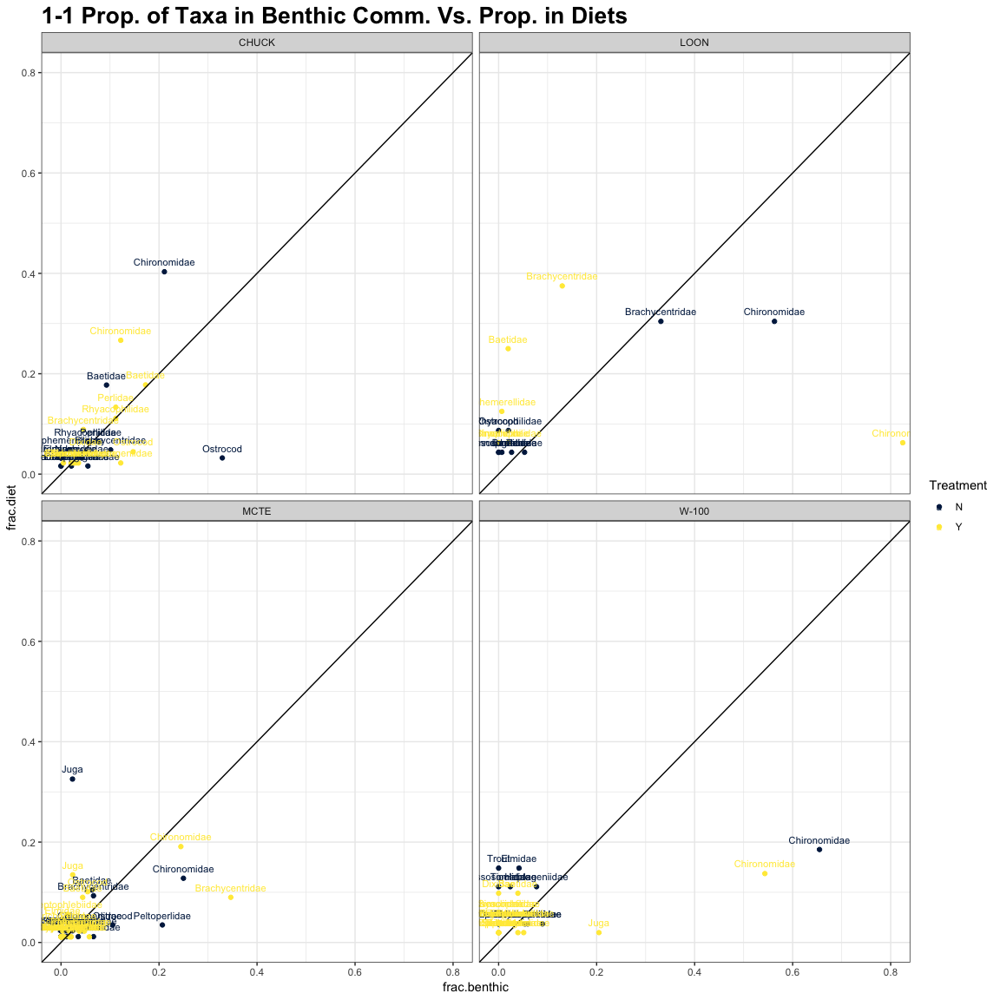
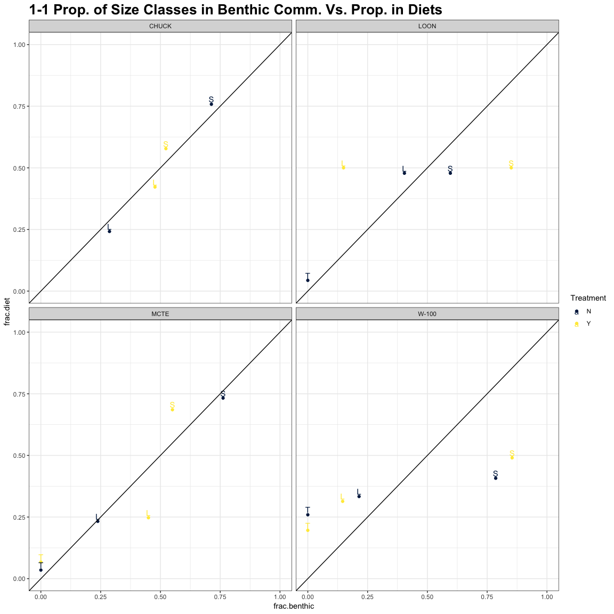
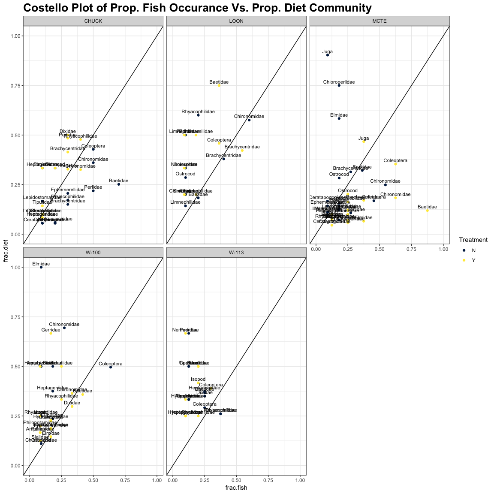
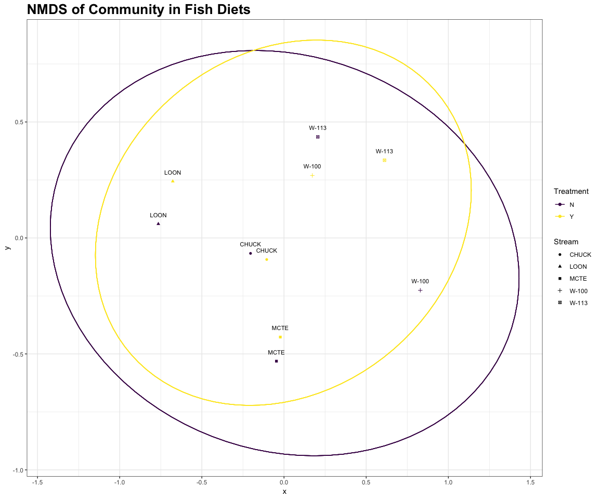

### Purpose of This Document
***

The goals here are to:

- Calculate the percent of each taxa in each fish's diet 

- Calculate the percent of fish with each specific taxa in its diet

- Do some NMDS up in heya

- Do some statistical analysis (TBD)

### Setup
***


Do some quick math's:


```r
#Calculations...
bugs$Density <- bugs$Count / bugs$PercentSub / .09

bugs$CollDate <- as.Date(bugs$CollDate, format = "%m/%d/%y") %>% year() %>% as.factor()

bugs.agg <- bugs %>%
  group_by(CollDate, Stream, Treatment, Taxon) %>%
  summarise_at(vars(Density), funs(sum)) %>% ungroup

bugs.agg$Density <- bugs.agg$Density / 3
```

***

Here we divide Count by percent subsampled (actually a fraction) to get a count for the total sample taken.  We then divide by .09 which is the area of the surber sampler (in m$^2$). After these adjustments have been made and the data aggregated (remember the data is structured so that each individual bug gets its own row, i.e. multiple occurances of "*Baetis*") we divide by three because at this point the three samples per reach in 2017 have been aggregated together and 2018 samples have been adjusted to the same value when dividing by percent sub.  (There were three samples taken per reach).


## Plots of Benthic Vs. Diet Community Composition {.tabset .tabset-fade .tabset-pills}
***

### By Family
***

<!-- -->

Plot of proportional abundance of an individual taxon in the benthic community versus the proportional abundance of the aggregate diets for that reach. 

Here we see that Chironomidae typically make up the greatest abundance of both the fish diets and the benthic community, with LOON being the exception (Brachycentridae are equally represented in the diets of control reach and over represented in the treatment). In MCTE, Juga compose a large part of the diets relative to their abundance due to one outlier fish. 

There are no overarching differences in how a taxa maps out given the treatment, but the difference in Brachycentridae in LOON between treatment and control is interesting.

### By FFG
***

<!-- -->

Plot of proportional abundance of an individual FFG in the benthic community versus the proportional abundance of the aggregate diets for that reach.

We see that Collector Gatherers and Shredders are the most abundant both in diets and in the benthic community.  There aren't any over arching trends in how FFG's fall out by treatment.


### By Size Class
***

<!-- -->

Plot of proportional abundance of an individual size class in the benthic community versus the proportional abundance of the aggregate diets for that reach.


### Costello method plot
***


<!-- -->

The Costello method plots % occurance of a taxon in fish versus % of aggregate diet. With the adjusted method the aggregate diet is only of fish that had the taxon present (ignoring zero values).  We see that in MCTE and in W-100 there seem to be just a couple fish that specifically target Juga and ELmidae respectively. In MCTE, the taxa from treatment diets seem to consistently constitute a smaller portion of the diet than would be expected given how many fish they occur in. 


### NMDS :metal:
***

Who knows what I'm actually doing, all of this ordination stuff is currently pre BOT 570.  I will definitely update all this once I know how to handle singleton taxa, loads of zero's, etc.


```
## Wisconsin double standardization
## Run 0 stress 0.09340359 
## Run 1 stress 0.1922124 
## Run 2 stress 0.09340359 
## ... New best solution
## ... Procrustes: rmse 7.26804e-07  max resid 1.212133e-06 
## ... Similar to previous best
## Run 3 stress 0.2191532 
## Run 4 stress 0.2310293 
## Run 5 stress 0.09340359 
## ... Procrustes: rmse 5.948112e-07  max resid 1.175791e-06 
## ... Similar to previous best
## Run 6 stress 0.09340359 
## ... Procrustes: rmse 8.540101e-07  max resid 1.463243e-06 
## ... Similar to previous best
## Run 7 stress 0.09340359 
## ... Procrustes: rmse 8.74563e-07  max resid 1.443987e-06 
## ... Similar to previous best
## Run 8 stress 0.09340359 
## ... Procrustes: rmse 6.802711e-07  max resid 1.048363e-06 
## ... Similar to previous best
## Run 9 stress 0.09340359 
## ... Procrustes: rmse 7.217648e-07  max resid 1.137817e-06 
## ... Similar to previous best
## Run 10 stress 0.1922124 
## Run 11 stress 0.1612039 
## Run 12 stress 0.1588546 
## Run 13 stress 0.09340359 
## ... Procrustes: rmse 1.30983e-06  max resid 2.034815e-06 
## ... Similar to previous best
## Run 14 stress 0.1922124 
## Run 15 stress 0.3083099 
## Run 16 stress 0.09340359 
## ... Procrustes: rmse 1.349635e-06  max resid 1.86787e-06 
## ... Similar to previous best
## Run 17 stress 0.09340359 
## ... Procrustes: rmse 1.031132e-06  max resid 1.554238e-06 
## ... Similar to previous best
## Run 18 stress 0.09340359 
## ... Procrustes: rmse 1.681068e-06  max resid 2.889129e-06 
## ... Similar to previous best
## Run 19 stress 0.2359417 
## Run 20 stress 0.2578782 
## *** Solution reached
```


The "display" argument can be set to "site" or "species" depending on what you want to group. "kind" can be standard deviation or standard error, not sure which to use here.


```r
# Fit the ellipse function to actual data
df_ell <- data.frame()
for(g in NMDS$Treatment){
  df_ell <- rbind(df_ell, cbind(as.data.frame(with(NMDS[NMDS$Treatment == g,],
                  vegan:::veganCovEllipse(ord[[g]]$cov, ord[[g]]$center, ord[[g]]$scale)))
                                ,Treatment = g))
}
```

not going to pretend like I know how this works, got it from https://stackoverflow.com/questions/13794419/plotting-ordiellipse-function-from-vegan-package-onto-nmds-plot-created-in-ggplo 
but I do know that changing the column selected from NMDS changes which variable is used for grouping.

<!-- -->

There seems to be total overlap of the diet communities in the control versus treatment reaches.  This seems to be consistent with what we saw in other plots.


### Summary Info. 


```r
group_by(bugs.agg, Stream, Treatment, CollDate) %>%
  summarise_at(vars(Density), funs(sum)) %>% 
  arrange(CollDate, Treatment) %>% 
  datatable(rownames = FALSE, class = "hover", filter = "top", options = list(pageLength = 10, scrollX=T), ) %>% formatRound("Density", digits = 2, interval = 3, 
                                          mark = ",", dec.mark = getOption("OutDec"))
```

<!--html_preserve--><div id="htmlwidget-87be1a7c0a44c1c17f58" style="width:100%;height:auto;" class="datatables html-widget"></div>
<script type="application/json" data-for="htmlwidget-87be1a7c0a44c1c17f58">{"x":{"filter":"top","filterHTML":"<tr>\n  <td data-type=\"character\" style=\"vertical-align: top;\">\n    <div class=\"form-group has-feedback\" style=\"margin-bottom: auto;\">\n      <input type=\"search\" placeholder=\"All\" class=\"form-control\" style=\"width: 100%;\"/>\n      <span class=\"glyphicon glyphicon-remove-circle form-control-feedback\"><\/span>\n    <\/div>\n  <\/td>\n  <td data-type=\"character\" style=\"vertical-align: top;\">\n    <div class=\"form-group has-feedback\" style=\"margin-bottom: auto;\">\n      <input type=\"search\" placeholder=\"All\" class=\"form-control\" style=\"width: 100%;\"/>\n      <span class=\"glyphicon glyphicon-remove-circle form-control-feedback\"><\/span>\n    <\/div>\n  <\/td>\n  <td data-type=\"factor\" style=\"vertical-align: top;\">\n    <div class=\"form-group has-feedback\" style=\"margin-bottom: auto;\">\n      <input type=\"search\" placeholder=\"All\" class=\"form-control\" style=\"width: 100%;\"/>\n      <span class=\"glyphicon glyphicon-remove-circle form-control-feedback\"><\/span>\n    <\/div>\n    <div style=\"width: 100%; display: none;\">\n      <select multiple=\"multiple\" style=\"width: 100%;\" data-options=\"[&quot;2017&quot;,&quot;2018&quot;]\"><\/select>\n    <\/div>\n  <\/td>\n  <td data-type=\"number\" style=\"vertical-align: top;\">\n    <div class=\"form-group has-feedback\" style=\"margin-bottom: auto;\">\n      <input type=\"search\" placeholder=\"All\" class=\"form-control\" style=\"width: 100%;\"/>\n      <span class=\"glyphicon glyphicon-remove-circle form-control-feedback\"><\/span>\n    <\/div>\n    <div style=\"display: none; position: absolute; width: 200px;\">\n      <div data-min=\"274.074074074074\" data-max=\"11506.1728395062\" data-scale=\"13\"><\/div>\n      <span style=\"float: left;\"><\/span>\n      <span style=\"float: right;\"><\/span>\n    <\/div>\n  <\/td>\n<\/tr>","data":[["CHUCK","LOON","MCTE","W-100","W-113","CHUCK","LOON","MCTE","W-100","W-113","CHUCK","LOON","MCTE","W-100","W-113","CHUCK","LOON","MCTE","W-100","W-113"],["N","N","N","N","N","Y","Y","Y","Y","Y","N","N","N","N","N","Y","Y","Y","Y","Y"],["2017","2017","2017","2017","2017","2017","2017","2017","2017","2017","2018","2018","2018","2018","2018","2018","2018","2018","2018","2018"],[892.592592592593,274.074074074074,2396.57996985032,1440.74074074074,829.62962962963,1466.66666666667,785.185185185185,1307.40740740741,2862.96296296296,766.666666666667,3740.74074074074,3176.36684303351,4908.46560955598,6231.48148148148,6822.22222495111,3377.77777823837,3308.64197530864,11506.1728395062,6644.44444471022,6697.77777804446]],"container":"<table class=\"hover\">\n  <thead>\n    <tr>\n      <th>Stream<\/th>\n      <th>Treatment<\/th>\n      <th>CollDate<\/th>\n      <th>Density<\/th>\n    <\/tr>\n  <\/thead>\n<\/table>","options":{"pageLength":10,"scrollX":true,"columnDefs":[{"className":"dt-right","targets":3}],"order":[],"autoWidth":false,"orderClasses":false,"orderCellsTop":true,"rowCallback":"function(row, data) {\nDTWidget.formatRound(this, row, data, 3, 2, 3, ',', '.');\n}"}},"evals":["options.rowCallback"],"jsHooks":[]}</script><!--/html_preserve-->


```r
group_by(bugs.by.year, Stream, CollDate) %>%
  summarise_at(vars(Diff), funs(sum)) %>% 
  arrange(CollDate) %>% 
  datatable(rownames = FALSE, class = "hover", filter = "top", options = list(pageLength = 10, scrollX=T), ) %>% formatRound("Diff", digits = 2, interval = 3, 
                                          mark = ",", dec.mark = getOption("OutDec"))
```

<!--html_preserve--><div id="htmlwidget-feac7433ac2cd3282d2b" style="width:100%;height:auto;" class="datatables html-widget"></div>
<script type="application/json" data-for="htmlwidget-feac7433ac2cd3282d2b">{"x":{"filter":"top","filterHTML":"<tr>\n  <td data-type=\"character\" style=\"vertical-align: top;\">\n    <div class=\"form-group has-feedback\" style=\"margin-bottom: auto;\">\n      <input type=\"search\" placeholder=\"All\" class=\"form-control\" style=\"width: 100%;\"/>\n      <span class=\"glyphicon glyphicon-remove-circle form-control-feedback\"><\/span>\n    <\/div>\n  <\/td>\n  <td data-type=\"factor\" style=\"vertical-align: top;\">\n    <div class=\"form-group has-feedback\" style=\"margin-bottom: auto;\">\n      <input type=\"search\" placeholder=\"All\" class=\"form-control\" style=\"width: 100%;\"/>\n      <span class=\"glyphicon glyphicon-remove-circle form-control-feedback\"><\/span>\n    <\/div>\n    <div style=\"width: 100%; display: none;\">\n      <select multiple=\"multiple\" style=\"width: 100%;\" data-options=\"[&quot;2017&quot;,&quot;2018&quot;]\"><\/select>\n    <\/div>\n  <\/td>\n  <td data-type=\"number\" style=\"vertical-align: top;\">\n    <div class=\"form-group has-feedback\" style=\"margin-bottom: auto;\">\n      <input type=\"search\" placeholder=\"All\" class=\"form-control\" style=\"width: 100%;\"/>\n      <span class=\"glyphicon glyphicon-remove-circle form-control-feedback\"><\/span>\n    <\/div>\n    <div style=\"display: none; position: absolute; width: 200px;\">\n      <div data-min=\"-1089.17256244291\" data-max=\"6597.70722995019\" data-scale=\"14\"><\/div>\n      <span style=\"float: left;\"><\/span>\n      <span style=\"float: right;\"><\/span>\n    <\/div>\n  <\/td>\n<\/tr>","data":[["CHUCK","LOON","MCTE","W-100","W-113","CHUCK","LOON","MCTE","W-100","W-113"],["2017","2017","2017","2017","2017","2018","2018","2018","2018","2018"],[574.074074074074,511.111111111111,-1089.17256244291,1422.22222222222,-62.9629629629629,-362.962962502372,132.275132275132,6597.70722995019,412.962963228741,-124.444446906653]],"container":"<table class=\"hover\">\n  <thead>\n    <tr>\n      <th>Stream<\/th>\n      <th>CollDate<\/th>\n      <th>Diff<\/th>\n    <\/tr>\n  <\/thead>\n<\/table>","options":{"pageLength":10,"scrollX":true,"columnDefs":[{"className":"dt-right","targets":2}],"order":[],"autoWidth":false,"orderClasses":false,"orderCellsTop":true,"rowCallback":"function(row, data) {\nDTWidget.formatRound(this, row, data, 2, 2, 3, ',', '.');\n}"}},"evals":["options.rowCallback"],"jsHooks":[]}</script><!--/html_preserve-->


```r
group_by(bugs.by.year, Stream, CollDate, FFG) %>%
  summarise_at(vars(Diff), funs(sum)) %>% 
  arrange(CollDate) %>% 
  datatable(rownames = FALSE, class = "hover", filter = "top", options = list(pageLength = 10, scrollX=T), ) %>% formatRound("Diff", digits = 2, interval = 3, 
                                          mark = ",", dec.mark = getOption("OutDec"))
```

<!--html_preserve--><div id="htmlwidget-480ec8ae3e5580f49817" style="width:100%;height:auto;" class="datatables html-widget"></div>
<script type="application/json" data-for="htmlwidget-480ec8ae3e5580f49817">{"x":{"filter":"top","filterHTML":"<tr>\n  <td data-type=\"character\" style=\"vertical-align: top;\">\n    <div class=\"form-group has-feedback\" style=\"margin-bottom: auto;\">\n      <input type=\"search\" placeholder=\"All\" class=\"form-control\" style=\"width: 100%;\"/>\n      <span class=\"glyphicon glyphicon-remove-circle form-control-feedback\"><\/span>\n    <\/div>\n  <\/td>\n  <td data-type=\"factor\" style=\"vertical-align: top;\">\n    <div class=\"form-group has-feedback\" style=\"margin-bottom: auto;\">\n      <input type=\"search\" placeholder=\"All\" class=\"form-control\" style=\"width: 100%;\"/>\n      <span class=\"glyphicon glyphicon-remove-circle form-control-feedback\"><\/span>\n    <\/div>\n    <div style=\"width: 100%; display: none;\">\n      <select multiple=\"multiple\" style=\"width: 100%;\" data-options=\"[&quot;2017&quot;,&quot;2018&quot;]\"><\/select>\n    <\/div>\n  <\/td>\n  <td data-type=\"character\" style=\"vertical-align: top;\">\n    <div class=\"form-group has-feedback\" style=\"margin-bottom: auto;\">\n      <input type=\"search\" placeholder=\"All\" class=\"form-control\" style=\"width: 100%;\"/>\n      <span class=\"glyphicon glyphicon-remove-circle form-control-feedback\"><\/span>\n    <\/div>\n  <\/td>\n  <td data-type=\"number\" style=\"vertical-align: top;\">\n    <div class=\"form-group has-feedback\" style=\"margin-bottom: auto;\">\n      <input type=\"search\" placeholder=\"All\" class=\"form-control\" style=\"width: 100%;\"/>\n      <span class=\"glyphicon glyphicon-remove-circle form-control-feedback\"><\/span>\n    <\/div>\n    <div style=\"display: none; position: absolute; width: 200px;\">\n      <div data-min=\"-788.888888888889\" data-max=\"3322.75132266549\" data-scale=\"15\"><\/div>\n      <span style=\"float: left;\"><\/span>\n      <span style=\"float: right;\"><\/span>\n    <\/div>\n  <\/td>\n<\/tr>","data":[["CHUCK","CHUCK","CHUCK","CHUCK","CHUCK","CHUCK","LOON","LOON","LOON","LOON","LOON","LOON","MCTE","MCTE","MCTE","MCTE","MCTE","MCTE","W-100","W-100","W-100","W-100","W-100","W-100","W-113","W-113","W-113","W-113","W-113","W-113","CHUCK","CHUCK","CHUCK","CHUCK","CHUCK","CHUCK","LOON","LOON","LOON","LOON","LOON","LOON","MCTE","MCTE","MCTE","MCTE","MCTE","MCTE","W-100","W-100","W-100","W-100","W-100","W-100","W-113","W-113","W-113","W-113","W-113","W-113"],["2017","2017","2017","2017","2017","2017","2017","2017","2017","2017","2017","2017","2017","2017","2017","2017","2017","2017","2017","2017","2017","2017","2017","2017","2017","2017","2017","2017","2017","2017","2018","2018","2018","2018","2018","2018","2018","2018","2018","2018","2018","2018","2018","2018","2018","2018","2018","2018","2018","2018","2018","2018","2018","2018","2018","2018","2018","2018","2018","2018"],["CF","CG","P","SCe","SCi","SH","CF","CG","P","SCe","SCi","SH","CF","CG","P","SCe","SCi","SH","CF","CG","P","SCe","SCi","SH","CF","CG","P","SCe","SCi","SH","CF","CG","P","SCe","SCi","SH","CF","CG","P","SCe","SCi","SH","CF","CG","P","SCe","SCi","SH","CF","CG","P","SCe","SCi","SH","CF","CG","P","SCe","SCi","SH"],[55.5555555555556,244.444444444444,203.703703703704,81.4814814814815,-33.3333333333333,22.2222222222222,14.8148148148148,296.296296296296,74.0740740740741,11.1111111111111,33.3333333333333,81.4814814814815,29.6296296296296,25.6422523719006,-303.703703703704,-111.111111111111,59.2592592592593,-788.888888888889,44.4444444444444,825.925925925926,166.666666666667,-85.1851851851852,374.074074074074,96.2962962962963,-11.1111111111111,-77.7777777777778,85.1851851851852,-33.3333333333333,59.2592592592593,-85.1851851851852,-634.567901180283,-199.999999875496,-25.9259258509736,467.901234660244,-250.617283918154,280.246913662291,-12.3456790123457,382.716049382716,-61.7283950617284,37.037037037037,-331.569664902998,118.165784832452,576.719576600227,2070.37036991782,714.873603646644,100.529100492842,3322.75132266549,-187.536743372828,-288.888888887111,862.962963116741,-326.851851831407,66.6666666871111,199.074074136296,-99.9999999928889,-288.888889044444,-600.000001368,-235.55555585421,288.888888724445,488.888888660445,222.222221975111]],"container":"<table class=\"hover\">\n  <thead>\n    <tr>\n      <th>Stream<\/th>\n      <th>CollDate<\/th>\n      <th>FFG<\/th>\n      <th>Diff<\/th>\n    <\/tr>\n  <\/thead>\n<\/table>","options":{"pageLength":10,"scrollX":true,"columnDefs":[{"className":"dt-right","targets":3}],"order":[],"autoWidth":false,"orderClasses":false,"orderCellsTop":true,"rowCallback":"function(row, data) {\nDTWidget.formatRound(this, row, data, 3, 2, 3, ',', '.');\n}"}},"evals":["options.rowCallback"],"jsHooks":[]}</script><!--/html_preserve-->

